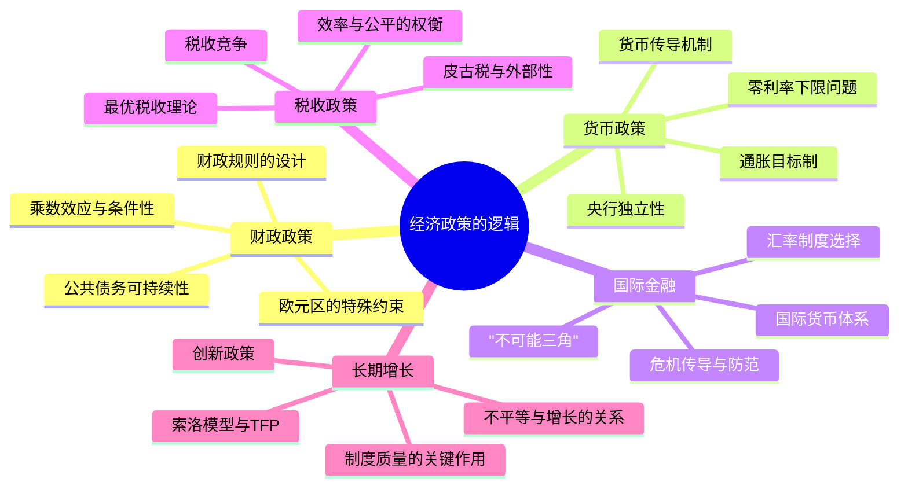

## 《经济政策：理论与实践》读书笔记 
  
### 作者  
digoal  
  
### 日期  
2026-05-30 
  
### 标签  
读书笔记 , 经济政策：理论与实践  
  
----  
  
## 背景 
  
  
---
书名: 《经济政策：理论与实践》  
作者: 阿格尼丝·贝纳西-奎里 / 贝努瓦·科尔 / 皮埃·雅克 / 让·皮萨尼-费里  
出版年份: 2010（英文原版）/ 2015（中译本）  
出版社: 牛津大学出版社（原版）/ 中国人民大学出版社（译本）  
笔记日期: 2026-05-30  
ISBN: 9787300219219  
标签: [宏观经济学, 财政政策, 货币政策, 国际金融, 经济政策, 欧洲经济]  
---

  
  
> **一句话**：一本由四位真正在政府和学界两栖的法国经济学家写给"想读懂政策逻辑"之人的教科书——它不告诉你政策是对还是错，而是教你用什么框架来判断。  
>  
> **适合谁读**：经济学研究生、政策研究者、财经媒体从业者、想搞懂"央行为什么这么做"的进阶读者  
>  
> **阅读难度**：⭐⭐⭐⭐☆（有一定经济学基础才能顺畅阅读）  
>  
> **推荐指数**：⭐⭐⭐⭐☆  
  
---

## 一、时代坐标：这本书从哪里来？

2008年，全球金融危机爆发。各国政府争相出台救市政策，央行史无前例地将利率降至零、开启量化宽松，财政刺激计划规模动辄数万亿。然而，同样是"刺激经济"，美国、欧洲、日本的政策路径却截然不同；同样是"紧缩财政"，希腊、德国的结果也天差地别。

为什么？

这是四位法国顶尖经济学家在2010年出版这本书时，试图系统回答的大问题。他们不是书斋里的纯学者，而是真正在政府和国际机构操过刀的人：

- **贝纳西-奎里**：法国经济分析委员会主席、欧洲央行监管委员会成员，专攻国际货币体系
- **科尔**：欧洲央行执行委员会成员，曾掌管法国债务管理局，是巴黎俱乐部联合主席
- **雅克**：法国开发署首席经济学家，后任全球发展网络主席
- **皮萨尼-费里**：欧洲智库Bruegel创始人，后担任法国总理经济政策规划主任

这四个人的共同特征是：**一脚踩在学术、一脚踩在政策**。他们深知理论的优雅与政策的泥泞之间有多大的鸿沟——这本书，就是试图架设这座桥梁的产物。

书的诞生直接源于他们多年在巴黎综合理工、科学与政治学院等顶尖院校教授"经济政策"研究生课程的积累。十年教学经验加上亲身政策实践，使这本书具有极罕见的气质：**它既不回避数学模型，又从不让技术细节遮蔽政策判断**。

```
时间轴：

1990s──→ 欧洲货币联盟筹建
           ↓
2008──→ 全球金融危机爆发
           ↓
2009──→ G20协调全球刺激计划
           ↓
2010──→ 本书出版（英文第一版）
           欧债危机开始发酵
           ↓
2015──→ 中译本出版
           ↓
2019──→ 第二版更新（纳入欧元区危机、新兴市场挑战等新内容）
```

---

## 二、核心命题：作者在说什么？

本书没有一个单一论点，而是提供了一套**分析经济政策问题的完整元框架**。但贯穿全书的有三个核心主张，值得单独拎出来。

### 命题一：政策判断必须同时回答三个维度

作者明确指出，任何一项经济政策都要从三个维度来审视：

```
┌────────────────────────────────────────────────────┐
│   实证维度（Positive）：政策如何影响经济？          │
│   规范维度（Normative）：政策应追求什么目标？       │
│   政治经济维度（Political Economy）：              │
│                现实的约束和障碍是什么？             │
└────────────────────────────────────────────────────┘
```

这三个维度的区分，是本书最根本的方法论贡献。太多的政策争论，都是因为参与者混淆了这三层——有人在讲"事实"，有人在讲"价值观"，有人在讲"可行性"，却都以为自己在讲同一件事。

### 命题二：政策有效性受制于制度约束与预期管理

作者们反复强调一个反直觉的结论：**在理论上最优的政策，在现实中未必有效，甚至可能适得其反**。

以财政政策为例：教科书说"政府增加支出，GDP就会增加"。但这个结论成立，需要满足：居民不会因为预期未来加税而削减消费（即"李嘉图等价"不成立）、货币政策不会相应收紧、国际资本不会大规模外流等一系列条件。当这些条件不满足时，财政乘数可能接近于零，甚至为负。

这不是否定政府干预，而是说：**政策工具的效力，取决于它被嵌入的制度环境和公众预期**。

### 命题三：全球化使得国内政策的外部性日益突出

这是本书最有前瞻性的洞察之一。在一个资本自由流动、贸易高度整合的世界里，一国的货币政策会影响他国的汇率；一国的财政刺激会通过贸易渠道外溢给邻国；各国税收竞争会导致全球税基被侵蚀。

作者因此提出：现代经济政策必须同时具备**国内政策协调**和**国际政策协调**两个视角，孤立地思考任何一国的经济政策都是不完整的。

---

## 三、论证地图：作者怎么说服你的？



本书最聪明的地方在于**体例设计**：每一章都以一个真实历史政策困境开场，然后引入理论工具，再回到政策实践讨论。这个"历史案例 → 理论模型 → 政策含义"的三段式结构，让读者不会陷入纯粹的数学推导，也不会止步于肤浅的政策描述。

技术盒子（Technical Boxes）的运用也很精妙——把数学推导放进盒子里，不影响不懂数学的读者读懂主干，也让想深入的读者有据可查。

论证中引用的案例既有美国、欧洲这些成熟经济体，也大量涉及新兴市场和发展中国家，视野是真正全球化的，这在同类欧美教材中并不多见。

---

## 四、前提假设与边界：什么情况下这不成立？

这本书建立在几个关键假设之上，值得认真审视：

**假设一：理性预期与市场均衡是基准**

书中大量分析以新凯恩斯主义框架为基础，假设经济主体有理性预期，市场在长期趋于均衡。但2008年金融危机之后，行为经济学的研究已充分表明，人的预期系统性地偏离理性，市场可以长期偏离均衡。书中对这一挑战虽有所意识，但处理得不够彻底。

**假设二：政策当局有足够信息和执行力**

理论上的最优政策往往假设政策制定者知道关键参数（如产出缺口、自然利率），并且能准确、及时地执行政策。现实中，这些参数估计充满不确定性，政策实施也有滞后。作者对此有所警示，但理论和实践之间的"执行鸿沟"仍被低估。

**假设三：全球化的制度框架大体稳定**

这本书写于2010年前后，那个年代普遍相信全球化将继续深化，多边合作框架（IMF、WTO、G20）会持续发挥约束作用。但过去十年，保护主义回潮、地缘政治碎片化、美元霸权受到挑战，书中关于"国际政策协调"的乐观预设正面临严峻考验。

---

## 五、思想谱系：这本书在哪个传统里？

这本书明显植根于**法国-欧洲政策经济学传统**，与英美主流宏观经济学教材有微妙但重要的差异。法国经济学界历来重视政策分析的实践性和制度嵌入性，对纯粹数学化的新古典传统保持适当距离。

从理论谱系上，本书综合吸收了：

```
凯恩斯主义（需求管理）
        +
货币主义（通胀预期锚定）
        +
新古典综合（动态一般均衡）
        +
制度经济学（规则vs.相机抉择）
        ↓
   新凯恩斯主义综合框架
   （本书的理论基础）
```

与同类教材相比：

- 比布兰查德的《宏观经济学》更关注政策实操，不局限于理论推导
- 比萨克斯-拉雷恩《全球视角宏观经济学》更重视制度分析和政治经济约束
- 比伍德福德的《利率与价格》更面向政策实践者，数学密度更低

本书的历史意义在于，它填补了"学术宏观经济学"与"实际政策操作"之间的真实空白——这个空白其实是大多数经济学教育的盲区。

---

## 六、我学到了什么？

读这本书最大的收获，是建立了一种**对经济政策新闻的"三问"习惯**：

**第一问：这项政策的传导机制是什么？**

当央行宣布降息，不是简单地说"好，利率降了，投资会增加"，而是要问：降息通过什么渠道影响实体经济？是降低借贷成本？是刺激资产价格上涨带来的财富效应？还是通过汇率贬值刺激出口？不同的传导渠道，意味着不同的效果和风险分布。

**第二问：谁在承担这项政策的成本？**

没有免费的政策。财政刺激的钱从哪来，最终由谁偿还？货币宽松带来的通胀侵蚀了谁的财富？汇率贬值得利的是出口商，但进口成本上升由谁来承担？这本书教会我：每一项政策都是一次分配选择，没有绕开分配的"纯技术"政策。

**第三问：这项政策在当前的制度约束下能走多远？**

同样是财政扩张，在拥有本币债务发行权、通胀预期稳定的国家（如美国），和在使用欧元、缺乏货币政策工具的国家（如希腊），完全是两回事。制度框架的差异，决定了政策空间的差异。

这三问彻底改变了我读财经新闻的方式。

---

## 七、举一反三：这个框架还能用在哪？

本书的核心方法论——**"正面维度 + 规范维度 + 政治经济约束"三层分析**——具有极强的迁移性。

**场景一：理解碳税争议**

为什么碳税在经济学家中几乎是共识，在政治上却举步维艰？用三层框架一拆：实证上，碳税确实能减少碳排放（大量研究支持）；规范上，减排是否值得以及代际公平如何衡量，存在真实的价值分歧；政治经济上，碳税让高碳行业工人和低收入家庭承担成本，而受益（未来的气候）是弥散的和长期的——这个不对称决定了反对力量的政治动员能力远强于支持力量。

**场景二：分析央行数字货币（CBDC）争论**

各国央行是否应发行CBDC？实证维度：CBDC如何影响商业银行存款？规范维度：支付效率和金融包容性是否值得以银行脱媒风险为代价？政治经济维度：商业银行的游说力量、数据隐私的公众敏感度。三层同时展开，争论的结构立刻清晰。

---

## 八、批判与反思

这本书的局限，恰恰隐藏在它的优点里。

**它太"欧洲中心"了**。尽管作者声称覆盖了发展中国家和新兴市场，但全书的分析框架和政策建议，骨子里是为成熟市场经济体设计的。对中国、印度这类体量巨大、制度特殊的"非西方现代化"路径，本书几乎没有真正有深度的讨论。

**它对"政策失败"的分析不够勇敢**。书中大量篇幅在讨论"好的政策应该如何设计"，但对历史上政策灾难的深层政治原因——为什么理性的经济学家在政策过程中反复失败？为什么坏政策往往能持续很久？——分析仍然表面。这是主流经济学普遍的软肋：太重技术、太轻政治。

**金融危机之后的世界变了**。2010年版的写作背景，仍然基于某种"政策能够精调宏观经济"的信心。而2008年之后的十五年反复告诉我们：货币政策零利率下限是真实约束、财政乘数比想象的更不稳定、央行独立性比预想的更脆弱。2019年出版的第二版对此有所更新，但中译本（2015年）读者需要注意这个时效问题。

---

## 九、金句与记忆点

1. **"政策工具的效力，取决于它被嵌入的制度环境。"**
   ——没有放之四海皆准的政策处方，这是本书最根本的反教条主义立场。

2. **"'不可能三角'是所有汇率政策讨论的起点：货币政策独立性、汇率稳定、资本自由流动，三者只能得其二。"**
   ——蒙代尔的这个框架，本书用它统摄了几乎全部国际金融讨论。

3. **"财政乘数的大小不是一个固定的技术参数，它随宏观环境、货币政策立场和预期机制的变化而变化。"**
   ——这句话直接挑战了政策辩论中的大量简单化论断。

4. **"货币政策的核心任务，是管理经济主体对未来通胀和利率的预期，而非仅仅是当下的利率设定。"**
   ——央行的真正武器是"预期"，这是理解现代货币政策的关键。

5. **"全球化没有消除经济波动，它只是改变了波动的传导方式。"**
   ——今天理解大宗商品价格冲击、供应链危机的概念框架。

6. **"最优税收理论告诉我们，对无弹性的税基征税效率损失最小——但这往往意味着对穷人征税更多，因为穷人的劳动供给和消费弹性更低。"**
   ——效率与公平之间真正的紧张关系，不是修辞，是数学。

7. **"在开放经济体中，任何单一国家的经济政策都会对他国产生溢出效应；忽视这一点的政策协调，是没有协调。"**
   ——理解G20、IMF存在的理由，也是理解贸易战逻辑的基础。

---

## 十、延伸阅读

**1.《货币政策的艺术》——伯南克**
本书讲理论框架，伯南克的回忆录讲实战：同一套工具，在危机现场如何被使用和变形。两本配合读，能看到理论与实践之间真实的距离。

**2.《这次不同：八百年金融愚蠢史》——莱因哈特 & 罗格夫**
本书对"金融稳定政策"的讨论相对较短，莱因哈特和罗格夫用历史数据系统揭示金融危机的规律性，是极好的补充。

**3.《增长的极限》（再版）与皮凯蒂《21世纪资本论》**
本书对长期增长和不平等各有一章，但篇幅有限。皮凯蒂的工作彻底重构了对长期不平等的理解，是本书相关章节的深度升级版。

**4.《汇率经济学》——克鲁格曼 & 奥伯斯特费尔德《国际经济学》**
本书第四章国际金融部分，如想深入汇率和国际收支机制，克鲁格曼的国际经济学教材是最好的下一步。

**5.《货币政策：理论与实践》——伍德福德**
对货币政策章节想要数学化深度的读者，伍德福德的《利率与价格》（Interest and Prices）是目前最严格的理论处理，难度更高，但奠基性更强。

---

*笔记写于 2026-05-30 | 基于公开学术资料、作者背景信息与深度思考整理*
*参考来源：牛津大学出版社书目、Amazon编辑评论、PhilPapers学术数据库、作者公开履历*
  
  
#### [PostgreSQL 解决方案集合](../201706/20170601_02.md "40cff096e9ed7122c512b35d8561d9c8")
  
  
#### [德哥 / digoal's Github - 公益是一辈子的事.](https://github.com/digoal/blog/blob/master/README.md "22709685feb7cab07d30f30387f0a9ae")
  
  
#### [About 德哥](https://github.com/digoal/blog/blob/master/me/readme.md "a37735981e7704886ffd590565582dd0")
  
  

  
