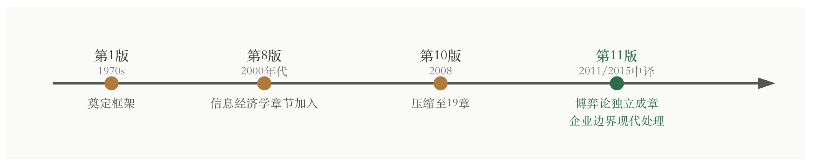
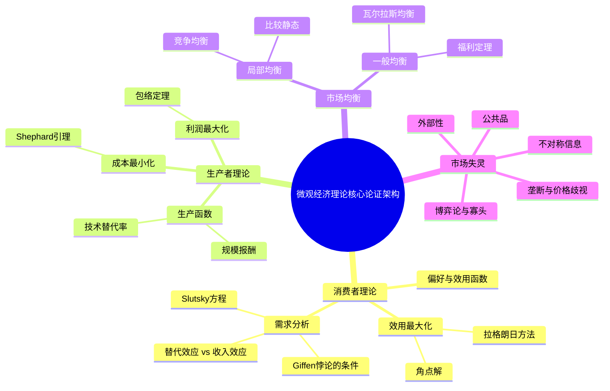
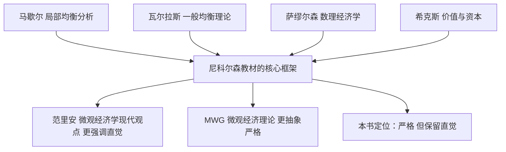

## 《微观经济理论：基本原理与扩展》读书笔记 
  
### 作者  
digoal  
  
### 日期  
2026-05-30 
  
### 标签  
读书笔记 , 微观经济理论：基本原理与扩展  
  
----  
  
## 背景 
  
  

---
书名: 《微观经济理论：基本原理与扩展（第11版）》  
作者: 克里斯托弗·斯奈德 / 沃尔特·尼科尔森  
出版年份: 2015  
笔记日期: 2026-05-30  
出版社: 北京大学出版社  
ISBN: 9787301262528  
标签: [微观经济学, 经济学教材, 中高级微观, 考研, 数理经济学]  
---

    

> **一句话**：用数学的骨骼，撑起经济学的血肉——这是一本让你真正"看见"市场运作逻辑的中高级教科书。  
> **适合谁读**：已具备初级微观基础（读过曼昆或范里安），想向中高级迈进的经济学学生；备考北大、人大、复旦等名校经济学研究生的考生；对价格机制、博弈与福利分析有深度兴趣的自学者。  
> **阅读难度**：⭐⭐⭐⭐☆（需要多元微积分和基础优化理论）  
> **推荐指数**：⭐⭐⭐⭐⭐  
  
---

## 一、时代坐标：这本书从哪里来？

尼科尔森（Walter Nicholson）是阿姆赫斯特学院经济学荣休教授，麻省理工学院经济学博士，研究重心在劳动经济学；斯奈德（Christopher Snyder）是达特茅斯学院经济学教授，同样毕业于MIT，研究领域包括产业组织和法律经济学。两位学者的学术背景有一个共同特征：都经过了MIT那套"数学即工具、直觉是目的"的严格训练。

这本书从第一版算起，已经历经几十年、跨越十一个版本的打磨。它诞生于一个特定的学术需求：在曼昆式入门教材和马斯科莱尔（MWG）式博士教材之间，存在一片巨大的空白地带。进入这片地带的学生，需要一本既有严格数学推导、又不失经济直觉的桥梁型教材。

第11版做出了几项值得关注的结构调整：将不确定性与博弈论拆分成独立章节，新增了对企业边界和企业目标的现代处理，并对数学工具部分做了全面修订，使其更贴近当代经济学文献的实际用法。这些改动的背后，是过去二十年行为经济学、信息经济学和机制设计的蓬勃发展——主流微观理论的边界在不断扩张，教材也在同步迭代。
  
  
  
  
<svg viewBox="0 0 680 130" xmlns="http://www.w3.org/2000/svg" font-family="serif">
  <!-- Timeline background -->
  <rect x="0" y="0" width="680" height="130" fill="#fafaf8"/>
  <!-- Main timeline -->
  <line x1="40" y1="65" x2="640" y2="65" stroke="#555" stroke-width="2"/>
  <!-- Arrows -->
  <polygon points="640,60 655,65 640,70" fill="#555"/>
  <!-- Nodes -->
  <circle cx="90" cy="65" r="6" fill="#b07a3a"/>
  <circle cx="220" cy="65" r="6" fill="#b07a3a"/>
  <circle cx="370" cy="65" r="6" fill="#b07a3a"/>
  <circle cx="520" cy="65" r="6" fill="#2c6e49"/>
  <!-- Labels above -->
  <text x="90" y="45" text-anchor="middle" font-size="12" fill="#333">第1版</text>
  <text x="90" y="58" text-anchor="middle" font-size="10" fill="#777">1970s</text>
  <text x="220" y="45" text-anchor="middle" font-size="12" fill="#333">第8版</text>
  <text x="220" y="58" text-anchor="middle" font-size="10" fill="#777">2000年代</text>
  <text x="370" y="45" text-anchor="middle" font-size="12" fill="#333">第10版</text>
  <text x="370" y="58" text-anchor="middle" font-size="10" fill="#777">2008</text>
  <text x="520" y="45" text-anchor="middle" font-size="12" fill="#2c6e49" font-weight="bold">第11版</text>
  <text x="520" y="58" text-anchor="middle" font-size="10" fill="#777">2011/2015中译</text>
  <!-- Labels below -->
  <text x="90" y="85" text-anchor="middle" font-size="10" fill="#555">奠定框架</text>
  <text x="220" y="85" text-anchor="middle" font-size="10" fill="#555">信息经济学章节加入</text>
  <text x="370" y="85" text-anchor="middle" font-size="10" fill="#555">压缩至19章</text>
  <text x="520" y="85" text-anchor="middle" font-size="10" fill="#2c6e49">博弈论独立成章</text>
  <text x="520" y="100" text-anchor="middle" font-size="10" fill="#2c6e49">企业边界现代处理</text>
</svg>
  

---

## 二、核心命题：作者在说什么？

这本书表面上是教材，骨子里却在传递三个核心主张，值得单独提炼。

### 命题一：优化是经济学的第一原理

整本书的结构是围绕"约束下的最优化"展开的。消费者在预算约束下最大化效用，企业在技术约束下最大化利润，社会计划者在资源约束下最大化福利。这不只是数学技巧，而是一种世界观的表达：**人类行为是可以用理性极值来刻画的**。

书中从拉格朗日乘数法出发，逐步引出包络定理、Slutsky方程、Roy恒等式、Shephard引理……每一个数学结论，都是"理性人优化"这一假设在不同情境下的具体展开。这种推演方式，是理解当代主流经济学"为什么这样建模"的核心钥匙。

### 命题二：价格是信息的载体，市场是协调的机制

从局部均衡到第13章的一般均衡与福利分析，书中一直在论证同一件事：在完全竞争条件下，价格信号能够协调分散的个人决策，实现全社会资源的帕累托最优配置。这是亚当·斯密"看不见的手"的数学版本——瓦尔拉斯均衡存在性与福利定理的形式化证明。

但作者没有止步于赞美市场。从第14章垄断开始，一直到外部性、公共品、不对称信息，全书后半段都在系统展示市场失灵的各种形态及其福利代价。这种"先证明市场有效，再讨论何时失效"的结构，是规范的经济学研究方法论。

### 命题三：不确定性与信息是现代微观的核心疆域

第11版将不确定性（第7章）和博弈论（第8章）独立出来，不是偶然的排版决策，而是对当代微观经济学研究重心迁移的回应。期望效用理论、风险厌恶、实物期权、纳什均衡、不完全信息博弈……这些工具，已经成为理解金融市场、公共政策、产业竞争的标配框架。书中用独立篇幅对待它们，是课程设计上值得肯定的判断。

---

## 三、论证地图：作者怎么说服你的？

**论证方式的特点**

书中有一个非常固定的写作范式：先用几何图形建立直觉（无差异曲线、等成本线、供需图），然后用微积分给出精确表达，最后通过"Extensions"（扩展部分）将结论推向更一般的情形。这种"几何→代数→扩展"的三层结构，是尼科尔森写作风格的标志。

对于初学者来说，这套范式有一个潜在的陷阱：几何部分看起来简单，代数部分突然跳跃，如果没有耐心在中间反复对照，容易产生"能看懂图，但不会算题"的割裂感。

---

## 四、前提假设与边界：什么情况下这不成立？

### 假设一：理性人假设

全书的推导依赖"消费者偏好满足完备性、传递性、连续性"等公理。但行为经济学（卡尼曼、塞勒等人的研究）大量记录了系统性的非理性偏差——损失厌恶、锚定效应、双曲贴现……这本书对行为经济学的吸收极为有限，主要集中在课后习题的延伸部分，而非正文框架。

### 假设二：完全信息或信息可以被精确刻画

书中的不对称信息章节（第18章）处理了逆向选择和道德风险的经典模型，但现实中的信息不完整往往更加复杂——信息不止"对称/不对称"，还有"不知道自己不知道什么"的奈特不确定性（Knightian Uncertainty）。书中的处理框架在这一维度上偏于理想化。

### 假设三：市场结构是给定的

书中分析垄断、寡头时，市场结构被视为外生条件。但在现实中，市场结构本身是企业战略行为（并购、专利、平台效应）的结果。产业组织领域的研究已经大幅超越了本书的处理深度，本书在这里更像入门，而非终点。

---

## 五、思想谱系：这本书在哪个传统里？

这本书深植于新古典经济学的核心传统，具体说，是**阿罗-德布鲁（Arrow-Debreu）框架下的瓦尔拉斯一般均衡理论**，辅以萨缪尔森的"显示偏好理论"和希克斯的消费者理论。

在微观教材谱系中，它的位置非常清晰：**比范里安更注重数学推导，比MWG（马斯科莱尔、温斯顿、格林）更保留经济直觉**。这恰好是国内"中高级微观"课程的教学需求，也是它在中国考研市场成为指定参考书的根本原因。

北京大学、中国人民大学（802经济学综合）、复旦大学等名校的经济学研究生入学考试，均将本书列为核心参考书目。

---

## 六、我学到了什么？

**收获一：数学不是装饰，是约束条件本身**

读这本书之前，我对拉格朗日乘数法的理解停留在"一种解方程的技巧"。读完之后，我才意识到：乘子λ本身就是经济意义的载体——它代表"放松一单位约束所带来的最大效用增量"，也就是约束的影子价格。数学结构和经济含义是同一件事的两面，不是翻译关系。

**收获二：Slutsky方程是消费者行为的X光片**

价格上涨导致需求下降，这谁都知道。但Slutsky方程告诉你这个下降是由两个方向相反的力量构成的：替代效应（价格变了，相对价格变了，所以替代）和收入效应（价格变了，实际购买力变了，所以调整数量）。Giffen品之所以存在，是因为某些商品的负收入效应足够强，可以反转替代效应的方向。这个分解框架，是所有价格政策分析的起点。

**收获三：均衡不是"自然"状态，是假设堆出来的结果**

一般均衡章节最让我震动的，不是帕累托定理本身，而是达到这个结论所需要的假设清单：完全竞争、无外部性、完全信息、凸性偏好……每放松一个假设，就进入一个独立的失灵领域。市场是有条件地有效的，这是理解所有经济政策争论的认识论前提。

---

## 七、举一反三：这个框架还能用在哪？

**场景一：分析公共政策的福利效应**

政府征税或补贴，本质上是改变价格信号。用Slutsky分解可以计算税收的"超额负担"（deadweight loss）——这不只是教材里的例题，而是财政部门评估政策代价的实际工具。理解了替代效应和收入效应的分解，就能理解为什么对奢侈品征税的扭曲效率损失比对必需品征税更大。

**场景二：理解企业竞争策略**

博弈论章节中的纳什均衡，是分析寡头竞争（价格战、产能竞赛、广告投入）的标准框架。现实中的价格战为什么往往让所有企业都受损却难以停止？囚徒困境在重复博弈中如何被打破？这套工具直接对应商业实践中的战略分析。

**场景三：理解金融市场**

不确定性章节中的期望效用理论和风险厌恶系数，是定价理论（CAPM模型）和保险定价的微观基础。实物期权的处理方式，更是直接应用于项目投资的价值评估。

---

## 八、批判与反思

**批评一：对行为经济学的吸收太少**

这本书的第11版出版于2011年，彼时行为经济学已经在学术界产生了巨大影响。然而书中对前景理论、系统性偏误的处理几乎可以忽略不计。理性人假设作为分析基础固然有其价值，但完全不介绍其局限，对学生未来阅读实证文献是个障碍。

**批评二：中文译本质量参差不齐**

豆瓣上对早期版本译文有相当严厉的批评——"随意删减段落，乱改原意"。第11版的翻译质量有所改善，但对于读书过程中遇到表述费解之处，建议备一本原版对照，不要轻易归因于"原书就这样"。

**批评三：现实案例偏少，抽象度较高**

相较于范里安（Varian）的《微观经济学：现代观点》，这本书的案例密度较低，很多推导止步于数学形式，而没有充分展示"这个结论在真实世界中的对应是什么"。在理论训练之后，补充阅读《卧底经济学家》《贫穷的本质》等应用性读物，会帮助把这些工具"落地"。

---

## 九、金句与记忆点

**1. "效用不可度量，但偏好可以排序"**
效用函数是偏好关系的数学表示，基数无意义，只有序数意义。这一区分是现代消费者理论与古典边际效用学派的根本分野。任何说"这件事给我带来了100单位效用"的表述，在严格经济学语境下都是不精确的。

**2. Slutsky方程：ΔQ/ΔP = ΔQ_s/ΔP + ΔQ_i/ΔP**
价格变化的需求效应 = 替代效应（负号）+ 收入效应（可正可负）。正常品的两个效应方向一致，所以需求曲线向下倾斜；Giffen品的收入效应强到足以反转替代效应。

**3. 包络定理的经济含义**
当我们在最优解处小幅移动外生参数（如价格或收入），最优值函数的变化率等于目标函数对该参数的偏导数——无需重新计算最优解本身。这是"边际分析"在数学上的严格表述。

**4. 帕累托最优不等于公平**
第一福利定理说竞争均衡是帕累托最优的，但帕累托最优有无数个，不同初始禀赋导致不同均衡，每个均衡都可能是"有效"但极度不平等的。效率和公平是两个维度，混淆它们是政策讨论中最常见的误解之一。

**5. 纳什均衡的"囚徒"本质**
个体理性 ≠ 集体理性。价格战、军备竞赛、公地悲剧……都是纳什均衡不是社会最优的表现。机制设计的任务，就是构造一套规则，让个体理性与集体理性尽量重合。

**6. 信息的不对称如何扭曲市场**
阿克洛夫的"柠檬市场"（次品市场）表明，信息不对称可能导致市场完全崩溃——不是因为没有需求，而是因为买家无法区分好坏，好货被驱逐出市场。这是理解保险、二手车市场、招聘市场运作逻辑的底层模型。

**7. 外部性的本质是产权问题（科斯定理）**
如果产权清晰、交易成本为零，无论初始产权归谁，市场都能内化外部性、达到有效结果。现实中外部性之所以难以解决，核心在于高交易成本和产权界定的困难，而非"市场本身的失灵"。

---

## 十、延伸阅读

**① 范里安《微观经济学：现代观点》**（格致出版社）
如果尼科尔森读起来太吃力，先读范里安。后者直觉更强、数学更少，是理解尼科尔森的最佳热身读本。两书结合使用，效果远好于单读一本。

**② 杰里·雷尼《高级微观经济理论》（Jehle & Reny）**
在尼科尔森之后的进阶路径。比MWG更易读，比尼科尔森更严格，是博士一年级微观课程的优质教材，对严格化一般均衡和社会选择理论的处理尤其好。

**③ 马斯科莱尔/温斯顿/格林《微观经济理论》（MWG）**
博士级别教材的天花板，也是公认的"最难啃"之一。数学公理化程度极高，但读懂之后对微观理论的理解会上一个台阶。建议在尼科尔森和Jehle & Reny之后再尝试。

**④ 阿克洛夫/席勒《钓愚：操纵与欺骗的经济学》**
将信息经济学和行为经济学的理论直接应用于分析现实市场中的欺骗行为。是理解"市场为什么失灵"的生动补充，读完会对第18章的不对称信息有新的体感。

**⑤ 蒂罗尔《产业组织理论》**
专门处理尼科尔森第14-15章（垄断与不完全竞争）的深度扩展版。如果对产业组织和竞争政策有兴趣，这是进入该领域的标准学术入口。

---

*笔记写于 2026-05-30 | 基于公开资料、学术资源与深度分析整理*
   
  
#### [PostgreSQL 解决方案集合](../201706/20170601_02.md "40cff096e9ed7122c512b35d8561d9c8")
  
  
#### [德哥 / digoal's Github - 公益是一辈子的事.](https://github.com/digoal/blog/blob/master/README.md "22709685feb7cab07d30f30387f0a9ae")
  
  
#### [About 德哥](https://github.com/digoal/blog/blob/master/me/readme.md "a37735981e7704886ffd590565582dd0")
  
  

  
