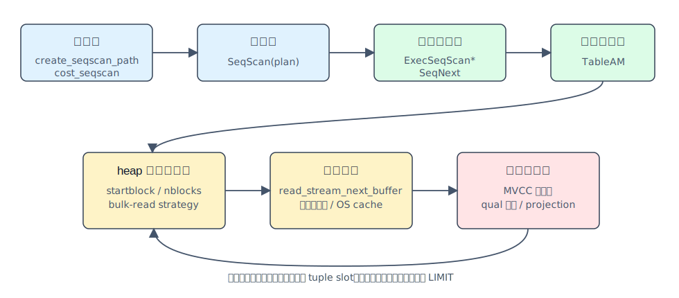
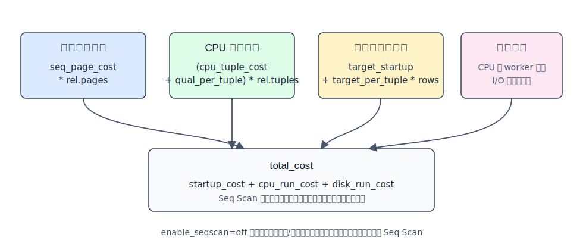
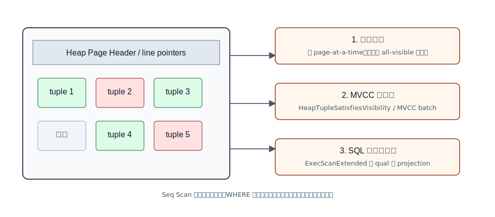
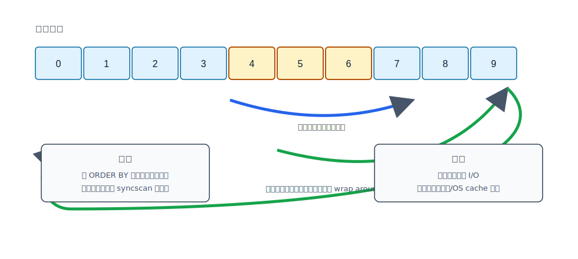
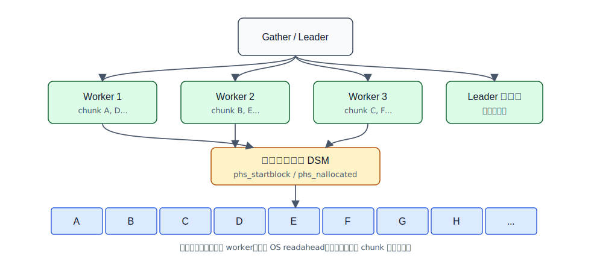
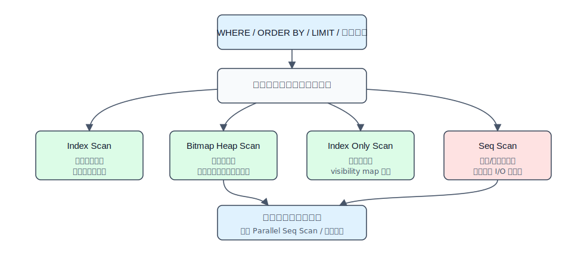

## 数据库筑基课 - 数据扫描方法 seq scan
                                                                                            
### 作者                                                                
digoal                                                                
                                                                       
### 日期                                                                     
2026-05-30                                                      
                                                                    
### 标签                                                                  
PostgreSQL , RisingWave , 应用开发者 , 数据库筑基课 , 扫描算法 , 执行器 , 优化器  
                                                                                           
----                                                                    

## 背景


本节属于数据库基础能力里的“扫描与执行算法”。如果说索引解决的是“怎样少读”，那么顺序扫描（sequential scan，PostgreSQL 计划里显示为 `Seq Scan`）解决的是另一个同样常见的问题：当查询必须读很多行、很多块，或者没有可用索引时，怎样把全表读取做得足够稳定、可预测、少折腾缓存。

数据库筑基课大纲在当前项目中未找到可引用文件，因此本文按“扫描/执行算法”独立成篇。本文主要以 PostgreSQL 本地源码为准，结合 PostgreSQL 文档、DeepWiki 对 `postgres/postgres` 的架构索引，以及三篇扫描/I/O 相关论文做横向参照。

业务上最常见的痛点有三个：

1. 明明建了索引，优化器还是选 `Seq Scan`，开发者误以为“索引失效”。
2. 大表报表、批处理、`count(*)`、低选择率过滤把 I/O 打满，DBA 不知道该调 SQL、调参数、加索引，还是分区。
3. 多个并发全表扫描互相污染缓存，或者并行扫描没有达到预期吞吐。

理解 `Seq Scan` 的价值，不是为了鼓励全表扫，而是为了知道它什么时候是正确答案，什么时候是事故信号。

## 一、它解决什么问题？

顺序扫描解决的是“从一个表访问方法中按物理扫描顺序取出候选行”的问题。它不依赖索引定位，因此天然适合：

- 查询需要返回表中很大比例的数据。
- 表很小，索引访问的启动成本和随机访问成本不值得。
- 没有可用索引，或者谓词无法变成索引条件。
- 统计信息判断索引路径比顺序读更贵。
- 并行查询希望把表块分给多个 worker。

代价也很明确：`Seq Scan` 不能用 `WHERE` 减少已读取的数据块。`WHERE` 只能减少“向上返回的行”，不能减少“从堆表读取和检查的页面”。这就是很多慢查询的根本原因：你看到的是过滤后几行，数据库付出的却可能是全表页读取、MVCC 可见性判断和表达式计算。

PostgreSQL 文档在 `EXPLAIN` 基础章节中把扫描节点定义为计划树底层节点，顺序扫描、索引扫描、位图索引扫描都是不同表访问方法的扫描节点。`enable_seqscan=off` 也不能彻底禁止顺序扫描；如果没有其他访问路径，优化器仍然需要能生成可执行计划。

## 二、它是什么？

在 PostgreSQL 中，`Seq Scan` 是一个计划节点和执行器节点：

- 计划阶段：`set_plain_rel_pathlist()` 总会为普通基表考虑 `create_seqscan_path()`；该路径由 `cost_seqscan()` 估算成本。
- 计划树阶段：`create_seqscan_plan()` 生成 `SeqScan` 计划节点，并把过滤条件放入 scan qual。
- 执行阶段：`ExecInitSeqScan()` 初始化状态，`ExecSeqScan*()` 变体通过 `SeqNext()` 取下一行。
- 表访问阶段：`SeqNext()` 通过 `table_beginscan()` 和 `table_scan_getnextslot()` 调用 Table Access Method；默认 heap 表最终进入 `heap_getnextslot()`、`heapgettup()` 或 `heapgettup_pagemode()`。

这意味着 `Seq Scan` 不是简单的“for 循环读文件”。它要同时处理快照、MVCC 可见性、buffer pin/lock、page pruning、批量可见性判断、I/O 预取、同步扫描、并行扫描、执行器过滤和投影。

## 三、核心原理

### 3.1 从计划器到执行器



图 1 说明：`Seq Scan` 的路径很短，但层次不少。优化器只决定“使用顺序扫描是否划算”；执行器的 `SeqNext()` 不直接理解 heap 文件细节，而是通过 TableAM 接口拿 tuple slot。heap AM 再负责块读取、页面内元组遍历和 MVCC 可见性。

本地源码对应关系：

- `postgres/src/backend/optimizer/path/allpaths.c`：`set_plain_rel_pathlist()` 先考虑 TID scan，再添加 seq scan，再考虑并行 seq scan，最后考虑 index paths。
- `postgres/src/backend/optimizer/util/pathnode.c`：`create_seqscan_path()` 设置 `pathtype = T_SeqScan`，`pathkeys = NIL`，并调用 `cost_seqscan()`。
- `postgres/src/backend/optimizer/path/costsize.c`：`cost_seqscan()` 计算页面成本、CPU 成本和并行修正。
- `postgres/src/backend/executor/nodeSeqscan.c`：`SeqNext()` 首次调用时创建 `TableScanDesc`，后续用 `table_scan_getnextslot()` 取下一行。
- `postgres/src/include/access/tableam.h` 与 `postgres/src/backend/access/table/tableam.c`：提供通用 TableAM 扫描接口。
- `postgres/src/backend/access/heap/heapam.c`：默认 heap AM 的实际扫描实现。

### 3.2 成本模型：为什么全表扫有时更便宜



图 2 说明：`cost_seqscan()` 的核心不是“估算返回多少行就读多少行”，而是把全表页数乘以顺序页成本，再把全表 tuple 数乘以 CPU tuple/qual 成本。投影表达式成本按输出行算；并行时 CPU 成本按 worker 分摊，但源码注释明确说 I/O 成本暂不明显分摊，因为操作系统已经会做 aggressive prefetching。

简化后可以这样理解：

```text
disk_run_cost = seq_page_cost * rel.pages
cpu_run_cost  = (cpu_tuple_cost + qual_per_tuple_cost) * rel.tuples
target_cost   = target_per_tuple_cost * estimated_output_rows
total_cost    = startup_cost + disk_run_cost + cpu_run_cost + target_cost
```

这解释了一个常见现象：当谓词选择率很低时，索引扫描通常赢；当要取表中 20%、50% 甚至更多行时，索引扫描可能因为“索引随机定位 + 回表随机读 + 可见性判断”而输给顺序扫描。

### 3.3 Heap 页面内做了什么



图 3 说明：heap 顺序扫描按块读取页面，然后在页面内遍历 line pointer 和 tuple。每个候选 tuple 要先经过 MVCC 可见性判断，再进入执行器 qual 和 projection。若使用 page-at-a-time 模式，heap 会先准备当前页面的可见 tuple offset 数组，减少逐 tuple 可见性判断开销；若页面 `all_visible` 且不在 hot standby 特殊场景中，可走更快路径。

`heapam.c` 中几个关键点值得记住：

- `initscan()` 在扫描开始时记录 `rs_nblocks`。对 MVCC 快照来说，扫描开始后新增到表里的 tuple 对当前快照不可见，因此块数在扫描开始时确定是合理的。
- 大表相对 `shared_buffers` 足够大时，heap scan 会使用 `BAS_BULKREAD` buffer access strategy，并可能启用 synchronized scan。
- `heap_prepare_pagescan()` 会尝试页面剪枝，并收集对当前快照可见的 tuple offset。
- `heap_getnextslot()` 是 TableAM 向执行器返回 tuple slot 的入口。

这里的工程含义是：`Seq Scan` 的 CPU 消耗不只来自 SQL 表达式，还来自 MVCC、tuple deform、页面剪枝、可见性检查和投影。表膨胀、死元组多、宽行多、表达式复杂，都会让“同样读一遍表”的成本不同。

### 3.4 大表顺序扫描如何保护缓存

PostgreSQL 对大表顺序扫描不会简单地把整个 `shared_buffers` 冲掉。`heapam.c` 在大表条件下使用 `GetAccessStrategy(BAS_BULKREAD)`，`freelist.c` 中 bulk-read ring 的基础大小从 256KB 起，并结合 `effective_io_concurrency`、`io_combine_limit` 和 pin limit 调整，但最终受 `shared_buffers` 的 1/8 上限约束。

这个设计的目标是：大扫描需要吞吐，但不应该把 OLTP 热页全部挤出共享缓冲区。它不是“让全表扫变快”的唯一手段，而是“让全表扫别把系统拖垮”的保护机制。

### 3.5 同步顺序扫描：并发全表扫尽量共享 I/O



图 4 说明：当多个后端扫描同一大表时，PostgreSQL 的 synchronized scan 会记录当前表的扫描位置。新扫描可以从已有扫描附近开始，扫到文件末尾后再 wrap around 回表头，保证所有块都访问，同时尽量让多个扫描命中同一批共享缓冲区或 OS cache 页面。

`postgres/src/backend/access/common/syncscan.c` 的源码注释非常直接：目标是让每个页面被读入共享缓冲区后，参与扫描的后端都能在它被淘汰前处理它。实现上并不强制所有扫描保持同速，只维护一个小的共享 LRU 位置表；进度也只按间隔上报，避免锁竞争。

这与论文 *Cooperative Scans: Dynamic Sharing of Runtime Memory and I/O in Database Systems* 的思想有相似处：扫描之间共享运行时内存和 I/O。但 PostgreSQL 当前实现更轻量，主要是“选择接近已有扫描的位置作为起点”，不是完整的请求重排/调度框架。

代价也必须写清楚：如果没有 `ORDER BY`，SQL 不保证返回顺序；开启 synchronized scan 后，同一个全表扫描可能从不同物理块开始，观察到的返回顺序更不可预测。PostgreSQL 文档对 `synchronize_seqscans` 明确提醒了这一点。

### 3.6 并行顺序扫描：把块分给 worker



图 5 说明：并行顺序扫描不是每个 worker 都扫全表，而是共享一个 parallel scan descriptor。worker 通过共享计数器拿到连续 block chunk，扫完再拿下一段。这样既避免重复扫描，又尽量让每个进程的访问模式对操作系统 readahead 友好。

源码依据：

- `nodeSeqscan.c` 的 `ExecSeqScanEstimate()`、`ExecSeqScanInitializeDSM()`、`ExecSeqScanInitializeWorker()` 负责并行扫描共享内存和 worker 初始化。
- `tableam.c` 的 `table_block_parallelscan_initialize()` 记录 `phs_nblocks`、`phs_startblock`、`phs_nallocated`。
- `table_block_parallelscan_nextpage()` 用 atomic fetch-and-add 分配块范围。注释说明，早期若每次只给下一个最高块号，不同进程会破坏连续 I/O 模式，所以当前实现按连续 chunk 分配；扫描末尾逐步减小 chunk，减少长尾。
- PostgreSQL 文档的 parallel query 章节说明，parallel sequential scan 会把表块范围分给协作进程。

## 四、横向对比



图 6 说明：扫描方法不是“谁高级谁快”，而是由访问比例、排序需求、覆盖列、可见性、统计信息和并行安全性共同决定。`Seq Scan` 的核心优势是连续吞吐和低启动成本，弱点是不能跳过无关页面。

| 维度 | Seq Scan | Index Scan | Bitmap Heap Scan | Index Only Scan | 分区裁剪 + 子表扫描 |
|---|---|---|---|---|---|
| 主要目标 | 连续读全表或大比例数据 | 精确定位少量行或按索引顺序返回 | 先用索引定位块，再按块访问 heap | 尽量只读索引，不回表 | 先排除不相关分区 |
| 读取模式 | 顺序/预取友好 | 随机访问多 | 块级局部性较好 | 索引页为主 | 取决于子计划 |
| WHERE 能否减少 heap 块 | 通常不能 | 能 | 能 | 可能完全避免 heap | 能减少分区范围 |
| 排序能力 | 无天然顺序，`pathkeys=NIL` | 可利用索引顺序 | 通常丢失索引顺序 | 可利用索引顺序 | 取决于子计划 |
| MVCC 成本 | 要检查 heap tuple | 回表时检查 heap tuple | heap recheck/可见性 | 依赖 visibility map，必要时仍回表 | 同子计划 |
| 适合场景 | 全表统计、低选择率过滤、小表 | 主键点查、高选择率过滤、Top-N | 多条件组合、中等选择率 | 覆盖查询、表页 all-visible 高 | 时间范围、多租户、冷热数据 |
| 不适合场景 | 大表高选择率点查 | 大比例回表、随机 I/O 放大 | 极少行或几乎全表 | 频繁更新导致 VM 不友好 | 分区键不在谓词中 |

表里的结论来自一个基本原则：优化器在比较“读多少块、怎么读块、CPU 处理多少 tuple、能否提前停止、是否需要排序”。不要把 `Seq Scan` 简化成“没用上索引”。很多时候它是优化器基于成本模型的理性选择；当然，统计信息错误、参数配置不贴近硬件、表膨胀严重，也会让这个选择变坏。

## 五、效果如何？

顺序扫描的收益：

- 顺序 I/O 和预取友好，吞吐稳定。
- 计划启动成本低，没有索引遍历和 bitmap 构建成本。
- 对全表聚合、低选择率过滤、小表查询很直接。
- 可用 bulk-read ring 减少对共享缓冲区的污染。
- 大表并发扫描可通过 `synchronize_seqscans` 共享部分缓存/I/O。
- 可通过 parallel sequential scan 分摊 CPU 过滤、tuple 处理和部分扫描工作。

顺序扫描的成本：

- 读取范围通常是整个表或整个分区，`WHERE` 不能跳过页面。
- 宽行、死元组、表膨胀会放大 I/O 和 CPU。
- 没有天然排序，`ORDER BY` 通常还需要 Sort，除非上层另有路径。
- 对 OLTP 点查来说可能是灾难信号。
- 同步扫描可能改变无序查询的观察返回顺序。
- 并行扫描不保证线性加速；I/O 已饱和、leader 汇聚、worker 数、tuple 传输和上层节点都会成为瓶颈。

特别要注意 PostgreSQL 19 开发分支里已经出现 `EXPLAIN (IO)` 针对 SeqScan 的仪表增强记录（本地文档 `release-19.sgml` 有 “Add EXPLAIN (IO) instrumentation for SeqScan” 条目）。本文不依赖该特性做示例，因为它属于当前源码树的开发状态，生产版本可用性要以实际版本文档为准。

## 六、实操 DEMO

以下示例是最小可验证实验，SQL 语法按 PostgreSQL 编写。由于当前任务是写文章而不是启动数据库实例，本文未执行这些 SQL，不提供伪造输出。读者可在本地 PostgreSQL 中执行并用 `EXPLAIN (ANALYZE, BUFFERS)` 验证。

### 6.1 小表或全表访问通常选择 Seq Scan

```sql
DROP TABLE IF EXISTS demo_seq_scan;
CREATE TABLE demo_seq_scan (
  id bigint GENERATED ALWAYS AS IDENTITY PRIMARY KEY,
  tenant_id int NOT NULL,
  status int NOT NULL,
  payload text
);

INSERT INTO demo_seq_scan (tenant_id, status, payload)
SELECT (g % 100), (g % 5), repeat(md5(g::text), 4)
FROM generate_series(1, 200000) AS g;

ANALYZE demo_seq_scan;

EXPLAIN (ANALYZE, BUFFERS)
SELECT count(*) FROM demo_seq_scan;
```

预期观察：没有过滤条件时，优化器通常只能扫描全表。是否并行取决于表大小、`max_parallel_workers_per_gather`、并行成本参数和环境。

### 6.2 低选择率过滤可能仍然 Seq Scan

```sql
CREATE INDEX demo_seq_scan_status_idx ON demo_seq_scan(status);
ANALYZE demo_seq_scan;

EXPLAIN (ANALYZE, BUFFERS)
SELECT count(*) FROM demo_seq_scan WHERE status = 1;
```

`status` 只有 5 个值，`status = 1` 约命中 20% 行。优化器可能认为通过索引回表读取大量 heap tuple 不如顺序扫描便宜。若实际不是这样，优先检查统计信息、表膨胀、缓存状态、`random_page_cost`、`effective_cache_size`，而不是直接认定“索引失效”。

### 6.3 高选择率过滤应更倾向索引

```sql
EXPLAIN (ANALYZE, BUFFERS)
SELECT * FROM demo_seq_scan WHERE id = 1000;
```

主键点查通常应使用 index scan。若出现 `Seq Scan`，常见原因是类型不匹配、表达式包裹列、统计信息异常、索引不可用、参数化 SQL 计划选择问题，或测试环境太小导致顺序扫启动成本更低。

### 6.4 验证 enable_seqscan 的真实含义

```sql
SET enable_seqscan = off;

EXPLAIN
SELECT count(*) FROM demo_seq_scan;

RESET enable_seqscan;
```

`enable_seqscan=off` 是诊断工具，不是优化手段。PostgreSQL 文档明确说无法完全禁止顺序扫描；当没有其他方法读表时，它仍会生成 `Seq Scan`，并在新版本 EXPLAIN 中显示 disabled node 信息。

### 6.5 观察表级顺序扫描统计

```sql
SELECT
  schemaname,
  relname,
  seq_scan,
  seq_tup_read,
  idx_scan,
  n_live_tup,
  n_dead_tup
FROM pg_stat_user_tables
WHERE relname = 'demo_seq_scan';
```

`seq_scan` 和 `seq_tup_read` 可以帮助识别哪些表经常被顺序扫描。但不要只看计数下结论：小表频繁 seq scan 可能完全正常；大表 `seq_tup_read` 暴涨才需要结合 SQL、业务时间窗和 I/O 指标分析。

## 七、最佳实践

### 面向数据库架构师

1. 先用访问模式决定表设计：如果业务天然按时间、租户、区域访问大表，优先考虑分区或冷热拆分，让“顺序扫描一个小范围”替代“顺序扫描整个大表”。
2. 不要只靠二级索引拯救报表型查询。低选择率、多列聚合、宽表扫描更需要列裁剪、物化汇总、分区、只读副本或 OLAP 系统。
3. 建模时控制行宽。`Seq Scan` 读的是页面，宽行会降低每页 tuple 密度，使同样行数需要更多 I/O。
4. 对扫描密集系统单独评估存储参数：`seq_page_cost`、`random_page_cost`、`effective_io_concurrency`、`io_method`、`io_combine_limit` 应贴近硬件，而不是永远使用默认认知。

### 面向 DBA

1. 看到大表 `Seq Scan` 先跑 `EXPLAIN (ANALYZE, BUFFERS)`，确认是读块多、过滤多、排序多、并行不足，还是估算偏差。
2. 定期 `ANALYZE`，关注相关列统计、扩展统计和表达式统计。错误 row estimate 会直接影响扫描路径选择。
3. 控制表膨胀。死元组多会让顺序扫描读更多无效数据；`VACUUM`、autovacuum 参数和更新模式都影响扫描成本。
4. 对并发大扫描，理解 `synchronize_seqscans` 的顺序副作用。依赖返回顺序的 SQL 必须加 `ORDER BY`。
5. 用 `pg_stat_user_tables` 识别异常 seq scan，用 `pg_statio_user_tables`、`pg_stat_io` 或系统 I/O 指标区分 shared buffer 命中和物理读。

### 面向业务开发者

1. 不要写“返回几行但扫描全表”的 SQL。典型风险包括在列上套函数、隐式类型转换、前导 `%LIKE`、低选择率状态列、缺少分区键条件。
2. 所有分页必须有稳定排序条件。`Seq Scan` 无序，synchronized scan 还可能从中间块开始。
3. 只取需要的列。宽 `SELECT *` 会增加 tuple deform、内存传输、网络输出和上层排序/聚合成本。
4. 把 `LIMIT` 当成优化机会但不要神化它。若没有可利用顺序或索引，数据库可能仍要扫描大量数据才能找到足够结果。

## 八、适合与不适合场景

适合：

- 小表查询，索引收益不明显。
- 全表聚合、全表导出、批处理校验。
- 谓词命中大比例行，例如状态列、布尔列、低基数枚举列。
- 分区裁剪后对单个小分区做全分区扫描。
- 并行安全的大表扫描和报表查询。
- 维护操作、建索引、VACUUM/ANALYZE 等需要扫描 heap 的场景。

不适合：

- 高 QPS 主键点查、唯一键查、窄范围查。
- 大表中只命中极少行的 OLTP 查询。
- 依赖有序返回但没有 `ORDER BY` 的查询。
- 表膨胀严重、死元组比例高但又频繁全表扫的业务。
- I/O 已经饱和时继续增加并行 worker 的查询。
- 多租户大表缺少租户/时间裁剪条件的后台任务。

## 九、常见坑

1. **把 Seq Scan 等同于索引失效。** 正确做法是比较成本和实际块访问；低选择率查询用 seq scan 可能是对的。
2. **用 `enable_seqscan=off` 当生产优化。** 这只适合诊断候选计划，不能替代索引、统计信息和 SQL 改写。
3. **忽略 MVCC 和表膨胀。** 顺序扫描读到页面后，还要过滤不可见 tuple；死元组多会让 CPU 和 I/O 同时浪费。
4. **无 `ORDER BY` 依赖返回顺序。** synchronized scan 可能从中间开始，SQL 也本来不保证无序查询顺序。
5. **看到并行就期待线性加速。** 并行 seq scan 能分摊一部分工作，但 I/O、leader 汇聚、上层聚合/排序、worker 启动成本都会限制收益。
6. **只建单列低基数索引。** `status`、`is_deleted` 这类列单独建索引，经常无法打败顺序扫描。需要结合复合索引、局部索引、分区或查询改写。
7. **在列上套函数。** `WHERE date(created_at) = current_date` 可能让普通索引无法直接使用；可以改成范围条件或表达式索引。
8. **忽略硬件与参数。** SSD、NVMe、云盘、本地盘的随机/顺序差距不同，`random_page_cost` 和 I/O 并发参数不贴合环境会影响计划选择。

## 十、扩展问题

1. 如果一个查询返回 1% 行、10% 行、50% 行，索引扫描和顺序扫描的分界点会受哪些因素影响？
2. 为什么 `Seq Scan` 的 `pathkeys` 是 `NIL`？如果业务需要排序，索引扫描什么时候能替代 `Seq Scan + Sort`？
3. PostgreSQL 的 synchronized scan 与论文里的 Cooperative Scans 相比，少了哪些调度能力？换来了什么实现简单性？
4. 在 NVMe 与 io_uring/AIO 更成熟的环境下，`seq_page_cost` 与 `random_page_cost` 的差距是否应该缩小？怎样用实验验证？
5. 如果使用列式存储或向量化执行，顺序扫描的瓶颈会从 I/O 转移到哪里？
6. 对一个按时间增长的订单表，应该先加索引、先分区，还是先做汇总表？判断依据是什么？

## 十一、扩展阅读

主要源码：

- `postgres/src/backend/optimizer/path/allpaths.c`：`set_plain_rel_pathlist()`、`create_plain_partial_paths()`。
- `postgres/src/backend/optimizer/util/pathnode.c`：`create_seqscan_path()`。
- `postgres/src/backend/optimizer/path/costsize.c`：`cost_seqscan()`。
- `postgres/src/backend/optimizer/plan/createplan.c`：`create_seqscan_plan()`。
- `postgres/src/backend/executor/nodeSeqscan.c`：`ExecInitSeqScan()`、`SeqNext()`、`ExecSeqScan*()`、并行扫描 DSM 初始化。
- `postgres/src/include/access/tableam.h`、`postgres/src/backend/access/table/tableam.c`：TableAM 扫描接口、并行块扫描分配。
- `postgres/src/backend/access/heap/heapam.c`：heap 顺序扫描、page-at-a-time、MVCC 可见性、bulk-read strategy。
- `postgres/src/backend/access/common/syncscan.c`：synchronized sequential scan。
- `postgres/src/backend/storage/buffer/freelist.c`：bulk-read buffer ring。
- `postgres/src/backend/storage/aio/README.md`：PostgreSQL AIO 子系统背景。

官方文档：

- PostgreSQL `EXPLAIN` 基础章节：扫描节点、成本、`Seq Scan` 示例。
- PostgreSQL `enable_seqscan` 配置项：只能 discouraged，不能完全禁止。
- PostgreSQL `synchronize_seqscans` 配置项：大表并发顺序扫描共享 I/O，以及无序返回的副作用。
- PostgreSQL parallel query 文档：parallel sequential scan 的块范围分配。
- PostgreSQL monitoring 文档：`pg_stat_user_tables.seq_scan`、`seq_tup_read` 等统计。

DeepWiki：

- `postgres/postgres`：用于确认查询处理、优化器、执行器、存储管理的源码入口；关键结论已回到本地源码核对。

相关论文与分享：

- *Cooperative Scans: Dynamic Sharing of Runtime Memory and I/O in Database Systems*：讨论扫描之间动态共享运行时内存和 I/O，可作为理解 synchronized scan 背后动机的扩展材料。
- *Asynchronous I/O Stack on Modern Flash Storage: Analysis and Database Optimization*：讨论现代闪存上的异步 I/O 栈与数据库优化。与 PostgreSQL `io_method`、`effective_io_concurrency`、read stream/AIO 方向相关，但不能直接等同于当前 seq scan 的全部实现。
- *Fast Scans on Raw Data Using Byte-Slice High-Performance Storage*：从高性能存储和 raw data scan 角度讨论快速扫描，适合与 PostgreSQL heap 行存扫描、列式/向量化扫描做思想对比。

## 结语

`Seq Scan` 是数据库里最朴素、也最容易被误解的扫描方法。它的本质不是“慢”，而是“用连续吞吐换掉索引定位能力”。当你需要读很多数据时，它可能是最优路径；当你只想要几行却扫完整张大表时，它就是建模、索引、统计信息或 SQL 写法暴露出的工程问题。

真正的判断方法不是看到 `Seq Scan` 就紧张，而是问四个问题：它读了多少块？过滤掉多少行？这些块本该被跳过吗？如果要跳过，应该靠索引、分区、统计信息、SQL 改写，还是数据模型重构？
  
## 附录 
1、询问 gemini
```
数据扫描方法 seq scan 相关的论文
```

2、克隆代码  
```  
git clone --depth 1 https://github.com/postgres/postgres
```  
  
3、启用 codex, 使用 [数据库筑基课 skill](../skills/README.md).  
```
文章标题: 
  数据库筑基课 - 数据扫描方法 seq scan
项目源码(已克隆到当前项目如下目录中):  
  postgres
相关论文或分享:
  Cooperative Scans: Dynamic Sharing of Runtime Memory and I/O in Database Systems
  Asynchronous I/O Stack on Modern Flash Storage: Analysis and Database Optimization
  Fast Scans on Raw Data Using Byte-Slice High-Performance Storage
项目 deepwiki reponame:  
  postgres/postgres
项目参考信息: 
  postgres/CLAUDE.md
```
  
