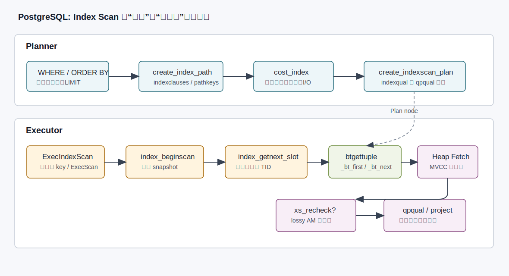
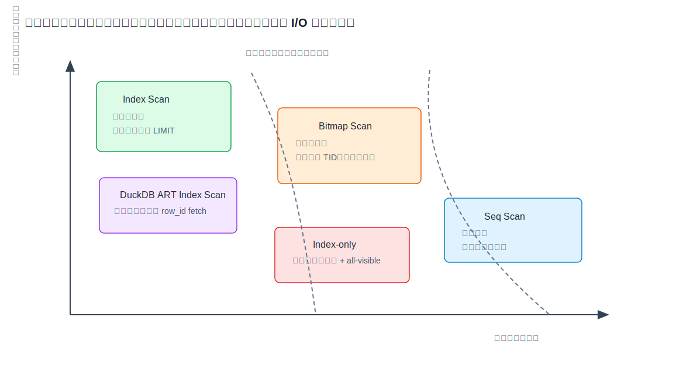
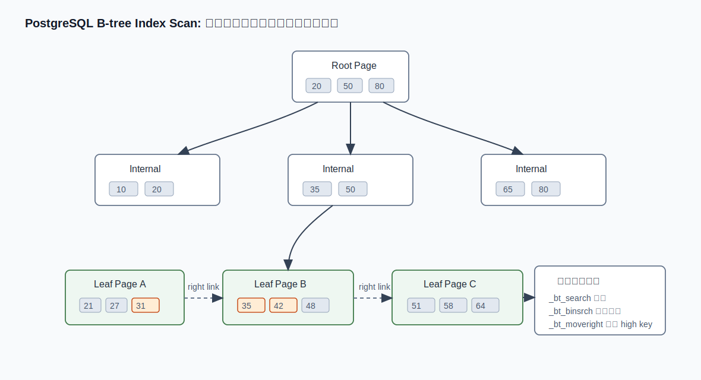
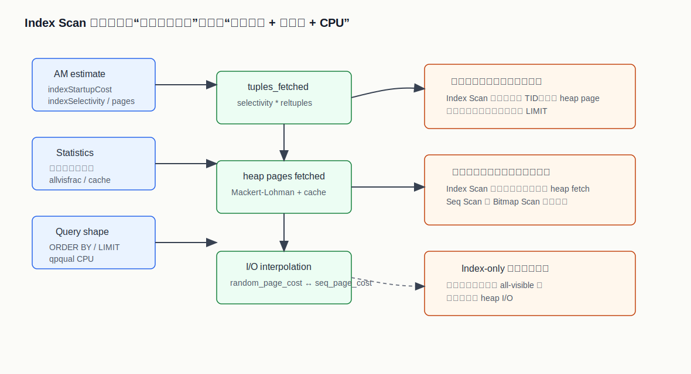
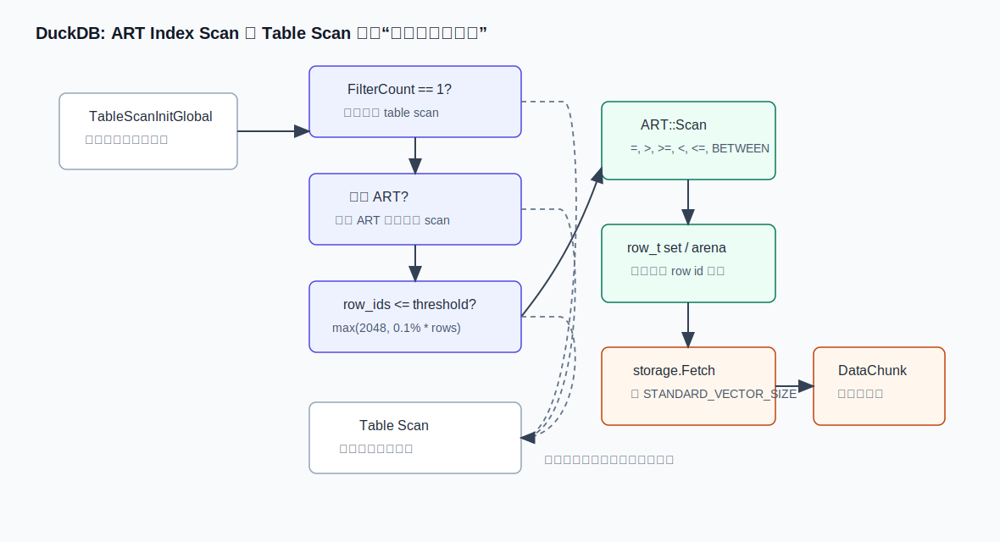
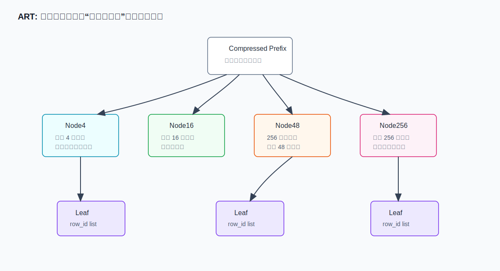

## 数据库筑基课 - 数据扫描方法 index scan
                                                                                            
### 作者                                                                
digoal                                                                
                                                                       
### 日期                                                                     
2026-05-30                                                      
                                                                    
### 标签                                                                  
PostgreSQL , RisingWave , 应用开发者 , 数据库筑基课 , 扫描算法 , 执行器 , 优化器  
                                                                                           
----                                                                    

## 背景
  

> 面向数据库架构师、DBA 和应用开发者。本文从 PostgreSQL 与 DuckDB 的源码出发，解释 index scan 的本质、执行链路、代价模型、适用边界和常见误区。

上一篇 seq scan 讲的是“把表从头到尾读一遍”的基线能力。index scan 则是另一类基本功：先通过索引定位候选行，再回到表或存储层取出真实行，最后做可见性判断和剩余谓词过滤。

这句话里最容易被误解的是“再回到表”。普通 index scan 不是“只读索引”。如果查询还需要检查 MVCC 可见性、取非索引列、复核 lossy 条件，执行器仍然要访问表数据。只有在 index-only scan 的前提满足时，数据库才可能省掉大部分表访问。



## 1. 一句话定义

Index scan 是一种“用有序或可搜索的辅助结构缩小候选行集合”的扫描方法。

它的核心收益不是索引本身神奇，而是把全表扫描的成本：

```text
扫描 N 行
```

变成：

```text
搜索索引 + 访问 M 个候选行 + 检查剩余条件
```

当 `M << N`，或者索引顺序刚好满足 `ORDER BY` / `LIMIT`，index scan 往往很强；当 `M` 接近 `N`，或者候选行分散在大量数据页上，它可能比 seq scan 更慢。

## 2. 先划清边界：index scan 不等于所有“用索引”的计划

常见的几种扫描方式容易混在一起：

| 方法 | 关键动作 | 典型优势 | 典型代价 |
| --- | --- | --- | --- |
| Seq Scan | 顺序读表 | 高吞吐、适合大比例数据 | 不能跳过无关行 |
| Index Scan | 索引返回 TID/row_id，再取表行 | 低选择率、可利用索引顺序 | 随机访问表页、MVCC 检查 |
| Bitmap Scan | 索引先批量生成 TID 位图，再按页访问表 | 中等选择率，减少随机访问 | 失去索引顺序，启动成本更高 |
| Index-only Scan | 尽量只读索引 | 覆盖查询且可见性图命中时极快 | 条件严格，仍可能访问 heap |
| DuckDB ART Index Scan | ART 先收集 row_id，再向量化 fetch | 点查或极小范围过滤 | 触发门槛较窄，超过阈值回退 table scan |



## 3. PostgreSQL：从 planner 到 executor 的 index scan

PostgreSQL 的 index scan 是一个显式计划节点。它的生命周期大致是：

1. 优化器发现某个谓词可由索引支持，构造 `IndexPath`。
2. 代价模型估算索引扫描成本、候选行数、heap page 访问成本。
3. 生成 `IndexScan` 或 `IndexOnlyScan` 计划节点。
4. 执行器打开索引扫描描述符。
5. 索引访问方法返回候选 TID。
6. executor 按 TID 访问表，做 MVCC 可见性判断。
7. 对不能由索引完全保证的条件做复核和剩余过滤。

源码主线如下：

| 阶段 | PostgreSQL 源码 | 作用 |
| --- | --- | --- |
| path 构造 | `src/backend/optimizer/util/pathnode.c:create_index_path()` | 记录索引条件、排序路径、扫描方向 |
| 代价估算 | `src/backend/optimizer/path/costsize.c:cost_index()` | 估算索引成本、选择率、heap page 访问成本 |
| 计划生成 | `src/backend/optimizer/plan/createplan.c:create_indexscan_plan()` | 区分 `indexqual` 与 `qpqual` |
| 执行入口 | `src/backend/executor/nodeIndexscan.c:ExecIndexScan()` | 调用 `ExecScan` 驱动扫描 |
| 通用索引接口 | `src/backend/access/index/indexam.c:index_getnext_slot()` | 从索引取 TID，再 fetch heap |
| B-tree 访问方法 | `src/backend/access/nbtree/nbtree.c:btgettuple()` | B-tree 返回下一个匹配 index tuple |
| B-tree 搜索 | `src/backend/access/nbtree/nbtsearch.c:_bt_first()` / `_bt_next()` | 定位起点并顺序推进 |

### 3.1 planner：indexqual 与 qpqual 的分工

PostgreSQL 生成 index scan 时，会把条件拆成两类：

- `indexqual`：能交给索引访问方法定位候选项的条件，例如 `id = 42`、`ts >= ...`。
- `qpqual`：执行器仍然需要在取出行后检查的条件，例如索引不能证明的表达式、lossy index 条件、不能完全下推的过滤。

这就是为什么 `EXPLAIN` 里常看到：

```text
Index Cond: (id = 42)
Filter: (status = 'active')
```

`Index Cond` 负责缩小候选集，`Filter` 负责最终语义正确性。优化器不能因为“走了索引”就把所有过滤都省掉。`create_indexscan_plan()` 里专门处理这个问题：能被索引子句隐含的条件可以从 qpqual 里去掉；lossy 或无法完全证明的条件必须保留。

### 3.2 executor：索引返回候选 TID，表访问决定可见行

普通 index scan 的执行重点在 `index_getnext_slot()`。

简化后的逻辑是：

```text
while index_getnext_tid() returns a TID:
    if index_fetch_heap() finds a visible tuple:
        if xs_recheck:
            recheck index condition
        return slot
```

也就是说，索引访问方法本身通常只回答：

```text
哪些 TID 可能满足索引条件？
```

最终是否能返回给 SQL 用户，还要看：

- heap tuple 对当前 snapshot 是否可见；
- HOT 链上是否有可见版本；
- lossy index 条件是否复核通过；
- qpqual 是否通过；
- 投影列是否能从当前 tuple 产生。

PostgreSQL 文档 `doc/src/sgml/indexam.sgml` 也明确描述了这个分工：索引访问方法返回匹配扫描键的 TID，父表 tuple 的获取和可见性检查由核心系统处理。

### 3.3 B-tree：先找第一个匹配项，再沿 leaf page 推进

B-tree index scan 的关键不是“查一次树就结束”，而是：

1. `_bt_search()` 从 root/internal page 下探到 leaf page。
2. `_bt_binsrch()` 在 page 内二分定位起点。
3. `_bt_first()` 找到第一个满足 scan key 的 index item。
4. `_bt_next()` 在 leaf page 内继续推进，必要时沿 right link 到下一个 leaf page。
5. `btgettuple()` 把 TID 交给上层 executor。



B-tree 是并发结构。查询扫描时，其他事务可能正在插入、分裂页面。PostgreSQL 的 nbtree 代码会借助 high key、right link、page pin/lock 等机制确保扫描不会因为页面分裂而走错方向。`_bt_moveright()` 的作用就是在发现当前 page 已经不是目标区间时，沿右链移动到正确 page。

这和经典论文 *Efficient Locking for Concurrent Operations on B-Trees* 讨论的主题一致：B-tree 在并发读写下不能只考虑搜索算法，还必须考虑锁、latch、页面分裂和安全推进。数据库里的 B-tree 不是教材里静态的树，而是不断被事务修改的共享结构。

### 3.4 B-tree 不是 lossy，但 index scan 框架支持 lossy

PostgreSQL 的 `btgettuple()` 会设置：

```c
scan->xs_recheck = false;
```

这表示 B-tree 对它支持的 operator class 来说不是 lossy 的：返回的 index tuple 在索引语义上满足条件。

但通用 index scan 框架必须支持其他访问方法。比如某些索引可能只能返回“可能匹配”的候选项，必须由 executor 重新检查原始条件。因此 `nodeIndexscan.c` 里保留了 `xs_recheck` 逻辑。

这条边界很重要：不是所有索引都能证明最终条件；访问方法只能保证自己定义的语义。

## 4. PostgreSQL 的代价模型：为什么“走索引”有时更慢

PostgreSQL 的 `cost_index()` 不是简单比较“有索引/没索引”，而是估算几组成本：

- 索引访问方法自己的启动成本和总成本；
- `indexSelectivity` 推导出的候选 tuple 数；
- 根据表大小、缓存假设和候选 tuple 数估算 heap page 数；
- 根据索引顺序与表物理顺序相关性，在随机 I/O 和顺序 I/O 成本之间插值；
- qpqual 的 CPU 过滤成本；
- index-only scan 可能因 all-visible 页面比例减少 heap fetch；
- 是否可并行；
- 是否能提供有用 pathkeys，避免额外排序。



一个反直觉点是：选择率低不一定总是快。

如果索引顺序和表物理顺序高度不相关，每个候选 tuple 都落在不同 heap page 上，那么 index scan 会变成大量随机访问。对于 SSD，这个问题比机械硬盘时代缓和了，但没有消失：随机读仍然会放大 I/O 请求数、缓存 miss 和执行器调用成本。

另一个反直觉点是：`ORDER BY` 可以改变选择。

例如：

```sql
SELECT * FROM orders
WHERE customer_id = 1001
ORDER BY created_at
LIMIT 20;
```

如果有 `(customer_id, created_at)` 索引，index scan 不仅能过滤，还能按需要的顺序产出数据，并且在拿到 20 行后早停。这时它的优势不只是少读行，还包括避免排序和减少启动后继续扫描的成本。

## 5. DuckDB：ART index scan 是 table scan 的选择性分支

DuckDB 的语境不同。它是面向分析的向量化引擎，很多查询更适合顺序扫描列存数据。因此 DuckDB 对 index scan 的使用更克制。

在 `src/function/table/table_scan.cpp` 里，`TableScanInitGlobal()` 会先尝试判断是否可以使用索引。只有满足比较窄的条件时，才进入 ART index scan：

- 有过滤条件；
- 当前过滤集合只有一个 filter；
- 表上存在索引；
- 当前支持单列 ART 扫描；
- filter 能匹配索引列；
- ART 扫描得到的 row_id 数量不超过阈值；
- 阈值大致是 `max(index_scan_max_count, index_scan_percentage * total_rows)`，源码默认值分别是 `2048` 和 `0.001`。

如果任一条件不满足，DuckDB 会回退普通 table scan。



DuckDB 的 ART index scan 可以拆成两段：

1. `ART::Scan()` 根据过滤条件查 ART，收集 `row_t`。
2. `DuckIndexScanState` 按 `STANDARD_VECTOR_SIZE` 分批调用 `storage.Fetch()`，把 row_id 对应的列取成向量化 `DataChunk`。

这和 PostgreSQL 的逐 TID executor 模型很不一样。DuckDB 仍然努力保持向量化执行：索引只是先给出一小批 row_id，真正取列时仍然是批量 fetch。

## 6. DuckDB 为什么用 ART

DuckDB 的索引实现使用 ART，即 Adaptive Radix Tree。ART 的思想来自论文 *The Adaptive Radix Tree: Fast Memory-Efficient Indexed Lookups*：把 radix tree 的按字节寻址能力和自适应节点大小结合起来。

典型节点包括：

- Node4：最多 4 个孩子，适合稀疏分支；
- Node16：最多 16 个孩子；
- Node48：用映射表压缩 256 路空间；
- Node256：直接 256 路寻址，适合高扇出；
- 路径压缩：公共前缀只存一次，避免长 key 造成大量单分支节点。



从源码看，DuckDB 的 `ART::TryInitializeScan()` 当前主要支持常量边界的比较：

- `=`
- `>`
- `>=`
- `<`
- `<=`
- `BETWEEN`

`ART::Scan()` 再根据不同边界调用等值查找、范围查找或全量 ART 扫描。若扫描过程中发现匹配 row_id 超过阈值，就返回失败，让上层回退 table scan。

这体现了 DuckDB 的取舍：索引不是为了让所有带条件的查询都走索引，而是为了在点查和极小范围查询上避开不必要的全表列扫描。

## 7. PostgreSQL 与 DuckDB 的关键差异

| 维度 | PostgreSQL | DuckDB |
| --- | --- | --- |
| 主要场景 | OLTP / 混合负载，索引是核心访问路径 | OLAP / 嵌入式分析，顺序列扫描很强 |
| index scan 形态 | 显式计划节点 `Index Scan` | table scan 初始化中的 ART 分支 |
| 返回单位 | 索引 AM 返回 TID，executor fetch heap tuple | ART 返回 row_id set，再向量化 fetch |
| 选择策略 | 依赖通用成本模型、统计信息、相关性、pathkeys | 硬阈值加规则判断，超过行数回退 |
| 并发可见性 | MVCC snapshot 与 heap tuple 可见性检查很核心 | 也有事务本地数据处理，但执行形态更偏向批量 |
| 范围和排序 | B-tree 天然支持有序扫描 | ART 支持查找和范围，但不是 PostgreSQL 式路径排序中心 |
| 失败回退 | planner 选择其他 path | table scan 初始化阶段回退普通扫描 |

所以，同样叫 index scan，两者的工程含义不同：

- PostgreSQL：索引是主要访问路径之一，planner 会在 index scan、bitmap scan、seq scan、index-only scan 之间做成本竞争。
- DuckDB：索引是列式顺序扫描之外的低选择率加速器，只有足够小的候选集才值得切过去。

## 8. 什么时候 index scan 很适合

### 8.1 点查

```sql
SELECT * FROM users WHERE id = 42;
```

唯一索引或高选择率索引能快速定位极少候选行。PostgreSQL 中这是最典型的 B-tree index scan 场景；DuckDB 中也最容易触发 ART index scan。

### 8.2 小范围扫描

```sql
SELECT * FROM events
WHERE user_id = 1001
  AND event_time >= now() - interval '1 day';
```

如果索引是 `(user_id, event_time)`，B-tree 可以定位到某个用户的时间区间，再顺序推进 leaf page。

### 8.3 排序加早停

```sql
SELECT *
FROM orders
WHERE customer_id = 1001
ORDER BY created_at DESC
LIMIT 10;
```

合适的复合索引可以让 executor 按目标顺序拿前 10 行，避免扫描大量候选行后排序。

### 8.4 Nested Loop 的内表访问

```sql
SELECT *
FROM customers c
JOIN orders o ON o.customer_id = c.id
WHERE c.region = 'APAC';
```

如果外表过滤后只剩少量 customer，内表 `orders(customer_id)` 的 index scan 可能非常有效。这里 index scan 的价值来自“重复小查询”，不是单次大范围扫描。

## 9. 什么时候 index scan 可能不适合

### 9.1 返回比例太高

```sql
SELECT * FROM orders WHERE status IN ('paid', 'shipped');
```

如果这两个状态覆盖了大部分表，索引会返回大量候选 TID。逐个回表可能比顺序扫表更差。

### 9.2 低相关性导致随机 heap fetch

如果索引键顺序和表物理顺序几乎无关，候选行会散落在很多 heap page 上。PostgreSQL 的 `cost_index()` 会用相关性估算这种成本。

### 9.3 谓词不具备可索引形态

```sql
SELECT * FROM users WHERE lower(email) = 'a@example.com';
```

如果只有 `email` 普通索引，而没有表达式索引 `lower(email)`，数据库不能直接把这个条件当成普通 B-tree scan key。

### 9.4 统计信息过旧

优化器基于统计信息估算选择率。数据分布变化后，planner 可能错误地选择 index scan 或 seq scan。PostgreSQL 中常见处理是 `ANALYZE`，并在必要时调整统计目标。

### 9.5 索引维护成本超过收益

索引不是免费午餐。每个索引都会增加写入、更新、删除、VACUUM、checkpoint、备份和缓存压力。对很少过滤、很少排序、很少 join 的列建索引，可能只是在拖慢写入。

## 10. 实验：PostgreSQL

以下 SQL 用于观察 PostgreSQL 的 index scan。这里不伪造执行输出；请在本地 PostgreSQL 中执行后观察 `EXPLAIN (ANALYZE, BUFFERS)` 的真实结果。

```sql
DROP TABLE IF EXISTS demo_index_scan;

CREATE TABLE demo_index_scan (
    id bigint PRIMARY KEY,
    customer_id int NOT NULL,
    status text NOT NULL,
    created_at timestamptz NOT NULL,
    payload text
);

INSERT INTO demo_index_scan
SELECT
    g,
    (g % 10000)::int,
    CASE WHEN g % 10 = 0 THEN 'cancelled' ELSE 'paid' END,
    now() - (g || ' seconds')::interval,
    repeat(md5(g::text), 2)
FROM generate_series(1, 1000000) AS g;

CREATE INDEX demo_index_scan_customer_created_idx
ON demo_index_scan (customer_id, created_at DESC);

CREATE INDEX demo_index_scan_status_idx
ON demo_index_scan (status);

ANALYZE demo_index_scan;

EXPLAIN (ANALYZE, BUFFERS)
SELECT *
FROM demo_index_scan
WHERE id = 42;

EXPLAIN (ANALYZE, BUFFERS)
SELECT *
FROM demo_index_scan
WHERE customer_id = 42
ORDER BY created_at DESC
LIMIT 10;

EXPLAIN (ANALYZE, BUFFERS)
SELECT *
FROM demo_index_scan
WHERE status = 'paid';
```

你应该重点看：

- `Index Scan using ...` 是否出现；
- `Index Cond` 和 `Filter` 分别是什么；
- `Buffers: shared hit/read` 是否显示大量随机读；
- `Rows Removed by Filter` 是否说明索引只解决了部分条件；
- 第三个查询是否因为选择率太高而不一定使用普通 index scan。

如果想强制观察 planner 选择边界，可以临时使用：

```sql
SET enable_seqscan = off;
SET enable_bitmapscan = off;
```

但这只适合实验，不适合生产调优。生产环境应该修正统计信息、索引设计和 SQL 形态，而不是长期关闭某类计划。

## 11. 实验：DuckDB

以下 SQL 用于观察 DuckDB 的 ART index scan。不同版本的 `EXPLAIN` 展示格式可能不同；请以本地实际输出为准，重点寻找计划中是否出现 `Index Scan`。

```sql
CREATE OR REPLACE TABLE demo_index_scan AS
SELECT
    i AS id,
    i % 10000 AS customer_id,
    CASE WHEN i % 10 = 0 THEN 'cancelled' ELSE 'paid' END AS status,
    repeat(md5(i::VARCHAR), 2) AS payload
FROM range(1000000) t(i);

CREATE INDEX demo_index_scan_id_idx ON demo_index_scan(id);

SET index_scan_max_count = 2048;
SET index_scan_percentage = 0.001;

EXPLAIN ANALYZE
SELECT *
FROM demo_index_scan
WHERE id = 42;

EXPLAIN ANALYZE
SELECT *
FROM demo_index_scan
WHERE status = 'paid';
```

第一个查询更可能进入 ART index scan，因为等值点查返回 row_id 很少。第二个查询即使有索引也未必适合，因为候选行太多；DuckDB 的实现会在 ART 扫描超过阈值时回退普通 table scan。

如果为了实验想更容易看到 index scan，可以临时调整：

```sql
SET index_scan_max_count = 1;
SET index_scan_percentage = 1.0;
```

这类设置用于理解机制，不代表生产推荐值。

## 12. 设计索引时的实践判断

### 12.1 先问“候选集能缩到多小”

索引最直接的收益来自选择率。高基数列、强过滤列、业务唯一键、时间窗口里的局部范围，通常更适合。

低基数列不是绝对不能建索引，但要看组合方式。例如单独的 `status` 可能很弱，`(tenant_id, status, created_at)` 在多租户系统里可能很强。

### 12.2 复合索引要服务访问路径

复合 B-tree 索引不是“把常用列都塞进去”。列顺序要匹配查询形态：

```sql
WHERE tenant_id = ?
  AND user_id = ?
  AND created_at >= ?
ORDER BY created_at DESC
```

可能适合：

```sql
(tenant_id, user_id, created_at DESC)
```

但如果主要查询是跨用户按时间查租户事件，索引顺序就可能不同。

### 12.3 关注排序和 LIMIT

很多慢查询不是过滤慢，而是过滤后排序慢。能同时满足过滤和排序的索引，价值往往大于单纯过滤索引。

### 12.4 区分“覆盖列”和“过滤列”

PostgreSQL 的 index-only scan 需要索引覆盖查询列，还需要 visibility map 能证明 heap page all-visible。覆盖列能减少回表机会，但过度 include 列会让索引膨胀，增加写放大。

### 12.5 对分析型系统保持克制

在 DuckDB 这类列式向量化引擎里，大量查询顺序扫列非常快。索引更适合点查、小范围查、约束检查或交互式过滤，不应该把 OLTP 系统的“凡查询列必建索引”习惯直接搬过去。

## 13. 常见误区

### 误区 1：有索引就一定会走索引

优化器会比较成本。索引存在只是提供候选路径，不是强制命令。

### 误区 2：index scan 一定比 seq scan 快

如果回表随机 I/O 太多，seq scan 更快很正常。数据库不是按名字选计划，而是按估算成本选计划。

### 误区 3：Index Cond 里的条件就是全部过滤

不是。`Filter` 仍然可能移除大量行。看 `EXPLAIN` 时必须同时看 `Index Cond`、`Filter`、实际行数和 buffer。

### 误区 4：index-only scan 永远不访问表

PostgreSQL 需要 visibility map 证明页面 all-visible。否则即使列都在索引里，也可能访问 heap 做可见性检查。

### 误区 5：DuckDB 有索引就该像 PostgreSQL 一样用

DuckDB 的 ART index scan 有明确阈值和规则。它的默认强项仍是列式顺序扫描与向量化执行。

## 14. 和异步 I/O 的关系

论文 *Interleaving Resilient Asynchronous I/O in Query Execution* 指向一个更大的趋势：当存储设备并发能力增强，查询执行器不能只用同步、阻塞、逐 tuple 的方式发起 I/O，而要把 I/O 请求与 CPU 执行交错起来。

对 index scan 来说，这个问题尤其明显。传统 index scan 容易形成：

```text
取一个 TID -> 读一个 heap page -> 处理一个 tuple -> 再取下一个 TID
```

这在随机访问多时会限制 I/O 并发。改进方向包括：

- bitmap scan 先批量收集 TID，再按 page 访问；
- 向量化引擎先收集 row_id，再批量 fetch；
- 执行器引入异步 prefetch 或 interleaving，让 CPU 与 I/O 重叠；
- 存储层利用现代 SSD 的队列深度。

PostgreSQL 和 DuckDB 在本文涉及的源码中采取了不同策略：PostgreSQL 提供 bitmap scan、index-only scan、成本模型和访问方法接口；DuckDB 在 ART 命中后批量 row_id fetch，超过阈值就回到高吞吐 table scan。

## 15. DBA 排查 checklist

排查 index scan 相关慢查询时，可以按这个顺序看：

1. `EXPLAIN (ANALYZE, BUFFERS)` 中估算行数和实际行数差多少。
2. `Index Cond` 是否真正缩小候选集。
3. `Filter` 是否移除了大量行。
4. 是否出现大量 heap buffer read。
5. 是否因 `ORDER BY` / `LIMIT` 选择了索引顺序。
6. 是否应该是 bitmap scan 而不是普通 index scan。
7. 表和索引是否膨胀，统计信息是否过旧。
8. index-only scan 是否因 visibility map 不足而回表。
9. 复合索引列顺序是否匹配真实查询。
10. 在 DuckDB 中，候选 row_id 数是否超过 index scan 阈值。

## 16. 给应用开发者的 SQL 写法建议

让 index scan 更容易发挥作用，通常不是靠 hint，而是让 SQL 形态更清晰：

- 避免在索引列外面包不可匹配的函数，除非建立表达式索引；
- 多租户系统把 `tenant_id` 纳入高频访问路径的前导列；
- 分页避免深 offset，优先使用 keyset pagination；
- 为 `WHERE + ORDER BY + LIMIT` 设计复合索引；
- 不要只看平均耗时，要看高分位延迟，因为随机 I/O 对尾延迟影响更大；
- 写入压力大的表谨慎增加索引，先确认查询收益。

## 17. 小结

Index scan 的本质不是“索引快”，而是“索引能否把候选行缩到值得回表的规模”。

在 PostgreSQL 里，index scan 是成熟的通用访问路径：planner 通过成本模型比较选择率、相关性、heap fetch、排序和 CPU；executor 通过 index AM 取 TID，再由 table AM 完成可见性和 tuple fetch。

在 DuckDB 里，ART index scan 是列式向量化 table scan 的低选择率优化分支：只有一个合适过滤条件、单列 ART、候选 row_id 不超过阈值时才进入，否则回到普通扫描。

掌握 index scan，要同时理解三件事：

1. 索引结构如何找到候选项；
2. 执行器如何把候选项变成可见行；
3. 代价模型为什么有时宁愿顺序扫表。

这三件事合起来，才是数据库扫描方法的基本功。

## 18. 源码与资料

本篇主要依据以下本地源码与文档：

- PostgreSQL `src/backend/executor/nodeIndexscan.c`
- PostgreSQL `src/backend/access/index/indexam.c`
- PostgreSQL `src/backend/access/index/genam.c`
- PostgreSQL `src/backend/access/nbtree/nbtree.c`
- PostgreSQL `src/backend/access/nbtree/nbtsearch.c`
- PostgreSQL `src/backend/optimizer/path/costsize.c`
- PostgreSQL `src/backend/optimizer/plan/createplan.c`
- PostgreSQL `src/backend/optimizer/util/pathnode.c`
- PostgreSQL `src/include/access/tableam.h`
- PostgreSQL `doc/src/sgml/indexam.sgml`
- PostgreSQL `doc/src/sgml/perform.sgml`
- PostgreSQL `CLAUDE.md`
- DuckDB `src/function/table/table_scan.cpp`
- DuckDB `src/execution/index/art/art.cpp`
- DuckDB `src/execution/index/art/iterator.cpp`
- DuckDB `src/include/duckdb/execution/index/art/art.hpp`
- DuckDB `src/include/duckdb/main/settings.hpp`
- DuckDB `src/main/settings/custom_settings.cpp`
- DuckDB `test/sql/index/art/` 相关测试
- DuckDB `CLAUDE.md`
- DeepWiki: `postgres/postgres`
- DeepWiki: `duckdb/duckdb`

参考论文与分享：

- *Efficient Locking for Concurrent Operations on B-Trees*
- *The Adaptive Radix Tree: Fast Memory-Efficient Indexed Lookups*
- *Interleaving Resilient Asynchronous I/O in Query Execution*

说明：论文在本文中作为机制背景使用，没有引用未验证的实验数字；具体实现判断以本地 PostgreSQL 和 DuckDB 源码为准。
  
## 附录 
1、询问 gemini
```
数据扫描方法 index scan 相关的论文
```

2、克隆代码  
```  
git clone --depth 1 https://github.com/postgres/postgres
git clone --depth 1 https://github.com/duckdb/duckdb
```  
  
3、启用 codex, 使用 [数据库筑基课 skill](../skills/README.md).  
```
文章标题: 
  数据库筑基课 - 数据扫描方法 index scan
项目源码(已克隆到当前项目如下目录中):  
  postgres
  duckdb
相关论文或分享:
  Efficient Locking for Concurrent Operations on B-Trees
  The Adaptive Radix Tree: Fast Memory-Efficient Indexed Lookups
  Interleaving Resilient Asynchronous I/O in Query Execution
项目 deepwiki reponame:  
  postgres/postgres
  duckdb/duckdb
项目参考信息: 
  postgres/CLAUDE.md
  duckdb/CLAUDE.md
```
  
  
#### [PostgreSQL 解决方案集合](../201706/20170601_02.md "40cff096e9ed7122c512b35d8561d9c8")
  
  
#### [德哥 / digoal's Github - 公益是一辈子的事.](https://github.com/digoal/blog/blob/master/README.md "22709685feb7cab07d30f30387f0a9ae")
  
  
#### [About 德哥](https://github.com/digoal/blog/blob/master/me/readme.md "a37735981e7704886ffd590565582dd0")
  
  

  
