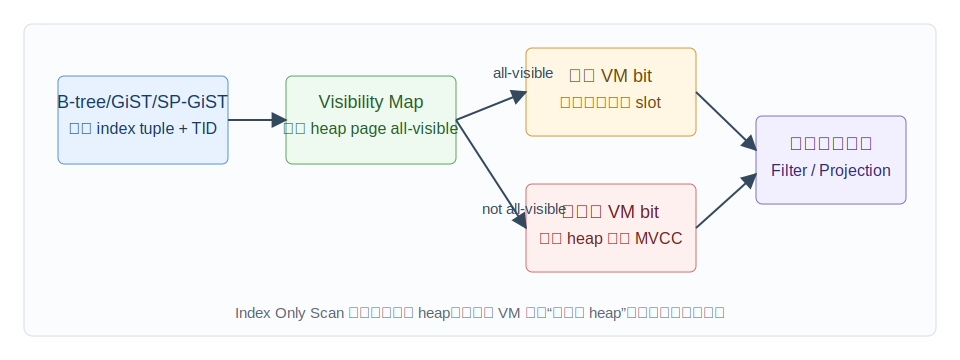
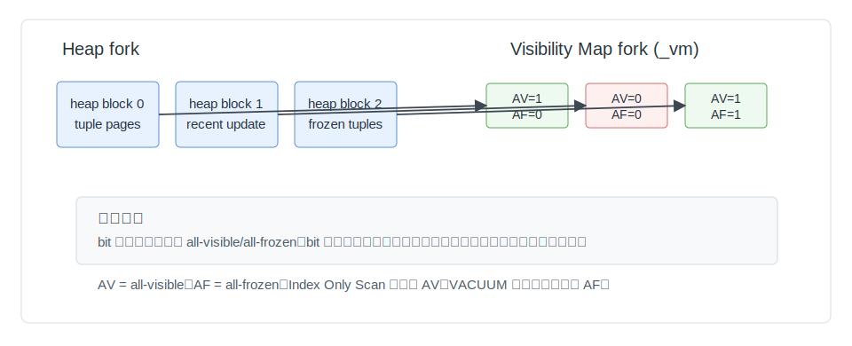
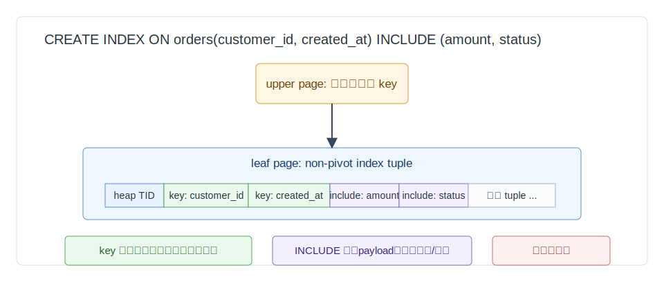
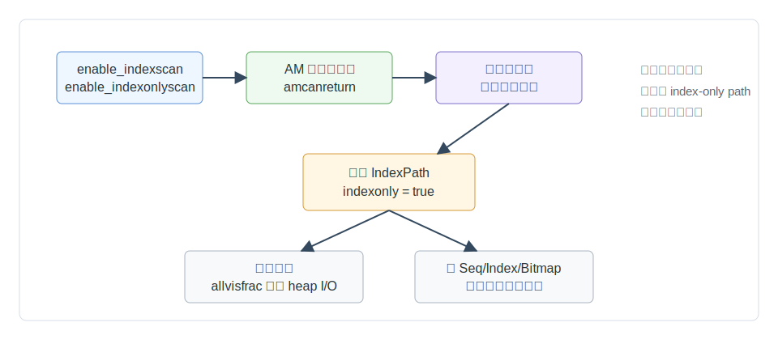
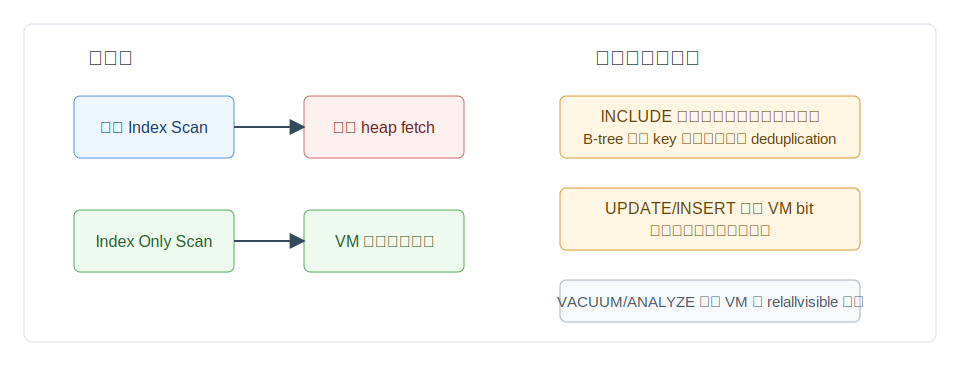

## 数据库筑基课 - 数据扫描方法 index only scan
                                                                                            
### 作者                                                                
digoal                                                                
                                                                       
### 日期                                                                     
2026-05-30                                                      
                                                                    
### 标签                                                                  
PostgreSQL , 应用开发者 , 数据库筑基课 , 扫描算法 , 执行器 , 优化器 , 覆盖索引 , MVCC    
                                                                                           
----                                                                    

## 背景


本节属于数据库基础能力里的“扫描与执行算法”。上一篇 `index scan` 讲的是：先读索引，再根据 TID 回到 heap 取真实行。`index only scan` 继续往前走一步：如果查询需要的列都能从索引里拿到，并且 PostgreSQL 能证明对应 heap page 上的行对所有事务都可见，那么执行器可以跳过 heap fetch。

数据库筑基课大纲在当前项目中未找到可引用文件，因此本文按“扫描/执行算法”独立成篇。本文主要以 PostgreSQL 本地源码和文档为准，结合 DeepWiki 对 `postgres/postgres` 的架构摘要，并把用户给出的三篇资料作为概念参照：R-tree 说明空间索引的边界，visibility map 说明“可见性摘要参与优化”的必要性，covering query 说明“把返回列放进索引”为什么能减少回表。

业务上最常见的痛点有四个：

1. 明明 `EXPLAIN` 显示 `Index Only Scan`，`Heap Fetches` 仍然很高。
2. 加了 `INCLUDE` 覆盖列以后，读查询变快了，写入、缓存和索引体积却变差了。
3. 表刚批量导入或刚大量更新后，同一条 SQL 的执行计划或实际 I/O 变化很大。
4. 开发者把 `index only scan` 理解成“永不读表”，从而误判 MVCC、VACUUM 和可见性地图的作用。

本文的核心结论先放前面：`Index Only Scan` 不是“只读索引”的承诺，而是“优先从索引取数据，并用 visibility map 尽量避免 heap 访问”的执行策略。

## 一、它解决什么问题？

普通二级索引扫描有一个天然缺口：索引条目通常保存 key 和 heap TID，但 PostgreSQL 的 MVCC 可见性信息在 heap tuple 上，不在索引条目里。即使 `WHERE` 条件和返回列看起来都在索引中，执行器仍然需要知道这条 heap tuple 对当前 snapshot 是否可见。

普通 `Index Scan` 的基本成本是：

```text
搜索索引 + 逐条 TID 回表 + 检查 MVCC 可见性 + 取返回列
```

当候选行很多、heap TID 分散、heap page 不在缓存里时，回表会变成大量随机 I/O。`Index Only Scan` 解决的就是这部分成本：

```text
搜索索引 + 检查 visibility map + 尽量直接从索引返回列
```

它牺牲的东西也很明确：

- 索引必须能返回查询需要的列，通常意味着更宽的覆盖索引。
- heap page 必须有较高比例的 all-visible 位，否则仍要回表。
- 更新频繁的表会不断清除 visibility map 位，收益不稳定。
- 覆盖索引会增加写入维护、WAL、缓存占用和索引膨胀风险。

所以，`Index Only Scan` 不是给所有查询加速，而是把一类“读多写少、查询列可覆盖、可见性稳定”的访问模式做得更省 I/O。

## 二、它是什么？

在 PostgreSQL 中，`Index Only Scan` 同时是一个计划节点和执行器节点：

- 计划阶段：优化器在 `indxpath.c:check_index_only()` 判断查询需要的列是否都能由索引返回。
- 成本阶段：`costsize.c:cost_index()` 对 index-only path 估算 heap fetch 时，会用 `allvisfrac` 折减 heap page 成本。
- 计划生成阶段：`createplan.c` 为 `IndexOnlyScan` 使用索引的 physical target list，并把不能由索引访问方法返回的列标成 `resjunk`。
- 执行阶段：`nodeIndexonlyscan.c:IndexOnlyNext()` 从索引取 TID 和索引 tuple，检查 visibility map，必要时才访问 heap。

两个前提决定它是否“物理可行”：

1. 索引访问方法能返回原始列值，或者能重构原始列值。B-tree 总是支持；GiST、SP-GiST 只在部分 opclass 上支持；GIN、BRIN、Hash 在当前源码中没有通用支持。
2. 查询需要的列都在索引中。这里的“需要”包括输出列、显式过滤条件、连接条件，以及运行期仍需检查的条件；部分索引 predicate 能被证明隐含时是例外。

第三个条件决定它是否“实际划算”：

3. 目标 heap page 的 visibility map all-visible 位命中率要高。

## 三、核心原理

### 3.1 执行链路：先问 VM，证明不了就回表



图 1 说明：执行器从索引访问方法拿到候选 TID 和可返回的索引 tuple。然后它检查 TID 所在 heap block 的 visibility map。若 all-visible 位已设置，就直接用索引 tuple 填充 slot；若未设置，就调用 `index_fetch_heap()` 到 heap 判断 MVCC 可见性。也就是说，`Index Only Scan` 可以退化出 heap fetch。

源码主线：

| 阶段 | PostgreSQL 源码 | 关键点 |
|---|---|---|
| path 判断 | `../postgres/src/backend/optimizer/path/indxpath.c:check_index_only()` | 收集 query 需要的属性，判断是否是索引可返回列集合的子集 |
| 成本估算 | `../postgres/src/backend/optimizer/path/costsize.c:cost_index()` | 对 index-only scan 用 `1.0 - baserel->allvisfrac` 折减 heap page 估算 |
| all-visible 统计 | `../postgres/src/backend/optimizer/util/plancat.c:estimate_rel_size()` | 从 `pg_class.relallvisible` 得到 `allvisfrac` |
| 执行入口 | `../postgres/src/backend/executor/nodeIndexonlyscan.c:IndexOnlyNext()` | 设置 `xs_want_itup = true`，读取索引 tuple，检查 VM，必要时回表 |
| VM 接口 | `../postgres/src/include/access/visibilitymap.h` | `VM_ALL_VISIBLE()` 调用 `visibilitymap_get_status()` |
| VM 实现 | `../postgres/src/backend/access/heap/visibilitymap.c` | 每个 heap page 两个 bit：all-visible 和 all-frozen |

`nodeIndexonlyscan.c` 的关键细节是：即使发生 heap fetch，最终返回的数据源仍优先是索引 tuple，而不是 heap tuple。heap fetch 的主要目的变成“确认可见性”，不是“取返回列”。

### 3.2 Visibility Map：小而保守的可见性摘要



图 2 说明：visibility map 是 heap relation 的 `_vm` fork。它不是每行一个 bit，而是每个 heap page 两个 bit：all-visible 和 all-frozen。`Index Only Scan` 关心 all-visible；VACUUM 和冻结还会关心 all-frozen。

PostgreSQL 文档和 `visibilitymap.c` 都强调一个原则：visibility map 是保守的。

- bit 置位：系统必须确认这个 page 满足 all-visible 或 all-frozen。
- bit 未置位：不代表这个 page 一定有不可见 tuple，只代表系统不能安全地用摘要证明它全可见。
- bit 错误置位会导致错误结果，所以清 bit 可以保守，置 bit 必须谨慎。

这解释了两个常见现象：

1. 刚导入、刚更新、刚删除过的数据，即使查询列被索引覆盖，也可能有大量 `Heap Fetches`。
2. `VACUUM` 后同一条 SQL 的 `Heap Fetches` 可能下降，因为 VACUUM 维护了 visibility map。

维护规则简化理解如下：

```text
INSERT / UPDATE / DELETE 改动 heap page
    -> 清除该 page 的 all-visible 信息

VACUUM 确认 page 上 tuple 都对所有事务可见
    -> 设置 all-visible bit

VACUUM 确认 page 上 tuple 都已冻结
    -> 设置 all-frozen bit
```

注意：VM 不是索引文件的一部分，文档明确说 indexes do not have VMs。它描述的是 heap page 状态。

### 3.3 覆盖索引：把返回列搬进索引



图 3 说明：`INCLUDE` 列不是搜索 key。对 B-tree 来说，key 列参与搜索、排序和唯一性语义；`INCLUDE` 列是 payload，用于让 index-only scan 返回更多列。PostgreSQL 文档说明，B-tree 的非 key 列只出现在对应 heap tuple 的 leaf index tuple 中，不出现在 upper-level 导航 tuple 中。

例如：

```sql
CREATE INDEX orders_customer_created_cover
ON orders (customer_id, created_at)
INCLUDE (amount, status);
```

这个索引适合：

```sql
SELECT created_at, amount, status
FROM orders
WHERE customer_id = 1001
ORDER BY created_at
LIMIT 20;
```

原因是：

- `customer_id` 可用于定位；
- `created_at` 可用于顺序输出；
- `amount`、`status` 可从 leaf tuple 返回；
- 若相关 heap pages all-visible，执行器可避免回表。

但 `INCLUDE` 不是免费午餐：

- 宽列会显著扩大索引体积。
- B-tree 有非 key 列时不使用 deduplication，源码和文档都明确这一点。
- 索引 tuple 超过访问方法限制时，写入会失败。
- 更新 payload 列也要维护索引，可能破坏 HOT 更新机会。
- 如果 VM 命中率低，payload 列的收益会被回表抵消。

### 3.4 优化器：物理可行还要成本划算



图 4 说明：优化器不是看到覆盖索引就必选 `Index Only Scan`。它先看开关和访问方法能力，再看查询所需列是否可由索引返回，最后与 `Seq Scan`、普通 `Index Scan`、`Bitmap Heap Scan` 等路径比较成本。

`check_index_only()` 的判断重点可以简化为：

```text
attrs_used = 查询输出列 + 运行期仍需检查的过滤列
index_canreturn_attrs = 索引访问方法能返回的列

如果 attrs_used 是 index_canreturn_attrs 的子集：
    index-only scan 物理可行
否则：
    不生成 index-only path
```

这里有两个容易踩坑的细节：

- 只出现在 index qual 且可由索引证明的条件，运行期不一定需要作为普通过滤再检查。
- 表达式索引有局限。PostgreSQL 文档说明，planner 当前主要按“列是否可用”判断，有些 `f(x)` 场景需要额外 `INCLUDE (x)` 才能让 planner 接受 index-only scan。

成本估算中，`cost_index()` 有一段专门处理 index-only scan：如果是 index-only path，就用 `baserel->allvisfrac` 折减估算出的 heap pages。`allvisfrac` 来自 `pg_class.relallvisible / 当前页数`。源码注释也承认，这只是整个表的 all-visible 比例，未必正好等于本次查询会访问的那部分 heap pages，但很难做得更精确。

### 3.5 并发正确性：为什么 VM 检查可以不锁 VM buffer

`nodeIndexonlyscan.c` 中关于 memory ordering 的注释很长，因为这里牵涉正确性：执行器检查 VM bit 时没有锁住 VM buffer，但仍要避免读到足以造成错误结果的过期状态。

简化理解：

- 新插入 tuple 前必须先清 VM bit，再把 TID 插入索引；索引页锁的释放/获取提供了必要的同步。
- 删除不更新索引页，VM bit 清除与索引扫描没有同样的序列化关系；但删除事务对当前 snapshot 的可见性变化还受提交、statement 边界和 ProcArrayLock 约束。
- PostgreSQL 用这些顺序约束避免每次 index-only scan 都锁 VM buffer，否则高并发下 VM 会成为热点。

这也是数据库内核里常见的工程取舍：为读路径减少锁竞争，但用严格的 WAL、buffer、snapshot 和锁顺序维持正确性。

## 四、横向对比

| 维度 | Index Only Scan | 普通 Index Scan | Bitmap Heap Scan | Seq Scan |
|---|---|---|---|---|
| 主要目标 | 覆盖查询并尽量避免 heap I/O | 低选择率定位少量行 | 中等选择率时按 heap page 批量访问 | 大比例读表或无可用索引 |
| 返回列来源 | 索引 tuple | heap tuple | heap tuple | heap tuple |
| MVCC 可见性 | VM 命中则跳过 heap；否则回表 | 回表检查 | 回表检查 | 扫 heap 检查 |
| WHERE 减少 heap I/O | 取决于 VM 命中率 | 能减少，但可能随机回表 | 能减少并改善局部性 | 通常不能 |
| 排序能力 | 可利用索引顺序 | 可利用索引顺序 | 通常失去索引顺序 | 无天然顺序 |
| 写入代价 | 覆盖索引更宽，维护更贵 | 取决于索引宽度 | 同对应索引 | 无索引维护 |
| 适合场景 | 读多写少、覆盖列少、all-visible 高 | 点查、Top-N、小范围 | 多条件、中等返回比例 | 全表统计、低选择率过滤、小表 |
| 不适合场景 | 热更新表、宽 payload、VM 命中低 | 大量随机回表 | 极少行或需索引顺序 | 大表高选择率点查 |

和 R-tree/GiST 类空间索引相比，`Index Only Scan` 的关键问题不是“树能否定位候选对象”，而是“访问方法能否返回原始值”和“heap 可见性能否被 VM 证明”。PostgreSQL 的 GiST 可支持某些 opclass 的 index-only scan，但不是所有空间类型都天然可行；源码中 `gistcanreturn()` 依赖 fetch/compress 相关能力，回到的是访问方法能否重构值的问题。

和覆盖查询相关论文的思路一致，覆盖索引的本质是用更多索引空间换更少表访问。但 PostgreSQL 多了 MVCC 这一层：列覆盖只是必要条件，不是充分条件。

## 五、效果如何？



图 5 说明：`Index Only Scan` 的收益主要来自减少 heap fetch；代价主要来自更宽索引和 VM 对工作负载的敏感性。读多写少的表受益明显，频繁变更的热表容易收益不稳定。

可以用一个简化公式理解成本变化：

```text
普通 Index Scan heap I/O ~= 命中 TID 对应的 heap page 数

Index Only Scan heap I/O ~= 命中 TID 对应的 heap page 数 * (1 - allvisfrac)
                         + visibility map 访问成本
```

这不是 PostgreSQL 源码里的完整公式，只是帮助理解。真实 `cost_index()` 还会考虑：

- 索引访问方法的 startup/total cost；
- index selectivity；
- 索引顺序和 heap 物理顺序相关性；
- random page cost / seq page cost；
- loop count；
- CPU qual cost；
- 并行 worker；
- pathkeys 对排序的影响。

实际观察时重点看：

```sql
EXPLAIN (ANALYZE, BUFFERS)
SELECT ...;
```

如果看到：

```text
Index Only Scan ...
  Heap Fetches: 0
```

说明这次执行几乎完全避开了 heap 可见性访问。如果 `Heap Fetches` 很高，说明计划名虽然是 `Index Only Scan`，但 VM 无法证明很多 heap page all-visible，执行器仍然回表。

## 六、实操 DEMO

当前环境有 `psql` 客户端，但没有可连接的本地 PostgreSQL 服务：连接 `/tmp/.s.PGSQL.5432` 失败。因此以下 SQL 未在本轮执行，不提供伪造输出。读者可以在任意 PostgreSQL 实例中执行，并用 `EXPLAIN (ANALYZE, BUFFERS)` 验证。

### 6.1 覆盖索引 + VACUUM 后观察 Heap Fetches

```sql
DROP TABLE IF EXISTS demo_ios;

CREATE TABLE demo_ios (
  id bigint GENERATED ALWAYS AS IDENTITY PRIMARY KEY,
  customer_id int NOT NULL,
  created_at timestamptz NOT NULL,
  amount numeric(12,2) NOT NULL,
  status text NOT NULL,
  payload text
);

INSERT INTO demo_ios (customer_id, created_at, amount, status, payload)
SELECT
  (g % 1000),
  now() - (g || ' seconds')::interval,
  (g % 10000) / 100.0,
  CASE WHEN g % 10 = 0 THEN 'paid' ELSE 'new' END,
  repeat(md5(g::text), 4)
FROM generate_series(1, 300000) AS g;

CREATE INDEX demo_ios_cover_idx
ON demo_ios (customer_id, created_at DESC)
INCLUDE (amount, status);

VACUUM (ANALYZE) demo_ios;

EXPLAIN (ANALYZE, BUFFERS)
SELECT created_at, amount, status
FROM demo_ios
WHERE customer_id = 42
ORDER BY created_at DESC
LIMIT 20;
```

预期观察：

- 计划有机会选择 `Index Only Scan using demo_ios_cover_idx`。
- `Heap Fetches` 可能较低，甚至为 0，取决于 VACUUM 是否设置了相关 heap page 的 all-visible 位。
- 如果没有 `VACUUM`，刚插入的数据页通常不能被 VM 证明 all-visible，`Heap Fetches` 可能更高。

### 6.2 更新后 VM bit 被清，Index Only Scan 可能仍回表

```sql
UPDATE demo_ios
SET status = 'paid'
WHERE customer_id = 42
  AND id % 5 = 0;

ANALYZE demo_ios;

EXPLAIN (ANALYZE, BUFFERS)
SELECT created_at, amount, status
FROM demo_ios
WHERE customer_id = 42
ORDER BY created_at DESC
LIMIT 20;
```

预期观察：

- 计划仍可能是 `Index Only Scan`。
- 但被更新影响的 heap pages 的 all-visible 位会被清除，`Heap Fetches` 可能上升。
- 再执行 `VACUUM (ANALYZE) demo_ios;` 后，若页面重新满足 all-visible，`Heap Fetches` 可能下降。

### 6.3 非覆盖列会破坏 index-only 条件

```sql
EXPLAIN (ANALYZE, BUFFERS)
SELECT created_at, amount, status, payload
FROM demo_ios
WHERE customer_id = 42
ORDER BY created_at DESC
LIMIT 20;
```

`payload` 不在 `demo_ios_cover_idx` 中。除非另有覆盖它的索引，否则优化器不能用这个索引完成真正的 index-only scan，因为返回列必须访问 heap。

### 6.4 验证开关的含义

```sql
SET enable_indexonlyscan = off;

EXPLAIN
SELECT created_at, amount, status
FROM demo_ios
WHERE customer_id = 42
ORDER BY created_at DESC
LIMIT 20;

RESET enable_indexonlyscan;
```

`enable_indexonlyscan` 只影响 planner 是否考虑 index-only-scan plan types。PostgreSQL 文档还说明，`enable_indexscan` 也必须启用，planner 才会考虑 index-only scan。

## 七、最佳实践

面向数据库架构师：

- 先识别稳定读路径，而不是到处加 `INCLUDE`。典型目标是账单、订单历史、日志索引、审计记录、维表、状态不频繁变更的大表。
- 覆盖索引的列要服务于明确 SQL 模式：过滤列、排序列、少量返回列。不要把“可能以后会查”的列都塞进去。
- 对多租户和时间序列查询，常见组合是 `(tenant_id, created_at DESC) INCLUDE (少量列表页字段)`。
- 把 index-only scan 和分区、冷热分层结合。热分区更新频繁，VM 命中低；冷分区稳定，VM 命中高。

面向 DBA：

- 关注 `EXPLAIN (ANALYZE, BUFFERS)` 的 `Heap Fetches`，不要只看计划节点名称。
- 关注 `pg_class.relallvisible`、表大小、autovacuum 是否及时、长事务是否阻止 VACUUM 推进。
- 对读多写少表，合理调 autovacuum，让 visibility map 及时维护；对热更新表，不要期待 VM 长期高命中。
- 用 `pg_visibility` 扩展检查 VM 与 heap page 状态，定位为什么 heap fetch 降不下来。
- 对覆盖索引做容量评估：索引页数、缓存命中、WAL、写入延迟、VACUUM 成本都要算进去。

面向业务开发者：

- 列表页查询优先只返回需要展示的列，不要 `SELECT *`。
- 用 `ORDER BY ... LIMIT` 绑定索引顺序，让索引既负责过滤也负责早停。
- 避免把大 JSON、大 text、大 bytea 放进 `INCLUDE`。这类列可能让索引变宽到得不偿失。
- 如果查询新增了一个返回列，原本的 index-only scan 可能消失；上线前用 `EXPLAIN` 验证。

## 八、适合与不适合场景

适合：

- 读多写少的大表，尤其是历史数据、归档数据、账单、订单历史、审计日志。
- 查询返回列少，且能用 B-tree key + INCLUDE 完整覆盖。
- Top-N、分页、最近记录查询，索引顺序能避免额外排序。
- 宽表中的窄查询。索引包含少量列表字段，避免读取宽 heap tuple。
- 冷分区或冻结较充分的数据集。

不适合：

- 高频 `UPDATE` / `DELETE` 的热表。VM bit 频繁清除，heap fetch 高。
- 返回列很多或 payload 很宽的查询。覆盖索引膨胀会抵消收益。
- 低选择率大范围查询。即使不回表，扫描大量索引页也可能不如顺序扫描。
- 统计信息陈旧、`relallvisible` 与真实访问范围差异很大的场景。
- 需要列不在索引中，或访问方法不能返回原始值的索引类型。

## 九、常见坑

1. 只看 `Index Only Scan`，不看 `Heap Fetches`。

   计划节点说明优化器选择了 index-only scan 形态；`Heap Fetches` 才说明执行期是否真的避开了 heap。

2. 批量导入后立刻压测 index-only scan。

   刚插入页面通常还没有 all-visible 位。先 `VACUUM (ANALYZE)`，再评估稳定读性能。

3. 把宽列塞进 `INCLUDE`。

   宽 payload 会扩大 leaf tuple，占用更多 buffer 和磁盘，写入也更贵。索引 tuple 超限还会导致插入失败。

4. 忽略唯一约束语义。

   `CREATE UNIQUE INDEX ON tab(x) INCLUDE (y)` 的唯一性只约束 `x`，不约束 `(x, y)`。

5. 以为 INCLUDE 列能参与搜索。

   非 key 列不能作为 index scan search qualification。它只是可返回的 payload。

6. 长事务拖住 VACUUM。

   长事务会影响 tuple 何时能被认为对所有事务可见，进而影响 VM 维护和 index-only scan 收益。

7. 表达式索引覆盖判断不符合直觉。

   文档明确提到 planner 对表达式 index-only scan 不够聪明，有时需要额外包含基础列才能让它认为可行。

8. 忽略访问方法差异。

   B-tree 总是可返回；GiST/SP-GiST 取决于 opclass；GIN 通常只保存原值片段，不能支持 index-only scan。

## 十、扩展问题

1. 为什么 PostgreSQL 不把 MVCC 可见性直接存进索引条目？
2. 如果一个表 90% 页面 all-visible，但你的查询总访问最近 10% 热数据，`allvisfrac` 成本估算会有什么偏差？
3. 覆盖索引和物化视图都能减少回表，它们分别把成本转移到了哪里？
4. 对列存数据库来说，“index-only scan”这个概念是否仍然成立，还是会被 projection pruning 和 zone map 替代？
5. 如果业务查询从返回 5 列变成返回 20 列，是扩展覆盖索引、拆列表页接口，还是接受回表？判断依据是什么？

## 十一、扩展阅读

PostgreSQL 官方文档与本地源码：

- `../postgres/doc/src/sgml/indices.sgml`：`Index-Only Scans and Covering Indexes`，解释二级索引、两项基本限制、visibility map、`INCLUDE`、表达式索引和部分索引边界。
- `../postgres/doc/src/sgml/storage.sgml`：visibility map fork、每 heap page 两个 bit、保守语义。
- `../postgres/doc/src/sgml/maintenance.sgml`：VACUUM 如何维护 visibility map，并说明它如何帮助 index-only scan。
- `../postgres/doc/src/sgml/ref/create_index.sgml`：`INCLUDE` 列语义、宽列风险、B-tree deduplication 限制。
- `../postgres/doc/src/sgml/indexam.sgml`：`amcanreturn`、`xs_want_itup`、`xs_itup`/`xs_hitup`、`amgetbitmap` 不支持 index-only scan 返回 tuple 内容。
- `../postgres/src/backend/executor/nodeIndexonlyscan.c`：执行器主逻辑、VM 检查、heap fetch fallback、并发可见性注释。
- `../postgres/src/backend/optimizer/path/indxpath.c`：`check_index_only()`。
- `../postgres/src/backend/optimizer/path/costsize.c`：`cost_index()` 中对 index-only scan 的 heap page 折减。
- `../postgres/src/backend/optimizer/util/plancat.c`：`estimate_rel_size()` 中 `relallvisible` 到 `allvisfrac` 的转换。
- `../postgres/src/backend/access/heap/visibilitymap.c` 与 `../postgres/src/include/access/visibilitymapdefs.h`：visibility map 的物理定义和维护规则。
- `../postgres/src/include/access/nbtree.h` 与 `../postgres/src/backend/access/nbtree/nbtree.c`：B-tree INCLUDE tuple 布局、`btcanreturn()`。
- `../postgres/src/backend/access/gist/gistget.c`、`../postgres/src/backend/access/spgist/spgscan.c`、`../postgres/src/backend/access/gin/ginutil.c`、`../postgres/src/backend/access/hash/hash.c`：不同访问方法的 index-only scan 能力边界。
- DeepWiki `postgres/postgres`：用于快速定位 planner、executor、visibility map 和 access method 的关系；关键结论已回到本地源码核验。

相关论文或分享：

- Antonin Guttman, *R-Trees: A Dynamic Index Structure for Spatial Searching*。用于理解空间索引按边界框定位候选对象的思想；PostgreSQL 中对应到 GiST/R-tree 类访问路径时，仍需看 opclass 是否能支持返回原值。
- *Visibility Maps and Their Integration into Query Optimization*。本文未在本地找到可核验全文，因此只采用“可见性摘要进入优化器成本估算”这一与 PostgreSQL 源码可相互印证的思想。
- *Making B+-Trees Efficient for Covering Queries*。本文未在本地找到可核验全文，因此只采用“覆盖查询用更多索引空间换更少表访问”这一通用思想；PostgreSQL 的具体实现以 `INCLUDE` 文档和 B-tree 源码为准。
  
## 附录 
1、询问 gemini
```
数据扫描方法 index only scan 相关的论文
```

2、克隆代码  
```  
git clone --depth 1 https://github.com/postgres/postgres
```  
  
3、启用 codex, 使用 [数据库筑基课 skill](../skills/README.md).  
```
文章标题: 
  数据库筑基课 - 数据扫描方法 index only scan
项目源码(已克隆到当前项目如下目录中):  
  postgres
相关论文或分享:
  R-Trees: A Dynamic Index Structure for Spatial Searching
  Visibility Maps and Their Integration into Query Optimization
  Making B+-Trees Efficient for Covering Queries
项目 deepwiki reponame:  
  postgres/postgres
项目参考信息: 
  postgres/CLAUDE.md
```
  
  
#### [PostgreSQL 解决方案集合](../201706/20170601_02.md "40cff096e9ed7122c512b35d8561d9c8")
  
  
#### [德哥 / digoal's Github - 公益是一辈子的事.](https://github.com/digoal/blog/blob/master/README.md "22709685feb7cab07d30f30387f0a9ae")
  
  
#### [About 德哥](https://github.com/digoal/blog/blob/master/me/readme.md "a37735981e7704886ffd590565582dd0")
  
  

  
