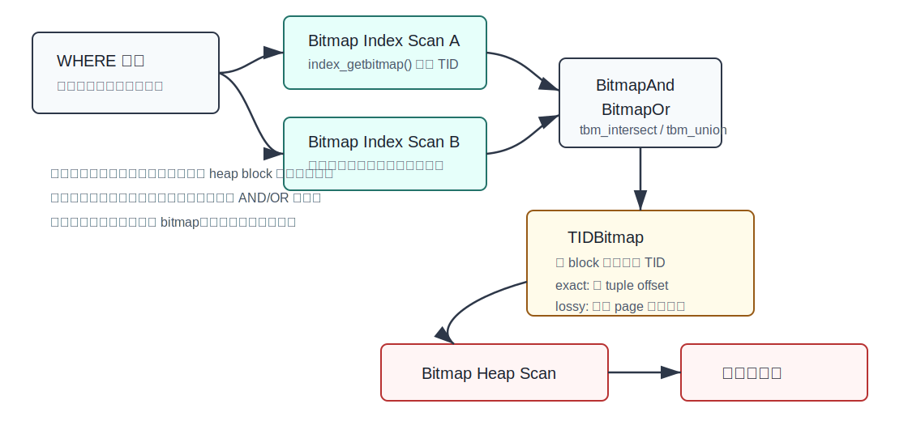
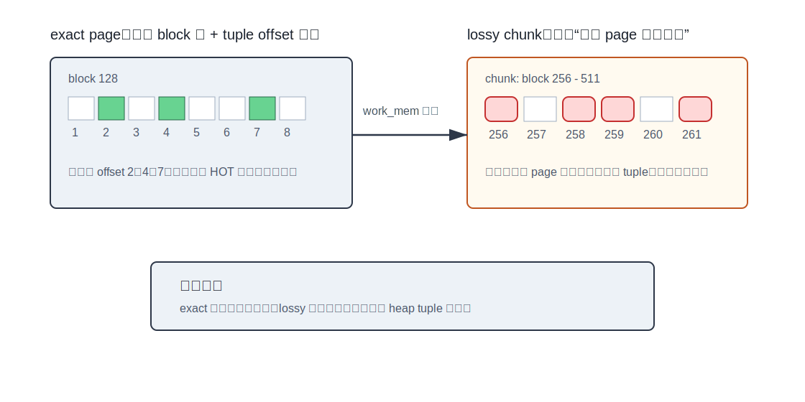
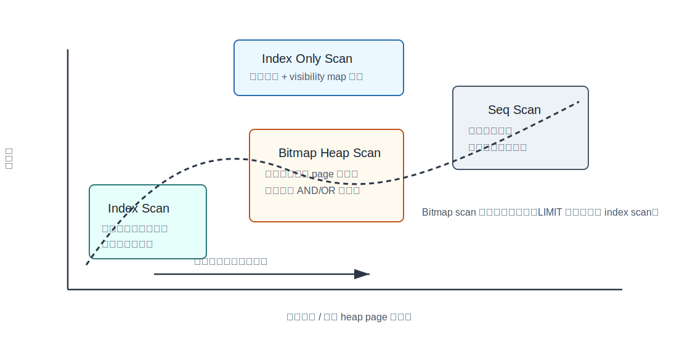
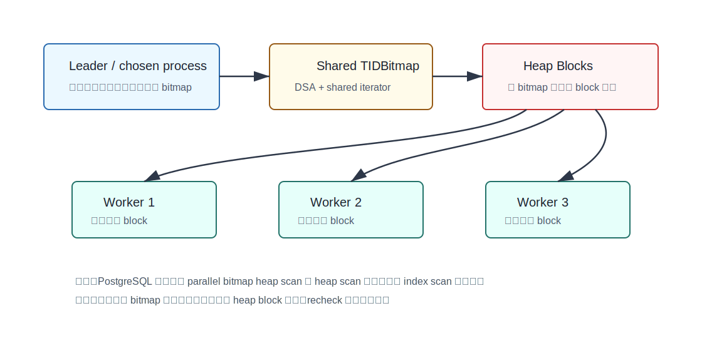

## 数据库筑基课 - 数据扫描方法 bitmap scan

### 作者
digoal

### 日期
2026-05-30

### 标签
PostgreSQL , 应用开发者 , 数据库筑基课 , 扫描算法 , 执行器 , 优化器 , Bitmap Scan

----

## 背景


本节属于数据库基础能力里的“扫描与执行算法”。前面讲 `Seq Scan` 时，重点是“读很多数据时怎样顺序读得稳”；讲 `Index Scan` 时，重点是“低选择率查询怎样通过索引定位少量行”。`Bitmap Scan` 夹在两者之间：当候选行已经不是很少，但还没多到值得全表扫，尤其是多个条件各自有索引时，它把问题改写成：

```text
先用索引批量收集候选 TID -> 在内存里合并候选集合 -> 按 heap block 顺序访问表
```

数据库筑基课大纲在当前项目中未找到可引用文件，因此本文按“扫描/执行算法”独立成篇。本文主要以 PostgreSQL 本地源码和官方文档为准，结合 DeepWiki 对 `postgres/postgres` 的架构摘要。用户给出的三篇资料 `Bitmap Indexing for Large Statistical Databases`、`An Efficient Compression Scheme for Bitmap Indices`、`Access Method Internals in PostgreSQL` 在当前项目中未找到原文文件；本文只把它们作为概念参照，不引用无法核验的实验数字或页码。

先纠正一个常见误解：PostgreSQL 计划里的 `Bitmap Heap Scan` / `Bitmap Index Scan` 不是说 PostgreSQL 原生创建了“磁盘上的 bitmap index”。它通常是用 B-tree、GIN、GiST、BRIN、hash、SP-GiST 等支持 `amgetbitmap` 的访问方法，在执行期把命中的 TID 放进内存 `TIDBitmap`。Greenplum 等系统有独立的 bitmap index 访问方法，那是另一个话题。

## 一、它解决什么问题？

普通 `Index Scan` 的弱点是随机回表。索引项在索引里可能相邻，但它们指向的 heap tuple 可能分散在表文件各处。返回几十行时没问题；返回几万行、几十万行时，随机读 heap page、重复访问同一 page、频繁 pin/unpin buffer，可能比顺序扫描更差。

`Bitmap Scan` 的核心目标是降低这类随机访问：

1. 先扫描索引，拿到候选 tuple 的 TID。
2. 把 TID 按 heap block 聚合到 `TIDBitmap`。
3. 多个索引条件可以在 bitmap 层做 `AND` / `OR`。
4. 最后按 block 顺序访问 heap，减少随机 I/O 和重复访问。

它付出的代价也很明确：

- 需要先把 bitmap 建出来，启动成本比普通 `Index Scan` 高。
- 访问 heap 时按物理 block 顺序走，原索引顺序丢失，`ORDER BY` 可能需要额外 `Sort`。
- bitmap 受 `work_mem` 约束，内存不足会退化成 lossy page，增加 recheck 和 tuple 检查。
- 对 `LIMIT 1`、`LIMIT 10` 这类能提前停止的查询，bitmap scan 往往不划算，因为它通常要先完成 bitmap 构建。

PostgreSQL 文档的 `EXPLAIN` 章节给过典型例子：两个单列索引分别处理 `unique1 < 100` 和 `unique2 > 9000`，再用 `BitmapAnd` 合并，最后进入 `Bitmap Heap Scan`。文档同时提醒：这需要访问两个索引，不一定总比使用一个索引再过滤另一个条件更好。

## 二、它是什么？

在 PostgreSQL 中，bitmap scan 是一组计划节点和一个内存数据结构的协作：

| 组件 | 作用 | 典型源码 |
|---|---|---|
| `BitmapIndexScan` | 调用索引 AM 的 `amgetbitmap`，把候选 TID 写入 `TIDBitmap` | `src/backend/executor/nodeBitmapIndexscan.c` |
| `BitmapAnd` | 对多个子 bitmap 做交集 | `src/backend/executor/nodeBitmapAnd.c` |
| `BitmapOr` | 对多个子 bitmap 做并集 | `src/backend/executor/nodeBitmapOr.c` |
| `TIDBitmap` | 内存中的候选 TID 集合，支持 exact/lossy 表示 | `src/backend/nodes/tidbitmap.c` |
| `BitmapHeapScan` | 按 bitmap 命中的 heap block 访问表并做 recheck | `src/backend/executor/nodeBitmapHeapscan.c` |
| TableAM bitmap 接口 | 根据 `TIDBitmap` 从表访问方法中取 tuple | `src/include/access/tableam.h`、`src/backend/access/heap/heapam_handler.c` |

索引访问方法层的接口是 `amgetbitmap(IndexScanDesc scan, TIDBitmap *tbm)`。PostgreSQL 文档 `indexam.sgml` 明确说，它会把本次扫描的所有匹配 TID 加入调用方传入的 `TIDBitmap`，返回匹配数量；它可以标记某些 TID 需要 recheck；它和 `amgettuple` 不能在同一个 index scan 中混用；并且 `amgetbitmap` 不支持 index-only scan，因为 bitmap 只返回位置，不返回索引 tuple 内容。

## 三、核心原理

### 3.1 从 SQL 条件到 BitmapHeapScan



图 1 说明：`BitmapIndexScan` 不向上逐行返回 tuple，而是通过 `MultiExecBitmapIndexScan()` 生成 `TIDBitmap`。多个 bitmap 可以交给 `BitmapAnd` / `BitmapOr` 合并。真正返回 tuple 的节点是 `BitmapHeapScan`，它按 bitmap 中的 block 顺序访问 heap，再做 MVCC 可见性判断、lossy recheck 和剩余过滤。

源码主线如下：

- `src/backend/optimizer/path/indxpath.c`：寻找可用于 bitmap scan 的索引路径，构造 `BitmapOrPath`，并在多个候选 bitmap index paths 中选择组合。
- `src/backend/optimizer/util/pathnode.c`：`create_bitmap_heap_path()`、`create_bitmap_and_path()`、`create_bitmap_or_path()` 创建路径节点。
- `src/backend/optimizer/plan/createplan.c`：`create_bitmap_scan_plan()` 把 `BitmapHeapPath` 转成 `BitmapHeapScan` 计划节点；`create_bitmap_subplan()` 递归生成 `BitmapIndexScan`、`BitmapAnd`、`BitmapOr`。
- `src/backend/executor/nodeBitmapIndexscan.c`：`MultiExecBitmapIndexScan()` 创建 `TIDBitmap`，调用 `index_getbitmap()`。
- `src/backend/access/index/indexam.c`：`index_getbitmap()` 调用具体索引 AM 的 `amgetbitmap`。
- `src/backend/executor/nodeBitmapHeapscan.c`：`BitmapTableScanSetup()` 先执行外层 bitmap 子计划，再开始 bitmap heap 扫描。
- `src/backend/access/heap/heapam_handler.c`：`BitmapHeapScanNextBlock()` 对 exact/lossy page 采取不同访问策略。

### 3.2 TIDBitmap：exact 与 lossy



图 2 说明：`TIDBitmap` 的粒度不是“行数组”，而是围绕 PostgreSQL TID 的两段结构组织：`BlockNumber + OffsetNumber`。内存充足时，exact page 记录某个 block 内哪些 tuple offset 命中；内存紧张时，lossy chunk 只记录某些 page 需要访问，不再记具体 offset。

`tidbitmap.c` 文件开头的注释把设计讲得很清楚：

- exact：对某个 page 保存 tuple offset bitmap。
- lossy：只保存“这个 page 需要访问”，不再保存 page 内具体 tuple。
- recheck：即使是 exact page，也可能因为索引 AM 只能返回候选匹配而要求复核原条件。
- PostgreSQL 采用“一 bit 表示一个 disk page”的 lossy 表示。注释提到，在标准 8KB `BLCKSZ` 下，约 1MB 内存可以表示 64GB 磁盘空间的 page 级命中信息。

关键常量和结构：

- `TBM_MAX_TUPLES_PER_PAGE = MaxHeapTuplesPerPage`，page 内 tuple offset 位图有固定上限。
- `PAGES_PER_CHUNK = BLCKSZ / 32`，lossy chunk 聚合一段 page。
- `PagetableEntry` 同时承载 exact page 和 lossy chunk：`ischunk=false` 表示 exact page，`ischunk=true` 表示 lossy chunk。
- `tbm_add_tuples()` 添加 tuple TID；`tbm_add_page()` 添加 lossy page；`tbm_union()` / `tbm_intersect()` 做并集/交集；`tbm_lossify()` 在条目数超过内存约束时丢失部分精度。

这个设计是典型的工程折中：bitmap scan 想用内存换更好的 heap 访问顺序，但不能让一个查询无限吃内存。所以 PostgreSQL 允许精度下降，换来内存上界；正确性再由 heap 阶段的 recheck 保证。

### 3.3 Heap 阶段：exact page 少看 tuple，lossy page 多做复核

`BitmapHeapScan` 最终调用 TableAM 的 bitmap 扫描接口。默认 heap AM 的关键逻辑在 `heapam_handler.c:BitmapHeapScanNextBlock()`：

```text
从 TIDBitmap 取下一个 block
如果是 exact page:
    提取 tuple offsets
    对这些 offsets 跟 HOT 链，找当前快照可见版本
如果是 lossy page:
    遍历该 page 的所有 normal line pointer
    对每个 tuple 做 MVCC 可见性判断
把可见 tuple offset 放入当前 scan descriptor
```

随后 `nodeBitmapHeapscan.c:BitmapHeapNext()` 从 table scan 取 tuple。如果 `node->recheck` 为真，就用 `bitmapqualorig` 重新执行原 bitmap 条件；不通过的 tuple 计入过滤并丢弃。

这解释了 `EXPLAIN (ANALYZE)` 中常见的两行：

```text
Recheck Cond: (...)
Heap Blocks: exact=10
```

`Recheck Cond` 不是一定说明条件真的被大量复核。它表示在计划上需要保留用于复核的原条件；实际是否复核，取决于 page 是否 lossy，以及索引 AM 是否要求 recheck。`Heap Blocks: exact=... lossy=...` 才是判断 bitmap 精度的重要观测项。

### 3.4 为什么 `work_mem` 会影响 bitmap scan？

`MultiExecBitmapIndexScan()` 创建 `TIDBitmap` 时使用：

```c
tbm_create(work_mem * (Size) 1024, ...)
```

优化器估算 bitmap heap scan 时也会调用：

```c
maxentries = tbm_calculate_entries(work_mem * (Size) 1024);
```

如果估算的 heap pages 超过 `maxentries`，`costsize.c:compute_bitmap_pages()` 会估算 exact/lossy pages，并在 lossy pages 存在时增加 bitmap heap node 需要处理的 tuple 数。源码注释也承认这个估算比较粗糙，因为 `tbm_lossify()` 一旦内存不足，lossy page 数可能上升得很快。

工程含义：

- `work_mem` 太小，bitmap 更容易 lossify，`Rows Removed by Index Recheck` 或 CPU 复核成本可能上升。
- `work_mem` 太大也不是免费午餐，并发查询会把内存消耗放大。
- bitmap scan 的内存受单个执行节点和执行次数影响，不能只看单条 SQL。

### 3.5 优化器什么时候偏向 Bitmap Scan？



图 3 说明：bitmap scan 的优势区间通常在普通 index scan 和 seq scan 之间。候选行太少时，普通 index scan 可以边找边返回，甚至配合 `LIMIT` 提前停止；候选行太多时，顺序扫描吞吐更好；候选行中等、命中的 heap page 可以收敛、多个索引条件可以组合时，bitmap scan 才容易胜出。

PostgreSQL 成本模型里几个关键点：

- `cost_bitmap_heap_scan()` 的启动成本包含生成 bitmap 的索引扫描成本。
- heap page 数使用 Mackert-Lohman 风格公式估算，并按读少量 page 更像随机读、读接近全表更像顺序读做插值。
- `cost_bitmap_and_node()` 默认按输入条件独立估算 AND 选择率，源码注释承认这经常不准确，但缺少更好信息。
- `cost_bitmap_or_node()` 默认把 OR 输入近似看作不重叠，并把选择率 clamp 到 1.0。
- `enable_bitmapscan` 只是影响优化器使用 bitmap-scan 计划类型，默认开启；它不是语义开关。

这也是为什么 `ANALYZE` 和扩展统计信息很重要。多个条件相关性很强时，优化器把它们当独立条件相乘，可能会严重低估或高估 bitmap AND 后的结果行数。

### 3.6 并行 Bitmap Heap Scan



图 4 说明：PostgreSQL 文档对 parallel bitmap heap scan 的描述是：选一个进程扫描一个或多个索引并构建 bitmap，然后把需要访问的 table blocks 分给协作进程。也就是说 heap scan 可以并行，底层 index scan 不是并行执行。

源码上，`nodeBitmapHeapscan.c` 使用 `ParallelBitmapHeapState` 协调：

- `BM_INITIAL`：bitmap 创建尚未开始。
- `BM_INPROGRESS`：某个进程正在创建 bitmap，其他 worker 等待。
- `BM_FINISHED`：bitmap 创建完成，worker 可以共同迭代。

共享 bitmap 迭代依赖 DSA 和 shared iterator。这个设计的边界很清楚：如果瓶颈在 heap blocks 访问和 tuple recheck，并行有帮助；如果瓶颈在单进程构建 bitmap 或上层节点汇聚，并行收益会受限。

## 四、横向对比

| 维度 | Bitmap Heap Scan | Index Scan | Seq Scan | Index Only Scan | 持久化 Bitmap Index |
|---|---|---|---|---|---|
| 主要目标 | 批量收集 TID，按 heap block 访问 | 少量候选行逐个回表 | 大比例顺序读表 | 尽量只读索引 | 用位图长期表示列值到行位置 |
| PostgreSQL 原生含义 | 执行期内存 `TIDBitmap` | 普通索引访问路径 | 表访问路径 | 覆盖索引 + visibility map | PostgreSQL core 不是这个含义 |
| 多条件组合 | 强，支持 `BitmapAnd` / `BitmapOr` | 通常受单个索引顺序和条件限制 | 不依赖索引 | 取决于覆盖索引 | 强，位运算是核心优势 |
| 读取模式 | heap block 顺序较好 | heap 随机访问较多 | 顺序/预取友好 | 索引页为主，必要时回表 | 取决于实现 |
| 启动成本 | 较高，要先建 bitmap | 低，可边扫边返 | 低 | 低到中 | 查询低，维护高 |
| 排序能力 | 丢失索引顺序 | 可利用索引顺序 | 无天然排序 | 可利用索引顺序 | 通常不提供行顺序 |
| 内存敏感性 | 受 `work_mem` 影响 | 较低 | 较低 | 较低 | 取决于压缩与缓存 |
| 写入维护 | 不维护额外 bitmap，只维护普通索引 | 维护普通索引 | 无索引维护 | 维护覆盖索引 | 写放大明显 |
| 适合场景 | 中等选择率、多索引组合、大表过滤 | 点查、Top-N、极低选择率 | 全表聚合、低选择率过滤、小表 | 覆盖查询、all-visible 高 | 低/中基数、读多写少、分析型 |
| 不适合场景 | 小 `LIMIT`、几乎全表、`work_mem` 过小 | 大比例随机回表 | 高选择率点查 | 频繁更新、非覆盖查询 | 高并发 OLTP 更新 |

这里最重要的区别是：PostgreSQL bitmap scan 是“执行计划中的动态 bitmap”，不是“索引类型中的 bitmap index”。论文里的 bitmap indexing 与压缩 bitmap index 主要讨论持久化位图如何表达低基数字段、如何压缩、如何做位运算；PostgreSQL 的 `TIDBitmap` 则是查询执行中的临时候选集合。二者都利用 bitmap 的集合运算思想，但生命周期、维护成本和优化目标不同。

## 五、效果如何？

收益：

- 多个索引条件可以先在内存中做集合运算，减少 heap 访问范围。
- heap 访问按 block 组织，比普通 index scan 的随机回表更友好。
- exact page 能只检查命中的 offsets，减少 page 内 tuple 检查。
- lossy 表示让大结果集也能受内存上界约束，不至于无限增长。
- 支持 parallel bitmap heap scan，把 heap block 访问分给多个 worker。

代价：

- 启动成本高。查询必须先扫描索引并构建 bitmap，不能像 index scan 那样自然地边找边返回。
- 顺序丢失。文档明确说明 heap rows 按 bitmap 的物理布局访问，因此原索引顺序不能保留。
- 内存不足会 lossify，导致更多 tuple recheck 和 CPU 消耗。
- 相关性估算困难。多个条件的 AND/OR 选择率如果估错，计划就可能选错。
- `BitmapAnd` / `BitmapOr` 在 `EXPLAIN ANALYZE` 中实际行数显示为 0，这是实现限制，不表示没有处理数据。
- bitmap scan 对统计视图也有特殊性：PostgreSQL 文档说明 bitmap scan 会增加所用索引的 `pg_stat_all_indexes.idx_tup_read`，并增加表的 `pg_stat_all_tables.idx_tup_fetch`，但不增加具体索引的 `idx_tup_fetch`，因为 heap fetch 很难归因到单个索引。

不要把 bitmap scan 理解成“比 index scan 更高级”。它只是解决了不同成本结构的问题：把大量随机 TID 回表改成先收集、再按 page 访问。

## 六、实操 DEMO

下面示例是可执行 SQL，但本文没有启动本地 PostgreSQL 实例运行，因此不提供伪造的实际输出。示例目标是让读者在自己的环境里观察 `BitmapAnd`、`Heap Blocks: exact/lossy`、`Recheck Cond` 和 `work_mem` 的影响。

```sql
CREATE TABLE demo_bitmap_scan (
    id bigserial PRIMARY KEY,
    city_id int NOT NULL,
    status int NOT NULL,
    created_at timestamptz NOT NULL DEFAULT now(),
    payload text
);

INSERT INTO demo_bitmap_scan (city_id, status, created_at, payload)
SELECT
    (random() * 999)::int,
    (random() * 9)::int,
    now() - ((random() * 365)::int || ' days')::interval,
    repeat(md5(g::text), 4)
FROM generate_series(1, 1000000) AS g;

CREATE INDEX demo_bitmap_scan_city_idx ON demo_bitmap_scan(city_id);
CREATE INDEX demo_bitmap_scan_status_idx ON demo_bitmap_scan(status);
ANALYZE demo_bitmap_scan;
```

观察两个单列索引组合：

```sql
EXPLAIN (ANALYZE, BUFFERS)
SELECT *
FROM demo_bitmap_scan
WHERE city_id BETWEEN 10 AND 30
  AND status IN (1, 2);
```

你可能看到类似结构：

```text
Bitmap Heap Scan on demo_bitmap_scan
  Recheck Cond: ...
  Heap Blocks: exact=...
  -> BitmapAnd
       -> Bitmap Index Scan on demo_bitmap_scan_city_idx
       -> Bitmap Index Scan on demo_bitmap_scan_status_idx
```

测试 `LIMIT` 对计划的影响：

```sql
EXPLAIN
SELECT *
FROM demo_bitmap_scan
WHERE city_id BETWEEN 10 AND 30
  AND status IN (1, 2)
LIMIT 5;
```

如果普通 index scan 能快速找到前几行，优化器可能避免 bitmap scan，因为 bitmap scan 的启动成本无法被 `LIMIT` 提前截断。

测试 `work_mem` 对 lossy page 的影响：

```sql
SET work_mem = '64kB';

EXPLAIN (ANALYZE, BUFFERS)
SELECT *
FROM demo_bitmap_scan
WHERE city_id BETWEEN 1 AND 500
  AND status IN (1, 2, 3, 4, 5);
```

重点看：

```text
Heap Blocks: exact=... lossy=...
Rows Removed by Index Recheck: ...
```

如果出现大量 lossy page，说明 bitmap 精度因为内存或结果集规模下降，heap 阶段要检查更多 tuple。调大 `work_mem` 可能减少 lossy page，但是否值得，要结合并发内存预算和整体计划比较。

## 七、最佳实践

面向数据库架构师：

- 把 bitmap scan 放在扫描方法谱系中理解：它服务于“中等选择率 + page 聚合 + 多索引组合”，不是替代所有 index scan。
- 对多条件查询，先判断是建多列索引更好，还是多个单列索引配合 bitmap scan 更灵活。多列索引通常对固定谓词组合更高效；多个单列索引对查询形态变化更有弹性。
- 对读多写少、低/中基数字段很多的分析型系统，可以研究持久化 bitmap index、Roaring bitmap、列存 zone map 等方案；不要误以为 PostgreSQL core 的 bitmap scan 已经提供了这类持久化结构。

面向 DBA：

- 定期 `ANALYZE`，必要时使用扩展统计信息描述多列相关性，否则 `BitmapAnd` 选择率容易估错。
- 观察 `EXPLAIN (ANALYZE, BUFFERS)` 中的 `Heap Blocks: exact/lossy`、`Rows Removed by Index Recheck`、实际行数与估算行数偏差。
- 不要粗暴关闭 `enable_bitmapscan`。只有在定位计划问题时临时对比，最终应通过统计信息、索引设计、成本参数和 SQL 形态解决。
- 调整 `work_mem` 要按并发乘数估算。bitmap scan、sort、hash join、hash aggregate 都可能消耗 `work_mem`。

面向业务开发者：

- 对小 `LIMIT` 查询，优先设计能按排序或过滤条件快速返回的索引，不要指望 bitmap scan 提前停止。
- 多个可选筛选项组合的搜索页，单列索引 + bitmap scan 可能比大量排列组合多列索引更现实，但要用真实参数做压测。
- `ORDER BY` 很重要时，注意 bitmap scan 会丢失索引顺序。看到计划里多了 `Sort`，不要只盯着索引是否被使用。
- 谓词写法要保持可索引，例如避免对列做无法匹配表达式索引的函数包装。

## 八、适合与不适合场景

适合：

- 大表上两个或多个条件各自有较好选择率，组合后结果明显缩小。
- 单个索引命中行数不少，但命中的 heap page 可以明显少于全表 page。
- `WHERE a = ... OR a = ...`、`WHERE x = ... AND y = ...` 这类能拆成多个 bitmap 子路径的查询。
- GIN、GiST、BRIN 等访问方法返回候选集合后需要 heap recheck 的场景。
- 查询不依赖索引顺序，或者排序成本可以接受。

不适合：

- 极低选择率点查，普通 `Index Scan` 更直接。
- 小 `LIMIT`、Top-N，尤其是索引顺序能直接满足 `ORDER BY` 时。
- 需要返回表中很大比例数据，`Seq Scan` 可能更稳定。
- `work_mem` 很小且结果集大，lossy page 多到 recheck 成本过高。
- 条件相关性强但统计信息不足，优化器容易误判组合选择率。
- 高并发 OLTP 查询中，为了少数复杂筛选添加大量单列索引，写入维护成本可能超过读取收益。

## 九、常见坑

1. 把 `Bitmap Index Scan` 当成“bitmap index”。PostgreSQL core 里它通常是在普通索引上执行 `amgetbitmap`，生成临时 `TIDBitmap`。
2. 看到 `Recheck Cond` 就以为索引失效。它是 bitmap heap scan 正确性机制的一部分，是否大量复核要看 lossy pages 和实际过滤指标。
3. 忽略顺序丢失。bitmap scan 按 heap block 访问，不保证索引顺序；有 `ORDER BY` 可能需要额外排序。
4. 用很小的 `work_mem` 跑大范围 bitmap scan。lossy page 增多后，CPU recheck 和 heap tuple 检查会明显放大。
5. 只建单列索引，不评估多列索引。固定高频查询组合通常应优先测试多列索引，而不是完全依赖 bitmap AND。
6. 误读 `BitmapAnd` / `BitmapOr` 的实际行数。PostgreSQL 文档说明这两个节点在 `EXPLAIN ANALYZE` 中实际 row count 总是报告为 0。
7. 统计信息过旧。bitmap scan 是否划算高度依赖选择率和 page 数估算，表数据分布变化后必须重新分析。

## 十、扩展问题

1. 为什么 PostgreSQL 的 `amgetbitmap` 不能同时支持 index-only scan？如果 bitmap 里只保存 TID，缺少了哪些信息？
2. 对同一个查询，两个单列索引 bitmap AND 与一个多列 B-tree 索引相比，启动成本、排序能力、写入成本分别如何变化？
3. 如果 `Heap Blocks: lossy` 很高，你会先调 `work_mem`、改索引、改 SQL，还是接受 `Seq Scan`？验证顺序是什么？
4. 持久化 bitmap index 适合低基数字段，但为什么高并发 OLTP 更新场景通常不适合？
5. 扩展统计信息怎样帮助优化器更准确估算 `WHERE x = ... AND y = ...` 的组合选择率？

## 十一、扩展阅读

- PostgreSQL 源码：`postgres/src/backend/nodes/tidbitmap.c`，`TIDBitmap` exact/lossy 表示、union/intersect、lossify、iterator。
- PostgreSQL 源码：`postgres/src/include/nodes/tidbitmap.h`，`TBMIterateResult`、`tbm_add_tuples()`、`tbm_add_page()`、`tbm_iterate()` API。
- PostgreSQL 源码：`postgres/src/backend/executor/nodeBitmapIndexscan.c`，`MultiExecBitmapIndexScan()` 如何创建 `TIDBitmap` 并调用 `index_getbitmap()`。
- PostgreSQL 源码：`postgres/src/backend/executor/nodeBitmapHeapscan.c`，bitmap heap scan 初始化、recheck、parallel shared state。
- PostgreSQL 源码：`postgres/src/backend/executor/nodeBitmapAnd.c` 与 `nodeBitmapOr.c`，bitmap 集合运算执行节点。
- PostgreSQL 源码：`postgres/src/backend/access/heap/heapam_handler.c`，heap AM 如何处理 exact/lossy bitmap page。
- PostgreSQL 源码：`postgres/src/backend/optimizer/path/costsize.c`，`cost_bitmap_heap_scan()`、`cost_bitmap_and_node()`、`cost_bitmap_or_node()`、`compute_bitmap_pages()`。
- PostgreSQL 文档：`postgres/doc/src/sgml/indices.sgml`，`Combining Multiple Indexes` 章节解释 bitmap scan 组合索引、物理顺序访问和顺序丢失。
- PostgreSQL 文档：`postgres/doc/src/sgml/indexam.sgml`，`amgetbitmap` 接口、限制、recheck 与 MVCC snapshot 安全性。
- PostgreSQL 文档：`postgres/doc/src/sgml/perform.sgml`，`EXPLAIN` 中 `Bitmap Heap Scan`、`BitmapAnd` 示例和实际 row count 限制。
- PostgreSQL 文档：`postgres/doc/src/sgml/parallel.sgml`，parallel bitmap heap scan 的 leader 构建 bitmap、worker 并行 heap scan。
- PostgreSQL 文档：`postgres/doc/src/sgml/config.sgml`，`enable_bitmapscan` 配置项。
- PostgreSQL 文档：`postgres/doc/src/sgml/monitoring.sgml`，bitmap scan 对 `pg_stat_all_indexes` 与 `pg_stat_all_tables` 计数的影响。
- DeepWiki：`postgres/postgres`，用于梳理 query processing pipeline、table/index management 与 bitmap scan 相关源码入口；关键结论已用本地源码和文档复核。
- 概念参照：`Bitmap Indexing for Large Statistical Databases`、`An Efficient Compression Scheme for Bitmap Indices`、`Access Method Internals in PostgreSQL`。当前项目未提供原文文件，本文未引用其中未核验的具体数据。
  
## 附录 
1、询问 gemini
```
PostgreSQL 数据扫描方法 bitmap scan 相关的论文
```

2、克隆代码  
```  
git clone --depth 1 https://github.com/postgres/postgres
```  
  
3、启用 codex, 使用 [数据库筑基课 skill](../skills/README.md).  
```
文章标题: 
  数据库筑基课 - 数据扫描方法 bitmap scan
项目源码(已克隆到当前项目如下目录中):  
  postgres
相关论文或分享:
  Bitmap Indexing for Large Statistical Databases
  An Efficient Compression Scheme for Bitmap Indices
  Access Method Internals in PostgreSQL
项目 deepwiki reponame:  
  postgres/postgres
项目参考信息: 
  postgres/CLAUDE.md
```
  
  
#### [PostgreSQL 解决方案集合](../201706/20170601_02.md "40cff096e9ed7122c512b35d8561d9c8")
  
  
#### [德哥 / digoal's Github - 公益是一辈子的事.](https://github.com/digoal/blog/blob/master/README.md "22709685feb7cab07d30f30387f0a9ae")
  
  
#### [About 德哥](https://github.com/digoal/blog/blob/master/me/readme.md "a37735981e7704886ffd590565582dd0")
  
  

  
