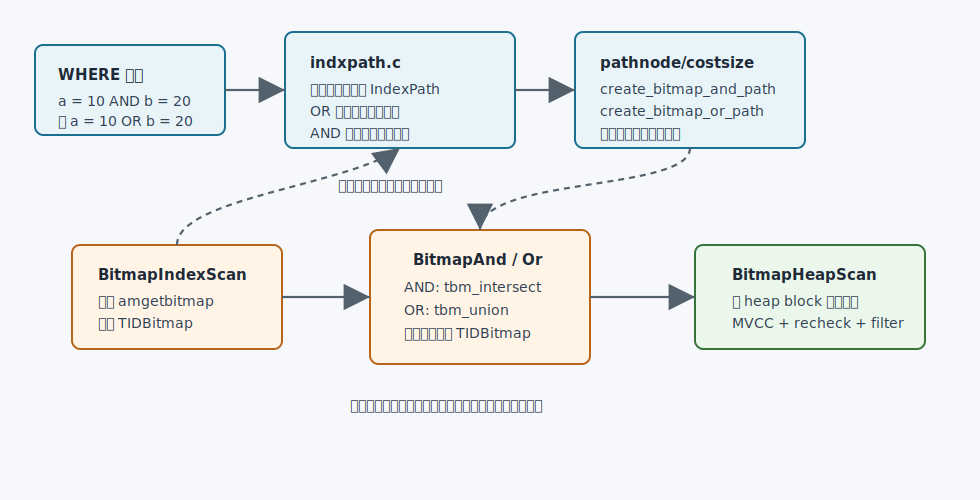
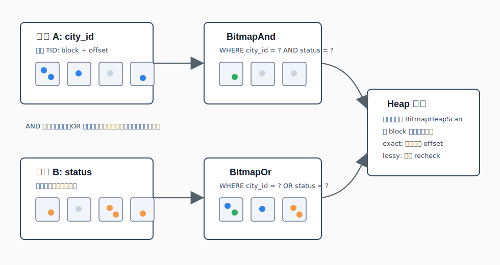
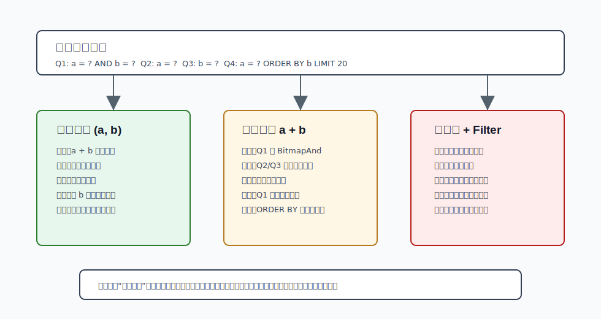
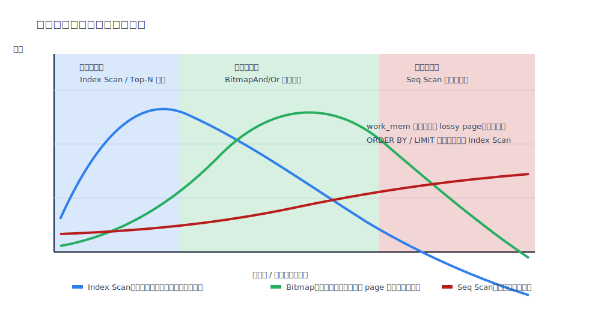

## 数据库筑基课 - 数据扫描方法 Multi-Index Bitmap Scan

### 作者
digoal

### 日期
2026-05-30

### 标签
PostgreSQL , 应用开发者 , 数据库筑基课 , 扫描算法 , 执行器 , 优化器 , Multi-Index Bitmap Scan

----

## 背景
  


本节属于数据库基础能力里的“扫描与执行算法”。前面已有 `Seq Scan`、`Index Scan`、`Index Only Scan`、`Bitmap Scan` 作为基础。本文只讨论更窄的一类问题：当一条 SQL 同时出现多个可索引条件时，PostgreSQL 怎样把多个索引扫描结果组合成一个候选集合，再访问表。

数据库筑基课大纲在当前项目中未找到可引用文件，因此本文按“扫描/执行算法”独立成篇。本文以 PostgreSQL 本地源码、官方文档和 DeepWiki 对 `postgres/postgres` 的架构摘要为主。用户给出的资料 `The Set-Query Alternative for Data Stream, Decision Support, and Operational Applications` 与 `SIMD Compression classes for modern vectorised query engines` 在当前项目中没有原文文件；我只把它们作为外部思想参照：前者对应“把条件命中集合先做集合运算”的查询范式，后者对应“现代分析引擎会把 bitmap、选择向量、压缩和 SIMD 结合起来优化过滤”。本文不引用无法核验的实验数字。

先划清边界：PostgreSQL 的 Multi-Index Bitmap Scan 不是磁盘上有一个“多索引 bitmap index”。它是在执行期用 B-tree、GIN、GiST、BRIN、hash、SP-GiST 等支持 `amgetbitmap` 的索引访问方法，把候选 TID 写进内存 `TIDBitmap`，再用 `BitmapAnd` 或 `BitmapOr` 合并。

## 一、它解决什么问题？

业务查询里经常出现这样的条件：

```sql
WHERE city_id = 42
  AND status = 1
  AND created_at >= now() - interval '7 days'
```

或者：

```sql
WHERE city_id = 42
   OR status = 1
```

如果只有单列索引，普通 `Index Scan` 通常只能选一个主要索引先回表，再把其他条件当 `Filter`。当被选索引返回的候选行很多时，回表后再过滤会产生大量随机 heap page 访问。

Multi-Index Bitmap Scan 把问题改写成：

```text
分别用多个索引找到候选 TID
-> 在内存里做 AND / OR 集合运算
-> 得到更精确或更完整的候选 heap block
-> 按 heap block 顺序访问表
```

它解决的是“多个条件各自有索引，但单个索引都不够好”的中间地带。代价也很明确：

- 每多用一个索引，就多一次索引扫描和一次 bitmap 组合成本。
- 必须先构建 bitmap，启动成本高，不适合小 `LIMIT` 的早停查询。
- heap 访问按物理 block 顺序进行，索引原本能提供的顺序会丢失。
- `work_mem` 不足时 `TIDBitmap` 会 lossify，导致更多 recheck。
- 选择率估算依赖统计信息，多条件相关性强时容易选错计划。

## 二、它是什么？

Multi-Index Bitmap Scan 是 PostgreSQL bitmap scan 能力在多个索引条件上的组合形式。它由三层组成：

| 层次 | 组件 | 作用 | 关键源码 |
|---|---|---|---|
| 优化器路径 | `IndexPath`、`BitmapAndPath`、`BitmapOrPath`、`BitmapHeapPath` | 枚举可索引条件，决定用单索引还是组合索引 | `src/backend/optimizer/path/indxpath.c`、`pathnode.c` |
| 代价模型 | `cost_bitmap_and_node()`、`cost_bitmap_or_node()`、`cost_bitmap_heap_scan()` | 估算索引扫描、集合运算、heap page 访问和 recheck 成本 | `src/backend/optimizer/path/costsize.c` |
| 执行器节点 | `BitmapIndexScan`、`BitmapAnd`、`BitmapOr`、`BitmapHeapScan` | 生成位图、合并位图、访问 heap 并复核条件 | `src/backend/executor/nodeBitmap*.c` |

官方文档把这类能力称为“Combining Multiple Indexes”。文档明确说明：系统会扫描每个需要的索引，在内存中准备表示表行位置的 bitmap，然后按查询需要对 bitmap 做 AND/OR，最后访问实际表行。文档也提醒：表行按物理顺序访问，因此原始索引顺序会丢失；每增加一个索引扫描也会增加时间，所以优化器有时仍会选择简单 index scan。



图 1 说明：计划期先在 `indxpath.c` 中发现可用于 bitmap 的索引路径，再由 `BitmapAndPath` / `BitmapOrPath` 表达组合逻辑。执行期 `BitmapIndexScan` 不返回 tuple，而是返回 `TIDBitmap`；真正产出行的是祖先节点 `BitmapHeapScan`。

## 三、核心原理

### 3.1 OR 条件：每一臂都要能被索引处理

`generate_bitmap_or_paths()` 会遍历限制条件中的 OR 子句。一个重要规则是：OR 的每一臂都必须能匹配到至少一个索引路径，否则这个 OR 子句不能整体变成 `BitmapOrPath`。

例如：

```sql
WHERE city_id = 42 OR status = 1
```

如果 `city_id` 和 `status` 都有可用索引，优化器可以生成两个 bitmap index path，再做 `BitmapOr`。

但如果写成：

```sql
WHERE city_id = 42 OR lower(payload) = 'abc'
```

而 `lower(payload)` 没有表达式索引，那么这个 OR 很难整体用 bitmap OR 表达。数据库不能只用一半 OR 条件生成候选集合，否则会漏掉另一半结果。

源码上，`generate_bitmap_or_paths()` 对每个 OR arm 调用 `build_paths_for_OR()`，然后对每一臂内部可能存在的多个索引路径调用 `choose_bitmap_and()` 选出最合适的 AND 组合；只有所有 OR arm 都有可行路径时，才调用 `create_bitmap_or_path()`。

### 3.2 AND 条件：不是“索引越多越好”

对于 AND 条件，理论上可以枚举所有非空索引子集，选成本最低的组合。但 PostgreSQL 源码注释说得很直接：完全枚举是 `O(2^N)`，不现实，而且选择率估算本身也比较粗糙。

`choose_bitmap_and()` 采用启发式：

1. 如果多个路径使用完全相同的一组 WHERE 子句和索引谓词，只保留扫描成本最低的那个。
2. 按索引访问成本从低到高排序。
3. 以每个路径作为组合起点，逐个尝试加入更高成本路径。
4. 只有加入新路径能降低估算总成本，才保留这个 AND 组合。
5. 避免把使用同一 WHERE 子句的多个索引组合在一起，防止选择率被重复计算得过小。

这解释了一个常见现象：表上有三个单列索引，不代表执行计划一定会出现三个 `Bitmap Index Scan`。优化器会比较“多扫描一个索引带来的候选集缩小”是否抵得上“多一次索引扫描和位图交集”的成本。



图 2 说明：`BitmapAnd` 做交集，适合多个条件同时成立；`BitmapOr` 做并集，适合任一条件成立。合并后的结果仍然只是候选 TID 集合，不是最终可见行集合。MVCC 可见性、lossy page recheck、剩余过滤都在 heap 阶段完成。

### 3.3 代价模型：选择率估算很关键，也很脆弱

`cost_bitmap_and_node()` 和 `cost_bitmap_or_node()` 只估算索引扫描和 bitmap 创建/合并成本，不估算最终 heap 访问。最终 heap 访问由 `cost_bitmap_heap_scan()` 与 `compute_bitmap_pages()` 估算。

关键假设如下：

| 组合方式 | 选择率假设 | 源码中的风险提示 |
|---|---|---|
| `BitmapAnd` | 输入条件独立，选择率相乘 | 注释承认这经常是错的，但没有足够信息做得更好 |
| `BitmapOr` | 输入集合近似不重叠，选择率相加后 clamp 到 1.0 | 对 `x IN (...)` 常见情况较合理，但一般 OR 可能重叠 |
| heap page | 用 Mackert-Lohman 风格公式估算要访问的 heap page | 再结合 `work_mem` 估算 exact/lossy page |

因此，多索引 bitmap scan 的成败很依赖统计信息：

- 单列统计信息不够时，AND 条件相关性可能被误判。
- 例如 `province_id` 与 `city_id` 高度相关，把它们当独立条件相乘会低估结果行数。
- 可以考虑扩展统计信息，例如 `CREATE STATISTICS ... (dependencies, ndistinct, mcv)`，然后 `ANALYZE`。

### 3.4 执行器：BitmapAnd 可提前停止，BitmapOr 可少做 union

执行器层的代码很短，但工程含义很强。

`nodeBitmapAnd.c:MultiExecBitmapAnd()` 会按子计划顺序执行，每个子计划返回一个 `TIDBitmap`。第一个子 bitmap 作为结果，后续用 `tbm_intersect()` 做交集。如果中途结果已经为空，就停止执行剩余子计划，因为再 AND 也不会改变空集合。源码注释还提到，`indxpath.c` 按选择率排列子计划会让这种提前结束更可能发生。

`nodeBitmapOr.c:MultiExecBitmapOr()` 则做并集。它对直接子节点是 `BitmapIndexScan` 的情况做了优化：不是先创建子 bitmap 再 `tbm_union()`，而是把当前结果 bitmap 传给子节点，让子节点直接 OR 到同一个 `TIDBitmap` 里。

这也是为什么 `BitmapAnd` / `BitmapOr` 不是普通的逐行执行节点。它们的 `ExecProcNode` 入口会报错，实际通过 `MultiExecProcNode()` 一次性产出 bitmap。

### 3.5 从 path 到 plan：为什么 recheck 条件要保留

`create_bitmap_scan_plan()` 会把 `BitmapHeapPath` 转成 `BitmapHeapScan` 计划节点，并生成 `bitmapqualorig`。源码注释强调：bitmap scan 必须保留原始索引条件和部分索引谓词，因为当 bitmap 变成 lossy 时，这些条件需要在 heap 阶段重新检查。

这解释了 `EXPLAIN` 里常见的结构：

```text
Bitmap Heap Scan on orders
  Recheck Cond: ((city_id = 42) AND (status = 1))
  -> BitmapAnd
       -> Bitmap Index Scan on orders_city_idx
            Index Cond: (city_id = 42)
       -> Bitmap Index Scan on orders_status_idx
            Index Cond: (status = 1)
```

`Recheck Cond` 的存在不等于所有 tuple 都被大量复核。它表示执行器保留了正确性保险。真正观察 lossify 的重点是：

```text
Heap Blocks: exact=... lossy=...
Rows Removed by Index Recheck: ...
```

### 3.6 与 Set Query、SIMD/压缩思想的关系

Set Query 思路强调：对多个条件先各自产生命中集合，再通过集合运算得到候选对象。这和 Multi-Index Bitmap Scan 的抽象很接近：

```text
predicate -> set of row identifiers -> set algebra -> fetch rows
```

但 PostgreSQL 的 `TIDBitmap` 是执行期临时结构，目标是减少 heap 随机访问和支持多索引组合；它不是面向分析型压缩位图索引的持久化结构。

SIMD 压缩和现代向量化引擎资料提醒我们另一个方向：在列式/向量化执行器里，过滤结果常被表示成 selection vector、validity mask、compressed bitmap 或 row id list，并用 CPU 友好的方式批量传播。PostgreSQL 的 executor 不是典型向量化执行器，因此本文不把 SIMD 压缩作为 PostgreSQL 当前实现来讲，只作为理解“候选集合表示会影响 CPU 与内存效率”的延伸背景。

## 四、横向对比

| 维度 | Multi-Index Bitmap Scan | 多列 B-tree 索引 | 单索引 + Filter | Seq Scan | 持久化 Bitmap Index |
|---|---|---|---|---|---|
| 主要目标 | 多个索引结果做 AND/OR，再访问 heap | 一个复合键同时过滤或排序 | 用一个索引缩小候选，再过滤 | 直接扫描表 | 用持久化位图表达值到行集合 |
| 读取代价 | 多次索引扫描 + bitmap 合并 + heap 顺序访问 | 一次索引扫描，通常更精准 | 回表后过滤可能多 | 大比例读时稳定 | 位运算快，取决于压缩与执行器 |
| 启动成本 | 高 | 低到中 | 低 | 低 | 查询低，维护高 |
| 排序能力 | 丢失索引顺序 | 可利用索引顺序 | 取决于所选索引 | 无天然排序 | 通常不提供行顺序 |
| 写入代价 | 维护多个单列索引 | 维护一个更宽索引 | 维护较少索引 | 无索引维护 | 写放大通常明显 |
| 查询灵活性 | 对组合多变的条件友好 | 对固定主路径强 | 对简单查询足够 | 对全表分析强 | 对低/中基数分析过滤强 |
| PostgreSQL core 含义 | 执行期内存 `TIDBitmap` | 原生索引类型 | 原生计划形态 | 原生计划形态 | 不是 core 的 bitmap scan 含义 |



图 3 说明：多列索引通常在稳定主查询上更强，特别是还要满足 `ORDER BY` / `LIMIT` 时；多个单列索引更灵活，适合查询组合变化较多的系统；单索引加过滤维护成本最低，但可能把大量过滤推迟到回表之后。

## 五、效果如何？

收益集中在三个方面：

- **减少随机回表**：先合并多个索引的候选 TID，再按 heap block 访问。
- **组合多个弱选择性条件**：单个条件不够窄，但交集可能很窄。
- **处理 OR 条件**：多个索引可分别处理不同 OR arm，再做并集。

代价也集中在三个方面：

- **启动成本**：必须先完成 bitmap 构建，小 `LIMIT` 查询经常不划算。
- **排序损失**：文档明确说明 heap rows 按物理顺序访问，原索引顺序丢失。
- **内存与复核**：`TIDBitmap` 受 `work_mem` 影响，lossy page 会增加 recheck。



图 4 说明：Multi-Index Bitmap Scan 的优势通常在中等选择率区域。候选行极少时，普通 index scan 更能早停；候选行接近全表时，seq scan 的顺序吞吐更稳；中间区间才适合用 bitmap 的启动成本换 heap page 访问顺序。

## 六、实操 DEMO

下面 SQL 是可执行示例。本文没有启动本地 PostgreSQL 实例，因此不提供伪造的 `EXPLAIN ANALYZE` 数字。读者可以在自己的 PostgreSQL 环境中运行并观察计划形态。

### 6.1 构造数据

```sql
DROP TABLE IF EXISTS demo_multi_bitmap;

CREATE TABLE demo_multi_bitmap (
    id bigserial PRIMARY KEY,
    city_id int NOT NULL,
    status int NOT NULL,
    category int NOT NULL,
    created_at timestamptz NOT NULL,
    payload text
);

INSERT INTO demo_multi_bitmap (city_id, status, category, created_at, payload)
SELECT
    (random() * 999)::int,
    (random() * 9)::int,
    (random() * 99)::int,
    now() - ((random() * 365)::int || ' days')::interval,
    repeat(md5(g::text), 3)
FROM generate_series(1, 1000000) AS g;

CREATE INDEX demo_multi_bitmap_city_idx ON demo_multi_bitmap(city_id);
CREATE INDEX demo_multi_bitmap_status_idx ON demo_multi_bitmap(status);
CREATE INDEX demo_multi_bitmap_category_idx ON demo_multi_bitmap(category);

ANALYZE demo_multi_bitmap;
```

### 6.2 观察 BitmapAnd

```sql
EXPLAIN (ANALYZE, BUFFERS)
SELECT *
FROM demo_multi_bitmap
WHERE city_id BETWEEN 10 AND 30
  AND status IN (1, 2)
  AND category BETWEEN 5 AND 15;
```

可能看到的计划骨架：

```text
Bitmap Heap Scan on demo_multi_bitmap
  Recheck Cond: (...)
  Heap Blocks: exact=...
  -> BitmapAnd
       -> Bitmap Index Scan on demo_multi_bitmap_city_idx
       -> Bitmap Index Scan on demo_multi_bitmap_status_idx
       -> Bitmap Index Scan on demo_multi_bitmap_category_idx
```

如果只出现一个 `Bitmap Index Scan` 或普通 `Index Scan`，不要急着认为错误。优化器可能判断多扫一个索引不划算。

### 6.3 观察 BitmapOr

```sql
EXPLAIN (ANALYZE, BUFFERS)
SELECT *
FROM demo_multi_bitmap
WHERE city_id = 42
   OR status = 1
   OR category = 7;
```

可能看到的计划骨架：

```text
Bitmap Heap Scan on demo_multi_bitmap
  Recheck Cond: (...)
  -> BitmapOr
       -> Bitmap Index Scan on demo_multi_bitmap_city_idx
       -> Bitmap Index Scan on demo_multi_bitmap_status_idx
       -> Bitmap Index Scan on demo_multi_bitmap_category_idx
```

### 6.4 对比多列索引

如果主查询长期固定为：

```sql
WHERE city_id = ?
  AND status = ?
ORDER BY created_at DESC
LIMIT 20
```

可以测试多列索引：

```sql
CREATE INDEX demo_multi_bitmap_city_status_created_idx
ON demo_multi_bitmap(city_id, status, created_at DESC);

ANALYZE demo_multi_bitmap;

EXPLAIN (ANALYZE, BUFFERS)
SELECT *
FROM demo_multi_bitmap
WHERE city_id = 42
  AND status = 1
ORDER BY created_at DESC
LIMIT 20;
```

这类查询更可能选择多列索引的普通 `Index Scan`，因为它既能过滤，又能按索引顺序返回并早停。Multi-Index Bitmap Scan 在这里的劣势是：先构建 bitmap，且无法保留 `created_at DESC` 顺序。

### 6.5 观察 `work_mem` 影响

```sql
SET work_mem = '64kB';

EXPLAIN (ANALYZE, BUFFERS)
SELECT *
FROM demo_multi_bitmap
WHERE city_id BETWEEN 1 AND 600
  AND status IN (1, 2, 3, 4, 5);
```

重点看：

```text
Heap Blocks: exact=... lossy=...
Rows Removed by Index Recheck: ...
```

然后提高 `work_mem` 重试：

```sql
SET work_mem = '64MB';

EXPLAIN (ANALYZE, BUFFERS)
SELECT *
FROM demo_multi_bitmap
WHERE city_id BETWEEN 1 AND 600
  AND status IN (1, 2, 3, 4, 5);
```

如果 lossy page 减少，说明之前 bitmap 精度受内存约束影响。注意：生产环境不能只为一条 SQL 无限调大 `work_mem`，并发会放大内存占用。

## 七、最佳实践

### 架构师

- 把索引设计从“给每个字段建索引”改成“按查询簇设计索引”。
- 对稳定主路径优先考虑多列索引，尤其是同时有过滤、排序和 `LIMIT` 的查询。
- 对组合多变的检索页、运营后台、报表筛选，可以保留多个单列索引，让优化器使用 bitmap 组合。
- 对强相关条件建立扩展统计信息，减少 `BitmapAnd` 选择率误判。

示例：

```sql
CREATE STATISTICS orders_city_status_stats (dependencies, ndistinct, mcv)
ON city_id, status
FROM orders;

ANALYZE orders;
```

### DBA

- 用 `EXPLAIN (ANALYZE, BUFFERS)` 观察 `BitmapAnd`、`BitmapOr`、`Heap Blocks: exact/lossy`、`Rows Removed by Index Recheck`。
- 不要只看是否“用了索引”。多索引 bitmap scan 用了多个索引，但不一定更快。
- 谨慎调 `work_mem`。优先确认 lossy page 是否真实造成瓶颈，再按并发量估算内存上界。
- 用 `enable_bitmapscan = off` 只做诊断对比，不要把它当长期优化手段。

诊断对比：

```sql
SET enable_bitmapscan = off;
EXPLAIN (ANALYZE, BUFFERS) ...;
RESET enable_bitmapscan;
```

### 业务开发者

- `OR` 查询要么每一臂都能索引，要么考虑改写、补表达式索引或拆分查询；半边可索引通常救不了整体 OR。
- 不要把多条件查询默认等同于“多个单列索引就够”。如果查询固定且要求排序，多列索引通常更好。
- 小 `LIMIT`、Top-N、分页首屏查询，要优先考虑能按目标顺序返回的索引。
- 定期清理无用索引。多个单列索引能支持 bitmap 组合，但每个索引都会增加写入、VACUUM 和缓存压力。

## 八、适合与不适合场景

适合：

- 多个条件各自选择率一般，但交集明显缩小候选集。
- 运营后台、搜索筛选、报表查询，条件组合经常变化。
- `OR` 的每一臂都有可用索引，且结果不是接近全表。
- 大表中等选择率过滤，普通 index scan 随机回表成本偏高。

不适合：

- `ORDER BY ... LIMIT` 强依赖索引顺序的 Top-N 查询。
- 单个多列索引能稳定覆盖主查询路径。
- 结果接近全表，seq scan 更合适。
- `work_mem` 很紧张且 bitmap 大量 lossify。
- OR 条件中存在不可索引分支。
- 写入极重系统中，为了偶发组合查询维护大量单列索引。

## 九、常见坑

1. **把 PostgreSQL bitmap scan 当成持久化 bitmap index。**  
   PostgreSQL core 的 `BitmapIndexScan` 通常是执行期调用普通索引 AM 生成 `TIDBitmap`，不是维护磁盘 bitmap index。

2. **看到 `Recheck Cond` 就以为计划很差。**  
   重点看 `Heap Blocks: lossy` 和 `Rows Removed by Index Recheck`。`Recheck Cond` 是正确性机制。

3. **给每个字段都建索引，期待优化器自动组合。**  
   优化器会比较组合成本；多索引还会增加写入和维护代价。

4. **忽略相关性。**  
   多个条件高度相关时，独立性假设会误导 `BitmapAnd` 成本。用扩展统计信息改善估算。

5. **在 Top-N 查询里强推 bitmap。**  
   bitmap heap scan 会丢失索引顺序，通常还要排序，且不能像普通 index scan 那样自然早停。

6. **用 `work_mem` 一把梭。**  
   调大 `work_mem` 可能减少 lossy page，但会被并发查询放大。先定位是否真是 lossy recheck 瓶颈。

7. **OR 条件只优化一半。**  
   OR 的任一分支不可索引时，整体很可能不能使用 `BitmapOr`，除非改写查询或补充合适索引。

## 十、扩展问题

1. 为什么 `BitmapAnd` 可以在结果为空时提前停止，而 `BitmapOr` 通常不能提前停止？
2. 对 `WHERE a = ? AND b = ? ORDER BY c LIMIT 20`，什么时候应该建 `(a, b, c)`，什么时候保留 `a`、`b` 单列索引？
3. 如果 `a` 和 `b` 高度相关，`BitmapAnd` 的独立性估算会怎样影响计划？
4. 为什么 PostgreSQL 的 bitmap heap scan 不能自然支持 index-only scan？
5. 列式向量化数据库中的 selection vector 与 PostgreSQL `TIDBitmap` 有哪些相同点和不同点？

## 十一、扩展阅读

- PostgreSQL 官方文档：`doc/src/sgml/indices.sgml`，`Combining Multiple Indexes`，对应在线文档 `indexes-bitmap-scans`。
- PostgreSQL 官方文档：`doc/src/sgml/indexam.sgml`，`amgetbitmap` 与 index scanning 约束。
- PostgreSQL 源码：`src/backend/optimizer/path/indxpath.c`，`generate_bitmap_or_paths()`、`choose_bitmap_and()`。
- PostgreSQL 源码：`src/backend/optimizer/util/pathnode.c`，`create_bitmap_heap_path()`、`create_bitmap_and_path()`、`create_bitmap_or_path()`。
- PostgreSQL 源码：`src/backend/optimizer/path/costsize.c`，`cost_bitmap_and_node()`、`cost_bitmap_or_node()`、`cost_bitmap_heap_scan()`、`compute_bitmap_pages()`。
- PostgreSQL 源码：`src/backend/optimizer/plan/createplan.c`，`create_bitmap_scan_plan()`、`create_bitmap_subplan()`。
- PostgreSQL 源码：`src/backend/executor/nodeBitmapIndexscan.c`、`nodeBitmapAnd.c`、`nodeBitmapOr.c`、`nodeBitmapHeapscan.c`。
- PostgreSQL 源码：`src/backend/nodes/tidbitmap.c`、`src/include/nodes/tidbitmap.h`。
- DeepWiki：`postgres/postgres`，Query Planner and JOIN Optimization 相关页面，用于确认 planner/path/cost/executor 分层。
- 相关资料：`The Set-Query Alternative for Data Stream, Decision Support, and Operational Applications`。
- 相关资料：`SIMD Compression classes for modern vectorised query engines`。
  
## 附录 
1、询问 gemini
```
PostgreSQL 数据扫描方法 Multi-Index Bitmap Scan 相关的论文
```

2、克隆代码  
```  
git clone --depth 1 https://github.com/postgres/postgres
```  
  
3、启用 codex, 使用 [数据库筑基课 skill](../skills/README.md).  
```
文章标题: 
  数据库筑基课 - 数据扫描方法 Multi-Index Bitmap Scan
项目源码(已克隆到当前项目如下目录中):  
  postgres
相关论文或分享:
  The Set-Query Alternative for Data Stream, Decision Support, and Operational Applications
  SIMD Compression classes for modern vectorised query engines
项目 deepwiki reponame:  
  postgres/postgres
项目参考信息: 
  postgres/CLAUDE.md
```
  
