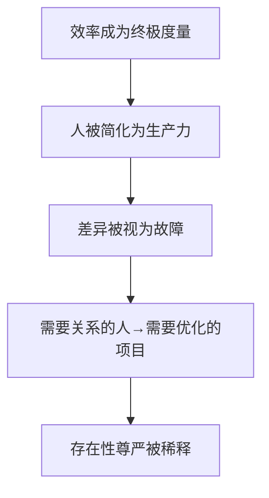

## 德说-第484期, 效率崇拜正在掏空人类的意义基础  
  
### 作者  
digoal  
  
### 日期  
2026-05-27  
  
### 标签  
AI , 效率 , 人类的意义基础 , 存在  
  
----  
  
## 背景  
  
> 当AI把"有用"变成唯一度量衡，人作为目的本身的存在正在被系统性地遗忘。  
  
## 一份82页通谕发出的真实警报  
  
2026年5月，一份署名教宗利奥十四世的《人类的伟大》震动互联网。不是因为它来自梵蒂冈，而是因为它说出了技术话语中长期缺席的东西：**人的维度**。  
  
这份文件的核心判断并不复杂：**当效率成为价值的终极衡量标准，人类开始把自己视为需要优化的项目，而不是需要关系的人。** 这句话的重量，只有放在今天AI狂飙的现实里才能真正掂量。  
  
  
  
## 效率至上是怎样成为新暴政的  
  
技术行业谈论AI时，最常用的词是"赋能""提效""规模化"。这些词不是坏事。但当它们成为**唯一的叙事**，问题就来了。  
  
今天的AI系统，从推荐算法到自动化裁员，从智能客服到绩效考核，底层逻辑高度一致——提高效率、降低人力成本、最大化产出。人被数据化、被指标化、被优化。马克思当年批判的劳动异化，是人在劳动中失去自己；而今天正在发生的，是更深的**存在异化**：人开始用机器的标准要求自己，用算法的逻辑理解世界。  
  
这不是某个公司的选择。这是整个技术范式的内嵌逻辑。  
  

  
  
  
## 两座城的隐喻：巴别塔与耶路撒冷  
  
通谕开篇用一个圣经比喻点明了技术发展的两条路径。  
  
**巴别塔**：人类想修一座直通天堂的高塔，结果语言混乱，彼此不通，最终散了。追求统一，却走向分裂。这是效率至上路径的终极意象——目标宏大，但以人的分散和失语为代价。  
  
**耶路撒冷**：城墙倒塌后，人们一块砖一块砖地重建，在某种更高的同在下恢复共同体。不是通天，而是共建。  
  
技术世界正在这两条路上狂奔。一条路把人变成数据节点，追求统一控制和最大效率；另一条路承认人的脆弱、差异和局限，在对话中建设有尊严的共同生活。  
  
**哪条路更可能？** 答案取决于一个更根本的问题：效率是谁的效率？收益流向谁？成本由谁承担？  
  
  
  
## AI权力的结构性集中才是真问题  
  
通谕没有止步于批判技术，还指出了更深的结构性危险：**AI权力前所未有的集中**。  
  
过去，创新由国家引导；今天，头部科技公司拥有的资源超过许多国家。这种"私人化"的技术权力，极难治理。教宗援引方济各的话：掌握知识和经济资源的人，拥有"对整个人类和整个世界的令人印象深刻的统治力"。  
  
这意味着什么？**监管是必要的，但远远不够**。监管是在现有权力结构上打补丁，而这份通谕的核心主张是：必须改变权力的结构本身。AI必须"解除武装"——从垄断控制中解放出来，向讨论和辩论开放，变得"人性化"。  
  
这不是乌托邦。这是一套真实可行的改革框架的前提：开放权重、强制透明、允许公共审计。  
  
  
  
## 超人类主义的温柔陷阱  
  
通谕用相当篇幅批判了**超人类主义**——用技术改造人类，让人变得更快、更强、更聪明，最终超越人类自身。  
  
这个愿景听起来很美好，像是进化的下一阶段。但教宗指出了一个隐秘的危险逻辑：**如果人是可以被完善的，那么"某些生命不那么有用"就变得可以接受**。在优化的名义下，"必要的牺牲"开始被正当化。负担落在最脆弱的人身上——老人、病人、穷人、残疾人。  
  
这里有一个根本性的冲突：  
  
- **效率逻辑**：人的价值 = 产出/贡献/有用性  
- **存在性尊严**：人的价值 = 存在本身  
  
两种逻辑不能共存。一个社会选择了哪种，人的命运就定了。  
  
  
  
## 真理危机：被算法稀释的公共记忆  
  
通谕第四章揭示了一个被严重忽视的问题：**AI和数字平台正在系统性地模糊真假边界**。  
  
哲学家汉娜·阿伦特早就警告：极权主义的理想对象，是"那些对事实与虚构、真实与虚假的区别不再存在的人"。今天的信息环境正在把这句话变成现实。  
  
算法推荐制造信息茧房，深度伪造让眼见不再为实，情绪操纵优先于事实核查。我们正在失去辨别真假的能力，甚至失去辨别真假的意愿。  
  
当真理变成可选项，正义就沦为权力的附庸。这不是技术问题，这是民主的根基在被动摇。  
  
  
  
## 未成年人保护：一个社会用什么回报未来  
  
通谕有一段专门谈未成年人保护。教宗没有把它当作技术问题处理，而是当作道德问题：  
  
> 过早无监督地接触数字设备，对睡眠、注意力、情绪控制、人际关系产生负面影响，"有时以悲剧性的后果"。  
  
他列出的威胁清单值得记录：**色情内容、暴力降级内容、诱导勒索和性剥削，以及AI操纵的图像和视频**。  
  
解决方案是"教育联盟"——政策制定者、教育机构、家庭共同承担责任，设定年龄限制，追究平台责任。**不是把负担全推给家长，而是要求整个系统负责**。  
  
  
  
## 一个文明的真实底色  
  
通谕结尾回到了最根本的问题：你想活在怎样的社会？  
  
教宗把它定义为"权力文化"与"爱的文明"之间的选择。前者追求控制、效率、统治，技术是增强力量的工具；后者承认技术可以是好的，但坚持技术必须服务于正义、团结、对弱势群体的关怀。  
  
圣奥古斯丁几百年前说过的话，放在今天依然锋利：**两种爱建造了两座城**。  
  
  
  
## 接下来该看什么  
  
1. 主要经济体是否出现类似的**人的维度优先**的AI立法框架  
2. 头部科技公司是否开始**开放权重审计**，回应"解除武装"诉求  
3. 信息茧房和深度伪造问题是否进入**选举安全**的主流政策讨论  
4. 未成年人保护的平台责任追究是否出现**可执行的法律先例**  
5. AI系统的"有用性vs尊严"评估，是否成为新的**行业标准**  
  
  
  
## 结论  
  
《人类的伟大》提出的核心框架其实很简单：**人的尊严不是AI的竞争对手，而是AI的前提**。  
  
技术不是中性的。它承载设计者的价值观，影响使用者的行为，塑造社会的形态。当我们把"有用"变成唯一度量，我们正在系统性地遗忘：人不仅仅是手段，人永远是目的本身。  
  
这份文件的价值，不在于它来自梵蒂冈，而在于它说出了一段被技术话语长期排斥的常识。  
  
  
  
## 参考来源  
  
- [Magnifica Humanitas - Vatican](https://www.vatican.va/content/leo-xiv/en/encyclicals/documents/20260515-magnifica-humanitas.html)  
  
  
  
#### [PostgreSQL 解决方案集合](../201706/20170601_02.md "40cff096e9ed7122c512b35d8561d9c8")
  
  
#### [德哥 / digoal's Github - 公益是一辈子的事.](https://github.com/digoal/blog/blob/master/README.md "22709685feb7cab07d30f30387f0a9ae")
  
  
#### [About 德哥](https://github.com/digoal/blog/blob/master/me/readme.md "a37735981e7704886ffd590565582dd0")
  
  

  
