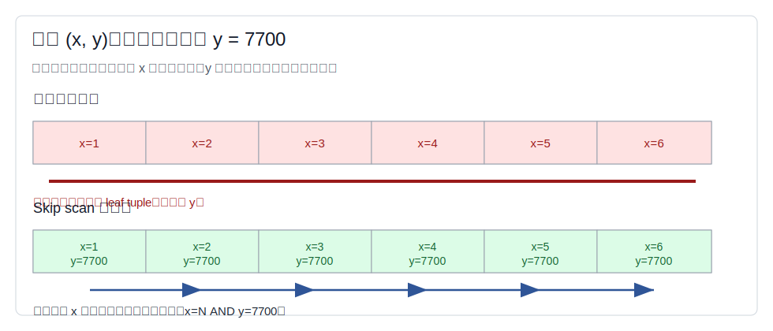
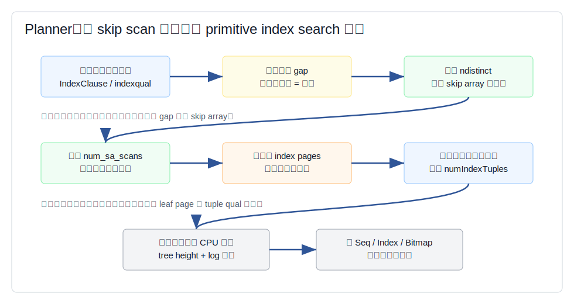
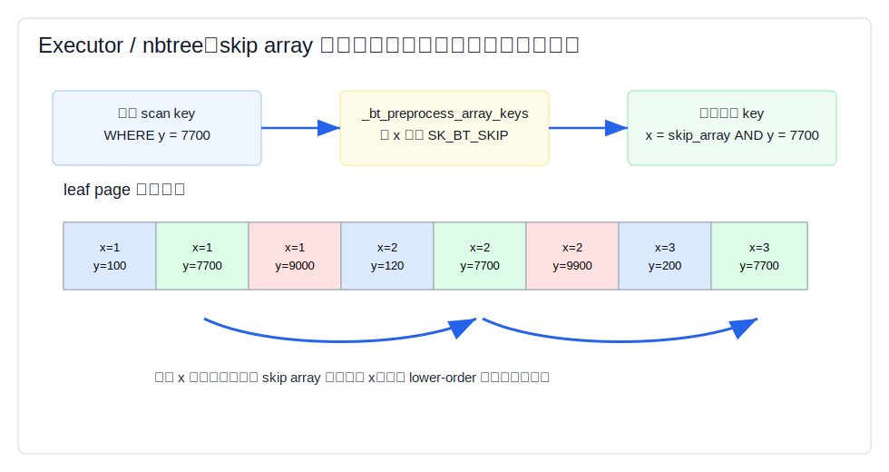
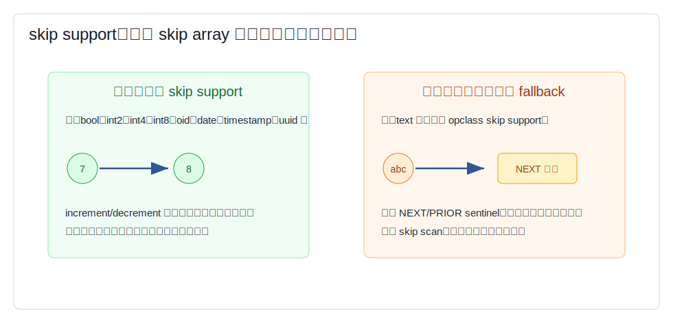
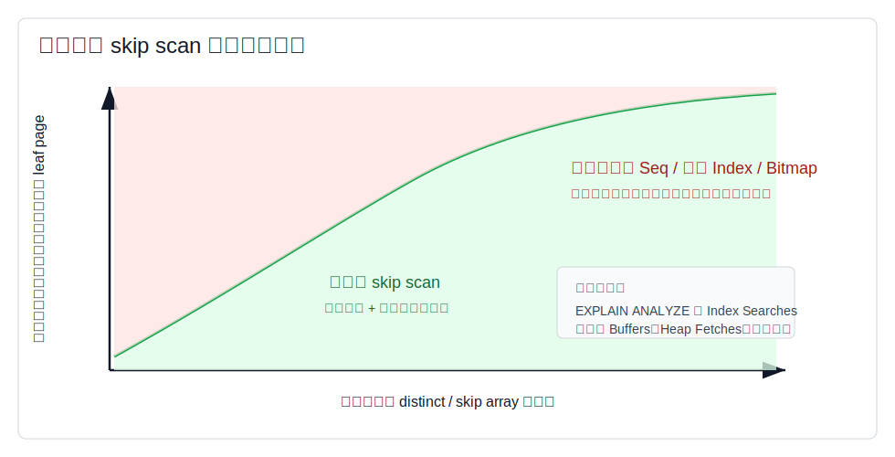

## 数据库筑基课 - 数据扫描方法 Skip Index Scan

### 作者
digoal

### 日期
2026-05-30

### 标签
PostgreSQL , 应用开发者 , 数据库筑基课 , 扫描算法 , 执行器 , 优化器 , B-tree , Skip Scan

----

## 背景


本节属于数据库基础能力里的“扫描与执行算法”。前面已有 `Seq Scan`、`Index Scan`、`Index Only Scan`、`Bitmap Scan`、`Multi-Index Bitmap Scan` 作为基础。本文讨论一个更容易被误解的能力：`Skip Index Scan`，在 PostgreSQL 当前源码和文档里通常称为 B-tree `skip scan` optimization。

数据库筑基课大纲在当前项目中未找到可引用文件，因此本文按“扫描/执行算法”独立成篇。本文主要以 PostgreSQL 本地源码、官方文档和 DeepWiki 对 `postgres/postgres` 的架构摘要为准。用户给出的三篇资料 `An Evaluation of Secondary Index Structures`、`The DB2 Query Optimizer: Behind the Scenes`、`Optimizing Multidimensional Queries in Relational Databases Using Skip-Scan` 在当前项目中没有原文文件；本文只把它们作为背景脉络引用：二级索引的 I/O 代价、工业优化器的枚举/成本选择、以及 skip-scan 把多维条件拆成多次有序索引搜索的思想。本文不引用无法本地核验的实验数字。

业务上最常见的痛点是这样的：

```sql
CREATE INDEX ON orders (region_id, created_at);

SELECT *
FROM orders
WHERE created_at >= timestamp '2026-05-01'
  AND created_at <  timestamp '2026-06-01';
```

开发者看到 `(region_id, created_at)`，会担心“没有 region_id 条件，所以索引完全没用”。这句话在传统左前缀理解里有道理，但不完整。PostgreSQL 的 B-tree skip scan 可以在某些情况下把缺失的前导列动态枚举出来，让后续列条件参与定位，而不是把整个索引从头扫到尾。

本文的核心结论先放前面：`Skip Index Scan` 不是一种新的索引结构，也不是绕过左前缀规则的万能钥匙；它是 B-tree 扫描过程中的一种重定位策略。它用“多次小范围 index search”替代“一次大范围 index scan”，只有当前导列可跳过的 distinct 数较少、后续列条件足够精确、统计信息可信时才划算。

## 一、它解决什么问题？

多列 B-tree 的物理顺序是按索引列从左到右排序的。索引 `(x, y)` 的 leaf tuple 不是按 `y` 全局聚集，而是先按 `x` 分组，再在每个 `x` 组内按 `y` 排序。

因此，查询：

```sql
WHERE y = 7700
```

在传统索引扫描里很尴尬：`y` 很精确，但因为缺少前导列 `x` 的约束，扫描无法直接跳到所有 `y=7700` 的位置。朴素做法可能变成扫描大量索引项，再在索引层或表层过滤 `y`。



图 1 说明：索引 `(x, y)` 中，`y=7700` 分散在每个 `x` 分组内部。skip scan 的做法是把问题改写成一组动态搜索：`x=1 AND y=7700`、`x=2 AND y=7700`、`x=3 AND y=7700`……如果 `x` 的 distinct 很少，每次搜索只读少量 leaf page，就可能比扫描整个索引便宜。

它解决的是“复合索引前导列缺少普通等值条件，但后续列有强选择性条件”的问题。

代价也很明确：

- 每跳一个前导列取值，通常意味着一次新的 B-tree search。
- 如果被跳过列 distinct 很多，重复下探成本会迅速变高。
- 如果后续列条件不够精确，跳过去以后仍要读很多 leaf tuple。
- 如果统计信息低估了前导列 distinct 或列间相关性，优化器可能误判。
- 它只减少索引扫描范围；普通 `Index Scan` 仍可能需要回表检查 MVCC 和取列。

## 二、它是什么？

在 PostgreSQL 中，skip scan 是 B-tree index scan / index-only scan 扫描路径内部的优化，不是独立计划节点。`EXPLAIN` 中仍然会看到：

```text
Index Scan
Index Only Scan
```

而不是一个叫 `Skip Scan` 的节点。判断它是否发生，通常要看 `EXPLAIN ANALYZE` 的 `Index Searches` 字段，以及索引条件是否包含非左前缀列。

PostgreSQL 文档对多列索引的规则说得很清楚：

- 多列 B-tree 对任意列子集的条件都可能可用，但最有效的是前导列约束。
- 前导列等值约束，加上第一个非等值列的不等式约束，通常决定连续扫描边界。
- 右侧列条件总能在索引层检查，从而减少回表，但不一定减少要扫描的索引范围。
- 如果 B-tree scan 能有效应用 skip scan，它会通过重复 index search，把更多列条件用于导航。

源码上，skip scan 的核心是 `skip array`。它是一类特殊的 `SK_SEARCHARRAY` scan key，用 `SK_BT_SKIP` 标记，表示“这个索引列没有来自 SQL 的等值条件，但 B-tree 扫描可以在执行期为它动态生成一系列等值搜索”。

关键源码主线如下：

| 层次 | 源码 | 作用 |
|---|---|---|
| 访问方法能力 | `postgres/src/backend/access/nbtree/nbtree.c:bthandler()` | B-tree 声明 `amcanmulticol`、`amoptionalkey`、`amsearcharray`、`amcanparallel`、`amcaninclude` 等能力，并使用 `btcostestimate` |
| 成本估算 | `postgres/src/backend/utils/adt/selfuncs.c:btcostestimate()` | 估算 skip array 对 `num_sa_scans`、`numIndexTuples`、下探 CPU 成本的影响 |
| scan key 预处理 | `postgres/src/backend/access/nbtree/nbtpreprocesskeys.c:_bt_preprocess_array_keys()` | 生成 skip array scan key，为缺失等值条件的前导列补桥 |
| skip array 规则 | `postgres/src/backend/access/nbtree/nbtpreprocesskeys.c:_bt_num_array_keys()` | 决定哪些列需要 skip array，哪些情况停止添加 |
| 执行状态 | `postgres/src/include/access/nbtree.h:BTArrayKeyInfo`、`BTScanOpaqueData` | 保存 `num_elems == -1` 的 skip array、`skipScan`、`needPrimScan` 等状态 |
| skip support API | `postgres/src/include/utils/skipsupport.h`、`postgres/src/backend/utils/adt/skipsupport.c` | 为离散类型提供 next/prior 值生成能力 |
| B-tree 定位 | `postgres/src/backend/access/nbtree/nbtsearch.c:_bt_first()` | 每次 primitive index search 下探并计入 `Index Searches` |
| leaf 推进 | `postgres/src/backend/access/nbtree/nbtreadpage.c` | 推进 array key、跳过不可能匹配的 leaf tuple 或 page 区间 |
| EXPLAIN 输出 | `postgres/src/backend/commands/explain.c` | 输出 `Index Searches` |

## 三、核心原理

### 3.1 优化器：先判断“跳几次”是否比“扫过去”便宜

PostgreSQL 的 `btcostestimate()` 会按索引列顺序分析 `indexclauses`。当发现某个后续列有可用条件，而前面的列缺少等值条件时，它会估算是否可以用 skip array 补上这个 gap。



图 2 说明：优化器不会无条件生成 skip scan 成本优势。它先查被跳过列的 `ndistinct`，用它估算 skip array 的元素数，也就是执行期大约需要多少次 primitive index search。若统计值是默认估计，源码会保守地认为跳跃可能不可靠；若估算出的搜索次数超过索引页数，也会回退，不再把后续列条件当作边界条件。

源码里有几个重要判断：

1. 缺失等值条件的列，用该列统计信息的 `ndistinct` 估算 skip array 元素数。
2. 如果该列还有范围条件，会用范围选择率下调 `ndistinct`。
3. 如果 `ndistinct` 来自默认估计，保守假设 runtime 不会真正 skipping。
4. `num_sa_scans` 乘上 skip array 元素数，代表重复搜索次数。
5. 如果 `num_sa_scans` 超过 index pages，源码会认为已经越过收益边界，停止把这个 gap 补成 skip array。
6. 对 SAOP 数组和 skip array，都要为每次下探增加 B-tree descent CPU 成本。

这段逻辑解释了为什么 skip scan 的计划选择对统计信息敏感。`ANALYZE` 不只是影响行数估计，也直接影响“前导列能不能安全地动态枚举”。

### 3.2 执行器：把缺失列变成可推进的 skip array

执行期不是一次性构造一个巨大数组 `ARRAY[所有 x]`。PostgreSQL 用的是程序化生成和推进的 skip array。



图 3 说明：`_bt_preprocess_array_keys()` 会把输入条件变成 B-tree 更容易执行的 scan key。对于 `(x, y)` 上的 `WHERE y = 7700`，它可以生成一个 `x = skip_array` 的等值型 scan key，再和 `y = 7700` 组合。当前 `x` 组结束后，扫描推进 skip array 到下一组 `x`，再用 `y` 条件重新定位。

`_bt_num_array_keys()` 的注释给出了很好的规则表。以索引 `(a, b, c, d)` 为例：

| 输入条件 | 预处理后的含义 |
|---|---|
| `a = 1` | 不需要 skip array |
| `b = 42` | `skip a AND b = 42` |
| `a >= 1 AND b = 42` | `range skip a AND b = 42` |
| `a = 1 AND c <= 27` | `a = 1 AND skip b AND c <= 27` |
| `a = 1 AND d >= 1` | `a = 1 AND skip b AND skip c AND d >= 1` |
| `a = 1 AND b >= 42 AND d > 1` | `a = 1 AND range skip b AND skip c AND d > 1` |

这里有两个边界：

- 最后一列不会被补成 skip array。skip array 的意义是让更低序的后续条件参与定位；如果没有后续列，就没有桥可搭。
- RowCompare 之后不能继续添加 skip array。源码注释解释了原因：当前 nbtree row comparison 设计把多列比较当作整体，不适合与逐列推进的 skip array 合并。

### 3.3 skip support：不是必须，但能让离散类型更省探测

B-tree operator family 可以注册第 6 号 support function：`BTSKIPSUPPORT_PROC`。文档称为 `skipsupport`，API 在 `src/include/utils/skipsupport.h`。



图 4 说明：对离散类型，skip support 可以直接告诉 B-tree “当前值的下一个可表示值是什么”。例如 `int4` 的 7 可以增到 8。若这个猜测正好就是索引中的下一组值，就能少一次探测。没有 skip support 的 opclass 仍然可以 skip scan，但会通过 `NEXT` / `PRIOR` sentinel 重新定位真实下一值，可能多做一点工作。

本地源码中可以看到这些实现：

- `postgres/src/backend/access/nbtree/nbtcompare.c`：`btboolskipsupport`、`btint2skipsupport`、`btint4skipsupport`、`btint8skipsupport`、`btoidskipsupport` 等。
- `postgres/src/backend/utils/adt/date.c`：`date_skipsupport`。
- `postgres/src/backend/utils/adt/timestamp.c`：`timestamp_skipsupport`。
- `postgres/src/backend/utils/adt/uuid.c`：`uuid_skipsupport`。

文档也强调：没有 skip support 的 operator class 仍然有资格使用 skip scan，只是 fallback 对某些离散类型可能不如专用实现。对连续类型，提供 skip support 往往没有意义，因为“下一个可表示值”很难对应真实索引中的下一组值。

### 3.4 `Index Searches`：观察 skip scan 的关键指标

PostgreSQL 当前文档在 `EXPLAIN ANALYZE` 示例中展示了：

```sql
EXPLAIN ANALYZE
SELECT four, unique1
FROM tenk1
WHERE four BETWEEN 1 AND 3
  AND unique1 = 42;
```

使用 `(four, unique1)` 多列索引时，计划显示 `Index Searches: 3`。含义是执行了三次搜索：

```text
four = 1 AND unique1 = 42
four = 2 AND unique1 = 42
four = 3 AND unique1 = 42
```

`Index Searches` 不只为 skip scan 服务，也会受 `IN` / `ANY` 这类数组搜索影响。解释这个指标时要结合 `Index Cond`、索引定义、查询条件和实际 buffers。

需要避免一个误判：`EXPLAIN` 里没有 `Skip Scan` 字样，不代表没有 skip scan。PostgreSQL 把它表达为同一个 B-tree `Index Scan` 或 `Index Only Scan` 节点中的多次 index search。

### 3.5 并行扫描：skip array 状态也要被序列化

skip scan 并不只影响单进程扫描。`nbtree.c` 的并行扫描状态里，`BTParallelScanDescData` 除了保存 SAOP array 的当前元素 offset，还要为 skip array 保存扁平化 datum 表示。`_bt_parallel_serialize_arrays()` 和 `_bt_parallel_restore_arrays()` 会把 skip array mutable state 存进共享状态或从共享状态恢复。

这说明 skip scan 是 B-tree 扫描状态机的一部分，不是 planner 端的静态 SQL 展开。如果简单把它理解成“优化器改写成很多 OR”，就会漏掉执行期推进、并行状态、leaf page look-ahead、skip support fallback 这些关键工程细节。

## 四、横向对比

| 维度 | Skip Index Scan | 普通多列 Index Scan | Bitmap Heap Scan | 建新索引 `(y, x)` 或 `(y)` | 分区裁剪 |
|---|---|---|---|---|---|
| 主要目标 | 在缺少前导等值条件时，让后续列条件参与 B-tree 定位 | 利用已有左前缀边界连续扫描 | 先收集 TIDBitmap，再按 heap block 访问 | 从物理排序上直接服务 `y` 条件 | 在表级别排除不相关分区 |
| 写入代价 | 不新增索引，无额外写入维护 | 不新增索引 | 不新增索引 | 新增索引带来写入、WAL、缓存成本 | 分区键设计和维护成本 |
| 读取代价 | 多次 B-tree search，可能少读 leaf tuple/page | 可能扫描大段索引再过滤右侧列 | 启动成本高，失去索引顺序 | 对匹配查询最直接 | 只减少分区范围，分区内仍需扫描 |
| 排序能力 | 保持 B-tree 顺序语义，但多次搜索 | 保持索引顺序 | 通常丢失索引顺序 | 取决于新索引列序 | 取决于子计划 |
| MVCC/回表 | 普通 index scan 仍需回表；index-only scan 受 VM 影响 | 同左 | 需要 heap recheck/可见性 | 同普通索引 | 同子计划 |
| 适合场景 | 前导列 distinct 少，后续列选择率高，已有复合索引可复用 | 左前缀条件完整或范围很窄 | 多条件组合、中等选择率 | 查询高频稳定，值得付出写入成本 | 查询天然按时间/租户/区域裁剪 |
| 不适合场景 | 前导列 distinct 高、统计信息差、后续列不精确 | 缺前导条件且扫描范围大 | 小 LIMIT 早停、强排序需求 | 写多读少、索引膨胀敏感 | 分区键与过滤条件不匹配 |

表里的关键不是“谁更先进”，而是代价从哪里来。skip scan 的优势是复用已有复合索引，不增加写入成本；弱点是重复搜索成本仍然真实存在。当某个后缀列查询成为核心高频路径时，长期方案可能仍然是建一个列序更合适的索引，而不是押注 skip scan。

## 五、效果如何？

skip scan 的收益来自两类节省：

1. 少读无关 leaf tuple/page。后续列条件越精确，每个前导列分组里越能快速定位或快速判空。
2. 少做 indexqual 逐 tuple 计算。`selfuncs.c` 注释明确提到，有时 skip scan 即使每次只跳过 1 到 2 个无关 leaf page，也可能因为减少 CPU qual evaluation 而划算。

代价来自三类放大：

1. 重复 B-tree 下探。`num_sa_scans` 越大，下探比较和页面访问越多。
2. 可能的 next/prior 探测。缺少 skip support 时，需要探测真实下一组值。
3. 回表成本不自动消失。若计划是普通 `Index Scan`，每个匹配 TID 仍可能访问 heap；若是 `Index Only Scan`，还要看 visibility map。



图 5 说明：横轴可以理解为被跳过列的 distinct 数或 skip array 元素数，纵轴可以理解为后续列条件能跳过无关 leaf page 的能力。左上区域更容易适合 skip scan；右下区域更可能被普通 index scan、bitmap scan 或 seq scan 取代。真正判断要看 `EXPLAIN ANALYZE` 的 `Index Searches`、`Buffers`、实际行数、`Heap Fetches` 和总时间。

不要套固定阈值。PostgreSQL 源码中有“`num_sa_scans` 超过 index pages 就回退”的判断，也有对 `num_sa_scans` 的 clamp，但这些是成本模型内部的工程近似，不是 DBA 应该死记的业务规则。

## 六、实操 DEMO

下面给出最小可验证实验。当前环境没有编译并启动 PostgreSQL 实例，因此示例 SQL 未在本机执行；文中只引用 PostgreSQL 文档和回归测试中已有的 `EXPLAIN` 形态，不伪造本地执行结果。

### 6.1 后缀列等值查询

```sql
DROP TABLE IF EXISTS skip_scan_demo;

CREATE TABLE skip_scan_demo (
  region_id int NOT NULL,
  order_id  int NOT NULL,
  payload   text
);

INSERT INTO skip_scan_demo
SELECT (g % 4) + 1, g, md5(g::text)
FROM generate_series(1, 200000) AS g;

CREATE INDEX skip_scan_demo_region_order_idx
ON skip_scan_demo (region_id, order_id);

ANALYZE skip_scan_demo;

EXPLAIN (ANALYZE, BUFFERS)
SELECT region_id, order_id
FROM skip_scan_demo
WHERE order_id = 4242;
```

预期观察点：

- 如果选择 B-tree index scan 或 index-only scan，`Index Cond` 可能只显示 `order_id = 4242` 或同时显示相关边界条件。
- 如果使用 skip scan，`Index Searches` 应接近 `region_id` 需要枚举的取值数量，受 NULL、范围、统计估计和数据分布影响。
- 如果 `region_id` distinct 从 4 改成 40000，再 `ANALYZE`，优化器更可能放弃 skip scan，选择其他路径。

### 6.2 文档中的可核验形态

PostgreSQL 文档给出的示例是：

```sql
EXPLAIN ANALYZE
SELECT four, unique1
FROM tenk1
WHERE four BETWEEN 1 AND 3
  AND unique1 = 42;
```

计划中显示：

```text
Index Only Scan using tenk1_four_unique1_idx on tenk1
  Index Cond: ((four >= 1) AND (four <= 3) AND (unique1 = 42))
  Heap Fetches: 0
  Index Searches: 3
```

这个例子好在 `four` 只有少量 distinct，`unique1` 高选择率，因此每个 `four=N AND unique1=42` 的搜索都很小。

### 6.3 回归测试中的 fallback 形态

本地 PostgreSQL 回归测试 `postgres/src/test/regress/sql/btree_index.sql` 构造了 `(t, id)` 索引，并注释为：

```sql
-- Test for skip scan with type that lacks skip support (text)
SELECT id
FROM btree_tall_tbl
WHERE id = 55
ORDER BY t, id;
```

对应 expected 文件显示计划仍是：

```text
Index Only Scan using btree_tall_idx on btree_tall_tbl
  Index Cond: (id = 55)
```

这说明 leading column `t text` 即使缺少 skip support，也仍可能参与 skip scan fallback。注意该 expected 输出使用 `EXPLAIN (costs off)`，没有 `ANALYZE`，所以不会显示 `Index Searches`。

## 七、最佳实践

面向数据库架构师：

- 把 skip scan 当作“复合索引列序容错能力”，不要当作列序设计的替代品。高频核心查询仍应按过滤、排序、连接、覆盖列综合设计索引顺序。
- 对低基数前导列加高基数后缀列的索引，例如 `(tenant_type, user_id)`、`(status, created_at)`，可以评估 skip scan 复用价值。
- 如果业务有多个完全不同的主访问维度，skip scan 只能缓解部分查询，不能替代必要的反向索引或分区设计。

面向 DBA：

- 对候选 SQL 使用 `EXPLAIN (ANALYZE, BUFFERS)`，重点看 `Index Searches`、`Buffers`、实际行数与估算行数偏差。
- 保持统计信息新鲜。被跳过列的 `ndistinct` 是 skip scan 成本估算的核心输入。
- 对列间相关性强的场景，考虑扩展统计信息，至少要验证估算偏差是否导致错误计划。
- 不要只用 `enable_seqscan=off` 证明索引可用。它只能帮助观察备选路径，不能代表生产成本。

面向业务开发者：

- 写查询时让谓词尽量保持可索引形式，不要把索引列包在不可下推或难估算的表达式里。
- 不要因为“后缀列偶尔能走 skip scan”就随意复用错误列序的索引。读路径稳定、高频、低延迟时，应和 DBA 一起验证专用索引。
- `LIMIT`、`ORDER BY`、返回列宽度会改变最优路径。只比较 `WHERE` 条件是不够的。

## 八、适合与不适合场景

适合：

- 多列 B-tree，前导列 distinct 少，例如状态、类型、区域、少量租户分组。
- 后续列条件选择率高，例如唯一号、窄时间范围、精确业务 ID。
- 已有索引列序主要服务另一类查询，但当前查询可以接受 skip scan 的重复搜索成本。
- 读多写多混合系统中，不想为低频查询额外增加索引写入成本。
- index-only scan 前提较好，回表成本较低或可由 visibility map 避免。

不适合：

- 被跳过列 distinct 很高，几乎等于行数或索引页数。
- 后续列条件选择率不高，跳到每个分组后仍要读大量 tuple。
- 表和索引统计信息陈旧，`ndistinct` 与实际偏差大。
- 查询高频且延迟敏感，值得为它建立更合适列序的索引。
- 需要组合多个独立单列条件且选择率中等，bitmap scan 可能更合适。
- 主要过滤维度可以通过分区裁剪直接排除大量数据，表级裁剪通常比索引内跳跃更有效。

## 九、常见坑

1. 把 skip scan 当成独立计划节点。PostgreSQL 不这样展示；要看 `Index Searches` 和上下文。
2. 只看是否用了索引，不看用了多少次 index search。重复搜索次数太多时，索引路径也可能慢。
3. 忽略 `ANALYZE`。skip scan 的收益判断高度依赖被跳过列的 distinct 估计。
4. 忽略回表。skip scan 只优化索引导航，不保证 heap I/O 消失。
5. 把所有数据库的 skip scan 混为一谈。Oracle/MySQL/DB2/PostgreSQL 在命名、计划展示、成本模型和执行细节上都不同。
6. 为了触发 skip scan 人为把低基数列放在索引前面。索引列序首先服务主查询形态；skip scan 是补充，不是设计目标本身。
7. 看到 `Index Cond` 包含后缀列就认为一定大幅少读。需要结合 buffers 和 `Index Searches` 验证。

## 十、扩展问题

1. 如果 `(a, b)` 上 `WHERE b = ?` 能靠 skip scan 变快，那么什么时候仍然应该新增 `(b)` 或 `(b, a)`？
2. skip scan 与 `IN` / `ANY` 都会增加 `Index Searches`，如何从计划和 SQL 语义上区分它们的来源？
3. 当前导列和后缀列高度相关时，单列 `ndistinct` 估计会怎样影响 skip scan 成本？扩展统计信息能解决多少？
4. 对列存或向量化执行引擎，skip scan 的价值会被顺序扫描吞吐和 zone map/min-max 索引削弱还是增强？
5. 如果业务允许分区，应该优先用分区裁剪、局部索引，还是依赖全局复合索引上的 skip scan？

## 十一、扩展阅读

- PostgreSQL 文档：`postgres/doc/src/sgml/indices.sgml`，多列索引与 skip scan optimization。
- PostgreSQL 文档：`postgres/doc/src/sgml/perform.sgml`，`EXPLAIN ANALYZE` 中 `Index Searches` 与 skip scan 示例。
- PostgreSQL 文档：`postgres/doc/src/sgml/btree.sgml`，B-tree `skipsupport` support function。
- PostgreSQL 文档：`postgres/doc/src/sgml/monitoring.sgml`，`Index Searches` 指标说明。
- PostgreSQL 源码：`postgres/src/backend/utils/adt/selfuncs.c:btcostestimate()`，skip array 成本估算。
- PostgreSQL 源码：`postgres/src/backend/access/nbtree/nbtpreprocesskeys.c`，scan key 预处理与 skip array 生成。
- PostgreSQL 源码：`postgres/src/backend/access/nbtree/nbtreadpage.c`，array key 推进、look-ahead 与 skip support fallback。
- PostgreSQL 源码：`postgres/src/include/utils/skipsupport.h`、`postgres/src/backend/utils/adt/skipsupport.c`，skip support API。
- PostgreSQL 源码：`postgres/src/include/access/nbtree.h`，`BTArrayKeyInfo`、`BTScanOpaqueData`、`SK_BT_SKIP`。
- PostgreSQL 回归测试：`postgres/src/test/regress/sql/btree_index.sql`、`postgres/src/test/regress/expected/btree_index.out`。
- DeepWiki：`postgres/postgres` 关于 query planner、table/index management 的架构索引。
- 参考资料：`The DB2 Query Optimizer: Behind the Scenes`，用于理解工业优化器如何在 rewrite、statistics、costing 之间做路径选择。
- 参考资料：`Optimizing Multidimensional Queries in Relational Databases Using Skip-Scan`，用于理解 skip-scan 在多维查询上的算法背景。
- 参考资料：`An Evaluation of Secondary Index Structures`，用于理解二级索引结构在读写、空间和缓存代价上的权衡。
  
## 附录 
1、询问 gemini
```
PostgreSQL 数据扫描方法 Skip Index Scan 相关的论文
```

2、克隆代码  
```  
git clone --depth 1 https://github.com/postgres/postgres
```  
  
3、启用 codex, 使用 [数据库筑基课 skill](../skills/README.md).  
```
文章标题: 
  数据库筑基课 - 数据扫描方法 Skip Index Scan
项目源码(已克隆到当前项目如下目录中):  
  postgres
相关论文或分享:
  An Evaluation of Secondary Index Structures
  The DB2 Query Optimizer: Behind the Scenes
  Optimizing Multidimensional Queries in Relational Databases Using Skip-Scan
项目 deepwiki reponame:  
  postgres/postgres
项目参考信息: 
  postgres/CLAUDE.md
```
  
  
#### [PostgreSQL 解决方案集合](../201706/20170601_02.md "40cff096e9ed7122c512b35d8561d9c8")
  
  
#### [德哥 / digoal's Github - 公益是一辈子的事.](https://github.com/digoal/blog/blob/master/README.md "22709685feb7cab07d30f30387f0a9ae")
  
  
#### [About 德哥](https://github.com/digoal/blog/blob/master/me/readme.md "a37735981e7704886ffd590565582dd0")
  
  

  
