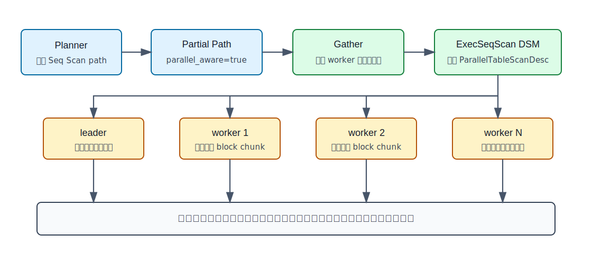
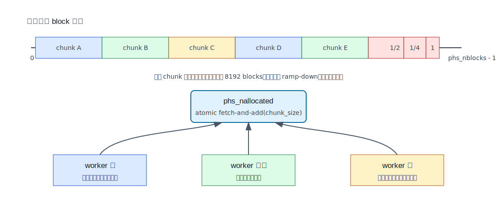
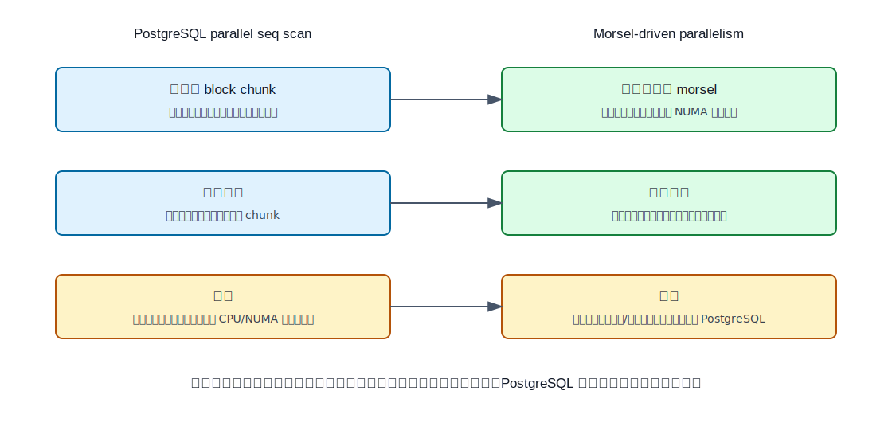
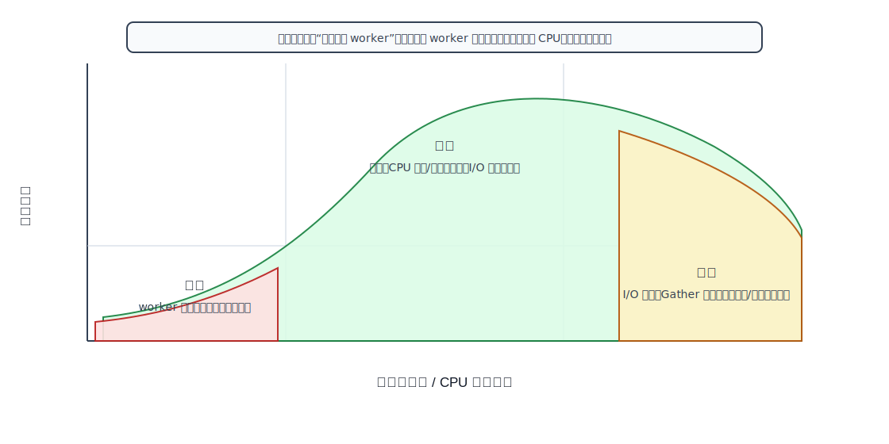

## 数据库筑基课 - 数据扫描方法“自适应并行扫描”

### 作者
digoal

### 日期
2026-05-30

### 标签
PostgreSQL , 应用开发者 , 数据库筑基课 , 扫描算法 , 执行器 , 优化器 , Parallel Scan

----

## 背景
  


本节属于数据库基础能力里的“扫描与执行算法”。前面的 `seq scan` 讲的是“读很多块时，怎样把全表扫做得稳定”；这一篇继续往下拆：当一张表足够大，一个进程顺序扫已经不能吃满 CPU 或无法在时间窗内完成时，数据库怎样把同一张表交给多个执行进程共同扫描，并且避免两类低级错误：

1. 每个 worker 都从头扫一遍，结果重复且更慢。
2. 静态平均切段后，有的 worker 早早结束，有的 worker 拖到最后，整体被慢者卡住。

数据库筑基课大纲在当前项目中未找到可引用文件，因此本文按“扫描/执行算法”独立成篇。本文以 PostgreSQL 本地源码、官方文档和 DeepWiki 对 `postgres/postgres` 的架构索引为主，结合三篇资料作概念参照：

- *Morsel-Driven Parallelism: A NUMA-Aware Query Evaluation Framework for the Many-Core Age*：解释把大任务拆成小 morsel 并动态调度的思想。
- *Adaptive Query Processing* 相关论文：解释运行时根据反馈调整执行策略的更大背景。
- *Adaptive and Scalable Database Management with Machine Learning Integration: A PostgreSQL Case Study*：作为“用学习方法增强数据库自适应能力”的背景材料。本文不把它等同于 PostgreSQL 当前并行顺序扫描实现。

先给结论：PostgreSQL 的 `Parallel Seq Scan` 已经有一种很朴素但重要的自适应机制：多个参与进程通过共享扫描描述符动态领取连续 block chunk；快的进程会领取更多 chunk，慢的进程不会阻塞其他进程；扫描末尾会减小 chunk size，降低长尾。它不是完整的 adaptive query processing，也不是机器学习驱动的运行时重优化。  

## 一、它解决什么问题？

自适应并行扫描解决的是“大表扫描如何在多个执行进程之间正确、均衡、尽量顺序 I/O 友好地分工”的问题。

普通 `Seq Scan` 的成本大致来自三部分：

```text
读表块 + 检查 MVCC 可见性 + 执行过滤/投影/上层聚合
```

如果查询必须读大量表块，索引不能减少访问范围，那么优化方向就从“少读”变成“多人协作读”。但并行不是简单把表按 worker 数平均切开。真实系统里会遇到：

- worker 启动时间不同。
- block 在缓存、磁盘、远端存储上的读取速度不同。
- 不同页面的可见 tuple 数、死 tuple 数、表达式过滤成本不同。
- leader 可能还要汇聚 tuple，上层节点可能排序、聚合、join。
- worker 数可能比计划少，甚至并行计划退化成串行执行。

因此，扫描分工需要“运行时领取任务”，而不是只在计划阶段静态分配。这里的“自适应”指的是执行时根据谁先完成当前 chunk 来继续分配剩余块，不是根据观察到的选择率重新生成计划。

## 二、它是什么？

在 PostgreSQL 中，自适应并行扫描可以从三个层次理解：

| 层次 | PostgreSQL 对应机制 | 自适应在哪里 | 不是什么 |
|---|---|---|---|
| 计划层 | partial path + `Gather` | 优化器决定是否考虑并行路径、估算 worker 数 | 不保证实际能启动足够 worker |
| 执行层 | `ParallelTableScanDesc` 放入 DSM | leader/worker 共享同一个扫描状态 | 不是每个 worker 独立扫全表 |
| 存储访问层 | `table_block_parallelscan_nextpage()` | worker 动态领取连续 block chunk，末段缩小 chunk | 不是完整 morsel-driven 执行引擎 |

官方文档把并行计划的核心要求说得很清楚：并行部分必须是 partial plan，每个参与进程只产生输出子集，并且每个需要的输出行只产生一次。对于 parallel sequential scan，表块会被分成 ranges，在协作进程之间共享；每个 worker 扫完给定范围后再请求额外范围。

这就是本文标题里的“自适应并行扫描”：它的对象是扫描块分配，目标是正确性、负载均衡和 I/O 连续性三者同时成立。

## 三、核心原理

### 3.1 从优化器到执行器：先有 partial path，再有 Gather



图 1 说明：PostgreSQL 不会把普通计划直接交给多个 worker 重复执行。优化器先生成 parallel-aware 的 partial path，再由 `Gather` 启动 worker 并汇聚结果。执行器把共享扫描描述符放到 DSM 中，leader 和 worker 通过同一个描述符领取互斥的 block 范围。

源码主线如下：

- `postgres/src/backend/optimizer/path/allpaths.c`：`set_plain_rel_pathlist()` 总会添加普通 `SeqScan` path；如果 `rel->consider_parallel` 且没有 required outer relation，再调用 `create_plain_partial_paths()` 添加并行顺序扫描的 partial path。
- `postgres/src/backend/optimizer/path/allpaths.c`：`compute_parallel_worker()` 先尊重表级 `parallel_workers` reloption，否则根据扫描页数和 `min_parallel_table_scan_size` 估算 worker 数，并受 `max_parallel_workers_per_gather` 限制。
- `postgres/src/backend/optimizer/util/pathnode.c`：`create_seqscan_path()` 在 `parallel_workers > 0` 时设置 `parallel_aware = true`。
- `postgres/src/backend/optimizer/path/costsize.c`：`cost_seqscan()` 对并行路径分摊 CPU 成本，但源码注释明确说暂不分摊磁盘 run cost，因为操作系统已经会做 aggressive prefetching。
- `postgres/src/backend/executor/nodeSeqscan.c`：`ExecSeqScanEstimate()`、`ExecSeqScanInitializeDSM()`、`ExecSeqScanInitializeWorker()` 负责估算共享内存、初始化 parallel scan descriptor、让 worker 连接到同一个扫描状态。

这解释了一个常见现象：`Parallel Seq Scan` 不等于 I/O 成本线性下降。PostgreSQL 成本模型主要认为 CPU 过滤、tuple 处理、投影等能分摊；磁盘顺序读本身不轻易按 worker 数除。

### 3.2 共享扫描状态：只扫一次，不重复扫

并行扫描的共享状态定义在 `postgres/src/include/access/relscan.h`：

- `ParallelTableScanDescData` 记录物理关系标识、是否同步扫描、快照信息。
- `ParallelBlockTableScanDescData` 增加 `phs_nblocks`、`phs_startblock`、`phs_numblock`、`phs_nallocated`。
- `ParallelBlockTableScanWorkerData` 是每个 backend 私有状态，记录当前 worker 还有多少 block 留在本地 chunk 中，以及 chunk size。

关键字段是 `phs_nallocated`。它是一个 64 位原子计数器，表示“已经分配给 worker 的 block 数量”。worker 不是拿锁遍历一个任务队列，而是通过 atomic fetch-and-add 领取一段连续 block 范围。这样既避免重复分配，又减少共享状态竞争。

对于 MVCC 快照，`table_parallelscan_estimate()` 会把快照序列化空间也算进 DSM。`table_beginscan_parallel()` 再在 worker 中恢复快照，保证参与者看到同一个逻辑时间点的数据。

### 3.3 chunk 分配：连续 I/O 与动态均衡的折中



图 2 说明：worker 每次领取的不是一个零散 block，而是一段连续 block chunk。这样一个 backend 在处理本地 chunk 时能形成连续访问模式，更容易被操作系统识别为 readahead。快 worker 会更快回来领取下一段，慢 worker 不会让其他人空等。扫描末尾，chunk size 会逐步减半，最终接近 1，避免最后一个大 chunk 造成长尾。

`postgres/src/backend/access/table/tableam.c` 里的几个常量控制这个行为：

```c
#define PARALLEL_SEQSCAN_NCHUNKS            2048
#define PARALLEL_SEQSCAN_RAMPDOWN_CHUNKS    64
#define PARALLEL_SEQSCAN_MAX_CHUNK_SIZE     8192
```

初始化时，`table_block_parallelscan_startblock_init()` 会按扫描块数计算初始 chunk size：

```text
chunk_size = next_power_of_2(max(scan_nblocks / 2048, 1))
chunk_size = min(chunk_size, 8192)
```

这里有两个工程判断：

1. 不把大表切成过少的大块，否则负载均衡差。
2. 不把每次领取变成单块，否则原子操作和随机进程交错会破坏顺序访问模式。

`table_block_parallelscan_nextpage()` 的源码注释专门解释了为什么不再使用“谁来就给下一个最高块号”的方式：多个后端交错拿单个 block 时，每个后端很难形成连续 I/O，某些操作系统也难以识别顺序读模式，readahead 效果差。所以当前实现先给 worker 一个连续范围，worker 在本地范围内逐块扫描，范围用完后再通过原子计数器领取下一段。

### 3.4 起点选择：并行扫描也能配合同步顺序扫描

PostgreSQL 还有一个容易被忽略的机制：`synchronize_seqscans`。官方文档说明，大表的顺序扫描可以相互同步，让并发扫描大致同时读取同一批 block，从而共享 I/O 工作；代价是无 `ORDER BY` 查询的返回顺序可能变得不可预测，因为扫描可能从表中间开始，再 wrap around 到表头。

并行块扫描也复用了这个思想。`table_block_parallelscan_initialize()` 中，如果满足：

```text
synchronize_seqscans = on
不是 local buffer
表块数 > shared_buffers / 4
```

就把 `phs_syncscan` 打开。真正起点由 `table_block_parallelscan_startblock_init()` 设置：如果调用方没有指定 startblock，且启用了 sync scan，就从 `ss_get_location()` 获取同步扫描位置；否则从 0 开始。

这说明 PostgreSQL 的扫描“自适应”有两层：

- 多个 worker 在一个查询内部动态领取 chunk。
- 多个并发大表扫描之间尽量靠近彼此的扫描位置，共享缓存/I/O。

代价也很明确：没有 `ORDER BY` 就不要依赖返回顺序。并行和同步扫描都会让物理访问顺序更服务吞吐，而不是服务观察顺序。

### 3.5 和 morsel-driven parallelism 的关系



图 3 说明：PostgreSQL 的并行顺序扫描和 morsel-driven parallelism 有相同的工程直觉：把大任务拆成小任务单元，用运行时领取替代静态切分。但二者层次不同。PostgreSQL 这里主要在“扫描 block 范围”层面动态分配；morsel-driven parallelism 论文讨论的是面向多核/NUMA 的查询执行架构，把 pipeline、局部性、负载均衡一起调度。

*Morsel-Driven Parallelism* 的关键思想可以概括为：

- 把输入数据拆成较小 morsel。
- worker 从调度器领取 morsel，执行一段 pipeline。
- 通过小粒度任务减少负载不均。
- 结合 NUMA-aware placement 尽量保持内存局部性。

PostgreSQL 的当前实现没有把整个查询 pipeline 都变成 morsel 调度，也没有在扫描过程中根据 NUMA、cache miss、实际选择率动态换计划。它做的是一个窄而关键的版本：扫描层按 block chunk 动态领取。这个版本很实用，因为扫描块是天然可分割、可去重、可顺序访问的任务单元。

### 3.6 和 Adaptive Query Processing / ML 自适应的区别

Adaptive Query Processing 的范围更大，通常包括：

- 运行时发现选择率估错后改变 join 顺序或物化策略。
- 根据数据到达速度、阻塞算子、内存压力调整执行路径。
- 用反馈或学习模型改进代价估算、资源分配和参数选择。

用户给出的 *Adaptive and Scalable Database Management with Machine Learning Integration: A PostgreSQL Case Study* 属于这个更大方向。它提醒我们：数据库可以利用历史执行、运行时指标和机器学习模型增强自适应能力。但本文讨论的 PostgreSQL parallel seq scan 不是 ML 驱动功能。它没有训练模型，也不在执行中重写计划；它只是用共享计数器和 chunk 策略把扫描任务分配得更稳。

这个边界必须分清。否则容易把“自适应并行扫描”误解成数据库会自动修复所有估算错误。实际上，如果选择率估错导致本该走索引却走了并行全表扫，并行机制最多把错误路径跑得快一点，不能把错误路径变成正确路径。

## 四、横向对比

| 维度 | 自适应并行扫描 | 普通顺序扫描 | 静态分段并行扫描 | Parallel Bitmap Heap Scan | Morsel-driven 执行架构 |
|---|---|---|---|---|---|
| 主要目标 | 多进程共同扫描大表，动态领取 block chunk | 单进程稳定扫表 | 预先把表分成固定范围 | bitmap 建好后并行访问 heap blocks | 查询 pipeline 级动态调度 |
| 分工方式 | 共享计数器，按连续 chunk 领取 | 无分工 | 每个 worker 固定一段 | heap block 按 bitmap 分配 | worker 领取 morsel |
| 负载均衡 | 快者多领，末段减小 chunk | 不涉及 | 容易长尾 | heap 阶段可均衡，bitmap 构建可能单点 | 更细粒度、更通用 |
| I/O 局部性 | 每个 worker 保持连续 block 范围 | 最好 | 取决于分段 | 按需要访问的 heap block | 取决于 morsel 和 NUMA 策略 |
| PostgreSQL 当前支持 | 已支持 parallel seq scan | 已支持 | 不是主要实现方式 | 已支持，但底层 index scan 不并行 | 不是 PostgreSQL 当前通用架构 |
| 适合场景 | 大表、低选择率过滤、CPU 可分摊 | 小表或 I/O 已足够 | 简单批处理系统可用 | 中等选择率、索引先筛块 | 内存分析型、多核高并发执行器 |
| 不适合场景 | 点查、小 LIMIT、并行不安全函数 | 超大表时间窗紧 | 数据倾斜、速度不均 | bitmap 构建成为瓶颈 | 需要重构执行器和调度器 |

这张表背后的原则是：并行扫描的难点不是“把 N 个 block 除以 W 个 worker”，而是把正确性、负载均衡和 I/O 局部性放在一起优化。PostgreSQL 的实现选择了一个非常工程化的折中：chunk 足够大，保住连续读；chunk 又足够小，可以动态均衡。

## 五、效果如何？



图 4 说明：并行扫描有甜区。表太小，worker 启动、DSM 初始化、tuple 传输成本可能超过收益；表很大但 I/O 已经饱和，并行 worker 也未必能继续提升吞吐；当扫描量大、CPU 过滤或聚合能分摊、I/O 还有余量时，收益最明显。

收益：

- 多个进程分摊 MVCC 可见性判断、表达式过滤、投影和部分上层计算。
- 动态 chunk 领取降低 worker 速度差异造成的长尾。
- 连续 chunk 保护每个 worker 的顺序访问模式，减少对 OS readahead 的破坏。
- 末段 ramp-down 能让剩余工作更均匀地被多个 worker 消化。
- 可与 synchronized scan 配合，让并发大扫描更可能共享 I/O。

代价：

- `Gather` 要启动 worker、建立并行上下文，并把结果从 worker 传回 leader。
- `parallel_tuple_cost` 对返回大量行的查询很关键；返回行越多，汇聚成本越明显。
- 并行 worker 是全局资源，计划要求的 worker 不一定都能启动。
- 磁盘 I/O 成本在 PostgreSQL `cost_seqscan()` 中没有按 worker 数分摊。
- 上层 Sort、Aggregate、Join、锁等待、buffer pin、存储带宽都可能成为新瓶颈。
- 使用并行扫描不改变 SQL 语义，但无 `ORDER BY` 的观察输出顺序不可依赖。

## 六、实操 DEMO

以下 SQL 用于在 PostgreSQL 中观察 parallel seq scan。本文未启动数据库实例执行这些 SQL，因此不提供伪造输出。请在本地环境执行，并以真实 `EXPLAIN (ANALYZE, BUFFERS)` 为准。

### 6.1 准备大表

```sql
DROP TABLE IF EXISTS demo_parallel_scan;

CREATE TABLE demo_parallel_scan (
  id bigint GENERATED ALWAYS AS IDENTITY,
  tenant_id int NOT NULL,
  amount numeric(12,2) NOT NULL,
  payload text NOT NULL,
  created_at timestamptz NOT NULL DEFAULT now()
);

INSERT INTO demo_parallel_scan (tenant_id, amount, payload)
SELECT
  (random() * 1000)::int,
  (random() * 10000)::numeric(12,2),
  repeat(md5(g::text), 8),
  now() - (g || ' seconds')::interval
FROM generate_series(1, 3000000) AS g;

ANALYZE demo_parallel_scan;
```

### 6.2 鼓励优化器考虑并行扫描

```sql
SET max_parallel_workers_per_gather = 4;
SET min_parallel_table_scan_size = '1MB';
SET parallel_setup_cost = 100;
SET parallel_tuple_cost = 0.01;

EXPLAIN (ANALYZE, BUFFERS, SETTINGS)
SELECT count(*)
FROM demo_parallel_scan
WHERE amount > 10;
```

重点观察：

- 是否出现 `Gather`。
- `Workers Planned` 与 `Workers Launched` 是否一致。
- `Parallel Seq Scan on demo_parallel_scan` 是否出现。
- 每个 worker 的实际行数、时间是否差异很大。
- `Buffers` 中 shared hit/read 是否显示 I/O 仍是瓶颈。

### 6.3 对照关闭并行扫描

```sql
SET max_parallel_workers_per_gather = 0;

EXPLAIN (ANALYZE, BUFFERS, SETTINGS)
SELECT count(*)
FROM demo_parallel_scan
WHERE amount > 10;
```

如果并行版本没有更快，常见原因包括：表还不够大、数据已完全在缓存中且单进程 CPU 足够、返回 tuple 太多导致 `Gather` 成本高、I/O 已经饱和、或者当前机器可用 worker 不足。

### 6.4 表级指定 parallel_workers

```sql
ALTER TABLE demo_parallel_scan SET (parallel_workers = 4);
ANALYZE demo_parallel_scan;

EXPLAIN (ANALYZE, BUFFERS, SETTINGS)
SELECT tenant_id, count(*), sum(amount)
FROM demo_parallel_scan
GROUP BY tenant_id;
```

`parallel_workers` 是优化器估算 worker 数时优先使用的表级 reloption，但它不是强制保证。实际 worker 仍受 `max_parallel_workers_per_gather`、`max_parallel_workers`、`max_worker_processes` 和系统当前资源影响。

## 七、最佳实践

面向数据库架构师：

- 把自适应并行扫描定位为“大范围扫描的吞吐工具”，不是点查优化工具。能用分区裁剪、索引、物化汇总减少扫描范围时，优先减少范围。
- 把 `Parallel Seq Scan` 与上层节点一起看。`Partial Aggregate + Gather` 往往比“并行扫出大量原始行再汇聚”更容易获益。
- 对报表/批处理场景，按 CPU 核数、存储带宽、并发任务数设置资源池边界，不要让所有大查询都争抢并行 worker。

面向 DBA：

- 用 `EXPLAIN (ANALYZE, BUFFERS, SETTINGS)` 验证 `Workers Planned`、`Workers Launched`、实际时间和 buffer 行为。
- 重点检查 `max_parallel_workers_per_gather`、`max_parallel_workers`、`max_worker_processes`、`min_parallel_table_scan_size`、`parallel_setup_cost`、`parallel_tuple_cost`。
- 不要只看计划里有没有 `Parallel Seq Scan`。如果 `Workers Launched` 少于计划，或 leader 汇聚时间很长，瓶颈不在扫描块分配。
- 对大表频繁并发全表扫，理解 `synchronize_seqscans` 对吞吐和返回顺序的影响。业务需要稳定顺序时必须写 `ORDER BY`。

面向业务开发者：

- 对小结果集、Top-N、分页、点查，优先设计合适索引，不要期待并行全表扫解决。
- 对全表统计、宽范围报表、低选择率过滤，接受 `Parallel Seq Scan` 可能是正确计划。
- 写 SQL 时避免并行不安全函数、临时表访问、强制顺序依赖等让计划无法并行化的因素。
- 如果查询返回大量明细行到客户端，并行扫描的收益可能被网络传输和 `Gather` 抵消；尽量在数据库端先聚合、过滤、裁剪列。

## 八、适合与不适合场景

适合：

- 大表全表聚合，例如 `count(*)`、`sum()`、低选择率过滤后的聚合。
- 扫描数据量远大于 `min_parallel_table_scan_size`。
- CPU 过滤、MVCC 判断、表达式计算占比较高，且 I/O 没有完全饱和。
- 分区表中多个大分区需要扫描，并且上层计划能并行化。
- 批处理、报表、数据质量检查、离线统计。

不适合：

- 主键/唯一键点查。
- `LIMIT 10` 且有合适索引可早停。
- 查询返回大量原始行到客户端，`Gather` 和网络成为瓶颈。
- 谓词或投影包含 parallel unsafe 函数。
- I/O 带宽已经被单进程顺序扫描吃满。
- 表很小，worker 启动和 DSM 成本超过扫描本身。

## 九、常见坑

1. **把 parallel seq scan 当成“自动更快”。**  
   并行有启动、通信和汇聚成本。小表、小结果、I/O 饱和时可能更慢。

2. **只调 `max_parallel_workers_per_gather`。**  
   实际 worker 还受全局 worker 池、表大小阈值、成本参数、parallel safety、表级 reloption 影响。

3. **忽略 `Workers Planned` 和 `Workers Launched` 差异。**  
   计划想要 4 个 worker，实际只拿到 1 个 worker，性能自然不符合预期。

4. **以为 WHERE 能减少 Seq Scan 的读块范围。**  
   对普通堆表全表扫描来说，`WHERE` 通常减少返回行，不减少已扫描页面。要减少页面访问，需要索引、分区裁剪、BRIN、物化汇总或数据布局优化。

5. **误解“自适应”。**  
   PostgreSQL 当前的自适应主要是扫描块动态分配，不是运行时重写 join order，也不是机器学习调参。

6. **依赖无 ORDER BY 的返回顺序。**  
   同步扫描和并行扫描都可能改变物理访问起点或输出交错。需要顺序就显式写 `ORDER BY`。

7. **忘记表膨胀和死元组。**  
   并行扫描会更快处理无用页面，但不会减少表膨胀带来的 I/O 和可见性判断。需要 `VACUUM`、合理 autovacuum、重写表或分区治理。

## 十、扩展问题

1. 如果把 PostgreSQL 的 block chunk 再缩小，会先改善负载均衡，还是先破坏 readahead？
2. 如果扫描瓶颈在 `Gather` 传输 tuple，应该增加 worker，还是把更多聚合下推到 parallel 部分？
3. 对列存/向量化引擎来说，morsel 的自然单位应该是 block、row group、vector batch，还是 partition fragment？
4. 如果引入机器学习模型预测 worker 数，训练目标应该是单条查询延迟、系统吞吐，还是尾延迟？
5. 在云盘、远端对象存储、本地 NVMe 上，chunk size 的最优值会不会不同？如何通过实验验证？

## 十一、扩展阅读

- PostgreSQL 源码：`postgres/src/backend/optimizer/path/allpaths.c`，`set_plain_rel_pathlist()`、`create_plain_partial_paths()`、`compute_parallel_worker()`。
- PostgreSQL 源码：`postgres/src/backend/optimizer/path/costsize.c`，`cost_seqscan()`、`cost_gather()`。
- PostgreSQL 源码：`postgres/src/backend/executor/nodeSeqscan.c`，并行 seq scan 的 DSM 初始化、worker 初始化和 instrumentation。
- PostgreSQL 源码：`postgres/src/backend/access/table/tableam.c`，`table_block_parallelscan_initialize()`、`table_block_parallelscan_startblock_init()`、`table_block_parallelscan_nextpage()`。
- PostgreSQL 源码：`postgres/src/include/access/relscan.h`，`ParallelTableScanDescData`、`ParallelBlockTableScanDescData`、`ParallelBlockTableScanWorkerData`。
- PostgreSQL 文档：`postgres/doc/src/sgml/parallel.sgml`，Parallel Plans 与 Parallel Scans。
- PostgreSQL 文档：`postgres/doc/src/sgml/config.sgml`，`min_parallel_table_scan_size`、`parallel_setup_cost`、`parallel_tuple_cost`、`synchronize_seqscans`。
- DeepWiki：`postgres/postgres`，用于梳理 Query Processing Pipeline、Storage Management、Buffer Management 与 Table/Index Management；关键结论已用本地源码和官方文档复核。
- Leis 等，*Morsel-Driven Parallelism: A NUMA-Aware Query Evaluation Framework for the Many-Core Age*，SIGMOD 2014。
- Avnur、Hellerstein，*Eddies: Continuously Adaptive Query Processing*，SIGMOD 2000。本文仅用作 AQP 背景参照。
- 用户给出的 *Adaptive and Scalable Database Management with Machine Learning Integration: A PostgreSQL Case Study*。本文仅用作 ML 集成方向背景，不把其方法归入 PostgreSQL 当前 parallel seq scan 实现。

## 小结

自适应并行扫描的本质不是“多开几个 worker”，而是把大表扫描拆成可互斥领取的连续块范围：每个 worker 做一部分，快者继续领，慢者不拖住全局；末段缩小 chunk，减少长尾；必要时从同步扫描位置开始，提高并发大扫描共享 I/O 的概率。

掌握它，要同时记住三句话：

1. `Parallel Seq Scan` 是 partial plan，输出不能重复。
2. PostgreSQL 的自适应点在 block chunk 动态分配，不是运行时重优化。
3. 并行扫描能分摊 CPU 和部分执行工作，但不能凭空消除 I/O、汇聚、排序、统计信息错误和错误数据模型的代价。
  
## 附录 
1、询问 gemini
```
PostgreSQL 数据扫描方法“自适应并行扫描”相关的论文
```

2、克隆代码  
```  
git clone --depth 1 https://github.com/postgres/postgres
```  
  
3、启用 codex, 使用 [数据库筑基课 skill](../skills/README.md).  
```
文章标题: 
  数据库筑基课 - 数据扫描方法 “自适应并行扫描”
项目源码(已克隆到当前项目如下目录中):  
  postgres
相关论文或分享:
  Adaptive Query Processing
  Morsel-Driven Parallelism: A Common Architecture for High-Performance Data Processing Systems on Multi-Core CPUs
  Adaptive and Scalable Database Management with Machine Learning Integration: A PostgreSQL Case Study
项目 deepwiki reponame:  
  postgres/postgres
项目参考信息: 
  postgres/CLAUDE.md
```
  
  
#### [PostgreSQL 解决方案集合](../201706/20170601_02.md "40cff096e9ed7122c512b35d8561d9c8")
  
  
#### [德哥 / digoal's Github - 公益是一辈子的事.](https://github.com/digoal/blog/blob/master/README.md "22709685feb7cab07d30f30387f0a9ae")
  
  
#### [About 德哥](https://github.com/digoal/blog/blob/master/me/readme.md "a37735981e7704886ffd590565582dd0")
  
  

  
