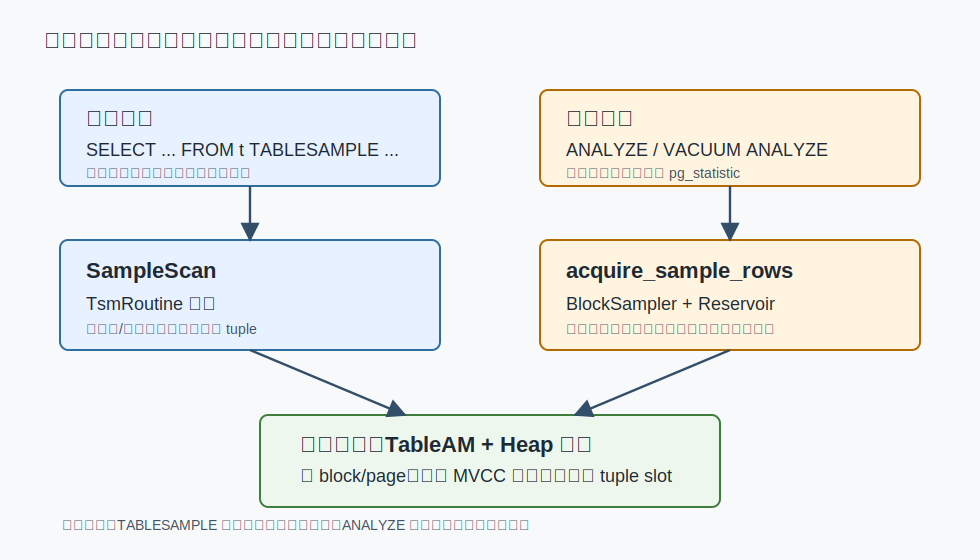
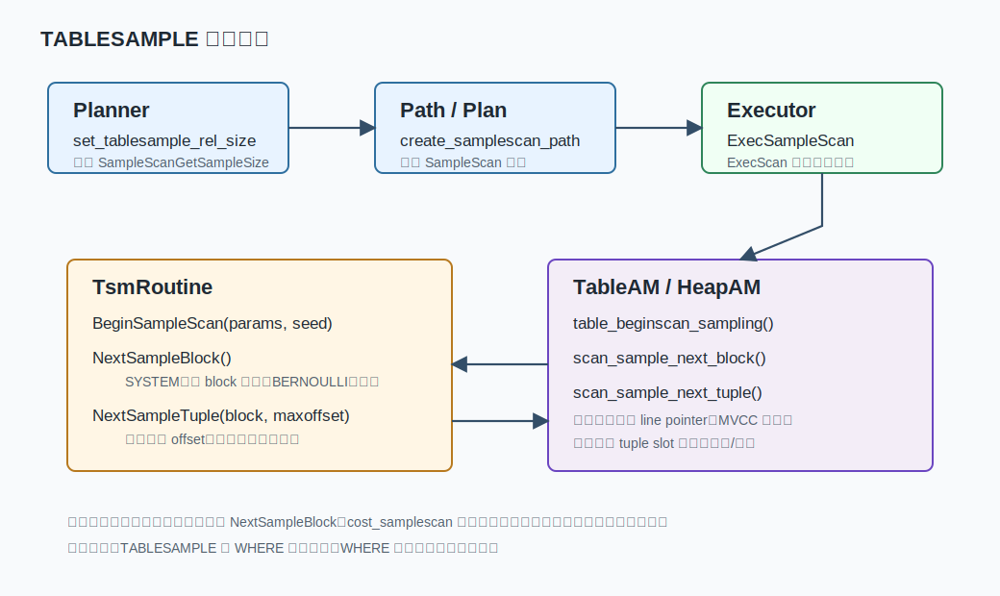
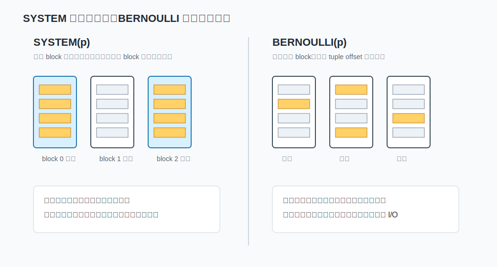
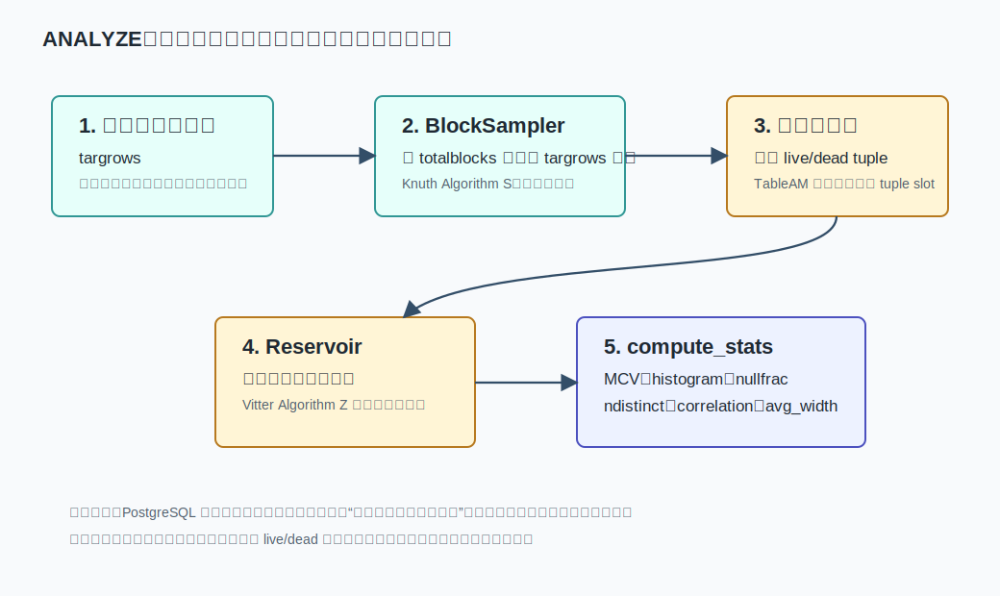
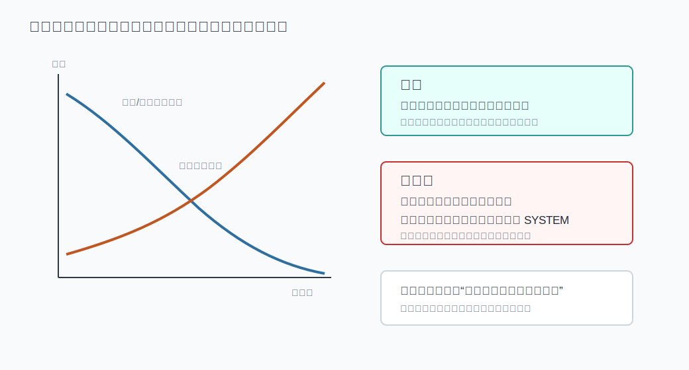

## 数据库筑基课 - 数据扫描方法“采样扫描”

### 作者
digoal

### 日期
2026-05-30

### 标签
PostgreSQL , 应用开发者 , 数据库筑基课 , 扫描算法 , 执行器 , 优化器 , TABLESAMPLE , ANALYZE

----

## 背景
  


本节属于数据库基础能力里的“扫描与执行算法”。前面的 `Seq Scan`、`Index Scan`、`Bitmap Scan` 讨论的是“怎样把满足条件的行尽量正确、尽量便宜地找出来”。采样扫描讨论的是另一个问题：当业务愿意接受近似、统计或代表性样本时，数据库能不能少读一些、快一些，并且把误差边界讲清楚。

数据库筑基课大纲在当前项目中未找到可引用文件，因此本文按“扫描/执行算法”独立成篇。本文以 PostgreSQL 本地源码、官方文档和 DeepWiki 对 `postgres/postgres` 的架构摘要为主。用户给出的三篇资料 `Sampling from Databases`、`Block-Level Sampling in Knowledge Discovery In Databases`、`Random Sampling for Histogram Construction: How Much Is Enough?` 中，后两者在当前项目没有原文文件；公开检索到的块级采样稳定对应资料更接近 `Effective Use of Block-Level Sampling in Statistics Estimation`。本文只引用这些论文的可核验思想：数据库采样不是简单 `ORDER BY random()`，块级采样会引入聚簇偏差，直方图/统计采样需要在样本量和估计误差之间做权衡；不引用无法本地核验的实验数字。

业务上常见痛点有四类：

1. 大表想快速看数据分布，`SELECT ... ORDER BY random() LIMIT 1000` 把系统拖慢。
2. 报表或数据科学任务只需要近似结果，却默认全表扫。
3. DBA 看到 `ANALYZE` 每次结果略有不同，误以为统计信息“不稳定就是坏的”。
4. 开发者把 `TABLESAMPLE SYSTEM(1)` 当成“随机 1% 行”，忽略了它其实是块级采样。

这篇文章把“查询采样”和“统计采样”放在一起讲，因为它们共享同一个底层取舍：用概率换 I/O，用可解释误差换速度。

## 一、它解决什么问题？

采样扫描解决的是“没有必要读全量时，怎样从大表里取一个代表性子集”的问题。

它把问题从：

```text
读完整表 -> 得到精确结果
```

转成：

```text
按概率读部分块或部分行 -> 得到样本 -> 接受随机误差或聚簇偏差
```

在 PostgreSQL 里主要有两条路径：

- 用户查询路径：`SELECT ... FROM t TABLESAMPLE ...`，计划节点是 `SampleScan`。
- 统计信息路径：`ANALYZE`，内部通过 `acquire_sample_rows()` 抽样行，构造 `pg_statistic`、直方图、MCV、相关性等统计信息。



图 1 说明：`TABLESAMPLE` 和 `ANALYZE` 的目标不同。前者把样本行返回给用户查询，后者把样本行喂给优化器统计计算。但它们都落到 Table Access Method 和 heap 页面访问：读页面、检查 tuple、判断 MVCC 可见性，再把可见行向上交付。

代价也必须先讲清楚：采样扫描不是精确扫描的低价替代品。它适合近似、探索、建统计；不适合账务结算、审计、唯一性证明、稀有异常发现，除非你能证明样本漏掉异常的概率可接受。

## 二、它是什么？

在 PostgreSQL 中，“采样扫描”至少包含三个层次。

第一层是 SQL 标准风格的 `TABLESAMPLE`：

```sql
SELECT *
FROM orders TABLESAMPLE SYSTEM (1) REPEATABLE (42);

SELECT *
FROM orders TABLESAMPLE BERNOULLI (1);
```

官方文档 `ref/select.sgml` 说明：`TABLESAMPLE` 放在表名之后，采样发生在 `WHERE` 等过滤条件之前；内置方法包括 `BERNOULLI` 和 `SYSTEM`，扩展可以安装更多方法。

第二层是执行器计划节点 `SampleScan`。它不是 `Seq Scan + random()` 的语法糖，而是一个独立扫描节点：

- `postgres/src/backend/optimizer/path/allpaths.c`：`set_tablesample_rel_size()` 调用采样方法估算页数和行数；`set_tablesample_rel_pathlist()` 只考虑 `SampleScan` 路径。
- `postgres/src/backend/optimizer/util/pathnode.c`：`create_samplescan_path()` 创建 `T_SampleScan` path。
- `postgres/src/backend/optimizer/path/costsize.c`：`cost_samplescan()` 按采样方法是否提供 `NextSampleBlock` 区分随机页成本和顺序页成本。
- `postgres/src/backend/optimizer/plan/createplan.c`：`create_samplescan_plan()` 和 `make_samplescan()` 生成计划节点。
- `postgres/src/backend/executor/nodeSamplescan.c`：`ExecSampleScan()`、`tablesample_init()`、`tablesample_getnext()` 驱动执行。

第三层是 Table Sample Method API，定义在 `postgres/src/include/access/tsmapi.h`。一个采样方法通过 `TsmRoutine` 提供回调：

| 回调 | 作用 |
|---|---|
| `SampleScanGetSampleSize` | 计划阶段估算将访问多少页、返回多少行 |
| `InitSampleScan` | 执行器初始化采样方法私有状态 |
| `BeginSampleScan` | 计算参数、seed、cutoff、访问策略 |
| `NextSampleBlock` | 选择下一个采样块；可为空 |
| `NextSampleTuple` | 在当前块内选择下一个候选 tuple offset |
| `EndSampleScan` | 释放外部资源；可为空 |

这套接口解释了为什么采样扫描是可扩展的：内核负责计划、执行框架、表访问、MVCC 可见性；采样方法只负责“哪些块、哪些 offset 是候选”。

## 三、核心原理

### 3.1 `TABLESAMPLE` 的执行链路



图 2 说明：`SampleScan` 在执行时先计算参数和 seed，再调用 `BeginSampleScan()`。之后执行器反复调用 `table_scan_sample_next_block()` 和 `table_scan_sample_next_tuple()`。heap AM 读页面、检查 line pointer 和 MVCC 可见性；采样方法返回的 offset 只是候选，不保证 tuple 存在或可见。

源码里的关键细节：

- `nodeSamplescan.c` 在没有 `REPEATABLE` 时用全局随机数生成 seed；有 `REPEATABLE` 时把浮点表达式通过 `hashfloat8()` 转成 seed。
- `tablesample_init()` 允许采样方法调整 `use_bulkread`、`use_pagemode` 和同步扫描策略。
- 如果采样方法没有 `NextSampleBlock`，heap AM 会顺序扫描所有块，这正是 `BERNOULLI` 的形态。
- 如果采样方法提供 `NextSampleBlock`，heap AM 按方法返回的 block 读页面，这正是 `SYSTEM` 的形态。
- `heapam_scan_sample_next_tuple()` 会对候选 tuple 做可见性判断；不可见、无效 line pointer 会被跳过。

### 3.2 `SYSTEM`：块级采样

`SYSTEM(p)` 的实现位于 `postgres/src/backend/access/tablesample/system.c`。它的逻辑是：

1. 参数 `p` 必须在 0 到 100 之间。
2. `BeginSampleScan()` 把百分比转换成 `cutoff`。
3. `NextSampleBlock()` 对 `(block number, seed)` 做 hash，hash 小于 cutoff 就抽中这个块。
4. `NextSampleTuple()` 返回该块上的所有 offset，让 heap AM 逐个检查可见性并返回可见行。

因此 `SYSTEM(1)` 不是“每行 1% 概率”，而是“每个页面 1% 概率”。如果表按时间、租户、状态物理聚簇，一个页面上的行可能高度相似，样本就会有明显聚簇效应。

它的优势是 I/O：小比例采样时可能只读少量块。`system_samplescangetsamplesize()` 也把估算页数设为 `baserel->pages * samplefract`。`cost_samplescan()` 看到 `NextSampleBlock != NULL` 时按随机页成本估算，这是一个合理保守假设：抽中的块不一定连续。

### 3.3 `BERNOULLI`：逐行概率采样

`BERNOULLI(p)` 的实现位于 `postgres/src/backend/access/tablesample/bernoulli.c`。它的逻辑是：

1. 参数 `p` 必须在 0 到 100 之间。
2. `SampleScanGetSampleSize()` 估算会访问所有页面，但返回 `tuples * p` 行。
3. 它不提供 `NextSampleBlock`，所以 heap AM 顺序走所有块。
4. `NextSampleTuple()` 对 `(block number, tuple offset, seed)` 做 hash，hash 小于 cutoff 就抽中这个 offset。

源码注释强调这样做是为了 repeatability：某个 TID 是否被选中只取决于 TID 和 seed，不依赖扫描历史。否则同步扫描、物理扩展、关系收缩等都可能破坏可重复性。



图 3 说明：`SYSTEM` 快在少读块，但块内行一起进入样本，容易受物理聚簇影响；`BERNOULLI` 对 tuple offset 独立抽样，更接近朴素行级随机样本，但仍要访问全表页面，所以低采样比例时也不一定省 I/O。

### 3.4 `ANALYZE`：块采样 + 蓄水池采样

`ANALYZE` 的采样不直接使用 `TABLESAMPLE SYSTEM/BERNOULLI`。本地普通表的入口在 `postgres/src/backend/commands/analyze.c:acquire_sample_rows()`。

其两阶段方法在源码注释里说得很清楚：

1. 第一阶段：最多随机选择 `targrows` 个 block；表块少时选择全部块。
2. 第二阶段：扫描这些块，并用 Vitter 蓄水池采样算法从候选行里保留 `targrows` 行。
3. 两阶段同时进行：每当第一阶段返回一个块，就立刻扫描块内行，由第二阶段决定是否进入 reservoir。
4. 返回的样本行最后按物理位置排序，用于后续相关性估计。



图 4 说明：`ANALYZE` 的目标不是返回样本，而是用有限样本计算统计信息。`targrows` 由列的 `minrows`、统计目标、索引表达式、扩展统计共同决定；采样行再进入 `compute_scalar_stats()` 等函数，生成 MCV、直方图、空值比例、平均宽度、distinct 估计和物理/逻辑相关性。

底层算法在 `postgres/src/backend/utils/misc/sampling.c`：

- `BlockSampler_Init()` / `BlockSampler_Next()`：用 Knuth Algorithm S 从已知总块数里抽固定数量块。
- `reservoir_init_selection_state()` / `reservoir_get_next_S()`：实现 Vitter `Random sampling with a reservoir` 论文中的 Algorithm X/Z，计算跳过多少行后替换 reservoir 中的随机元素。
- `sampler_random_fract()`：为采样算法生成 `(0, 1)` 区间随机数。

源码也诚实写了限制：这种两阶段方法让每行进入最终样本的机会相等，但“不是每一种可能的行样本都等概率被选中”；对大表来说，样本代表的不同块数量可能偏少。PostgreSQL 接受这个折中，是因为它能得到统计上无偏的块集合，从而更可靠估计每块平均 live/dead 行数，避免老方法过度相信表开头附近的行密度。

### 3.5 样本量、直方图和统计目标

官方 `ANALYZE` 文档说明：大表会随机采样而非检查每一行，所以统计信息是近似的，即使表内容不变，每次 `ANALYZE` 的估计也可能略有变化；极少数情况下，计划选择也可能因此变化。提高 `default_statistics_target` 或列级统计目标，会提高 MCV 和直方图容量，也会增加采样行数、时间和 `pg_statistic` 空间。

这和 `Random Sampling for Histogram Construction: How Much Is Enough?` 这类论文讨论的问题一致：直方图不是“排序后随便切几段”这么简单，样本量不足时，尾部、倾斜分布、稀有值、相关列都会被低估。数据库工程里的现实选择是：

- 统计目标太低：`ANALYZE` 快，统计占用小，但选择率估计更容易错。
- 统计目标太高：统计更细，但采样、排序、MCV 计算、目录存储都有额外成本。
- 单列统计不够：需要 extended statistics，例如依赖关系、MCV 组合、ndistinct 组合。
- distinct 估计仍不准：PostgreSQL 文档建议必要时手工设置 `n_distinct`。



图 5 说明：扩大样本通常能降低随机误差，但会提高读取和计算成本。更麻烦的是系统性偏差：例如物理聚簇导致 `SYSTEM` 样本不代表行级分布，或者稀有异常在样本中根本没有出现。随机误差可以靠样本量缓解，系统性偏差必须靠更合适的采样方法、分层采样、分区统计或业务规则处理。

## 四、横向对比

| 维度 | `TABLESAMPLE SYSTEM` | `TABLESAMPLE BERNOULLI` | `ANALYZE` 内部采样 | `ORDER BY random() LIMIT n` | 全表扫描 |
|---|---|---|---|---|---|
| 主要目标 | 快速块级样本 | 行级概率样本 | 优化器统计信息 | 随机取固定行数 | 精确结果 |
| 访问页面 | 抽中部分页面 | 通常访问所有页面 | 抽样 block | 通常读全表并排序/Top-N | 访问全表 |
| 随机单位 | block | tuple offset | block + row reservoir | row | 无采样 |
| 是否返回精确结果 | 否 | 否 | 不直接返回用户结果 | 只精确返回随机排序后的 n 行 | 是 |
| 对物理聚簇敏感 | 高 | 低于 SYSTEM | 有块级影响 | 低 | 不涉及 |
| 可重复性 | 支持 `REPEATABLE` | 支持 `REPEATABLE` | 默认不要求 repeatable | 取决于随机函数 seed 和执行方式 | 是 |
| 典型场景 | 快速预览、块级质检、近似扫描 | 行级抽样分析 | 统计信息刷新 | 小表临时抽样 | 账务、审计、精确报表 |
| 主要风险 | 样本行成片出现 | I/O 不省 | 统计抖动、稀有值低估 | 大表代价高 | 慢但语义明确 |

这张表的核心不是“哪个更好”，而是“抽样单位是什么”。抽样单位决定了 I/O、误差和偏差来源。很多工程事故都来自把块级概率误解成行级概率。

PostgreSQL 还提供两个 contrib 方法：

- `tsm_system_rows`：按目标行数返回样本，底层仍按随机块推进；文档说明它不支持 `REPEATABLE`，源码里 `repeatable_across_queries=false`、`repeatable_across_scans=true`。
- `tsm_system_time`：按时间预算返回样本；因为依赖运行时间，源码里 `repeatable_across_queries=false`、`repeatable_across_scans=false`，文档也说明不支持 `REPEATABLE`。

这两个方法更偏“工程方便”，不是严格均匀随机样本。用于快速预览可以，不能直接当统计证明。

## 五、效果如何？

采样扫描的收益：

- 小比例 `SYSTEM` 可以显著减少页面读取，适合快速探索。
- `BERNOULLI` 提供更接近行级独立概率的样本，适合对物理聚簇敏感的分析。
- `REPEATABLE(seed)` 让相同表状态、相同参数下的内置采样具备可复现实验能力。
- `ANALYZE` 用有限样本构造统计信息，使大表统计刷新保持可接受成本。
- 扩展接口 `TsmRoutine` 允许实现业务定制采样方法。

采样扫描的成本：

- 结果不精确，`count(*)`、`sum(amount)` 等聚合需要按采样概率校正才有近似意义。
- `SYSTEM` 的行数波动可能很大：抽到的块上有多少可见行，取决于页面填充、HOT、死元组、聚簇分布。
- `BERNOULLI` 即使只取 1%，也通常要扫描全部页面，I/O 节省有限。
- `TABLESAMPLE` 在 `WHERE` 前发生，稀有条件可能在样本阶段被漏掉。
- `ANALYZE` 统计是近似的，统计目标过低会导致选择率估计错误。
- 对分区父表、继承父表，自动统计触发有边界；官方文档提示需要周期性手工 `ANALYZE` 保持层级统计新鲜。

不要把采样扫描用于“必须保证包含某类行”的需求。如果需求是“随机抽一些可疑订单人工审核”，需要先明确漏检概率；如果需求是“找出所有可疑订单”，采样就是错工具。

## 六、实操 DEMO

以下 SQL 按 PostgreSQL 编写。当前任务是写文章，没有启动数据库实例执行这些 SQL，因此不提供伪造输出。读者可以在本地 PostgreSQL 执行并用 `EXPLAIN (ANALYZE, BUFFERS)` 验证。

### 6.1 对比 `SYSTEM` 和 `BERNOULLI`

```sql
DROP TABLE IF EXISTS demo_sample_scan;
CREATE TABLE demo_sample_scan (
  id bigint GENERATED ALWAYS AS IDENTITY PRIMARY KEY,
  tenant_id int NOT NULL,
  status text NOT NULL,
  payload text NOT NULL
) WITH (fillfactor = 80);

INSERT INTO demo_sample_scan (tenant_id, status, payload)
SELECT
  (g / 10000)::int,
  CASE WHEN g % 100 = 0 THEN 'rare' ELSE 'normal' END,
  repeat(md5(g::text), 8)
FROM generate_series(1, 200000) AS g;

ANALYZE demo_sample_scan;

EXPLAIN (ANALYZE, BUFFERS)
SELECT count(*)
FROM demo_sample_scan TABLESAMPLE SYSTEM (1) REPEATABLE (42);

EXPLAIN (ANALYZE, BUFFERS)
SELECT count(*)
FROM demo_sample_scan TABLESAMPLE BERNOULLI (1) REPEATABLE (42);
```

观察点：

- `SYSTEM(1)` 的 buffer 访问通常更少，但返回行数受抽中页面的行密度影响。
- `BERNOULLI(1)` 的返回行数更接近行级概率预期，但仍会访问全表页面。
- 两者都会显示 `Sample Scan`，而不是 `Seq Scan`。

### 6.2 `WHERE` 在采样之后

```sql
EXPLAIN (ANALYZE, BUFFERS)
SELECT count(*)
FROM demo_sample_scan TABLESAMPLE SYSTEM (1) REPEATABLE (7)
WHERE status = 'rare';

EXPLAIN (ANALYZE, BUFFERS)
SELECT count(*)
FROM demo_sample_scan
WHERE status = 'rare';
```

第一条语句不是“从 rare 行里抽 1%”，而是“先从表里抽样，再过滤 rare”。如果 `rare` 很稀有，样本里可能一个都没有。

### 6.3 提高统计目标后观察 `ANALYZE`

```sql
ALTER TABLE demo_sample_scan
  ALTER COLUMN status SET STATISTICS 1000;

ANALYZE VERBOSE demo_sample_scan;

SELECT attname, null_frac, n_distinct, most_common_vals, most_common_freqs
FROM pg_stats
WHERE schemaname = current_schema()
  AND tablename = 'demo_sample_scan'
  AND attname = 'status';
```

观察点：

- 统计目标越高，`ANALYZE` 通常需要更多样本行。
- 对极低频值，提高统计目标可能改善 MCV 捕获概率，但不能保证所有稀有值都进入样本。
- 如果优化器因 distinct 估计错误持续选错计划，可以按官方文档考虑列级 `n_distinct` override，而不是盲目无限提高统计目标。

### 6.4 避免 `ORDER BY random()` 大表抽样

```sql
-- 大表上通常不推荐：需要为大量行计算 random() 并排序或 Top-N
EXPLAIN (ANALYZE, BUFFERS)
SELECT *
FROM demo_sample_scan
ORDER BY random()
LIMIT 1000;

-- 快速探索可优先考虑 TABLESAMPLE，再按需要 LIMIT
EXPLAIN (ANALYZE, BUFFERS)
SELECT *
FROM demo_sample_scan TABLESAMPLE SYSTEM (1)
LIMIT 1000;
```

这两条语句语义不同。第一条更接近从全表行里随机取固定 1000 行，但代价高；第二条是从块级样本里最多取 1000 行，快但可能有聚簇偏差。不要只看速度，要看语义是否能接受。

## 七、最佳实践

面向数据库架构师：

- 把采样需求分成“近似查询”“数据探索”“统计信息”“审计精确结果”四类，不要用一个 SQL 模式覆盖所有场景。
- 对物理聚簇明显的表，例如按时间写入、按租户批量导入、状态集中更新，慎用 `SYSTEM` 做行级代表性分析。
- 对分区表建立手工 `ANALYZE` 策略。官方文档说明 autovacuum 不会处理 partitioned table 本身，也不会因为子表变化自动刷新父级继承统计。
- 如果业务需要稳定近似指标，考虑物化抽样表、分层采样、HyperLogLog、Sketch、预聚合，而不是每次临时 `TABLESAMPLE`。

面向 DBA：

- 慢查询排查时，看到 `Sample Scan` 要先确认业务是否接受近似结果；不要把它当普通扫描节点看。
- 统计抖动导致计划偶发变化时，先检查 `ANALYZE` 频率、统计目标、扩展统计、表膨胀、分区父表统计，而不是直接关闭某类扫描。
- 对极度倾斜列，提高列级统计目标或建立 extended statistics；如果 distinct 估计仍不准，按文档使用 `ALTER TABLE ... SET (n_distinct = ...)`。
- 对采样 SQL 用 `EXPLAIN (ANALYZE, BUFFERS)` 观察实际读块数、返回行数和过滤行数；不要用“采样百分比”直接推断 I/O。

面向业务开发者：

- `TABLESAMPLE SYSTEM(1)` 不能保证返回正好 1% 行，也不能保证每个租户、每个状态都按比例出现。
- 如果要可复现实验，使用 `REPEATABLE(seed)`，并记录表数据版本；表变了，即使 seed 相同样本也可能变。
- 如果要“从满足条件的行里抽样”，应先用子查询或物化临时结果明确语义，但要意识到 PostgreSQL 文档当前限制 `TABLESAMPLE` 只接受普通表和物化视图，不接受任意 `FROM` 项。
- 不要在大表上默认 `ORDER BY random()`；除非你明确需要全表行级随机排序语义，并且能承担代价。

## 八、适合与不适合场景

适合：

- 数据探索：快速看大表字段分布、样例行、粗略质量问题。
- 近似分析：允许误差的趋势判断、抽样验证、用户行为粗略画像。
- 统计维护：`ANALYZE` 用有限样本构造优化器统计。
- 压测准备：快速从生产大表抽出结构相似的测试子集，但要注意敏感数据脱敏。
- 人工审核：从海量记录中抽样质检，但必须结合漏检概率和分层策略。

不适合：

- 财务结算、审计报表、库存扣减、权限判定等精确语义。
- 稀有异常发现，例如万分之一欺诈、极小概率脏数据；样本很可能漏掉。
- 需要每个分组都有代表样本的场景；普通 `TABLESAMPLE` 不保证分层。
- 行物理顺序强相关且使用 `SYSTEM` 的行级推断。
- 用户以为 `WHERE` 先过滤再采样的场景。

## 九、常见坑

1. 把 `SYSTEM(1)` 理解成“随机 1% 行”。它是块级概率采样，块内所有可见行会一起返回。
2. 以为 `BERNOULLI(1)` 一定快。它通常仍要访问全部页面，只是少返回行。
3. 忽略 `TABLESAMPLE` 在 `WHERE` 之前。稀有条件可能在采样阶段就被漏掉。
4. 用采样结果直接做精确聚合。`count`、`sum`、`avg` 的近似解释、置信区间和偏差来源必须单独说明。
5. 认为 `ANALYZE` 每次不同就是错误。官方文档明确说明大表统计基于随机样本，估计会有轻微变化。
6. 只提高 `default_statistics_target`，不建 extended statistics。多列相关性问题靠单列直方图很难解决。
7. 对分区父表完全依赖 autovacuum。父级统计可能不会因为子分区变化自动保持新鲜。
8. 用 `ORDER BY random()` 替代采样扫描。语义可能更强，但大表代价也更高。
9. 对扩展采样方法误用 `REPEATABLE`。`tsm_system_rows` 和 `tsm_system_time` 文档都说明不支持 `REPEATABLE`。
10. 忽略 MVCC。采样方法选中 offset 后，heap AM 仍会做可见性判断；死元组和页面状态会影响实际返回行数。

## 十、扩展问题

1. 如果你要“每个租户随机抽 100 行”，普通 `TABLESAMPLE` 为什么不够？应该用窗口函数、分层采样，还是预采样表？
2. 如果一个表按时间顺序插入，`SYSTEM(1)` 抽到的页面是否能代表所有时间段？怎样验证？
3. `ANALYZE` 的样本行是为了优化器，不是为了用户查询。为什么统计采样可以接受“不完美的行样本等概率”？
4. 如果 `status='rare'` 的选择率被低估或高估，优化器会在 index scan、bitmap scan、seq scan 之间怎样选错？
5. 对列相关性强的表，单列直方图为什么不够？PostgreSQL extended statistics 能补哪一块？
6. 如果要做近似查询系统，应该在扫描层采样、存储层维护 sketch，还是在查询结果层做采样校正？

## 十一、扩展阅读

- PostgreSQL 源码：`postgres/src/backend/executor/nodeSamplescan.c`，`SampleScan` 执行器入口。
- PostgreSQL 源码：`postgres/src/include/access/tsmapi.h`，`TsmRoutine` 回调接口。
- PostgreSQL 源码：`postgres/src/backend/access/tablesample/system.c`，内置 `SYSTEM` 块级采样。
- PostgreSQL 源码：`postgres/src/backend/access/tablesample/bernoulli.c`，内置 `BERNOULLI` 行级概率采样。
- PostgreSQL 源码：`postgres/src/backend/access/heap/heapam_handler.c`，heap AM 的 sample block / sample tuple 实现。
- PostgreSQL 源码：`postgres/src/backend/commands/analyze.c`，`ANALYZE` 采样和统计计算主线。
- PostgreSQL 源码：`postgres/src/backend/utils/misc/sampling.c`，BlockSampler 与 reservoir sampling 实现。
- PostgreSQL 文档：`postgres/doc/src/sgml/ref/select.sgml`，`TABLESAMPLE` 语义、`SYSTEM` / `BERNOULLI` 差异和限制。
- PostgreSQL 文档：`postgres/doc/src/sgml/tablesample-method.sgml`，自定义采样方法 API。
- PostgreSQL 文档：`postgres/doc/src/sgml/ref/analyze.sgml`，`ANALYZE` 随机采样、统计目标和分区/继承统计边界。
- PostgreSQL contrib：`postgres/doc/src/sgml/tsm-system-rows.sgml`，`tsm_system_rows`。
- PostgreSQL contrib：`postgres/doc/src/sgml/tsm-system-time.sgml`，`tsm_system_time`。
- DeepWiki：`postgres/postgres`，用于辅助定位 `SampleScan`、`ANALYZE`、FDW 采样相关架构；关键结论已回到本地源码核验。
- Jeffrey S. Vitter, `Random Sampling with a Reservoir`, ACM Transactions on Mathematical Software, 1985。PostgreSQL `sampling.c` 注释明确引用该论文。
- Frank Olken, Doron Rotem, `Random Sampling from Databases: a Survey` / 相关数据库采样论文。用于理解数据库采样算法的设计空间。
- Peter J. Haas, `Random Sampling for Histogram Construction: How Much Is Enough?`。用于理解直方图采样的样本量与误差问题。
- `Effective Use of Block-Level Sampling in Statistics Estimation`。用于理解块级采样在统计估计中的收益和偏差边界；用户给出的块级采样论文标题在当前项目未找到可核验原文。
  
## 附录 
1、询问 gemini
```
PostgreSQL 数据扫描方法“采样扫描”相关的论文
```

2、克隆代码  
```  
git clone --depth 1 https://github.com/postgres/postgres
```  
  
3、启用 codex, 使用 [数据库筑基课 skill](../skills/README.md).  
```
文章标题: 
  数据库筑基课 - 数据扫描方法 “采样扫描”
项目源码(已克隆到当前项目如下目录中):  
  postgres
相关论文或分享:
  Sampling from Databases
  Block-Level Sampling in Knowledge Discovery In Databases
  Random Sampling for Histogram Construction: How Much Is Enough?
项目 deepwiki reponame:  
  postgres/postgres
项目参考信息: 
  postgres/CLAUDE.md
```
  
  
#### [PostgreSQL 解决方案集合](../201706/20170601_02.md "40cff096e9ed7122c512b35d8561d9c8")
  
  
#### [德哥 / digoal's Github - 公益是一辈子的事.](https://github.com/digoal/blog/blob/master/README.md "22709685feb7cab07d30f30387f0a9ae")
  
  
#### [About 德哥](https://github.com/digoal/blog/blob/master/me/readme.md "a37735981e7704886ffd590565582dd0")
  
  

  
