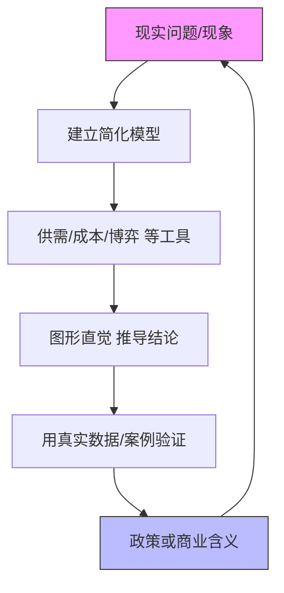
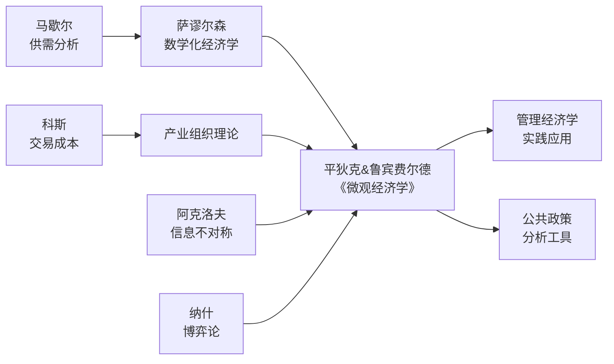

## 《微观经济学》读书笔记 
  
### 作者  
digoal  
  
### 日期  
2026-05-30 
  
### 标签  
读书笔记 , 微观经济学  
  
----  
  
## 背景 
  
  

---
书名: 《微观经济学（第九版）》  
作者: 罗伯特·S.平狄克 / 丹尼尔·L.鲁宾费尔德  
译者: 李彬 / 张军（校对）  
出版年份: 2020  
出版社: 中国人民大学出版社  
笔记日期: 2026-05-30  
ISBN: 9787300266404  
标签: [微观经济学, 中级教材, MBA, 市场理论, 博弈论, 信息经济学]  
---

  
### ——平狄克带你读懂市场这台机器

> **一句话**：这是一本用最少的数学、最多的现实案例，把微观经济学讲得最透彻的中级教材。  
> **适合谁读**：读完曼昆想进阶的人；MBA学生；想用经济学思维分析商业现实的从业者；考研备考中级微观方向的同学  
> **阅读难度**：⭐⭐⭐☆☆（有高中数学足够）  
> **推荐指数**：⭐⭐⭐⭐⭐  

---

## 一、时代坐标：这本书从哪里来？

1980年代，美国商学院和经济学系面临一个尴尬：经济学入门课（曼昆们的那套教材）太浅，高级微观经济学（马斯-科莱尔的《微经理论》）又太深，中间有一个巨大的真空地带。MBA学生、政策研究者、企业决策者需要的不是抽象的数学证明，而是能解释"为什么这家公司这么定价""为什么这个市场会形成垄断"的分析工具。

正是在这个背景下，麻省理工学院斯隆管理学院的罗伯特·平狄克（Robert S. Pindyck）和加州大学伯克利分校的丹尼尔·鲁宾费尔德（Daniel L. Rubinfeld）合作，写出了这本《微观经济学》。两人都是MIT经济学博士（平狄克1971年，鲁宾费尔德1972年），一个深耕产业组织与不确定性经济学，一个长年在司法部担任首席经济学家，处理真实的反垄断案件。这两种背景的结合，决定了这本书的气质：**理论结实，但绝不脱离现实**。

书从第一版到第九版，跨越近三十年。第九版（2017年英文版，2020年中译版）在前版基础上增补了大量新案例，涵盖网约车、互联网平台定价、气候变化的外部性、共享经济等当代议题，使这本书在数字经济时代依然保持极强的解释力。

```
时间轴：
初版问世 → 持续修订 → 第九版（2017）
  1992       ~每3年      ↑
                      新增数字经济、
                      平台竞争、
                      气候经济学案例
```

---

## 二、核心命题：作者在说什么？

本书的核心并非一个单一命题，而是一套**分析市场运作的完整框架**，可以拆解为三层递进的追问：

### 命题一：市场如何决定价格与数量？

书的前半部分（第一至九章）构建了经济学的基本骨架——供需理论、消费者行为、生产与成本。平狄克的讲法有一个显著特点：**他把"边际"思想贯穿始终**。

消费者在比较"多买一单位值不值"，厂商在比较"多生产一单位划不划算"，市场均衡就是所有人"边际上无利可图"时的状态。这不是一个抽象的数学结论，而是一个可以解释超市促销为何在周末推出、汽油价格为何与原油价格不同步的工具。

### 命题二：当市场结构改变，逻辑如何变化？

中间部分（第十至十三章）是本书最有价值的精华：**从完全竞争到垄断再到寡头，厂商的行为逻辑发生了什么根本性变化？**

垄断厂商不再是价格接受者，而是价格制定者，它可以通过差别定价（价格歧视）从消费者那里榨取更多剩余。寡头之间则像棋手——每步棋都要预测对方的反应，这引出了博弈论章节，平狄克用囚徒困境、纳什均衡来解释可口可乐与百事可乐为何价格趋同、OPEC为何时常瓦解。

### 命题三：市场失灵时，经济学能做什么？

最后部分涉及外部性、公共品、信息不对称——这是市场机制本身无法自动修复的领域。鲁宾费尔德的反垄断实务背景在这里发挥得淋漓尽致：碳税如何内化排放的社会成本？逆向选择如何摧毁二手车市场？道德风险为何让保险定价如此复杂？这些问题不是理论游戏，而是每天发生在现实政策讨论中的难题。

---

## 三、论证地图：作者怎么说服你的？

平狄克的论证风格可以用一个词概括：**案例驱动，图形优先，数学留底**。



**关键数据与案例举例：**

- 用美国汽油市场的历史价格数据，说明供给弹性在短期与长期的差异
- 用网飞（Netflix）差别定价策略，解释为何同一服务会有多种套餐
- 用OPEC石油卡特尔的历次博弈，说明为何价格合谋难以持续
- 用二手车市场（阿克洛夫"柠檬市场"）解释信息不对称导致的市场崩溃

**论证方式评价：**

本书最高明之处在于"先给直觉，再给严谨"的叙事节奏。每个模型先用文字和图形建立读者的直觉理解，数学推导则往往放在章末的附录里，让不喜欢数学的人也能跟上主线，让喜欢数学的人也能找到完整证明。这种安排使它成为各学科背景学生都能读下去的中级教材——这在经济学教材中并不常见。

---

## 四、前提假设与边界：什么情况下这不成立？

任何模型都有前提，平狄克的体系也不例外。理解这些前提，才能知道何时该依赖它，何时该警惕它。

**前提一：理性人假设**

模型中的消费者和厂商都是理性最优化者——消费者最大化效用，厂商最大化利润。这一假设在大量情境下是有效的近似，但行为经济学（卡尼曼、塞勒）早已证明人类系统性地偏离这个基准：损失厌恶、框架效应、双曲贴现……这些"非理性"不是偶然的噪声，而是可预测的规律。平狄克在第五章（不确定性与消费者行为）有所涉及，但整体上仍以理性为核心假设。

**前提二：市场可以被清晰界定**

供需模型依赖于一个边界清晰的市场。但在数字经济时代，平台经济（微信、谷歌、淘宝）制造了双边市场甚至多边市场，"谁是消费者""谁是厂商""价格是什么"都变得模糊。传统的市场界定方法在这里遭遇严峻挑战。

**前提三：均衡是可达到的稳定状态**

书中大量分析依赖静态均衡或比较静态分析。但现实中，市场往往处于动态演化中，技术冲击、政策突变、预期的自我实现（如金融市场的泡沫）都使"均衡"成为一个移动的靶心。

**适用边界：** 这本书的框架在分析实体商品市场、产业结构、基础政策工具时非常有力。对于金融市场、平台经济、宏观经济波动，需要引入额外工具才能完整分析。

---

## 五、思想谱系：这本书在哪个传统里？



平狄克站在新古典经济学的主流传统上——他接受马歇尔的供需框架，接受萨谬尔森的数学化形式，但比纯数学化路线更注重经济直觉和现实案例。

书中对博弈论的处理，借鉴了纳什、泰勒等人在1970-80年代对寡头市场的形式化分析；对信息不对称的处理，则直接对话阿克洛夫（"柠檬市场"，2001年诺奖）和斯蒂格利茨（道德风险，同届诺奖）的思想。鲁宾费尔德的法学背景，又使书中对外部性、监管政策的讨论融入了法律经济学的视角，这在同类教材中较为罕见。

这本书对中国经济学教育的影响也不可忽视。它随"经济科学译丛"系列进入中国高校，成为人大、北大、复旦、中山等高校研究生和本科高年级课程的核心教材，培育了整整一代中国经济学人对西方主流微观理论的基本认识。

---

## 六、我学到了什么？

读完这本书，有三个收获令我印象最深：

**1. 边际思维是一把万能钥匙**

经济学里最重要的不是均衡，而是"再多一点"的思考。多生产一件产品值不值？多雇一个员工划不划算？多打一次广告有没有用？这种边际分析的习惯，一旦建立起来，就会渗透到日常决策的方方面面——它让我开始追问成本的"机会成本"本质，而不是账面数字。

**2. 市场结构决定了企业的一切行为空间**

同样是卖产品，完全竞争的农民和垄断的自来水公司面临的约束完全不同。前者只能接受价格，后者可以制定价格，差异不只是程度的，而是性质的。这让我对很多商业现象有了更清醒的判断：某家公司看似"贪婪"的定价，很可能不过是在利用其市场结构，而这个结构是可以通过竞争政策改变的。

**3. 市场失灵不是市场的失败，而是市场的局限**

书里对外部性、公共品、信息不对称的处理，让我理解了为什么市场经济需要政府，但又为什么政府干预必须谨慎。这不是意识形态问题，而是机制设计问题——关键是找到正确的工具（税收还是补贴？管制还是产权界定？），而不是简单地站队"市场万能"或"政府万能"。

---

## 七、举一反三：这个框架还能用在哪？

平狄克的分析框架，有几个直接的迁移场景：

**场景一：分析一个行业的竞争格局**
用"市场结构四分法"（完全竞争→垄断竞争→寡头→垄断）快速定位一个行业的本质，预判企业的定价能力和利润空间。分析半导体、白酒、外卖平台……都适用。

**场景二：理解平台经济的定价策略**
书中的"价格歧视"章节，可以直接用来解读滴滴的动态定价、京东的会员定价、视频网站的套餐设计——它们都是二级或三级价格歧视的现实版本。

**场景三：评估政策的效率代价**
政府价格管制（如房租管制、最低工资）的经济效果，用供需分析和"无谓损失"概念可以做出清晰评估，这是政策分析中非常实用的思维工具。

---

## 八、批判与反思

平狄克这本书有几个值得警觉的局限：

**数字经济时代的滞后感**

书中的案例更新虽然引入了Uber等案例，但对平台经济的核心特征——网络效应、双边市场、数据垄断——仍然缺乏系统性分析框架。谷歌、Meta的市场支配地位，用传统的"市场集中度"指标根本无法衡量。这不是批评平狄克，而是说主流微观经济学在面对平台经济时确实需要新工具。

**"效率"视角的单一性**

整本书的价值标准几乎等于"帕累托效率"——判断市场结果好不好，主要看有没有无谓损失，有没有到达帕累托前沿。但这个框架对分配问题、公平问题基本沉默。一个满足效率的市场结果，可能同时是极度不平等的。在贫富分化日益严重的时代，这种单一效率视角的局限越来越明显。

**行为假设的现实距离**

尽管第五章处理了不确定性，整本书的理性人假设还是太强。行为经济学的挑战——人们如何在复杂情境下实际决策——在书中只是局部插曲，而非结构性的反思。

---

## 九、金句与记忆点

**1. "边际收益等于边际成本"——利润最大化的黄金法则**
这不只是厂商的原则，也是所有理性决策的底层逻辑：在任何事情上再多投入一点，值不值得？

**2. "消费者剩余+生产者剩余=社会总福利"**
这个等式告诉你，为什么价格管制和税收会造成"无谓损失"——有些交易本来可以发生，但因为干预而消失了，这是真实的社会损失。

**3. "垄断厂商是价格制定者，竞争性厂商是价格接受者"**
理解这一区别，就理解了为什么科技平台要拼命构建"护城河"——护城河的本质，是从价格接受者变成价格制定者的能力。

**4. "卡特尔（价格合谋）面临囚徒困境"**
OPEC为什么总是瓦解？因为每个成员都有欺骗的动机。集体理性与个体理性的矛盾，在这里用博弈论表达得无比清晰。

**5. "柠檬市场：信息不对称导致劣质品驱逐优质品"**
阿克洛夫的洞见，在平狄克书中被应用到保险、招聘、信贷等众多场景。凡是卖方比买方更了解产品质量的地方，市场就会系统性地失灵。

**6. "外部性的解决方案：税收或产权界定（科斯定理）"**
环境问题不是"市场的错"，而是产权未界定的结果。碳税和碳交易权，是把外部性内部化的两种不同路径。

**7. "需求价格弹性越低，厂商定价能力越强"**
为什么奢侈品、药品、烟草可以维持高价？因为消费者对价格不敏感。弹性低，意味着消费者"没有别的选择"。

---

## 十、延伸阅读

**1.《微观经济学：现代观点》——哈尔·范里安**
平狄克之后的进阶之选。同样是中级微观，但数学更严谨，理论体系更规范，特别适合有志走学术路线的读者。MIT、哈佛、伯克利的经济学本科指定教材。

**2.《思考，快与慢》——丹尼尔·卡尼曼**
对平狄克理性人假设最好的挑战。诺贝尔经济学奖得主卡尼曼，用系统一/系统二框架展示了人类决策的真实面貌，是行为经济学的入门经典。

**3.《市场的边界》——让·梯若尔**
2014年诺奖得主的科普作品。梯若尔在双边市场、平台监管、反垄断政策上的研究，是对平狄克框架在数字时代的重要补充。

**4.《信息规则》——卡尔·夏皮罗 & 哈尔·范里安**
专门讨论信息经济和网络效应的经典商业书籍。把微观经济学工具应用到互联网产业，是平狄克信息章节的现实版延伸读物。

**5.《这才是经济学》——薛兆丰**
将微观经济学思想以中国场景案例重新讲述，语言生动，适合作为读完平狄克后的"口语化版本"复习，或作为初次接触微观的入门读物。

---

*笔记写于 2026年5月30日 | 基于公开学术资料与深度思考整理*
*本笔记旨在呈现一种读法，不能替代原书阅读。如需深入学习，请参阅原著。*
  
  
#### [PostgreSQL 解决方案集合](../201706/20170601_02.md "40cff096e9ed7122c512b35d8561d9c8")
  
  
#### [德哥 / digoal's Github - 公益是一辈子的事.](https://github.com/digoal/blog/blob/master/README.md "22709685feb7cab07d30f30387f0a9ae")
  
  
#### [About 德哥](https://github.com/digoal/blog/blob/master/me/readme.md "a37735981e7704886ffd590565582dd0")
  
  

  
