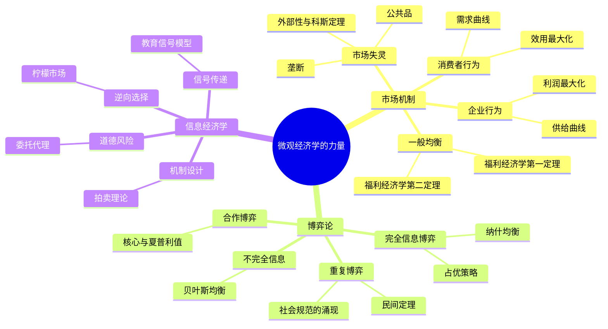

## 《微观经济学的力量》读书笔记 
  
### 作者  
digoal  
  
### 日期  
2026-05-30 
  
### 标签  
读书笔记 , 微观经济学的力量  
  
----  
  
## 背景 
  

---
书名: 《微观经济学的力量》  
原作名: ミクロ経済学の力  
作者: [日] 神取道宏（Kandori Michihiro）  
出版年份: 2024（中文版）/ 原版2017  
出版社: 浙江大学出版社  
笔记日期: 2026-05-30  
ISBN: 9787308244619  
豆瓣评分: 9.0+  
标签: [微观经济学, 博弈论, 信息经济学, 市场机制, 经济学通识]  
---

  

> **一句话**：一位顶尖博弈论学者写给所有人的微观经济学，它告诉你：世界的运转，比你想象的更有逻辑。  
> **适合谁读**：对经济学感兴趣却被教科书劝退的人；想重建知识框架的经济学科班生；希望用经济思维看懂世界的管理者和决策者。  
> **阅读难度**：⭐⭐⭐☆☆（需要一点耐心，但绝对值得）  
> **推荐指数**：⭐⭐⭐⭐⭐  
  
---

## 一、时代坐标：这本书从哪里来？

1990年代到2000年代，经济学发生了一场安静的革命。

传统微观经济学教科书——萨缪尔森时代的那套——长于数学推导，短于现实解释。学生们花了大量时间推演供需曲线，却说不清楚"二手车市场为何充斥柠檬货"背后的机制，也看不懂"为什么拍卖设计能影响国家财政收入"。理论和现实之间，隔着一道透明的玻璃墙。

与此同时，博弈论和信息经济学在20世纪后半叶异军突起。从纳什均衡到机制设计，从道德风险到逆向选择，这些工具彻底改变了经济学家理解人类行为的方式。1994年、2001年、2007年，诺贝尔经济学奖接连颁给博弈论和信息经济学领域的学者，这门学科的重量已经不言而喻。

神取道宏正是在这个节点上登场的。他1982年毕业于东京大学经济学部，1989年在斯坦福大学取得博士学位，导师是鼎鼎大名的保罗·米尔格罗姆（Paul Milgrom，2020年诺贝尔经济学奖得主）。他在社会规范、进化博弈论和重复博弈上发表了多篇奠基性论文，被称为"东大最接近诺贝尔奖的学者"，同时也是博弈论学会前任主席、计量经济学会终身会员、美国经济学会外国名誉会员。

一个如此量级的学者，为什么要写一本面向大众的教科书？

因为他在课堂上看见了问题。神取教授在东大讲授微观经济学多年，每堂课人满为患、掌声不断，讲义在《经济研讨》杂志连载时竟导致杂志脱销。他意识到：经济学本来可以更好玩、更有力量——问题在于大多数教科书把它讲死了。

这本书因此诞生——不是一本降低难度的入门书，而是一本重建认知框架的思想之旅。

```
时间轴：

1982 → 神取道宏东大本科毕业
1989 → 斯坦福博士（师从米尔格罗姆）
1992 → 社会规范进化博弈论奠基论文（被引5000+次）
2002 → 获日本经济学会中原奖
2017 → 原版《ミクロ経済学の力》出版
2023 → 就任博弈论学会主席
2024 → 中文版《微观经济学的力量》出版
```

---

## 二、核心命题：作者在说什么？

这本书有三根支柱，缺一不可。

### 命题一：市场是人类最伟大的信息处理机器

神取的出发点不是"供需决定价格"这种教条，而是一个更深刻的问题：**在没有任何中央指挥者的情况下，几十亿人的生产和消费行为为何能大体协调？**

答案是价格机制。价格把分散在千千万万个体头脑里的私有信息——你的偏好、你的成本、你的稀缺感——压缩成一个数字，传递给所有市场参与者。这是哈耶克最精彩的洞见，而神取用一般均衡理论给它装上了精确的数学骨架。

福利经济学两大定理是这个命题的顶点：第一定理说，竞争均衡是帕累托有效的（没有人在不损害他人的前提下能变得更好）；第二定理说，任何帕累托有效配置都能通过适当的再分配后用竞争均衡实现。这两个定理合在一起，是市场经济的"理论宪法"。

### 命题二：博弈论是理解战略互动的语言

当市场失灵——外部性、公共品、垄断——标准的价格分析就失效了。这时，博弈论登场。

博弈论的核心问题是：**当我的最优选择取决于你的选择，你的最优选择又取决于我的选择时，结局会是什么？**

纳什均衡给出了一个稳定点的定义：没有任何一方有动机单方面偏离。但神取真正感兴趣的是博弈论的延伸——重复博弈（为什么长期合作可能战胜短期背叛）、进化博弈（社会规范如何从个体行为中涌现）、合作博弈（联盟如何形成、利益如何分配）。这些恰恰是他学术生涯的核心贡献。

### 命题三：信息不对称是现代经济最核心的摩擦力

二手车市场、保险市场、劳动力市场——很多市场的奇怪现象，根源不在于人坏，而在于**信息分布不对称**。

阿克洛夫的"柠檬市场"模型揭示：当卖家比买家更了解商品质量，劣质品会把优质品驱逐出市场。信号传递（Spence）和信息甄别（Stiglitz）则告诉我们，市场参与者会主动设计机制来传递或筛选信息。

神取的天才之处在于，他把市场机制、博弈论、信息经济学这三者串联成一个连贯的叙事：市场在信息完全时运作良好，博弈论揭示战略互动下的均衡，信息经济学则解释真实世界中摩擦的来源。

---

## 三、论证地图：作者怎么说服你的？



神取的论证方式有三个特点，让这本书与众不同：

**从直觉出发，再到数学。** 他不会先丢一个公式，而是先讲清楚"这个问题为什么有趣"。比如讲公共品，他会先问：路灯该不该由政府提供？为什么私人市场会供给不足？然后才引入"非排他性"和"非竞争性"的概念。

**现实案例贯穿始终。** 全球化为何兴起？拍卖制度如何设计才能最大化收入？日本的就业终身制是博弈均衡的产物还是文化特殊性？神取把这些时事议题一一纳入经济学框架，让读者感受到理论的解释力。

**最后一章是真正的高潮。** 《有关社会思想的讨论》是全书的精髓——神取在这里评价自由主义、功利主义、平等主义等思想流派，用经济学视角审视"什么是好社会"。多位读者表示，前面几百页都是为读懂这章准备的。

---

## 四、前提假设与边界：什么情况下这不成立？

任何理论都有边界。神取是诚实的学者，他在书中也坦承了经济学模型的局限。

**假设一：人是理性的效用最大化者。**
这是全书的底层预设。行为经济学的大量实验表明，真实的人受制于锚定效应、损失厌恶、双曲折现……理性假设在很多情境下都会失效。神取对此有所回应（书中也涉及行为经济学），但整体框架仍建立在理性人基础上。

**假设二：博弈的规则是已知且固定的。**
博弈论分析的前提是参与者清楚地知道博弈结构——谁在博弈、有什么策略可选、收益如何分布。但现实中，规则本身常常是不确定的，甚至是被操纵的对象。这让博弈论预测的精确性大打折扣。

**假设三：均衡是唯一的或可以被选择的。**
纳什均衡往往不唯一。多重均衡的情况下，经济学家需要额外的"均衡选择理论"——而这正是神取自己研究的领域，所以他对此问题格外诚实：没有通用的解法。

**适用边界：** 这本书的分析框架最适用于市场交换、战略决策、制度设计等场景，对于深度嵌入文化和历史的经济现象（如为什么日本的劳动市场和美国如此不同），经济学模型只能提供部分解释。

---

## 五、思想谱系：这本书站在哪个传统里？

```
瓦尔拉斯（一般均衡）
    ↓
阿罗 & 德布鲁（福利经济学）
    ↓
纳什（博弈论）
    ↓
阿克洛夫 / 斯宾塞 / 斯蒂格利茨（信息经济学）
    ↓
米尔格罗姆 / 威尔逊（机制设计、拍卖理论）← 神取博士导师
    ↓
神取道宏（社会规范、进化博弈、本书）
```

神取的思想根在新古典经济学，但他的研究让这棵树长出了新枝——进化博弈论和社会规范理论打通了经济学与社会学之间的壁垒；他对重复博弈中合作机制的研究，在某种意义上回应了哈耶克对自发秩序的洞见，但用的是严格的数学语言。

这本书的写法也有鲜明的"日本学派"特点：严谨而不失温度，系统而不遗漏细节，数学推导和直觉解释并重。与美国教科书（如范里安《微观经济学》）相比，神取的书更注重思想脉络和现实反思，不只是工具手册。

---

## 六、我学到了什么？

读完这本书，我有三个收获让我久久回味。

**收获一：价格是信息，不是成本。**
我过去把价格理解成"成本加成"。读完这本书才真正懂得：价格的真正功能是传递信息和协调行动。一个价格上涨，背后携带的信号是"这种东西变稀缺了，请减少使用，或者想办法增加供给"。这个洞见让我重新理解了很多看似奇怪的市场现象——比如为什么灾难后物价飙升在道德上令人愤怒，但在功能上却有着冷酷的合理性。

**收获二：合作是均衡，不是道德。**
博弈论章节改变了我对"人性善恶"的思考方式。人们在重复博弈中的合作，不一定需要预设道德，而可能只是理性策略的长期均衡——因为背叛的短期收益比不上合作带来的长期收益。这让我对"制度设计"产生了全新的尊重：好的制度不是依赖人的善良，而是让自利的行为恰好带来合作的结果。

**收获三：信息不对称是系统性偏见的根源。**
"为什么医生总是建议更多手术？""为什么二手车经销商总是信息不透明？""为什么保险公司要设置免赔额？"这些问题背后都有一个统一的答案：信息不对称。理解了这个机制，我开始更清醒地看待生活中各种"专业建议"——它们都在某种程度上受到信息优势方的战略性操控。

---

## 七、举一反三：这个框架还能用在哪？

神取的核心方法论——**用理性人假设和均衡分析来理解战略互动**——有着广泛的迁移价值。

**职场谈判：** 薪资谈判是一个不完全信息博弈。你比公司更了解自己的保留价格，公司比你更了解内部薪酬结构。信号传递理论告诉你：高学历不一定代表真实能力，但可以作为有效信号，因为它的"伪造成本"较高。理解这一点，就能更清醒地评估自己的谈判筹码。

**平台设计：** 滴滴、美团、淘宝都是双边市场。平台需要同时吸引买家和卖家，而两边都是对方的"外部性"——司机越多，乘客越愿意用；乘客越多，司机越愿意来。这是网络效应和正反馈的博弈，其设计逻辑完全可以用市场机制和博弈论分析。

**政策评估：** 任何公共政策（最低工资、碳税、住房补贴）都会引发市场参与者的策略性反应。忽略这种反应的政策分析是幼稚的。神取书中对各种政策干预的福利分析，提供了一套思考框架：政策改变了谁的激励，均衡会移向哪里，谁是真正的受益者？

---

## 八、批判与反思

这本书有一个我真正不同意的地方。

在最后讨论社会思想时，神取对"效率"给予了极高的礼赞，对"帕累托改进"的崇尚贯穿全书。但"帕累托有效"本质上是一个极为保守的标准——它意味着只要有一个人受损，哪怕其余所有人都大大受益，这个变化就不算"改进"。现实中几乎所有重大改革都不是帕累托改进，都有人受损。如果经济学家的词汇表里只有"帕累托"，那很多重要的分配正义问题就根本没法讨论。

另一个局限是：这本书的分析框架高度依赖"均衡"这个概念。但历史上很多最重要的经济事件——金融危机、技术革命、社会运动——恰恰是"离开均衡"的过程。演化、路径依赖、非线性反馈……这些在标准微观经济学框架里往往只能是脚注。

时代也在变。2024年的世界，人工智能正在重塑劳动力市场，平台经济模糊了"价格"的边界（注意力经济里用户用时间而非金钱支付），气候变化带来了空前规模的外部性问题。神取的框架能处理这些吗？能，但需要大量扩展，而书中涉及这些前沿议题的篇幅并不多。

---

## 九、金句与记忆点

1. **"价格是信息的压缩。"**
   — 市场最神奇的地方不是让人变富，而是让分散的知识得以协调。每个价格背后，都隐藏着成千上万个体的私人信息。

2. **"纳什均衡：没有人有动机单方面偏离。"**
   — 这个定义看似简单，但它描述了一种深刻的稳定性。很多社会现象——从交通靠右行驶到语言的统一——都是某种纳什均衡。

3. **"博弈的结局不取决于谁更聪明，而取决于谁的激励更合理。"**
   — 机制设计的核心思想。一个好的制度，能让平凡的人做出对社会有益的事情。

4. **"逆向选择：劣币驱逐良币，不是因为人坏，而是因为信息坏。"**
   — 阿克洛夫柠檬市场的精髓。这个洞见让我对"市场自然淘汰"的信仰打了个大折扣。

5. **"外部性的本质是产权的缺失。"**
   — 科斯定理的核心。污染之所以过度，是因为没有人拥有"干净空气"的产权并能从受损中获得补偿。

6. **"重复博弈中，今天的背叛会摧毁明天的合作机会。"**
   — 民间定理（Folk Theorem）的直觉版本。长期关系中，合作不需要道德，只需要足够的"未来"。

7. **"所有知识点，我都从头讲起。"**
   — 这是神取写作这本书的承诺，也是一种教育哲学：好的老师不假设学生已经知道什么，而是陪学生从零走到深处。

---

## 十、延伸阅读

1. **《经济学》（萨缪尔森）** — 如果你想要经济学的全景画卷，这是传统意义上最完整的教科书。和神取的书放在一起读，可以清楚地看到"古典微观"与"现代微观"的差异。

2. **《博弈论基础》（罗伯特·吉本斯）** — 博弈论入门经典，比神取书中的博弈论章节更详尽，适合想要深入博弈论的读者。

3. **《信息规则》（夏皮罗 & 范里安）** — 把信息经济学应用到互联网时代的商业策略，是神取信息经济学章节的现实延伸。

4. **《市场设计》（坂井丰贵）** — 日本学者写的市场设计入门，聚焦于拍卖、匹配等机制设计的实际应用，是神取理论框架的实战版。

5. **《价格理论》（米尔顿·弗里德曼）** — 神取导师的导师辈经典，从芝加哥学派视角看价格机制，与神取的"东大-斯坦福"视角形成有趣对照。

---

*笔记写于 2026-05-30 | 基于公开资料与深度思考整理*
*素材来源：豆瓣书评、学术简介（Wikipedia/Researchmap）、出版社介绍、读者评价*
  
  
#### [PostgreSQL 解决方案集合](../201706/20170601_02.md "40cff096e9ed7122c512b35d8561d9c8")
  
  
#### [德哥 / digoal's Github - 公益是一辈子的事.](https://github.com/digoal/blog/blob/master/README.md "22709685feb7cab07d30f30387f0a9ae")
  
  
#### [About 德哥](https://github.com/digoal/blog/blob/master/me/readme.md "a37735981e7704886ffd590565582dd0")
  
  

  
