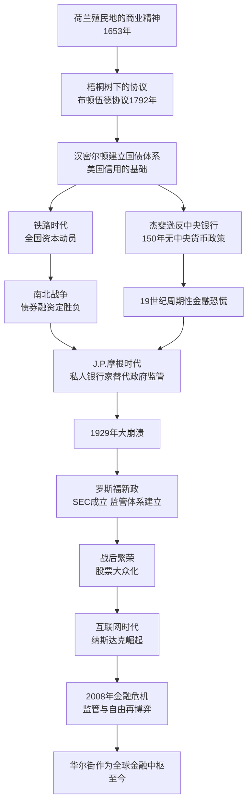

## 《伟大的博弈——华尔街金融帝国的崛起》读书笔记 
  
### 作者  
digoal  
  
### 日期  
2026-05-30 
  
### 标签  
读书笔记 , 伟大的博弈——华尔街金融帝国的崛起  
  
----  
  
## 背景 
  

---
书名: 《伟大的博弈——华尔街金融帝国的崛起（1653-2019年）》  
作者: [美] 约翰·S. 戈登（John S. Gordon）  
译者: 祁斌  
出版年份: 2019（第三版）  
出版社: 中信出版社  
笔记日期: 2025-05-30  
豆瓣链接: https://book.douban.com/subject/4012143/  
豆瓣评分: 8.3  
标签: [金融史, 华尔街, 资本市场, 美国历史, 经济史]  
---

  

> **一句话**：华尔街不只是一条街，它是人类贪婪、恐惧、创造力与制度智慧共同书写的三百年史诗。  
> **适合谁读**：对金融历史、资本市场运作感兴趣的普通读者；正在思考中国资本市场未来的从业者和政策研究者；任何想看懂"钱从哪里来、往哪里去"的人。  
> **阅读难度**：⭐⭐⭐☆☆（叙事流畅，史料扎实，无需金融专业背景）  
> **推荐指数**：⭐⭐⭐⭐☆  
  
---

## 一、时代坐标：这本书从哪里来？

1999年，戈登完成《伟大的博弈》英文原版时，正值互联网泡沫如日中天、道琼斯指数首破一万点、华尔街以从未有过的强势姿态宣告自己的全球霸权。那是一个金融极度乐观的年代，也是最需要回头看一眼历史的年代。

戈登的家族渊源决定了这本书不只是学术写作——他的祖父和外祖父双双在纽约证券交易所持有席位，他是从小听着交易所的故事长大的孩子。这本书有一种外行写不出来的"内部人视角"，同时又保持了历史学家的克制与距离。

这本书想解答的核心问题是：**华尔街究竟凭什么？**

一条原本用来抵御英国人入侵的土墙边的小街，如何在三百年内成为全球金融的神经中枢？这不是偶然的运气，背后藏着资本市场与国家兴衰之间深刻的因果逻辑。

译者祁斌的选择更赋予了这本书一重特殊意义。作为中国证监会研究中心主任、曾在华尔街投资银行工作的金融监管者，他在2005年首次将此书译介给中国读者，明确的用意是：**用美国的历史为中国的资本市场提供一面镜子**。第三版（2019年）更新至特朗普时代，并增补了数百条译者注释和数十个专栏，使之成为几乎是"双作者"共同完成的中国版本。

```
时间轴：这本书的生命

1999年 ─── 英文原版首发，恰逢互联网泡沫顶峰
  │
2005年 ─── 中文版在中国首次出版（A股市场刚走出熊市低谷）
  │
2011年 ─── 第二版，增补2008年金融危机内容
  │
2019年 ─── 第三版，更新至特朗普时代，祁斌深度增订
  │
  └── 至今已重印84次，是华尔街历史通俗读物中流传最广的版本之一
```

---

## 二、核心命题：作者在说什么？

### 命题一：资本市场是现代经济最高效的"血液循环系统"

戈登用整本书的篇幅证明一件事：华尔街并非寄生于实体经济之上的赌场，它是美国经济腾飞的主引擎之一。

无论是独立战争后的国债重组（汉密尔顿的核心贡献）、十九世纪中期横贯大陆的铁路融资，还是二十世纪初钢铁和汽车工业的资本化，再到后来英特尔、苹果、谷歌的风险投资——每一次产业升级背后，都有资本市场在发挥调配功能。

书中一个令人印象深刻的细节：美国内战期间，北方联邦政府通过华尔街债券市场为战争融资，最终以一种南方根本无力复制的方式奠定了胜局。战争打赢了，不仅是打赢了军事，也是打赢了金融。

### 命题二：监管与自由之争，是华尔街永不停息的主旋律

书中最让人感慨的线索之一，是汉密尔顿与杰斐逊之争的百年回声。

汉密尔顿主张建立强有力的中央银行体系，用政府信用为市场定锚。杰斐逊则将银行家视为道德威胁，坚决反对任何形式的中央银行。结果：杰斐逊主义者摧毁了汉密尔顿建立的美国银行，此后将近一百五十年，美国没有稳定的中央货币调控机制。代价是可见的——整个十九世纪，美国经历的金融恐慌频率远超欧洲任何国家。

但故事的另一面同样真实：正是这种监管相对宽松的环境，孕育了杰伊·古尔德、J.P.摩根、康内留斯·范德比尔特这样的"强盗资本家"，他们在道德层面令人不安，但在经济层面完成了美国铁路网络的建设和工业的整合，以一种残酷却高效的方式把事情做成了。

**这个矛盾从未被真正解决过——这才是历史真正有趣的地方。**

### 命题三：技术革命是华尔街的永动机，也是它的破坏者

全书每一个重要转折点，背后几乎都有技术变革的推动：
- 印刷机与早期报纸让金融信息开始流动
- 电报的出现让实时报价成为可能，摧毁了信息垄断
- 自动报价机（ticker）的发明让市场参与者数量爆炸式增长
- 电话、计算机、互联网……每一次技术跳跃，都重新洗牌了华尔街的权力结构

戈登的洞见在于：技术本身是中性的，但它每一次让信息更透明、交易更快速，都同时扩大了财富创造的空间，也放大了人性贪婪所能造成的破坏。

---

## 三、论证地图：作者怎么说服你的？



戈登的论证方式是**人物驱动的历史叙事**：他用一系列具体人物（汉密尔顿、杰伊·古尔德、J.P.摩根、伯纳德·巴鲁克、迈克尔·米尔肯……）作为历史的锚点，让制度变迁和市场规律通过人的故事呈现出来。

这种写法的优点是可读性极强，缺点是学术严谨性有所牺牲——《商业史评论》（Business History Review）的学术书评就指出，戈登有时过度依赖二手文献，个别史实存在谬误。但作为通俗读物，这仍是同类作品中水准相当高的一本。

---

## 四、前提假设与边界：什么情况下这不成立？

戈登的叙事建立在几个隐性假设上，值得审视：

**假设一：市场长期来看是自我纠错的。**
这是全书最核心的信念——每次崩溃之后，市场都会凭借人类的创造力和制度改进浴火重生。这在美国三百年历史中大体成立。但这一结论在其他国家（尤其是制度基础薄弱的新兴市场）是否同样适用？全书对此几乎没有讨论。

**假设二：资本主义的内在矛盾是可以管理的。**
戈登对监管改革（特别是1929年后的新政）持高度肯定态度，认为有效监管可以驯服市场野兽。但2008年的次贷危机（第三版有所涉及）说明，复杂金融工具在监管者的盲区中制造的系统性风险，可能超出任何监管体系的驾驭能力。

**假设三：华尔街的逻辑具有普世移植性。**
全书隐含的意思是：资本市场的规律是普遍的，美国的成功可以为其他国家（尤其是中国）提供借鉴。这个命题在方向上大体正确，但忽略了政治体制、文化传统、产权基础的巨大差异。把美国剧本直接套在中国身上，可能会得出错误的政策结论。

**这本书的适用边界**：它是理解资本市场历史逻辑的绝佳入门读物，但不是政策设计的操作手册。

---

## 五、思想谱系：这本书在哪个传统里？

戈登属于**辉格史学（Whig History）**的美国商业史传统——相信历史是进步的，市场化和资本主义是人类走向繁荣的必然方向。这种"胜利者叙事"给了全书一种流畅的乐观底色，但也使它在面对结构性批判时显得有些单薄。

学术评论者彼得·爱森斯塔特（Peter Eisenstadt）在《商业史评论》中指出，戈登在讨论19世纪伊利铁路丑闻时，将大部分责任推给了腐败的州政府，而对华尔街内部的自律失败着墨不多——这是全书政治立场上稍显保守的一面。

思想影响上，这本书在中国的传播意义远超西方。自2005年中文版问世，它成为许多中国金融从业者理解西方资本市场的第一块敲门砖，以及监管者反思制度建设的重要参照。在中国证监会的讨论语境里，这本书被频繁引用。

```
平行阅读谱系

《伟大的博弈》
     │
     ├── 并列·更学术: 《华尔街的历史》（Charles Geisst）
     │
     ├── 向上·宏观视野: 《这次不同寻常》（莱因哈特/罗格夫）
     │
     ├── 向下·个人视角: 《说谎者的扑克牌》（迈克尔·刘易斯）
     │
     └── 中国语境补充: 《中国资本市场发展报告》（祁斌主笔）
```

---

## 六、我学到了什么？

读完这本书，有三个认知让我觉得自己看世界的眼光变宽了。

**第一，危机本身是市场的代谢机制，不是失败的证明。**
戈登不厌其烦地描写每一次金融恐慌——1837、1873、1893、1907、1929、1987……这些数字背后是无数人的破产和痛苦，但它们又无一例外地成为市场纠错和制度升级的起点。这不是说危机是好事，而是说：对危机的恐慌往往比危机本身更具破坏性。恰恰是那些每次都"再来一场崩溃"时跑光了的人，在历史上彻底错过了长期财富的创造。

**第二，金融的核心不是数字，是信任。**
汉密尔顿最伟大的贡献，不是任何具体政策，而是他让美国政府的债务变成了全球投资者认可的信用符号。华尔街三百年的崛起史，本质上是一部信任建立史：谁能让陌生人相信"我会还钱"，谁就能调动更大规模的资源。这个逻辑放到任何层面——国家、企业、个人——都成立。

**第三，监管与自由的张力永远不会消失，也不应该消失。**
读完全书，我意识到这个争论不需要"最终答案"，它本身就是健康的民主市场社会的工作机制。汉密尔顿和杰斐逊都对了一半，也都错了一半。真正危险的，是只相信其中一种声音。

---

## 七、举一反三：这个框架还能用在哪？

**理解中国A股的困境**：中国资本市场的"散户化""政策市"等特征，在美国十九世纪初的市场中几乎都能找到对应。华尔街花了一百年才完成从"操纵横行"到"机构主导"的转型，这个时间尺度应该给我们更多耐心，也应该给我们更多紧迫感。

**理解任何一个行业的监管改革**：戈登的分析框架——"技术变革 → 新玩家进入 → 旧规则失效 → 危机爆发 → 新监管出现"——几乎可以套用在互联网平台监管、人工智能监管等任何现代问题上。

**理解大国博弈的金融维度**：书中描述的美国如何在20世纪初超越英国成为全球金融中心，是一个精彩的"金融霸权转移"案例。对照当下中美之间的金融博弈，有一种说不清道不明的历史既视感。

---

## 八、批判与反思

**最大的盲点：谁为市场的失败付出了代价？**
全书对华尔街总体上是欣赏甚至偏爱的。它对金融危机中受益者的描写远多于对受害者的刻画。1929年大萧条中，那些在街头排队领汤的失业工人，在书里只是数据和背景板。这是"精英史观"的经典局限。

**时代的局限性**：写于互联网泡沫顶峰的原版，在结尾处弥漫着一种近乎天真的乐观。九年后的2008年证明，金融衍生品的复杂度已经超越了任何个人、机构乃至监管体系的认知边界。第三版虽有增补，但原书的叙事结构已经难以容纳这场规模空前的系统性失败。

**对中国读者的警示**：祁斌在中文版中的热情推介固然出于好意，但也可能让部分读者产生一种幻觉——好像只要建立了资本市场，就自然会获得美国那样的经济奇迹。事实上，华尔街的成功依托于美国特定的产权制度、司法独立、媒体自由和政治竞争，这些才是它真正的底层操作系统，而非照单全收就能复制的软件。

---

## 九、金句与记忆点

**1. "尽管有数不清的海滩，人类依然扬帆出海。"**
> 原书结语，意指：尽管有无数次股灾，人们依然会进入市场。人类对风险的天然热爱，才是资本主义的永动机。

**2. "汉密尔顿绞尽脑汁，试图寻找到一条区分好人与恶棍的界线。"**
> 每一个时代的监管者都在面对同一个问题。两百年后，我们依然没有完美答案。

**3. "所有的金融泡沫，当人们意识到投机只是转移财富而非创造财富时，总有人会清醒过来。"**
> 这句话可以贴在任何投资者的显示器旁边。

**4. "华尔街的历史是一部关于风险、勇气、贪婪、爱国主义、权力、天才，以及偶尔令人发指的愚蠢的历史。"**
> 这是出版商给本书的腰封评语，恰好也是对整个资本主义最精准的概括。

**5. "强盗资本家的时代——每一个都令道德感到不适，但铁路网络就是他们建起来的。"**
> 用来反思"市场效率"与"道德完善"之间永恒的张力。

**6. 梧桐树协议（Buttonwood Agreement，1792年）**
> 24个纽约证券经纪人在梧桐树下签署的一页纸协议，奠定了纽约证券交易所的制度基础。所有伟大的制度，都有一个看起来微不足道的起点。

**7. 杰斐逊主义的代价**
> 因为对中央银行的意识形态仇视，美国用一百五十年的反复金融危机付出了巨大代价。偏见的成本，有时候要在几代人后才算完。

---

## 十、延伸阅读

**1. 《说谎者的扑克牌》——迈克尔·刘易斯**
从1980年代所罗门兄弟的交易员视角，看华尔街的"人"是如何运作的。与戈登的宏观视角形成完美互补，读来令人上头。

**2. 《这次不同寻常》——卡门·莱因哈特、肯尼斯·罗格夫**
用800年金融危机数据证明：历史总是重演，而人类总是相信"这次不一样"。与《伟大的博弈》的乐观叙事形成有益对话。

**3. 《汉密尔顿》——罗恩·彻诺**
《伟大的博弈》中频繁出现的汉密尔顿，在这本厚达八百页的传记里得到了完整的呈现。也是音乐剧《汉密尔顿》的原著。

**4. 《美国大城市的死与生》——简·雅各布斯**
华尔街是城市，城市是华尔街的容器。理解纽约作为商业城市的生长逻辑，理解华尔街的文化土壤。

**5. 《中国资本市场发展报告》——祁斌等**
与《伟大的博弈》配套阅读，从监管者视角理解中国资本市场的现实处境与历史使命。

---

*笔记写于 2025-05-30 | 基于公开资料与深度思考整理*
*参考来源：豆瓣读书、Goodreads、Kirkus Reviews、Business History Review（Cambridge Core）、新浪财经祁斌专栏*
  
  
#### [PostgreSQL 解决方案集合](../201706/20170601_02.md "40cff096e9ed7122c512b35d8561d9c8")
  
  
#### [德哥 / digoal's Github - 公益是一辈子的事.](https://github.com/digoal/blog/blob/master/README.md "22709685feb7cab07d30f30387f0a9ae")
  
  
#### [About 德哥](https://github.com/digoal/blog/blob/master/me/readme.md "a37735981e7704886ffd590565582dd0")
  
  

  
