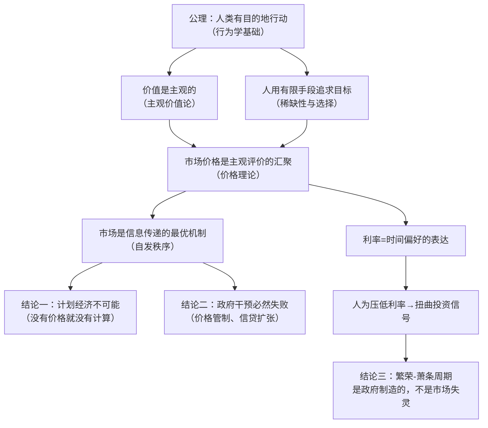

## 《奥地利学派经济学入门·米塞斯思想精要》读书笔记 
  
### 作者  
digoal  
  
### 日期  
2026-05-30 
  
### 标签  
读书笔记 , 奥地利学派经济学入门·米塞斯思想精要  
  
----  
  
## 背景 
  

---
书名: 《奥地利学派经济学入门·米塞斯思想精要》  
作者: [美] 托马斯·C.泰勒 / [美] 穆瑞·N.罗斯巴德  
译者: 杨震 / 熊越 / 李杨  
出版社: 上海财经大学出版社  
出版年份: 2017  
笔记日期: 2026-05-30  
ISBN: 9787564227708  
标签: [奥地利学派, 经济学, 米塞斯, 自由市场, 行为学, 商业周期, 主观价值论]  
---

  

> **一句话**：这是一扇门——推开它，你会发现主流经济学课本从未讲过的另一套理解世界的方式。  
> **适合谁读**：对"市场是怎么运作的"感到困惑的普通人；对凯恩斯主义有隐隐不安的读者；想读米塞斯但不知从哪里下手的人  
> **阅读难度**：⭐⭐⭐☆☆  
> **推荐指数**：⭐⭐⭐⭐☆  
  
---

## 一、时代坐标：这本书从哪里来？

20世纪初，整个西方世界都笼罩在一种乐观主义的气氛中：科学万能，计划可行，政府聪明。凯恩斯主义方兴未艾，社会主义实验正在苏联轰轰烈烈地展开，经济学家们相信，只要有足够的数据和足够聪明的官僚，人类完全可以设计出一套优于自发市场的资源配置系统。

就在这样的时代浪潮中，一个奥地利犹太人站了出来，说：**不，这从根本上就办不到。**

这个人就是路德维希·冯·米塞斯（Ludwig von Mises，1881-1973）。

米塞斯1920年发表了《社会主义共同体的经济计算》，用一个简洁而致命的论证击穿了中央计划经济的理论根基——没有市场价格，就没有经济计算，没有经济计算，资源就必然被浪费，繁荣就必然是幻觉。这场论战让他在当时声名大噪，也让他在学术主流中遭到孤立。

他的学生罗斯巴德（Murray Rothbard，1926-1995）把米塞斯的思想继承下来，并向更广泛的英语读者推广。本书正是这两人合力为入门者写就的"导论"：上半部分是泰勒的体系化教科书，下半部分是罗斯巴德亲笔写就的米塞斯传记与思想评传。

一本173页的小书，却凝结了一个流派一百五十年的核心洞见。

```
时间轴：奥地利学派的思想脉络

1871 ──── 卡尔·门格尔《国民经济学原理》，学派诞生
            │  主观价值论 + 边际效用
1912 ──── 米塞斯《货币与信用理论》，货币理论革命
            │  利率=时间偏好，信用扩张→商业周期
1920 ──── 米塞斯《经济计算》，社会主义大辩论开始
            │  "没有市场价格就没有理性计算"
1944 ──── 哈耶克《通往奴役之路》，普及化高峰
1949 ──── 米塞斯《人的行动》，行为学大厦落成
1973 ──── 米塞斯逝世；翌年哈耶克获诺贝尔奖
1982 ──── 米塞斯研究院成立，学派在美国复兴
```

---

## 二、核心命题：作者在说什么？

这本书传递的核心思想，可以归结为三个彼此关联的命题。

### 命题一：经济学的起点是「行动的人」，而不是「数据中的人」

奥地利学派的根本方法论叫做**行为学（Praxeology）**——这是米塞斯最重要的原创贡献。

他的出发点极其简单：**人类有目的地行动**。人们在行动时，是在用有限的手段去追求自己认为更好的目标。这个公理看起来平淡无奇，但米塞斯从中演绎出了整套经济学逻辑，无需借助任何统计数据或数学模型。

这与主流经济学的路径截然不同。主流经济学越来越像物理学——建模、实证、计量。而奥地利学派坚持认为，人类行动包含主观意图，无法像物理粒子一样被预测和量化。你可以测量一块石头，但你没法"测量"一个人为什么爱上某人或为什么讨厌某种税。

用今天流行的话说：奥地利学派是「质性的」，而主流经济学是「量化的」。它们争论的不只是结论，而是经济学应该是什么样的知识。

### 命题二：价值是主观的，价格是信号，市场是奇迹

奥地利学派有一个彻底颠覆直觉的洞见：**没有任何东西有客观的、内在的价值**。

古典经济学（尤其是马克思所继承的劳动价值论）认为，一件商品的价值来自于生产它所耗费的劳动时间。但门格尔和米塞斯指出：商品的价值来自于消费者对它的主观评价，来自于它能满足某种具体人类需求的能力。同一桶水，对沙漠中快渴死的人和游泳池旁的人，价值天壤之别。

正因为价值是主观的，市场价格才如此珍贵——它是无数人主观评价汇聚后的结果，是传递信息的最高效机制。任何试图用行政手段"制定合理价格"的努力，都会摧毁这个信号系统，导致资源错配。

这也解释了为什么**价格管制**（无论是租金管制还是药品价格上限）总是产生短缺：它让价格无法如实传递稀缺程度的信息。

### 命题三：经济危机不是市场的失败，而是政府干预的后果

奥地利学派的**商业周期理论（ABCT）**是它最具现实解释力的部分，也是最具争议的部分。

核心论点是：当中央银行人为压低利率、扩张信贷时，企业家会收到扭曲的信号，误以为储蓄增加、未来需求旺盛，从而过度投资于长期资本品（建筑、机械、基础设施）。这些错误投资制造了繁荣的假象——但终有一天，现实与预期的落差无法弥合，泡沫破裂，萧条来临。

这个理论在1929年大萧条前已由米塞斯提出，哈耶克将其进一步发展，并因此在1974年获得诺贝尔经济学奖。2008年金融危机之后，很多人重新翻出这个理论，发现它对那场危机的解释力相当惊人：长达十年的低利率政策，精确地制造了一场房地产和金融资产泡沫。

---

## 三、论证地图：作者怎么说服你的？



泰勒的论证方式有个鲜明特点：他不从历史数据出发，而是从**逻辑推演**出发。整本书的结构就是一步步从「人的行动」这个公理，推导出市场如何运作、价格如何形成、周期为何出现。

这既是奥地利学派的优势，也是它的软肋。优势在于结论不依赖于任何特定数据集，不会因为统计方法的争议而动摇；软肋在于，批评者可以质疑公理本身的前提是否合理，而推演过程中的每一步也都可能存在逻辑跳跃。

---

## 四、前提假设与边界：什么情况下这不成立？

奥地利学派的整栋理论大厦，建立在几个核心假设上。值得诚实地审视它们。

**假设一：人类行动都是理性、有目的的。**
这个前提在大多数经济决策中是成立的，但行为经济学的研究表明，人类存在大量系统性的认知偏误——过度自信、锚定效应、损失厌恶。米塞斯的「行为学」能否容纳这些发现？他的支持者会说，"有目的地行动"并不要求行动一定正确，错误的决策也是一种有目的的选择。这个辩护并非没有道理，但多少有些circular reasoning的味道。

**假设二：市场价格是最优信息机制，没有替代品。**
米塞斯的经济计算论证在苏联式的集中计划经济下显然成立。但今天的算力已经远超米塞斯时代的想象。一些经济学家认为，在足够强大的计算能力和数据收集能力下，某种"计算性计划"或许并非全然不可能。这场争论在AI时代重新变得有趣——米塞斯的回答会是：问题不在于计算能力，而在于知识本身是分散的、隐性的、不可转移的，算法永远无法替代价格机制。

**假设三：商业周期主要由货币扰动驱动。**
ABCT是一个极具说服力的框架，但它似乎对非货币因素（技术冲击、外部需求冲击、自然灾害）的解释力较弱。2008年危机之后，奥派经济学家预测量化宽松将导致恶性通胀，结果很长一段时间内并未出现（至少在消费品层面）。奥派的解释是通胀流向了资产市场，但这个辩护被一些主流经济学家视为"事后诸葛亮"。

---

## 五、思想谱系：这本书在哪个传统里？

```
古典自由主义传统（洛克、休谟、亚当·斯密）
        │
        ▼
奥地利学派第一代：卡尔·门格尔（1871）
——颠覆劳动价值论，确立主观价值论与边际效用
        │
        ▼
第二代：庞巴维克（资本与利息）、门格尔的同代人维塞尔
        │
        ▼
第三代：路德维希·冯·米塞斯（1881-1973）
——行为学体系、货币理论、社会主义不可能性
        │
    ┌───┴───┐
    ▼           ▼
哈耶克          罗斯巴德
（知识与       （自然法传统+
自发秩序）      无政府资本主义）
    │               │
    ▼               ▼
公共选择学派        米塞斯研究院
（布坎南）          自由意志主义运动
```

米塞斯在思想史上的位置颇为尴尬：他比任何人都更彻底地捍卫自由市场，却从未获得诺贝尔经济学奖（他1973年去世，翌年哈耶克获奖）；他的弟子罗斯巴德甚至比他更激进，直接否定了国家存在的合法性。

这个学派始终处于主流学术的边缘。原因之一是它拒绝数学化——在经济学越来越需要发表实证论文的年代，这是一个巨大的职业代价。原因之二是它的政治含义过于彻底：如果逻辑链条走完，最终会到达"绝大多数政府干预都是有害的"这个结论，这在任何时代都会让人不舒服。

---

## 六、我学到了什么？

读这本书，对我冲击最大的是它改变了我看"价格"这件事的方式。

在此之前，我大概默认价格是一个平凡的经济变量，可以被调节、可以被管制、可以被"优化"。但奥地利学派让我意识到：**价格是一种语言**。它在用我们从未直接见过的方式，把几十亿人的主观评价浓缩成一个数字，实时传递给所有的生产者和消费者。摧毁这个语言，就是让经济陷入失语状态。

第二个收获是关于商业周期的解读方式。我以前理所当然地接受了"萧条是市场失灵"的叙事，政府需要出手干预。奥地利学派提供了一个完全相反的框架：**萧条是对之前错误的纠正，是市场在自我修复**。人为延缓这个纠正过程（比如用财政刺激维持僵尸企业），只会拖延痛苦，不会消除它。

第三个收获，也是最让我不舒服的：奥地利学派是真正意义上的"结果不可知"的自由主义。它不保证市场一定会带来公平或幸福，它只是说，任何试图用强制性手段改善它的努力都会带来意想不到的后果。这是一种令人抑郁但也令人清醒的谦逊。

---

## 七、举一反三：这个框架还能用在哪？

奥地利学派的核心方法论——**从个体行动出发，分析意外后果**——其实远比经济学本身适用范围更广。

**场景一：组织管理**。任何大公司都会面临"内部计划"的问题：总部如何决定资源在各部门之间的分配？奥地利学派的洞见告诉我们，总部的信息永远是不完整的，分散决策（给予一线团队更大自主权）几乎总是优于集中决策。亚马逊的"两个比萨团队"原则，本质上是一种奥地利式的组织哲学。

**场景二：政策分析**。每当你看到一项政府干预政策（最低工资、房租管制、行业补贴），都可以用奥地利框架问一个问题："这项政策摧毁了哪些价格信号？它会带来哪些它的支持者没有预料到的后果？"通常，答案会让你对政策效果更加审慎。

**场景三：个人决策**。时间偏好理论——你愿意为了未来的更大收益放弃多少当下的享受——是理解储蓄、投资乃至人生选择的一把钥匙。低时间偏好的人往往更能积累财富和能力；高时间偏好的人活在当下，但代价是未来的资本匮乏。

---

## 八、批判与反思

我愿意对这本书，以及它背后的整个奥地利学派，提出几点真实的保留意见。

**第一，它的「不可证伪性」是个问题**。当主流经济学家要求用数据来验证商业周期理论时，奥地利学派往往以"经济学是演绎科学，不是实证科学"来回避。这个立场在哲学上有其合理性，但在实践中，一个永远无法被数据证伪的理论，也是一个很难从中学习的理论。

**第二，它对分配问题几乎没有回答**。奥地利学派能很好地解释效率，但对"市场带来的结果是否公平"这个问题，它的回答基本上是"公平不是一个有意义的经济学概念"。这让它在面对不平等加剧、财富集中的时代时，显得有些苍白。

**第三，米塞斯本人有一种令人不快的确定性**。罗斯巴德在书中的传记部分写得有情有义，但读者也会感受到：米塞斯是一个极难合作的人，他与哈耶克的分歧、他对任何妥协的拒绝，有时候让人觉得，这个学派的「圈地自守」，有一部分是自己造成的。一个豆瓣读者说得很准：「奥地利学派一大问题在于所有学者都一副我这就是真理你们爱信不信的嘴脸，不肯低下头写教科书。」这本书的出现，正是对这个问题的一次有限修正。

---

## 九、金句与记忆点

**1. "如今活跃于世的'奥地利学派'，几乎完全集中在美国，基本上就是米塞斯学派。"**
——哈耶克
> 米塞斯逃离纳粹欧洲后，在美国重建了这个学派。历史的讽刺在于：一个最反对政府干预的学派，靠着在「新世界」的流亡完成了自我延续。

**2. 价格是一种语言，而不是一个可以任意设定的数字。**
> 这个比喻是我读这本书最大的收获。摧毁价格，就像把一个社会的语言能力摧毁——它还活着，但无法沟通，无法协调。

**3. 行为学公理：人类有目的地行动（Human Action is purposeful behavior）。**
> 整套奥地利经济学从这一句话出发。简洁到让人觉得：就这？但从这一句话可以推导出的结论，足以填满厚达一千页的《人的行动》。

**4. 社会主义不可能性：没有市场价格，就没有理性的经济计算。**
> 这是米塞斯最锋利的一把刀。它不说社会主义"效率低"，它说社会主义在逻辑上"不可能"实现资源的理性配置。这两者的差别，是"你跑得慢"和"你根本没有腿"的差别。

**5. 商业周期是人为制造的，不是市场固有的。**
> 这个命题在2008年之后重新引发了广泛讨论。当美联储用量化宽松救了金融系统之后，随之而来的十年股市牛市和随后的通胀，是奥地利学派预言的精确验证，还是巧合？争论还在继续。

**6. 时间偏好：你愿意为了未来而放弃多少现在。**
> 这是一个比储蓄率更有哲学深度的概念。文明本质上是一个降低时间偏好的过程：人类愿意等待更长时间来获得更大的回报，这使得资本积累成为可能，使得文明成为可能。

**7. 市场价格是分散知识的汇聚，任何中央机构都无法复制这个过程。**
> 这是哈耶克的贡献，但根植于米塞斯的框架。一个计划委员会，哪怕配备最强的AI，永远无法知道某个偏远村庄里一个消费者此刻最想要什么——但市场的价格信号可以。

---

## 十、延伸阅读

**1. 《国富论》 ——亚当·斯密**
读奥地利学派，必须先知道它从哪里来。斯密的自发秩序概念是整个自由市场传统的源头，奥地利学派是它最彻底的继承人之一。

**2. 《人的行动》 ——路德维希·冯·米塞斯**
这本书是米塞斯思想的完整展开，厚达一千页，但如果你被本书点燃了兴趣，这是你迟早需要面对的原典。警告：它的阅读密度极高。

**3. 《通往奴役之路》 ——弗里德里希·哈耶克**
比《人的行动》更易读，也更具政治冲击力。哈耶克将奥地利学派的逻辑推向政治哲学，指出计划经济与个人自由在根本上是不兼容的。1944年出版，至今仍有烫手的现实感。

**4. 《价格与生产》 ——弗里德里希·哈耶克**
专注于商业周期理论，是读懂ABCT的经典文本，与本书的第七章可以对照阅读。

**5. 《人、经济与国家》 ——穆瑞·罗斯巴德**
罗斯巴德自己的代表作，被誉为「米塞斯《人的行动》的系统化重述与扩展」。如果你读了本书的下半部分，对罗斯巴德产生了兴趣，这是他的思想结晶。

---

*笔记写于 2026-05-30 | 基于公开资料、学术文献与深度思考整理*
*本笔记力图客观呈现奥地利学派的核心观点，批评与保留意见属于笔记作者的个人立场，不代表对该学派的全面否定*
  
  
#### [PostgreSQL 解决方案集合](../201706/20170601_02.md "40cff096e9ed7122c512b35d8561d9c8")
  
  
#### [德哥 / digoal's Github - 公益是一辈子的事.](https://github.com/digoal/blog/blob/master/README.md "22709685feb7cab07d30f30387f0a9ae")
  
  
#### [About 德哥](https://github.com/digoal/blog/blob/master/me/readme.md "a37735981e7704886ffd590565582dd0")
  
  

  
