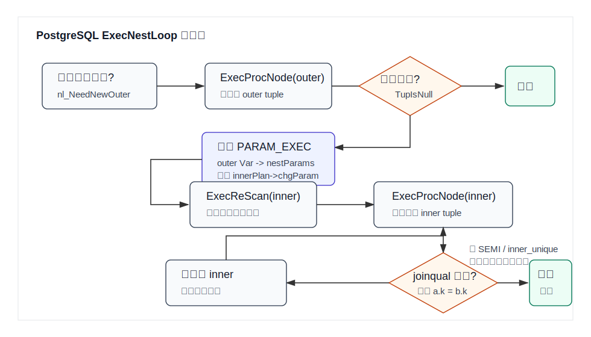
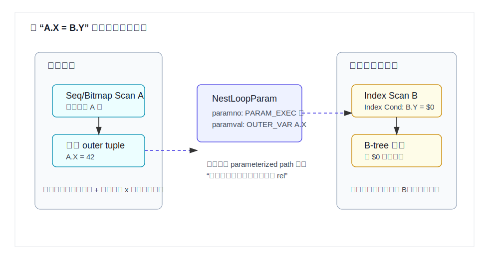
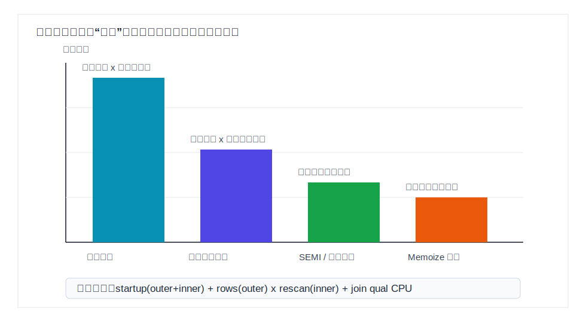
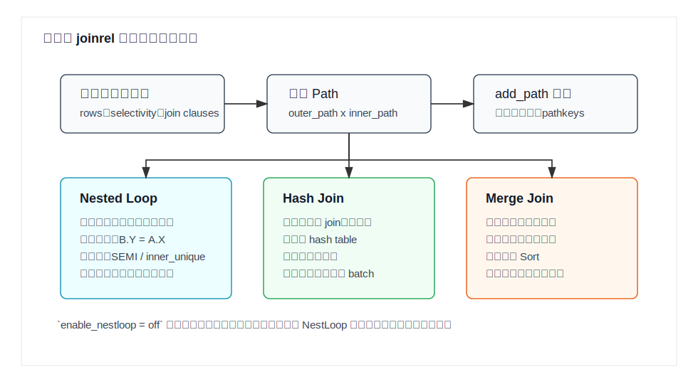
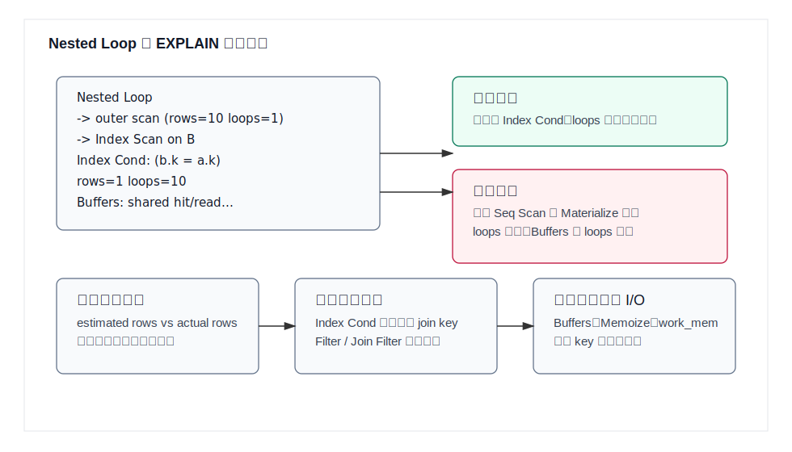

## 数据库筑基课 - nestloop join

### 作者
digoal

### 日期
2026-05-30

### 标签
PostgreSQL , 应用开发者 , 数据库筑基课 , 执行算法 , 优化器 , Join , Nested Loop

----

## 背景
  


数据库筑基课大纲在当前项目中未找到可引用文件，因此本文按“扫描/执行算法”独立成篇。本文以 PostgreSQL 本地源码、官方文档和 DeepWiki 对 `postgres/postgres` 的架构摘要为主。用户给出的三篇资料 `Access Path Selection in a Relational Database Management System`、`Asynchronous Index Lookups for Nested Loop Joins`、`Vectorized Inner-Loop Joins on Modern Processors` 在当前项目中没有原文文件；本文只把它们作为概念参照：System R 时代已经把 join 方法放进访问路径成本选择，异步索引查找关注高延迟内表探测的流水化，向量化 inner-loop join 关注现代 CPU 上批量执行与 cache/SIMD 友好性。本文不引用无法本地核验的实验数字。

Nested Loop Join 很容易被误解成“最笨的双重循环”。这个理解只对了一半。朴素双重循环确实可能是：

```text
for each row in A:
    for each row in B:
        test A.key = B.key
```

但 PostgreSQL 里的 NestLoop 更重要的工程价值是：**把外表当前行的值传给内表路径，让内表用索引、参数化子查询、Memoize 或其他可重扫节点快速找匹配行**。如果外表很小、内表有合适索引，它往往是最强路径；如果外表行数被低估、内表每次都全扫，它会把错误放大成灾难。

## 一、它解决什么问题？

Join 的本质是把两个输入中满足条件的行组合起来。问题在于，数据库不可能只问“语义上怎么 join”，还必须问“先读谁、怎么读、每读一行要付出多少代价”。

对下面的查询：

```sql
SELECT *
FROM orders o
JOIN customers c ON c.id = o.customer_id
WHERE c.region = 'CN';
```

如果 `customers` 经过过滤后只有几十行，而 `orders.customer_id` 上有索引，最自然的执行方式不是扫描全部 `orders`，而是：

1. 先找出 `region = 'CN'` 的客户。
2. 对每个客户 id，去 `orders_customer_id_idx` 里查对应订单。
3. 把查到的订单和当前客户行组合返回。

这就是 Nested Loop 的优势区间：**把“大表全量处理”转化成“少量外表行驱动的大表定点查找”**。

它牺牲的是稳定性。Hash Join 更像批处理：先构建 hash table，再扫另一边；Merge Join 更像有序流合并；Nested Loop 则依赖外表行数、内表单次重扫成本、缓存命中、重复 key 和索引选择率。一旦估算错，它会按外表行数倍数放大内表成本。

## 二、它是什么？

Nested Loop Join 是一种以一个输入作为 outer，以另一个输入作为 inner 的 join 执行方法。执行器从 outer 取一行，然后反复从 inner 取匹配行；inner 耗尽后，再取下一行 outer，并重扫 inner。

在 PostgreSQL 中，它对应：

| 层次 | 关键结构或函数 | 作用 |
|---|---|---|
| 路径层 | `NestPath` | 优化器中的候选 nested loop join path |
| 成本层 | `initial_cost_nestloop()` / `final_cost_nestloop()` | 估算启动成本、重扫成本、CPU 成本和早停收益 |
| 计划层 | `NestLoop` / `NestLoopParam` | 记录 join 子计划和需要传给 inner 的参数 |
| 执行层 | `ExecNestLoop()` | 驱动 outer、设置 `PARAM_EXEC`、重扫 inner、检查谓词 |
| 参数机制 | `PARAM_EXEC` | 执行器内部参数槽，用于 outer 到 inner 的运行期传值 |

`NestLoop` 支持的 join 类型不是全部 join 类型。源码 `joinpath.c:match_unsorted_outer()` 明确限制 NestLoop 支持 inner、left、semi、anti join；right、right anti、full join 不能用普通 NestLoop 实现。

## 三、核心原理

### 3.1 执行器：outer 行驱动 inner 重扫

PostgreSQL 的核心执行逻辑在 `src/backend/executor/nodeNestloop.c:ExecNestLoop()`。它的主循环可以概括为：

```text
如果需要新 outer 行:
    outerTuple = ExecProcNode(outerPlan)
    如果 outer 耗尽: 结束
    把 outerTuple 放入表达式上下文
    如果有 nestParams:
        从 outerTuple 提取值
        写入 PARAM_EXEC 槽
        标记 innerPlan->chgParam
    ExecReScan(innerPlan)

innerTuple = ExecProcNode(innerPlan)
如果 inner 耗尽:
    对 LEFT/ANTI join 处理 null-extended 行
    切换到下一行 outer

如果 joinqual 通过:
    标记当前 outer 已匹配
    对 ANTI join 不返回匹配行
    对 SEMI 或 inner_unique 命中首行后切换到下一行 outer
    如果 otherqual 通过: 投影并返回
```



图 1 说明：读者要重点看两条路径。第一条是普通循环：outer 取一行，inner 从头或按参数重扫，找到满足 `joinqual` 的组合后返回。第二条是参数路径：`NestLoopParam` 把 outer 当前值写进 `PARAM_EXEC` 槽，inner 的索引扫描把这个运行期值当常量使用。

这里有三个容易忽略的细节：

1. `joinqual` 和 `otherqual` 分工不同。`joinqual` 决定 outer 是否算“匹配过”，这影响 left/anti/semi join 语义；`otherqual` 是最终返回前仍需检查的过滤条件。
2. `ExecReScanNestLoop()` 不会主动重扫 inner。源码注释明确说 inner 会在每个新 outer tuple 时重扫；如果在 rescan nestloop 时提前重扫 inner，会破坏带运行期 key 的 inner index scan。
3. `single_match` 来自 `inner_unique` 或 `JOIN_SEMI`。一旦命中首个 inner 行，执行器可以切到下一行 outer。

### 3.2 参数化路径：NestLoop 的真正杀伤力

PostgreSQL 优化器 README 用 `A.X = B.Y` 举了一个关键例子。朴素计划是：

```text
NestLoop
  -> Seq Scan on A
  -> Seq Scan on B
       Filter: A.X = B.Y
```

如果 A 很小、B 很大，而且 B.Y 上有索引，更好的计划是：

```text
NestLoop
  -> Seq Scan on A
  -> Index Scan using B_Y_IDX on B
       Index Cond: B.Y = A.X
```

第二个计划的关键不是“用了 NestLoop”，而是 inner path 被参数化了。每拿到一行 A，`A.X` 都会作为运行期参数传给 B 的 index scan。



图 2 说明：`Path` 的 `param_info` 记录这个路径依赖哪些外部关系；计划生成阶段会把 inner 表达式中的外表变量替换成 `PARAM_EXEC`；执行阶段由 `NestLoopParam` 把 outer 当前行的值填进去。这样，`B.Y = A.X` 对一次 inner scan 来说就变成了 `B.Y = 常量`。

相关源码主线如下：

| 阶段 | 源码 | 要点 |
|---|---|---|
| 生成候选 join path | `optimizer/path/joinpath.c:try_nestloop_path()` | 检查参数化是否合法，调用成本估算，再提交 `NestPath` |
| 枚举 inner 参数化路径 | `match_unsorted_outer()` | 对每个 outer path，考虑 inner 的 `cheapest_parameterized_paths` |
| 替换外表变量 | `optimizer/plan/createplan.c:replace_nestloop_params()` | 把 inner 表达式中来自 outer 的 `Var`/`PlaceHolderVar` 替换成 `Param` |
| 分配参数槽 | `optimizer/util/paramassign.c:replace_nestloop_param_var()` | 分配 `PARAM_EXEC` id，并加入 `root->curOuterParams` |
| 绑定当前 NestLoop | `identify_current_nestloop_params()` | 找出由当前 NestLoop 左侧能提供的参数 |
| 执行期传值 | `executor/nodeNestloop.c:ExecNestLoop()` | 从 outer tuple 取值，写入 `ecxt_param_exec_vals[paramno]` |

`src/include/nodes/pathnodes.h` 对 `PARAM_EXEC` 的注释非常直接：它可以从 NestLoop 节点传值到 inner relation，尤其用于 inner scan 被 outer 值参数化的场景。

### 3.3 代价模型：外表行数乘以内表重扫成本

Nested Loop 的简化成本形状是：

```text
startup_cost =
    startup(outer) + startup(inner)

run_cost =
    run(outer)
  + rows(outer) * rescan_cost(inner)
  + join_qual_cpu
```

PostgreSQL 实现分两阶段：

1. `initial_cost_nestloop()` 做快速下界估算，用于 `add_path_precheck()` 提前淘汰明显差的路径。它主要计算 outer/inner 启动成本、outer 运行成本、inner 重扫成本。
2. `final_cost_nestloop()` 做完整估算，补上 join qual CPU 成本、输出行数，以及 semi/anti/inner_unique 早停下的内表扫描比例。

普通 inner join 的最坏形态是每个 outer 行都把 inner 扫完。semi/anti join 或 `inner_unique` 场景不同：执行器找到首个匹配后就能停，因此成本模型会估计 inner scan fraction。若 inner path 是用全部 join quals 做索引条件的 index scan，未匹配 outer 行也被认为相对便宜，因为一次查空索引通常不需要扫完整 inner。



图 3 说明：Nested Loop 的性能差异主要来自 inner 单次重扫成本。内表全扫会被 outer 行数放大；内表索引扫描把单次成本压低；semi/unique join 可以早停；如果 outer 有大量重复参数且可用 `Memoize`，重复查找还能被缓存吸收。

### 3.4 Memoize：重复参数的缓存层

PostgreSQL 的 `joinpath.c:get_memoize_path()` 会在部分 Nested Loop 场景下尝试给 inner path 加 `Memoize`。它的目标不是改变 join 语义，而是缓存“某组参数对应的 inner 结果”。当 outer 有大量重复 key 时：

```text
outer key: 42, 42, 42, 99, 42
```

没有 Memoize 时，inner index scan 可能重复查 `42`。有 Memoize 时，第一次查到的结果可复用。

但 Memoize 不是无条件可用。源码会检查：

- 是否有可哈希的参数表达式和操作符；
- inner 目标列表、限制条件、参数化条件中是否含 volatile 函数；
- semi/anti/unique join 下是否能正确判定缓存条目完整；
- 预估调用次数、不同参数值数量和缓存命中收益。

实践上，看到 `Nested Loop -> Memoize -> Index Scan` 通常说明优化器认为 outer 参数会重复，缓存能降低内表重扫成本。

### 3.5 优化器选择：不是只在三个 join 名字里投票

PostgreSQL 会为同一个 join relation 生成多种 path：Nested Loop、Hash Join、Merge Join，以及它们的不同 outer/inner 顺序、排序、物化、参数化、并行变体。`joinpath.c:match_unsorted_outer()` 注释说，对于每个可用 outer path，优化器总会生成 Nested Loop path；inner 侧可能选择 cheapest-total path、materialize 后的 path、cheapest-startup path、cheapest inner indexscan path 等。



图 4 说明：优化器不是先选 join 方法再想访问路径，而是在 path 空间里竞争。Nested Loop 的强项是参数化 inner path；Hash Join 的强项是大批量等值连接；Merge Join 的强项是已有排序或需要有序输出。`enable_nestloop = off` 只能劝退 Nested Loop，不能完全禁止，因为某些参数化或语义场景没有等价替代。

## 四、横向对比

| 维度 | Nested Loop | Hash Join | Merge Join |
|---|---|---|---|
| 主要目标 | 少量 outer 行驱动 inner 快速查找 | 大批量等值 join | 两边有序流合并 |
| 前提条件 | inner 可重扫；最好可参数化索引扫描 | 通常需要等值条件；build 侧能放入内存更好 | join key 可排序；输入已有序或可接受排序成本 |
| 启动成本 | 低，可较早返回首行 | 需要先构建 hash table | 若需排序，启动成本较高 |
| 总成本形状 | `outer rows x inner rescan` | build + probe | sort/scan + merge |
| 索引价值 | 内表索引价值极高 | 索引通常不是核心 | 索引可提供有序输入 |
| 内存压力 | 通常较低；Memoize/Materialize 会用内存 | hash table 可能受 `work_mem` 影响 | sort 可能受 `work_mem` 影响 |
| 早停能力 | `LIMIT`、SEMI、inner_unique 场景很强 | 通常偏批处理 | 可随有序流推进，部分场景可提前结束 |
| 典型风险 | 外表行数低估导致内表重扫爆炸 | build 侧估错导致 batch 或溢出 | 排序成本高，重复键处理复杂 |
| 适合场景 | 点查、OLTP、外表小、LATERAL、相关子查询 | 大表等值连接、无合适索引 | 报表、范围、有序输出、两边已有索引顺序 |

这个表背后的原因是“数据流形态”不同。Nested Loop 是 demand-driven：上层要一行，它就推进 outer/inner 找一行；Hash Join 是批处理：先准备 build 侧结构；Merge Join 是有序流：排序或索引顺序越自然，越有优势。

## 五、效果如何？

Nested Loop 的收益主要有四类：

1. **首行延迟低**：只要 outer 能快出行、inner 能快查，就可以很快返回第一批结果。
2. **能利用相关值索引查找**：参数化 inner index scan 是 Hash/Merge 无法直接替代的能力。
3. **适合选择率极低的 OLTP 查询**：例如从小表/临时结果/主键集合驱动大表索引点查。
4. **适合 early-out 语义**：`EXISTS`、semi join、anti join、唯一 inner join、`LIMIT` 上层短路。

代价也很明确：

1. **外表行数越大越危险**：内表单次成本再低，被百万 outer 行乘起来也可能很高。
2. **内表没有有效索引时风险极高**：`Nested Loop -> Seq Scan` 的 inner 如果 loops 很大，通常是事故信号。
3. **随机 I/O 和缓存 miss 可能被放大**：内表索引查找如果每次打到不同 heap page，Buffer 和 CPU cache 压力都会上升。
4. **估算错误会级联**：统计信息低估 outer 行数、低估 inner 每次返回行数、低估 filter 代价，都会把计划推向错误方向。
5. **不天然向量化**：传统 tuple-at-a-time inner loop 对现代 CPU 不够友好，这也是向量化 inner-loop join 论文关心的问题。PostgreSQL 当前主执行器仍以 tuple slot 驱动为主，并非 DuckDB 那类全链路向量化执行器。

## 六、实操 DEMO

以下 SQL 是可复制的最小实验。本文未在本地启动 PostgreSQL 实例执行，因此不提供伪造的 `EXPLAIN ANALYZE` 输出。读者可以在 PostgreSQL 中执行，并重点观察 `Nested Loop`、inner 节点的 `loops`、`Index Cond`、`Buffers` 和估算/实际行数偏差。

### 6.1 小外表 + 内表索引：健康的 Nested Loop

```sql
DROP TABLE IF EXISTS demo_customer;
DROP TABLE IF EXISTS demo_order;

CREATE TABLE demo_customer (
    id bigint PRIMARY KEY,
    region text NOT NULL
);

CREATE TABLE demo_order (
    id bigint PRIMARY KEY,
    customer_id bigint NOT NULL,
    amount numeric NOT NULL
);

INSERT INTO demo_customer
SELECT g, CASE WHEN g <= 100 THEN 'CN' ELSE 'US' END
FROM generate_series(1, 10000) AS g;

INSERT INTO demo_order
SELECT g, (g % 10000) + 1, (random() * 1000)::numeric
FROM generate_series(1, 1000000) AS g;

CREATE INDEX demo_order_customer_id_idx ON demo_order(customer_id);
CREATE INDEX demo_customer_region_idx ON demo_customer(region);
ANALYZE demo_customer;
ANALYZE demo_order;

SET enable_hashjoin = off;
SET enable_mergejoin = off;

EXPLAIN (ANALYZE, BUFFERS)
SELECT c.id, o.id, o.amount
FROM demo_customer c
JOIN demo_order o ON o.customer_id = c.id
WHERE c.region = 'CN';

RESET enable_hashjoin;
RESET enable_mergejoin;
```

健康计划通常具备这些特征：

- outer 是 `demo_customer` 上的小结果集；
- inner 是 `Index Scan` 或 `Bitmap Heap Scan`，并且有 `Index Cond: (customer_id = c.id)`；
- inner 节点 `loops` 约等于 outer 实际行数；
- inner 每次返回行数接近估算；
- `Buffers` 没有随 loops 出现异常放大。

### 6.2 禁用内表索引：观察成本放大

```sql
DROP INDEX IF EXISTS demo_order_customer_id_idx;
ANALYZE demo_order;

SET enable_hashjoin = off;
SET enable_mergejoin = off;

EXPLAIN (ANALYZE, BUFFERS)
SELECT c.id, o.id, o.amount
FROM demo_customer c
JOIN demo_order o ON o.customer_id = c.id
WHERE c.region = 'CN';

RESET enable_hashjoin;
RESET enable_mergejoin;
```

如果这时仍出现 `Nested Loop`，inner 可能变成 `Seq Scan on demo_order` 并且 loops 很高。这个实验用来说明：Nested Loop 并不自动快；它需要便宜的 inner 重扫。

### 6.3 EXISTS：观察 semi join 早停

```sql
CREATE INDEX IF NOT EXISTS demo_order_customer_id_idx ON demo_order(customer_id);
ANALYZE demo_order;

EXPLAIN (ANALYZE, BUFFERS)
SELECT c.id
FROM demo_customer c
WHERE c.region = 'CN'
  AND EXISTS (
      SELECT 1
      FROM demo_order o
      WHERE o.customer_id = c.id
  );
```

`EXISTS` 可以被规划成 semi join。若使用 Nested Loop，执行器找到第一条匹配 inner 行后就可以停止当前 inner scan。这对应源码里的 `single_match` 行为。



图 5 说明：诊断 Nested Loop 时不要只看节点名字。重点看 inner 节点的 `loops` 是否等于 outer 行数、inner 是否有有效 `Index Cond`、`Rows Removed by Filter` 是否过大、`Buffers` 是否随 loops 爆炸，以及估算行数和实际行数是否严重偏离。

## 七、最佳实践

### 面向数据库架构师

1. 把 Nested Loop 看成“低延迟点查 join”能力，而不是通用大表 join 默认方案。需要支撑这种能力时，schema 要提供可参数化的内表索引，例如外键列、业务查询键、多列组合键。
2. 为高频 join 设计索引时，优先从查询形态出发：外表过滤条件决定 outer 行数，join key 决定 inner index cond，投影列和排序决定是否需要覆盖索引或复合索引顺序。
3. 对星型模型要特别谨慎。多个小维表驱动大事实表时，Nested Loop + 参数化索引可能很好；但如果维表过滤结果变大，Hash Join 或 Bitmap/Hash 方案可能更稳定。

### 面向 DBA

1. 诊断慢 SQL 时先看 `EXPLAIN (ANALYZE, BUFFERS)` 的 `loops`。inner 节点的真实总处理量大致是 `actual rows x loops`，时间也要乘 loops 理解。
2. 如果 Nested Loop 选错，优先检查统计信息：`ANALYZE` 是否及时，相关列是否需要 extended statistics，外表过滤条件是否被低估。
3. 不要把 `SET enable_nestloop = off` 当长期修复。它适合验证“如果不用 Nested Loop 会怎样”，长期修复应回到索引、统计信息、SQL 形态和成本参数。
4. 关注 `Memoize`。如果 outer 有重复 key，却没有 Memoize，可能是参数不可哈希、volatile 函数、估算不支持或版本/配置限制。
5. 对 OLTP 系统，Nested Loop 慢常常不是单条 SQL 的问题，而是热点索引页、缓存容量、随机 I/O、连接池并发一起放大。

### 面向业务开发者

1. 写 SQL 时尽量让 join key 清晰可下推，例如 `o.customer_id = c.id`，避免把 join key 包在函数或隐式类型转换里导致索引不可用。
2. 小集合驱动大表点查时，可以接受 Nested Loop；大集合 join 大表时，不要强行用循环式应用查询替代数据库 join。
3. `EXISTS` 比 `COUNT(*) > 0` 更能表达“找到一个即可”的语义，优化器更容易使用 semi join 早停。
4. 批量查询不要在应用层 N 次单点 SQL 循环访问数据库。数据库内的 Nested Loop 至少还能统一优化、复用 buffer、使用 Memoize；应用层循环会额外放大网络往返。

## 八、适合与不适合场景

适合：

- outer 结果集小，inner 有高选择率索引。
- `LIMIT`、分页首屏、交互式查询等重视首行延迟的场景。
- `EXISTS` / `NOT EXISTS` / semi / anti join，可早停。
- LATERAL 子查询或相关子查询，inner 天然依赖 outer 当前行。
- outer 有重复 key，且可通过 Memoize 缓存 inner 结果。
- OLTP 主键/外键查询、点查、少量客户/订单/权限记录关联。

不适合：

- 两边都是大结果集，且没有选择性强的 inner 索引。
- inner 侧只能 Seq Scan，outer 行数又不小。
- 统计信息长期失真，outer 行数经常被低估。
- join 条件复杂到不能下推为 inner index cond，只能在 Join Filter 里大量过滤。
- 需要批量吞吐优先的大分析查询，Hash Join 或 Merge Join 更稳定。
- inner 查找高延迟且缺少异步/pipeline 能力时。异步索引查找论文关注的正是这个边界：如何避免每次 inner lookup 串行等待。

## 九、常见坑

1. **只看 Nested Loop 节点，不看 inner loops。**  
   Nested Loop 本身不是问题；`inner Seq Scan loops=100000` 才是问题。

2. **把 `enable_nestloop = off` 当成优化。**  
   PostgreSQL 文档说明这个参数只能 discourages planner，无法完全 suppress Nested Loop。它适合作诊断，不适合作业务默认配置。

3. **忽略 Join Filter。**  
   `Index Cond` 能降低 inner 候选集；`Join Filter` 只能在组合后过滤。如果大量行在 Join Filter 被移除，说明真正的 join 条件没有有效进入内表访问路径。

4. **统计信息低估 outer 行数。**  
   Nested Loop 的成本以 outer 行数为乘数。外表从估算 10 行变成实际 10 万行，计划质量会完全变样。

5. **类型不一致导致索引不可用。**  
   例如 bigint join text、collation 不一致、表达式包裹列、隐式转换落在索引列一侧，都可能破坏内表 index cond。

6. **误读 EXPLAIN ANALYZE 的时间。**  
   PostgreSQL 文档说明，子节点执行多次时，`actual time` 和 `rows` 是每次执行的平均值；要乘以 `loops` 才能理解总量。

7. **忽略 inner_unique。**  
   如果数据库能证明 inner 对每个 outer 最多一行匹配，Nested Loop 可以首个命中后停止。唯一约束、主键、合理 join 条件会直接影响成本和执行。

8. **用应用层循环替代数据库 join。**  
   应用循环也叫 nested loop，但它失去了优化器、buffer locality、事务一致性和批量执行机会，通常更差。

## 十、扩展问题

1. 为什么参数化路径通常只能作为 Nested Loop 的 inner 侧使用？Hash Join 和 Merge Join 如果要消费这种路径，会遇到什么语义和成本问题？
2. 如果 outer 行数很大但 key 高度重复，`Memoize` 与 Hash Join 谁更可能胜出？需要哪些统计信息才能估得准？
3. 对列存向量化引擎，Nested Loop 的“逐行传参”会造成哪些 CPU 和 cache 问题？向量化 inner-loop join 会如何改写执行形态？
4. 在远程表、FDW 或分布式数据库中，inner lookup 的网络往返会怎样改变 Nested Loop 成本模型？异步索引查找能解决哪一部分问题？
5. 为什么 `EXISTS` 的语义比 `COUNT(*) > 0` 更容易触发早停？两者在并发可见性和执行计划上有什么差异？

## 十一、扩展阅读

- PostgreSQL 源码：`src/backend/executor/nodeNestloop.c`，`ExecNestLoop()`、`ExecInitNestLoop()`、`ExecReScanNestLoop()`。
- PostgreSQL 源码：`src/backend/optimizer/path/joinpath.c`，`try_nestloop_path()`、`match_unsorted_outer()`、`get_memoize_path()`。
- PostgreSQL 源码：`src/backend/optimizer/path/costsize.c`，`initial_cost_nestloop()`、`final_cost_nestloop()`。
- PostgreSQL 源码：`src/backend/optimizer/plan/createplan.c`，`create_nestloop_plan()`、`replace_nestloop_params()`、`make_nestloop()`。
- PostgreSQL 源码：`src/backend/optimizer/util/paramassign.c`，`replace_nestloop_param_var()`、`identify_current_nestloop_params()`。
- PostgreSQL 源码：`src/include/nodes/plannodes.h`，`NestLoop`、`NestLoopParam`。
- PostgreSQL 源码：`src/include/nodes/pathnodes.h`，`PARAM_EXEC` 与 parameterized path 相关注释。
- PostgreSQL 文档：`doc/src/sgml/perform.sgml`，`EXPLAIN` 中 Nested Loop、loops、成本和实际执行统计解释。
- PostgreSQL 文档：`doc/src/sgml/config.sgml`，`enable_nestloop` 参数说明。
- PostgreSQL 文档：`doc/src/sgml/indexam.sgml`，index access method 的 `loop_count` 成本参数说明。
- PostgreSQL 优化器 README：`src/backend/optimizer/README`，Parameterized Paths 章节。
- DeepWiki：`postgres/postgres` 的 Query Processing Pipeline 与 Query Planner and JOIN Optimization 摘要，用作架构导航；关键结论已回到本地源码核验。
- 论文：Patricia G. Selinger 等，`Access Path Selection in a Relational Database Management System`。可作为 join order、access path 与成本模型的经典背景。
- 论文/分享：`Asynchronous Index Lookups for Nested Loop Joins`。可作为高延迟 inner lookup 流水化的扩展阅读，本文未引用未核验数字。
- 论文/分享：`Vectorized Inner-Loop Joins on Modern Processors`。可作为现代 CPU、SIMD、cache 与批量 join 执行的扩展阅读，本文未引用未核验数字。
  
## 附录 
1、询问 gemini
```
nestloop join 相关的论文
```

2、克隆代码  
```  
git clone --depth 1 https://github.com/postgres/postgres
```  
  
3、启用 codex, 使用 [数据库筑基课 skill](../skills/README.md).  
```
文章标题: 
  数据库筑基课 - nestloop join
项目源码(已克隆到当前项目如下目录中):  
  postgres
相关论文或分享:
  Access Path Selection in a Relational Database Management System
  Asynchronous Index Lookups for Nested Loop Joins
  Vectorized Inner-Loop Joins on Modern Processors
项目 deepwiki reponame:  
  postgres/postgres
项目参考信息: 
  postgres/CLAUDE.md
```
  
  
#### [PostgreSQL 解决方案集合](../201706/20170601_02.md "40cff096e9ed7122c512b35d8561d9c8")
  
  
#### [德哥 / digoal's Github - 公益是一辈子的事.](https://github.com/digoal/blog/blob/master/README.md "22709685feb7cab07d30f30387f0a9ae")
  
  
#### [About 德哥](https://github.com/digoal/blog/blob/master/me/readme.md "a37735981e7704886ffd590565582dd0")
  
  

  
