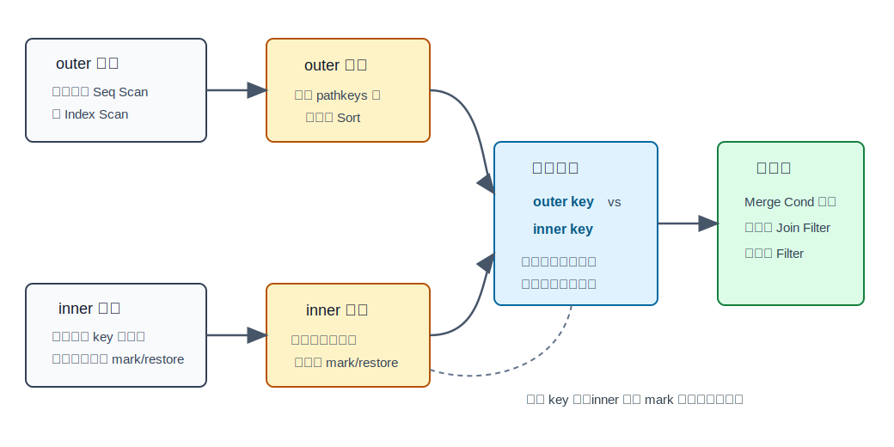
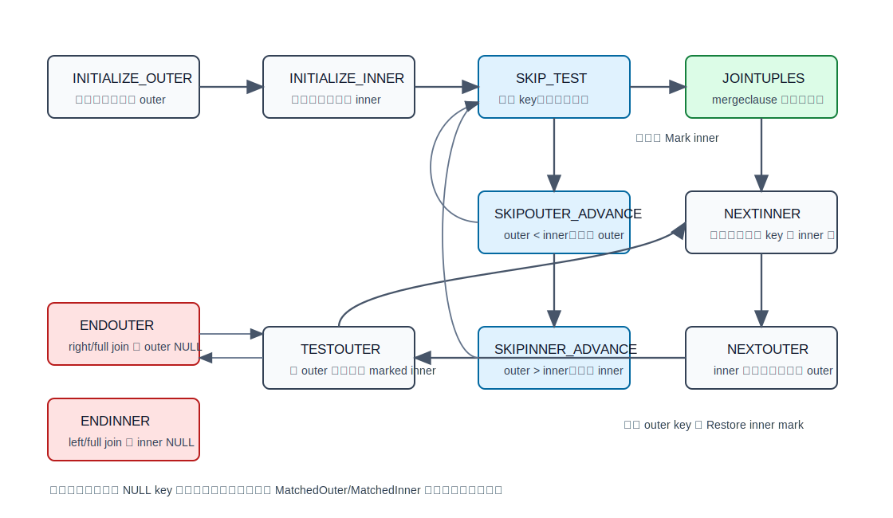
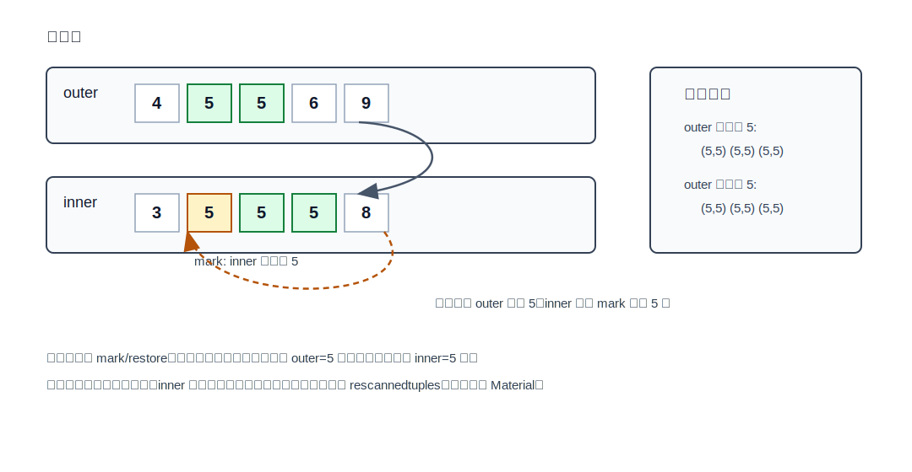
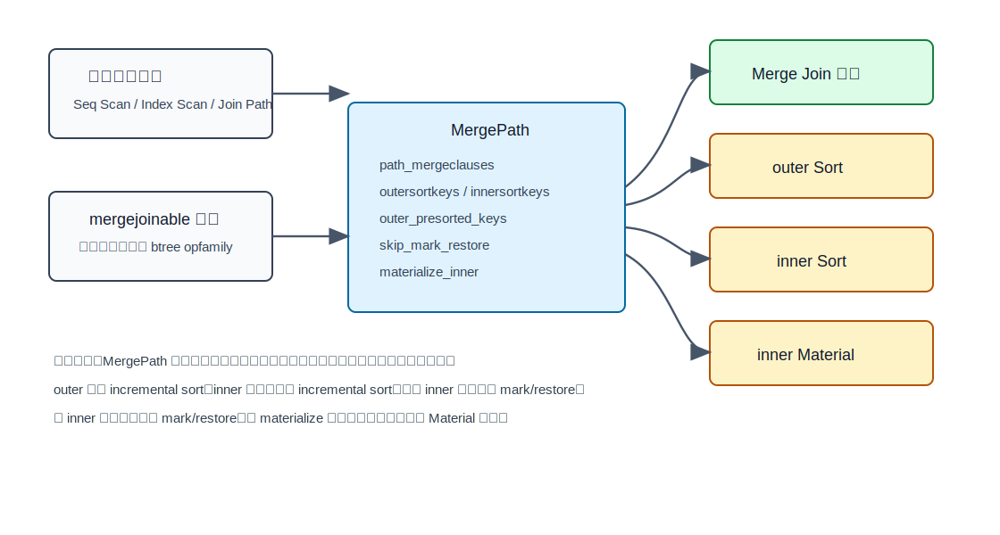
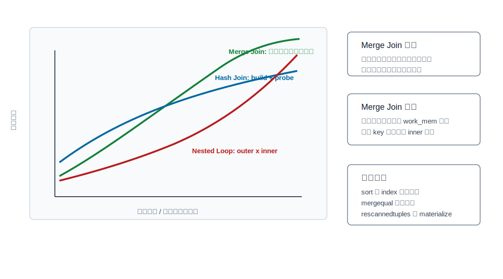

## 数据库筑基课 - merge join

### 作者
digoal

### 日期
2026-05-30

### 标签
PostgreSQL , 应用开发者 , 数据库筑基课 , 执行算法 , 优化器 , Join , Merge Join

----

## 背景
  


数据库筑基课大纲在当前项目中未找到可引用文件，因此本文按“扫描/执行算法”独立成篇。本文以 PostgreSQL 本地源码、官方文档和项目参考文件 `postgres/CLAUDE.md` 为主。用户给出的三篇资料 `Access Path Selection in a Relational Database Management System`、`Massively Parallel Sort-Merge Joins in Main Memory Multi-Core Database Systems`、`Integrating Compression and Execution in High-Performance Database Systems` 在当前项目中没有原文文件；本文只把它们作为概念背景：System R 时代已经把 join 方法纳入访问路径成本选择，多核内存 sort-merge join 关注排序/分区/并行合并，压缩执行融合关注比较、解码、物化之间的代价边界。本文不引用无法本地核验的实验数字。

Merge Join 很容易被一句话概括成“两边排序后像拉拉链一样合并”。这句话方向没错，但不够工程化。PostgreSQL 里的 Merge Join 至少同时回答五个问题：

1. 哪些 join 条件能作为 merge 条件？
2. 两侧输入如何获得同一套排序语义？
3. 遇到重复 key 时，inner 已经扫过的匹配段如何重新使用？
4. outer join、semi join、anti join、NULL key 怎么保持 SQL 语义？
5. 排序、mark/restore、Materialize、重复 key 重扫的代价由谁估算？

如果你只看 `EXPLAIN` 里的 `Merge Join` 节点，可能会漏掉真正决定性能的部分：它上游是否多了 `Sort`，inner 是否多了 `Materialize`，重复 key 是否导致 inner 段被反复发射，排序是否受 `work_mem` 限制，以及下游是否能继续利用 merge join 输出的有序性。

## 一、它解决什么问题？

Join 的本质是把两个输入中满足条件的行组合起来。对大结果集等值连接，朴素 nested loop 会把内表访问成本乘上 outer 行数；hash join 需要先构建 hash table，通常不保留输入顺序；merge join 则选择第三条路：把两侧都变成按 join key 有序的流，然后同步推进。

例如：

```sql
SELECT *
FROM orders o
JOIN payments p ON p.order_id = o.id
ORDER BY o.id;
```

如果 `orders.id` 和 `payments.order_id` 都能通过 B-tree 索引按顺序读，Merge Join 可以避免为 join 再建 hash table，也可能把 join 后的有序输出继续交给上层 `ORDER BY`、`GROUP BY` 或更高层 merge join 使用。它把问题从“对每行去另一边找匹配”转化成“让两条有序流同步前进”。

它牺牲的东西也很明确：

1. 输入必须有序。没有现成顺序时，需要显式 Sort。
2. 重复 key 会产生组合爆炸，inner 匹配段可能被反复重放。
3. inner 通常要支持 mark/restore；不支持时，规划器可能插入 Materialize。
4. 只能使用 mergejoinable 的条件作为核心同步条件，其他条件只能在 join 后继续过滤。

## 二、它是什么？

Merge Join 是一种基于排序顺序的 join 执行方法。它要求两侧输入在 join key 上按兼容的排序规则排列；执行时比较当前 outer key 和 inner key：

- outer key 小于 inner key：推进 outer。
- outer key 大于 inner key：推进 inner。
- 两者相等：输出匹配组合；如果有重复 key，记录 inner 匹配段起点，供下一个相同 outer key 重放。

在 PostgreSQL 中，它对应以下层次：

| 层次 | 关键结构或函数 | 作用 |
|---|---|---|
| 路径层 | `MergePath` | 优化器中的候选 merge join path；可隐含 Sort 和 Material |
| 条件筛选 | `select_mergejoin_clauses()` | 选出可用于 merge 的 join 条件，并限制 right/full join 的不安全条件 |
| 成本层 | `initial_cost_mergejoin()` / `final_cost_mergejoin()` | 估算排序、扫描、比较、重复 key 重扫、Materialize 代价 |
| 计划层 | `MergeJoin` | 保存 merge clauses、opfamily、collation、方向、NULL 排序规则 |
| 执行层 | `ExecMergeJoin()` | 用状态机推进两侧有序流，处理 mark/restore 和外连接补空 |
| 比较层 | `MJCompare()` | 使用 B-tree opfamily 的 comparator 按排序语义比较两侧 key |

PostgreSQL 对 merge key 的要求不是“任意等号都行”。计划节点 `MergeJoin` 会携带每个 merge clause 对应的 B-tree opfamily、collation、排序方向和 NULL 排序规则。执行器不是直接反复执行 `outer_key = inner_key`，而是分别计算两侧 key，再调用排序比较函数判断 `<`、`=`、`>`。这点来自 `src/backend/executor/nodeMergejoin.c` 顶部注释和 `MJExamineQuals()`。

## 三、核心原理

### 3.1 有序输入：Merge Join 的物理前提

PostgreSQL 优化器 README 解释了 pathkeys 的意义：优化器会记录每条 path 的已知排序顺序，因为这个顺序可能让上层 merge join 免掉显式 sort。`MergePath` 里的 `outersortkeys` 和 `innersortkeys` 如果为 `NIL`，说明对应输入已经满足排序要求；否则计划生成阶段会插入 `Sort`。



图 1 说明：Merge Join 的第一层成本来自“如何得到有序输入”。顺序可能来自索引扫描，也可能来自上游节点保留的 pathkeys，还可能来自显式 Sort。拿到两条有序流后，执行器只需比较当前 key 并推进较小一侧；相等时进入匹配输出阶段。

这里有一个细节：PostgreSQL 允许 outer 侧使用 incremental sort，但当前不对 inner 侧使用 incremental sort，因为 inner 侧可能需要 mark/restore，而 `nodeIncrementalSort.c` 明确说明 incremental sort 不支持 mark/restore。相关逻辑可见 `create_mergejoin_plan()` 和 `initial_cost_mergejoin()`。

### 3.2 执行器状态机：不是简单 while 循环

`ExecMergeJoin()` 被写成状态机。源码中的主要状态包括：

| 状态 | 含义 |
|---|---|
| `EXEC_MJ_INITIALIZE_OUTER` | 读取首个 outer tuple，并计算 outer merge key |
| `EXEC_MJ_INITIALIZE_INNER` | 读取首个 inner tuple，并计算 inner merge key |
| `EXEC_MJ_SKIP_TEST` | 比较两侧 key；相等则标记 inner 并进入连接，不等则推进较小侧 |
| `EXEC_MJ_SKIPOUTER_ADVANCE` | outer key 较小，跳过当前 outer |
| `EXEC_MJ_SKIPINNER_ADVANCE` | inner key 较小，跳过当前 inner |
| `EXEC_MJ_JOINTUPLES` | merge key 相等，检查额外 join qual 和 other qual，投影输出 |
| `EXEC_MJ_NEXTINNER` | 当前 outer 继续匹配后续 inner |
| `EXEC_MJ_NEXTOUTER` | 当前 inner 匹配段结束，推进 outer |
| `EXEC_MJ_TESTOUTER` | 判断新 outer 是否仍等于 marked inner，决定是否 restore inner |
| `EXEC_MJ_ENDOUTER` / `EXEC_MJ_ENDINNER` | right/full/left join 的剩余行补 NULL |



图 2 说明：Merge Join 的核心循环先把两侧同步到相等 key，再输出匹配组合。状态机的复杂度来自 SQL 语义：重复 key 要重放 inner 匹配段，outer/full/right join 要对未匹配行补 NULL，semi/anti join 又有早停或不返回匹配行的规则。

`joinqual` 和 `otherqual` 也要分清。`mergeclauses` 负责同步两侧输入；额外 `joinqual` 决定元组是否算“匹配过”，影响 outer/anti/full join 语义；`otherqual` 是最终返回前的过滤条件。源码 `ExecMergeJoin()` 在 `EXEC_MJ_JOINTUPLES` 中明确区分这两类条件。

### 3.3 mark/restore：重复 key 的正确性基础

考虑两侧都有重复 key：

```text
outer: 4, 5, 5, 6
inner: 3, 5, 5, 5, 8
```

第一个 outer=5 要和三个 inner=5 输出组合。问题是：当第二个 outer=5 到来时，inner 已经被推进到 8。如果不能回到第一个 inner=5，就会漏掉结果。因此 Merge Join 在发现 key 相等时会 mark inner 的当前位置；后续 outer 仍等于该 key 时，执行 `ExecRestrPos()` restore 到 mark 位置。



图 3 说明：mark/restore 不是优化技巧，而是重复 key 下保证正确性的机制。重复 key 越多，inner 匹配段被重放越多；规划器会在 `final_cost_mergejoin()` 中估算 `rescannedtuples`，并据此决定是否给 inner 加 Materialize。

什么时候可以跳过 mark/restore？`final_cost_mergejoin()` 给出条件：当 join 是 SEMI、ANTI，或 inner 已知唯一，并且所有 join restriction 都是 merge clauses 时，执行器找到第一个匹配后就不需要回退 inner。这个决策被写入 `MergePath.skip_mark_restore`，再传到计划节点 `MergeJoin.skip_mark_restore`。

### 3.4 NULL 与排序语义

Merge Join 使用排序比较函数同步两边输入，但 SQL 的等值 join 中 `NULL = NULL` 不为真。`MJCompare()` 对 `NULL-vs-NULL` 做了特殊处理：即使排序比较看起来相等，也不能把它报告为可连接的相等结果，而是强制返回非零，让状态机继续推进。

`MJEvalOuterValues()` 和 `MJEvalInnerValues()` 还会判断当前 tuple 是否 matchable。如果某个 merge key 为 NULL，就不可能匹配普通严格等值操作符。若第一列 key 为 NULL 且排序规则是 NULLS LAST，在不需要补空的一侧，执行器甚至可以认为后续也无法再匹配，从而提前结束对应方向的 join。

这说明 Merge Join 的“有序流合并”不是脱离 SQL 语义的数组算法。它必须把 B-tree 排序语义、NULL 排序位置、外连接补空和 join qual 语义一起处理。

### 3.5 规划器：MergePath 可以代表最多四个运行时节点

`src/include/nodes/pathnodes.h` 对 `MergePath` 的注释很关键：一个 MergePath 不只代表运行时的 `Merge Join` 节点。它最多可以代表四类节点：

1. `Merge Join` 本身。
2. outer 输入上的 `Sort`。
3. inner 输入上的 `Sort`。
4. inner 输入上的 `Materialize`。



图 4 说明：读 `EXPLAIN` 时不要把 `Merge Join` 当成孤立节点。排序成本、inner 是否物化、mark/restore 能否跳过，都是 `MergePath` 成本和计划形状的一部分。一个看似便宜的 merge join，如果两侧都要大排序，可能启动成本很高；一个看似多了 Materialize 的计划，可能是在保护 inner 免受昂贵 mark/restore 重扫。

`joinpath.c` 会从两个方向生成 merge join path：

- `sort_inner_and_outer()`：基于 cheapest-total 输入路径，考虑显式排序两侧。
- `generate_mergejoin_paths()`：当某个 outer path 已经有有用 pathkeys 时，寻找 inner 的排序路径，或对 inner cheapest path 排序。

如果有多个 merge clauses，规划器会考虑不同 pathkey 顺序，但不会生成所有排列；源码注释明确说全排列会导致规划时间过高，所以采用启发式。

### 3.6 成本模型：排序、比较、重扫、物化

Merge Join 的简化成本形状可以写成：

```text
total_cost =
    获取 outer 有序输入
  + 获取 inner 有序输入
  + merge key 比较成本
  + 重复 key 导致的 inner 重扫成本
  + 额外 join/filter 条件成本
  + 输出投影成本
```

`initial_cost_mergejoin()` 先做快速估算。它会用 merge clause 的扫描选择率估计两侧输入中有多少前缀可以跳过，以及真正参与 merge 的区间；如果需要排序，就调用 `cost_sort()` 或 outer 侧的 `cost_incremental_sort()`。

`final_cost_mergejoin()` 做更细的估算和两个实际决策：

1. 是否可以 `skip_mark_restore`。
2. 是否应该 `materialize_inner`。

源码中对重复 key 的估算非常直观。设每个 key 在 outer 中出现 `m_i` 次，在 inner 中出现 `n_i` 次，则 join 输出规模约为：

```text
sum(m_i * n_i)
```

inner 因重复 outer key 被重新发射的规模约为：

```text
sum((m_i - 1) * n_i) = join 输出规模 - inner 匹配规模
```

PostgreSQL 用 `mergejointuples - inner_path_rows` 近似 `rescannedtuples`，再计算 `rescanratio` 放大 inner run cost。这个估算不完美，源码注释也承认它对某些无匹配 inner tuple 的情况不精确，但足够指导 Materialize 的选择。



图 5 说明：Merge Join 的优势区间通常是“两侧已经有序”或“排序成本能被下游继续复用”。如果两侧都要大排序，且 `work_mem` 不足导致外部排序，它的启动成本会变重；如果重复 key 很多，mark/restore 和 Materialize 的代价会变成主导因素。

## 四、横向对比

| 维度 | Merge Join | Hash Join | Nested Loop |
|---|---|---|---|
| 主要目标 | 两条有序流同步合并 | 构建 hash table 后探测 | outer 行驱动 inner 重扫 |
| 典型前提 | join key 可排序；输入已有序或可接受排序 | 等值 join；build 侧可控 | outer 小，inner 可便宜查找 |
| 启动成本 | 若需排序则高；已有序时可低 | 需要先构建 hash table | 通常低，可较早返回 |
| 总成本形状 | sort/index order + merge compare + rescan | build + probe + batch/spill | outer rows x inner rescan |
| 内存压力 | Sort/Materialize 受 `work_mem` 影响 | Hash table 受 `work_mem` 和 `hash_mem_multiplier` 影响 | 通常较低，Memoize/Materialize 例外 |
| 输出顺序 | 可保留 merge key 顺序 | 通常不保序 | 取决于 outer 顺序和 inner 访问 |
| 重复 key 风险 | inner 匹配段反复重放 | 输出组合仍会放大，但无需回退输入 | inner 每次重扫被 outer 行数放大 |
| 索引价值 | B-tree 索引可直接提供有序输入 | 索引通常不是核心 | inner 参数化索引扫描价值极高 |
| 适合场景 | 报表、有序输出、两边已有索引顺序、大批量等值 join | 大表等值 join、无有用顺序 | OLTP 点查、小 outer、EXISTS 早停 |
| 不适合场景 | 无序大输入且排序代价高、重复 key 极多 | build 侧过大且溢出严重、非等值 join | outer 大且 inner 没有有效索引 |

这个表背后的原因是“数据流形态”不同。Hash Join 用内存结构换无序探测；Nested Loop 用 outer 当前行换 inner 定点访问；Merge Join 用排序顺序换线性同步推进。没有一种 join 方法天然更高级，只有 workload、索引、统计信息、内存和输出顺序是否匹配。

## 五、效果如何？

Merge Join 的收益主要有四类：

1. **对大批量等值 join 稳定**：两侧有序后，主流程是顺序推进，不需要对每个 outer 行重扫 inner。
2. **能利用 B-tree 顺序**：如果两侧索引已经提供所需 pathkeys，可以省掉 Sort。
3. **输出天然有序**：上层 `ORDER BY`、`GROUP BY`、`DISTINCT` 或更高层 merge join 可能继续利用这个顺序。
4. **不依赖 hash table 容量**：当 hash build 侧很大或 hash 内存压力高时，sort-based 路径可能更可控。

代价也同样明确：

1. **排序启动成本**：两侧都要 Sort 时，首行延迟可能明显高于 Nested Loop。
2. **`work_mem` 影响排序和物化**：PostgreSQL 文档说明 `work_mem` 是单个 sort/hash 等操作写临时文件前可用的基础内存；复杂查询可能有多个这样的节点。
3. **重复 key 导致重扫**：outer 重复 key 越多，inner 匹配段被 restore 后重放越多。
4. **merge 条件受 opfamily 限制**：只有 mergejoinable 条件才能参与同步；其他条件只能作为额外过滤。
5. **并行不是免费**：PostgreSQL 会考虑 partial merge join，但 full/right/right-anti join 有额外限制，且排序与有序合并在并行下仍有协调成本。

从论文背景看，内存多核 sort-merge join 研究关注的是如何把排序、分区、NUMA/cache 行为和并行 merge 做到更高吞吐；压缩执行融合研究提醒我们，比较压缩值、延迟解码、避免物化，可能改变 sort/merge 的 CPU 与内存带宽边界。PostgreSQL 当前主执行器仍是 tuple slot 驱动的通用执行器，不能简单套用列存向量化系统的数字。

## 六、实操 DEMO

以下 SQL 是可复制的最小实验。本文未在本地启动 PostgreSQL 实例执行，因此不提供伪造的 `EXPLAIN ANALYZE` 输出。读者可以在 PostgreSQL 中执行，并重点观察 `Merge Join` 上下是否有 `Sort`、`Materialize`，以及 `Sort Method`、`Memory`、`Disk`、`loops`、`Buffers`。

### 6.1 两侧索引顺序：观察无显式 Sort 的 Merge Join

```sql
DROP TABLE IF EXISTS demo_order;
DROP TABLE IF EXISTS demo_payment;

CREATE TABLE demo_order (
    id bigint PRIMARY KEY,
    customer_id bigint NOT NULL,
    created_at timestamptz NOT NULL DEFAULT now()
);

CREATE TABLE demo_payment (
    id bigint PRIMARY KEY,
    order_id bigint NOT NULL,
    amount numeric NOT NULL
);

INSERT INTO demo_order (id, customer_id)
SELECT g, (g % 10000) + 1
FROM generate_series(1, 200000) AS g;

INSERT INTO demo_payment (id, order_id, amount)
SELECT g, g, (random() * 1000)::numeric
FROM generate_series(1, 200000) AS g;

CREATE INDEX demo_payment_order_id_idx ON demo_payment(order_id);
ANALYZE demo_order;
ANALYZE demo_payment;

SET enable_hashjoin = off;
SET enable_nestloop = off;

EXPLAIN (ANALYZE, BUFFERS)
SELECT o.id, p.amount
FROM demo_order o
JOIN demo_payment p ON p.order_id = o.id
ORDER BY o.id
LIMIT 1000;

RESET enable_hashjoin;
RESET enable_nestloop;
```

健康的 Merge Join 计划通常具备这些特征：

- `Merge Cond: (p.order_id = o.id)` 或等价方向。
- 两侧可能是按 key 顺序的 index scan。
- 如果上层 `ORDER BY o.id` 与 merge 输出顺序一致，可能避免额外排序。
- `LIMIT` 可能让执行没有读完整个输入；这不是估算错误，而是上层停止拉取。

### 6.2 去掉一个索引：观察显式 Sort

```sql
DROP INDEX IF EXISTS demo_payment_order_id_idx;
ANALYZE demo_payment;

SET enable_hashjoin = off;
SET enable_nestloop = off;

EXPLAIN (ANALYZE, BUFFERS)
SELECT o.id, p.amount
FROM demo_order o
JOIN demo_payment p ON p.order_id = o.id;

RESET enable_hashjoin;
RESET enable_nestloop;
```

这时如果仍选择 Merge Join，`demo_payment` 一侧通常需要 `Sort`。重点观察：

- `Sort Key` 是否等于 join key。
- `Sort Method` 是内存 quicksort 还是 external merge。
- `work_mem` 改变后，Sort 是否从磁盘回到内存。

### 6.3 重复 key：观察 Materialize 和 inner 重放

```sql
DROP TABLE IF EXISTS demo_left_dup;
DROP TABLE IF EXISTS demo_right_dup;

CREATE TABLE demo_left_dup (k int NOT NULL, payload text);
CREATE TABLE demo_right_dup (k int NOT NULL, payload text);

INSERT INTO demo_left_dup
SELECT (g % 1000), md5(g::text)
FROM generate_series(1, 200000) AS g;

INSERT INTO demo_right_dup
SELECT (g % 1000), md5((g * 17)::text)
FROM generate_series(1, 200000) AS g;

CREATE INDEX demo_left_dup_k_idx ON demo_left_dup(k);
CREATE INDEX demo_right_dup_k_idx ON demo_right_dup(k);
ANALYZE demo_left_dup;
ANALYZE demo_right_dup;

SET enable_hashjoin = off;
SET enable_nestloop = off;

EXPLAIN (ANALYZE, BUFFERS)
SELECT count(*)
FROM demo_left_dup l
JOIN demo_right_dup r ON r.k = l.k;

RESET enable_hashjoin;
RESET enable_nestloop;
```

这个实验故意制造大量重复 key。重点观察：

- join 输出行数是否远大于输入行数。
- inner 侧是否出现 `Materialize`。
- `EXPLAIN ANALYZE` 中 inner 子节点的 `loops` 和行数是否体现重复发射。

### 6.4 用开关做诊断，不要当长期修复

```sql
SET enable_mergejoin = off;
EXPLAIN (ANALYZE, BUFFERS)
SELECT o.id, p.amount
FROM demo_order o
JOIN demo_payment p ON p.order_id = o.id;
RESET enable_mergejoin;
```

`enable_mergejoin = off` 适合回答“如果不用 Merge Join，优化器会选什么”。它不适合作为长期配置修复。长期修复应回到索引顺序、统计信息、`work_mem`、SQL 形态和数据分布。

## 七、最佳实践

### 面向数据库架构师

1. 为高频大批量等值 join 设计 B-tree 索引时，不只看单表过滤，还要看 join key 顺序是否能被 Merge Join 和上层排序复用。
2. 如果报表链路天然需要按某个业务键输出，优先评估“索引顺序 -> Merge Join -> 上层聚合/排序”的连续有序路径。
3. 对重复 key 很多的模型要谨慎。多对多 join 的输出规模本身就会爆炸，Merge Join 的 mark/restore 只是正确执行这个语义，不会消除组合规模。
4. 在列存、压缩或向量化系统中，不要机械套用 PostgreSQL 的执行成本。压缩比较、延迟解码、批处理宽度会显著改变 sort-merge join 的 CPU 与内存带宽边界。

### 面向 DBA

1. 诊断慢 SQL 时先看 `Merge Join` 的孩子节点。是否有两个大 `Sort`？是否有 `Materialize`？Sort 是否写临时文件？这些通常比节点名更重要。
2. 检查 `work_mem` 要按“每个操作、每个并发会话、每个并行 worker”理解，不要只按单条 SQL 的总内存估算。
3. 如果 Merge Join 选错，优先检查统计信息和相关列分布。重复 key、倾斜分布、过时统计信息都会影响 `mergejointuples` 和 `rescannedtuples` 估算。
4. `enable_mergejoin = off` 只用于对比计划。若关闭后 Hash Join 明显更好，继续分析为什么排序成本或重复 key 估错，而不是永久关闭 Merge Join。
5. 关注 `Sort Method: external merge Disk: ...`。这说明排序已写临时文件，可能需要调整索引、SQL、`work_mem` 或减少输入规模。

### 面向业务开发者

1. 写清晰的等值 join 条件，例如 `p.order_id = o.id`。避免在 join key 外包函数或混用类型，导致条件不能成为 merge clause 或索引顺序不可用。
2. 如果业务需要有序结果，尽量让 `ORDER BY` 与 join key 或索引顺序一致，给优化器复用顺序的机会。
3. 不要把多对多 join 的慢归咎于某个 join 算法。重复 key 下输出行数本身可能是 `m * n`，应该先确认结果规模是否合理。
4. 对分页和首屏查询，Merge Join 未必总是最优。若需要快速返回少量行，小 outer + inner index 的 Nested Loop 可能更合适。

## 八、适合与不适合场景

适合：

- 两侧都能通过 B-tree 索引按 join key 顺序读取。
- 上游已经排序，或下游还需要同样顺序，排序成本可以复用。
- 大批量等值 join，但 hash build 侧过大或内存压力明显。
- 报表查询、批处理查询、按业务键归并数据。
- FULL JOIN，尤其是无 join clause 的特殊 full join；PostgreSQL 注释说明这类场景普通 clauseless nestloop 不合适，需要 merge join 路径支持。

不适合：

- 两边都很大且都没有有用顺序，显式 Sort 成本高。
- `work_mem` 明显不足，排序频繁落盘。
- join key 重复度极高，输出规模和 inner 重放都很大。
- join 条件不是 mergejoinable，例如复杂表达式、非等值条件或没有合适 opfamily 的操作符。
- 查询只需要极少量结果，且 inner 有高选择率参数化索引；Nested Loop 可能首行延迟更低。
- build 侧适中且无序输入很多时，Hash Join 可能更简单、更便宜。

## 九、常见坑

1. **只看 `Merge Join`，不看 `Sort`。**  
   Merge Join 快不快，首先取决于有序输入怎么来。两个大 Sort 加外部落盘，往往比 join 本身更贵。

2. **误以为索引一定比 Seq Scan + Sort 快。**  
   PostgreSQL 文档提醒，处理大量行时，顺序扫描再排序经常胜过按索引顺序做大量非顺序访问。

3. **忽略 inner 的 Materialize。**  
   Materialize 可能是为了支持 mark/restore 的正确性，也可能是为了降低重复发射成本。它不是“多余节点”的同义词。

4. **把 NULL 当成普通重复 key。**  
   SQL 等值 join 中 `NULL = NULL` 不为真。Merge Join 执行器会专门避免把 NULL-vs-NULL 当作匹配输出。

5. **误读 `EXPLAIN ANALYZE` 的 child rows。**  
   PostgreSQL 文档说明，Merge Join 在某些情况下会提前停止读取一个输入；重复 outer key 时，inner 行还可能被重复发射并计入统计。诊断时要结合 `loops`、上层限制和 join key 分布。

6. **以为 `enable_mergejoin = off` 是优化方案。**  
   它是诊断工具，用来观察替代计划。真正的修复通常是索引、统计信息、内存、SQL 和数据模型。

7. **忽略 collation 和 opfamily。**  
   Merge Join 的比较来自 B-tree opfamily 和 collation。跨类型、不同排序语义或不完整操作符族会影响可用性。

8. **让 Join Filter 承担真正选择性。**  
   `Merge Cond` 负责同步两侧输入；大量选择性如果落在 Join Filter，说明很多组合要先产生再过滤，成本会高。

## 十、扩展问题

1. 为什么 PostgreSQL 的 Merge Join 需要 B-tree opfamily，而不是只要有一个等号操作符？
2. 如果 outer 和 inner 都按 join key 有序，但 key 分布极度倾斜，Merge Join 和 Hash Join 谁更稳？需要哪些统计信息才能判断？
3. 为什么 inner 侧 incremental sort 不适合当前 Merge Join？如果要支持，需要给 incremental sort 增加什么能力？
4. 对列存压缩系统，应该先解压再排序，还是在压缩编码上比较？这会如何影响 sort-merge join 的 CPU 与内存带宽？
5. 在分布式数据库中，sort-merge join 的代价如何被网络 shuffle、分区键、全局有序性改变？

## 十一、扩展阅读

- PostgreSQL 源码：`src/backend/executor/nodeMergejoin.c`，`ExecMergeJoin()`、`MJCompare()`、`MJEvalOuterValues()`、`MJEvalInnerValues()`、`ExecInitMergeJoin()`。
- PostgreSQL 源码：`src/include/nodes/pathnodes.h`，`MergePath` 对 Sort、Material、skip mark/restore 的注释。
- PostgreSQL 源码：`src/include/nodes/plannodes.h`，`MergeJoin` 对 opfamily、collation、方向、NULL 排序的定义。
- PostgreSQL 源码：`src/include/nodes/execnodes.h`，`MergeJoinState` 运行期字段。
- PostgreSQL 源码：`src/backend/optimizer/path/joinpath.c`，`try_mergejoin_path()`、`sort_inner_and_outer()`、`generate_mergejoin_paths()`、`select_mergejoin_clauses()`。
- PostgreSQL 源码：`src/backend/optimizer/path/costsize.c`，`initial_cost_mergejoin()`、`final_cost_mergejoin()`。
- PostgreSQL 源码：`src/backend/optimizer/plan/createplan.c`，`create_mergejoin_plan()`、`make_mergejoin()`。
- PostgreSQL 源码：`src/backend/executor/execAmi.c`，`ExecSupportsMarkRestore()`。
- PostgreSQL 源码：`src/backend/executor/nodeSort.c`、`src/backend/executor/nodeMaterial.c`，Sort/Material 对 mark/restore 的支持。
- PostgreSQL 文档：`doc/src/sgml/perform.sgml`，`EXPLAIN` 中 Merge Join、Sort、实际执行统计的说明。
- PostgreSQL 文档：`doc/src/sgml/config.sgml`，`enable_mergejoin` 与 `work_mem` 参数说明。
- PostgreSQL 优化器 README：`src/backend/optimizer/README`，pathkeys、EquivalenceClass、mergejoinable clause 和 join path 选择。
- 项目参考：`postgres/CLAUDE.md`，PostgreSQL 源码目录、构建和测试入口。
- DeepWiki：`postgres/postgres` 被用户列为参考；本次本地 CLI 查询返回错误，本文未直接采用其内容。
- 论文：Patricia G. Selinger 等，`Access Path Selection in a Relational Database Management System`。可作为访问路径、join order 和成本优化的经典背景。
- 论文/分享：`Massively Parallel Sort-Merge Joins in Main Memory Multi-Core Database Systems`。可作为多核内存 sort-merge join 并行化的扩展阅读，本文未引用未核验数字。
- 论文/分享：`Integrating Compression and Execution in High-Performance Database Systems`。可作为压缩表示、延迟解码和执行融合的扩展阅读，本文未引用未核验数字。
  
## 附录 
1、询问 gemini
```
merge join 相关的论文
```

2、克隆代码  
```  
git clone --depth 1 https://github.com/postgres/postgres
```  
  
3、启用 codex, 使用 [数据库筑基课 skill](../skills/README.md).  
```
文章标题: 
  数据库筑基课 - merge join
项目源码(已克隆到当前项目如下目录中):  
  postgres
相关论文或分享:
  Access Path Selection in a Relational Database Management System
  Massively Parallel Sort-Merge Joins in Main Memory Multi-Core Database Systems
  Integrating Compression and Execution in High-Performance Database Systems
项目 deepwiki reponame:  
  postgres/postgres
项目参考信息: 
  postgres/CLAUDE.md
```
  
  
#### [PostgreSQL 解决方案集合](../201706/20170601_02.md "40cff096e9ed7122c512b35d8561d9c8")
  
  
#### [德哥 / digoal's Github - 公益是一辈子的事.](https://github.com/digoal/blog/blob/master/README.md "22709685feb7cab07d30f30387f0a9ae")
  
  
#### [About 德哥](https://github.com/digoal/blog/blob/master/me/readme.md "a37735981e7704886ffd590565582dd0")
  
  

  
