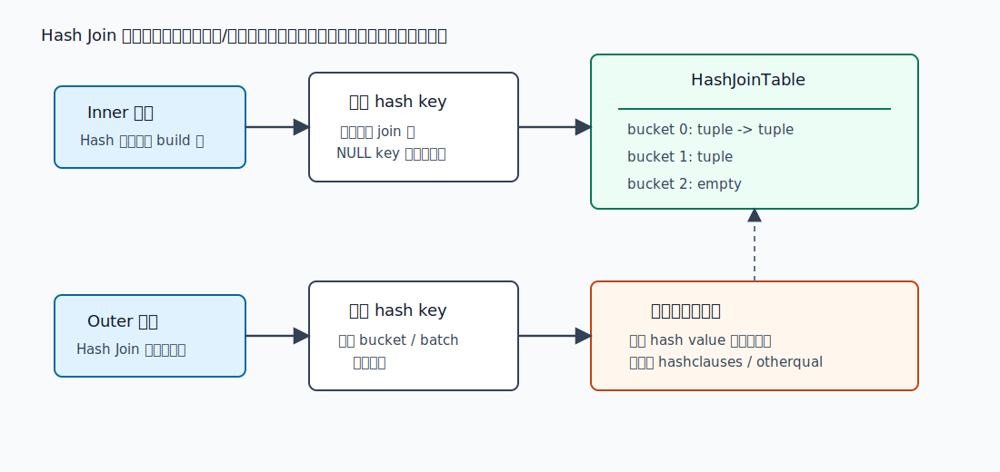
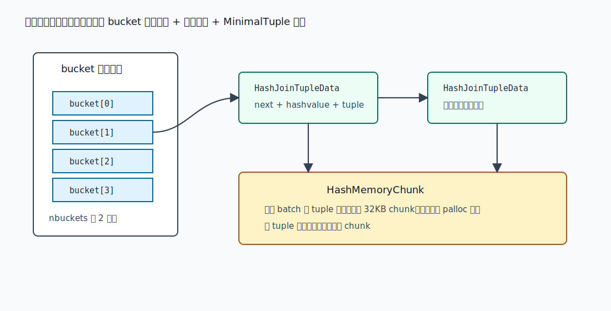
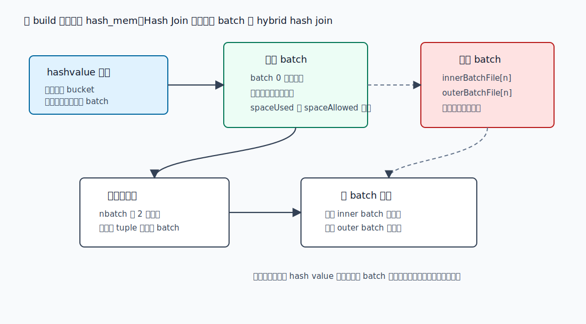
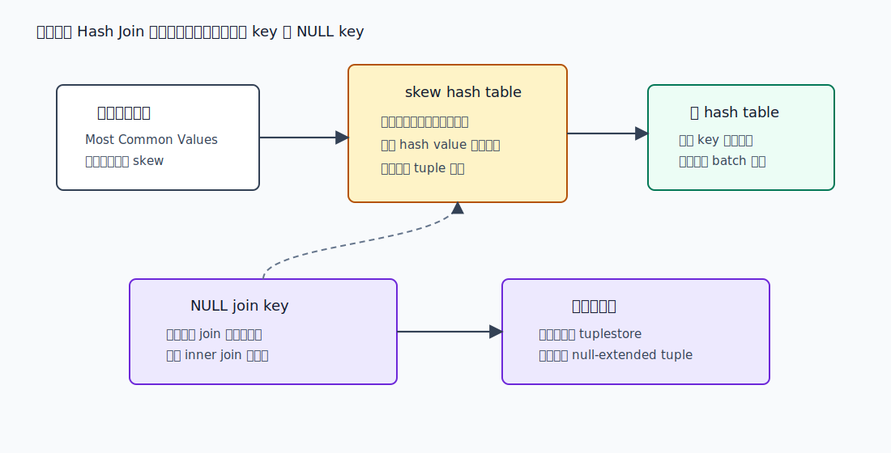
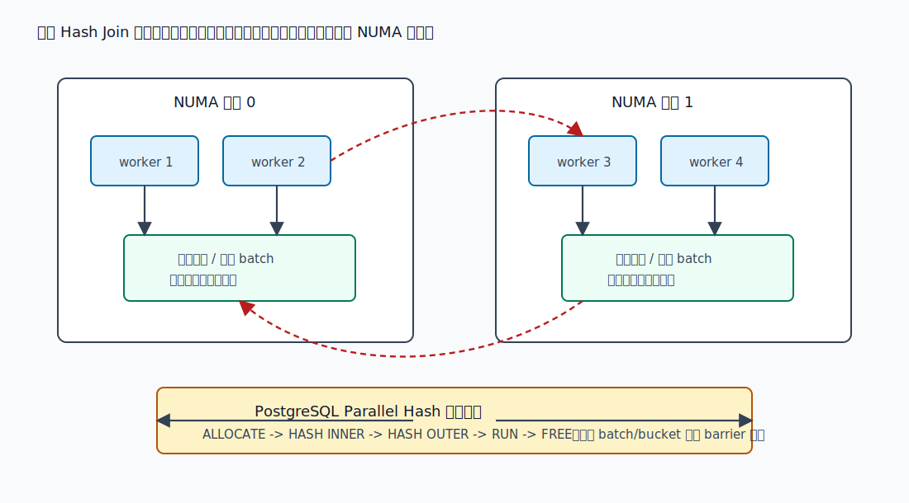

## 数据库筑基课 - In-Memory Hash Join

### 作者
digoal

### 日期
2026-05-30

### 标签
PostgreSQL , 应用开发者 , 数据库筑基课 , 执行算法 , 优化器 , Join , Hash Join , 内存计算

----

## 背景
  
  

数据库筑基课大纲在当前项目中未找到可引用文件，因此本文按“扫描/执行算法”独立成篇。本文以 PostgreSQL 本地源码、官方文档、DeepWiki 对 `postgres/postgres` 的架构摘要为主。用户给出的三篇资料 `Cache Conscious Hash Joins`、`Main-Memory Hash Joins on Multi-Core CPUs: Tuning to the Underlying Hardware`、`NUMA-Aware Algorithms for Relational Join on Modern Multi-core Systems` 在当前项目中没有原文文件；本文只把它们作为硬件意识背景：cache-conscious join 关注 cache miss 和分区粒度，多核 main-memory join 关注 radix partition、同步和内存带宽，NUMA-aware join 关注本地内存、远程访问和跨 socket 数据迁移。本文不引用无法本地核验的实验数字。

Hash Join 常被讲成一句话：“把一边建成 hash table，再用另一边查。”这句话适合入门，但不足以指导工程判断。真正跑在数据库里的 In-Memory Hash Join 至少要回答七个问题：

1. 哪一侧作为 build/inner，哪一侧作为 probe/outer？
2. 什么 join 条件能参与 hash？
3. 哈希表的 bucket、tuple、内存上下文如何布局？
4. build 侧放不进内存时，怎么 batch 和 spill？
5. 数据倾斜、NULL key、outer/right/full/semi/anti join 如何保持 SQL 语义？
6. 多核并行时，私有 hash table 和共享 parallel hash table 各有什么代价？
7. 现代 CPU 的 cache、TLB、内存带宽、NUMA 对“内存算法”意味着什么？

如果只看 `EXPLAIN` 里的 `Hash Join`，很容易漏掉决定性能的部分：`Hash` 节点的 `Buckets`、`Batches`、`Memory Usage`，是否出现 `Parallel Hash`，`Batches` 是否从 1 变大，临时文件 I/O 是否暴涨，inner 侧 MCV 是否把单个 bucket 撑爆，以及 `work_mem * hash_mem_multiplier` 是否只是让单条 SQL 快、却把并发内存打穿。

## 一、它解决什么问题？

Join 的本质是把两个输入中满足条件的行组合起来。Nested Loop 的风险是把 inner 访问成本乘以 outer 行数；Merge Join 的前提是两边有序；Hash Join 则把等值连接转换成“内存定位问题”：

```sql
SELECT *
FROM fact_order f
JOIN dim_customer d ON d.customer_id = f.customer_id
WHERE f.created_at >= now() - interval '1 day';
```

如果 `dim_customer` 相对较小，而 `fact_order` 是一天内的大量事实数据，Hash Join 的典型路径是：

1. 读取 `dim_customer`，按 `customer_id` 计算 hash value。
2. 把 build 侧 tuple 放入 HashJoinTable 的 bucket 链表。
3. 扫描 `fact_order`，对每一行计算同一套 hash value。
4. 只扫描对应 bucket 中的候选 tuple，再执行真正的 join qual 和其他过滤条件。

它把原问题从“每行去另一边找”转成“用 hash value 缩小候选集”。代价也很明确：

1. 只适合可哈希的等值类连接条件。非等值条件不能成为 hashclauses。
2. build 侧要先读完并建表，首行延迟通常高于 Nested Loop。
3. 内存不够时会分 batch 写临时文件，变成 hybrid hash join。
4. 热点 key 无法靠增加 batch 无限拆小；同一 hash value 的 tuple 仍会挤在一起。
5. 哈希表随机访问多，对 CPU cache 和 NUMA 本地性比顺序扫描更敏感。

## 二、它是什么？

In-Memory Hash Join 是一种以哈希表为核心数据结构的等值连接执行方法。PostgreSQL 里的执行计划通常形如：

```text
Hash Join
  Hash Cond: (outer.k = inner.k)
  -> outer plan
  -> Hash
       -> inner plan
```

官方文档 `doc/src/sgml/perform.sgml` 对它的解释很直接：一张表的行先进入内存哈希表，然后扫描另一张表，并为每一行探测哈希表中的匹配项。

在 PostgreSQL 中，它对应以下层次：

| 层次 | 关键结构或函数 | 作用 |
|---|---|---|
| 路径层 | `HashPath` | 优化器中的候选 hash join path，记录 hashclauses 和 batch 估计 |
| 成本层 | `initial_cost_hashjoin()` / `final_cost_hashjoin()` | 估算 build、probe、hash 计算、batch I/O、bucket skew 风险 |
| 计划层 | `HashJoin` / `Hash` | `HashJoin` 探测外侧；`Hash` 构建内侧哈希表 |
| 执行状态机 | `ExecHashJoinImpl()` | 构建表、取 outer tuple、扫 bucket、补 outer/full/right join 行、切换 batch |
| 哈希表 | `HashJoinTableData` | 管理 bucket、batch、skew table、临时文件、内存上下文和并行共享状态 |
| 分区/溢写 | `ExecChooseHashTableSize()` / `ExecHashIncreaseNumBatches()` | 根据内存预算选择 bucket/batch，并在运行期增大 batch |
| 并行 | `ParallelHashJoinState` | 用 barrier 协调 parallel-aware hash join 的 build、partition、probe 阶段 |

这里的“inner”要小心理解。`Hash` 节点的外侧子计划，在 Hash Join 语义上是 build/inner side。`ExecHashTableCreate()` 源码注释也提醒：它从 Hash 节点的 outer subtree 获取要被哈希的 relation，但那是 hash join 的 inner relation。

## 三、核心原理

### 3.1 两阶段流水线：build 后 probe

PostgreSQL 的核心执行函数是 `src/backend/executor/nodeHashjoin.c:ExecHashJoinImpl()`。第一次进入时状态是 `HJ_BUILD_HASHTABLE`：创建 HashJoinTable，调用 Hash 节点的 `MultiExecProcNode()`，由 `src/backend/executor/nodeHash.c:MultiExecPrivateHash()` 或 `MultiExecParallelHash()` 读取 build 侧 tuple 并插入哈希表。



图 1 说明：Hash Join 的主路径是 build/probe 两阶段。build 侧先计算 hash key 并填充 HashJoinTable；probe 侧逐行计算 hash key，定位 bucket，然后扫描桶链。hash value 只是缩小候选集，真正能不能输出还要执行 `hashclauses`、`joinqual` 和 `otherqual`。

`ExecHashJoinImpl()` 的主要状态包括：

| 状态 | 含义 |
|---|---|
| `HJ_BUILD_HASHTABLE` | 首次执行，构建 build/inner 侧哈希表 |
| `HJ_NEED_NEW_OUTER` | 获取下一条 probe/outer tuple，并计算 hash value |
| `HJ_SCAN_BUCKET` | 扫描当前 bucket 或 skew bucket 的候选 tuple |
| `HJ_FILL_OUTER_TUPLE` | left/full join 中输出未匹配 outer 的补空行 |
| `HJ_FILL_INNER_TUPLES` | right/right-anti/full join 中扫描未匹配 inner tuple |
| `HJ_FILL_OUTER_NULL_TUPLES` | 输出需要保留的 NULL-key outer tuple |
| `HJ_FILL_INNER_NULL_TUPLES` | 输出需要保留的 NULL-key inner tuple |
| `HJ_NEED_NEW_BATCH` | 当前 batch 结束，切换到下一批 |

这说明 Hash Join 不是单纯的数组查找。状态机复杂度来自 SQL 语义和内存边界：外连接要补空，anti/semi join 可早停，NULL key 在严格等值操作符下不能匹配，内存不足时还要切换 batch。

### 3.2 哈希表布局：bucket 指针数组 + tuple 链表

PostgreSQL 的 hash join tuple 结构定义在 `src/include/executor/hashjoin.h`：

```text
HashJoinTupleData:
  next      -- 同 bucket 链表下一项
  hashvalue -- tuple 的 hash code
  MinimalTuple data follows
```

`ExecHashTableInsert()` 会把 tuple 转成 MinimalTuple，计算 bucket/batch。如果属于当前 batch，就在 `batchCxt` 中分配 `HashJoinTupleData + tuple data`，并把它插到 bucket 链表头部；如果属于后续 batch，就写入对应 inner batch 临时文件。



图 2 说明：HashJoinTable 的 bucket 数是 2 的幂，便于用位运算从 hash value 得到 bucket。bucket 内是链表，不是开放地址数组；每个节点保存 hash value 和 MinimalTuple。为了减少逐 tuple `palloc` 开销，当前 batch 的 tuple 通常被打包进 32KB `HashMemoryChunk`。

这个布局的工程含义是：

1. **bucket 太少**：链表变长，probe 时比较候选 tuple 变多。
2. **bucket 太多**：bucket 指针数组本身占内存，可能挤压 tuple 空间。
3. **tuple 太宽**：同样行数下更容易超过内存预算，触发 batch。
4. **hash 函数分布差**：某些 bucket 过长，CPU 时间和 cache miss 都会增加。

### 3.3 内存预算：`work_mem * hash_mem_multiplier`

PostgreSQL 文档 `config.sgml` 说明：`work_mem` 是排序或哈希表等查询操作写临时文件前可用的基础内存；哈希类操作的内存限制由 `work_mem * hash_mem_multiplier` 计算，默认 `hash_mem_multiplier` 是 2.0。

源码实现是 `src/backend/executor/nodeHash.c:get_hash_memory_limit()`：

```text
hash_mem = work_mem * hash_mem_multiplier * 1024
```

`ExecChooseHashTableSize()` 根据 build 侧估计行数和平均行宽选择：

1. `space_allowed`：哈希表内存预算。
2. `nbuckets`：bucket 数，目标负载是 `NTUP_PER_BUCKET = 1`。
3. `nbatch`：batch 数。若 build 侧估计放不进内存，就变成多 batch。
4. `num_skew_mcvs`：允许进入 skew hash table 的热点值数量。

`nbuckets` 和 `nbatch` 都被设计成 2 的幂。`ExecHashGetBucketAndBatch()` 的注释给出核心公式：

```text
bucketno = hashvalue MOD nbuckets
batchno  = ROR(hashvalue, log2_nbuckets) MOD nbatch
```

使用位运算的前提是 hash 函数要把输出位打散；否则 bucket 或 batch 都可能倾斜。

### 3.4 batch 与 spill：内存算法的边界

PostgreSQL 的 `nodeHashjoin.c` 顶部注释明确说，它实现的是 hybrid hash join。build 侧放不进内存时，Hash Join 可以用多 batch 执行：当前 batch 留在内存，其他 batch 写临时文件，后续逐批加载。



图 3 说明：当 `nbatch > 1` 时，当前 batch 的 inner tuple 进入内存哈希表；不属于当前 batch 的 inner tuple 写入 `innerBatchFile[batchno]`。probe 侧 outer tuple 若不属于当前 batch，也写入 `outerBatchFile[batchno]`。当前 batch 结束后，执行器加载下一批 inner，再扫描对应 outer。

运行期如果发现 `spaceUsed + bucket_bytes > spaceAllowed`，`ExecHashTableInsert()` 会调用 `ExecHashIncreaseNumBatches()`。batch 数只按 2 倍增加，并且算法保证已经分配的 tuple 只会去“当前或更晚”的 batch，不会回到更早 batch。这个性质让执行器可以顺序推进 batch，不需要倒带。

但增加 batch 不是万能的。源码注释指出，如果某次增加 batch 后有 batch 保留了全部或没有保留任何 tuple，说明分布极端倾斜，继续增加 batch 没用，执行器会关闭进一步增长。这背后的原因很简单：同一 hash value 的 tuple 不能再靠 batch 位拆开。

### 3.5 skew 优化与 NULL key

`src/include/executor/hashjoin.h` 对 skew 优化有详细注释。PostgreSQL 会尝试根据 outer relation 的 MCV 统计，把热点 hash value 对应的 inner tuple 放进单独的 skew hash table。这样 probe 侧热点 key 可以在第一批里完成匹配，避免热点 tuple 被写到磁盘 batch。



图 4 说明：skew table 是对热点 key 的局部优化，不是通用抗倾斜方案。它只占 hash join 总内存预算的一小部分，源码常量 `SKEW_HASH_MEM_PERCENT` 为 2。若 skew table 超过自己的预算，执行器会减少被特殊处理的 MCV。

为什么看 outer 侧统计，而不是 inner？源码注释给出两个原因：outer 通常更大，优化 outer 的高频值能节省更多 I/O；并且规划器倾向于把分布更均匀的一侧放在 inside，因此 outer 更可能出现值得优化的倾斜。

NULL key 的处理也不是简单丢弃。`MultiExecPrivateHash()` 中，如果 hash 表达式结果为 NULL：

1. 普通严格等值 inner join 中，这类 tuple 不可能匹配，可以直接丢弃。
2. 如果外连接语义需要补空输出，则必须保存到 `tuplestore`，稍后作为 null-extended tuple 输出。
3. 对非严格 join operator，PostgreSQL 可以把 NULL 当普通数据处理，但这不是常见等值 join 路径。

### 3.6 并行 Hash Join：共享表、barrier 与 batch 协作

PostgreSQL 支持两类并行相关形态。`nodeHashjoin.c` 顶部注释把它们分清：

1. **parallel-oblivious hash join**：每个 worker 各自构建一份 hash table。实现简单，但 build 侧内存和 CPU 会重复。
2. **parallel-aware hash join**：`EXPLAIN` 中显示为 `Parallel Hash Join`，总是和 `Parallel Hash` 节点一起出现。多个 backend 协作构建共享 hash table，并用 barrier 管理阶段。

Parallel Hash 的 build 阶段包括：

```text
PHJ_BUILD_ELECT
PHJ_BUILD_ALLOCATE
PHJ_BUILD_HASH_INNER
PHJ_BUILD_HASH_OUTER
PHJ_BUILD_RUN
PHJ_BUILD_FREE
```

当需要增长 batch 或 bucket 时，还会进入单独的 growth barrier 阶段；每个 batch 也有自己的 `PHJ_BATCH_ALLOCATE`、`PHJ_BATCH_LOAD`、`PHJ_BATCH_PROBE`、`PHJ_BATCH_SCAN`、`PHJ_BATCH_FREE`。



图 5 说明：并行 Hash Join 的难点不只是多开几个 worker。共享 hash table 减少重复 build，但引入同步和共享内存访问；多 batch 可以并行处理，但要先完成分区；在 NUMA 机器上，跨 socket 访问远程内存会把“内存算法”变成“互联带宽算法”。

这也是三篇硬件方向论文对数据库工程的共同提醒：

1. cache-conscious hash join 关注分区后让工作集落入 cache，减少随机访存。
2. multi-core main-memory hash join 关注 radix partition、线程分工、同步开销和内存带宽上限。
3. NUMA-aware join 关注把分区、build、probe 尽量绑定到本地 socket，减少远程内存访问。

PostgreSQL 的通用执行器并不会为单条 SQL 暴露所有硬件调度旋钮。DBA 能调的是更上层的东西：并行度、`work_mem`、`hash_mem_multiplier`、统计信息、SQL 写法、连接顺序约束、索引和分区设计。

### 3.7 优化器成本：不是只看 build 侧大小

`initial_cost_hashjoin()` 的成本形状可以概括为：

```text
startup_cost =
    outer startup
  + inner total cost
  + inner hash function cost
  + inner insert hash table cost
  + 若多 batch，写 inner 的 I/O

run_cost =
    outer run cost
  + outer hash function cost
  + 若多 batch，读 inner + 写读 outer 的 I/O
  + 后续 CPU qual 成本
```

`final_cost_hashjoin()` 继续估算：

1. join 输出行数。
2. inner bucket size 和 MCV frequency。
3. 哈希条件和其他过滤条件的 CPU 成本。
4. semi/anti/inner_unique 场景下的早停成本。
5. 单个 inner MCV bucket 是否超过 hash memory limit。

最后一项很关键。源码注释说：executor 可以靠 split batch 应付过大的总体内存，但不能把相同 hash value 拆到不同 batch。因此如果持有 inner MCV 的 bucket 会超过 hash_mem，优化器会给 hash join 加 `disable_cost`，除非没有更好替代。

## 四、横向对比

| 维度 | In-Memory Hash Join | Merge Join | Nested Loop | Grace/Hybrid Hash Join |
|---|---|---|---|---|
| 主要目标 | 等值 join 的内存哈希探测 | 两条有序流同步合并 | outer 行驱动 inner 重扫 | build/probe 放不进内存时分区执行 |
| 核心前提 | hashable 等值条件；build 侧最好能放入 hash_mem | join key 可排序；输入已有序或可排序 | inner 可重扫；最好可参数化索引扫描 | 可按 hash value 把两侧分到同批 |
| 启动成本 | 先构建 build 侧，启动成本中等到高 | 若需排序则高 | 通常低 | 高，需要分区和临时 I/O |
| 内存访问 | bucket 随机访问，cache/NUMA 敏感 | 顺序推进更友好 | 取决于 inner 访问路径 | 分区后局部性更好，但多 I/O |
| 输出顺序 | 通常不保序 | 保留 merge key 顺序 | 取决于 outer 顺序 | 通常不保序 |
| 内存压力 | `work_mem * hash_mem_multiplier` | Sort/Materialize 主要受 `work_mem` 影响 | 通常较低，Memoize 例外 | 内存不足转临时文件 |
| 倾斜风险 | 热点 bucket 可能很长，甚至无法靠 batch 拆小 | 重复 key 会放大输出和重放 | outer 重复参数可能放大 inner 查找 | 分区倾斜会导致某批过大 |
| 适合场景 | 大批量等值 join、无有用排序、build 侧可控 | 已有顺序、需要有序输出、报表管道 | OLTP 点查、小 outer、EXISTS 早停 | 大表等值 join 且内存不足 |
| 不适合场景 | 非等值 join、热点 key 极端、并发内存紧张 | 无序大输入且排序昂贵 | outer 大且 inner 无索引 | 临时 I/O 慢或 batch 极端倾斜 |

这个表背后的原因是数据流形态不同。Hash Join 用内存哈希表换常数级候选定位；Merge Join 用排序顺序换线性同步；Nested Loop 用 outer 当前值换 inner 定点访问；Hybrid Hash Join 则在内存不足时用磁盘分区保住算法可执行性。

## 五、效果如何？

Hash Join 的收益主要有五类：

1. **对大批量等值 join 稳定**：只要 build 侧能有效哈希，probe 侧不需要为每行重扫 inner。
2. **不要求输入有序**：相比 Merge Join，避免了为了 join 而排序。
3. **对宽事实表扫描友好**：probe 侧可以顺序扫描大表，按 hash value 探测维表。
4. **可并行**：Parallel Hash 可以多个 worker 共享 build/probe 工作。
5. **可退化到多 batch**：内存不够时不直接失败，而是通过临时文件完成 join。

代价也同样明确：

1. **首行延迟**：必须先构建 build 侧哈希表，除非执行器发现某些空输入可提前结束。
2. **内存预算乘并发放大**：`work_mem` 是每个操作级别的预算，复杂查询和并发会把总内存放大很多。
3. **spill 很贵**：`Batches > 1` 意味着额外写读临时文件，虽然顺序 I/O 较友好，但仍可能成为瓶颈。
4. **倾斜难处理**：热点 key 会造成长 bucket、CPU 比较放大、cache miss 增加；极端相同 key 无法靠增加 batch 拆分。
5. **硬件敏感**：哈希探测的随机访问对 cache、TLB、内存带宽和 NUMA 远程访问更敏感。

不要把 “In-Memory” 理解成“永远在内存里”。在 PostgreSQL 中，它更准确的意思是：优先尝试把当前 batch 的 build 侧放进内存；放不下就用 hybrid hash join 分 batch 执行。

## 六、实操 DEMO

以下 SQL 是最小可验证实验。当前任务没有启动本地 PostgreSQL 实例，因此示例未执行，输出不要当成实测结果；读者可以在自己的 PostgreSQL 环境中运行。

### 6.1 观察单 batch Hash Join

```sql
CREATE TABLE hj_dim AS
SELECT i AS id, md5(i::text) AS name
FROM generate_series(1, 10000) AS g(i);

CREATE TABLE hj_fact AS
SELECT i AS id, (i % 10000) + 1 AS dim_id, i::numeric AS amount
FROM generate_series(1, 1000000) AS g(i);

ANALYZE hj_dim;
ANALYZE hj_fact;

SET enable_nestloop = off;
SET enable_mergejoin = off;
SET work_mem = '128MB';

EXPLAIN (ANALYZE, BUFFERS, VERBOSE)
SELECT count(*)
FROM hj_fact f
JOIN hj_dim d ON d.id = f.dim_id;
```

重点看：

```text
Hash Join
  Hash Cond: (f.dim_id = d.id)
  -> Seq Scan on hj_fact
  -> Hash
       Buckets: ...
       Batches: 1
       Memory Usage: ...
```

`Batches: 1` 说明 build 侧当前估计和实际执行下能放进 hash memory。`Memory Usage` 是 Hash 节点报告的峰值哈希表内存。

### 6.2 压低内存触发多 batch

```sql
SET work_mem = '1MB';
SET hash_mem_multiplier = 1.0;

EXPLAIN (ANALYZE, BUFFERS, VERBOSE)
SELECT count(*)
FROM hj_fact f
JOIN hj_dim d ON d.id = f.dim_id;
```

如果 build 侧相对当前内存预算过大，可能看到：

```text
Hash
  Buckets: ...
  Batches: 4  Memory Usage: ...
```

如果 `EXPLAIN (ANALYZE, BUFFERS)` 中出现临时读写，说明 hash join 已经不是纯内存路径。不同 PostgreSQL 版本和数据规模的字段格式略有差异，验证时以本机输出为准。

### 6.3 观察连接方法切换

```sql
RESET enable_nestloop;
RESET enable_mergejoin;
RESET work_mem;
RESET hash_mem_multiplier;

EXPLAIN
SELECT *
FROM hj_fact f
JOIN hj_dim d ON d.id = f.dim_id
WHERE f.id BETWEEN 100 AND 200;
```

如果 `hj_fact.id` 上有索引且过滤后 outer 很小，优化器可能选择 Nested Loop；如果两侧有合适排序路径，可能选择 Merge Join。Hash Join 不是“默认最好”，只是大批量等值 join 的强候选。

## 七、最佳实践

### 面向数据库架构师

1. **把 Hash Join 当成批处理算子设计容量**：评估单 SQL 中 hash join/hash aggregate/sort 的数量，再乘以并发，而不是只看一个 `work_mem`。
2. **为星型模型控制 build 侧大小**：维表列宽、过滤条件、投影列会直接影响 hash tuple 宽度。只投影 join 和后续需要的列，减少哈希表负载。
3. **重视数据倾斜**：如果业务上存在超级热点 key，例如默认租户、未知用户、空类别，要单独建模或拆分查询，不能只靠加内存。
4. **多 socket 机器谨慎拉高并行度**：并行度过高可能先打满内存带宽或制造远程 NUMA 访问，而不是线性提速。

### 面向 DBA

1. **用 `EXPLAIN (ANALYZE, BUFFERS)` 看真实 batch**：计划估计的 batch 可能和执行期不同，重点看 Hash 节点的 `Batches`、`Memory Usage`、临时读写。
2. **调 `hash_mem_multiplier` 前先算并发**：它只放大哈希类操作，不放大 sort；适合 hash spill 频繁但全局提高 `work_mem` 会引起内存压力的场景。
3. **维护统计信息**：Hash Join 的 build 侧选择、bucket skew 估计、MCV 风险都依赖统计信息。大表导入或分布变化后及时 `ANALYZE`。
4. **定位 spill 来源**：`log_temp_files`、`pg_stat_statements`、`EXPLAIN` 的临时 I/O 可以帮助区分是 hash join、sort 还是 hash aggregate 在写临时文件。

### 面向业务开发者

1. **不要用表达式破坏 hashable 条件**：`a.id = b.id` 通常清晰可哈希；把 join key 包在复杂函数里，可能让优化器失去等值 hash 条件或统计估计。
2. **避免无约束大表互 join**：Hash Join 能处理大批量，但不替代业务过滤条件。先过滤再 join 通常更稳。
3. **只取必要列**：build 侧 tuple 越宽，越容易从单 batch 变多 batch。
4. **把热点值显式处理**：例如把 `tenant_id = 0` 或 `status = 'unknown'` 的特殊路径拆出来，常常比让一个 hash join 扛所有倾斜更可控。

## 八、适合与不适合场景

适合：

1. 大表和中小表的等值连接，build 侧能放进 hash memory。
2. 两侧没有可复用的排序顺序，不值得为 Merge Join 排序。
3. probe 侧适合顺序扫描，例如事实表按时间范围过滤后仍有大量行。
4. 分析型查询、报表查询、ETL 中的大批量 equi-join。
5. 可接受先 build 后返回首行的批处理场景。

不适合：

1. 非等值 join，例如 `<`、`BETWEEN`、空间关系等不能成为 hashclauses 的条件。
2. outer 过滤后只有很少行，inner 有高选择性索引，Nested Loop 更可能快。
3. 已有天然顺序并且下游还需要有序输出，Merge Join 可能更好。
4. build 侧很宽、很大且内存紧张，导致稳定多 batch spill。
5. join key 极端倾斜，单个热点 bucket 大到超过 hash memory。
6. 并发高、内存预算无法保证的 OLTP 混合负载。

## 九、常见坑

1. **只看 `Hash Join`，不看 `Hash` 子节点**  
   真正的内存和 batch 信息在 `Hash` 节点。`Hash Join` 名字不代表单 batch。

2. **把 `work_mem` 当全局上限**  
   文档明确说复杂查询可能同时有多个 sort/hash 操作，并发会让总内存远超单个 `work_mem`。

3. **看到 spill 就盲目加 `work_mem`**  
   如果 spill 来自热点 key，增加 batch 不一定解决；如果并发很高，增大内存可能制造 OOM 风险。

4. **统计信息过旧导致 build 侧选错**  
   build 侧估计过小会导致执行期 batch 增长；估计过大可能让优化器放弃本来可行的 Hash Join。

5. **忽略列宽**  
   `SELECT *` 会让 build 侧保存更多数据。即使 join key 很小，tuple payload 也可能把哈希表撑爆。

6. **误以为并行一定更快**  
   Parallel Hash 有 barrier、共享内存、batch 协调和 NUMA 代价。小数据或低选择性场景下，并行开销可能超过收益。

7. **忽略 NULL 语义**  
   普通严格等值 join 中 NULL key 不匹配；外连接中又必须补空输出。把 NULL 当普通值理解会误判结果。

## 十、扩展问题

1. 如果 build 侧从行存 MinimalTuple 改成列式向量，Hash Join 的 cache miss 和投影成本会怎样变化？
2. 为什么 radix partition 可以提升 cache locality，但分区层数太多又会增加写读和同步成本？
3. 在 NUMA 机器上，是复制小维表到每个 socket 更好，还是构建共享 hash table 更好？边界由什么决定？
4. 如果 join key 有一个超级热点值，应该在优化器、执行器还是业务 SQL 层处理？
5. Hash Join 输出不保序，下游 `ORDER BY` 或窗口函数会额外付出什么代价？
6. `work_mem`、`hash_mem_multiplier`、`max_parallel_workers_per_gather` 三者应该如何一起做压测，而不是单独调？

## 十一、扩展阅读

1. PostgreSQL 源码：`src/backend/executor/nodeHashjoin.c`，Hash Join 状态机、hybrid hash join、parallel hash join 注释。
2. PostgreSQL 源码：`src/backend/executor/nodeHash.c`，Hash 节点构建、`ExecChooseHashTableSize()`、batch 增长、skew hash table。
3. PostgreSQL 源码：`src/include/executor/hashjoin.h`，HashJoinTable、HashJoinTuple、skew bucket、batch 和 parallel hash join 结构。
4. PostgreSQL 源码：`src/backend/optimizer/path/costsize.c`，`initial_cost_hashjoin()`、`final_cost_hashjoin()` 成本模型。
5. PostgreSQL 官方文档：`doc/src/sgml/perform.sgml`，`EXPLAIN` 中 Hash Join 的基本解释。
6. PostgreSQL 官方文档：`doc/src/sgml/config.sgml`，`work_mem` 和 `hash_mem_multiplier`。
7. PostgreSQL 官方文档：`doc/src/sgml/ref/create_operator.sgml`，`HASHES` 表示操作符可支持 hash join。
8. DeepWiki：`postgres/postgres` 查询处理架构摘要，辅助理解 executor、planner 和 Hash Join 源码入口。
9. Zeller, H. and Gray, J. “An Adaptive Hash Join Algorithm for Multiuser Environments”, VLDB 1990。PostgreSQL `nodeHashjoin.c` 注释明确提到 hybrid hash join 参考该算法。
10. Shatdal, Kant, Naughton, [`Cache Conscious Algorithms for Relational Query Processing`](https://www.vldb.org/conf/1994/P510.PDF), VLDB 1994。用于理解 cache miss、分区粒度和 CPU cache 对关系算子的影响。
11. Balkesen, Teubner, Alonso, Özsu, [`Main-Memory Hash Joins on Multi-Core CPUs: Tuning to the Underlying Hardware`](https://www.research-collection.ethz.ch/handle/20.500.11850/60079), ICDE 2013。用于理解多核内存 hash join 中 radix partition、同步和内存带宽边界。
12. 用户给出的 `NUMA-Aware Algorithms for Relational Join on Modern Multi-core Systems` 在当前项目中未找到可核验原文；本文仅把“NUMA-aware join”作为硬件边界背景，并优先依据 PostgreSQL parallel hash join 源码说明本系统行为。

## 附录 
1、询问 gemini
```
In-Memory Hash Join 相关的论文
```

2、克隆代码  
```  
git clone --depth 1 https://github.com/postgres/postgres
```  
  
3、启用 codex, 使用 [数据库筑基课 skill](../skills/README.md).  
```
文章标题: 
  数据库筑基课 - In-Memory Hash Join
项目源码(已克隆到当前项目如下目录中):  
  postgres
相关论文或分享:
  Cache Conscious Hash Joins
  Main-Memory Hash Joins on Multi-Core CPUs: Tuning to the Underlying Hardware
  NUMA-Aware Algorithms for Relational Join on Modern Multi-core Systems
项目 deepwiki reponame:  
  postgres/postgres
项目参考信息: 
  postgres/CLAUDE.md
```
  
  
#### [PostgreSQL 解决方案集合](../201706/20170601_02.md "40cff096e9ed7122c512b35d8561d9c8")
  
  
#### [德哥 / digoal's Github - 公益是一辈子的事.](https://github.com/digoal/blog/blob/master/README.md "22709685feb7cab07d30f30387f0a9ae")
  
  
#### [About 德哥](https://github.com/digoal/blog/blob/master/me/readme.md "a37735981e7704886ffd590565582dd0")
  
  

  
