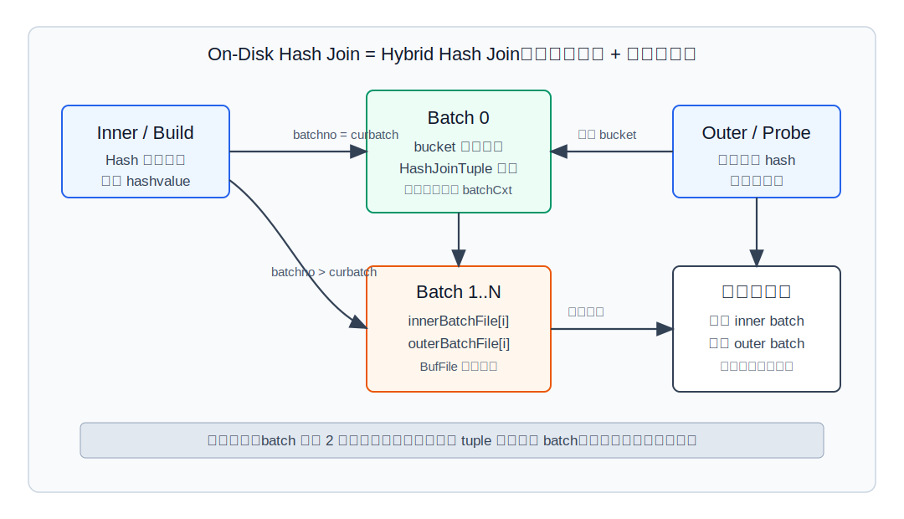
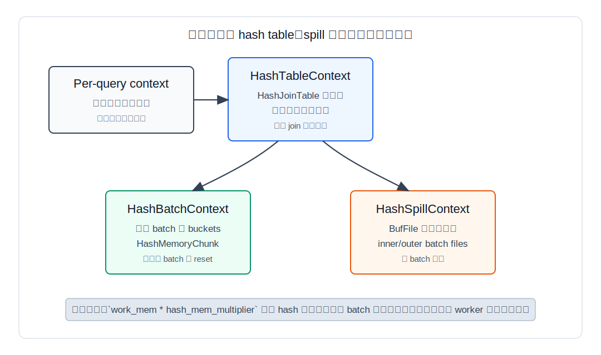
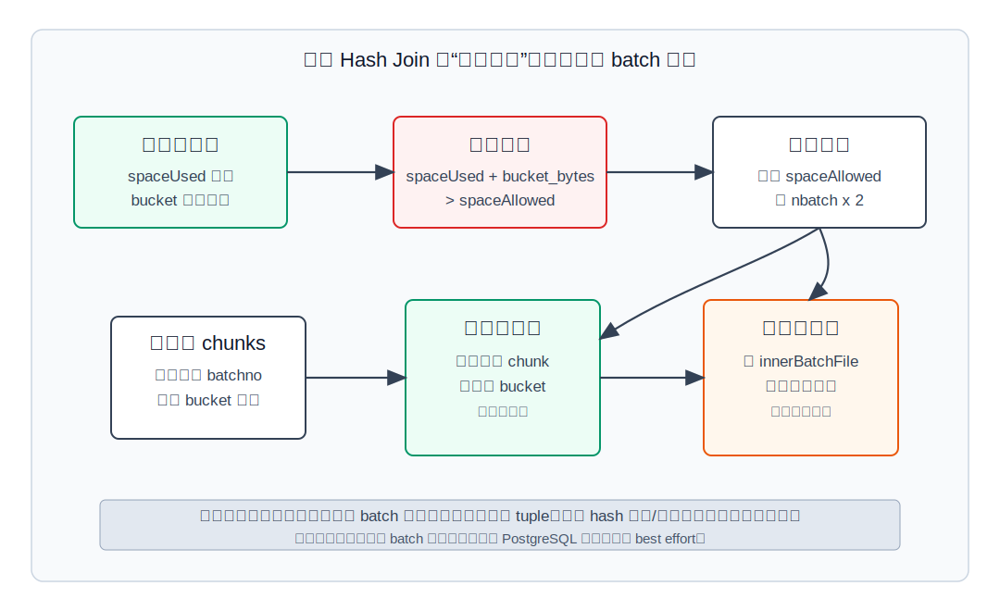
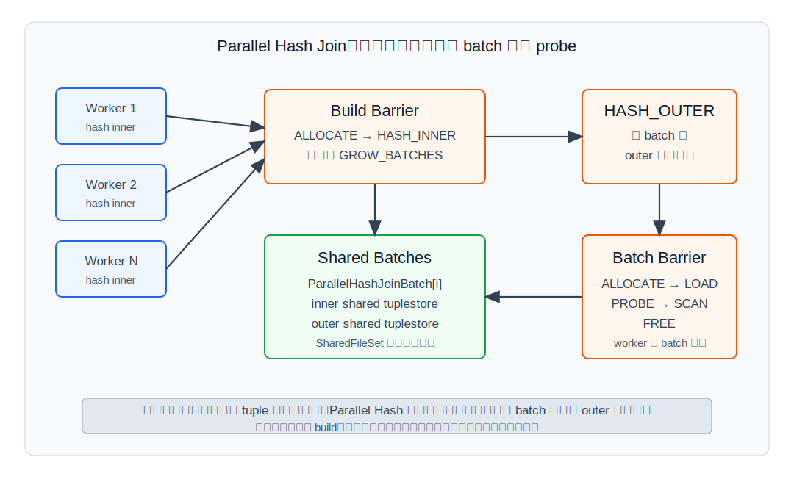
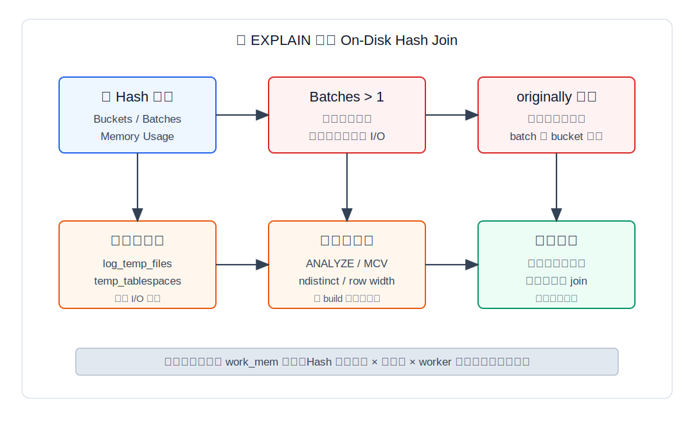

## 数据库筑基课 - On-Disk Hash Join

### 作者
digoal

### 日期
2026-05-30

### 标签
PostgreSQL , 应用开发者 , 数据库筑基课 , 执行算法 , 优化器 , Join , Hash Join , 临时文件 , 内存管理

----

## 背景


本文聚焦 **On-Disk Hash Join**：当 hash join 放不进内存时，PostgreSQL 如何把它变成多 batch 的 hybrid hash join。

本文以 PostgreSQL 本地源码、官方 SGML 文档、`postgres/CLAUDE.md` 和 DeepWiki 对 `postgres/postgres` 的架构摘要为主。用户给出的论文或分享 `An Architecture of Database Processor Oriented to Relational Operations`、`An Evaluation of Buffer Management Strategies for Relational Database Systems`、`Dynamic Hash Clustering: An Efficient Concurrency Control Assessment`、`Dynamic Memory Allocation for Hash Joins` 在当前项目中没有原文文件；我只把它们作为历史和概念背景：关系操作专用处理器强调把 join/sort/aggregate 作为物理算子优化对象，缓冲管理研究提醒临时 I/O 与缓存策略会改变算子表现，动态 hash/内存分配类研究关注运行期根据数据规模与倾斜调整分区。本文不引用无法本地核验的实验数字。

工程里经常看到这样的现象：

```text
Hash  (actual time=... rows=... loops=1)
  Buckets: 65536 (originally 32768)  Batches: 32 (originally 8)  Memory Usage: 4096kB
```

如果只看 `Hash Join` 这个节点名，会以为它仍是“内存算法”。但 `Batches: 32` 已经说明它不是纯内存 hash join，而是把 build 侧和 probe 侧拆成多批，当前批留在内存，后续批写临时文件。此时性能瓶颈可能从 CPU hash 计算变成临时文件 I/O、批次数爆炸、数据倾斜、内存参数和并发放大。

## 一、它解决什么问题？

Hash Join 的理想情况是 build/inner 侧能放进 `work_mem * hash_mem_multiplier` 预算内。问题是数据库面对的是运行期事实，不是优化器估算：

1. build 侧行数可能被低估。
2. 平均行宽可能被低估，尤其是宽列、表达式投影、toast 展开后的路径。
3. join key 分布可能倾斜，少数 hash value 挤爆一个 batch。
4. 并发查询很多时，单条 SQL 看似合理的内存设置会被节点数、worker 数和连接数放大。
5. 数据规模确实超过内存，完全拒绝 hash join 会让优化器只能选更差的 nested loop 或大排序 merge join。

On-Disk Hash Join 解决的是这个问题：**在 build 侧不能一次放入内存时，仍然保留 hash join 的等值分区思想，把一次大 join 拆成多个能逐批处理的小 join。**

它把问题转换成：

```text
原问题：inner 全部建表，outer 全部探测

转化后：
  batch 0：inner[0] 建表，outer[0] 探测
  batch 1：inner[1] 建表，outer[1] 探测
  ...
  batch N：inner[N] 建表，outer[N] 探测
```

代价也很明确：

1. tuple 要被写入和读出临时文件，增加 I/O。
2. 每个 batch 需要文件缓冲，batch 太多会让“分批省内存”反过来消耗更多内存。
3. 运行期 batch 增长会搬迁已经在内存中的 tuple。
4. 极端倾斜无法靠继续拆 batch 解决，因为同一个 hash value 仍会落到同一个 batch。
5. 并行 hash join 要用 barrier、shared tuplestore 和共享临时文件协调，减少重复 build 的同时引入同步成本。

## 二、它是什么？

On-Disk Hash Join 在 PostgreSQL 源码里不是独立计划节点，而是 `Hash Join` 的多 batch 执行形态。`src/backend/executor/nodeHashjoin.c` 顶部注释明确说该实现基于 **hybrid hash join**。当 inner 侧不适合一次放入内存时，执行器使用多个 batch；当前 batch 的 inner tuple 放在内存 hash table，其他 batch 的 inner/outer tuple 写入临时存储，后续逐批加载处理。

在 PostgreSQL 中，它对应以下层次：

| 层次 | 关键结构或函数 | 作用 |
|---|---|---|
| 计划选择 | `HashPath`、`initial_cost_hashjoin()`、`final_cost_hashjoin()` | 根据行数、行宽、hash clause、I/O 成本估算 hash join 和 batch 代价 |
| 内存预算 | `get_hash_memory_limit()` | 计算 `work_mem * hash_mem_multiplier * 1024` |
| 初始 sizing | `ExecChooseHashTableSize()` | 选择 `nbuckets`、`nbatch`、`space_allowed`、skew MCV 数 |
| 执行状态机 | `ExecHashJoinImpl()` | build、probe、补 outer/full/right 语义、切换 batch |
| 串行落盘 | `ExecHashJoinSaveTuple()` / `ExecHashJoinGetSavedTuple()` | 用 `BufFile` 写读 batch 临时文件 |
| 运行期增长 | `ExecHashIncreaseNumBatches()` | 当内存超过预算时，`nbatch` 翻倍并重分区内存 tuple |
| 并行落盘 | `ParallelHashJoinBatch`、`SharedTuplestore`、`SharedFileSet` | 多 worker 共享 batch 临时数据 |
| 观测 | `show_hash_info()` in `explain.c` | 输出 `Buckets`、`Batches`、`Memory Usage` 和 originally 信息 |

术语上要分清四组概念：

1. **bucket**：内存 hash table 的桶，桶内是 `HashJoinTuple` 链表。
2. **batch**：把整个 join 按 hash value 分成的批次。`nbatch > 1` 通常意味着 on-disk 行为。
3. **spill file**：串行 hash join 用 `BufFile` 保存未来批的 tuple。
4. **shared tuplestore**：parallel hash join 用共享临时存储保存 batch 数据，而不是每个 backend 私有 `BufFile`。

## 三、核心原理

### 3.1 Hybrid Hash Join：当前批在内存，未来批在磁盘

PostgreSQL 的串行 hash join 第一轮 build 时读取 inner 侧。每条 inner tuple 计算 hash value 后，`ExecHashGetBucketAndBatch()` 决定它属于哪个 bucket 和 batch：

```text
bucketno = hashvalue MOD nbuckets
batchno  = rotated_hash_bits MOD nbatch
```

如果 `batchno == curbatch`，tuple 进入当前内存 hash table；否则写入 `innerBatchFile[batchno]`。第一轮 probe outer 时同理：当前 batch 的 outer tuple 直接探测，未来 batch 的 outer tuple 写入 `outerBatchFile[batchno]`。



图 1 说明：On-Disk Hash Join 的核心不是“hash table 写到磁盘上继续随机查”，而是“把两侧按同一 hash 分区规则写成 batch，后续每次只加载一个 inner batch 到内存，再扫描对应 outer batch”。因此它仍然是 hash join，只是执行边界从“一张内存表”变成“多轮内存表”。

这个设计有一个关键性质：`nbatch` 总是 2 的幂。源码注释强调，运行期增加 batch 时，hash-value-to-batch 的计算方式保证 tuple 只会进入更晚 batch，不会回到更早 batch。这样执行器可以按 batch 顺序推进，不需要倒回已经完成的批次。

### 3.2 临时文件格式：hash value + MinimalTuple

串行执行时，batch 文件由 `ExecHashJoinSaveTuple()` 写入。每条记录格式很简单：

```text
uint32 hashvalue
MinimalTuple tuple
```

读取时 `ExecHashJoinGetSavedTuple()` 先读两个 `uint32`：第一个是 hash value，第二个刚好是 `MinimalTuple` 的长度字段，然后再读完整 tuple 内容。保存 hash value 的原因很务实：后续加载 batch 时不需要重新计算 hash key，直接用保存的 hash value 放入 bucket。

`BufFile` 是 PostgreSQL 的虚拟临时文件抽象。batch 文件是懒创建的：某个 batch 第一次写 tuple 时才创建文件。处理完某个 batch 后，相关 inner 或 outer 文件会尽早 `BufFileClose()`，释放文件和缓冲资源。

### 3.3 内存上下文：hashCxt、batchCxt、spillCxt

`src/include/executor/hashjoin.h` 对 hash join 的内存生命周期写得很清楚。每个 active hash join 有三个子上下文：

| 内存上下文 | 生命周期 | 主要内容 |
|---|---|---|
| `HashTableContext` / `hashCxt` | 整个 hash join | HashJoinTable 元数据、文件数组、子上下文父节点 |
| `HashBatchContext` / `batchCxt` | 当前 batch | bucket 数组、当前批的 `HashMemoryChunk`、tuple 链表 |
| `HashSpillContext` / `spillCxt` | 整个 hash join | `BufFile`、临时文件缓冲、spill 相关对象 |



图 2 说明：`batchCxt` 可以在每个 batch 结束后 reset，快速释放当前批 hash table；`spillCxt` 必须跨 batch 存活，因为后续批的文件还没读；`hashCxt` 作为父上下文保证异常退出时能跟语句一起清理。理解这三个上下文，才能理解为什么临时文件缓冲也会进入内存账本。

`ExecChooseHashTableSize()` 还有一个容易被忽略的优化：初始 `nbatch` 计算后，它会考虑每个 batch 可能有 inner/outer 两个文件、每个文件有 `BLCKSZ` 缓冲。源码注释把总内存近似写成：

```text
(inner_rel_bytes / nbatch) + (2 * nbatch * BLCKSZ)
```

这是一条 U 形曲线：batch 太少，内存 hash table 太大；batch 太多，文件缓冲太多。PostgreSQL 会尝试“往回走”，在不盲目增加 batch 的情况下减少整体内存占用。

### 3.4 运行期 batch 增长：估算错了怎么办？

优化器的 batch 估计可能错。执行器在 `ExecHashTableInsert()` 中维护 `spaceUsed` 和 `spacePeak`。当插入当前 batch 的 tuple 后发现：

```text
spaceUsed + nbuckets * sizeof(HashJoinTuple) > spaceAllowed
```

就会尝试 `ExecHashIncreaseNumBatches()`。



图 3 说明：运行期增长不是简单把一个变量从 8 改成 16。执行器要扫描当前内存里的旧 chunks，按新的 `nbatch` 重新计算每个 tuple 的 batch。如果仍属于当前批，就复制到新 chunk 并重新挂 bucket；如果属于未来批，就写入对应 `innerBatchFile` 并释放当前内存。

PostgreSQL 现在还会先调用 `ExecHashIncreaseBatchSize()` 做一次判断：如果继续增加 batch 带来的文件缓冲开销，比扩大当前 hash table 预算还大，就选择扩大 `spaceAllowed`，而不是机械翻倍 `nbatch`。这是一种损害控制：当 batch 文件缓冲本身已经很贵时，继续拆批未必更省内存。

但增长不是无限有效。源码注释说，如果增加 batch 后某个 batch 保留了全部 tuple 或没有保留任何 tuple，就说明分布极端倾斜，继续增长没有意义，执行器会关闭进一步增长。典型原因是大量 tuple 拥有相同 hash value；同一 hash value 不可能靠更多 batch 被拆散。

### 3.5 切换 batch：重新加载 inner，再扫描 outer

当前 batch 处理完后，串行执行进入 `HJ_NEED_NEW_BATCH`，调用 `ExecHashJoinNewBatch()`：

1. 关闭上一批不再需要的 outer batch 文件。
2. 第一批结束后，关闭 skew 优化状态，因为 skew tuple 只在第一批特殊处理。
3. 跳过两侧都空的 batch；但 outer/full/right join 语义、运行期 `nbatch` 增长可能要求不能跳过单侧空 batch。
4. reset 当前 hash table。
5. rewind 当前 inner batch 文件，逐条读取并插入 hash table。
6. rewind 当前 outer batch 文件，准备 probe。

注意第 5 步还有递归风险：加载后续 inner batch 时，`ExecHashTableInsert()` 仍可能发现当前批太大，继续增加 `nbatch`。因此“后续 batch 文件里的 tuple 一定属于当前 batch”并不总成立；如果 batch 数增长过，读取时还可能把 tuple 再次推到更晚 batch。

### 3.6 Skew 优化：热点值尽量不落盘，但不是万能药

PostgreSQL 会尝试根据 outer 侧 MCV 统计构建 skew hash table。inner 侧命中这些热点 hash value 的 tuple 会进入 skew table，而不是普通 batch。probe 侧热点 key 也直接查 skew table。这样热点值可以在第一批处理，避免被写入磁盘 batch。

约束也很硬：

1. skew table 只使用总 hash join 内存预算的一小部分，源码常量 `SKEW_HASH_MEM_PERCENT` 为 2。
2. 如果 skew table 超过自己的预算，执行器会减少被特殊处理的 MCV。
3. 它优化的是“统计信息能识别的热点值”，不是任意倾斜。
4. 如果热点值大到单个 hash value 本身超过内存，继续增加 batch 仍然解决不了。

所以 DBA 不应该把 skew 优化当成兜底能力。它更像“已知热点的 I/O 减免”，不是“任意数据倾斜免疫”。

### 3.7 Parallel Hash Join：共享 batch 与 barrier 协作

PostgreSQL 支持两类并行相关形态：

1. **parallel-oblivious hash join**：每个 worker 各建一份私有 hash table。实现简单，但 build 侧 CPU 和内存重复。
2. **parallel-aware hash join**：`EXPLAIN` 中显示 `Parallel Hash Join`，并配套 `Parallel Hash` 节点。多个 backend 协作构建共享 hash table。

多 batch 的 Parallel Hash Join 和串行算法有一个重要差异：串行算法可以边扫描 outer 边把不属于当前批的 tuple 推到未来批；parallel-aware 算法为了让不同 batch 能被 worker 独立处理，在 build 阶段如果是多 batch，需要先进入 `PHJ_BUILD_HASH_OUTER`，把 outer 也预先分区。



图 4 说明：Parallel Hash Join 用 build barrier 协调 allocate、hash inner、必要时 grow batches/buckets；用每个 batch 自己的 barrier 协调 allocate、load、probe、scan、free。batch 数据放在 shared tuplestore 中，底层由 `SharedFileSet` 管理共享临时文件。

Parallel Hash 的收益是避免每个 worker 重复构建完整 build 侧 hash table，并能在 batch 多时把批次分给不同 worker。代价是同步、共享内存访问、shared tuplestore 写读和 barrier 状态管理。数据量不大、batch 不多、并发内存足够时，并行不一定比单进程私有 hash table 更划算。

### 3.8 EXPLAIN 暴露了什么？

`src/backend/commands/explain.c:show_hash_info()` 会显示 Hash 节点的：

```text
Buckets: <nbuckets>  Batches: <nbatch>  Memory Usage: <space_peak>kB
```

如果运行期 bucket 或 batch 发生变化，会显示：

```text
Buckets: <nbuckets> (originally <nbuckets_original>)
Batches: <nbatch> (originally <nbatch_original>)
Memory Usage: <space_peak>kB
```

官方 `perform.sgml` 也说明，`EXPLAIN ANALYZE` 中 Hash 节点会显示 bucket、batch 和 hash table 峰值内存；如果 batch 数超过 1，就涉及额外磁盘空间。



图 5 说明：第一眼看 `Batches`。`Batches: 1` 是纯内存或至少没有多 batch；`Batches > 1` 说明发生多批执行。再看 `originally`：如果实际 batch 大于 original，说明优化器估算或运行期数据分布让执行器临时扩批。最后结合 `log_temp_files`、`temp_tablespaces` 和 `EXPLAIN (ANALYZE, BUFFERS)` 观察临时 I/O。

## 四、横向对比

| 维度 | On-Disk Hash Join | In-Memory Hash Join | Merge Join | Nested Loop |
|---|---|---|---|---|
| 主要目标 | build 侧超过内存时仍可 hash join | build 侧放入内存后快速 probe | 两侧有序流同步合并 | outer 行驱动 inner 重扫 |
| 核心结构 | batch 临时文件 + 当前批 hash table | 单个内存 hash table | Sort/索引顺序 + mark/restore | 参数化 inner path |
| 启动成本 | build + 分批写文件，较高 | build hash table | 若需排序则高 | 通常低 |
| I/O 形态 | 临时文件写读，可能很多 | 主要读输入 | 排序可能落盘 | 取决于 inner 访问 |
| 内存压力 | hash table + batch 文件缓冲 | hash table | sort/materialize | 通常较低 |
| 对倾斜敏感性 | 高，同 hash value 不能靠拆批解决 | 高，bucket 链变长 | 重复 key 导致重扫 | outer 行数放大 inner 成本 |
| 输出顺序 | 不保序 | 不保序 | 可保留 join key 顺序 | 通常跟 outer 相关 |
| 适合场景 | 大等值 join、build 侧略超内存、顺序不可利用 | build 侧可控的大等值 join | 两侧已有序或下游需要有序 | 小 outer + inner 高效索引 |
| 不适合场景 | 极端倾斜、临时盘慢、并发内存紧张 | build 侧远超内存 | 无序大输入且排序昂贵 | outer 大且 inner 无索引 |

这张表背后的原因是：On-Disk Hash Join 不是一种“更快 hash join”，而是一种“让 hash join 在内存不足时还能完成”的退化路径。它比错误的 nested loop 稳定，比强行排序可能便宜，但一定比理想的 in-memory hash join 多付临时 I/O 和批次管理成本。

## 五、效果如何？

收益：

1. **避免内存硬失败**：build 侧超过预算时，仍能通过多 batch 完成等值 join。
2. **保持 hash join 的候选集缩小能力**：每个 batch 内仍按 bucket 定位，而不是全量比较。
3. **运行期自适应**：估算偏小导致 hash table 过大时，可以 `nbatch` 翻倍并重分区。
4. **并行可协作**：Parallel Hash Join 可以构建共享 hash table，batch 多时 worker 可处理不同 batch。

成本：

1. **临时文件 I/O**：inner 和 outer 的未来批都可能写盘，后续还要读回。
2. **batch 文件缓冲占内存**：`2 * nbatch * BLCKSZ` 这类开销会在 batch 很多时变成主导。
3. **CPU 重分区成本**：运行期增长需要扫描旧 chunks、复制当前批 tuple、写出未来批 tuple。
4. **倾斜风险**：大量相同 hash value 会让某个 batch 无法缩小，增长会被禁用。
5. **观测滞后**：只有 `EXPLAIN ANALYZE` 或日志能告诉你实际 batch 是否增长；普通 `EXPLAIN` 只能看估算计划。

不要编造“Batches=32 一定慢多少倍”这种数字。实际代价取决于临时盘、缓存命中、tuple 宽度、batch 文件大小、并发、是否并行、outer 过滤率和 join 输出规模。

## 六、实操 DEMO

下面给一个最小可验证实验，用来制造 hash join 多 batch。当前环境没有启动 PostgreSQL 实例，因此本文不伪造 `EXPLAIN ANALYZE` 输出；SQL 语法按 PostgreSQL 编写，读者可在本地库执行。

```sql
CREATE TEMP TABLE hj_inner AS
SELECT g AS id, repeat('x', 200) AS payload
FROM generate_series(1, 500000) AS g;

CREATE TEMP TABLE hj_outer AS
SELECT g AS id, repeat('y', 50) AS payload
FROM generate_series(1, 500000) AS g;

ANALYZE hj_inner;
ANALYZE hj_outer;

SET enable_nestloop = off;
SET enable_mergejoin = off;
SET enable_hashjoin = on;

-- 为了更容易观察多 batch，故意压低单节点 hash 内存。
SET work_mem = '1MB';
SET hash_mem_multiplier = 1.0;

EXPLAIN (ANALYZE, BUFFERS, SUMMARY)
SELECT count(*)
FROM hj_outer o
JOIN hj_inner i ON i.id = o.id;
```

观察点：

```text
Hash
  Buckets: ...
  Batches: ...              -- 大于 1 即多 batch
  Memory Usage: ...kB
```

如果看到：

```text
Batches: 64 (originally 8)
```

说明执行器运行期发现原估算不够，触发了 batch 增长。若打开 `log_temp_files = 0`，还可以从日志看到临时文件写入规模。生产上不建议长期把 `log_temp_files` 设为 0；可以在问题窗口、测试环境或按阈值启用。

再做对照实验：

```sql
SET work_mem = '64MB';
SET hash_mem_multiplier = 2.0;

EXPLAIN (ANALYZE, BUFFERS, SUMMARY)
SELECT count(*)
FROM hj_outer o
JOIN hj_inner i ON i.id = o.id;
```

预期观察不是“时间一定更快”，而是：

1. `Batches` 是否下降到 1 或明显减少。
2. 临时文件日志是否减少。
3. 总耗时是否受 CPU、I/O 或并行调度影响。
4. 并发场景下内存峰值是否仍安全。

## 七、最佳实践

### 面向数据库架构师

1. **把 hash join 内存当成并发预算，不是单 SQL 参数。** 估算方式至少要考虑：活跃连接数 × 每条 SQL 的 hash/sort 节点数 × parallel worker 数 × `work_mem * hash_mem_multiplier`。
2. **为临时 I/O 设计隔离。** 大报表、ETL、临时 hash join 多的系统，应规划 `temp_tablespaces`、临时盘带宽和监控，不要和 WAL、主数据文件争同一块慢盘。
3. **用数据模型减少宽 build 侧。** Hash Join 存的是 build 侧投影后的 tuple。能提前投影列、提前过滤、避免把大 JSON/text 列带入 build 侧，就能直接减少 batch。
4. **对倾斜 key 做建模。** 如果业务天然有超级热点，例如默认租户、未知用户、空编码、特殊状态，不要指望 hash join 自动消化。可考虑拆 SQL、分区、预聚合或单独处理热点。

### 面向 DBA

1. **先看 `Batches`，再调内存。** `Batches > 1` 是 on-disk 线索；`originally` 变大说明估算不准或数据分布异常。
2. **维护统计信息。** 对 join key 执行 `ANALYZE`，必要时提高列统计目标，让 MCV、ndistinct 和行数估算更接近真实。
3. **监控临时文件。** 用 `log_temp_files`、`pg_stat_statements` 的 temp block 指标、系统 I/O 监控一起定位。不要只看 CPU。
4. **谨慎调大 `work_mem`。** PostgreSQL 文档明确说复杂查询可能同时运行多个 sort/hash 操作，且并行 worker 会让内存限制按 worker 应用。单会话测试通过，不代表生产并发安全。
5. **必要时比较 Join 方法。** 暂时关闭 `enable_hashjoin`、`enable_mergejoin` 或 `enable_nestloop` 只适合诊断，不适合作为长期粗暴修复。长期修复应回到统计、索引、SQL、内存和数据分布。

### 面向业务开发者

1. **不要 SELECT 多余大列参与 join 中间结果。** 先 join key 和必要列，后取宽字段，常常比把大字段塞进 build 侧更稳。
2. **避免把过滤条件写到 join 后才生效。** 能在 build 侧或 probe 侧提前过滤的条件，应让优化器有机会提前下推。
3. **关注 NULL 和特殊值。** 大量 NULL 或默认值不仅影响结果语义，也可能造成统计偏差和热点。
4. **分页/报表不要无限放大中间结果。** `count(*)`、大宽表 join、无选择性条件叠加，会把 hash join 推向临时文件。

## 八、适合与不适合场景

适合：

1. 大规模等值 join，且没有可直接利用的有序输入。
2. build 侧略超内存，但临时盘足够快，batch 数可控。
3. 报表、ETL、批处理类查询，首行延迟不是最关键指标。
4. 并行查询环境中，build 侧可共享，batch 可分给多个 worker。

不适合：

1. join key 极端倾斜，单个热点值对应大量 tuple。
2. 临时文件目录在慢盘或空间紧张的磁盘上。
3. OLTP 高频小查询，首行延迟和抖动比吞吐更重要。
4. build 侧非常宽且无法提前投影，导致 batch 文件巨大。
5. 系统并发很高，调大 `work_mem` 会把整体内存打穿。
6. 非等值 join 或主要谓词不是 hashable equality。

## 九、常见坑

1. **看到 Hash Join 就以为是内存执行。** 应看 Hash 节点下的 `Batches`。`Batches > 1` 就要考虑临时文件。
2. **只调 `work_mem`，忘了 `hash_mem_multiplier`。** Hash 类操作的预算由二者相乘，源码 `get_hash_memory_limit()` 就是这样计算。
3. **忽略并发乘数。** 一个会话调到 256MB 可能很快，100 个并发会话可能直接触发内存压力。
4. **把 `enable_hashjoin = off` 当修复。** 这只是让优化器避开 hash join，可能换来更差的 sort 或 nested loop。
5. **不更新临时表统计信息。** 临时表自动统计不一定及时，批处理里 `CREATE TEMP TABLE AS` 后应主动 `ANALYZE`。
6. **误读 `Memory Usage`。** 它是 Hash 节点报告的峰值 hash table 内存，不等于整个查询总内存，也不等于临时文件总大小。
7. **忽视 batch 增长。** `Batches: 64 (originally 8)` 比 `Batches: 64` 更值得追，因为它说明计划阶段低估了执行压力。
8. **热点 key 没拆出来。** 如果某个租户或状态占 80% 数据，单靠更多 batch 无法把同一个 hash value 拆开。

## 十、扩展问题

1. 如果把 `work_mem` 从 4MB 调到 64MB，为什么某些 hash join 仍然 `Batches > 1`？
2. 为什么 batch 数必须是 2 的幂？这和运行期只把 tuple 推到未来批有什么关系？
3. `Batches` 没变，但 `Buckets` 从 originally 变大，说明什么？
4. 为什么 Parallel Hash Join 在多 batch 时要先分区 outer，而串行 hash join 可以边 probe 边写未来 batch？
5. 当某个 key 极端热点时，应该调内存、建索引、拆 SQL、预聚合，还是修改数据模型？如何验证？
6. 如果同一查询在测试库 `Batches: 1`，生产库 `Batches: 32`，你会先检查统计信息、参数、数据分布还是并发？

## 十一、扩展阅读

本地源码与文档：

1. [postgres/src/backend/executor/nodeHashjoin.c](../postgres/src/backend/executor/nodeHashjoin.c)：Hash Join 状态机、hybrid hash join 注释、batch 切换、串行/并行执行入口。
2. [postgres/src/backend/executor/nodeHash.c](../postgres/src/backend/executor/nodeHash.c)：hash table sizing、batch 增长、bucket/batch 计算、parallel hash 构建。
3. [postgres/src/include/executor/hashjoin.h](../postgres/src/include/executor/hashjoin.h)：`HashJoinTableData`、`ParallelHashJoinState`、内存上下文、skew table、batch 结构。
4. [postgres/src/backend/commands/explain.c](../postgres/src/backend/commands/explain.c)：`show_hash_info()` 输出 `Buckets`、`Batches`、`Memory Usage`。
5. [postgres/doc/src/sgml/config.sgml](../postgres/doc/src/sgml/config.sgml)：`work_mem`、`hash_mem_multiplier`、`temp_file_limit`、`log_temp_files`、`temp_tablespaces`、`enable_hashjoin`。
6. [postgres/doc/src/sgml/perform.sgml](../postgres/doc/src/sgml/perform.sgml)：官方 `EXPLAIN` 示例和 hash join 解释。
7. [postgres/CLAUDE.md](../postgres/CLAUDE.md)：当前本地 PostgreSQL 项目结构和构建说明。
8. DeepWiki `postgres/postgres`：用于交叉确认 hash join 相关文件和架构摘要，关键结论已回到本地源码核对。

相关论文或分享：

1. `An Architecture of Database Processor Oriented to Relational Operations`：可作为理解“关系操作物理算子硬件/系统协同”的历史背景。
2. `An Evaluation of Buffer Management Strategies for Relational Database Systems`：可作为理解临时 I/O、缓冲策略与关系算子表现关系的背景。
3. `Dynamic Hash Clustering: An Efficient Concurrency Control Assessment`：可作为动态 hash 分布、并发控制与存储组织权衡的背景。
4. `Dynamic Memory Allocation for Hash Joins`：可作为 hash join 运行期内存分配与批次调整问题的背景。

由于上述论文原文未在当前项目中找到，本文没有引用其具体实验结论。若后续提供 PDF 或本地路径，可以进一步补充论文算法假设、实验条件和与 PostgreSQL 实现的差异。
  
## 附录 
1、询问 gemini
```
On-Disk Hash Join 相关的论文
```

2、克隆代码  
```  
git clone --depth 1 https://github.com/postgres/postgres
```  
  
3、启用 codex, 使用 [数据库筑基课 skill](../skills/README.md).  
```
文章标题: 
  数据库筑基课 - On-Disk Hash Join
项目源码(已克隆到当前项目如下目录中):  
  postgres
相关论文或分享:
  An Architecture of Database Processor Oriented to Relational Operations
  An Evaluation of Buffer Management Strategies for Relational Database Systems
  Dynamic Hash Clustering: An Efficient Concurrency Control Assessment
  Dynamic Memory Allocation for Hash Joins
项目 deepwiki reponame:  
  postgres/postgres
项目参考信息: 
  postgres/CLAUDE.md
```
  
  
#### [PostgreSQL 解决方案集合](../201706/20170601_02.md "40cff096e9ed7122c512b35d8561d9c8")
  
  
#### [德哥 / digoal's Github - 公益是一辈子的事.](https://github.com/digoal/blog/blob/master/README.md "22709685feb7cab07d30f30387f0a9ae")
  
  
#### [About 德哥](https://github.com/digoal/blog/blob/master/me/readme.md "a37735981e7704886ffd590565582dd0")
  
  

  
