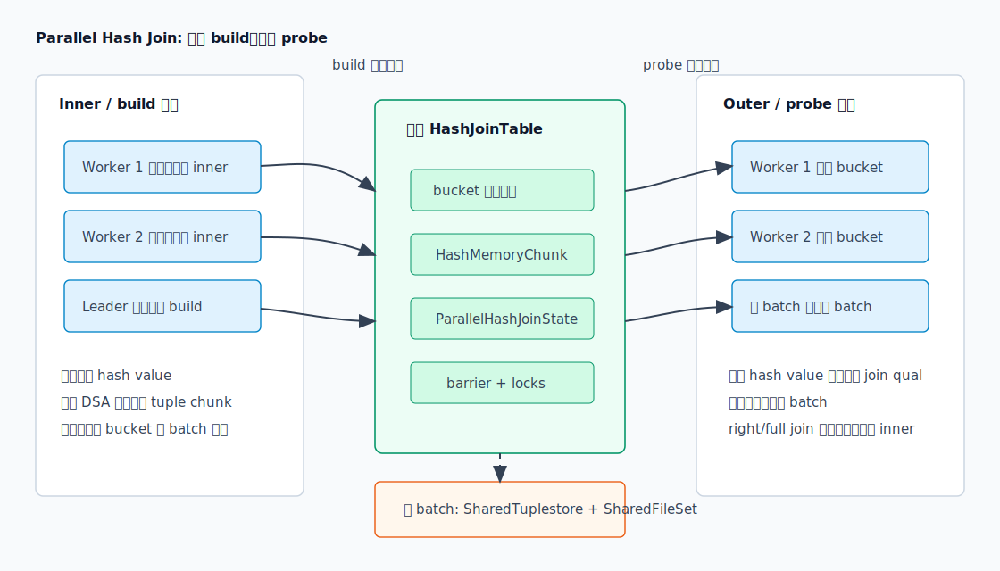
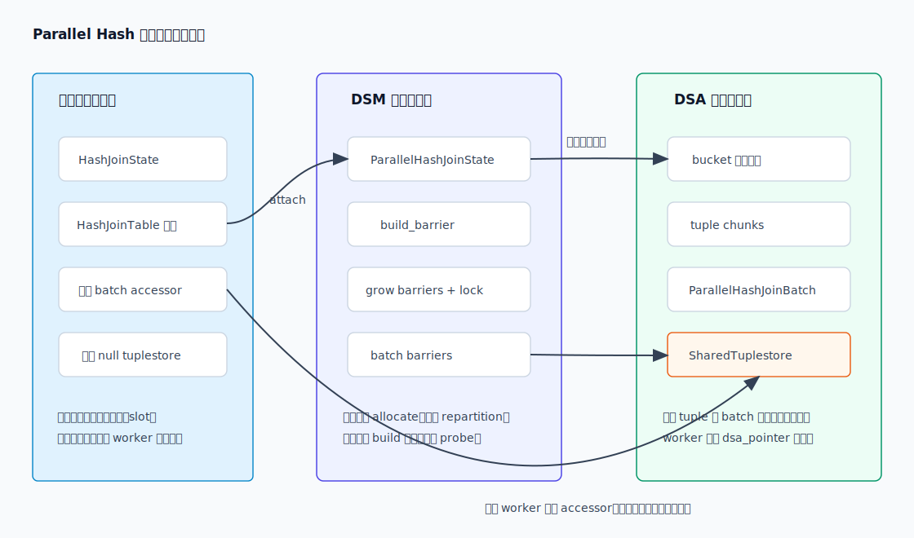
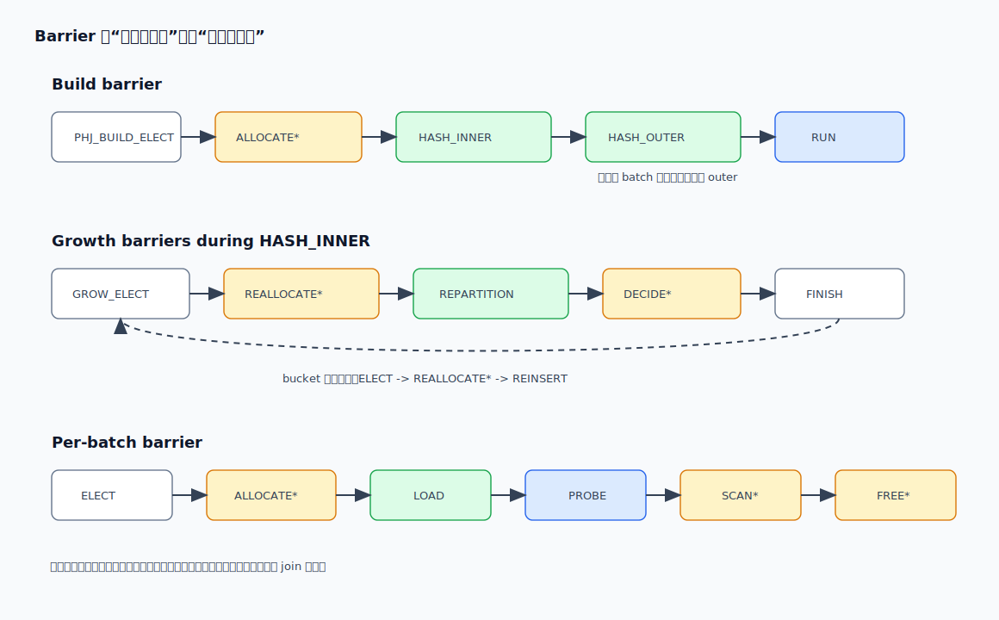
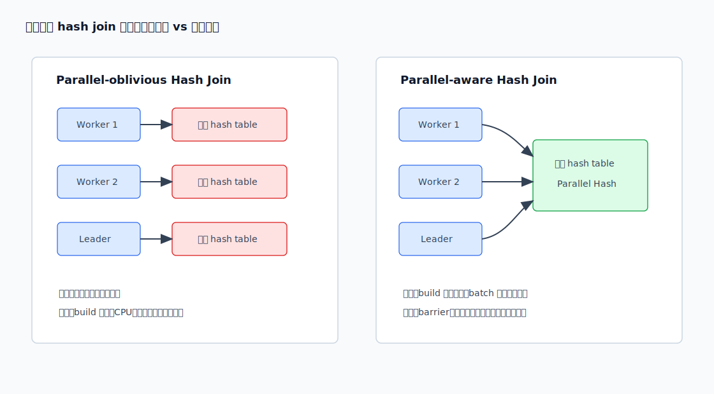
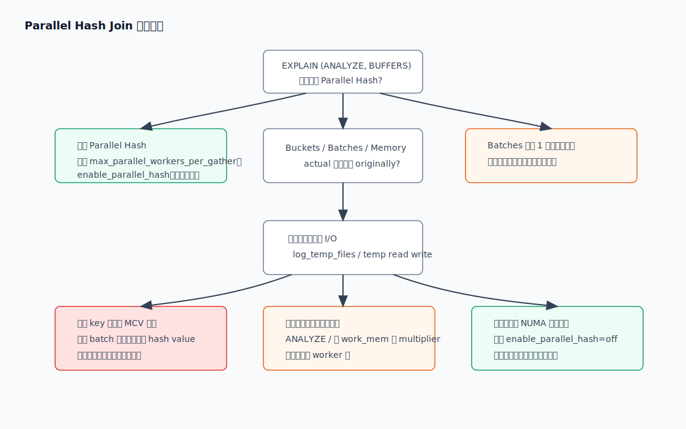

## 数据库筑基课 - Parallel Hash Join

### 作者
digoal

### 日期
2026-05-30

### 标签
PostgreSQL , 应用开发者 , 数据库筑基课 , 执行算法 , 优化器 , Join , Hash Join , Parallel Query , 共享内存

----

## 背景


本文聚焦 **Parallel Hash Join**：当一条等值连接进入 PostgreSQL 并行执行框架后，多个 backend 如何协作构建共享哈希表、如何分配 batch、如何用 barrier 避免互相踩踏，以及 DBA 应该如何诊断它。

本文主要依据 PostgreSQL 本地源码、官方文档、`postgres/CLAUDE.md` 和用户提供的三篇论文题目。DeepWiki `postgres/postgres` 查询在本次环境中返回错误，未能取得可引用内容；因此本文所有关键机制均回到本地源码和官方文档验证。用户提供的论文或分享：

1. `Hash Join Algorithms on Shared-Memory Multiprocessors`
2. `Main-Memory Hash Joins on Multi-Core CPUs: Tuning to the Underlying Hardware`
3. `Design and Implementation of Parallel Hash Join Algorithms for Main-Memory Database Systems`

本地项目没有这些论文全文，公开检索在本次环境中也没有拿到可稳定引用的原文 PDF。因此本文只把它们作为硬件意识背景：共享内存机器上的并行 hash join 重点不是“开更多线程”这么简单，而是 hash table 共享方式、分区粒度、cache/TLB、本地内存、同步、内存带宽和数据倾斜之间的平衡。本文不引用无法核验的实验数字。

业务上，Parallel Hash Join 常出现在这样的场景：一张事实表很大，一张维表或过滤后的明细表仍然不小；单进程 Hash Join 能跑，但 CPU 利用不充分；Nested Loop 放大随机访问，Merge Join 又需要排序或已有顺序。于是我们希望：

```text
多个 worker 并行扫描输入
        ↓
共同构建一张共享 hash table
        ↓
再并行 probe，输出 join 结果
```

真正的难点在于共享。每个 worker 各建一份 hash table 很简单，但会重复 build 侧 CPU 和内存；大家共用一张 hash table 可以省掉重复 build，却引入锁、barrier、共享内存、batch 临时文件、NUMA 远程访问和 straggler 问题。Parallel Hash Join 解决的是“如何把 Hash Join 变成可协作的并行算子”，不是“让 Hash Join 自动无限加速”。

## 一、它解决什么问题？

普通 Hash Join 的核心是 build/probe 两阶段：

1. 读取 inner/build 输入，按 join key 计算 hash value。
2. 把 build 侧 tuple 插入哈希表。
3. 读取 outer/probe 输入，计算 hash value，定位 bucket。
4. 扫描 bucket 链表，执行 hash qual、join qual 和 other qual。

在并行查询中，如果每个 worker 都按普通方式执行一遍 build，问题很直接：

```text
3 个参与者 = 3 份 build 扫描 + 3 份 hash table + 3 份内存预算压力
```

PostgreSQL 源码在 `nodeHashjoin.c` 顶部把两种形态分清楚：

| 形态 | EXPLAIN 表现 | build 侧 | hash table | 主要代价 |
|---|---|---|---|---|
| parallel-oblivious hash join | 普通 `Hash Join`，处在并行计划中 | 每个 backend 自己执行 | 每个 backend 私有一份 | 重复 build、重复内存，但同步少 |
| parallel-aware hash join | `Parallel Hash Join` + `Parallel Hash` | 多个 backend 协作执行 | 一份共享 hash table | 避免重复 build，但要同步和共享访问 |

Parallel Hash Join 解决的是第二种问题：**让多个参与者共同构建和使用同一张 hash table，并在多 batch 时共同处理不同批次。**

它带来的收益：

1. build 侧不必被每个 worker 完整复制。
2. 单 batch 时可以尝试使用所有参与者合计的 hash memory，减少 spill 概率。
3. 多 batch 时不同 worker 可以处理不同 batch，或者在 batch 不够多时一起处理同一批。
4. 对大表等值连接，可以同时利用并行扫描、并行 build 和并行 probe。

它牺牲的东西也很明确：

1. 所有参与者必须被 barrier 阶段约束，不能各跑各的。
2. 共享 hash table 的 tuple 分配、bucket 增长、batch 增长需要协调。
3. 多 batch 时，parallel-aware 算法要预先分区 outer，不能像串行算法那样边扫边把 tuple 扔到未来 batch。
4. 数据倾斜、慢 worker、NUMA 远程内存、临时文件 I/O 都可能抵消并行收益。

## 二、它是什么？

Parallel Hash Join 是 PostgreSQL Hash Join 在并行执行框架下的 parallel-aware 实现。它不是单独的 SQL 语法，也不是一个和 Hash Join 完全不同的连接算法；它仍然是等值连接的 hash join，只是把“建表”和“探测”的状态放到动态共享内存中，并用 barrier 协调多个 backend。

典型执行计划形态如下：

```text
Gather
  Workers Planned: 2
  ->  Parallel Hash Join
        Hash Cond: (f.customer_id = d.customer_id)
        ->  Parallel Seq Scan on fact_order f
        ->  Parallel Hash
              ->  Parallel Seq Scan on dim_customer d
```

术语要分清：

| 术语 | 含义 | PostgreSQL 关键位置 |
|---|---|---|
| `Parallel Hash Join` | Join 节点，负责 probe、输出、outer/full/right 语义 | `src/backend/executor/nodeHashjoin.c` |
| `Parallel Hash` | Hash 节点，负责协作构建共享 hash table | `src/backend/executor/nodeHash.c` |
| `ParallelHashJoinState` | DSM 中的共享控制状态，包括 barrier、lock、batch 指针 | `src/include/executor/hashjoin.h` |
| `ParallelHashJoinBatch` | 每个 batch 的共享状态，包括 batch barrier、tuple chunks、shared tuplestore | `src/include/executor/hashjoin.h` |
| DSA | dynamic shared area，保存共享 tuple、bucket 数组等可变大小对象 | `dsa_pointer`、`dsa_area` |
| DSM | dynamic shared memory，保存共享控制结构和可被 worker attach 的内存段 | executor parallel 框架 |
| barrier | 多参与者同步原语，所有 attach 的参与者到达后进入下一阶段 | `storage/barrier.h` |

PostgreSQL 官方文档说明：`work_mem` 是排序、hash table 等操作写临时文件前的基础内存上限；hash 类操作的限制由 `work_mem * hash_mem_multiplier` 决定，默认 multiplier 为 2.0。并行查询还要注意，worker 是独立进程，资源限制通常按 worker 分别应用，总资源消耗可能远大于单进程计划。

## 三、核心原理

### 3.1 执行总览：共享 build，协作 probe

`src/backend/executor/nodeHashjoin.c` 的注释给出 Parallel Hash Join 的核心定义：parallel-aware hash join 会在多个 backend 之间协调工作，并在 `EXPLAIN` 中显示为 `Parallel Hash Join`；它总是和 `Parallel Hash` 节点一起出现。执行器入口仍然走 `ExecHashJoinImpl()`，只是 parallel 参数为 true 时走并行分支。



图 1 说明：Parallel Hash Join 的 build 侧由多个参与者一起扫描并插入共享 hash table；probe 侧可以直接并行扫描 outer，也可以在多 batch 情况下从 shared tuplestore 中领取 batch 数据。共享 hash table 避免了每个 worker 重复 build，但把问题转化为共享内存分配、barrier 同步和 batch 调度。

执行路径可以简化成：

```text
ExecHashJoinImpl(parallel = true)
  -> ExecHashTableCreate()
       第一个到达者创建共享状态，后到者 attach
  -> MultiExecParallelHash()
       协作扫描 inner，构建共享 hash table
       必要时增长 buckets 或 batches
  -> 若多 batch，ExecParallelHashJoinPartitionOuter()
       build 阶段预先分区 outer
  -> ExecParallelHashJoinNewBatch()
       各参与者选择 batch，load/probe/scan/free
```

这里最重要的差异是：串行 Hash Join 可以在扫描 outer 时把未来 batch 的 tuple 继续写到未来文件；parallel-aware Hash Join 为了让 batch 能独立分配给不同 worker，在多 batch 时要先把 outer 也分区完成。

### 3.2 共享数据结构：控制面和数据面分离

`hashjoin.h` 把共享状态分成两类。

第一类是控制面，核心是 `ParallelHashJoinState`：

```text
ParallelHashJoinState
  batches / old_batches
  nbatch / old_nbatch / nbuckets
  growth
  nparticipants
  space_allowed
  lock
  build_barrier
  grow_batches_barrier
  grow_buckets_barrier
  distributor
  SharedFileSet fileset
```

第二类是每个 batch 的共享状态，核心是 `ParallelHashJoinBatch`：

```text
ParallelHashJoinBatch
  buckets
  batch_barrier
  chunks
  size / estimated_size / ntuples
  space_exhausted
  skip_unmatched
  SharedTuplestore inner
  SharedTuplestore outer
```



图 2 说明：worker 私有状态保存当前执行位置、slot 和表达式上下文；DSM 中的 `ParallelHashJoinState` 管 barrier、锁、batch 元数据和共享临时文件集合；DSA 中保存 bucket 数组、tuple chunks 和 batch 数据。这个分层让 worker 可以共享大对象，又避免所有细粒度状态都走全局锁。

普通 Hash Join 的 tuple 节点是 `HashJoinTupleData`：

```text
next      -- 同 bucket 链表下一项
hashvalue -- tuple 的 hash code
MinimalTuple data follows
```

Parallel Hash Join 复用同一概念，但 `next` 可以是 `dsa_pointer`，bucket 数组也可以是共享的 `dsa_pointer_atomic`。这意味着 worker 看到的不是本进程堆内存里的 C 指针，而是需要通过 DSA 解析的共享地址。

### 3.3 barrier 状态机：为什么需要阶段化？

源码注释说，parallel-aware hash join 既有每个 backend 本地状态机，也有所有参与者共享的状态机。共享状态机由 barrier 管理：所有 attach 的参与者到达 barrier 后，phase 前进，等待者被释放。

Build barrier 的主要阶段是：

```text
PHJ_BUILD_ELECT
PHJ_BUILD_ALLOCATE      -- 一个参与者设置 batch 和 batch 0
PHJ_BUILD_HASH_INNER    -- 所有参与者 hash inner
PHJ_BUILD_HASH_OUTER    -- 多 batch 时所有参与者 hash outer
PHJ_BUILD_RUN           -- build 完成，probe 可以开始
PHJ_BUILD_FREE          -- 一个参与者清理共享 batch
```



图 3 说明：黄色阶段由一个被选中的参与者完成，例如 allocate 或 cleanup；绿色阶段需要所有参与者协作，例如 hash inner 或 repartition；蓝色阶段可以产出结果。barrier 的价值是把并发写共享结构变成有边界的阶段，避免某个 worker 正在 repartition 时另一个 worker 已经开始 probe。

增长阶段还有两组循环 barrier：

```text
PHJ_GROW_BATCHES_ELECT
PHJ_GROW_BATCHES_REALLOCATE
PHJ_GROW_BATCHES_REPARTITION
PHJ_GROW_BATCHES_DECIDE
PHJ_GROW_BATCHES_FINISH

PHJ_GROW_BUCKETS_ELECT
PHJ_GROW_BUCKETS_REALLOCATE
PHJ_GROW_BUCKETS_REINSERT
```

它们只在 build inner 阶段发生。原因很现实：共享 hash table 在还没开始 probe 前可以重分区、重插入；一旦进入 probe，任意移动 bucket 或 batch 都会破坏正在读的参与者。

### 3.4 sizing：为什么 Parallel Hash 有“合计内存”尝试？

`ExecChooseHashTableSize()` 同时服务优化器和执行器。普通 Hash Join 的 hash memory 来自：

```text
work_mem * hash_mem_multiplier
```

Parallel Hash 多了一个尝试：如果 `try_combined_hash_mem` 为 true，就先按 `parallel_workers + 1` 放大预算，试图用所有参与者的合计 hash memory 建一张更大的共享 hash table，避免 batching。源码注释写得很清楚：Parallel Hash 先尝试 combined hash_mem；如果仍然需要 multiple batches，就退回到 regular hash_mem per worker，并尝试并行处理 batches。

这条规则的工程含义是：

1. **单 batch 能放下时**：共享 hash table 可以吃到合计预算，减少 spill，收益通常更明显。
2. **合计预算仍放不下时**：不再用一个过大的共享预算硬撑，而是回到 regular hash_mem 尺寸，让 batch 并行化。
3. **并发风险仍然存在**：官方文档提醒，复杂查询可能同时有多个 sort/hash 操作，多会话并发时总内存会是 `work_mem` 的多倍；并行查询的 worker 也会放大资源消耗。

`ExecChooseHashTableSize()` 还会估算：

| 参数 | 含义 |
|---|---|
| `nbuckets` | bucket 数，目标负载 `NTUP_PER_BUCKET = 1` |
| `nbatch` | batch 数，必须是 2 的幂 |
| `space_allowed` | hash table 可用空间 |
| `num_skew_mcvs` | skew 优化能容纳的 MCV 数 |

当 build 侧估计大小超过预算时，`nbatch` 会大于 1。官方 `EXPLAIN` 文档说明 Hash 节点会显示 bucket 数、batch 数和 hash table 峰值内存；如果 batch 数超过 1，就会涉及额外磁盘空间，但该磁盘空间不直接显示在 Hash 节点行上。

### 3.5 build 阶段：插入、增长与重分区

Parallel Hash 的 build 由 `MultiExecParallelHash()` 负责。每个参与者读取 inner 侧 tuple，计算 hash value，然后调用并行插入逻辑。正常情况下，tuple 会进入当前 batch 的共享 chunk，再挂到共享 bucket 链表。

慢路径发生在两类条件下：

1. 内存预算快耗尽，需要增加 batch。
2. load factor 超过目标，需要增加 bucket。

`ExecParallelHashTupleAlloc()` 的逻辑体现了这点：当某个参与者发现 `pstate->growth` 变成 `PHJ_GROWTH_NEED_MORE_BATCHES` 或 `PHJ_GROWTH_NEED_MORE_BUCKETS`，它不再继续分配 tuple，而是帮助进入增长流程。这样避免一个 worker 已经认为尺寸不够，另一个 worker 还在旧尺寸里继续插入。

并行 batch 增长和串行 batch 增长不同：

| 维度 | 串行 Hash Join | Parallel Hash Join |
|---|---|---|
| 发现 batch 不够 | 插入当前 batch 时懒判断 | build inner 阶段参与者共同判断 |
| 增长动作 | 当前内存 tuple 可被抛到未来 batch | 所有 batch 重新分配到新 batch 文件 |
| outer 分区 | 边 probe 边把未来 batch 写出 | 多 batch 时 build 阶段先分区 outer |
| 控制方式 | 单进程状态机 | build/growth/batch barrier |

源码注释也给出一个边界：无论串行还是并行，如果某次增加 batch 后发现某个 batch 保留了全部 tuple 或没有保留任何 tuple，说明继续增加 batch 对倾斜无效，执行器会禁用后续 batch growth。原因是同一 hash value 无法靠更多 batch 拆开。

### 3.6 probe 阶段：领取 batch，协作输出

进入 `PHJ_BUILD_RUN` 后，参与者开始处理 batch。`ExecParallelHashJoinNewBatch()` 使用共享的 atomic distributor 让不同参与者从不同 batch 开始找未完成工作。每个 batch 有自己的 barrier：

```text
PHJ_BATCH_ELECT
PHJ_BATCH_ALLOCATE
PHJ_BATCH_LOAD
PHJ_BATCH_PROBE
PHJ_BATCH_SCAN
PHJ_BATCH_FREE
```

batch 0 是特例。源码注释说 batch 0 一开始就在 `PHJ_BATCH_PROBE`，因为 batch 0 的 hash table 在 `PHJ_BUILD_HASH_INNER` 阶段已经填好了，不需要再 load。

probe 逻辑有两条路径：

1. `curbatch == 0 && nbatch == 1`：直接执行 outer plan，逐行计算 hash value 并 probe。
2. 多 batch：从当前 batch 的 shared tuplestore 中读取 outer tuple 和已保存的 hash value。

对于 right/right anti/full join，batch probe 后还要扫描 hash table 中未匹配的 inner tuple。这就是 `PHJ_BATCH_SCAN` 阶段存在的原因。inner join、left join 等不需要输出未匹配 inner 的场景，可以跳过或弱化这部分工作。

### 3.7 parallel-aware 和 parallel-oblivious：不要只看“并行”

PostgreSQL 并行计划中可能出现普通 Hash Join，也可能出现 Parallel Hash Join。二者都可能在 `Gather` 或 `Gather Merge` 下面，但资源模型不同。



图 4 说明：parallel-oblivious 的优点是每个 worker 私有执行，锁和 barrier 很少；代价是 build 侧被重复扫描和重复建表。parallel-aware 的优点是共享 build 侧和 hash table；代价是共享数据结构、barrier、batch 临时存储和可能的 NUMA 远程访问。

DBA 判断时不要只问“有没有并行”，而要问：

1. 计划里是否真的出现 `Parallel Hash`？
2. build 侧是否足够大，值得共享构建？
3. 是否出现 `Batches > 1`，导致 shared tuplestore 和临时文件介入？
4. worker 是否都做了足够工作，还是一个 worker 拖慢 barrier？
5. 关闭 `enable_parallel_hash` 后，普通并行计划是否更快？

### 3.8 优化器如何把它纳入成本？

优化器在 `initial_cost_hashjoin()` 中接收 `parallel_hash` 参数。若为 true，说明 inner path 是 partial path，并且会构建共享 hash table。成本估算时有两个关键动作：

1. `inner_path_rows_total *= get_parallel_divisor(inner_path)`：共享 hash table 需要知道所有参与者合计的 inner 行数，而不是每个 worker 的局部行数。
2. 调用 `ExecChooseHashTableSize(..., parallel_hash, outer_path->parallel_workers, ...)`：让 sizing 函数按 Parallel Hash 规则尝试 combined hash memory。

如果估算得到 `numbatches > 1`，优化器会把写读 batch 的 I/O 成本加进去：inner 写入计入 startup cost，inner 读回和 outer 写读计入 run cost。注意这是估算，不是保证。实际执行时 batch 数可能增长，`EXPLAIN ANALYZE` 会通过 `originally` 暴露初始估算和运行期结果的差异。

`final_cost_hashjoin()` 还会估计 inner bucket size 和 MCV 频率。如果 inner 的最大常见值可能让单个 bucket 超过 hash memory，优化器会给 hash join 加 disable cost。这个判断对 Parallel Hash 同样重要，因为 batch 能拆不同 hash value，却拆不开同一个 hash value。

## 四、横向对比

| 维度 | Parallel Hash Join | 普通 Hash Join | Parallel-oblivious Hash Join | Merge Join | Nested Loop |
|---|---|---|---|---|---|
| 主要目标 | 共享 build 侧并并行 probe | 单进程 build/probe | 多 worker 各自 build/probe | 利用有序输入合并 | 外侧逐行驱动内侧 |
| 适用 join 条件 | 可 hash 的等值连接 | 可 hash 的等值连接 | 可 hash 的等值连接 | 可排序的等值/范围条件 | 几乎任意 join qual |
| 内存模型 | 共享 hash table + batch 状态 | 私有 hash table | 每个 worker 一份私有 hash table | sort 或已有有序路径 | 通常内存低，依赖内侧访问 |
| 并行收益 | 大 build 侧和大 probe 侧更明显 | 无算子内部并行 | outer 并行但 build 重复 | 可并行输入，但 merge 本身受顺序约束 | 外侧并行有限，索引内侧常见 |
| 同步成本 | 高，barrier/lock/shared access | 无跨进程同步 | 低 | 中低 | 低 |
| spill 行为 | SharedTuplestore + SharedFileSet | BufFile batch | 每个 worker 私有 spill | sort spill | 内侧路径自行决定 |
| 倾斜风险 | 热点 key 仍可能拖慢 batch/barrier | 热点 bucket 变长 | 每份表都受同样倾斜影响 | 重复 key 段可能变长 | 外侧热点放大内侧访问 |
| 首行延迟 | 需 build 阶段完成后输出 | 需 build 完成后输出 | 每 worker build 完成后输出 | 通常需排序完成 | 可能最低 |
| 不适合场景 | 小表、小结果、强倾斜、并行启动成本高 | build 侧超大且频繁 spill | build 侧大且 worker 多 | 缺少有序路径且排序昂贵 | outer 大且 inner 无高效访问 |

这张表的重点不是给一个固定排名，而是提醒：Parallel Hash Join 是“减少重复 build + 利用多核”的方案，不是所有 join 的默认最优解。小表 join 可能被并行启动和 barrier 成本吞掉；极端倾斜会让更多 worker 一起等最慢 batch；内存不足时，并行可能把临时文件 I/O 和共享同步一起放大。

## 五、效果如何？

Parallel Hash Join 的收益来自三处：

1. **CPU 并行**：inner build 和 outer probe 都能由多个参与者处理。
2. **共享 build**：相比 parallel-oblivious，避免每个 worker 复制一份 build hash table。
3. **batch 并行**：多 batch 时，不同参与者可以处理不同 batch，减少串行轮次。

但代价也来自三处：

1. **同步代价**：barrier 让所有参与者在阶段边界等待，慢 worker 会拖住其他 worker。
2. **共享访问代价**：DSA 地址解析、atomic bucket push、锁、cache line 竞争都会消耗 CPU。
3. **内存和 I/O 代价**：`Batches > 1` 后 shared tuplestore、SharedFileSet、临时文件缓冲都会进入成本模型。

PostgreSQL 官方 `EXPLAIN` 文档说明 Hash 节点会显示 `Buckets`、`Batches` 和 `Memory Usage`。源码 `show_hash_info()` 还会在运行期 bucket 或 batch 变化时显示：

```text
Buckets: <actual> (originally <estimated>)  Batches: <actual> (originally <estimated>)  Memory Usage: <kB>
```

所以观察 Parallel Hash Join 时，优先看：

1. 是否出现 `Parallel Hash`。
2. `Batches` 是否为 1。
3. `Batches` 或 `Buckets` 是否从 `originally` 变大。
4. `Memory Usage` 是否接近 `work_mem * hash_mem_multiplier`。
5. `EXPLAIN (ANALYZE, BUFFERS)` 是否有 temp read/write。
6. `log_temp_files` 是否记录 hash 临时文件。
7. worker 行数、时间是否明显不均衡。



图 5 说明：诊断不要停在节点名。第一步确认是否真的用了 `Parallel Hash`；第二步看 `Buckets/Batches/Memory` 是否偏离估算；第三步结合 temp I/O、统计信息和数据倾斜判断问题属于内存不足、估算错误、热点 key，还是共享同步和 NUMA 类瓶颈。

## 六、实操 DEMO

以下 SQL 是最小可验证脚本，用于诱导 PostgreSQL 选择 Parallel Hash Join。本文没有在本机执行 PostgreSQL 实例，因此不伪造 `EXPLAIN ANALYZE` 输出；读者可在自己的测试库执行并观察计划。

```sql
-- 建议在测试库执行。
DROP TABLE IF EXISTS phj_fact;
DROP TABLE IF EXISTS phj_dim;

CREATE TABLE phj_dim AS
SELECT g AS customer_id,
       md5(g::text) AS name,
       (g % 100) AS segment
FROM generate_series(1, 2000000) AS g;

CREATE TABLE phj_fact AS
SELECT g AS order_id,
       (1 + (random() * 1999999)::int) AS customer_id,
       now() - (random() * interval '30 days') AS created_at,
       (random() * 1000)::numeric(12,2) AS amount
FROM generate_series(1, 12000000) AS g;

ANALYZE phj_dim;
ANALYZE phj_fact;

SET max_parallel_workers_per_gather = 4;
SET enable_hashjoin = on;
SET enable_parallel_hash = on;
SET work_mem = '64MB';
SET hash_mem_multiplier = 2.0;

EXPLAIN (ANALYZE, BUFFERS, VERBOSE)
SELECT d.segment, count(*), sum(f.amount)
FROM phj_fact f
JOIN phj_dim d ON d.customer_id = f.customer_id
WHERE f.created_at >= now() - interval '7 days'
GROUP BY d.segment;
```

期望观察点：

```text
Parallel Hash Join
  Hash Cond: ...
  -> Parallel Seq Scan ...
  -> Parallel Hash
       Buckets: ...  Batches: ...  Memory Usage: ...
```

对照实验：

```sql
-- 对比共享 hash table 与每 worker 私有建表的差异。
SET enable_parallel_hash = off;

EXPLAIN (ANALYZE, BUFFERS, VERBOSE)
SELECT d.segment, count(*), sum(f.amount)
FROM phj_fact f
JOIN phj_dim d ON d.customer_id = f.customer_id
WHERE f.created_at >= now() - interval '7 days'
GROUP BY d.segment;
```

如果关闭 `enable_parallel_hash` 后仍有并行计划，它可能变成 parallel-oblivious 形态：worker 并行执行外侧，但每个 worker 私有构建 hash table。对大 build 侧，这通常会增加内存和 build CPU；对小 build 侧，反而可能因为同步少而更快。

观察 spill：

```sql
-- 仅测试环境使用，故意降低内存诱导 batch。
SET work_mem = '4MB';
SET hash_mem_multiplier = 1.0;
SET log_temp_files = 0;

EXPLAIN (ANALYZE, BUFFERS, VERBOSE)
SELECT d.segment, count(*), sum(f.amount)
FROM phj_fact f
JOIN phj_dim d ON d.customer_id = f.customer_id
WHERE f.created_at >= now() - interval '7 days'
GROUP BY d.segment;
```

重点看 `Batches` 是否大于 1、是否有 temp read/write、日志是否出现临时文件。不要把这个设置直接搬到生产；它只是为了演示 on-disk batch 行为。

## 七、最佳实践

面向数据库架构师：

1. 先确认 workload 是否真适合 Parallel Hash Join：大表等值连接、大量 CPU 工作、build 侧不太小、join key 分布可控。
2. 维表或中间结果如果极度倾斜，优先从数据模型和 SQL 改写处理热点 key，不要只调大 worker。
3. 分区表场景要同时评估 partitionwise join/aggregate。官方文档提醒，按分区展开后受 `work_mem` 限制的节点数可能线性增加，整体内存会明显放大。
4. 在 NUMA 机器上，大型共享 hash table 可能被远程内存访问拖慢。PostgreSQL 不会为单条 SQL 暴露细粒度 NUMA join 调度旋钮，必要时从实例绑定、并行度、分区本地性和操作系统层面治理。

面向 DBA：

1. 不要只调 `work_mem`。Hash 类操作的上限是 `work_mem * hash_mem_multiplier`，而且复杂 SQL、并发会话、并行 worker 都会放大总内存。
2. 把 `EXPLAIN (ANALYZE, BUFFERS)`、`log_temp_files`、`pg_stat_statements` 的耗时和临时块指标一起看。
3. `Batches > 1` 不一定是坏事，但 `Batches` 从 1 临时增长到很大，通常说明估算或数据分布有问题。
4. 定期 `ANALYZE`，必要时提高相关列统计目标或使用扩展统计，让优化器更早看到 join key 分布和相关性。
5. 对比 `enable_parallel_hash = on/off`、不同 `max_parallel_workers_per_gather`，用实测判断同步收益是否覆盖成本。

面向业务开发者：

1. Join key 类型要一致，避免隐式转换破坏可 hash 的等值条件或导致估算偏差。
2. 尽量在 join 前过滤、投影、预聚合，减少 build 侧宽度和行数。Hash table 存的是 tuple，宽列会直接增加内存压力。
3. 避免把热点值混在一个超大 join 中。例如 `customer_id = 0`、`tenant_id = 0`、`unknown` 这类默认值可能形成单 bucket 热点。
4. 如果查询只需要维表少数字段，不要 `SELECT *`。宽 tuple 会让 batch 更早出现，也会增加共享内存和临时文件体积。

## 八、适合与不适合场景

适合：

1. 两侧输入较大，join 条件是等值，且可以被 hash。
2. build 侧不小到并行启动成本占主导，也不大到必然大量 spill。
3. join key 分布相对均匀，MCV 不会让单个 bucket 超过内存预算。
4. 机器有足够 CPU、内存带宽和临时 I/O 能力。
5. 查询本身已经在并行计划中，outer 和 inner 都有 parallel-safe 路径。

不适合：

1. 小表 join、低延迟 OLTP 点查，parallel setup 和 barrier 成本可能比收益大。
2. 非等值连接，例如 `a.x < b.x`，不能作为 hash clause。
3. build 侧含宽列且没有必要，导致 hash table 体积膨胀。
4. join key 极端倾斜，单个热点值巨大。增加 batch 拆不开同一 hash value。
5. 临时文件目录慢或已经饱和，多 batch Parallel Hash 会把 I/O 压力放大。
6. worker 获取不足或系统 CPU 已饱和，并行计划可能因资源竞争变慢。

## 九、常见坑

**坑 1：看到 Gather 就以为用了 Parallel Hash Join。**

`Gather` 只说明计划有并行部分，不代表 hash table 是共享的。要看节点名是否是 `Parallel Hash Join`，并且 inner 侧是否有 `Parallel Hash`。

**坑 2：把 `work_mem` 当成整条 SQL 内存上限。**

官方文档明确说，每个 sort/hash 操作通常都能使用接近 `work_mem` 的内存；hash 类操作还会乘以 `hash_mem_multiplier`；并行 worker 又会放大资源。生产调参要按“并发 SQL 数 × 每条 SQL 内存节点数 × worker 数”估算上界。

**坑 3：盲目增加 worker。**

更多 worker 会增加 CPU 并行度，也会增加 barrier 等待、共享内存竞争和内存带宽压力。对于小 build 侧或高度倾斜数据，worker 增加可能只是在一起等最慢参与者。

**坑 4：忽略 `originally`。**

`Batches: 32 (originally 4)` 比单纯 `Batches: 32` 更有信息量。它说明执行期发现估算太乐观或内存/倾斜情况变化，临时扩批了。

**坑 5：用 batch 解决热点 key。**

batch 根据 hash value 的位分区。相同 hash value 的 tuple 仍会在同一 bucket/batch 附近聚集。热点 key 的根治办法通常是业务建模、过滤、拆分热点、预聚合或专门处理默认值。

**坑 6：只看数据库参数，不看 SQL 投影。**

build 侧如果带了不需要的宽列，hash tuple 会变宽。把 `SELECT *` 改成只保留 join 和输出必需列，往往比单纯调内存更稳。

## 十、扩展问题

1. Parallel Hash Join 为什么必须用 barrier，而不能让 worker 直接无锁插入共享表？
2. 如果 build 侧很小，parallel-oblivious 和 parallel-aware 哪个更可能快？为什么？
3. `Batches > 1` 时，为什么 parallel-aware 算法要预先分区 outer？
4. 为什么同一个热点 key 不能靠增加 batch 解决？
5. 如果一台机器有两个 NUMA socket，hash table 放在远端内存会怎样影响 probe？
6. 对比 PostgreSQL 和向量化执行引擎，Parallel Hash Join 的瓶颈会从 tuple-at-a-time 转向哪些方面？
7. 如果把事实表按 join key 分区，是否能降低 shared hash table 压力？代价是什么？

## 十一、扩展阅读

官方文档：

1. PostgreSQL 18 文档：[Resource Consumption](https://www.postgresql.org/docs/current/runtime-config-resource.html)，重点看 `work_mem`、`hash_mem_multiplier`、动态共享内存和并行资源消耗说明。
2. PostgreSQL 18 文档：[Query Planning](https://www.postgresql.org/docs/current/runtime-config-query.html)，重点看 `enable_hashjoin`、`enable_parallel_hash`。
3. PostgreSQL 18 文档：[Using EXPLAIN](https://www.postgresql.org/docs/current/using-explain.html)，重点看 Hash 节点的 `Buckets`、`Batches`、`Memory Usage`。
4. PostgreSQL 18 文档：[Parallel Plans](https://www.postgresql.org/docs/current/parallel-plans.html)，理解 parallel scan、parallel join、worker 和 Gather 的边界。

PostgreSQL 本地源码：

1. [`../postgres/src/backend/executor/nodeHashjoin.c`](../postgres/src/backend/executor/nodeHashjoin.c)：Hash Join 状态机、Parallel Hash Join 注释、build/batch barrier、outer 分区、batch 选择。
2. [`../postgres/src/backend/executor/nodeHash.c`](../postgres/src/backend/executor/nodeHash.c)：`MultiExecPrivateHash()`、`MultiExecParallelHash()`、`ExecChooseHashTableSize()`、并行 tuple 分配、bucket/batch 增长。
3. [`../postgres/src/include/executor/hashjoin.h`](../postgres/src/include/executor/hashjoin.h)：`HashJoinTupleData`、`ParallelHashJoinBatch`、`ParallelHashJoinState`、phase 常量、内存上下文说明。
4. [`../postgres/src/backend/optimizer/path/costsize.c`](../postgres/src/backend/optimizer/path/costsize.c)：`initial_cost_hashjoin()`、`final_cost_hashjoin()`，Parallel Hash sizing 和 batch I/O 成本。
5. [`../postgres/src/backend/optimizer/path/joinpath.c`](../postgres/src/backend/optimizer/path/joinpath.c)：hash join path 枚举和 `enable_parallel_hash` 相关选择。
6. [`../postgres/src/backend/commands/explain.c`](../postgres/src/backend/commands/explain.c)：`show_hash_info()` 输出 bucket、batch、memory usage。
7. [`../postgres/src/backend/utils/misc/guc_parameters.dat`](../postgres/src/backend/utils/misc/guc_parameters.dat)：`work_mem`、`hash_mem_multiplier`、`enable_hashjoin`、`enable_parallel_hash`、`log_temp_files` 参数定义。
  
论文与分享题目：

1. `Hash Join Algorithms on Shared-Memory Multiprocessors`
2. `Main-Memory Hash Joins on Multi-Core CPUs: Tuning to the Underlying Hardware`
3. `Design and Implementation of Parallel Hash Join Algorithms for Main-Memory Database Systems`

这些资料的共同问题意识是：并行 hash join 的上限通常由内存层级、分区策略、同步方式、负载均衡和数据倾斜共同决定。PostgreSQL 的 Parallel Hash Join 是通用数据库执行器里的工程折中：它不是专用硬件调优论文中的极限实现，但它把共享 hash table、动态 batch、barrier 协作和 SQL 语义整合到一个可观测、可调参的执行节点中。

## 附录 
1、询问 gemini
```
Parallel Hash Join 相关的论文
```

2、克隆代码  
```  
git clone --depth 1 https://github.com/postgres/postgres
```  
  
3、启用 codex, 使用 [数据库筑基课 skill](../skills/README.md).  
```
文章标题: 
  数据库筑基课 - Parallel Hash Join
项目源码(已克隆到当前项目如下目录中):  
  postgres
相关论文或分享:
  Hash Join Algorithms on Shared-Memory Multiprocessors
  Main-Memory Hash Joins on Multi-Core CPUs: Tuning to the Underlying Hardware
  Design and Implementation of Parallel Hash Join Algorithms for Main-Memory Database Systems
项目 deepwiki reponame:  
  postgres/postgres
项目参考信息: 
  postgres/CLAUDE.md
```
  
  
#### [PostgreSQL 解决方案集合](../201706/20170601_02.md "40cff096e9ed7122c512b35d8561d9c8")
  
  
#### [德哥 / digoal's Github - 公益是一辈子的事.](https://github.com/digoal/blog/blob/master/README.md "22709685feb7cab07d30f30387f0a9ae")
  
  
#### [About 德哥](https://github.com/digoal/blog/blob/master/me/readme.md "a37735981e7704886ffd590565582dd0")
  
  

  
