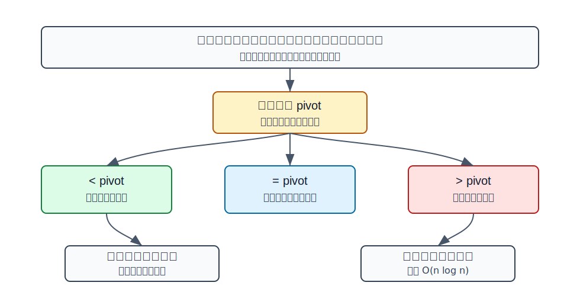
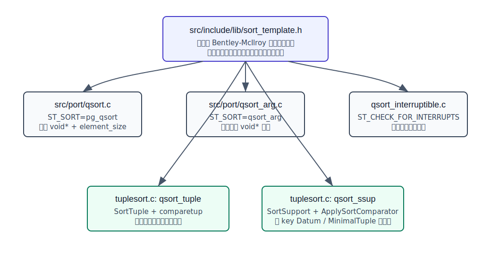
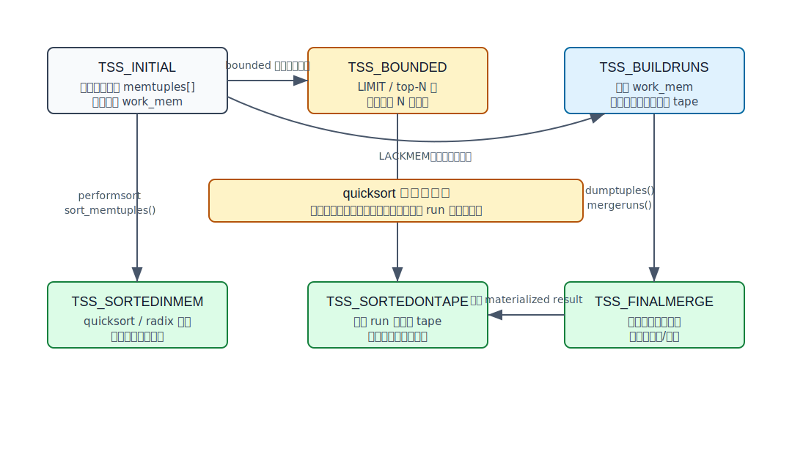
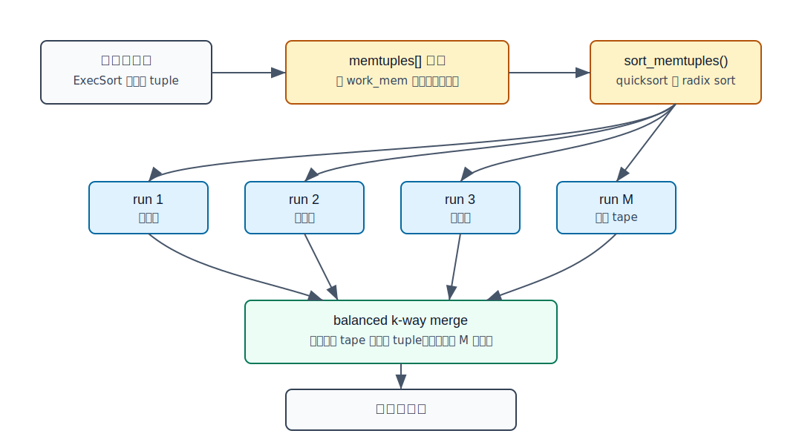
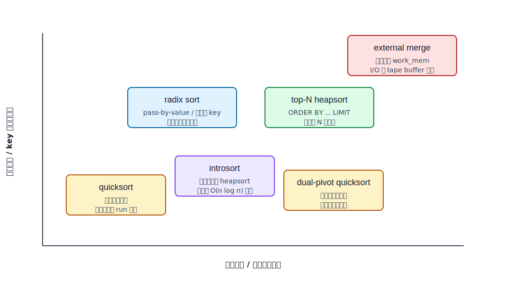

## 数据库筑基课 - 快速排序 (Quicksort)

### 作者
digoal

### 日期
2026-05-30

### 标签
PostgreSQL , 应用开发者 , 数据库筑基课 , 执行算法 , 排序 , Quicksort , Tuplesort

----

## 背景
  

数据库筑基课大纲在当前项目中未找到可引用文件，因此本文按“扫描/执行算法”独立成篇。本文以 PostgreSQL 本地源码、官方文档、DeepWiki 对 `postgres/postgres` 的架构摘要为主。用户给出的四篇资料 `Algorithm 64: Quicksort`、`Quicksort`、`Introspective Sorting and Selection Algorithms`、`Dual-Pivot Quicksort` 在当前项目中没有原文文件；本文只把它们作为算法谱系背景，不引用无法本地核验的实验数字。

排序是数据库执行器里最朴素、也最容易被低估的算子。`ORDER BY` 需要排序，`DISTINCT`、`GROUP BY`、窗口函数、Merge Join、部分索引构建和有序聚合也可能依赖排序。业务侧看到的是“按时间倒序取 100 条”或“报表按客户金额排序”；执行器看到的是：

1. 输入能不能放进内存？
2. 比较一次 tuple 有多贵？
3. 只要 Top-N，还是需要完整有序结果？
4. 排序结果是否需要随机访问、回扫或交给上层继续保持有序？
5. 超过 `work_mem` 后，是 CPU 主导，还是临时文件 I/O 主导？

快速排序解决的是其中一个局部但关键的问题：当一批待排序元素已经在内存数组里时，如何用较少的比较、移动和额外空间把它排好。PostgreSQL 没有把 quicksort 当成唯一答案；它把 quicksort 放进 `tuplesort` 框架里，和 top-N heapsort、radix sort、external merge、SortSupport、临时 tape、并行排序一起协作。

## 一、它解决什么问题？

最直接的问题是：给定一批内存中的元素，如何按比较器定义的顺序原地排序。

在数据库里，元素通常不是普通整数，而是 `SortTuple`：它可能代表 heap tuple、index tuple、datum、聚合中间值或外部排序 tape 上读回来的 tuple。比较器也不是简单的 `<`，而要处理：

- 多列排序 key。
- 升序/降序。
- `NULLS FIRST` / `NULLS LAST`。
- collation。
- 类型 opclass 提供的比较函数。
- abbreviated key 这种“先用便宜代理 key 比，必要时再回到完整比较”的优化。

快速排序把“全局排序”转化成“围绕枢轴反复分区”。它牺牲的是最坏情况下可能退化到 `O(n^2)`，以及排序不稳定；换来的是平均 `O(n log n)`、原地排序、缓存局部性较好、实现常数小。对数据库执行器来说，这个取舍很现实：大部分内存排序和外部排序 run 生成更关心吞吐、内存占用和比较器调用次数，而不是稳定排序语义。

## 二、它是什么？

快速排序是一种基于比较的分治排序算法。核心步骤是：

1. 从数组中选一个枢轴 `pivot`。
2. 把元素分成小于、等于、大于 `pivot` 的区域。
3. 对小于区和大于区继续排序。
4. 小数组切换到更低常数的插入排序。



图 1 说明：快速排序的关键不是“递归”本身，而是分区质量。枢轴接近中位数时，两边规模接近，复杂度接近 `O(n log n)`；枢轴长期偏向一端时，递归深度和比较次数都会恶化。

PostgreSQL 当前 quicksort 实现位于 `src/include/lib/sort_template.h`，由多个 `.c` 文件通过宏生成不同入口：

| 入口 | 生成位置 | 主要用途 |
|---|---|---|
| `pg_qsort` | `src/port/qsort.c` | PostgreSQL 自带的通用 qsort 兼容入口 |
| `qsort_arg` | `src/port/qsort_arg.c` | 比较器可携带额外 `void *arg` |
| `qsort_interruptible` | `src/backend/utils/sort/qsort_interruptible.c` | 排序过程中可 `CHECK_FOR_INTERRUPTS()` |
| `qsort_tuple` | `src/backend/utils/sort/tuplesort.c` | 排 `SortTuple`，使用 `comparetup` |
| `qsort_ssup` | `src/backend/utils/sort/tuplesort.c` | 单 key `MinimalTuple` / `Datum` 快路径，使用 `SortSupport` |

所以本文讲的不是“C 标准库 qsort 怎么用”，而是 PostgreSQL 如何把 quicksort 工程化到数据库执行器里。

## 三、核心原理

### 3.1 Bentley-McIlroy 风格的工程化 quicksort

`sort_template.h` 顶部注释说明，PostgreSQL 的实现基于 Bentley 和 McIlroy 的 “Engineering a sort function”，并做了几项关键改造：

- 小数组 `n < 7` 使用插入排序。
- 排序前扫描一遍，若输入已经有序则直接返回。
- 中等数组使用 median-of-three 选枢轴。
- 大数组 `n > 40` 使用 Tukey ninther 思路：从头、中、尾各取三个点做三次 median，再对三个 median 取 median。
- 分区时把等于枢轴的元素集中到中间，减少重复 key 下的递归。
- 只递归较小分区，对较大分区用循环继续处理，把递归深度约束在 `O(log n)`。
- 可选打开 `ST_CHECK_FOR_INTERRUPTS`，让长排序响应取消请求。

这些点都不是教科书装饰，而是数据库里非常具体的风险控制。比如大量重复 key 的报表排序很常见；如果分区算法不能有效处理等值元素，就会产生大量无意义递归。再比如 PostgreSQL 注释明确提到，曾经见过栈溢出问题，因此“小分区递归、大分区迭代”不是洁癖，而是线上稳定性要求。

### 3.2 模板化：同一算法，多种排序入口

PostgreSQL 没有用 C++ 模板，而是用 C 预处理宏复用同一套算法。调用方在包含 `sort_template.h` 前定义：

- `ST_SORT`：生成的函数名。
- `ST_ELEMENT_TYPE` 或 `ST_ELEMENT_TYPE_VOID`：元素类型。
- `ST_COMPARE` 或 `ST_COMPARE_RUNTIME_POINTER`：比较逻辑。
- `ST_COMPARE_ARG_TYPE`：是否给比较器传额外上下文。
- `ST_CHECK_FOR_INTERRUPTS`：是否在循环中检查中断。



图 2 说明：`sort_template.h` 是算法骨架，`qsort.c`、`qsort_arg.c`、`qsort_interruptible.c` 和 `tuplesort.c` 是不同实例化。这样做的价值是避免函数指针、元素大小、上下文参数在热点路径上造成不必要开销，同时保持实现只有一份。

`tuplesort.c` 中尤其值得注意：

```c
#define ST_SORT qsort_tuple
#define ST_ELEMENT_TYPE SortTuple
#define ST_COMPARE_RUNTIME_POINTER
#define ST_COMPARE_ARG_TYPE Tuplesortstate
#define ST_CHECK_FOR_INTERRUPTS
#include "lib/sort_template.h"

#define ST_SORT qsort_ssup
#define ST_ELEMENT_TYPE SortTuple
#define ST_COMPARE(a, b, ssup) \
    ApplySortComparator((a)->datum1, (a)->isnull1, \
                        (b)->datum1, (b)->isnull1, (ssup))
#define ST_COMPARE_ARG_TYPE SortSupportData
#define ST_CHECK_FOR_INTERRUPTS
#include "lib/sort_template.h"
```

`qsort_tuple` 适合通用 `SortTuple`，比较函数可能处理多列和 tie-break；`qsort_ssup` 适合单 key 快路径，把比较压到 `ApplySortComparator()`，减少通用比较层次。

### 3.3 `tuplesort` 状态机：quicksort 只是其中一段

执行器的 `Sort` 节点在 `src/backend/executor/nodeSort.c` 中工作：第一次调用时读取外层子计划的所有 tuple，喂给 `tuplesort_puttupleslot()` 或 `tuplesort_putdatum()`，然后调用 `tuplesort_performsort()`；后续调用只从 `tuplesort` 取已排序结果。

`tuplesort` 的状态比“调用一次 qsort”复杂得多：

| 状态 | 含义 | quicksort 是否参与 |
|---|---|---|
| `TSS_INITIAL` | 输入仍在内存数组中 | `performsort` 时用 quicksort 或 radix sort 排好 |
| `TSS_BOUNDED` | Top-N bounded heap | 主要用 heap，不走完整 quicksort |
| `TSS_BUILDRUNS` | 超过内存，正在生成外部排序 run | 每个 run 先 quicksort/radix，再写 tape |
| `TSS_SORTEDINMEM` | 排序完成，结果在内存中 | 已完成 |
| `TSS_SORTEDONTAPE` | 排序完成，最终结果在 tape | run 和 merge 已完成 |
| `TSS_FINALMERGE` | 边读取边做最终多路归并 | quicksort 已在 run 生成阶段完成 |



图 3 说明：`quicksort` 只解决“内存中这一批 `memtuples[]` 怎么排好”。如果数据没超过 `work_mem`，排序到此结束；如果超过 `work_mem`，它只是 run generation 的第一步，后面还要进入 balanced k-way merge。

### 3.4 内存排序：quicksort 与 radix sort 的选择

`tuplesort_sort_memtuples()` 是内存批次排序入口。源码逻辑可以简化为：

```text
if leading key 存在 datum1 且比较器是整数类:
    if 元素数 >= 40:
        radix_sort_tuple()
else if 是单 key MinimalTuple 或 Datum:
    qsort_ssup()
else:
    qsort_tuple()
```

这里的 `40` 来自 `QSORT_THRESHOLD`，注释说小于这个阈值时 `qsort_tuple()` 通常比 radix sort 更快。这个选择说明一个重要原则：数据库排序不是“算法复杂度最低者胜出”，而是“数据表示、比较成本、常数、缓存和分支行为综合胜出”。

`SortSupport` 是理解 PostgreSQL 排序性能的关键。传统路径是反复调用 SQL 可见的 btree 比较函数；SortSupport 允许 opclass 提供更低开销的 comparator、abbreviated key converter、abbrev abort/costing 函数等。对文本、numeric、uuid、network、bytea 等类型，abbreviated key 可能把昂贵比较转化为便宜的 pass-by-value 比较；如果采样发现 abbreviated key 区分度太低，也可以中止该优化。

### 3.5 外部排序：quicksort 生成 run，merge 解决大数据

当 `memtuples[]` 放不下输入，`tuplesort` 会进入 `TSS_BUILDRUNS`。流程是：

1. 初始化 logical tape。
2. 每当内存批次满了，调用 `dumptuples()`。
3. `dumptuples()` 调用 `tuplesort_sort_memtuples()`，也就是 quicksort 或 radix sort。
4. 把排好序的批次写成一个 sorted run。
5. 输入结束后，把剩余批次也写成 run。
6. 用 balanced k-way merge 合并 run。



图 4 说明：外部排序的前半段仍依赖内存排序；后半段的主导因素变成临时文件、logical tape、预读 buffer 和多路归并。PostgreSQL `tuplesort.c` 注释还说明，15 以前使用 polyphase merge，当前实现使用 straightforward balanced merge；原因是现代硬件下逻辑 tape 的成本很低，可以使用更多 tape 来减少重复 I/O。

归并阶段并不是再次 quicksort 全部数据，而是在堆中维护每个输入 tape 的当前最小 tuple。每输出一个 tuple，就从同一 tape 读下一个 tuple 替换堆顶；堆空则本轮归并完成。这样内存只需要保存每条输入 tape 的前端候选，以及预读 buffer。

### 3.6 Top-N：`ORDER BY ... LIMIT` 不一定需要完整 quicksort

`tuplesort_set_bound()` 告诉排序器最多需要前 N 个结果。`nodeSort.c` 在 sort 节点带 bounded 信息时会调用它。PostgreSQL 源码注释明确说这是 hint，不保证一定只返回 N 个；并行 leader 会忽略该 hint。

当输入 tuple 数超过 `2 * bound`，或者超过 bound 且内存紧张时，`tuplesort_puttuple_common()` 会切到 `TSS_BOUNDED`，调用 `make_bounded_heap()`。bounded heap 的思想是：

- 堆里最多保留 N 个候选。
- 根节点放当前候选里“最差”的那个。
- 新 tuple 如果比根还差，直接丢弃。
- 新 tuple 如果更好，替换根并调整堆。
- 输入结束后用 `sort_bounded_heap()` 把堆变成有序数组。

所以 `ORDER BY score DESC LIMIT 100` 的理想情况不是把 1 亿行完整排好再取前 100，而是不断维护 100 个候选。这就是 `EXPLAIN ANALYZE` 里可能看到 `Sort Method: top-N heapsort` 的原因。

### 3.7 可观察性：EXPLAIN、trace_sort 与 DTrace probe

PostgreSQL 文档中的 `EXPLAIN ANALYZE` 示例会显示：

```text
Sort Method: quicksort  Memory: 74kB
```

`src/backend/commands/explain.c` 通过 `tuplesort_get_stats()` 获取排序方法和空间类型。`tuplesort_method_name()` 可能返回：

- `top-N heapsort`
- `quicksort`
- `external sort`
- `external merge`

空间类型则是 `Memory` 或 `Disk`。官方文档也说明，Sort 节点会显示排序方法、是否内存/磁盘排序、以及内存或磁盘空间用量。

如果需要更细日志，可以打开 `trace_sort`。官方配置文档说明 `trace_sort` 会输出排序过程中的资源使用信息。`tuplesort.c` 里还会在外部排序 run 生成时打印 “starting quicksort of run N” 和 “finished quicksort of run N”。对低频诊断，这比猜测 `work_mem` 是否足够可靠得多。

## 四、横向对比

| 维度 | PostgreSQL quicksort | Introsort | Dual-Pivot Quicksort | Radix Sort | Top-N Heapsort | External Merge |
|---|---|---|---|---|---|---|
| 主要目标 | 内存数组通用比较排序 | 保留 quicksort 平均性能并兜底最坏情况 | 用两个枢轴改善某些数组排序常数 | 利用 key 字节/整数表示减少比较 | 只保留前 N 个结果 | 排序超过内存的数据 |
| 复杂度边界 | 平均 `O(n log n)`，最坏可能 `O(n^2)` | 最坏 `O(n log n)` | 平均 `O(n log n)`，实现敏感 | 常接近 `O(k*n)`，依赖 key 表示 | `O(n log N)` | run 生成 + 多路归并 I/O |
| 额外空间 | 原地为主，递归栈受控 | 原地为主 | 原地为主 | 可能需要分区/计数辅助 | `N` 大小堆 | 临时文件和 tape buffer |
| 稳定性 | 不稳定 | 通常不稳定 | 通常不稳定 | 视实现而定 | 只保证 Top-N | 多路归并本身可稳定，但 PostgreSQL 排序语义不承诺稳定 |
| PostgreSQL 角色 | `qsort_tuple` / `qsort_ssup` / run generation | 当前 quicksort 未实现 introsort 兜底 | 非 PostgreSQL 当前 quicksort 路线 | 整数化 leading key 的快路径 | bounded sort 路径 | 超过 `work_mem` 后的主路径 |
| 最适合 | 通用 tuple 排序、小中批次、run 生成 | 强调最坏时间上界的通用库 | 语言运行时数组排序等场景 | pass-by-value 或 abbreviated key 区分度高 | `ORDER BY ... LIMIT` | 大排序、报表、索引构建等超内存场景 |
| 不适合 | 极端坏枢轴、需要稳定排序、超内存全局排序 | 实现复杂度略高 | 重复值/分布敏感，需要细调 | 复杂 collation、多列 tie-break 高 | 需要完整有序结果 | 很小数据或临时 I/O 压力很高 |



图 5 说明：数据库排序的算法选择是分层的。quicksort 负责通用内存批次；radix sort 在 key 表示合适时抢占热点；Top-N heapsort 服务 LIMIT；external merge 服务超内存数据。Introsort 和 dual-pivot quicksort 是重要算法参照，但不是 PostgreSQL 当前 `tuplesort` 的核心路线。

## 五、效果如何？

快速排序在 PostgreSQL 里的收益主要有五类：

1. **通用性强**：只要能提供三路比较器，就能排序任意 `SortTuple`。
2. **内存占用可控**：原地排序为主，不需要为每次排序复制完整数组。
3. **缓存表现较好**：数组原地分区和顺序扫描比指针结构更友好。
4. **工程兜底充分**：预排序检测、等值分区、ninther 枢轴、小分区递归、大分区迭代都降低了常见坏情况。
5. **能嵌入外部排序**：超内存时仍可作为 run generation 的基础步骤。

代价也必须说清楚：

1. **不稳定排序**：相等 key 的原始顺序不保证保留。SQL 本来就不保证未出现在 `ORDER BY` 中的同 key 行顺序稳定；业务不能依赖偶然顺序。
2. **比较器可能比算法更贵**：复杂 collation、多列 tuple 解包、varlena 比较可能让 comparator 成为主成本。
3. **最坏复杂度不是硬上界**：PostgreSQL 用工程手段降低风险，但这不是 Musser introsort 那种“深度过大切 heapsort”的理论兜底。
4. **超过 `work_mem` 后 quicksort 不再是全局主角**：外部排序的临时文件 I/O、merge order、tape buffer 和并发内存才是瓶颈。
5. **每个 sort 节点都可用 `work_mem`**：官方文档明确提醒复杂查询可能同时有多个 sort/hash 操作，多个会话并发时总内存可能远高于单个 `work_mem`。

## 六、实操 DEMO

下面示例用于观察 PostgreSQL 何时显示 `quicksort`、`top-N heapsort` 和 `external merge`。本轮未启动本地 PostgreSQL 实例执行，因此不提供实际输出；SQL 是可执行的最小实验框架。

### 6.1 内存 quicksort

```sql
DROP TABLE IF EXISTS qsort_demo;
CREATE TABLE qsort_demo AS
SELECT g AS id, md5(g::text) AS payload, (random() * 1000000)::int AS score
FROM generate_series(1, 100000) AS g;

ANALYZE qsort_demo;

SET work_mem = '64MB';

EXPLAIN (ANALYZE, BUFFERS)
SELECT *
FROM qsort_demo
ORDER BY score;
```

观察点：如果排序批次能放进内存，`EXPLAIN ANALYZE` 的 Sort 节点通常会显示 `Sort Method: quicksort  Memory: ...`，也可能因为 key 类型和路径触发其他优化。不要只看节点名 `Sort`，要看 `Sort Method`。

### 6.2 Top-N heapsort

```sql
SET work_mem = '64MB';

EXPLAIN (ANALYZE, BUFFERS)
SELECT *
FROM qsort_demo
ORDER BY score DESC
LIMIT 100;
```

观察点：当 bounded sort 被使用时，可能看到 `Sort Method: top-N heapsort`。这说明执行器没有完整排序全部输入，而是在扫描过程中维护候选集合。

### 6.3 外部排序

```sql
SET work_mem = '1MB';

EXPLAIN (ANALYZE, BUFFERS)
SELECT *
FROM qsort_demo
ORDER BY payload;
```

观察点：当内存不足时，可能看到 `Sort Method: external merge  Disk: ...`。这时调大 `work_mem` 可能减少临时文件 I/O，但要注意并发查询和单条 SQL 中多个排序节点叠加后的总内存。

### 6.4 trace_sort

```sql
SET client_min_messages = log;
SET trace_sort = on;
SET work_mem = '1MB';

EXPLAIN (ANALYZE, BUFFERS)
SELECT *
FROM qsort_demo
ORDER BY payload;
```

观察点：`trace_sort` 会输出排序资源使用信息。外部排序时，可以看到 run quicksort、tape 数、merge 等阶段日志。这个手段适合诊断“到底是内存排序还是临时文件排序”，不适合长期在高并发生产环境无差别打开。

## 七、最佳实践

### 面向数据库架构师

1. **把“是否需要排序”前移到数据模型设计**：常见报表维度、时间线查询、Top-N 查询，应考虑能否用 B-tree 顺序、分区顺序或物化结果减少显式 Sort。
2. **不要把 quicksort 当成 SQL 语义保证**：相同排序 key 下的行顺序不稳定。需要确定性分页时，`ORDER BY created_at DESC, id DESC`，不要只写 `created_at`。
3. **区分完整排序和 Top-N**：产品只展示前 100 条时，让 SQL 明确带 `LIMIT`，让执行器有机会走 bounded heap。
4. **为 merge join 和 ordered aggregate 设计顺序复用**：一个有用的 pathkeys 可能减少上层 Sort，而不是只优化单个查询片段。

### 面向 DBA

1. **用 `EXPLAIN (ANALYZE, BUFFERS)` 看 `Sort Method`**：`quicksort Memory` 和 `external merge Disk` 是完全不同的调优方向。
2. **谨慎调大 `work_mem`**：它是每个 sort/hash 类操作的基础额度，不是每个会话总额度。复杂查询和并发会放大内存占用。
3. **定位临时文件压力**：外部排序频繁出现时，关注 `log_temp_files`、临时表空间、磁盘延迟、并发排序数量，而不仅是单次 SQL。
4. **必要时用 `trace_sort` 做短时诊断**：它能揭示 run 生成和 merge 过程，但日志量可能很大。
5. **关注比较器成本**：排序慢不一定是数据多，也可能是 collation、文本比较、宽 tuple 物化、表达式排序 key 成本高。

### 面向业务开发者

1. **分页必须有完整确定的排序 key**：只按非唯一列排序会导致翻页重复或漏行。
2. **能少排序就少排序**：不要在子查询里无意义 `ORDER BY`，除非上层确实依赖顺序或配合 `LIMIT`。
3. **给 Top-N 查询加合适索引**：`ORDER BY score DESC LIMIT 100` 如果能直接走索引顺序，可能连 Sort 节点都不需要。
4. **避免排序宽行**：如果最终只需要少数列，先筛选、投影，再排序，减少 tuple 移动和临时文件体积。
5. **不要依赖偶然输出顺序**：没有 `ORDER BY`，数据库没有义务按插入顺序、主键顺序或物理顺序返回。

## 八、适合与不适合场景

适合 quicksort 主导的场景：

- 结果集能放进 `work_mem`。
- 排序 key 比较成本可控。
- 需要完整有序输出。
- 输入是普通随机分布或已经接近有序。
- 外部排序 run generation 阶段。

更适合其他路径的场景：

- `ORDER BY ... LIMIT N` 且 N 远小于输入：优先期待 top-N heapsort 或索引顺序。
- leading key 是适合整数化比较的 pass-by-value datum：可能走 radix sort。
- 数据超过内存很多：最终性能更依赖 external merge 和临时 I/O。
- 有合适 B-tree 索引能直接提供顺序：可能不需要 Sort。
- 需要稳定排序语义：SQL 层应增加 tie-break key，而不是要求 quicksort 稳定。
- 极端复杂 collation 文本排序：SortSupport / abbreviated key 是否有效比算法名称更关键。

## 九、常见坑

1. **看到 `Sort` 节点就以为一定是 quicksort**  
   错。`Sort Method` 可能是 `quicksort`、`top-N heapsort`、`external merge` 等。排序节点名只说明逻辑算子，不说明物理方法。

2. **把 `work_mem` 当成全局排序内存**  
   错。官方文档说明每个 sort/hash 操作通常都可使用该额度，多个节点和多个会话会叠加。

3. **认为调大 `work_mem` 一定更快**  
   不一定。太小会 spill，太大可能造成并发内存压力、OS swap 或缓存挤压。要用实际 `EXPLAIN ANALYZE`、临时文件日志和系统指标验证。

4. **分页只按非唯一列排序**  
   例如 `ORDER BY created_at DESC LIMIT 20 OFFSET 100`，同一时间戳下顺序不确定。应加唯一 tie-break：`ORDER BY created_at DESC, id DESC`。

5. **忽视排序 key 的表达式成本**  
   `ORDER BY lower(name)`、复杂函数、非 C collation 文本比较，可能让比较器调用成为主成本。必要时考虑表达式索引、生成列或更合适的 collation。

6. **把外部排序慢归咎于 quicksort**  
   外部排序里 quicksort 只负责每个内存 run。慢点可能是 run 太多、多路归并多轮、临时文件随机 I/O 或磁盘争用。

## 十、扩展问题

1. PostgreSQL 当前 quicksort 没有 introsort 的深度兜底。如果你要为极端恶意输入提供最坏时间上界，会在 `sort_template.h` 中加入什么切换条件？会牺牲哪些常数？
2. 为什么 bounded sort 要禁用 abbreviated key？结合 `tuplesort_set_bound()` 的注释，思考 Top-N 场景下“先转换大量 abbreviated key”是否划算。
3. 如果一个查询先 `ORDER BY a`，再上层 merge join 也需要 `a` 的顺序，优化器如何利用 pathkeys 避免重复排序？
4. 对中文文本排序，collation 成本、abbreviated key 区分度、索引顺序三者如何影响最终计划？
5. 如果 `EXPLAIN ANALYZE` 显示 `external merge Disk: 20GB`，你会从 SQL、索引、`work_mem`、临时表空间、并发控制哪几个层面排查？

## 十一、扩展阅读

1. PostgreSQL 源码：`postgres/src/include/lib/sort_template.h`，quicksort 模板实现，包含枢轴选择、预排序检测、三路分区和递归深度控制。
2. PostgreSQL 源码：`postgres/src/port/qsort.c`，`pg_qsort` 入口。
3. PostgreSQL 源码：`postgres/src/port/qsort_arg.c`，带额外参数的 qsort 入口。
4. PostgreSQL 源码：`postgres/src/backend/utils/sort/qsort_interruptible.c`，可中断 qsort 入口。
5. PostgreSQL 源码：`postgres/src/backend/utils/sort/tuplesort.c`，内存排序、bounded heap、外部排序 run generation、balanced k-way merge。
6. PostgreSQL 源码：`postgres/src/backend/executor/nodeSort.c`，执行器 Sort 节点如何调用 `tuplesort`。
7. PostgreSQL 源码：`postgres/src/include/utils/sortsupport.h` 和 `postgres/src/backend/utils/sort/sortsupport.c`，SortSupport 与 abbreviated key 框架。
8. PostgreSQL 文档：`EXPLAIN ANALYZE` 的 Sort 节点会显示 `Sort Method` 和内存/磁盘空间。
9. PostgreSQL 文档：`work_mem` 是单个排序/哈希类操作写临时文件前的基础内存额度，复杂查询和并发会放大总内存。
10. PostgreSQL 文档：`trace_sort` 可输出排序操作资源使用信息。
11. C. A. R. Hoare, “Algorithm 64: Quicksort”, Communications of the ACM, 1961。
12. C. A. R. Hoare, “Quicksort”, The Computer Journal, 1962。
13. J. L. Bentley and M. D. McIlroy, “Engineering a Sort Function”, Software: Practice and Experience, 1993。PostgreSQL `sort_template.h` 明确说明其 quicksort 例程基于该工作。
14. David R. Musser, “Introspective Sorting and Selection Algorithms”, Software: Practice and Experience, 1997。
15. Vladimir Yaroslavskiy, “Dual-Pivot Quicksort”，作为 dual-pivot quicksort 的算法参照。
16. DeepWiki：`postgres/postgres` 关于 sorting、executor 和 tuplesort 的架构摘要。本文章对 DeepWiki 结论只作辅助理解，关键 claims 已回到本地源码核验。
  
## 附录 
1、询问 gemini
```
快速排序 (Quicksort) 相关的论文
```

2、克隆代码  
```  
git clone --depth 1 https://github.com/postgres/postgres
```  
  
3、启用 codex, 使用 [数据库筑基课 skill](../skills/README.md).  
```
文章标题: 
  数据库筑基课 - 快速排序 (Quicksort)
项目源码(已克隆到当前项目如下目录中):  
  postgres
相关论文或分享:
  Algorithm 64: Quicksort
  Quicksort
  Introspective Sorting and Selection Algorithms
  Dual-Pivot Quicksort
项目 deepwiki reponame:  
  postgres/postgres
项目参考信息: 
  postgres/CLAUDE.md
```
   
  
#### [PostgreSQL 解决方案集合](../201706/20170601_02.md "40cff096e9ed7122c512b35d8561d9c8")
  
  
#### [德哥 / digoal's Github - 公益是一辈子的事.](https://github.com/digoal/blog/blob/master/README.md "22709685feb7cab07d30f30387f0a9ae")
  
  
#### [About 德哥](https://github.com/digoal/blog/blob/master/me/readme.md "a37735981e7704886ffd590565582dd0")
  
  

  
