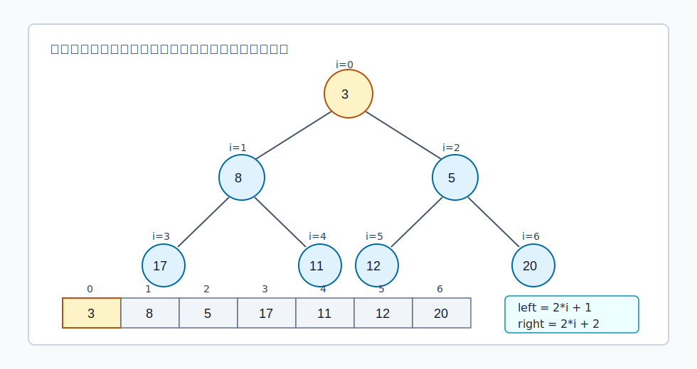
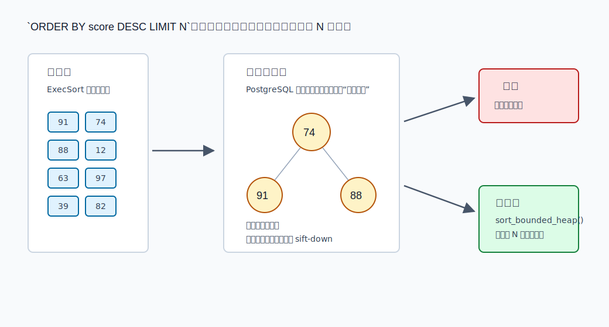
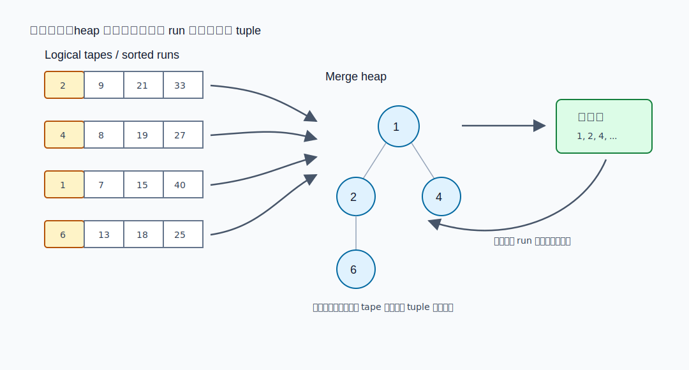
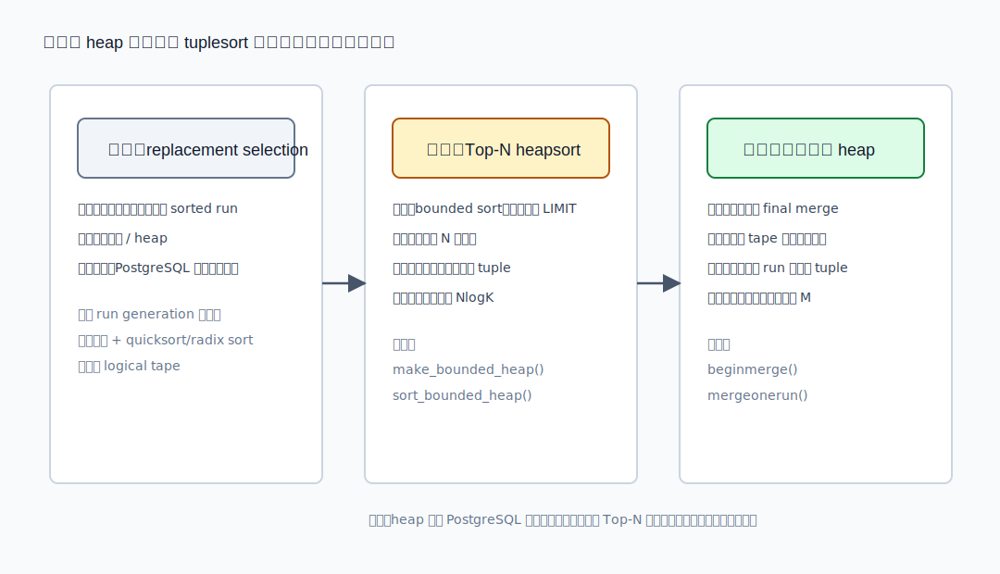
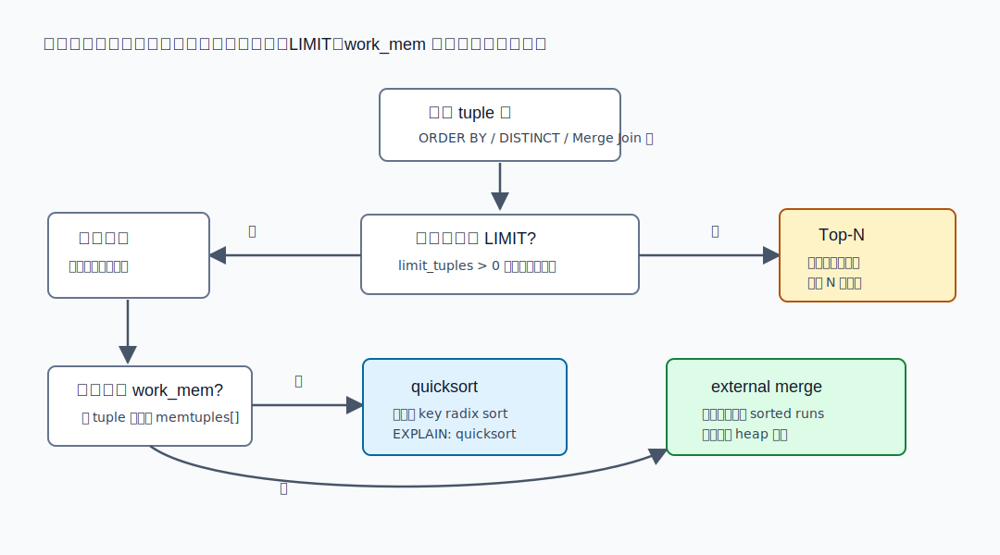

## 数据库筑基课 - 堆排序 (Heapsort)

### 作者
digoal

### 日期
2026-05-30

### 标签
PostgreSQL , 应用开发者 , 数据库筑基课 , 执行算法 , 排序 , Heapsort , Tuplesort

----

## 背景


数据库筑基课大纲在当前项目中未找到可引用文件，因此本文按“扫描/执行算法”独立成篇。本文以 PostgreSQL 本地源码、官方文档、DeepWiki 对 `postgres/postgres` 的架构摘要为主。用户给出的 `Algorithm 232: Heapsort`、`Algorithm 245: Treesort 3`、`Data Structures and Network Algorithms` 在当前项目中没有原文文件；本文只把它们作为算法谱系背景，不引用无法本地核验的实验数字。

排序是数据库执行器里的高频基础能力。`ORDER BY`、`DISTINCT`、窗口函数、Merge Join、索引构建、部分聚合路径都可能触发排序。业务侧看到的是：

```sql
SELECT *
FROM orders
ORDER BY paid_at DESC
LIMIT 100;
```

执行器看到的是另一个问题：输入可能有几百万行，但用户只要前 100 行。此时如果把所有行完整排序，再丢弃绝大多数结果，就把 CPU、内存和临时文件都浪费在“不会返回给客户端”的 tuple 上。

堆排序的价值就在这里：它把“完整排序全部输入”转成“维护一个能快速找出当前边界值的数据结构”。在 PostgreSQL 当前实现里，堆排序不是通用排序主力。通用内存排序主要走 quicksort 或 radix sort；外部排序走 balanced k-way merge；heap 主要出现在两个关键位置：

1. `ORDER BY ... LIMIT` 一类 bounded sort 中，用 Top-N heapsort 只保留前 N 个候选。
2. 外部排序归并阶段，用一个小 heap 保存每条输入 run 的前端 tuple。

这个定位很重要。学习 Heapsort 不是为了背一个算法，而是为了理解数据库执行器如何在 `work_mem`、LIMIT、临时文件和比较成本之间做工程取舍。

## 一、它解决什么问题？

堆排序解决的原始问题是：给定一个数组，能否在较少额外空间内完成 `O(n log n)` 排序，并避免 quicksort 最坏情况退化。

数据库里更常见的问题略有变化：

- 如果只要 Top-N，能不能只维护 N 个候选，而不是完整排序全部输入？
- 如果外部排序已经产生多条有序 run，能不能每次只比较每条 run 的第一个 tuple？
- 如果比较函数很贵，能不能尽量减少没必要的比较和 tuple 复制？
- 如果排序超过内存，能不能把内存用在 run 生成、tape buffer 和归并前端候选上？

堆把这些问题统一成一个不变式：堆顶永远是当前集合里的最小值或最大值。只要能以 `O(log k)` 代价插入、替换、删除堆顶，就可以把“大排序”拆成持续维护“小候选集”。

代价也很明确：

- 堆排序的顺序访问和缓存局部性通常不如 quicksort。
- 对完整内存排序，PostgreSQL 当前不把 heapsort 作为主路径。
- Top-N heap 只适合上层确实只需要前 N 个结果的场景。
- PostgreSQL 排序语义不承诺稳定排序；相同 sort key 的行如果需要确定顺序，必须显式追加 tie-break key。

## 二、它是什么？

堆是一棵满足父子顺序约束的完全二叉树，通常用数组保存。以最小堆为例，每个父节点都不大于它的子节点，因此数组第 0 个元素就是当前最小值。



图 1 说明：堆不是按中序遍历全局有序的树。它只保证“父节点不大于子节点”这一局部不变式。这个不变式足够支持快速取堆顶，但不等于数组已经排好序。

Heapsort 的经典完整流程是：

1. 把无序数组建成堆。
2. 重复取出堆顶，把末尾元素放到堆顶。
3. 对堆顶执行 sift-down，恢复堆不变式。
4. 直到堆为空，得到有序结果。

如果目标不是完整排序，而是 Top-N，可以不用把全部输入都排序。只需要维护一个大小为 N 的堆：

- 要取最小 N 个，就维护最大堆，堆顶是当前候选中最大的那个。
- 要取最大 N 个，就维护最小堆，堆顶是当前候选中最小的那个。
- 新 tuple 比堆顶更差，直接丢弃。
- 新 tuple 比堆顶更好，替换堆顶并恢复堆。

PostgreSQL 的 bounded heapsort 就是这个思想的工程版本。

## 三、核心原理

### 3.1 PostgreSQL 的排序入口：`ExecSort` 只负责喂数据

执行器 `Sort` 节点位于 `postgres/src/backend/executor/nodeSort.c`。第一次调用 `ExecSort()` 时，它会读取外层子计划的所有 tuple，初始化 `tuplesort`，把输入逐个喂给排序器，然后调用 `tuplesort_performsort()`。后续调用只从 `tuplesort` 取结果。

关键路径可以简化为：

```text
ExecSort()
  -> tuplesort_begin_heap() 或 tuplesort_begin_datum()
  -> tuplesort_set_bound()        -- 如果 planner/executor 知道 bounded sort
  -> tuplesort_puttupleslot()     -- 持续喂入子计划结果
  -> tuplesort_performsort()
  -> tuplesort_gettupleslot()
```

DeepWiki 对 `postgres/postgres` 的架构摘要也把相关文件定位到 `nodeSort.c`、`tuplesort.c`、`tuplesort.h`、`logtape.c` 和 `costsize.c`。本文的重要行为结论均以本地源码为准。

### 3.2 Top-N heapsort：只保留会返回的候选

PostgreSQL 的通用排序状态机在 `postgres/src/backend/utils/sort/tuplesort.c`。其中 `TSS_BOUNDED` 表示“正在把 tuple 加载到 bounded-size heap”。

当排序器处于 `TSS_INITIAL`，新 tuple 会先进入 `memtuples[]`。源码在 `tuplesort_puttuple_common()` 中检查是否切换到 bounded heapsort：

```text
如果 state->bounded 为真，并且：
  memtupcount > bound * 2
  或者 memtupcount > bound 且已经触碰 work_mem
则调用 make_bounded_heap()
```

这个 `2 * bound` 是一个启发式交叉点：输入行数已经明显多于输出行数时，维护大小为 N 的 heap 通常比完整 quicksort 更划算。优化器成本估算在 `postgres/src/backend/optimizer/path/costsize.c` 里也使用相同思路：bounded heap-sort 的比较量按 `N log2 K` 估算，完整 quicksort 按 `N log2 N` 估算。



图 2 说明：Top-N heapsort 的关键不是“排序更快”这么粗糙，而是“丢弃大量不会进入结果集的 tuple”。对 `ORDER BY paid_at DESC LIMIT 100`，排序器只需要知道当前前 100 个候选中最差的边界值，很多输入 tuple 只做一次比较就能丢弃。

PostgreSQL 实现里有一个细节：`make_bounded_heap()` 会先调用 `reversedirection()`。注释解释得很清楚：bounded heap 要把“最大 entry”放在根上，方便丢弃比它更差的新 tuple。由于 PostgreSQL 的比较方向需要同时处理升序、降序、NULLS FIRST/LAST，反转方向比额外写一套最大堆比较更直接。

相关函数：

| 函数 | 作用 |
|---|---|
| `tuplesort_set_bound()` | 设置最多需要返回的 tuple 数，通常来自 LIMIT |
| `make_bounded_heap()` | 把已有无序 `memtuples[]` 转成大小为 bound 的 heap |
| `tuplesort_heap_insert()` | 插入新 heap 元素并恢复不变式 |
| `tuplesort_heap_replace_top()` | 用新 tuple 替换堆顶并 sift-down |
| `sort_bounded_heap()` | 输入结束后把 bounded heap 转成有序数组 |
| `tuplesort_method_name()` | EXPLAIN 中显示 `top-N heapsort` |

### 3.3 heap 的基础操作：insert、delete top、replace top

PostgreSQL 的 heap 操作都围绕 `memtuples[]` 数组展开。`SortTuple` 定义在 `postgres/src/include/utils/tuplesort.h`，它保存 tuple 指针、第一排序键 `datum1`、NULL 标记、radix sort 当前字节，以及外部归并时的 `srctape`。

`tuplesort_heap_insert()` 的逻辑是 sift-up：

```text
把新 tuple 放到数组末尾形成“洞”
不断与父节点比较
如果新 tuple 应该排在父节点前面，就把父节点下移
直到找到合适位置
```

`tuplesort_heap_replace_top()` 对应 Knuth 的 Algorithm 5.2.3H 中 H3-H8 的 sift-up/sift-down 思路。源码用 0-based 数组索引，子节点位置是 `2*i+1` 和 `2*i+2`。为了避免 `2*i+1` 溢出，循环变量用 `unsigned int`，并依赖 `memtupcount <= INT_MAX` 的边界。

这些实现细节对 DBA 不是“源码洁癖”。它们解释了几个现象：

- Top-N 越小，heap 越小，替换堆顶越便宜。
- 只有当新 tuple 可能进入结果集时，才需要完整替换和调整。
- 如果排序 key 比较很贵，减少进入 heap 的 tuple 比微调 `work_mem` 更有效。
- 如果上层没有 LIMIT，无法使用 bounded heap 省掉全量排序。

### 3.4 外部排序：heap 负责多路归并的前端候选

当输入超过 `work_mem`，`tuplesort` 会进入 `TSS_BUILDRUNS`，把内存中的批次排成 sorted run，再写到 logical tape。PostgreSQL 15 以前曾使用 polyphase merge；当前源码注释说明，现代实现使用 balanced k-way merge，因为 logical tape 成本低，可以使用更多 tape 来减少重复 I/O。

这里要注意一个容易混淆的点：PostgreSQL 现在不再用 heap 做 run generation。`tuplesort.c` 顶部注释明确说，历史上曾用 replacement selection，用 heap 实现优先树；当前总是用 quicksort 或 radix sort 生成 run。

heap 在外部排序中的当前角色，是归并阶段维护每条输入 run 的前端 tuple：



图 3 说明：外部归并不需要把所有 tape 的 tuple 都读入内存。它只把每条输入 tape 的当前第一个 tuple 放进 heap。每输出一个堆顶 tuple，就从同一条 tape 读下一个 tuple 替换堆顶；如果该 tape 耗尽，就删除堆顶并减少输入 run 数。

相关函数包括：

| 函数 | 作用 |
|---|---|
| `inittapes()` | 超过内存后初始化 logical tape |
| `dumptuples()` | 把内存批次排序后写成 run |
| `beginmerge()` | 为一次归并准备输入 tape 和 heap |
| `mergeonerun()` | 重复取 heap 顶部并写入输出 run |
| `tuplesort_gettuple_common()` | `TSS_FINALMERGE` 状态下边归并边返回结果 |
| `logtape.c` | 管理 logical tape 和临时文件空间复用 |

### 3.5 heap 在 tuplesort 中的三种历史与当前角色



图 4 说明：同样是 heap，不同阶段解决的问题不同。历史 replacement selection 关注“生成更长 run”；当前 Top-N heapsort 关注“限制候选集大小”；外部归并 heap 关注“每条 run 只保留一个前端候选”。把这三者混在一起，会误读 PostgreSQL 的排序实现。

当前 PostgreSQL 的排序策略可以概括为：

- 数据能放进内存且需要完整结果：quicksort 或 radix sort。
- 数据不能放进内存：内存批次排序生成 run，随后 balanced k-way merge。
- 只需要前 N 个结果：尽可能使用 Top-N heapsort。
- 外部归并：用 heap 管理各输入 run 的当前最小候选。

### 3.6 可观察性：EXPLAIN 能直接看到排序方法

PostgreSQL 官方文档的 `EXPLAIN ANALYZE` 示例中，Sort 节点会显示：

```text
Sort Method: quicksort  Memory: 74kB
```

在另一个 `ORDER BY ... LIMIT 10` 示例中，文档展示了：

```text
Sort Method: top-N heapsort  Memory: 25kB
```

这些字符串来自 `tuplesort_method_name()`，可能值包括：

- `top-N heapsort`
- `quicksort`
- `external sort`
- `external merge`

空间类型来自 `tuplesort_space_type_name()`，显示为 `Memory` 或 `Disk`。如果需要更细粒度排序日志，可以打开 `trace_sort`。官方配置文档说明，`trace_sort` 会输出排序过程中的资源使用信息。

## 四、横向对比

| 维度 | Heapsort / Top-N heapsort | Quicksort | Radix sort | External merge | Treesort |
|---|---|---|---|---|---|
| 核心目标 | 维护堆顶边界，适合 Top-N 或归并前端候选 | 内存数组完整排序 | 利用 key 字节/整数表示减少比较 | 超过内存后的多路归并 | 用二叉搜索树组织排序 |
| 复杂度 | 完整排序 `O(n log n)`；Top-N 为 `O(n log k)` | 平均 `O(n log n)` | 常接近 `O(k*n)`，依赖 key 表示 | run 生成 + 多路归并 I/O | 平衡时 `O(n log n)`，退化时可更差 |
| 额外空间 | 完整 heapsort 很少；Top-N 需要 `k` 个候选 | 原地为主 | 可能需要辅助分区 | 临时文件、tape buffer、小 heap | 需要树节点或指针结构 |
| 缓存局部性 | 通常弱于 quicksort | 较好 | 对合适 key 很好 | 由顺序 I/O 和预读主导 | 指针跳转较多 |
| PostgreSQL 当前角色 | bounded sort、外部归并 heap | 通用内存排序、run generation | 整数化 leading key 快路径 | 大排序主路径 | 不是 tuplesort 主路径 |
| 适合场景 | `ORDER BY ... LIMIT`、k-way merge | 中小内存排序、通用 tuple 排序 | pass-by-value 或 abbreviated key 区分度高 | 数据量超过 `work_mem` | 教学和特定树结构场景 |
| 不适合场景 | 无 LIMIT 的完整内存排序热点路径 | 需要最坏复杂度硬上界或稳定排序 | 多列复杂比较、collation 复杂且无法缩写 | 小数据排序 | 数据分布极端且树不平衡 |

表里的重点不是“哪个算法绝对更好”，而是“哪个算法服务哪个执行阶段”。数据库执行器很少用单一算法包打天下。它会根据是否 bounded、是否超内存、比较 key 是否适合 radix、是否需要随机访问来切换路径。



图 5 说明：`work_mem` 不是唯一旋钮。LIMIT、输入行数、tuple 宽度、排序 key 成本、是否需要随机访问都会改变排序路径。DBA 调优时应先看 EXPLAIN 的实际 Sort Method，再决定是改 SQL、加索引、调 `work_mem`，还是接受外部排序。

## 五、效果如何？

Heapsort 的收益主要体现在 Top-N 和多路归并，不体现在替代 PostgreSQL 的通用 quicksort。

对 Top-N：

- 完整排序比较量近似 `n log n`。
- bounded heap 比较量近似 `n log k`。
- 当 `k` 远小于 `n`，收益明显。
- 内存占用接近候选集大小，而不是全部输入大小。

对外部归并：

- heap 大小约等于归并路数 M，而不是所有 tuple 数。
- 每次只从一个 tape 补充一个 tuple。
- 配合 `logtape.c` 的预读和空间复用，可以把随机访问压力转化成更局部的顺序访问。

代价也要说清楚：

- Top-N heapsort 不能返回完整有序结果。
- 如果 LIMIT 很大，`k` 接近 `n`，heap 的优势会下降。
- 如果上层需要随机访问、回扫或完整结果，可能仍要生成完整排序结果。
- 并发查询中的多个 sort/hash 节点都可能使用 `work_mem`，实际内存压力可能是 `work_mem` 的多倍。

PostgreSQL 官方配置文档说明，`work_mem` 是每个查询操作在写入临时磁盘文件前可使用的基础内存量；复杂查询可同时有多个 sort/hash 操作，多个会话也会并发消耗内存。因此不能把 `work_mem` 当作实例级总内存上限。

## 六、实操 DEMO

以下 SQL 是最小可验证实验，本文没有在本机启动 PostgreSQL 实例执行，因此不伪造输出。读者可在自己的测试库执行。

### 6.1 观察 Top-N heapsort

```sql
DROP TABLE IF EXISTS demo_sort;

CREATE TABLE demo_sort AS
SELECT g AS id,
       (random() * 1000000)::int AS score,
       md5(g::text) AS payload
FROM generate_series(1, 1000000) AS g;

ANALYZE demo_sort;

SET work_mem = '4MB';

EXPLAIN (ANALYZE, BUFFERS)
SELECT id, score
FROM demo_sort
ORDER BY score DESC
LIMIT 100;
```

预期观察点：

- Sort 节点可能显示 `Sort Method: top-N heapsort`。
- Memory 通常接近候选集和排序元数据大小，而不是整表大小。
- 如果已有合适索引，计划可能变成 Index Scan 而不再显式 Sort。

为了让实验更稳定，可以先禁用相关索引，或用临时表避免已有索引影响。

### 6.2 观察完整内存排序或外部排序

```sql
SET work_mem = '4MB';

EXPLAIN (ANALYZE, BUFFERS)
SELECT id, score
FROM demo_sort
ORDER BY score DESC;
```

预期观察点：

- 如果排序结果超过 `work_mem`，Sort Method 可能是 `external merge` 或 `external sort`，并显示 `Disk`。
- 如果提高 `work_mem` 后能放进内存，可能显示 `quicksort  Memory: ...`。

### 6.3 用 `trace_sort` 看内部路径

```sql
SET client_min_messages = log;
SET trace_sort = on;
SET work_mem = '4MB';

EXPLAIN (ANALYZE, BUFFERS)
SELECT id, score
FROM demo_sort
ORDER BY score DESC
LIMIT 100;
```

预期观察点：

- 日志会输出排序资源使用信息。
- 外部排序场景下能看到切换到 external sort、生成 run、归并等线索。
- 生产环境不建议长期打开 `trace_sort`，适合短时间诊断。

## 七、最佳实践

面向数据库架构师：

- 能用索引顺序满足 `ORDER BY ... LIMIT` 时，优先让执行器走索引路径，避免显式 Sort。
- 对分页、排行榜、最新事件流，尽量让排序 key 和过滤条件组成匹配业务访问模式的复合索引。
- 给相同排序 key 的结果追加确定性 tie-breaker，例如 `ORDER BY score DESC, id DESC`，避免结果顺序随执行路径变化。
- 把“Top-N 查询”和“全量导出排序”分成不同接口，不要让一个 SQL 同时服务两种相反需求。

面向 DBA：

- 看 `EXPLAIN (ANALYZE, BUFFERS)` 的实际 `Sort Method`，不要只凭 `work_mem` 猜测。
- 发现 `external merge Disk: ...` 时，先判断是否真的需要完整排序；如果只返回前几页，改写 SQL 或加索引可能比调大 `work_mem` 更有效。
- 调大 `work_mem` 前计算并发：一个查询可能有多个 sort/hash 节点，一个会话可能并行执行，多个会话会叠加。
- 用 `log_temp_files`、`pg_stat_statements`、`auto_explain`、`trace_sort` 定位高频排序，而不是只看单次慢查询。

面向业务开发者：

- `LIMIT 100` 和“不带 LIMIT 的 ORDER BY”是两类工作负载，成本可能相差很大。
- 不要用大 OFFSET 做深分页；`OFFSET 1000000 LIMIT 100` 仍可能让数据库处理大量前置结果。优先使用 keyset pagination。
- 排序列上函数、表达式、collation、NULL 排序规则都会影响索引是否可用。
- 如果需要稳定业务顺序，必须写全排序键，不要依赖数据库内部排序的偶然顺序。

## 八、适合与不适合场景

适合：

- `ORDER BY ... LIMIT k`，并且 `k` 远小于输入行数。
- 搜索、推荐、排行榜、最近 N 条事件。
- 外部排序归并阶段，每条 run 已经有序，只需多路合并。
- 需要持续维护候选边界的流式处理。

不适合：

- 需要完整有序输出的大结果集，尤其 `k` 接近 `n`。
- 已有索引可直接满足顺序的查询；此时显式 sort 反而多余。
- 需要稳定排序语义但 SQL 没有写 tie-breaker 的场景。
- 排序 key 比较极其昂贵且无法缩写，同时 LIMIT 很大，heap 替换成本也会显著。
- 试图用 `work_mem` 掩盖错误访问模式，例如深分页、无选择性过滤后的全表排序。

## 九、常见坑

1. 把 `top-N heapsort` 当成“所有排序都用了 heapsort”。

   PostgreSQL 当前完整内存排序主要是 quicksort 或 radix sort。`top-N heapsort` 只说明 bounded sort 路径被使用。

2. 以为 `LIMIT` 一定省成本。

   LIMIT 是否能转化为 bounded sort，取决于计划形态、排序节点是否知道 bound、是否有上层节点需要完整结果等。并行 leader 对 bound hint 也有特殊处理。

3. 只调大 `work_mem`，不看并发。

   `work_mem` 是每个操作的基础额度，不是全局池。复杂 SQL、并行查询和高并发会放大实际内存使用。

4. 忽略索引顺序。

   对 `WHERE tenant_id = ? ORDER BY created_at DESC LIMIT 100`，合适的 `(tenant_id, created_at DESC)` 索引往往比任何排序算法都更有效。

5. 忽略 NULL 和 collation。

   `NULLS FIRST/LAST`、字符串 collation、表达式排序会改变比较语义，也可能影响索引匹配和 SortSupport 优化。

6. 误以为排序稳定。

   SQL 没有指定完整排序键时，相同 key 的输出顺序不应被业务依赖。追加主键或时间戳作为 tie-breaker。

## 十、扩展问题

1. 为什么 PostgreSQL 当前不再用 replacement selection 生成外部排序 run，而改为 quicksort/radix sort 生成 run？
2. 如果 `LIMIT 100 OFFSET 1000000`，bounded heap 的 `bound` 应该接近 100，还是接近 1000100？这对深分页意味着什么？
3. 对 `ORDER BY text_col LIMIT 100`，collation 和 abbreviated key 会怎样改变比较成本？
4. 如果一个查询计划里有两个 Sort 节点和一个 Hash Join，`work_mem` 应该怎样估算风险？
5. 为什么“索引已经有序”通常比“排序算法更快”更重要？
6. DuckDB、PostgreSQL、SQLite 在 Top-N 或外部排序上有哪些实现差异？这些差异来自执行模型、向量化、内存管理还是存储格式？

## 十一、扩展阅读

- PostgreSQL 源码：`postgres/src/backend/executor/nodeSort.c`，`ExecSort()`。
- PostgreSQL 源码：`postgres/src/backend/utils/sort/tuplesort.c`，`TSS_BOUNDED`、`make_bounded_heap()`、`sort_bounded_heap()`、`tuplesort_heap_insert()`、`tuplesort_heap_replace_top()`、`tuplesort_method_name()`。
- PostgreSQL 源码：`postgres/src/include/utils/tuplesort.h`，`SortTuple`、`TuplesortPublic`。
- PostgreSQL 源码：`postgres/src/backend/utils/sort/logtape.c`，外部排序 logical tape。
- PostgreSQL 源码：`postgres/src/backend/optimizer/path/costsize.c`，排序成本估算中的 bounded heap-sort 与 quicksort 分支。
- PostgreSQL 官方文档：`postgres/doc/src/sgml/perform.sgml`，`EXPLAIN ANALYZE` Sort Method 示例。
- PostgreSQL 官方文档：`postgres/doc/src/sgml/rules.sgml`，`Sort Method: top-N heapsort` 示例。
- PostgreSQL 官方文档：`postgres/doc/src/sgml/config.sgml`，`work_mem` 与 `trace_sort`。
- DeepWiki：`postgres/postgres` 查询执行与排序相关架构摘要，已用来定位源码入口，关键结论已回到本地源码核验。
- J. W. J. Williams, “Algorithm 232: Heapsort”, Communications of the ACM, 1964。本文未取得本地全文，只作算法出处背景。
- R. W. Floyd, “Algorithm 245: Treesort 3”, Communications of the ACM, 1964。本文未取得本地全文，只作树排序谱系背景。
- Robert E. Tarjan, *Data Structures and Network Algorithms*, SIAM, 1983。本文未取得本地全文，只作堆、优先队列与图算法背景阅读。
  
## 附录 
1、询问 gemini
```
堆排序 (Heapsort) 相关的论文
```

2、克隆代码  
```  
git clone --depth 1 https://github.com/postgres/postgres
```  
  
3、启用 codex, 使用 [数据库筑基课 skill](../skills/README.md).  
```
文章标题: 
  数据库筑基课 - 堆排序 (Heapsort)
项目源码(已克隆到当前项目如下目录中):  
  postgres
相关论文或分享:
  Algorithm 232: Heapsort
  Algorithm 245: Treesort 3
  Data Structures and Network Algorithms
项目 deepwiki reponame:  
  postgres/postgres
项目参考信息: 
  postgres/CLAUDE.md
```
  
  
#### [PostgreSQL 解决方案集合](../201706/20170601_02.md "40cff096e9ed7122c512b35d8561d9c8")
  
  
#### [德哥 / digoal's Github - 公益是一辈子的事.](https://github.com/digoal/blog/blob/master/README.md "22709685feb7cab07d30f30387f0a9ae")
  
  
#### [About 德哥](https://github.com/digoal/blog/blob/master/me/readme.md "a37735981e7704886ffd590565582dd0")
  
  

  
