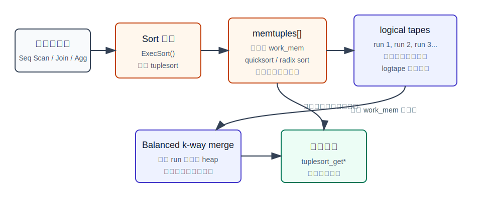
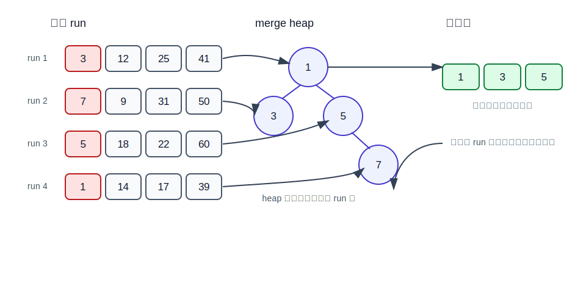
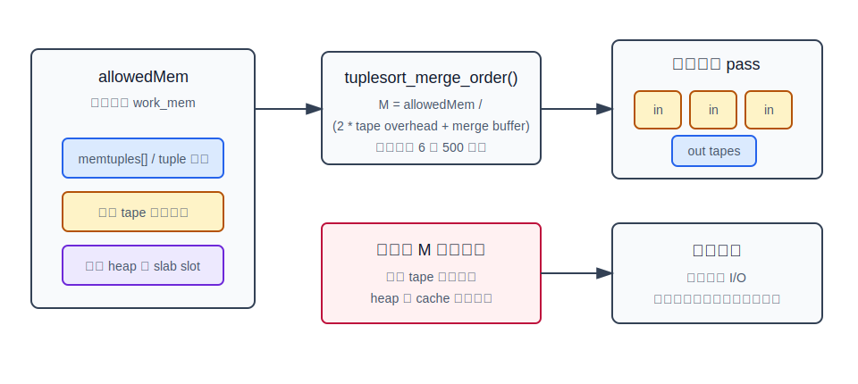
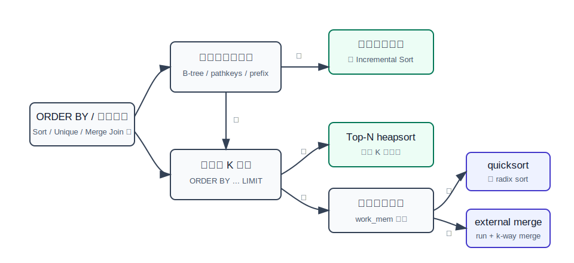

## 数据库筑基课 - 归并排序 (Mergesort)

### 作者
digoal

### 日期
2026-05-30

### 标签
PostgreSQL , 应用开发者 , 数据库筑基课 , 执行算法 , 排序 , Mergesort , Tuplesort

----

## 背景


当前项目中未找到“数据库筑基课大纲”文件；`references/manual-outline.md` 是金融操盘手册目录，不适合作为本文大纲引用。因此本文按“扫描/执行算法”独立成篇，风格和命名沿用当前 `markdown/database-foundation-*.md` 系列。

排序是数据库执行器里最常见的基础能力之一。业务侧写的是：

```sql
SELECT customer_id, paid_at, amount
FROM orders
ORDER BY paid_at DESC, id DESC;
```

执行器看到的是几个更工程化的问题：

1. 需要排序的输入有多大，能不能放进 `work_mem`？
2. 上层是否只要前 N 行，还是需要完整有序结果？
3. 是否已有 B-tree 索引或上游节点提供了可利用的有序前缀？
4. 如果内存不够，临时文件怎么写、怎么读、怎么减少重复 I/O？
5. 排序结果是否需要回扫、随机访问，还是可以边归并边返回？

归并排序的价值在第 4 个问题上最突出：当数据量超过内存时，它把“大量无序输入”转化成“多条已经有序的小 run”，再用多路归并把它们合成一个全局有序输出。PostgreSQL 当前实现不是教科书里简单的递归二路 mergesort，而是 `src/backend/utils/sort/tuplesort.c` 里的外部排序框架：内存批次用 quicksort 或 radix sort 生成 sorted run，落到 `logtape.c` 管理的 logical tape，再用 balanced k-way merge 完成归并。

本文的重点不是背算法，而是回答一个 DBA 和开发者每天都会遇到的问题：为什么一个 `ORDER BY` 有时只显示 `quicksort Memory`，有时变成 `external merge Disk`，以及该怎么验证和调优。

## 一、它解决什么问题？

归并排序解决的原始问题是：把两个或多个已经有序的序列合并成一个更大的有序序列。它的基本代价是线性的：两个长度分别为 `m` 和 `n` 的有序序列，只需要从两边前端不断取较小值，总代价约为 `O(m+n)`。

数据库把这个思想放大到外部排序：

- 输入太大，不能一次性放进内存。
- 先把内存能容纳的一批 tuple 排好序，写成一个 run。
- 多批输入产生多条 run。
- 后续只需要从每条 run 的前端拿一个候选，就能不断输出全局最小或最大 tuple。

它牺牲的代价也很清楚：

- 小数据排序时，归并排序未必比原地 quicksort 更划算。
- 外部归并排序会写临时文件，可能产生明显 I/O。
- `work_mem` 设置过小会产生更多 run 和更多 merge pass。
- `work_mem` 设置过大又会放大并发查询的内存压力，因为每个排序节点、每个并行 worker 都可能消耗自己的内存预算。
- PostgreSQL 排序语义不承诺稳定排序；如果相同 sort key 的行需要确定顺序，必须在 `ORDER BY` 里显式追加 tie-break key，例如主键或时间戳。

## 二、它是什么？

归并排序可以分成两层理解。

第一层是算法模型：

```text
merge(A, B):
  while A 和 B 都没有耗尽:
    输出两边当前较小的元素
    被输出的一边向后移动
  输出剩余元素
```

如果从无序数组开始，经典 mergesort 会不断拆分数组，递归排序左右两半，再合并。复杂度为 `O(n log n)`，额外空间通常为 `O(n)`，优点是顺序访问友好、稳定排序容易实现。

第二层是数据库模型。PostgreSQL 的外部排序更像这样：

```text
输入 tuple
  -> memtuples[] 中积累
  -> 超过 work_mem 后，把当前批次排成 sorted run
  -> 写入 logical tape
  -> 所有输入结束后，对多条 run 做 balanced k-way merge
  -> 输出全局有序 tuple
```



图 1 说明：`ExecSort()` 负责从子计划拉取 tuple 并喂给 `tuplesort`。如果输入能放进内存，`tuplesort_performsort()` 排好 `memtuples[]` 后直接返回；如果超过 `work_mem`，就把内存批次变成多条 sorted run，后续通过多路归并输出。

这里最容易误解的一点是：PostgreSQL 当前的 run generation 不是 replacement selection，也不是用 heap 生成长 run。`tuplesort.c` 顶部注释明确说明，历史上曾经用 replacement selection；当前总是用 quicksort 或 radix sort 生成 run。heap 当前主要用于 Top-N heapsort 和外部归并阶段的前端候选管理。

## 三、核心原理

### 3.1 执行入口：`Sort` 节点先收集全部输入

PostgreSQL 执行器的普通 Sort 节点在 `postgres/src/backend/executor/nodeSort.c`。第一次调用 `ExecSort()` 时，它会：

1. 初始化 `tuplesort_begin_heap()` 或 `tuplesort_begin_datum()`。
2. 使用 `work_mem` 作为排序内存预算。
3. 如果计划节点带 bounded 信息，调用 `tuplesort_set_bound()`。
4. 循环执行外层子计划，把 tuple 通过 `tuplesort_puttupleslot()` 或 `tuplesort_putdatum()` 喂入排序器。
5. 调用 `tuplesort_performsort()` 完成排序。
6. 后续调用用 `tuplesort_gettupleslot()` 或 `tuplesort_getdatum()` 取结果。

这解释了为什么普通 Sort 是阻塞算子：它通常必须先消费完子计划输入，才能返回第一行。官方文档也说明，规划器可能用 B-tree 索引直接满足 `ORDER BY`，也可能扫描表后增加显式 Sort；当查询只取少量行时，匹配 `ORDER BY` 的索引可以直接取前 N 行，避免处理剩余数据。

### 3.2 `tuplesort` 状态机：内存排序与外部排序分流

`postgres/src/backend/utils/sort/tuplesort.c` 定义了排序状态：

| 状态 | 含义 | 和归并排序的关系 |
|---|---|---|
| `TSS_INITIAL` | 正在加载 tuple，仍在内存限制内 | 如果输入结束，直接内存排序 |
| `TSS_BOUNDED` | Top-N bounded heap | 不是归并排序，用于 `ORDER BY ... LIMIT` |
| `TSS_BUILDRUNS` | 正在生成外部排序 run | 外部归并排序前半段 |
| `TSS_SORTEDINMEM` | 已在内存完成排序 | 无需外部归并 |
| `TSS_SORTEDONTAPE` | 最终结果在 tape 上 | 外部归并已物化 |
| `TSS_FINALMERGE` | 正在边归并边返回结果 | 节省最终一轮写读 |

当 `tuplesort_puttuple_common()` 发现 `memtuples[]` 或 tuple 内存已经触碰 `work_mem`，会调用 `inittapes()`，进入 `TSS_BUILDRUNS`，随后 `dumptuples()` 把当前内存批次排序并写入 tape。

`tuplesort_sort_memtuples()` 是每个内存批次的排序入口。源码逻辑是：

- 如果 leading key 可用且 comparator 是整数类，元素数达到 `QSORT_THRESHOLD`，走 `radix_sort_tuple()`。
- 如果是单 key 快路径，走 `qsort_ssup()`。
- 否则走 `qsort_tuple()`。

所以 PostgreSQL 的外部归并排序不是“从头到尾都用 mergesort”。更准确的说法是：run 内部由 quicksort/radix sort 排序，run 之间由 balanced k-way merge 合并。

### 3.3 run generation：把内存压力转成有序 run

`dumptuples()` 做三件事：

1. 确认当前内存批次需要落盘。
2. 调用 `tuplesort_sort_memtuples()` 排好 `memtuples[]`。
3. 把排好序的 tuple 写入当前输出 tape，形成一条 run。

如果输入仍然继续，下一批 tuple 会继续积累，达到阈值后再写下一条 run。输入结束时，`tuplesort_performsort()` 会对 `TSS_BUILDRUNS` 状态做收尾：先 `dumptuples(state, true)` 写出最后一批，再调用 `mergeruns()`。

这一步的工程意义是：排序器不再试图把所有输入都留在内存中，而是把“内存不足”变成“生成更多有序 run”。run 越多，后续归并成本越高；run 越少，临时文件 I/O 越少。

### 3.4 balanced k-way merge：每条 run 只保留一个前端候选

PostgreSQL 当前使用 balanced k-way merge。`tuplesort.c` 顶部注释还说明，PostgreSQL 15 以前使用 polyphase merge；当前改用 straightforward balanced merge，因为 logical tape 的成本只是少量内存缓冲，不再像 Knuth 讨论的物理磁带机那样昂贵。若 tape 数足够接近 run 数，甚至可以减少重复 I/O。

多路归并的核心结构是一个 heap：



图 2 说明：归并阶段不需要把所有 run 的数据读进内存。`beginmerge()` 从每条输入 tape 读取第一个 tuple，插入 `memtuples[]` 维护的 heap。`mergeonerun()` 每次输出堆顶 tuple，然后从同一条 tape 读取下一个 tuple，用 `tuplesort_heap_replace_top()` 替换；如果该 tape 耗尽，就删除堆顶。

这种设计的复杂度可以粗略理解为：

- run generation：每批内存排序，总体 CPU 接近 `N log N` 级别，具体取决于批次大小、比较器和 radix 快路径。
- k 路归并：每输出一个 tuple，需要在大小约为 `M` 的 heap 上调整，代价约为 `log M`，`M` 是本轮输入 tape 数。
- I/O：每个 merge pass 大致读一遍并写一遍参与归并的数据；pass 数由 run 数和 merge order 决定。

### 3.5 merge order：不是 tape 越多越好

`tuplesort_merge_order()` 根据可用内存估算一次 merge pass 使用多少条输入 tape。源码公式可以概括为：

```text
M = allowedMem / (2 * TAPE_BUFFER_OVERHEAD + MERGE_BUFFER_SIZE)
M 被限制在 MINORDER=6 和 MAXORDER=500 之间
```

其中 `TAPE_BUFFER_OVERHEAD` 约为一个 `BLCKSZ`，`MERGE_BUFFER_SIZE` 是每条输入 tape 希望获得的预读缓冲空间。源码注释解释了为什么不是 tape 越多越好：更多 tape 可以减少 merge pass，但每条 tape 分到的缓冲变少，heap 和 CPU cache 压力也会上升；极高阶归并可能比多做一轮 I/O 还慢。



图 3 说明：`work_mem` 不是全部用来装 tuple。外部排序进入 merge 阶段后，内存还要分给输入 tape 预读缓冲、输出 tape buffer、heap 数组和 slab slot。调大 `work_mem` 的收益来自减少 run、增加合理 merge order、改善预读，而不是简单地“越大越快”。

### 3.6 logical tape：把多个 tape 放进临时文件并复用空间

`postgres/src/backend/utils/sort/logtape.c` 负责管理 logical tape。它的注释点出了外部归并排序的一个老问题：如果每条 tape 都用独立文件，最终归并时同一份数据可能同时存在于输入 tape 和输出 tape，峰值空间至少接近数据量的两倍。

PostgreSQL 的处理方式是：

- 在一个 logical file 中模拟多条 tape。
- 每条 tape 按 `BLCKSZ` 块链起来。
- 某个 tape 的块被读完后，这些块可以回收给新的 tape 使用。
- 读 tape 时可以一次读多个块，改善顺序访问。
- parallel sort 时，leader 可以把 worker 的 tapeset 拼接成统一的 logical tapeset。

因此，`external merge Disk: xxxkB` 不是“排序结果文件大小”的精确同义词，而是排序过程中 `tuplesort` 记录到的最大磁盘空间占用。临时文件 I/O 还会受 `temp_tablespaces`、存储介质、并发查询和 OS cache 影响。

### 3.7 最后一轮可以在线归并

`mergeruns()` 有一个重要优化：如果调用方不需要随机访问排序结果，且已经到了最后一轮归并，它可以不把最终结果完整写到一个 tape 后再读回来，而是进入 `TSS_FINALMERGE`，由 `tuplesort_gettuple_common()` 边归并边返回。

这解释了 `tuplesort_get_stats()` 中两个方法名：

- `external sort`：最终结果已经物化在 tape 上。
- `external merge`：正在或曾经通过最终在线归并输出。

`EXPLAIN ANALYZE` 中 Sort 节点的 `Sort Method` 来自 `tuplesort_method_name()`，空间类型来自 `tuplesort_space_type_name()`，显示为 `Memory` 或 `Disk`。

### 3.8 并行排序：worker 产 run，leader 做最终归并

`tuplesort.h` 对 parallel sort 的调用顺序有专门说明。大体模型是：

- 每个 worker 有自己的 `Tuplesortstate`。
- worker 处理自己的输入分片，最终保证产生一条输出 run。
- leader 接管 worker tapes。
- leader 执行最终 merge。

这也意味着观察并行排序时要小心：`tuplesort_get_stats()` 只报告某个 worker 或 leader 自己的角色，不一定等于整个并行排序的总资源消耗。PostgreSQL 配置文档也提醒，`work_mem` 会按计划中的内存节点和 worker 分别应用，不能只按“单条 SQL 一个 work_mem”估算峰值内存。

## 四、横向对比

| 维度 | 归并排序 / external merge | Quicksort | Radix sort | Top-N heapsort | B-tree 有序扫描 |
|---|---|---|---|---|---|
| 主要目标 | 超过内存后合并多条有序 run | 内存数组完整排序 | 利用整数化 key 降低比较成本 | 只保留前 K 个候选 | 直接按索引顺序返回 |
| PostgreSQL 位置 | `tuplesort.c` 的 `mergeruns()`、`mergeonerun()` | `tuplesort_sort_memtuples()` | `radix_sort_tuple()` | `TSS_BOUNDED` | planner 选择 Index Scan |
| 内存行为 | 需要 tape buffer、小 heap、slab slot | 需要 `memtuples[]` | 需要辅助分区/缓冲 | 需要 K 个候选 | 主要消耗访问路径内存 |
| 磁盘行为 | 可能写临时文件，多轮读写 | 内存足够时不落盘 | 内存足够时不落盘 | 通常不为 Top-N 落盘 | 可能随机访问 heap，取决于覆盖性 |
| 适合场景 | 大排序、索引构建、宽输入超 `work_mem` | 中小排序、run generation | leading key 可整数比较且区分度好 | `ORDER BY ... LIMIT` | 匹配排序方向且只取少量行 |
| 不适合场景 | 小排序或高并发下滥调 `work_mem` | 超内存大排序后仍需外部机制 | 复杂 collation、多列比较不适配 | 无 LIMIT 的完整排序 | 大比例扫描且随机 I/O 很重 |

表里的关键不是“哪个算法更高级”，而是输入条件不同。PostgreSQL 的排序器是组合策略：内存里用 quicksort/radix，Top-N 用 heap，超内存用 logical tape 和 k-way merge，有索引顺序时可能完全避免 Sort。



图 4 说明：`ORDER BY` 不等于一定执行外部归并排序。优化器会先看路径是否已有顺序，再看是否能利用增量排序或 Top-N，最后才落到普通 Sort 的内存/外部分流。

## 五、效果如何？

归并排序的收益主要体现在三个方面。

第一，能处理远大于内存的数据。只要有临时文件空间，排序器可以把大输入拆成多个 run，再多轮合并。

第二，I/O 访问模式相对友好。`tuplesort.c` 注释强调，归并时会为每条输入 tape 预读约 `workMem/M` 的数据，避免在多个 tape 间频繁小块跳读。`logtape.c` 也说明会读多个块并复用已经读完的块。

第三，可以省掉最后一轮物化。在不需要随机访问时，`TSS_FINALMERGE` 允许边归并边返回，避免把最终结果再完整写一遍再读一遍。

代价同样要量化地看：

- CPU：普通完整排序估算约为 `N log2 N` 次比较；bounded heap-sort 估算约为 `N log2 K` 次比较。这个逻辑在 `cost_tuplesort()` 中可见。
- I/O：磁盘排序估算会计算 run 数、merge order 和 merge pass，`cost_tuplesort()` 里将磁盘访问粗略按 3/4 顺序、1/4 随机处理。
- 内存：`work_mem` 是每个排序操作的上限近似值，复杂查询可能有多个排序或哈希节点，并行 worker 还会放大总内存。
- 临时空间：`temp_file_limit` 可以限制单进程临时文件占用；`log_temp_files` 可以记录超过阈值的临时文件。

官方 `EXPLAIN ANALYZE` 文档示例展示过：

```text
Sort Method: quicksort  Memory: 74kB
```

而 `rules.sgml` 中一个 `ORDER BY ... LIMIT 10` 示例展示：

```text
Sort Method: top-N heapsort  Memory: 25kB
```

当输入超过内存时，实际环境中常见的是：

```text
Sort Method: external merge  Disk: 123456kB
```

这类输出不是本文执行出来的结果，而是 PostgreSQL Sort 节点的真实输出格式，方法名由 `tuplesort_method_name()` 定义。

## 六、实操 DEMO

以下 SQL 是最小可验证实验。本文未在本机启动 PostgreSQL 服务执行这些 SQL；示例用于读者在自己的测试库中复现，不包含伪造执行输出。

### 6.1 构造会排序的数据

```sql
DROP TABLE IF EXISTS demo_sort_orders;

CREATE TABLE demo_sort_orders AS
SELECT
  g AS id,
  (clock_timestamp() - (g % 100000) * interval '1 second') AS paid_at,
  md5(g::text) AS payload
FROM generate_series(1, 1000000) AS g;

ANALYZE demo_sort_orders;
```

### 6.2 观察内存排序或外部归并排序

```sql
SET work_mem = '1MB';

EXPLAIN (ANALYZE, BUFFERS)
SELECT id, paid_at, payload
FROM demo_sort_orders
ORDER BY paid_at, id;
```

重点看 Sort 节点：

```text
Sort
  Sort Key: paid_at, id
  Sort Method: external merge  Disk: ...
```

如果把 `work_mem` 调大，可能变成：

```sql
SET work_mem = '256MB';

EXPLAIN (ANALYZE, BUFFERS)
SELECT id, paid_at, payload
FROM demo_sort_orders
ORDER BY paid_at, id;
```

可能观察到：

```text
Sort Method: quicksort  Memory: ...
```

实际是否从外部归并变成内存排序，取决于版本、行宽、并发、配置和执行环境。

### 6.3 对比 Top-N heapsort

```sql
SET work_mem = '4MB';

EXPLAIN (ANALYZE, BUFFERS)
SELECT id, paid_at, payload
FROM demo_sort_orders
ORDER BY paid_at, id
LIMIT 100;
```

如果优化器选择显式 Sort 且 bounded sort 生效，可能看到：

```text
Sort Method: top-N heapsort  Memory: ...
```

这不是归并排序，而是本文前面提到的另一个 `tuplesort` 分支。它说明 `LIMIT` 改变了排序问题本身。

### 6.4 用索引避免显式 Sort

```sql
CREATE INDEX demo_sort_orders_paid_id_idx
ON demo_sort_orders (paid_at, id);

EXPLAIN (ANALYZE, BUFFERS)
SELECT id, paid_at, payload
FROM demo_sort_orders
ORDER BY paid_at, id
LIMIT 100;
```

如果索引路径成本更低，计划可能变成 Index Scan，不再出现 Sort 节点。官方索引文档也指出，B-tree 可以按顺序返回结果；其他索引类型通常不能保证 `ORDER BY` 所需顺序。

### 6.5 打开排序诊断日志

```sql
SET client_min_messages = log;
SET trace_sort = on;
SET log_temp_files = 0;

EXPLAIN (ANALYZE, BUFFERS)
SELECT id, paid_at, payload
FROM demo_sort_orders
ORDER BY paid_at, id;
```

`trace_sort` 会输出排序过程日志；`log_temp_files` 会记录临时文件。生产环境打开前要评估日志量，建议只在会话级、短时间诊断。

## 七、最佳实践

### 面向数据库架构师

1. 优先用访问路径减少排序需求，而不是只调大 `work_mem`。如果业务经常 `ORDER BY tenant_id, created_at DESC LIMIT 50`，应该评估复合 B-tree 索引是否能同时服务过滤和排序。
2. 区分“全量报表排序”和“交互式 Top-N 查询”。前者可能需要外部归并、批处理窗口和临时空间治理；后者更应该利用索引顺序或 bounded sort。
3. 对宽表排序要谨慎。排序 tuple 越宽，越容易超过 `work_mem`；可以先取 key 和主键排序，再回表取宽字段，但要用 `EXPLAIN (ANALYZE, BUFFERS)` 验证是否真的减少总成本。

### 面向 DBA

1. 不要把 `work_mem` 当全局越大越好的参数。一个查询可能有多个 Sort/Hash 节点，并行 worker 会各自消耗预算。全局调大容易制造内存峰值风险。
2. 用 `EXPLAIN (ANALYZE, BUFFERS)` 观察 `Sort Method`、`Memory`、`Disk`。持续出现大 `Disk` 排序时，再结合 `pg_stat_database.temp_files/temp_bytes`、`log_temp_files` 和慢 SQL 定位。
3. 为临时文件准备合适的 `temp_tablespaces`。外部归并排序会受临时文件所在存储介质影响；把临时空间放到拥挤或低可靠性的盘上，会把排序问题变成系统问题。
4. 用 `temp_file_limit` 给异常查询设边界。它不能让慢查询变快，但可以避免单个会话把临时空间耗尽。

### 面向业务开发者

1. `ORDER BY` 要和业务分页方式一起设计。深分页 `OFFSET 1000000 LIMIT 50` 常常迫使数据库处理大量不会返回的行；更好的方式通常是 keyset pagination。
2. 相同排序键必须追加确定性 tie-break key。例如 `ORDER BY created_at DESC, id DESC`，否则同一时间戳下的行顺序不稳定，分页可能重复或漏行。
3. 不要以为 `LIMIT` 一定便宜。没有匹配索引时，数据库仍可能需要处理全部输入来找出前 N 行，只是可以用 Top-N heap 减少内存候选数量。
4. 少在大结果集上按表达式排序。`ORDER BY lower(name)`、`ORDER BY distance(...)` 如果没有合适索引或预计算列，通常会触发昂贵排序。

## 八、适合与不适合场景

适合外部归并排序的场景：

- 报表、批处理、导出任务需要完整有序结果。
- Hash Aggregate 或 Hash Join 不适合，Merge Join 需要输入有序。
- `CREATE INDEX` / `REINDEX` 等维护操作需要先排序再构建结构。
- 单次排序数据量明显超过 `work_mem`，但临时文件空间充足。

不适合把问题交给外部归并排序硬扛的场景：

- 高频在线接口每次都对大表做无索引 `ORDER BY`。
- 只取 Top-N，却没有利用合适索引。
- 高并发环境中依赖大 `work_mem` 才能避免落盘。
- 临时文件空间不足或存储 I/O 已经是瓶颈。
- 排序 key 不确定，导致分页结果不稳定。

## 九、常见坑

### 9.1 把 `external merge` 误解成“数据库用了 mergesort 排内存数组”

`external merge` 主要指外部归并阶段。PostgreSQL 当前 run 内部通常是 quicksort 或 radix sort，不是递归 mergesort。

### 9.2 只看 `work_mem`，不看并发倍数

`work_mem = 128MB` 看似不大，但如果一个计划里有多个排序/哈希节点，再乘以并行 worker 和并发会话，峰值内存可能很快失控。

### 9.3 看到 Disk 就盲目加内存

外部排序落盘不一定是错误。低频批处理、维护任务、一次性报表可以接受落盘；真正要治理的是高频、长尾、阻塞业务链路的排序。

### 9.4 忽略行宽

同样 100 万行，排序三列整数和排序一列大 JSONB 字段的内存压力完全不同。必要时只排序 key 和行标识，再按结果回取宽列。

### 9.5 没有确定性排序键

`ORDER BY created_at DESC LIMIT 50` 在 `created_at` 大量重复时不保证稳定分页。归并排序、quicksort、索引扫描都不能替业务补上缺失的排序语义。

### 9.6 把 `log_temp_files` 当永久全量审计

`log_temp_files = 0` 对诊断很有用，但繁忙系统可能产生大量日志。建议会话级打开，或者设置合理阈值。

## 十、扩展问题

1. 为什么 PostgreSQL 15 以后 balanced merge 比 polyphase merge 更适合当前 logical tape 实现？
2. 如果 `work_mem` 增大一倍，run 数、merge pass、heap 大小和每条 tape 预读缓冲会分别怎样变化？
3. 为什么 `ORDER BY ... LIMIT` 有时用 Top-N heapsort，有时却走 Index Scan？
4. 对同一个大排序，减小 row width 和增大 `work_mem` 哪个收益更大？如何用实验验证？
5. GPU sorting 论文里常见的 radix/merge hybrid 思路，迁移到数据库执行器时会遇到哪些阻碍：tuple 格式、varlena、collation、MVCC、PCIe 拷贝，还是并发调度？

## 十一、扩展阅读

- PostgreSQL 源码：`postgres/src/backend/utils/sort/tuplesort.c`，外部排序、balanced k-way merge、状态机、`tuplesort_merge_order()`。
- PostgreSQL 源码：`postgres/src/backend/utils/sort/logtape.c`，logical tape、临时文件空间复用和预读。
- PostgreSQL 源码：`postgres/src/backend/executor/nodeSort.c`，执行器 Sort 节点如何调用 `tuplesort`。
- PostgreSQL 源码：`postgres/src/backend/optimizer/path/costsize.c`，`cost_tuplesort()` 对 CPU、磁盘 I/O、bounded sort 的估算。
- PostgreSQL 文档：`postgres/doc/src/sgml/indices.sgml`，B-tree 索引如何满足 `ORDER BY`。
- PostgreSQL 文档：`postgres/doc/src/sgml/perform.sgml`，`EXPLAIN ANALYZE` 中 Sort Method 和 Incremental Sort 示例。
- PostgreSQL 文档：`postgres/doc/src/sgml/config.sgml`，`work_mem`、`maintenance_work_mem`、`temp_file_limit`、`log_temp_files`、`trace_sort`。
- DeepWiki：`postgres/postgres` 关于 `tuplesort.c`、`nodeSort.c`、`logtape.c`、`costsize.c` 的排序实现摘要。本文用它辅助定位源码，关键结论以本地源码为准。
- Donald E. Knuth, *The Art of Computer Programming, Volume 3: Sorting and Searching*。PostgreSQL `tuplesort.c` 顶部注释也引用 Knuth 作为外部排序算法背景。
- Herman H. Goldstine and John von Neumann, *Planning and Coding of Problems for an Electronic Computing Instrument*。可作为早期电子计算排序问题的历史背景阅读。
- Nadathur Satish, Mark Harris, Michael Garland, *Designing Efficient Sorting Algorithms for Manycore GPUs*。可作为现代硬件上 radix sort、merge sort 与并行排序取舍的扩展阅读；本文未引用其未经本地核验的实验数字。
  
## 附录 
1、询问 gemini
```
归并排序 (Mergesort) 相关的论文
```

2、克隆代码  
```  
git clone --depth 1 https://github.com/postgres/postgres
```  
  
3、启用 codex, 使用 [数据库筑基课 skill](../skills/README.md).  
```
文章标题: 
  数据库筑基课 - 归并排序 (Mergesort)
项目源码(已克隆到当前项目如下目录中):  
  postgres
相关论文或分享:
  Planning and Coding of Problems for an Electronic Computing Instrument
  The Art of Computer Programming, Volume 3: Sorting and Searching
  Designing Efficient Sorting Algorithms for Manycore GPUs
项目 deepwiki reponame:  
  postgres/postgres
项目参考信息: 
  postgres/CLAUDE.md
```
  
  
#### [PostgreSQL 解决方案集合](../201706/20170601_02.md "40cff096e9ed7122c512b35d8561d9c8")
  
  
#### [德哥 / digoal's Github - 公益是一辈子的事.](https://github.com/digoal/blog/blob/master/README.md "22709685feb7cab07d30f30387f0a9ae")
  
  
#### [About 德哥](https://github.com/digoal/blog/blob/master/me/readme.md "a37735981e7704886ffd590565582dd0")
  
  

  
