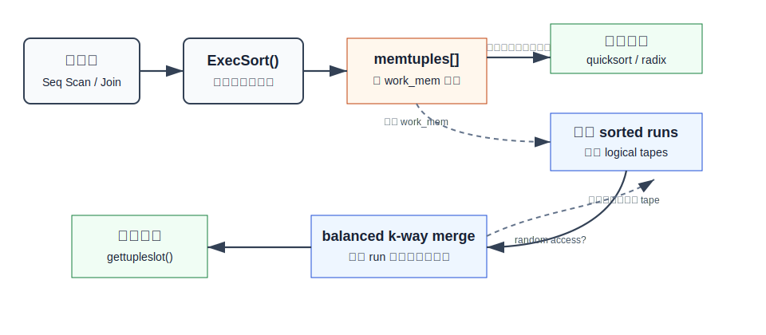
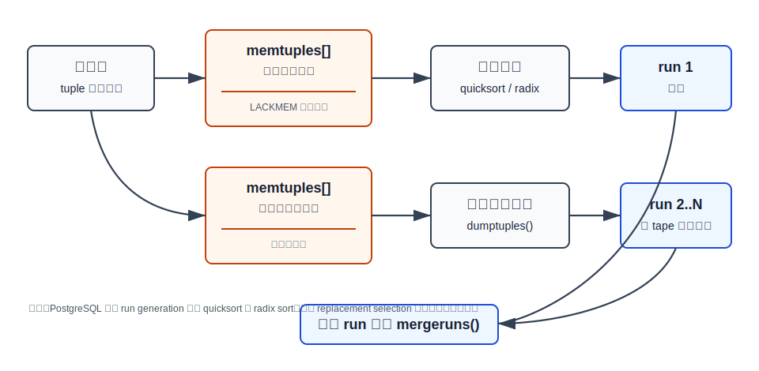
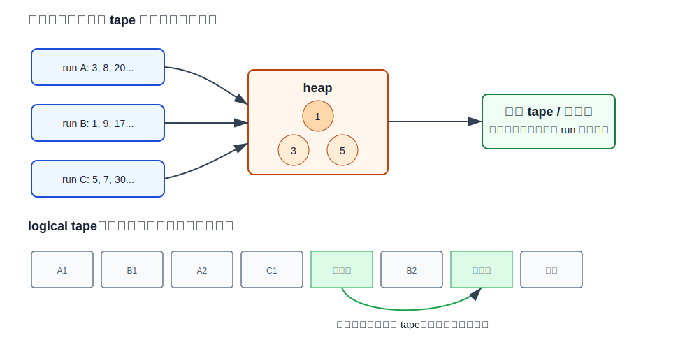
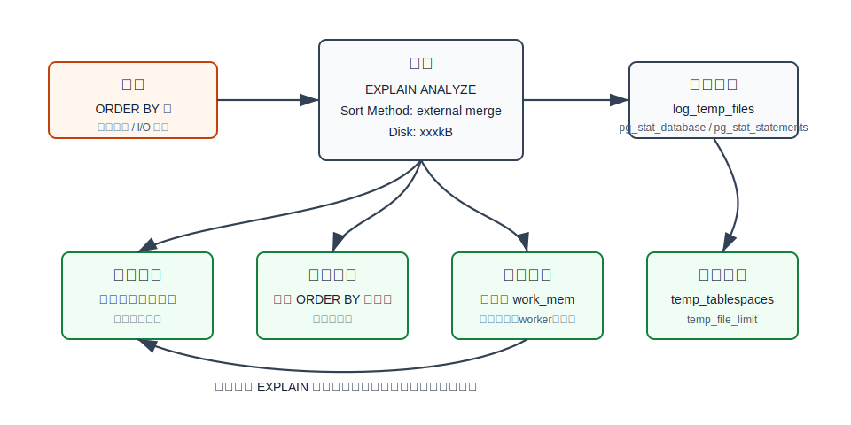

## 数据库筑基课 - 外部归并排序 (External Merge Sort)

### 作者
digoal

### 日期
2026-05-30

### 标签
PostgreSQL , 应用开发者 , 数据库筑基课 , 执行算法 , 排序 , External Merge Sort , Tuplesort

----

## 背景

  
业务侧看到的排序通常很简单：

```sql
SELECT order_id, customer_id, paid_at, amount
FROM orders
WHERE paid_at >= now() - interval '30 days'
ORDER BY paid_at DESC, order_id DESC;
```

数据库执行器看到的不是“排一下序”，而是一组资源问题：

1. 输入行数和行宽是否能放进 `work_mem`？
2. 是否已有索引或上游执行节点提供了目标顺序？
3. 上层只要 Top-N，还是需要完整有序结果？
4. 如果必须落盘，临时文件如何写、如何读、如何减少重复 I/O？
5. 并发查询和并行 worker 会把排序内存、临时文件和 I/O 放大多少？

外部归并排序解决的是第 1 和第 4 个问题：当数据量超过内存时，先把内存能容纳的批次分别排好序，写成多条有序 run，再把这些 run 做多路归并，输出全局有序结果。PostgreSQL 当前实现位于 `postgres/src/backend/utils/sort/tuplesort.c`，临时文件中的 logical tape 管理位于 `postgres/src/backend/utils/sort/logtape.c`，普通执行计划的 Sort 节点入口位于 `postgres/src/backend/executor/nodeSort.c`。

这篇文章不重复讲“归并排序递归拆分数组”的教科书版本，而是回答 DBA 和应用开发者更常遇到的问题：为什么 `EXPLAIN ANALYZE` 有时显示 `Sort Method: quicksort  Memory: ...`，有时显示 `Sort Method: external merge  Disk: ...`，以及该如何验证和调优。

## 一、它解决什么问题？

外部归并排序解决的是“内存装不下的全局排序”。原问题可以拆成两步：

- 内存内：把一批 tuple 排成有序 run。
- 磁盘上：把多条有序 run 合并成一条全局有序流。

PostgreSQL 的具体取舍很工程化：

- 输入没超过 `work_mem`：直接在内存中排序并返回。
- 输入超过 `work_mem`：进入外部排序，生成 run，写入 logical tape，再做 balanced k-way merge。
- 如果最终结果不需要随机访问：最后一轮可以边归并边返回，省掉“写最终结果再读回来”的一轮 I/O。
- 如果上层只需要前 N 行：可能使用 bounded Top-N heapsort，而不是完整外部归并。
- 如果索引已经提供目标顺序：优化器可能避免显式 Sort。

代价也要说清楚：

- 外部排序会产生临时文件，吞吐可能被磁盘和 OS cache 主导。
- `work_mem` 太小会产生更多 run 和 merge pass。
- `work_mem` 太大可能把并发查询推入内存压力，因为每个排序/哈希节点、每个 worker 都可能有自己的预算。
- 排序比较器可能很贵，尤其是多列、复杂 collation、宽 tuple 或 pass-by-reference 类型。
- SQL 结果如果需要稳定的同 key 顺序，必须显式写 tie-breaker，例如追加主键；不要依赖排序算法的稳定性。

## 二、它是什么？

外部归并排序是一种适合“大数据量、有限内存、顺序 I/O”的排序框架。它不要求一次把全部数据放入内存，而是把输入切成多批：

```text
输入 tuple
  -> 在 memtuples[] 中积累
  -> 超过 work_mem 后，把当前批次排序成 run
  -> run 写入 logical tape
  -> 输入结束后，对多条 run 做 k 路归并
  -> 输出全局有序 tuple
```



图 1 说明：`ExecSort()` 第一次被调用时从子计划拉取输入，喂给 `tuplesort`。如果输入能放入内存，`tuplesort_performsort()` 排好 `memtuples[]` 后直接返回；如果超过 `work_mem`，就把内存批次写成多条 sorted run，后续通过多路归并输出。

要避免一个常见误解：PostgreSQL 当前外部排序不是“所有阶段都用 mergesort”。`tuplesort.c` 顶部注释说明，当前 run generation 使用 quicksort 或 radix sort；历史上用过 replacement selection，但当前路径已经不是它。更准确的说法是：**run 内部由 quicksort/radix sort 排序，run 之间由 balanced k-way merge 合并**。

## 三、核心原理

### 3.1 执行入口：Sort 是阻塞算子

普通 Sort 节点在 `postgres/src/backend/executor/nodeSort.c`。`ExecSort()` 第一次运行时会：

1. 根据输出列形式调用 `tuplesort_begin_heap()` 或 `tuplesort_begin_datum()`。
2. 把 `work_mem` 传给 `tuplesort` 作为排序内存预算。
3. 如果计划节点允许 bounded sort，调用 `tuplesort_set_bound()`。
4. 循环执行外层子计划，把所有 tuple 喂入排序器。
5. 调用 `tuplesort_performsort()` 完成排序。
6. 后续调用从 `tuplesort_gettupleslot()` 或 `tuplesort_getdatum()` 取结果。

这解释了为什么普通 Sort 通常是阻塞算子：它要先消费完下层输入，才能稳定地产生全局有序输出。例外是外部排序最后一轮可以在线归并，但那发生在输入已经全部读取、run 已经生成之后。

### 3.2 状态机：从内存排序切到外部排序

`tuplesort.c` 定义了几个关键状态：

| 状态 | 含义 | 和外部归并排序的关系 |
|---|---|---|
| `TSS_INITIAL` | 正在加载 tuple，仍在内存限制内 | 输入结束则直接内存排序 |
| `TSS_BOUNDED` | Top-N bounded heap | 不是完整外部归并 |
| `TSS_BUILDRUNS` | 正在生成外部排序 run | 外部排序前半段 |
| `TSS_SORTEDINMEM` | 已在内存完成排序 | 不需要临时文件 |
| `TSS_SORTEDONTAPE` | 最终结果在 tape 上 | 已完成外部排序并物化结果 |
| `TSS_FINALMERGE` | 正在边归并边返回结果 | 省掉最终物化的一轮 I/O |

`tuplesort_begin_common()` 会把 `work_mem` 转为字节级 `allowedMem`，并强制至少 64KB。输入 tuple 先进入 `memtuples[]`。当内存或数组容量不足时，`inittapes()` 创建 logical tape set，状态进入 `TSS_BUILDRUNS`；随后 `dumptuples()` 把当前内存批次排序并写成 run。

### 3.3 run generation：把内存不足转化为多条有序 run

run generation 的关键函数是 `dumptuples()`：

1. 检查是否真的需要 dump，除非这是输入结束时的最后一次 dump。
2. 调用 `tuplesort_sort_memtuples()` 排好当前 `memtuples[]`。
3. 逐个 `WRITETUP()` 写入当前输出 tape。
4. 写 end-of-run 标记。
5. 清空 tuple memory context，继续接收下一批输入。



图 2 说明：每个 run 是“在 `work_mem` 附近能容纳的一批 tuple 排序后写出的有序段”。run 越多，后续归并压力越大；run 越少，临时 I/O 和 merge pass 通常越少。这里的批内排序由 quicksort 或 radix sort 完成，不是用 heap 逐个生成长 run。

`tuplesort_sort_memtuples()` 的策略可以概括为：

- leading key 可用且 comparator 适合整数类 radix 路径，且元素数达到阈值时，用 radix sort。
- 单 key fast path 时，用 `qsort_ssup()`。
- 通用多列或复杂比较时，用 `qsort_tuple()`。

这就是为什么外部归并排序依然会在日志里看到 “starting quicksort of run”。它不是矛盾，而是外部排序的第一阶段。

### 3.4 balanced k-way merge：每条 run 只保留前端候选

当输入结束，`tuplesort_performsort()` 会在 `TSS_BUILDRUNS` 状态下调用 `mergeruns()`。源码注释明确说它实现的是 Balanced k-Way Merge Algorithm。

归并阶段不把所有 run 重新读入内存，而是：

1. `beginmerge()` 从每条输入 tape 读一个 tuple。
2. 这些前端 tuple 进入 `memtuples[]` 维护的 heap。
3. 每次输出堆顶 tuple。
4. 从同一条源 tape 读下一个 tuple，替换堆顶并调整 heap。
5. 某条 tape 耗尽时删除堆顶。
6. heap 清空时，本轮归并完成。



图 3 上半部分说明：k 路归并只需要保存每条 run 的前端候选，内存主要花在 heap、tuple slot 和 tape 预读缓冲上，而不是把全部数据读回来。下半部分说明：logical tape 把多个 tape 映射到同一临时文件的块链中，读完的块可以回收给新 tape，降低峰值临时空间。

### 3.5 merge order：不是 tape 越多越好

`tuplesort_merge_order()` 用 `allowedMem` 估算本轮归并的输入 tape 数：

```text
M = allowedMem / (2 * TAPE_BUFFER_OVERHEAD + MERGE_BUFFER_SIZE)
M 被限制在 MINORDER=6 与 MAXORDER=500 之间
```

这个公式背后的含义是：

- 每条输入 tape 需要基础 buffer。
- 每条输出 tape 也需要基础 buffer。
- 输入 tape 还希望有额外预读空间，减少随机访问。
- tape 越多，merge pass 可能越少，但每条 tape 分到的 buffer 越少，CPU cache 和 heap 调整成本也会上升。

`tuplesort.c` 源码注释直接指出，高阶归并并不总是更快；有时多做一轮 I/O 比在数百条 tape 上做单轮归并更划算。这一点很重要：`work_mem` 调优不是简单的“越大越好”，而是要在 run 数、merge pass、并发内存和 I/O 之间找平衡。

### 3.6 logical tape：外部排序的临时文件抽象

`postgres/src/backend/utils/sort/logtape.c` 说明了 logical tape 的设计目的：如果每条 tape 用独立文件，最终归并时同一份数据可能同时存在于输入 tape 和输出 tape，峰值空间至少接近数据量的两倍。

PostgreSQL 的做法是：

- 在一个 logical file 中模拟多条 tape。
- 每条 tape 由 `BLCKSZ` 大小的块链组成，块尾保存前后指针或有效字节数。
- 某条 tape 的块读完后可以被回收到 free block 集合。
- 读 tape 时可以一次读多个块，改善顺序访问。
- 底层用 `buffile.c` 处理超过单文件限制的逻辑文件。
- 并行排序时，leader 可以把 worker 的 tapeset 拼接成一个统一的 logical tapeset。

因此，`EXPLAIN ANALYZE` 里的 `Disk: xxxkB` 是 `tuplesort` 记录到的最大磁盘空间占用，不应简单理解为“最终排序结果文件大小”。真实压力还要结合 `log_temp_files`、`pg_stat_database.temp_bytes`、`pg_stat_statements.temp_blks_read/temp_blks_written`、存储介质和并发负载判断。

### 3.7 最后一轮在线归并：`external merge` 的来源

`mergeruns()` 有一个关键优化：如果调用方不需要 `TUPLESORT_RANDOMACCESS`，而且已经只剩最后一轮归并，非 worker 排序可以进入 `TSS_FINALMERGE`，由调用方不断取 tuple 时在线归并。这样避免把最终全局有序结果完整写入 tape 后再读出。

`tuplesort_get_stats()` 根据达到最大空间占用时的状态报告 Sort Method：

- `TSS_SORTEDINMEM` 且不是 bounded：`quicksort`
- `TSS_SORTEDINMEM` 且使用 bounded heap：`top-N heapsort`
- `TSS_SORTEDONTAPE`：`external sort`
- `TSS_FINALMERGE`：`external merge`

`postgres/src/backend/commands/explain.c` 的 `show_sort_info()` 会把这些统计打印成：

```text
Sort Method: external merge  Disk: 123456kB
```

### 3.8 并行排序：worker 产 run，leader 归并

`postgres/src/include/utils/tuplesort.h` 对 parallel sort 的调用顺序有专门说明。大体模型是：

- leader 初始化共享排序状态并启动 workers。
- 每个 worker 有自己的 `Tuplesortstate`，处理自己的输入分片。
- worker 调用 `tuplesort_performsort()`，通常产生一条输出 run。
- leader 等待 workers 完成，然后接管 worker tapes。
- leader 调用 `tuplesort_performsort()` 归并 worker 结果。

这里有两个运维含义：

- `tuplesort_get_stats()` 报的是某个 worker 或 leader 自己的角色，不是整个并行排序的总和。
- PostgreSQL 配置文档提醒，`work_mem` 等资源限制会分别应用到每个 worker；4 个 worker 加 leader 时，资源使用可能接近非并行计划的 5 倍。

## 四、横向对比

| 维度 | 外部归并排序 | 内存 quicksort/radix | Top-N heapsort | B-tree 有序扫描 | HashAgg/HashJoin spill |
|---|---|---|---|---|---|
| 主要目标 | 超内存全局排序 | 内存内完整排序或 run generation | 只保留前 K 个候选 | 避免显式 Sort | 超内存哈希处理 |
| PostgreSQL 位置 | `tuplesort.c` + `logtape.c` | `tuplesort_sort_memtuples()` | `TSS_BOUNDED` | 优化器选择 Index Scan | `nodeAgg.c` / `nodeHash.c` |
| 内存行为 | tape buffer + heap + tuple slot | `memtuples[]` 和 tuple 数据 | K 个候选及 heap | 依赖索引/执行节点 | hash table + batch |
| 磁盘行为 | 写 run，读/写 merge pass | 内存足够时不落盘 | 通常避免完整落盘 | 可能产生随机 heap 访问 | 写 batch 临时文件 |
| 适合场景 | 大 ORDER BY、DISTINCT、Merge Join 输入、索引构建排序 | 中小排序、外部 run 批内排序 | `ORDER BY ... LIMIT` | 顺序匹配且过滤/limit 有效 | 等值 join/聚合且哈希更合适 |
| 不适合场景 | 高并发下盲目放大 `work_mem` | 输入明显超内存 | 需要完整有序结果 | 大比例随机回表代价高 | 内存不足导致大量 batch |

表里的重点不是“哪个算法先进”，而是执行器按问题选择工具。PostgreSQL 的排序器是组合策略：能内存排就内存排，能 Top-N 就 bounded heap，必须超内存才外部归并，能用索引顺序时可能完全绕开 Sort。

## 五、效果如何？

外部归并排序的收益：

- 能处理远大于内存的数据集。
- 归并阶段以顺序读写为主，比随机访问大文件更适合磁盘和 OS read-ahead。
- logical tape 回收读完的块，降低临时空间峰值。
- 最后一轮在线归并可避免一次完整写读。
- 并行排序能把 run generation 分散到多个 worker，再由 leader 合并。

它的成本：

- 临时文件会占用 `base/pgsql_tmp` 或 `temp_tablespaces` 指向的空间。
- 每个 merge pass 通常意味着读一遍、写一遍相关数据；pass 越多，I/O 放大越明显。
- tuple 比较仍然消耗 CPU，复杂 collation、多列排序和宽 tuple 会放大比较/拷贝成本。
- `work_mem` 是节点级、worker 级预算，不能按单 SQL 一个值估算。
- `Disk: xxxkB` 只说明排序方法和空间峰值，不直接等同于业务查询慢的全部原因。

一个粗略心智模型：

```text
总成本 = 读入输入
       + run 内排序 CPU
       + 写初始 runs
       + 若干 merge pass 的读写 I/O
       + k 路 heap 调整 CPU
       + 输出结果
```

调优时先判断瓶颈是“排序本身太大”，还是“原本就不该排序那么多数据”。前者考虑内存、临时空间和并行；后者考虑索引、过滤、投影、分页和 SQL 改写。

## 六、实操 DEMO

下面是一个最小可验证实验，用来观察内存排序与外部排序。本文没有在当前环境启动 PostgreSQL 实例执行，因此不提供伪造输出；读者可在自己的测试库中运行。

```sql
CREATE TABLE demo_external_sort AS
SELECT g AS id,
       md5(g::text) AS payload,
       clock_timestamp() - (g % 1000000) * interval '1 second' AS ts
FROM generate_series(1, 3000000) AS g;

ANALYZE demo_external_sort;
```

强制较小 `work_mem`，观察外部排序：

```sql
SET work_mem = '4MB';
SET log_temp_files = 0;

EXPLAIN (ANALYZE, BUFFERS)
SELECT id, payload, ts
FROM demo_external_sort
ORDER BY payload, id;
```

重点看：

```text
Sort Method: external merge  Disk: ...kB
```

再提高 `work_mem`，观察是否减少落盘或降低磁盘空间：

```sql
SET work_mem = '256MB';

EXPLAIN (ANALYZE, BUFFERS)
SELECT id, payload, ts
FROM demo_external_sort
ORDER BY payload, id;
```

如果业务只要前 100 行，对比 Top-N：

```sql
SET work_mem = '4MB';

EXPLAIN (ANALYZE, BUFFERS)
SELECT id, payload, ts
FROM demo_external_sort
ORDER BY payload, id
LIMIT 100;
```

如果排序模式固定，可以测试索引是否能避免显式 Sort：

```sql
CREATE INDEX demo_external_sort_payload_id_idx
ON demo_external_sort (payload, id);

EXPLAIN (ANALYZE, BUFFERS)
SELECT id, payload, ts
FROM demo_external_sort
ORDER BY payload, id
LIMIT 100;
```

验证时不要只看总耗时。至少同时看：

- 是否还有 `Sort` 节点。
- `Sort Method` 是 `quicksort`、`top-N heapsort`、`external sort` 还是 `external merge`。
- 空间类型是 `Memory` 还是 `Disk`。
- `BUFFERS` 中是否有大量 temp read/write。
- 日志中 `log_temp_files` 记录的临时文件大小。
- `pg_stat_database.temp_files/temp_bytes` 是否持续上升。



图 4 说明：外部排序调优要闭环验证。先用 `EXPLAIN ANALYZE` 和日志确认是否真的 spill，再决定是减少输入、利用索引顺序、调整 `work_mem`，还是把临时文件放到更合适的表空间并设置保护阈值。

## 七、最佳实践

### 面向数据库架构师

把排序当作资源预算问题，而不是单个参数问题。设计系统时需要估算：

- 同一查询中可能同时存在多少 Sort/Hash 节点。
- 并行计划最多会启动多少 worker。
- 高峰期有多少会话可能同时执行大排序。
- 临时文件落在哪些磁盘或表空间。
- 业务是否允许用索引顺序、物化视图、分区裁剪或预聚合减少排序输入。

一个保守估算：

```text
排序内存上界 ≈ 活跃会话数 * 每会话活跃内存节点数 * 每节点 work_mem * 并行进程数
```

这里的“并行进程数”要把 leader 也考虑进去。这个公式不是精确值，但足以防止把 `work_mem` 从 4MB 直接调到 1GB 后让系统在并发下失控。

### 面向 DBA

先观测，再调参：

- 用 `EXPLAIN (ANALYZE, BUFFERS)` 定位 `external merge` 或 `external sort`。
- 临时打开 `log_temp_files = 0` 观察单次查询的临时文件。
- 用 `pg_stat_database.temp_files/temp_bytes` 看库级趋势。
- 安装并使用 `pg_stat_statements` 时，关注 `temp_blks_read/temp_blks_written`。
- 对批处理或报表会话可以 session 级提高 `work_mem`，不要一上来全局提高。
- 用 `temp_file_limit` 防止异常 SQL 吃光临时空间。
- 把 `temp_tablespaces` 指到合适的高速盘或隔离盘，避免影响主数据文件。
- 需要进一步诊断排序内部阶段时，可短时打开 `trace_sort`，但不要长期在生产高负载下打开。

### 面向业务开发者

减少排序输入通常比提高 `work_mem` 更有效：

- `ORDER BY` 后接分页时，尽量使用能匹配排序方向的索引。
- 深分页不要长期使用大 offset；考虑 keyset pagination。
- 只选择需要的列，避免对宽行排序。
- 先过滤再排序，避免把低选择性过滤放到排序之后。
- `ORDER BY` 必须包含确定性 tie-breaker，避免同 key 行顺序不稳定。
- 报表类 SQL 可考虑预聚合、物化视图或离线排序。
- 如果只要 Top-N，不要在应用侧取全量再截断。

## 八、适合与不适合场景

适合：

- 大结果集 `ORDER BY`，输入超过 `work_mem`。
- `DISTINCT`、`GROUP BY`、窗口函数或 Merge Join 需要有序输入，且无法通过索引顺序满足。
- 大型索引构建中需要排序 index tuple。
- 批处理、ETL、报表、离线导出这类可以接受临时 I/O 的任务。
- 结果需要完整有序，而不是只取极少 Top-N。

不适合或应优先避免：

- 高频 OLTP 请求中对大范围结果排序。
- 能用索引顺序直接返回 Top-N，却让数据库扫描大量行后再 Sort。
- 宽行排序，但上层只需要少数列。
- 临时空间和 I/O 已经是系统瓶颈的环境。
- 高并发场景下用全局大 `work_mem` 掩盖 SQL 和索引设计问题。
- 需要稳定同 key 顺序但 SQL 没写 tie-breaker 的场景。

## 九、常见坑

1. **把 `work_mem` 当成实例级总内存。**  
   PostgreSQL 文档明确说，复杂查询可能同时有多个 sort/hash 操作，多个会话也会并发执行。并行 worker 还会分别应用资源限制。

2. **看到 `external merge` 就只调大 `work_mem`。**  
   如果排序输入本来就不该这么大，正确方向可能是索引、过滤、投影、分页或预聚合。

3. **忽略 `ORDER BY ... LIMIT` 的特殊路径。**  
   Top-N heapsort 与完整排序不同。若只要少量结果，索引顺序或 bounded sort 可能比外部归并更合适。

4. **用单次耗时判断调优成功。**  
   OS cache、并发 I/O、临时文件路径都会影响结果。至少结合 `EXPLAIN`、temp blocks、日志临时文件和多次运行观察。

5. **把 `Disk: xxxkB` 理解成最终结果大小。**  
   它来自 `tuplesort` 统计的空间占用，和 logical tape 的块复用、最终在线归并、临时文件生命周期有关。

6. **忘记 collation 和数据类型比较成本。**  
   文本排序、复杂 collation、多列排序可能 CPU 很重；减少排序列、使用合适类型和索引顺序都可能有效。

7. **生产长期打开 `trace_sort`。**  
   它适合诊断排序阶段和资源使用，不适合作为常态日志。

## 十、扩展问题

1. 为什么 PostgreSQL 15 以后更偏向 balanced k-way merge，而不是继续使用 polyphase merge？
2. 如果 `work_mem` 增大后 `external merge` 仍然存在，可能有哪些原因？
3. 为什么 Top-N heapsort 对 `ORDER BY ... LIMIT` 有意义，但对完整排序没有意义？
4. logical tape 的块回收为什么能降低临时空间峰值？它是否也一定降低 I/O 次数？
5. 并行排序中，为什么 worker 统计不能直接代表整个排序的总成本？
6. 对一个慢查询，你会先尝试索引顺序、减少投影列、提高 `work_mem`，还是调整临时表空间？依据是什么？

## 十一、扩展阅读

- PostgreSQL 源码：`postgres/src/backend/executor/nodeSort.c`，Sort 执行节点，负责初始化 `tuplesort`、读取子计划输入、返回排序结果。
- PostgreSQL 源码：`postgres/src/backend/utils/sort/tuplesort.c`，通用排序框架，包含内存排序、run generation、balanced k-way merge、parallel sort 支持和统计输出。
- PostgreSQL 源码：`postgres/src/backend/utils/sort/logtape.c`，logical tape 管理，负责外部排序临时文件中的块链、预读和空间复用。
- PostgreSQL 源码：`postgres/src/include/utils/tuplesort.h`，`SortTuple` 数据结构和 parallel sort 调用协议。
- PostgreSQL 源码：`postgres/src/backend/commands/explain.c` 与 `postgres/src/include/executor/instrument_node.h`，`EXPLAIN ANALYZE` 中 `Sort Method`、`Memory`、`Disk` 的统计来源。
- PostgreSQL 官方文档：`postgres/doc/src/sgml/config.sgml`，`work_mem`、`temp_file_limit`、`log_temp_files`、`trace_sort`、并行 worker 资源限制说明。
- PostgreSQL 官方文档：`postgres/doc/src/sgml/perform.sgml`，`EXPLAIN ANALYZE` 中 Sort 节点统计示例和 `BUFFERS` 观测方法。
- DeepWiki：`postgres/postgres`，用于交叉确认 PostgreSQL 查询执行、Sort 节点、`tuplesort`、`logtape`、`EXPLAIN` 相关文件位置；关键结论已回到本地源码核验。
- Donald E. Knuth, *The Art of Computer Programming, Volume 3: Sorting and Searching*，外部排序、多路归并、polyphase merge 等算法背景。
- “Asynchronous Disk I/O with Buffering for Run Generation and Testing”，外部排序中异步 I/O、buffering 与 run generation 的算法背景；本文未引用无法本地核验的实验数字。
- Chris Nyberg, Tom Barclay, Zarka Cvetanovic, Jim Gray, Dave Lomet, “AlphaSort: A RISC Machine Sort”，外部排序、缓存敏感排序和系统级 sort benchmark 的经典背景；本文只引用其主题，不引用未核验的性能数字。
  
## 附录 
1、询问 gemini
```
外部归并排序 (External Merge Sort) 相关的论文
```

2、克隆代码  
```  
git clone --depth 1 https://github.com/postgres/postgres
```  
  
3、启用 codex, 使用 [数据库筑基课 skill](../skills/README.md).  
```
文章标题: 
  数据库筑基课 - 外部归并排序 (External Merge Sort)
项目源码(已克隆到当前项目如下目录中):  
  postgres
相关论文或分享:
  The Art of Computer Programming, Volume 3: Sorting and Searching
  Asynchronous Disk I/O with Buffering for Run Generation and Testing
  AlphaSort: A RISC Machine Sort
项目 deepwiki reponame:  
  postgres/postgres
项目参考信息: 
  postgres/CLAUDE.md
```
  
  
#### [PostgreSQL 解决方案集合](../201706/20170601_02.md "40cff096e9ed7122c512b35d8561d9c8")
  
  
#### [德哥 / digoal's Github - 公益是一辈子的事.](https://github.com/digoal/blog/blob/master/README.md "22709685feb7cab07d30f30387f0a9ae")
  
  
#### [About 德哥](https://github.com/digoal/blog/blob/master/me/readme.md "a37735981e7704886ffd590565582dd0")
  
  

  
