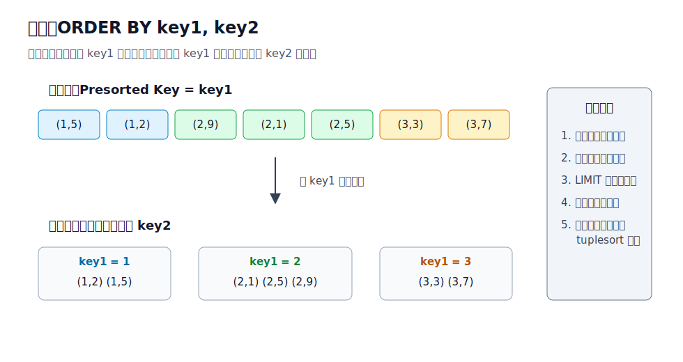
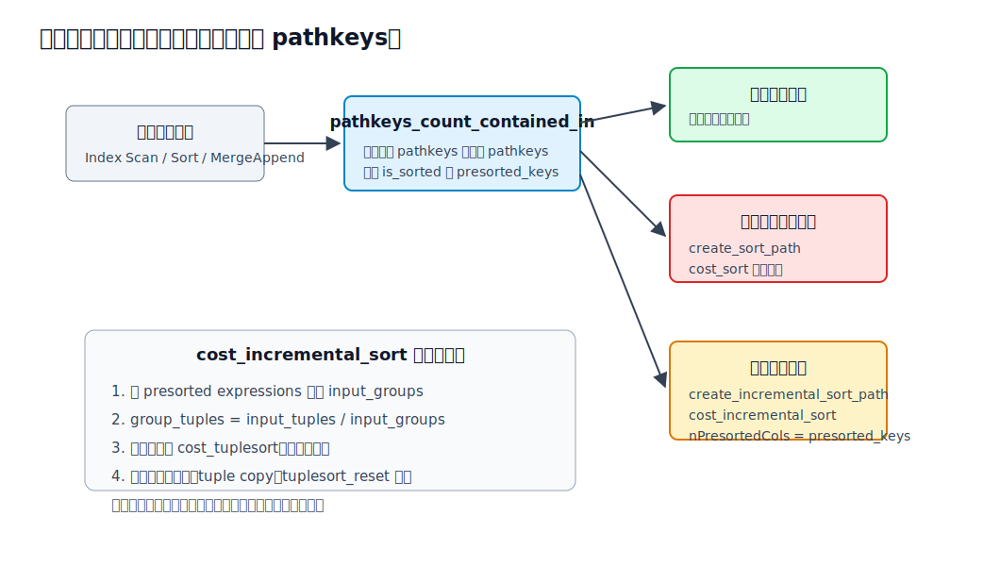
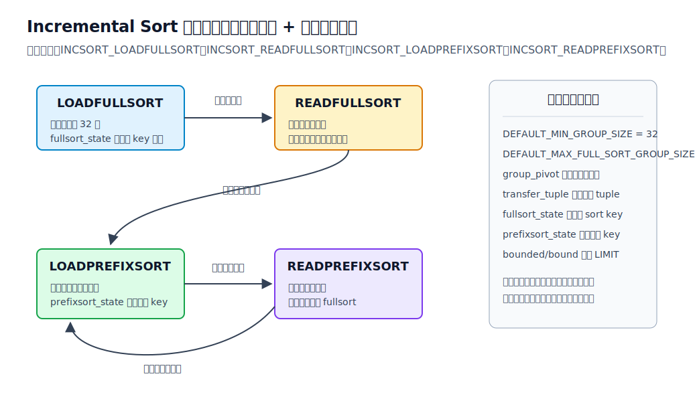
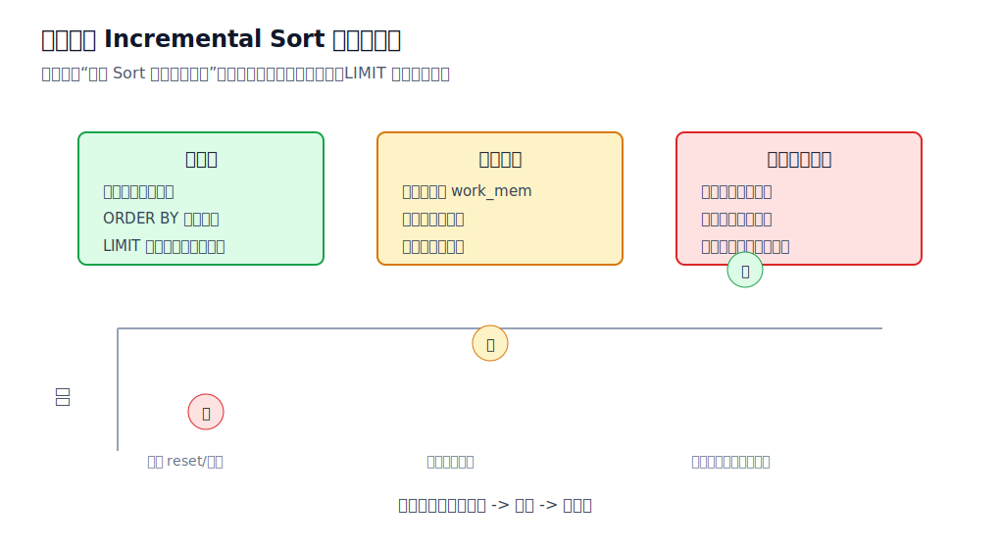

## 数据库筑基课 - 增量排序 (Incremental Sort)

### 作者
digoal

### 日期
2026-05-30

### 标签
PostgreSQL , 应用开发者 , 数据库筑基课 , 执行算法 , 优化器 , 排序 , Incremental Sort , Tuplesort

----

## 背景

  
业务查询里，排序经常不是“从零开始排”：

```sql
SELECT tenant_id, created_at, order_id, amount
FROM orders
WHERE tenant_id BETWEEN 100 AND 200
ORDER BY tenant_id, created_at DESC, order_id DESC
LIMIT 100;
```

如果已有索引或上游执行节点能按 `tenant_id` 输出，数据库还需要把全部结果按三列完整排序吗？未必。更聪明的做法是：既然输入已经按 `tenant_id` 这个前缀有序，就把相同 `tenant_id` 的行分成一组，只在组内补齐 `created_at, order_id` 的顺序。PostgreSQL 把这类执行节点称为 **Incremental Sort**。

这篇文章聚焦 PostgreSQL 当前实现，而不是泛泛讲算法名词。主要源码和文档依据包括：

- `postgres/src/backend/executor/nodeIncrementalSort.c`
- `postgres/src/backend/optimizer/path/costsize.c`
- `postgres/src/backend/optimizer/util/pathnode.c`
- `postgres/src/backend/optimizer/plan/createplan.c`
- `postgres/src/include/nodes/plannodes.h`
- `postgres/src/include/nodes/pathnodes.h`
- `postgres/src/include/nodes/execnodes.h`
- `postgres/src/backend/commands/explain.c`
- `postgres/doc/src/sgml/perform.sgml`
- `postgres/doc/src/sgml/config.sgml`
- `postgres/src/test/regress/sql/incremental_sort.sql`
- `postgres/src/test/regress/expected/incremental_sort.out`

用户给出的论文或分享 `Optimal Incremental Sorting`、`Incremental Sorting for Large Dynamic Data Sets` 在当前项目中没有原文文件；本文只把它们作为算法思想背景：增量排序的共同思想是复用已有顺序或已有排序状态，避免把全部数据当作完全无序集合重新处理。本文不引用无法本地核验的实验数字。

## 一、它解决什么问题？

Incremental Sort 解决的是“目标排序键有多列，而输入已经按前若干列有序”的问题。

普通全量排序的思路是：

```text
输入 N 行
  -> 按 (key1, key2, ..., keyN) 完整排序
  -> 全部排好后，才能稳定输出全局有序结果
```

Incremental Sort 的思路是：

```text
输入已经按 (key1, ..., keyM) 有序，M < N
  -> 找到前缀 key 相同的连续组
  -> 每组只补排后缀 (keyM+1, ..., keyN)
  -> 排完一组即可输出一组
```

它把一个大排序拆成多个小排序，带来三个直接收益：

1. **更低启动延迟**：第一组排完就能向上层返回，`LIMIT` 特别容易受益。
2. **更低峰值内存**：单次排序只处理一个或少量前缀组，更可能落在 `work_mem` 内。
3. **更少落盘概率**：全量排序可能 external merge，分组排序可能多数在内存完成。

代价也真实存在：

1. 要检测前缀组边界，多了一些 tuple copy 和比较成本。
2. 小组非常多时，频繁启动或 reset `tuplesort` 可能抵消收益。
3. 成本模型依赖前缀组数估计，统计信息不准时可能选错计划。
4. 它只能复用“前缀有序”，不能凭空解决任意乱序。

## 二、它是什么？

在 PostgreSQL 里，Incremental Sort 是一个显式计划节点。计划结构上，它是 `Sort` 的变体：

| 层次 | 关键结构 | 含义 |
|---|---|---|
| Path | `IncrementalSortPath` | 优化器候选路径，记录 `nPresortedCols` |
| Plan | `IncrementalSort` | 执行计划节点，继承 `Sort` 字段并记录前缀列数 |
| Executor | `IncrementalSortState` | 执行期状态机，持有 fullsort 和 prefixsort 两个 `tuplesort` 状态 |
| EXPLAIN | `Sort Key` / `Presorted Key` | 展示完整目标排序键和已由下层保证的前缀键 |

官方文档在 `perform.sgml` 的 `EXPLAIN` 章节给出典型例子：

```sql
EXPLAIN SELECT * FROM tenk1 ORDER BY hundred, ten LIMIT 100;
```

计划形态类似：

```text
Limit
  ->  Incremental Sort
        Sort Key: hundred, ten
        Presorted Key: hundred
        ->  Index Scan using tenk1_hundred on tenk1
```

这里的含义很明确：索引扫描已经按 `hundred` 输出；Incremental Sort 不需要把 `hundred, ten` 当作完全无序组合从零开始排，而是按 `hundred` 分组，再在组内补齐 `ten`。



图 1 说明：输入已经按 `key1` 有序，目标是 `(key1, key2)`。因为同一个 `key1` 的 tuple 在输入中天然连续，所以执行器可以把它们切成多个前缀组，分别对 `key2` 排序，再串接输出。串接后的全局结果仍满足 `(key1, key2)` 顺序。

## 三、核心原理

### 3.1 优化器先识别“前缀有序”

Incremental Sort 的前提不是“有索引”，而是“下层路径的 `pathkeys` 覆盖了目标排序键的前缀”。这个顺序可能来自：

- B-tree Index Scan。
- GiST 等支持 `amcanorderbyop` 的距离顺序扫描。
- 上游 Sort。
- MergeAppend。
- Append 子路径。
- Merge Join 外侧路径。
- WindowAgg、GROUP BY、DISTINCT、ORDER BY 等上层路径构造过程中的部分有序输入。

优化器多处调用 `pathkeys_count_contained_in()`。如果目标 `pathkeys` 已经完全被输入覆盖，就不需要排序；如果只覆盖前缀，并且 `enable_incremental_sort` 打开，就可以构造 `IncrementalSortPath`。

`create_incremental_sort_path()` 位于 `postgres/src/backend/optimizer/util/pathnode.c`。它会：

1. 设置 `pathtype = T_IncrementalSort`。
2. 继承 subpath 的 target、并行安全属性和 worker 数。
3. 设置输出 `pathkeys` 为目标顺序。
4. 调用 `cost_incremental_sort()` 估算成本。
5. 保存 `nPresortedCols = presorted_keys`。

`enable_incremental_sort` 是用户级 GUC，文档说明它控制优化器是否使用 incremental sort，默认值为 `on`。

### 3.2 成本模型：估算有多少个前缀组

`cost_incremental_sort()` 位于 `postgres/src/backend/optimizer/path/costsize.c`。源码注释把模型讲得很直接：

1. 输入路径已经按前 `presorted_keys` 个 pathkeys 排序。
2. 先估算前缀键会把输入切成多少个 group。
3. 再估算单个 group 用 `tuplesort` 排序的成本。
4. 最后乘以组数，并加上分组检测、tuple copy、`tuplesort_reset` 的额外成本。

简化公式可以这样理解：

```text
input_groups = estimate_num_groups(前缀表达式, input_tuples)
group_tuples = input_tuples / input_groups

startup_cost =
  input_startup_cost
  + 第一组输入成本
  + 第一组排序启动成本

total_cost =
  startup_cost
  + 所有组的排序运行成本
  + 剩余输入成本
  + 每行分组检测成本
  + 每组 reset 成本
```

这里的关键风险是 `input_groups`。如果统计信息低估了前缀组大小，优化器可能以为每组很小，实际执行时却遇到少数巨型组；如果高估组数，可能低估频繁 reset 的开销。



图 2 说明：优化器不是盲目添加 Incremental Sort。它先判断目标排序键和输入 pathkeys 的包含关系，再根据 `presorted_keys`、`enable_incremental_sort` 和成本估算选择普通 Sort 或 Incremental Sort。成本模型最敏感的变量是前缀组数和每组行数。

### 3.3 执行器不是简单“一组一排”

`nodeIncrementalSort.c` 顶部注释给出理论模型：如果输入按 `(key1, ..., keyM)` 有序，目标是 `(key1, ..., keyN)`，就按前缀键相等拆组，只排序剩余列。

但 PostgreSQL 的实现做了一个工程化改造：它不是从第一行开始就每个前缀组单独开一次 `tuplesort`。执行器有两种装载模式：

| 模式 | 排序键 | 目的 |
|---|---|---|
| full sort 模式 | 全部 sort keys | 对小组友好，避免太多小 `tuplesort` |
| presorted prefix 模式 | 只排未预排序的后缀 keys | 对大组友好，少比较已知相等的前缀列 |

源码里两个阈值很重要：

```c
#define DEFAULT_MIN_GROUP_SIZE 32
#define DEFAULT_MAX_FULL_SORT_GROUP_SIZE (2 * DEFAULT_MIN_GROUP_SIZE)
```

含义是：

- 小于 32 行时，先不要急着频繁按组切分；full sort 一小批更划算。
- 如果积累超过 64 行还没遇到新前缀组，说明可能进入大组；切到 prefix sort，只排后缀列。

这就是 PostgreSQL Incremental Sort 的实用主义：小组避免管理开销，大组避免重复比较前缀列。

### 3.4 如何判断一个 tuple 属于当前组？

`preparePresortedCols()` 会为每个 presorted key 准备等值比较函数。它从排序操作符反查 equality operator，再取对应函数，保存在 `PresortedKeyData` 中。

`isCurrentGroup()` 用当前 `group_pivot` 和新 tuple 比较前缀键：

- 如果两个值都是 NULL，认为这一列相等。
- 如果一个 NULL 一个非 NULL，不属于同组。
- 非 NULL 时调用 equality function。
- 比较顺序从最后一个 presorted key 往前，源码注释解释说尾部 key 更可能变化，可以更早发现不等。

这也说明一个边界：Incremental Sort 依赖排序语义和等值语义之间的匹配。PostgreSQL 通过 opclass/operator 体系拿到对应 equality operator，避免自己硬编码类型比较。

### 3.5 执行状态机：四个状态来回切换

执行期状态定义在 `IncrementalSortExecutionStatus`：

| 状态 | 含义 |
|---|---|
| `INCSORT_LOADFULLSORT` | 从下层拉 tuple，装入 `fullsort_state` |
| `INCSORT_READFULLSORT` | 从 fullsort 结果中返回 tuple |
| `INCSORT_LOADPREFIXSORT` | 当前组足够大，只把后续 tuple 装入 `prefixsort_state` |
| `INCSORT_READPREFIXSORT` | 从 prefixsort 结果中返回 tuple |

`IncrementalSortState` 中有几个关键字段：

| 字段 | 用途 |
|---|---|
| `fullsort_state` | `tuplesort_begin_heap()` 创建，按完整 sort key 排序 |
| `prefixsort_state` | 只按后缀 sort key 排序 |
| `presorted_keys` | 前缀键比较函数和属性号 |
| `group_pivot` | 当前前缀组的代表 tuple |
| `transfer_tuple` | 从 fullsort 向 prefixsort 切换时搬运跨组 tuple |
| `bounded` / `bound` / `bound_Done` | 服务上层 LIMIT 的 bounded sort |
| `n_fullsort_remaining` | fullsort 中还没转移完的 tuple 数 |



图 3 说明：执行器先进入 full sort 模式，积累最小批次；如果发现组边界，就排序并输出这一批。如果迟迟没有组边界，说明可能遇到大组，于是把已有 tuple 转到 prefix sort 模式，只按后缀键排序。这样同时照顾小组和大组。

### 3.6 为什么 LIMIT 特别容易受益？

普通 Sort 通常要读完所有输入，才能保证全局有序输出。Incremental Sort 的第一组排完就能输出；如果上层有 `LIMIT 100`，而前几个前缀组已经足够提供 100 行，就不必为了完整结果排序所有组。

PostgreSQL 回归测试 `incremental_sort.sql` 第一段就说明这个目标：

```sql
-- When there is a LIMIT clause, incremental sort is beneficial because
-- it only has to sort some of the groups, and not the entire table.
explain (costs off)
select * from (select * from tenk1 order by four) t order by four, ten
limit 1;
```

对应期望计划包含：

```text
Limit
  ->  Incremental Sort
        Sort Key: tenk1.four, tenk1.ten
        Presorted Key: tenk1.four
        ->  Sort
              Sort Key: tenk1.four
              ->  Seq Scan on tenk1
```

注意这里下层的前缀顺序甚至来自一个 `Sort Key: four`，不一定来自索引。只要下层路径能保证前缀顺序，上层就可以增量补齐完整顺序。

### 3.7 EXPLAIN 能看到什么？

`postgres/src/backend/commands/explain.c` 对 Incremental Sort 做了两类展示：

1. `show_incremental_sort_keys()` 展示完整 `Sort Key` 和前缀 `Presorted Key`。
2. `show_incremental_sort_info()` 在 `EXPLAIN ANALYZE` 时展示分组统计。

执行分析中可能看到类似信息：

```text
Incremental Sort
  Sort Key: a, b
  Presorted Key: a
  Full-sort Groups: ...
  Pre-sorted Groups: ...
```

`Full-sort Groups` 对应 full sort 模式处理过的组；`Pre-sorted Groups` 对应切到 prefix sort 后处理的大前缀组。`incremental_sort.sql` 还专门用 JSON 格式检查这些节点和统计字段。

## 四、横向对比

| 维度 | Incremental Sort | 普通 Sort | Index Scan 顺序输出 | Top-N Heapsort | MergeAppend |
|---|---|---|---|---|---|
| 主要目标 | 复用前缀有序，只补后缀排序 | 从无序输入得到完整目标顺序 | 直接按索引顺序输出 | 只保留前 N 个候选 | 合并多个已排序子路径 |
| 前提 | 输入 pathkeys 覆盖目标 pathkeys 的前缀 | 无特殊顺序前提 | 索引顺序等于或可服务目标顺序 | 上层有 LIMIT/bound | 子路径各自有序 |
| 启动延迟 | 第一组排完即可输出 | 通常读完输入再输出 | 很低 | 输入仍需扫描，但候选维护小 | 取决于子路径 |
| 内存压力 | 按组排序，通常低于全量排序 | 可能随输入总量放大 | 主要不是排序内存 | 与 N 相关 | 合并堆和子节点成本 |
| 可能落盘 | 大组仍可能落盘 | 大输入容易落盘 | 无显式 sort 落盘 | 通常避免完整排序落盘 | 子路径可能有 sort |
| 额外成本 | 分组检测、tuple copy、reset | 比较和临时文件 | 可能带随机 heap 访问 | 只适合 Top-N | 多路合并和路径约束 |
| 适合场景 | `(a)` 已有序，要求 `(a,b,c)` | 没有可复用顺序 | 查询顺序与索引完全匹配 | `ORDER BY ... LIMIT` | 分区/UNION ALL 有序合并 |
| 不适合场景 | 前缀组极小且很多，或统计误导 | 超大排序且 `work_mem` 小 | 过滤条件和索引顺序冲突 | 需要完整有序结果 | 子路径无法提供有用顺序 |

关键差别不是“Incremental Sort 一定比 Sort 快”，而是它改变了资源曲线：普通 Sort 的工作单位是整个输入；Incremental Sort 的工作单位是前缀组。前缀组大小、组数、`LIMIT`、`work_mem` 和上游路径顺序共同决定收益。

## 五、效果如何？

### 5.1 最明显收益：降低启动成本

`cost_incremental_sort()` 的 startup cost 只需要覆盖第一组，而普通 Sort 的启动成本通常接近完整排序启动成本。这就是为什么它对 `LIMIT`、游标分页、窗口函数局部排序特别有价值。

### 5.2 常见收益：降低单次排序内存

如果全量输入 1,000 万行，但按 `tenant_id` 分组后每组约 1,000 行，那么 Incremental Sort 面对的是很多个 1,000 行排序。只要每组能放入 `work_mem`，就可能避免外部排序临时文件。

但如果某个 tenant 是超级大户，占 90% 数据，那它仍然会形成巨型前缀组。Incremental Sort 不能把一个前缀值内部的排序魔法般消除。

### 5.3 额外代价：组边界检测

执行器需要对每个候选 tuple 判断是否仍在当前前缀组中。源码还为小组引入 `DEFAULT_MIN_GROUP_SIZE`，避免每个很小的组都建立一次 prefix sort。这说明 PostgreSQL 开发者明确意识到：小组太多时，管理成本会变成主要矛盾。

### 5.4 计划风险：统计信息决定组数估算

优化器通过 `estimate_num_groups()` 估计前缀表达式的 distinct group 数。如果多列相关性、表达式分布、分区数据倾斜或统计信息过期导致估计错误，Incremental Sort 可能不是最优计划。DBA 需要结合 `ANALYZE`、扩展统计信息、真实 `EXPLAIN ANALYZE` 和业务数据分布判断。



图 4 说明：收益不是单调的。前缀组中等偏大时，Incremental Sort 往往能显著减少单次排序规模；前缀组小而多时，额外管理成本变重；前缀组巨大时，单组内部仍可能落盘。

## 六、实操 DEMO

以下 SQL 示例未在本轮环境执行；它们按 PostgreSQL 语法编写，并参考了 PostgreSQL 自带回归测试 `postgres/src/test/regress/sql/incremental_sort.sql` 的可验证模式。你可以在本地 PostgreSQL 中执行。

### 6.1 用单列索引触发前缀有序

```sql
DROP TABLE IF EXISTS demo_inc_sort;
CREATE TABLE demo_inc_sort (
  tenant_id int,
  created_at timestamptz,
  order_id bigint,
  amount numeric
);

INSERT INTO demo_inc_sort
SELECT
  (g % 100)::int AS tenant_id,
  now() - (g || ' seconds')::interval AS created_at,
  g::bigint AS order_id,
  (random() * 1000)::numeric(12,2) AS amount
FROM generate_series(1, 200000) AS g;

CREATE INDEX demo_inc_sort_tenant_idx ON demo_inc_sort (tenant_id);
ANALYZE demo_inc_sort;

SET enable_incremental_sort = on;
EXPLAIN (ANALYZE, COSTS OFF, SUMMARY OFF)
SELECT tenant_id, created_at, order_id, amount
FROM demo_inc_sort
ORDER BY tenant_id, created_at DESC, order_id DESC
LIMIT 100;
```

你要观察的不是具体耗时，而是计划中是否有：

```text
Incremental Sort
  Sort Key: tenant_id, created_at DESC, order_id DESC
  Presorted Key: tenant_id
```

如果优化器选择了 Seq Scan + Sort，可能是表太小、成本参数、统计信息、索引相关性或 LIMIT 估算让它认为单列索引不划算。可以临时关闭 `enable_seqscan` 做机制验证，但不要把它当生产优化方案。

### 6.2 对比关闭 Incremental Sort

```sql
SET enable_incremental_sort = off;
EXPLAIN (ANALYZE, COSTS OFF, SUMMARY OFF)
SELECT tenant_id, created_at, order_id, amount
FROM demo_inc_sort
ORDER BY tenant_id, created_at DESC, order_id DESC
LIMIT 100;

RESET enable_incremental_sort;
```

关闭后，如果仍要满足完整顺序，计划通常会使用普通 Sort 或另一条完全有序路径。这个对比能帮助你判断收益来自“前缀复用”，还是来自其他因素。

### 6.3 观察 work_mem 与落盘边界

```sql
SET work_mem = '1MB';

EXPLAIN (ANALYZE, COSTS OFF, SUMMARY OFF)
SELECT tenant_id, created_at, order_id, amount
FROM demo_inc_sort
ORDER BY tenant_id, created_at DESC, order_id DESC;

RESET work_mem;
```

如果每个 `tenant_id` 组仍然很大，Incremental Sort 也可能出现磁盘排序统计。它只能把“全量排序”拆成“组内排序”，不能保证组内一定放入内存。

### 6.4 最佳索引不一定是单列前缀

如果查询长期固定为：

```sql
ORDER BY tenant_id, created_at DESC, order_id DESC
```

并且过滤条件、写入成本、索引大小都可接受，复合索引可能更直接：

```sql
CREATE INDEX demo_inc_sort_full_order_idx
ON demo_inc_sort (tenant_id, created_at DESC, order_id DESC);
```

这时优化器可能直接通过 Index Scan 输出完整顺序，不再需要 Incremental Sort。Incremental Sort 更像“已有路径只能提供部分顺序时的补齐器”，不是复合索引的替代品。

## 七、最佳实践

### 面向数据库架构师

1. 设计索引时区分“完全服务排序”和“只服务前缀排序”。前者减少执行节点，后者为 Incremental Sort 留出空间。
2. 多租户、分区、时间线场景中，常见排序形态是 `(tenant_id, time desc, id desc)`。如果只能维护 `(tenant_id)` 或 `(tenant_id, time)`，Incremental Sort 可以作为补齐机制。
3. 不要为了一个低频报表盲目建立很宽的复合索引。对写入密集表，单列或短前缀索引 + Incremental Sort 可能是更均衡的方案。
4. 对强 SLA 的 Top-N 查询，优先验证复合索引是否能完全满足顺序；Incremental Sort 是候选，不是唯一答案。

### 面向 DBA

1. 看到 `Incremental Sort` 时，先读 `Sort Key` 和 `Presorted Key`，确认它到底复用了哪段顺序。
2. 用 `EXPLAIN (ANALYZE, BUFFERS)` 观察真实行数、是否落盘、Full-sort Groups 和 Pre-sorted Groups。
3. 如果计划明显误判，先 `ANALYZE`，再考虑扩展统计信息，而不是立即关闭 `enable_incremental_sort`。
4. `work_mem` 调整要按并发和节点数估算。Incremental Sort 降低单次排序规模，但每个活跃排序节点仍有自己的内存预算。
5. 对 PostgreSQL 版本升级要复测关键 SQL。当前源码中 release-19 记录了 Append/MergeAppend 显式 incremental sort 相关增强，说明该路径仍在演进。

### 面向业务开发者

1. `ORDER BY` 要写完整稳定顺序。分页场景追加唯一列，例如 `ORDER BY tenant_id, created_at DESC, order_id DESC`。
2. 避免在排序列上包不可索引表达式，除非你有匹配的表达式索引。
3. 如果你期望复用前缀顺序，SQL 的排序键顺序必须和索引或上游路径的前缀一致。
4. `LIMIT` 越小，Incremental Sort 越可能体现启动延迟优势；无限制导出全量数据时，收益更多取决于组内大小和 `work_mem`。

## 八、适合与不适合场景

适合：

1. 已有索引 `(a)`，查询需要 `ORDER BY a, b` 或 `ORDER BY a, b, c`。
2. 分区表某些分区只有前缀索引，另一些分区有完整顺序，Append/MergeAppend 可以部分补齐。
3. 窗口函数或聚合路径已经产生部分排序，下一层需要更长排序键。
4. `ORDER BY ... LIMIT`，且前缀组能较快产出足够结果。
5. 全量排序会落盘，但前缀组内排序大多能放入 `work_mem`。

不适合：

1. 输入完全无序，没有任何目标排序前缀可复用。
2. 查询经常需要完整固定顺序，且复合索引成本可以接受；此时直接用完整顺序索引更好。
3. 前缀列基数极高，每组只有一两行，分组管理成本可能占比高。
4. 前缀列极端倾斜，少数大组仍会导致大排序和落盘。
5. 统计信息严重失真，优化器长期误判前缀组数。

## 九、常见坑

### 坑 1：以为有 Incremental Sort 就不用建复合索引

不是。Incremental Sort 是补齐后缀顺序，完整复合索引是直接提供完整顺序。写少读多、强分页、强延迟场景，复合索引仍可能更优。

### 坑 2：只看节点名，不看 Presorted Key

`Incremental Sort` 的价值取决于 `Presorted Key` 覆盖了多少目标排序键。`Presorted Key: a` 补 `b,c`，和 `Presorted Key: a,b` 只补 `c`，代价完全不同。

### 坑 3：统计信息过期导致错误计划

前缀组数估错会直接影响成本模型。数据倾斜明显时，普通 `ANALYZE` 可能不够，需要考虑提高统计目标或创建扩展统计信息。

### 坑 4：忽视 LIMIT 的语义

Incremental Sort 对 `LIMIT` 的收益来自“少处理后续组”。如果应用做深分页，例如 `OFFSET 1000000 LIMIT 100`，前面大量组仍要处理。更好的方式通常是 keyset pagination。

### 坑 5：认为它总能避免磁盘临时文件

如果单个前缀组很大，组内后缀排序仍可能超过 `work_mem`。Incremental Sort 降低的是“单次排序输入规模”，不是消灭排序。

### 坑 6：Merge Join 内侧不能随便用

`createplan.c` 中对 Merge Join 有明确注释：内侧路径不考虑 incremental sort，因为 incremental sort 不支持 mark/restore。外侧在有 presorted keys 时可以使用。

## 十、扩展问题

1. 如果表上有 `(tenant_id)`、`(tenant_id, created_at)`、`(tenant_id, created_at, order_id)` 三种索引，优化器在不同 `LIMIT` 下会如何选择？
2. 当前缀列高度倾斜时，扩展统计信息能否改善 `estimate_num_groups()` 的估计？
3. Incremental Sort 和 `work_mem` 的关系应该如何压测？是看平均查询，还是看最大租户、最大分区、最大 group？
4. 分区表中部分分区有完整索引、部分分区只有前缀索引时，Append/MergeAppend 的计划形态如何变化？
5. 如果数据库执行器支持向量化排序或批量比较，Incremental Sort 的分组检测成本会如何变化？

## 十一、扩展阅读

1. PostgreSQL 源码：`postgres/src/backend/executor/nodeIncrementalSort.c`
2. PostgreSQL 源码：`postgres/src/backend/optimizer/path/costsize.c` 中的 `cost_incremental_sort()`
3. PostgreSQL 源码：`postgres/src/backend/optimizer/util/pathnode.c` 中的 `create_incremental_sort_path()`
4. PostgreSQL 源码：`postgres/src/backend/optimizer/plan/createplan.c` 中的 Incremental Sort plan 构造和 Merge Join 外侧排序逻辑
5. PostgreSQL 源码：`postgres/src/include/nodes/plannodes.h`、`pathnodes.h`、`execnodes.h`
6. PostgreSQL 文档：`postgres/doc/src/sgml/perform.sgml` 的 `EXPLAIN` Incremental Sort 示例
7. PostgreSQL 文档：`postgres/doc/src/sgml/config.sgml` 的 `enable_incremental_sort`
8. PostgreSQL 回归测试：`postgres/src/test/regress/sql/incremental_sort.sql`
9. PostgreSQL 期望输出：`postgres/src/test/regress/expected/incremental_sort.out`
10. DeepWiki：`postgres/postgres` 仓库架构索引。本文曾尝试通过 DeepWiki CLI 查询具体主题，但本轮未返回可用内容，因此关键结论以本地源码和官方文档为准。
11. 论文/分享：`Optimal Incremental Sorting`、`Incremental Sorting for Large Dynamic Data Sets`。当前项目未提供原文，本文未引用其不可核验实验数据。
  
## 附录 
1、询问 gemini
```
增量排序 (Incremental Sort) 相关的论文
```

2、克隆代码  
```  
git clone --depth 1 https://github.com/postgres/postgres
```  
  
3、启用 codex, 使用 [数据库筑基课 skill](../skills/README.md).  
```
文章标题: 
  数据库筑基课 - 增量排序 (Incremental Sort)
项目源码(已克隆到当前项目如下目录中):  
  postgres
相关论文或分享:
  Optimal Incremental Sorting
  Incremental Sorting for Large Dynamic Data Sets
项目 deepwiki reponame:  
  postgres/postgres
项目参考信息: 
  postgres/CLAUDE.md
```
  
  
#### [PostgreSQL 解决方案集合](../201706/20170601_02.md "40cff096e9ed7122c512b35d8561d9c8")
  
  
#### [德哥 / digoal's Github - 公益是一辈子的事.](https://github.com/digoal/blog/blob/master/README.md "22709685feb7cab07d30f30387f0a9ae")
  
  
#### [About 德哥](https://github.com/digoal/blog/blob/master/me/readme.md "a37735981e7704886ffd590565582dd0")
  
  

  
