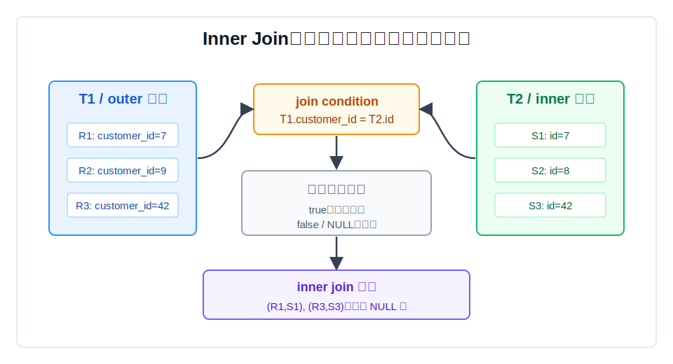
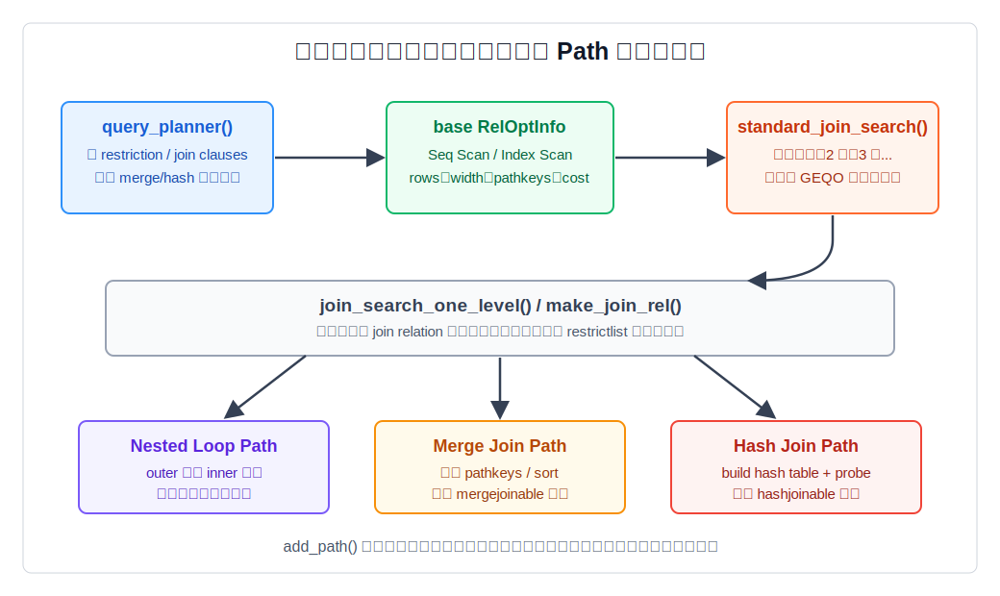
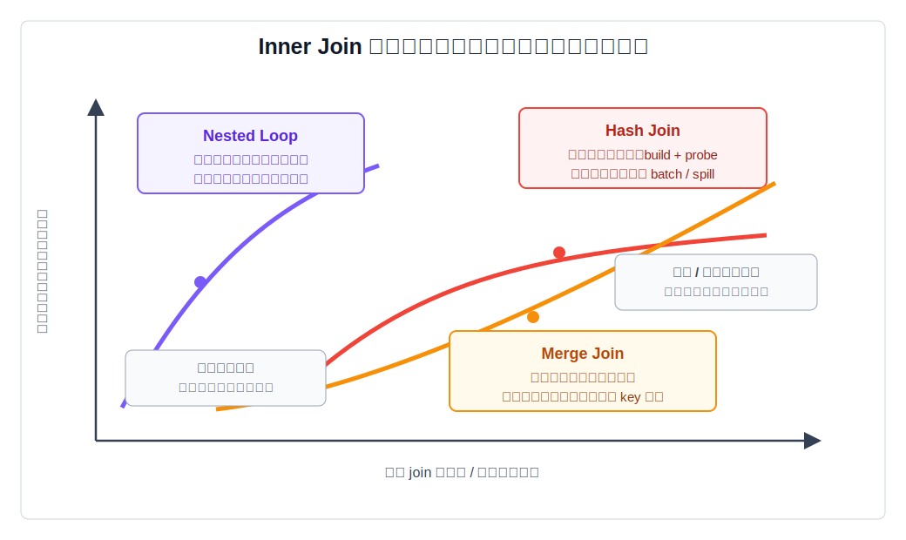
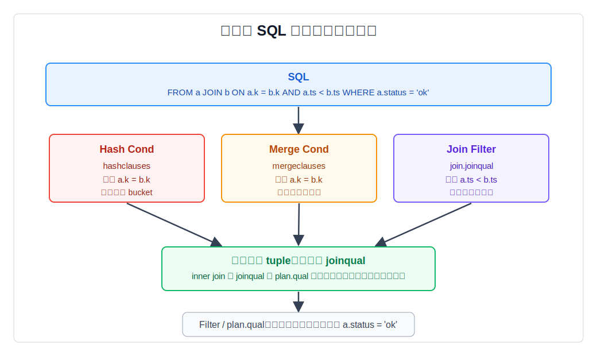

## 数据库筑基课 - inner join

### 作者
digoal

### 日期
2026-05-30

### 标签
PostgreSQL , 应用开发者 , 数据库筑基课 , 执行算法 , 优化器 , Join , Inner Join

----

## 背景


数据库筑基课大纲在当前项目中未找到可引用文件，因此本文按“扫描/执行算法”独立成篇。本文以 PostgreSQL 本地源码、官方文档、项目参考文件 `postgres/CLAUDE.md` 和 DeepWiki 对 `postgres/postgres` 的架构摘要为主。

`INNER JOIN` 是 SQL 里最常见、也最容易被低估的关系算子。很多人把它理解成“按条件把两张表拼起来”，这只说明了结果长什么样，没有回答工程上最重要的五个问题：

1. 哪些行对会被保留，哪些会被丢弃？
2. `ON`、`USING`、`WHERE` 条件在 inner join 里有什么语义差异？
3. 优化器为什么会把同一条 SQL 变成 Nested Loop、Hash Join 或 Merge Join？
4. 统计信息、索引、排序、内存和 join 顺序分别影响什么？
5. 线上慢 SQL 里看到 `Join Filter`、`Hash Cond`、`Merge Cond`、`Rows Removed by Join Filter` 时，应该怎么定位问题？

本文不把 `inner join` 当成某一种物理算法，而是把它作为“逻辑语义 + 优化器搜索 + 执行器实现”的完整链路来讲。单独的 Nested Loop、Hash Join、Merge Join 值得各自成篇；本篇关注它们共同服务的 inner join 语义，以及 DBA 和开发者如何读懂选择边界。

## 一、它解决什么问题？

业务系统很少把所有信息放在一张表里。订单表保存交易事实，客户表保存客户属性，商品表保存商品维度，支付表保存资金状态。一个最常见的问题是：

```sql
SELECT o.order_id, o.amount, c.region
FROM orders o
INNER JOIN customers c ON c.customer_id = o.customer_id
WHERE c.region = 'CN';
```

逻辑上，我们要保留“订单能找到客户，并且客户属于 CN”的行。工程上，数据库面对的是更具体的问题：

1. 如果先过滤 `customers.region = 'CN'` 只有几十行，是否应该用这些客户 id 去订单表索引里点查？
2. 如果两张表都很大，是否应该把较小一侧建成 hash table？
3. 如果两侧刚好都按 join key 有序，是否应该顺序合并？
4. 如果估计 `region = 'CN'` 只有几十行，实际却有几百万行，原计划会不会灾难性放大？

`INNER JOIN` 解决的是“把多个关系按谓词组合成一个关系”的语义问题；物理执行方法解决的是“用什么数据流和资源代价完成组合”的工程问题。理解 inner join，必须同时看这两层。

它的代价也很明确：join 会扩大优化器搜索空间，会引入行数估算误差，会让索引、统计信息、内存、排序和并行策略互相影响。线上很多慢 SQL 不是因为不会写 `JOIN`，而是因为 join 条件选择率、数据倾斜或连接顺序被错误估计。

## 二、它是什么？

PostgreSQL 官方文档把 joined table 定义为由两个表按某种 join 类型派生出来的表。`INNER JOIN` 的规则是：对左表每一行 R1，结果中包含所有右表中与 R1 满足 join condition 的行。`INNER` 关键字本身可以省略；在 qualified join 中，不写 `INNER` 时默认就是 inner join。

更直接地说：

```text
inner join result =
  所有满足 join condition 为 true 的左右行组合
```

注意两个边界：

1. join condition 为 `false` 的行对不会输出。
2. join condition 为 `NULL` 的行对也不会输出，因为 SQL 的布尔过滤只接受 `true`。



图 1 说明：`INNER JOIN` 不会像 outer join 那样给未匹配行补 NULL。它只保留 join condition 为 true 的行对。`ON` 和 `USING` 决定哪些左右行算匹配；`WHERE` 可以继续过滤已经形成的结果。对 inner join 来说，把条件放在 `ON` 或 `WHERE` 通常语义等价，但对 outer join 不等价。

在 PostgreSQL 中，inner join 会经过以下层次：

| 层次 | 关键结构或函数 | 作用 |
|---|---|---|
| SQL 语义 | `JOIN ... ON` / `JOIN ... USING` / `NATURAL JOIN` | 描述哪些行对匹配，以及输出列如何组织 |
| 查询规划 | `query_planner()` | 生成基础关系，拆分 restriction 和 join clauses，识别可 merge/hash 的条件 |
| Join 搜索 | `standard_join_search()` / `join_search_one_level()` | 用动态规划枚举 join relation 和 join 顺序 |
| 路径生成 | `add_paths_to_joinrel()` | 为同一 join relation 生成 Nested Loop、Merge Join、Hash Join 等候选路径 |
| 计划生成 | `create_join_plan()` | 把最优 `JoinPath` 转成 `NestLoop`、`MergeJoin` 或 `HashJoin` 计划节点 |
| 执行器 | `ExecNestLoop()` / `ExecMergeJoin()` / `ExecHashJoin()` | 按具体物理算法生产结果 tuple |

## 三、核心原理

### 3.1 语义层：inner join 是“匹配行对过滤”

`INNER JOIN ... ON` 最一般，`ON` 后面可以是任意布尔表达式：

```sql
SELECT *
FROM orders o
JOIN customers c
  ON c.customer_id = o.customer_id
 AND c.status = 'active';
```

`USING` 是等值连接的简写：

```sql
SELECT *
FROM orders
JOIN customers USING (customer_id);
```

官方文档说明，`USING (a, b)` 等价于 `ON t1.a = t2.a AND t1.b = t2.b`，并且输出会合并重复列：`JOIN ON` 会输出左表列再输出右表列；`JOIN USING` 会先输出共同列，再输出两边剩余列。

`NATURAL JOIN` 会自动用两边同名列构造 `USING` 列表。它写起来短，但工程上不推荐在生产 SQL 中依赖它：表结构新增同名列会悄悄改变 join 条件，代码审查也不容易看出真实连接键。

对 inner join 来说：

```sql
SELECT *
FROM a
JOIN b ON a.k = b.k
WHERE b.flag = true;
```

通常可以改写为：

```sql
SELECT *
FROM a
JOIN b ON a.k = b.k AND b.flag = true;
```

因为 inner join 没有“未匹配行补 NULL”的阶段。但这个经验不能迁移到 outer join。PostgreSQL 的 `Join` 计划节点注释明确说明：当 `jointype` 是 `INNER` 时，`joinqual` 和 `plan.qual` 语义可交换；对 outer join，它们不可交换，只有 `joinqual` 用于判断是否已经找到匹配行。

### 3.2 优化器：动态规划生成 join relation

PostgreSQL 优化器 README 给出的主线是：

```text
planner()
  subquery_planner()
    grouping_planner()
      query_planner()
        make_one_rel()
          set_base_rel_pathlists()
          make_rel_from_joinlist()
            standard_join_search()
              join_search_one_level()
```

`query_planner()` 会建立查询使用的基础关系，拆分 restriction 和 join 条件，并寻找能支持 merge join 或 hash join 的条件。`standard_join_search()` 使用动态规划：先找所有两表 join，再找三表 join，再找四表 join，直到构造出包含全部关系的最终 join relation。

源码 `src/backend/optimizer/path/allpaths.c:standard_join_search()` 的注释很直白：先构造两个 jointree item 的 join，再构造三个、四个，直到所有 item 都被考虑。`root->join_rel_level[j]` 保存包含 `j` 个 item 的 join relation。



图 2 说明：优化器不是在 `Nested Loop`、`Hash Join`、`Merge Join` 三个名字里投票。它先为基础关系生成访问路径，再为每个合法 join relation 枚举左右输入组合。每个组合会产生多个候选 path；这些 path 带着不同的成本、排序顺序、参数化依赖和并行属性竞争。

`join_search_one_level()` 会优先用 join clauses 连接相关关系；如果某个关系没有可用 join clause 或 join order restriction，就会生成笛卡尔积候选。对开发者来说，这解释了一个常见灾难：漏写 join 条件时，SQL 语义仍然合法，但搜索空间和结果规模会按乘法膨胀。

### 3.3 路径层：同一个 inner join 可以有三类主流物理算法

`add_paths_to_joinrel()` 是核心入口之一。它给定一个 join relation 和两个组成关系，考虑所有可行路径，并把未被支配的路径加入 join relation 的 pathlist。对 inner join 来说，核心候选通常包括：

1. Nested Loop：`match_unsorted_outer()` 中生成，尤其适合 outer 小、inner 可参数化索引查找的场景。
2. Merge Join：`sort_inner_and_outer()` 和相关路径生成逻辑处理，需要 mergejoinable 条件和有序输入，必要时加 Sort。
3. Hash Join：`hash_inner_and_outer()` 处理，需要 hashjoinable 条件，通常用于大批量等值连接。

最后 `create_join_plan()` 根据最优 path 的 `pathtype` 分派到：

```text
T_MergeJoin -> create_mergejoin_plan()
T_HashJoin  -> create_hashjoin_plan()
T_NestLoop  -> create_nestloop_plan()
```

这一步很关键：逻辑上都是 inner join，计划树里却会落成不同执行节点。



图 3 说明：Nested Loop 的成本形状接近 `outer rows x inner rescan cost`，优势来自内表索引点查和低启动成本；Hash Join 的成本形状接近 `build + probe`，优势来自批量等值连接；Merge Join 的成本形状接近 `有序输入获取 + 同步合并`，优势来自已有排序或排序结果可复用。没有一种 join 方法永远正确。

### 3.4 执行器：条件被拆成物理定位条件、Join Filter 和 Filter

PostgreSQL 的 `Join` 计划节点包含 `joinqual` 字段，普通 `Plan` 节点还包含 `qual`。`plannodes.h` 注释说明：

- `joinqual` 来自 `JOIN/ON` 或 `JOIN/USING`。
- `plan.qual` 来自 `WHERE`。
- inner join 中二者语义可交换。
- outer join 中二者不可交换。

但物理算法还会进一步拆分条件：

| EXPLAIN 字段 | 主要出现场景 | 含义 |
|---|---|---|
| `Hash Cond` | Hash Join | 可用于 hash table build/probe 的等值条件 |
| `Merge Cond` | Merge Join | 可用于两侧有序流同步的 merge 条件 |
| `Join Filter` | NestLoop / MergeJoin / HashJoin | 物理定位之后还要检查的 join 条件 |
| `Filter` | 所有计划节点 | 返回前最终过滤条件，通常对应 `plan.qual` |

`src/backend/commands/explain.c` 也按这个分工展示：`HashJoin` 先显示 `Hash Cond`，再显示 `Join Filter` 和 `Filter`；`MergeJoin` 先显示 `Merge Cond`；`NestLoop` 没有专门的 hash/merge 条件，通常显示 `Join Filter` 或把参数化索引条件下推到内表扫描节点。



图 4 说明：`Hash Cond` 和 `Merge Cond` 是物理算法能直接利用的条件；`Join Filter` 是组合候选 tuple 后仍要检查的 join 条件；`Filter` 是最终返回前过滤。inner join 中它们不影响补 NULL 语义，但仍影响执行位置、可利用的数据结构和 `EXPLAIN` 诊断方式。

执行器源码里三类 join 都有同一个关键模式：只有满足 join 条件和最终过滤条件的 tuple 才会投影返回。

- `ExecNestLoop()`：取 outer tuple，重扫 inner；`ExecQual(joinqual, econtext)` 通过后，再检查 `otherqual`。
- `ExecHashJoinImpl()`：先 build hash table，再 probe bucket；hash 命中只是候选，仍要执行 `joinqual` 和 `otherqual`。
- `ExecMergeJoin()`：merge key 同步到相等后进入 `EXEC_MJ_JOINTUPLES`，再检查额外 `joinqual` 和 `otherqual`。

### 3.5 代价模型：inner join 慢，常常慢在估算误差

数据库选择 join 方法时，不知道真实行数，只能依赖统计信息和成本模型。典型风险包括：

1. **选择率低估**：优化器以为 outer 只有 100 行，选择 Nested Loop；实际 outer 有 100 万行，内表重扫成本被放大。
2. **相关性缺失**：多个过滤条件被近似独立估算，导致 join 输入行数严重偏差。
3. **数据倾斜**：某个 join key 极热，Hash Join 的 bucket 或 batch 压力变大；Merge Join 重复 key 组合输出膨胀。
4. **过期统计信息**：`ANALYZE` 不及时，行数、distinct 值、MCV 分布都不可靠。
5. **内存边界误判**：Hash Join build 侧放不进内存会 batch/spill；Merge Join 的 Sort 可能写临时文件。

所以，调 inner join 不能只看 SQL 语法。必须同时看：

- `EXPLAIN (ANALYZE, BUFFERS)` 中估算行数和实际行数是否偏离；
- 是否出现 `Rows Removed by Join Filter` 大量增长；
- Hash Join 的 `Batches` 是否从 1 变大；
- Sort 或 Hash 是否出现临时文件 I/O；
- 内表索引是否真的被参数化扫描使用；
- 多表 join 的连接顺序是否被外连接、LATERAL、显式括号或 `join_collapse_limit` 限制。

## 四、横向对比

| 维度 | Inner Join 逻辑语义 | Nested Loop 实现 | Hash Join 实现 | Merge Join 实现 |
|---|---|---|---|---|
| 主要目标 | 保留满足条件的行对 | outer 行驱动 inner 查找 | build hash table 后 probe | 两侧有序流同步合并 |
| 常见条件 | 任意布尔 join condition | 任意条件都可作为过滤；内表索引条件越好越强 | 主要依赖可哈希等值条件 | 主要依赖可排序等值条件 |
| 启动成本 | 逻辑层无启动成本概念 | 通常低，可早出首行 | 需要先构建 build 侧 | 若需排序，启动成本高 |
| 总成本形状 | 输出规模取决于匹配行对 | `outer rows x inner rescan` | `build + probe + batch` | `sort/order + merge + rescan` |
| 索引价值 | 决定可用访问路径 | 内表参数化索引最关键 | 通常不是核心，但可影响输入过滤 | B-tree 可提供有序输入 |
| 内存压力 | 取决于物理实现 | 通常低，Memoize/Materialize 例外 | 受 `work_mem * hash_mem_multiplier` 影响 | Sort/Materialize 受 `work_mem` 影响 |
| 输出顺序 | SQL 不承诺顺序 | 通常跟 outer 路径相关 | 通常不保序 | 可保留 merge key 顺序 |
| 典型风险 | 漏 join 条件产生笛卡尔积 | 外表行数低估 | build 侧过大或倾斜 | 排序成本高或重复 key 重放 |
| 适合场景 | 所有“只要匹配行”的业务查询 | OLTP 点查、小 outer、`EXISTS` | 大表等值连接、报表批处理 | 两边已有序、有序输出可复用 |

这个表背后的原因是：SQL 的 inner join 只定义结果，不定义算法。优化器在满足同一语义的前提下，可以自由选择物理路径。你看到的 `Hash Join`、`Merge Join`、`Nested Loop` 不是 SQL 类型，而是 PostgreSQL 认为成本最低的执行方式。

## 五、效果如何？

Inner join 的收益是数据模型正常化后的组合能力：

1. **避免大宽表冗余**：事实表、维度表、状态表可以按职责拆分，再按 key 组合。
2. **让优化器选择访问路径**：同一 SQL 可随数据量变化在 Nested Loop、Hash Join、Merge Join 间切换。
3. **能把过滤下推到合适位置**：单表 restriction 可先缩小输入，join clause 再组合结果。
4. **支持复杂业务关系表达**：多表查询、半连接改写、子查询拉平、星型模型都依赖 join 能力。

代价也必须承认：

1. **搜索空间增长**：多表 join 的排列组合很快变大。PostgreSQL 在表数达到 `geqo_threshold` 时可能使用 GEQO。
2. **错误会乘法放大**：漏条件、低估行数、重复 key、错误 join 顺序都可能把结果或中间结果放大几个数量级。
3. **资源边界更复杂**：一个 SQL 里可以同时有多个 hash、sort、materialize、memoize 节点，单看 `work_mem` 不够。
4. **可解释性下降**：SQL 写法相似，计划可能完全不同；必须学会读 `EXPLAIN`。

本文不提供编造的性能数字。真实效果应以你自己的数据分布、索引、统计信息、参数和硬件为准。

## 六、实操 DEMO

下面示例是可在 PostgreSQL 中执行的最小实验。当前本地 `postgres` 源码目录未发现已配置的 build/server，因此本文没有执行这些 SQL，也不伪造 `EXPLAIN ANALYZE` 输出。

### 6.1 准备数据

```sql
DROP TABLE IF EXISTS orders;
DROP TABLE IF EXISTS customers;

CREATE TABLE customers (
  customer_id bigint PRIMARY KEY,
  region text NOT NULL,
  status text NOT NULL
);

CREATE TABLE orders (
  order_id bigint PRIMARY KEY,
  customer_id bigint NOT NULL,
  amount numeric NOT NULL,
  created_at timestamptz NOT NULL DEFAULT now()
);

INSERT INTO customers
SELECT g,
       CASE WHEN g % 10 = 0 THEN 'CN' ELSE 'US' END,
       CASE WHEN g % 7 = 0 THEN 'inactive' ELSE 'active' END
FROM generate_series(1, 10000) AS g;

INSERT INTO orders
SELECT g,
       (g % 10000) + 1,
       (g % 500) + 1,
       now() - (g % 30) * interval '1 day'
FROM generate_series(1, 300000) AS g;

CREATE INDEX orders_customer_id_idx ON orders(customer_id);
CREATE INDEX customers_region_idx ON customers(region);

ANALYZE customers;
ANALYZE orders;
```

### 6.2 观察默认计划

```sql
EXPLAIN (ANALYZE, BUFFERS)
SELECT o.order_id, o.amount, c.region
FROM orders o
JOIN customers c ON c.customer_id = o.customer_id
WHERE c.region = 'CN';
```

关注点：

- 如果 `customers.region = 'CN'` 选择率低，可能看到小表过滤后驱动订单索引扫描的 Nested Loop。
- 如果输入规模较大，可能看到 Hash Join。
- 如果两侧使用合适索引并且上层需要排序，可能看到 Merge Join。

### 6.3 对比三类物理算法

这些开关是诊断工具，不建议作为长期业务参数使用。

```sql
-- 尝试观察非 Hash Join 路径
SET enable_hashjoin = off;
EXPLAIN
SELECT o.order_id, o.amount, c.region
FROM orders o
JOIN customers c ON c.customer_id = o.customer_id
WHERE c.region = 'CN';

-- 尝试观察非 Merge Join 路径
RESET enable_hashjoin;
SET enable_mergejoin = off;
EXPLAIN
SELECT o.order_id, o.amount, c.region
FROM orders o
JOIN customers c ON c.customer_id = o.customer_id
WHERE c.region = 'CN';

-- 尝试劝退 Nested Loop。官方文档说明它不能被完全禁止，只能在有替代方法时劝退。
RESET enable_mergejoin;
SET enable_nestloop = off;
EXPLAIN
SELECT o.order_id, o.amount, c.region
FROM orders o
JOIN customers c ON c.customer_id = o.customer_id
WHERE c.region = 'CN';

RESET enable_nestloop;
```

### 6.4 观察 Join Filter

```sql
EXPLAIN (ANALYZE, BUFFERS)
SELECT o.order_id, o.amount, c.region
FROM orders o
JOIN customers c
  ON c.customer_id = o.customer_id
 AND o.amount > c.customer_id % 500
WHERE c.status = 'active';
```

关注点：

- `c.customer_id = o.customer_id` 可能成为 `Hash Cond` 或 `Merge Cond`。
- `o.amount > c.customer_id % 500` 不适合 hash/merge 定位，可能显示为 `Join Filter`。
- `c.status = 'active'` 可能被下推到 `customers` 扫描节点，也可能作为上层过滤的一部分出现，取决于计划形状。

## 七、最佳实践

### 面向数据库架构师

1. **先设计清楚连接键的基数和方向**：事实表到维度表、多对一、一对多、多对多，应该在模型层说清楚。`inner_unique` 这类优化依赖“每个 outer 最多匹配一个 inner”的可证明性。
2. **为高频 join key 建索引，但不要机械建双边索引**：Nested Loop 最依赖 inner 侧索引；Merge Join 可利用两侧 B-tree 顺序；Hash Join 不靠索引完成 probe，但索引仍可帮助先过滤输入。
3. **控制多表 join 的中间结果规模**：星型模型中，优先让高选择率维度过滤生效，避免事实表过早膨胀。
4. **把数据倾斜当成一等风险**：热点租户、热门商品、默认状态值会破坏平均选择率。必要时使用扩展统计、分区、局部索引或 SQL 改写。

### 面向 DBA

1. **慢 join 先看估算偏差**：`EXPLAIN (ANALYZE, BUFFERS)` 中每个节点的 estimated rows 与 actual rows 是第一现场。
2. **及时维护统计信息**：`ANALYZE`、提高关键列 statistics target、创建 extended statistics，通常比强行关闭某个 join 方法更稳。
3. **谨慎使用 enable 开关**：`enable_hashjoin`、`enable_mergejoin`、`enable_nestloop` 适合诊断替代计划。长期依赖它们通常是在掩盖统计信息、索引或 SQL 形态问题。
4. **监控临时文件和内存压力**：Hash Join 的 batch、Sort 的外部排序、Materialize/Memoize 的缓存行为都可能在并发下放大内存压力。

### 面向业务开发者

1. **显式写出 join 条件**：避免逗号 join 和隐式条件分散在大段 `WHERE` 中；生产 SQL 不建议使用 `NATURAL JOIN`。
2. **只取需要的列**：宽 tuple 会增加 Hash Join build 存储、Sort 负担、临时文件和网络返回成本。
3. **不要用函数包住 join key**：`ON lower(a.email) = lower(b.email)` 可能让普通索引失效。需要时使用表达式索引或预规范化字段。
4. **分页和 LIMIT 不等于低成本**：如果 join 必须先构造大量中间结果再排序，`LIMIT 10` 也可能很慢。

## 八、适合与不适合场景

适合 inner join 的场景：

1. **只关心双方都存在的业务事实**：例如有订单且有客户、有支付且有账单、有库存且有商品。
2. **关系模型清晰、连接键稳定**：主外键、维表 key、事实表关联 key。
3. **过滤条件能显著缩小输入**：先过滤再 join，或通过索引/分区让输入规模可控。
4. **报表和分析查询**：大批量等值连接可由 Hash Join 或 Merge Join 稳定处理。

不适合直接使用 inner join 的场景：

1. **需要保留未匹配行**：应使用 left/right/full outer join，而不是 inner join。
2. **只判断是否存在**：很多时候 `EXISTS` 更清晰，优化器也可能转成 semi join，避免无意义重复输出。
3. **多对多关系未去重**：如果两侧 key 都重复，输出行数是组合乘法，可能远超预期。
4. **连接条件不确定或依赖模糊匹配**：例如文本相似度 join、范围 join、地理距离 join，需要专门索引、分桶或近似策略。

## 九、常见坑

1. **漏写 join 条件**  
   `FROM a, b` 或 `JOIN b ON true` 会生成笛卡尔积。小表测试没问题，上线后可能直接爆炸。

2. **把 outer join 经验误套到 inner join 或反过来**  
   inner join 中 `ON` 和 `WHERE` 条件常可交换；outer join 中不可交换。不要只凭一次计划形状做通用结论。

3. **看到 Hash Join 就以为不需要索引**  
   Hash Join 本身不靠索引 probe，但索引可能帮助先过滤输入，也可能让替代计划更好。

4. **看到 Nested Loop 就判定计划错了**  
   小 outer + 参数化 inner index scan 是 Nested Loop 的优势区间。真正危险的是 outer 实际行数远大于估算，或 inner 每次都高成本重扫。

5. **只调 `work_mem` 不看并发**  
   一条 SQL 可能有多个 hash/sort 节点，多个并发会乘上去。调大内存可能修好一条报表，压垮整体实例。

6. **忽略 Join Filter 的过滤量**  
   `Rows Removed by Join Filter` 很大，说明物理定位条件产生了大量候选组合，真正条件很晚才过滤。要考虑更合适的索引、表达式改写、预过滤或拆分查询。

7. **统计信息过期还强行 hint 思维**  
   PostgreSQL 核心不以 hint 为主要调优方式。多数 join 误选应先修统计信息、索引、SQL 形态和参数边界。

## 十、扩展问题

1. 如果 `orders.customer_id` 上没有索引，`customers.region = 'CN'` 选择率很低时，Nested Loop 还一定好吗？
2. Hash Join 的 build 侧应该选小表还是过滤后更小的一侧？如果小表行很宽怎么办？
3. Merge Join 在两边都有 B-tree 索引时一定比 Hash Join 好吗？随机 I/O、排序复用和输出顺序如何影响判断？
4. 多表 join 中，先 join 两个大事实表再过滤维表，和先过滤维表再 join 事实表，哪个中间结果更危险？
5. 为什么 inner join 中 `ON` 与 `WHERE` 条件语义可交换，但 PostgreSQL 的 `EXPLAIN` 仍然可能把它们展示在不同字段里？
6. 如果某个租户占全表 80% 数据，普通单列统计信息对 join 行数估算会有什么风险？

## 十一、扩展阅读

1. PostgreSQL 官方文档：`doc/src/sgml/queries.sgml`，Joined Tables、`INNER JOIN`、`USING`、`NATURAL JOIN` 语义。
2. PostgreSQL 官方文档：`doc/src/sgml/perform.sgml`，`EXPLAIN` 中 Nested Loop、Hash Join、Merge Join 示例，以及 Join Filter 与 Filter 的解释。
3. PostgreSQL 官方文档：`doc/src/sgml/config.sgml`，`enable_hashjoin`、`enable_mergejoin`、`enable_nestloop`、`enable_memoize` 等优化器开关。
4. PostgreSQL 源码：`src/backend/optimizer/README`，planner 主流程、Path、RelOptInfo、join 搜索概览。
5. PostgreSQL 源码：`src/backend/optimizer/path/allpaths.c`，`standard_join_search()` 动态规划 join 搜索。
6. PostgreSQL 源码：`src/backend/optimizer/path/joinrels.c`，`join_search_one_level()`、`make_join_rel()`。
7. PostgreSQL 源码：`src/backend/optimizer/path/joinpath.c`，`add_paths_to_joinrel()`、Nested Loop、Merge Join、Hash Join path 生成。
8. PostgreSQL 源码：`src/backend/optimizer/plan/createplan.c`，`create_join_plan()`、`create_nestloop_plan()`、`create_mergejoin_plan()`、`create_hashjoin_plan()`。
9. PostgreSQL 源码：`src/include/nodes/plannodes.h`，`Join`、`NestLoop`、`MergeJoin`、`HashJoin` 计划节点结构和 `joinqual` 注释。
10. PostgreSQL 源码：`src/backend/executor/nodeNestloop.c`、`nodeHashjoin.c`、`nodeMergejoin.c`，三类 join 执行器主循环。
11. DeepWiki：`postgres/postgres` Query Processing Pipeline 与 optimizer/executor 架构摘要。本文使用 DeepWiki 辅助定位主线，并用本地源码和官方文档核验关键结论。
  
## 附录 
1、克隆代码  
```  
git clone --depth 1 https://github.com/postgres/postgres
```  
  
2、启用 codex, 使用 [数据库筑基课 skill](../skills/README.md).  
```
文章标题: 
  数据库筑基课 - inner join
项目源码(已克隆到当前项目如下目录中):  
  postgres
项目 deepwiki reponame:  
  postgres/postgres
项目参考信息: 
  postgres/CLAUDE.md
```
  
  
#### [PostgreSQL 解决方案集合](../201706/20170601_02.md "40cff096e9ed7122c512b35d8561d9c8")
  
  
#### [德哥 / digoal's Github - 公益是一辈子的事.](https://github.com/digoal/blog/blob/master/README.md "22709685feb7cab07d30f30387f0a9ae")
  
  
#### [About 德哥](https://github.com/digoal/blog/blob/master/me/readme.md "a37735981e7704886ffd590565582dd0")
  
  

  
