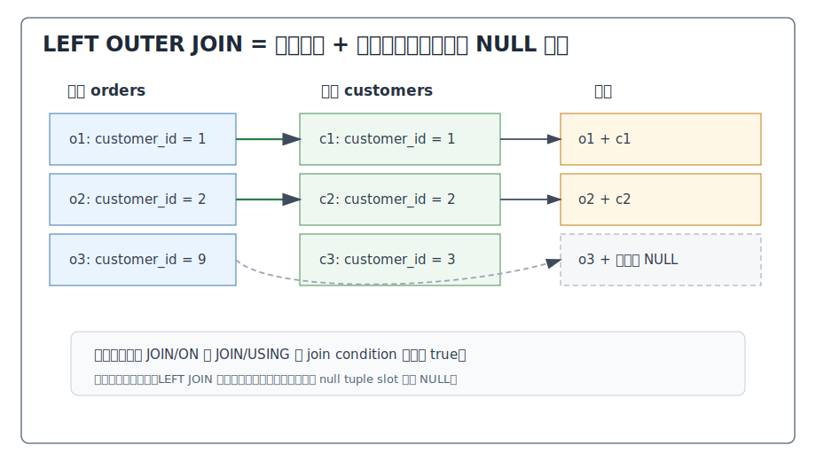
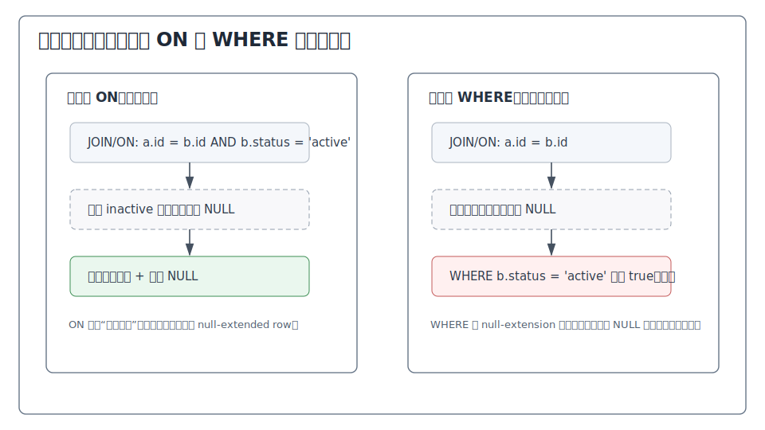
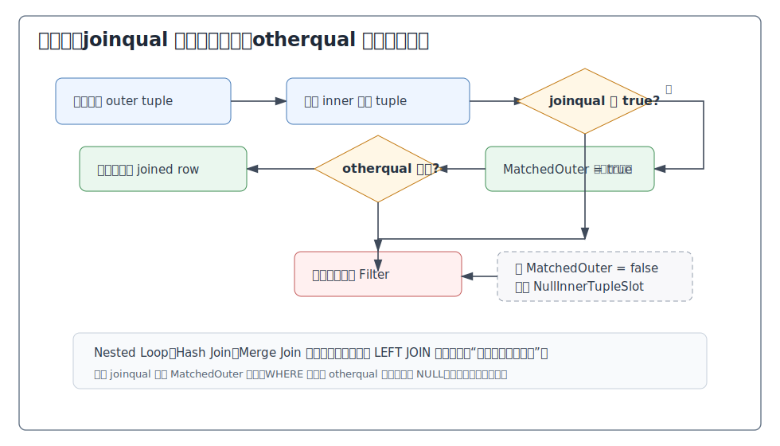
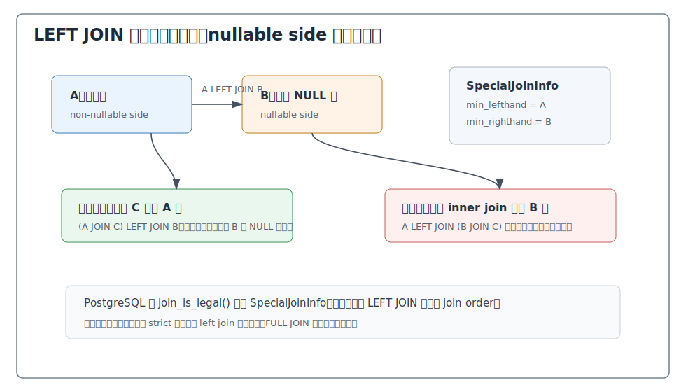
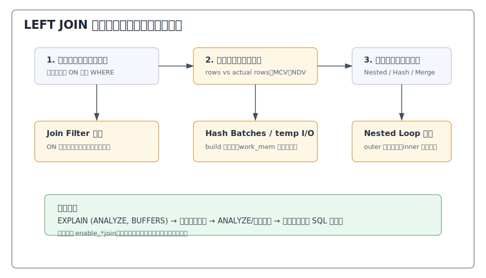

## 数据库筑基课 - left outer join

### 作者
digoal

### 日期
2026-05-30

### 标签
PostgreSQL , 应用开发者 , 数据库筑基课 , 执行算法 , 优化器 , Join , Left Outer Join

----

## 背景
  

数据库筑基课大纲在当前项目中未找到可引用文件，因此本文按“扫描/执行算法”独立成篇。本文以 PostgreSQL 本地源码、官方文档、项目参考文件 `postgres/CLAUDE.md` 和 DeepWiki 对 `postgres/postgres` 的架构导览为参考；关键机制以官方文档和本地源码为准。

`LEFT OUTER JOIN` 是业务 SQL 里最常见的“保留主表”工具。典型场景包括：

1. 订单必须全部展示，即使还没支付。
2. 用户必须全部统计，即使没有最近登录记录。
3. 商品必须全部出现在报表里，即使没有库存或销量。
4. 主数据质量检查中，要找“左表存在、右表缺失”的记录。

很多线上问题也来自它：把右表条件写到 `WHERE` 里导致左行被删掉；用 `LEFT JOIN ... WHERE right.id IS NULL` 做反连接但右侧键不唯一；误以为 left join 可以像 inner join 一样随便重排；看到 `Join Filter` 和 `Filter` 却不知道哪个会影响补 NULL。理解 left join，关键不是背语法，而是掌握一句话：

> left outer join 的语义边界是：先按 join condition 找匹配；找不到时仍输出左侧行，并把右侧列补成 NULL；补 NULL 之后再执行上层过滤。

这句话会贯穿优化器、执行器和 SQL 写法。

## 一、它解决什么问题？

假设订单表 `orders` 保存交易事实，支付表 `payments` 只保存已经产生支付动作的订单。业务要查看所有订单的支付状态：

```sql
SELECT o.order_id, o.amount, p.status
FROM orders o
LEFT JOIN payments p ON p.order_id = o.order_id;
```

如果用 `INNER JOIN`，没有支付记录的订单会消失；如果用应用程序逐条查支付表，会制造大量点查和一致性问题。`LEFT JOIN` 把问题转化成数据库内部的数据流问题：

1. 每个左表订单都必须至少贡献一行结果。
2. 右表有匹配支付记录时，输出真实右表列。
3. 右表没有匹配记录时，输出右侧 NULL。
4. 后续 `WHERE`、聚合、排序、窗口函数看到的是已经补 NULL 后的结果。

它牺牲的是优化自由度和语义直觉。Inner join 可以更自由地交换 join 顺序；left join 有“保留侧”和“可补 NULL 侧”，优化器必须避免把过滤条件推到错误层次。开发者也必须明确：右表条件放在 `ON` 和 `WHERE` 中，结果可能完全不同。

## 二、它是什么？

PostgreSQL 官方文档定义 qualified join 时说明：`INNER` 和 `OUTER` 都可省略；`INNER` 是默认值；`LEFT`、`RIGHT`、`FULL` 隐含 outer join。对 `LEFT OUTER JOIN`，文档给出的语义是：先执行 inner join；然后对左表中所有没有和右表满足 join condition 的行，追加一行右侧列为 NULL 的结果。因此结果表至少为左表每一行输出一行。

更形式化地说：

```text
T1 LEFT JOIN T2 ON P =
  { T1 行与 T2 行组合 | P 为 true }
  UNION ALL
  { T1 未匹配行 + T2 列 NULL }
```

这里的“未匹配”只由 `JOIN/ON` 或 `JOIN/USING` 的 join condition 决定，不由 `WHERE` 决定。



图 1 说明：左表每一行先尝试找右表匹配行。找到多个匹配行，就输出多行；找不到任何匹配行，也不能丢掉左行，而是输出一行右侧 NULL。右表中没有被任何左行匹配到的行不会因为 left join 单独输出。

在 PostgreSQL 内部，left join 会经过这些层次：

| 层次 | 关键结构或函数 | 和 left join 相关的作用 |
|---|---|---|
| SQL 语义 | `LEFT [OUTER] JOIN ... ON/USING` | 定义匹配条件和左侧保留规则 |
| 解析树 | `JoinExpr.jointype` | 表示 `JOIN_LEFT`、`JOIN_INNER` 等连接类型 |
| 预处理 | `reduce_outer_joins()` | 在语义允许时把外连接化简为内连接或反连接 |
| Join 合法性 | `SpecialJoinInfo` / `join_is_legal()` | 记录外连接左右边界，避免非法重排 |
| 路径生成 | `add_paths_to_joinrel()` | 生成 Nested Loop、Hash Join、Merge Join 等候选路径 |
| 计划节点 | `Join.jointype` / `Join.joinqual` / `Plan.qual` | 区分 join 条件和上层过滤条件 |
| 执行器 | `ExecNestLoop()` / `ExecHashJoinImpl()` / `ExecMergeJoin()` | 维护匹配状态，必要时用 null tuple slot 补 NULL |

## 三、核心原理

### 3.1 语义层：ON 决定匹配，WHERE 决定最终保留

`LEFT JOIN` 最重要的坑是条件位置。

```sql
-- 写法 A：保留所有订单；只有 successful 支付才算右表匹配
SELECT o.order_id, p.status
FROM orders o
LEFT JOIN payments p
  ON p.order_id = o.order_id
 AND p.status = 'successful';
```

如果某个订单只有 failed 支付，写法 A 会输出该订单，并把 `p.status` 补成 NULL。

```sql
-- 写法 B：先 left join，再删除右侧不是 successful 的结果
SELECT o.order_id, p.status
FROM orders o
LEFT JOIN payments p
  ON p.order_id = o.order_id
WHERE p.status = 'successful';
```

写法 B 会删除没有 successful 支付的订单。对业务来说，它通常已经退化成“只看有 successful 支付的订单”，和保留所有订单不是一回事。



图 2 说明：`ON` 条件失败，只说明右表没有匹配；左行仍可补 NULL 输出。`WHERE` 条件在补 NULL 后执行；普通比较遇到 NULL 不会得到 true，因此会把补 NULL 行删掉。PostgreSQL 文档的 `t1 LEFT JOIN t2 ... AND t2.value = 'xxx'` 与 `... WHERE t2.value = 'xxx'` 示例正是这个差异。

这也是为什么 `LEFT JOIN` 常被意外写错：

```sql
-- 看起来是 left join，实际会过滤掉没有 profile 的用户
SELECT u.id, p.city
FROM users u
LEFT JOIN profiles p ON p.user_id = u.id
WHERE p.city = 'Hangzhou';
```

如果业务目标是“所有用户都要出现，但只带出杭州 profile”，条件应放入 `ON`：

```sql
SELECT u.id, p.city
FROM users u
LEFT JOIN profiles p
  ON p.user_id = u.id
 AND p.city = 'Hangzhou';
```

如果业务目标是“只要有杭州 profile 的用户”，那就应该坦率使用 `INNER JOIN`，让语义、优化器和代码审查都更清楚。

### 3.2 执行器：MatchedOuter 和 NullInnerTupleSlot

PostgreSQL 的 `Join` 计划节点注释说得很清楚：

1. `joinqual` 来自 `JOIN/ON` 或 `JOIN/USING`。
2. `plan.qual` 来自 `WHERE`。
3. inner join 中二者语义可交换。
4. outer join 中二者不可交换；只有 `joinqual` 用来判断是否已经找到匹配行，决定是否产生 null-extended tuple。

执行器代码把这个规则落成状态机。以 `nodeNestloop.c` 为例：

1. 每读到一个 outer tuple，先把 `nl_MatchedOuter` 置为 false。
2. 内侧每找到一行候选，就执行 `ExecQual(joinqual, econtext)`。
3. `joinqual` 通过时，把 `nl_MatchedOuter` 置为 true。
4. 真正返回前，还要检查 `otherqual`。
5. 如果内侧耗尽且 `nl_MatchedOuter` 仍为 false，并且 join 类型是 `JOIN_LEFT`，执行器把 inner tuple slot 切换到 `nl_NullInnerTupleSlot`，再检查 `otherqual`；通过才返回补 NULL 行。

Hash Join 和 Merge Join 的实现不同，但同样有匹配状态与 null tuple slot：

| 执行节点 | 匹配状态 | 补 NULL slot | 相关源码 |
|---|---|---|---|
| Nested Loop | `nl_MatchedOuter` | `nl_NullInnerTupleSlot` | `src/backend/executor/nodeNestloop.c` |
| Hash Join | `hj_MatchedOuter` | `hj_NullInnerTupleSlot` | `src/backend/executor/nodeHashjoin.c` |
| Merge Join | `mj_MatchedOuter` | `mj_NullInnerTupleSlot` | `src/backend/executor/nodeMergejoin.c` |



图 3 说明：`joinqual` 是“是否匹配”的判据；`otherqual` 是“是否返回”的判据。一个右表候选行如果通过 `joinqual`，就会让左行进入 matched 状态，即使后来被 `WHERE` 来源的 `otherqual` 过滤掉，也不再为这个左行补 NULL。这一点解释了很多 `ON` 和 `WHERE` 改写后的结果差异。

### 3.3 物理算法：LEFT JOIN 也可以 Nested、Hash、Merge

`LEFT JOIN` 是逻辑语义，不是某一种执行算法。PostgreSQL 仍然可以选择：

1. **Nested Loop Left Join**：左侧逐行驱动右侧。适合左侧行数少、右侧有可用索引、需要快速返回前几行的场景。
2. **Hash Left Join**：通常把右侧构建成 hash table，左侧逐行 probe。适合大批量等值连接。
3. **Merge Left Join**：两侧按 join key 有序同步推进。适合已有排序、索引顺序可利用，或后续也需要同样排序的场景。

`create_join_plan()` 会按最优 path 的 `pathtype` 分派到 `create_nestloop_plan()`、`create_hashjoin_plan()` 或 `create_mergejoin_plan()`。`EXPLAIN` 中可能看到：

```text
Nested Loop Left Join
Hash Left Join
Merge Left Join
```

这些计划名称里的 `Left Join` 表示逻辑语义，`Nested Loop/Hash/Merge` 表示物理算法。

对 DBA 来说，关键诊断点是：

1. Nested Loop Left Join 是否因为左侧实际行数远大于估算而重复扫描右侧。
2. Hash Left Join 的 build 侧是否过大，`Batches` 是否超过 1，是否出现临时文件 I/O。
3. Merge Left Join 是否为了排序付出过高启动成本。
4. `Join Filter` 是否移除了大量候选行对，说明物理定位条件不够选择性。

### 3.4 优化器：外连接边界限制 join 顺序

Inner join 的显式 `JOIN` 语法通常不约束 PostgreSQL 的 join 顺序；文档说明，显式 inner join 在语义上等同于把输入关系列在 `FROM` 中。但 outer join 不一样。因为 left join 必须保留左侧未匹配行，优化器不能随便把右侧 nullable side 与其他关系先做 inner join。

PostgreSQL 优化器 README 明确说明：当查询包含 LEFT/RIGHT outer join，或被转换出的 semi/anti join 时，一些 join order 是非法的；优化器会创建 `SpecialJoinInfo`，并由 `join_is_legal()` 检查候选 join 是否有效。



图 4 说明：left join 把输入分成保留侧和可补 NULL 侧。某些关系可以安全合入左侧，某些 left join 之间也能根据外连接恒等式重排；但把 inner join 推入 nullable side 往往会改变“左行是否应该补 NULL 输出”的结果。`SpecialJoinInfo` 记录了形成外连接所需的最小左右 relid 集合，`join_is_legal()` 用它过滤非法路径。

这解释了两个工程现象：

1. 多表 left join 的计划空间通常比同规模 inner join 更受约束。
2. 调整 SQL 括号、`join_collapse_limit`、`from_collapse_limit` 时，outer join 的效果和 inner join 不同。

### 3.5 预处理：LEFT JOIN 可能被化简或删除

PostgreSQL 不会机械地保留所有 left join。`reduce_outer_joins()` 会尝试把外连接降低强度。源码注释给了典型例子：

```sql
SELECT ...
FROM a LEFT JOIN b ON (...)
WHERE b.y = 42;
```

如果 `=` 是 strict 操作符，那么所有由 left join 补出的 `b.y = NULL` 行都无法通过 `WHERE b.y = 42`。既然补 NULL 行最终一定被删，就没有必要执行 outer join，可化简为普通 inner join。

另一个常见模式是：

```sql
SELECT ...
FROM a LEFT JOIN b ON a.x = b.y
WHERE b.y IS NULL;
```

如果优化器能证明匹配行中的 `b.y` 不可能为 NULL，这个查询表达的是“找不到匹配 b 的 a 行”，可以被识别为 anti join。PostgreSQL 源码注释也提到 `JOIN_LEFT` 到 `JOIN_ANTI` 的转换。

还有一种删除优化在 `remove_useless_joins()` / `join_is_removable()` 中：如果 left join 的右侧是单个基础关系，join 条件最多匹配一行，并且右侧列没有被上层需要，那么这个 left join 只会重复或不改变左输入，优化器可以删除它。

例子：

```sql
-- 假设 dim_customer.customer_id 唯一，且查询不用 dim_customer 的列
SELECT o.order_id
FROM orders o
LEFT JOIN dim_customer c ON c.customer_id = o.customer_id;
```

这类 SQL 常出现在 ORM 自动生成或视图展开之后。优化器能删掉它是好事，但不要把它当成建模理由：如果右侧键不唯一，left join 会复制左侧行；如果上层需要右侧列，就不能删除。

### 3.6 NULL 与三值逻辑：补出来的 NULL 不是“空字符串”

`LEFT JOIN` 的 NULL 扩展会进入 SQL 三值逻辑。常见判断：

```sql
-- 找没有支付记录的订单
SELECT o.order_id
FROM orders o
LEFT JOIN payments p ON p.order_id = o.order_id
WHERE p.order_id IS NULL;
```

这个模式依赖右表 join key 对匹配行不为 NULL。更稳妥的条件通常是右表主键或唯一非空键：

```sql
WHERE p.payment_id IS NULL
```

不要写：

```sql
WHERE p.status <> 'successful'
```

因为补出来的 `p.status` 是 NULL，`NULL <> 'successful'` 的结果不是 true，而是 unknown，`WHERE` 不会保留它。如果业务目标是“没有 successful 支付”，应写成 anti join 风格：

```sql
SELECT o.order_id
FROM orders o
WHERE NOT EXISTS (
  SELECT 1
  FROM payments p
  WHERE p.order_id = o.order_id
    AND p.status = 'successful'
);
```

## 四、横向对比

| 维度 | LEFT OUTER JOIN | INNER JOIN | RIGHT OUTER JOIN | FULL OUTER JOIN | NOT EXISTS / ANTI JOIN |
|---|---|---|---|---|---|
| 主要目标 | 保留左侧全部行 | 只保留匹配行对 | 保留右侧全部行 | 两侧未匹配都保留 | 找左侧没有匹配的行 |
| 未匹配行 | 左侧未匹配行补右侧 NULL | 删除 | 右侧未匹配行补左侧 NULL | 两侧都补 NULL | 输出左侧未匹配行，不带右侧列 |
| `ON`/`WHERE` 差异 | 非常关键 | 通常语义可交换 | 非常关键 | 非常关键 | 子查询条件定义“存在性” |
| Join 顺序自由度 | 受 nullable side 约束 | 最大 | 通常可转换为 left join 处理 | 最受约束 | 受 semi/anti join 规则约束 |
| 可化简性 | 可化简为 inner/anti 或删除 | 不涉及外连接化简 | 预处理可翻转为 left join | 可部分化简 | 常由 `NOT EXISTS` 转换 |
| 典型物理算法 | Nested/Hash/Merge Left Join | Nested/Hash/Merge Join | Nested/Hash/Merge Right Join | Hash/Merge Full Join 等 | Hash/Nested/Merge Anti Join |
| 常见风险 | 右表过滤写错位置；右侧重复导致左行复制 | 漏 join 条件产生笛卡尔积 | 可读性差 | 结果 NULL 解释复杂 | `NOT IN` 遇 NULL 语义陷阱 |
| 适合场景 | 主表完整性报表、维表可选属性 | 必须两边都存在 | 少用，可改写 left join | 对账、差异比较 | 缺失匹配、去重存在性判断 |

RIGHT JOIN 理论上是 LEFT JOIN 交换左右表。PostgreSQL 的 `reduce_outer_joins()` 注释也说明，会把 `JOIN_RIGHT` 翻转成 `JOIN_LEFT` 以减少后续处理复杂度。工程上建议优先写 left join，因为“保留谁”更直观。

## 五、效果如何？

`LEFT JOIN` 的收益：

1. **保留主实体完整性**：报表和 API 不会因为右侧缺失而丢主记录。
2. **表达缺失关系**：`LEFT JOIN ... WHERE right.pk IS NULL` 可表达“找不到匹配”。
3. **支持可选维度**：用户资料、标签、最后一次行为、补充属性都可以按需关联。
4. **让优化器统一处理**：相比应用层循环查询，数据库能选择 hash、merge、nested loop、并行、分区 join 等路径。

代价也明确：

1. **行数可能膨胀**：右侧一对多时，左侧一行会被复制多行。
2. **优化约束更强**：nullable side 限制 join 重排，复杂 SQL 可能更难找到低成本计划。
3. **过滤位置影响语义**：右表条件从 `ON` 移到 `WHERE` 可能把 left join 变成 inner join。
4. **NULL 传播复杂**：聚合、比较、表达式、唯一性判断都要考虑补 NULL。
5. **估算更难**：右侧缺失比例、右侧重复度、join key 倾斜都会影响输出行数。

不要伪造性能数字。评估一条实际 left join SQL，应使用：

```sql
EXPLAIN (ANALYZE, BUFFERS, VERBOSE)
SELECT ...
FROM ...
LEFT JOIN ...
```

重点看估算行数与实际行数、`Rows Removed by Join Filter`、Hash 的 `Buckets/Batches/Memory Usage`、Sort 或 Hash 是否写临时文件，以及右表扫描是否被重复执行。

## 六、实操 DEMO

以下 SQL 是最小可验证实验。本文未在本机启动 PostgreSQL 实例执行，因此不提供伪造输出；读者可直接在 PostgreSQL 中运行并观察结果和计划。

### 6.1 准备数据

```sql
DROP TABLE IF EXISTS payments;
DROP TABLE IF EXISTS orders;

CREATE TABLE orders (
  order_id bigint PRIMARY KEY,
  customer_id bigint NOT NULL,
  amount numeric NOT NULL
);

CREATE TABLE payments (
  payment_id bigint PRIMARY KEY,
  order_id bigint NOT NULL REFERENCES orders(order_id),
  status text NOT NULL,
  paid_at timestamptz
);

INSERT INTO orders(order_id, customer_id, amount) VALUES
  (1, 101, 99.00),
  (2, 102, 199.00),
  (3, 103, 299.00);

INSERT INTO payments(payment_id, order_id, status, paid_at) VALUES
  (1001, 1, 'successful', now()),
  (1002, 2, 'failed', now());

ANALYZE orders;
ANALYZE payments;
```

### 6.2 ON 条件保留左行

```sql
SELECT o.order_id, p.status
FROM orders o
LEFT JOIN payments p
  ON p.order_id = o.order_id
 AND p.status = 'successful'
ORDER BY o.order_id;
```

预期语义：

1. 订单 1 带出 `successful`。
2. 订单 2 有 failed 支付，但不满足 `ON p.status = 'successful'`，因此右侧补 NULL。
3. 订单 3 没有支付，也补 NULL。

### 6.3 WHERE 条件删除补 NULL 行

```sql
SELECT o.order_id, p.status
FROM orders o
LEFT JOIN payments p
  ON p.order_id = o.order_id
WHERE p.status = 'successful'
ORDER BY o.order_id;
```

预期语义：只有订单 1 保留。订单 2 的 failed 行被 `WHERE` 删除；订单 3 的补 NULL 行也因为 `p.status = 'successful'` 不为 true 被删除。

### 6.4 观察计划字段

```sql
EXPLAIN (ANALYZE, BUFFERS)
SELECT o.order_id, p.status
FROM orders o
LEFT JOIN payments p
  ON p.order_id = o.order_id
 AND p.status = 'successful'
ORDER BY o.order_id;
```

根据数据量和统计信息，可能看到 `Hash Left Join`、`Nested Loop Left Join` 或其他计划。观察点：

1. `Hash Cond` 或 `Merge Cond` 是物理算法直接使用的条件。
2. `Join Filter` 来自 join 条件中不能成为 hash/merge key 的部分。
3. `Filter` 是补 NULL 后的上层过滤。

`src/backend/commands/explain.c` 中，PostgreSQL 对 `NestLoop` 显示 `Join Filter`，对 `MergeJoin` 显示 `Merge Cond` 和 `Join Filter`，对 `HashJoin` 显示 `Hash Cond` 和 `Join Filter`；这和 `EXPLAIN` 输出字段对应。

### 6.5 缺失匹配：优先考虑 NOT EXISTS

```sql
-- 找没有 successful 支付的订单
SELECT o.order_id
FROM orders o
WHERE NOT EXISTS (
  SELECT 1
  FROM payments p
  WHERE p.order_id = o.order_id
    AND p.status = 'successful'
)
ORDER BY o.order_id;
```

这比 `LEFT JOIN ... WHERE p.payment_id IS NULL` 更直接表达“反存在”。PostgreSQL 可能把它规划为 anti join，避免右侧一对多时产生不必要的行复制。

## 七、最佳实践

### 面向数据库架构师

1. **明确主从关系**：left join 的左侧通常应是业务主实体或事实表，不要为了“看起来安全”把所有 join 都写成 left join。
2. **约束右侧唯一性**：如果业务语义是一对一，给右表 join key 建唯一约束或唯一索引，否则报表行数会被右侧重复放大。
3. **把缺失匹配建模清楚**：找缺失记录时，优先评估 `NOT EXISTS`；需要带出右侧列时再用 left join。
4. **为可选维度设计索引**：右侧 `ON` 中的等值键、状态过滤、时间范围过滤要能支持常见访问路径。

### 面向 DBA

1. **先看语义，再看计划**：确认右表过滤在 `ON` 还是 `WHERE`，再讨论索引和 join 算法。
2. **检查估算误差**：`EXPLAIN (ANALYZE, BUFFERS)` 中 left join 输出行数偏差大时，优先更新统计信息、检查 NDV、MCV、相关性和扩展统计。
3. **关注右侧重复度**：右侧 key 不唯一会复制左行，慢 SQL 与错误汇总常同时出现。
4. **用 enable_*join 验证，不长期依赖**：临时关闭 `enable_hashjoin`、`enable_nestloop` 可验证假设，但长期修复应是统计信息、索引、SQL 语义或数据模型。
5. **观察内存和临时文件**：Hash Left Join 的 batch、Merge Left Join 的 Sort、Materialize 都可能受 `work_mem` 影响。

### 面向业务开发者

1. **右表条件默认先问自己一句**：这个条件是“匹配条件”还是“最终过滤条件”？前者放 `ON`，后者放 `WHERE`。
2. **不要用 `SELECT *` 写 left join**：补 NULL 后列名和重复列容易误读，`USING` 还会合并列；生产 SQL 明确列清单。
3. **用右表非空键判断缺失**：`WHERE right.pk IS NULL` 比 `WHERE right.status IS NULL` 更不容易误伤真实 NULL。
4. **聚合时先处理重复**：left join 到一对多右表后再 `SUM(left.amount)`，很容易把左侧金额重复累计。
5. **用 `COALESCE` 只处理展示，不改变判断**：`COALESCE(p.status, 'unpaid')` 适合输出，不适合替代严格的匹配逻辑。



图 5 说明：调 left join 不要直接跳到“建哪个索引”。第一步是确认 SQL 是否表达了正确语义；第二步看估算和实际行数；第三步才判断 Nested Loop、Hash、Merge 的成本边界；最后根据证据修正统计、索引或 SQL 形状。

## 八、适合与不适合场景

适合：

1. **主表必须完整输出**：订单列表、客户清单、商品目录、设备清单。
2. **右侧是可选属性**：profile、配置、标签、扩展字段、最近事件。
3. **数据质量检查**：左侧有记录但右侧缺失外键、维表或映射。
4. **对账报表的一侧基准**：以业务主流水为基准，检查支付、发票、物流是否缺失。
5. **需要带出右侧列的缺失分析**：既看匹配信息，也看缺失信息。

不适合：

1. **两边都必须存在**：用 inner join，避免误导优化器和读代码的人。
2. **只关心不存在**：多数情况下 `NOT EXISTS` 更直接。
3. **右侧一对多但左侧指标不能重复**：应先聚合右表或去重，再 join。
4. **用 left join 掩盖脏数据**：如果业务要求必须有维表记录，应该用约束、数据修复或 inner join 暴露问题。
5. **复杂多表随手全写 left join**：会扩大 NULL 语义范围，限制优化器重排，也让测试覆盖变难。

## 九、常见坑

1. **右表过滤写在 WHERE，意外变 inner join**  
   `WHERE p.status = 'successful'` 会删除补 NULL 行。先判断业务要保留左行还是只保留匹配行。

2. **右侧重复导致左侧金额重复累计**  
   如果 `payments` 一个订单多笔记录，`SUM(o.amount)` 会被重复。先把 `payments` 聚合到每个订单一行，再 join。

3. **用可空业务列判断缺失**  
   `WHERE p.status IS NULL` 可能同时匹配“没有支付行”和“有支付行但 status 为 NULL”。应使用右表主键或非空 join key。

4. **把 `NOT IN` 当 anti join**  
   `NOT IN` 遇到子查询 NULL 时语义容易踩坑。缺失匹配优先用 `NOT EXISTS` 或明确的 anti join 模式。

5. **误读 `Join Filter` 和 `Filter`**  
   outer join 中 `Join Filter` 失败的行仍可能补 NULL；`Filter` 是补 NULL 后无条件过滤。PostgreSQL 文档和 `plannodes.h` 都强调二者不可交换。

6. **以为 left join 可以任意换顺序**  
   Inner join 多数情况下可自由重排；left join 的 nullable side 会限制合法 join order。优化器用 `SpecialJoinInfo` 防止错误重排。

7. **依赖 NATURAL LEFT JOIN**  
   `NATURAL` 会自动使用同名列，表结构新增同名列会悄悄改变 join 条件。生产 SQL 应显式写 `ON` 或 `USING`。

8. **把 COALESCE 写进 join key**  
   `ON COALESCE(a.k, 0) = COALESCE(b.k, 0)` 可能破坏索引使用，并把 NULL 当成某个真实值。除非业务明确需要“NULL 等于 NULL”，否则谨慎。

9. **忽略外连接化简**  
   计划中看不到 left join 不一定是优化器错了。`WHERE` 中 strict 条件可能让 PostgreSQL 把 left join 化简为 inner join。

10. **用 left join 替代数据约束**  
    如果订单必须有客户，长期方案应该是外键和数据修复，不是每条查询都 left join 后 `COALESCE`。

## 十、扩展问题

1. 如果 `LEFT JOIN` 右侧 join key 不唯一，如何在 SQL 中证明或强制每个左行最多输出一行？
2. 为什么 `LEFT JOIN ... WHERE right.pk IS NULL` 常可转换为 anti join？转换依赖哪些 NOT NULL 或 strict 条件？
3. `COUNT(*)`、`COUNT(right.col)`、`SUM(COALESCE(...))` 在 left join 结果上分别表达什么？
4. 多个 left join 串联时，第二个 left join 的 `ON` 条件引用第一个右表列，会怎样影响 NULL 传播？
5. 如果 Hash Left Join spill 到磁盘，应该优先调 `work_mem`，还是先改变 build 侧大小和过滤位置？
6. 分区表 left join 要启用 partitionwise join，需要分区键、等值条件和分区边界满足哪些条件？

## 十一、扩展阅读

1. PostgreSQL 官方文档：`doc/src/sgml/queries.sgml`，Table Expressions / Joined Tables，说明 `INNER` 默认、`LEFT OUTER JOIN` 语义、`ON`/`USING`/`NATURAL`、以及 `ON` 与 `WHERE` 的差异示例。
2. PostgreSQL 官方文档：`doc/src/sgml/perform.sgml`，Using EXPLAIN 和 Controlling the Planner with Explicit JOIN Clauses，说明 outer join 中 `Join Filter` 与 `Filter` 的区别，以及 outer join 对 join order 的约束。
3. PostgreSQL 源码：`src/include/nodes/plannodes.h`，`Join` 计划节点的 `jointype`、`joinqual`、`plan.qual`、`inner_unique` 注释。
4. PostgreSQL 源码：`src/include/nodes/primnodes.h`，`JoinExpr` 解析树节点和 outer join 中 qual 放置限制的注释。
5. PostgreSQL 源码：`src/include/nodes/nodes.h`，`JOIN_LEFT`、`JOIN_RIGHT`、`JOIN_FULL` 等 join 类型定义。
6. PostgreSQL 源码：`src/backend/executor/nodeNestloop.c`，`nl_MatchedOuter` 和 `nl_NullInnerTupleSlot` 的 left join 执行逻辑。
7. PostgreSQL 源码：`src/backend/executor/nodeHashjoin.c`，`hj_MatchedOuter`、`HJ_FILL_OUTER`、`hj_NullInnerTupleSlot` 的 hash left join 执行逻辑。
8. PostgreSQL 源码：`src/backend/executor/nodeMergejoin.c`，`mj_MatchedOuter` 和 merge join outer fill 逻辑。
9. PostgreSQL 源码：`src/backend/optimizer/prep/prepjointree.c`，`reduce_outer_joins()` 对外连接化简、left join 到 anti join 转换、right join 翻转的说明。
10. PostgreSQL 源码：`src/backend/optimizer/path/joinrels.c`，`join_is_legal()` 如何用 `SpecialJoinInfo` 检查 join order 合法性。
11. PostgreSQL 源码：`src/backend/optimizer/plan/analyzejoins.c`，`remove_useless_joins()` 与 `join_is_removable()` 删除无用 left join 的条件。
12. PostgreSQL 源码：`src/backend/commands/explain.c`，`Hash Cond`、`Merge Cond`、`Join Filter`、`Rows Removed by Join Filter` 的 EXPLAIN 展示逻辑。
13. PostgreSQL 源码：`src/backend/optimizer/README`，Valid OUTER JOIN Optimizations、`SpecialJoinInfo`、`varnullingrels`、外连接 qual 放置规则。
14. DeepWiki：`postgres/postgres` Query Planner and Optimizer 页面，用作 PostgreSQL 优化器模块导览；本文关键结论已回到本地源码和官方文档核对。
  
## 附录 
1、克隆代码  
```  
git clone --depth 1 https://github.com/postgres/postgres
```  
  
2、启用 codex, 使用 [数据库筑基课 skill](../skills/README.md).  
```
文章标题: 
  数据库筑基课 - left outer join
项目源码(已克隆到当前项目如下目录中):  
  postgres
项目 deepwiki reponame:  
  postgres/postgres
项目参考信息: 
  postgres/CLAUDE.md
```
  
  
#### [PostgreSQL 解决方案集合](../201706/20170601_02.md "40cff096e9ed7122c512b35d8561d9c8")
  
  
#### [德哥 / digoal's Github - 公益是一辈子的事.](https://github.com/digoal/blog/blob/master/README.md "22709685feb7cab07d30f30387f0a9ae")
  
  
#### [About 德哥](https://github.com/digoal/blog/blob/master/me/readme.md "a37735981e7704886ffd590565582dd0")
  
  

  
