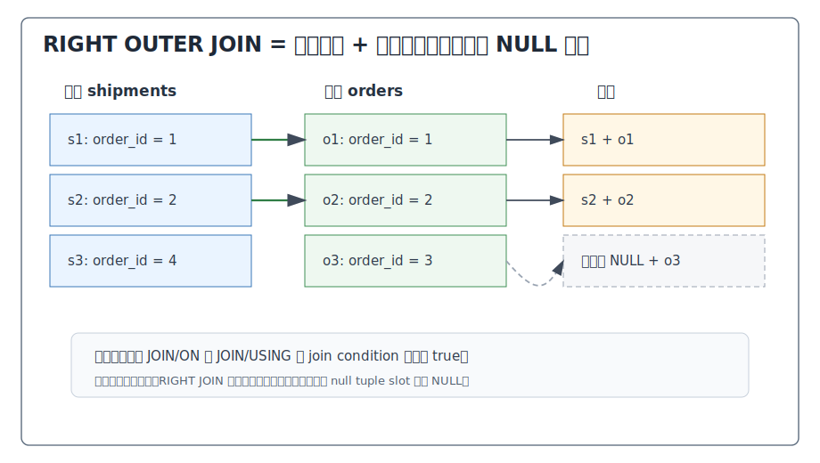
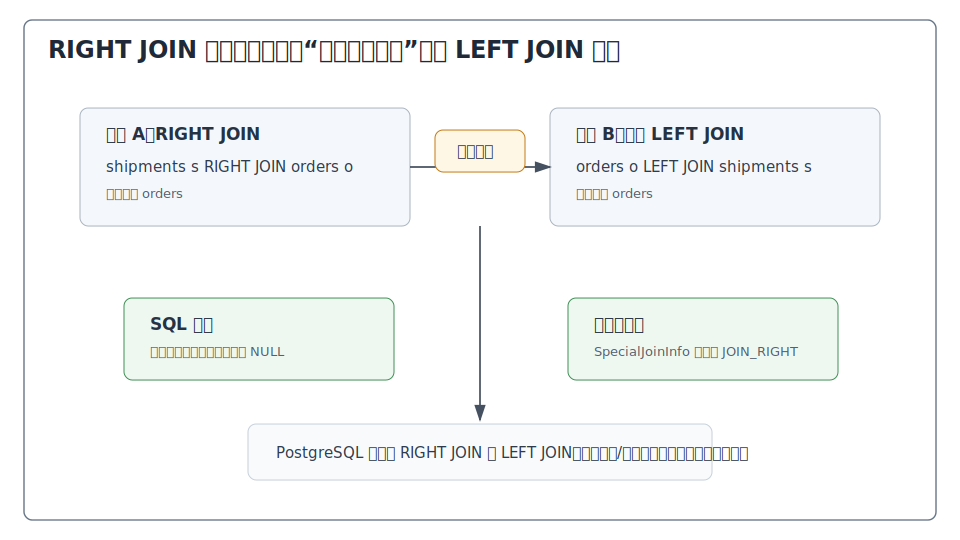
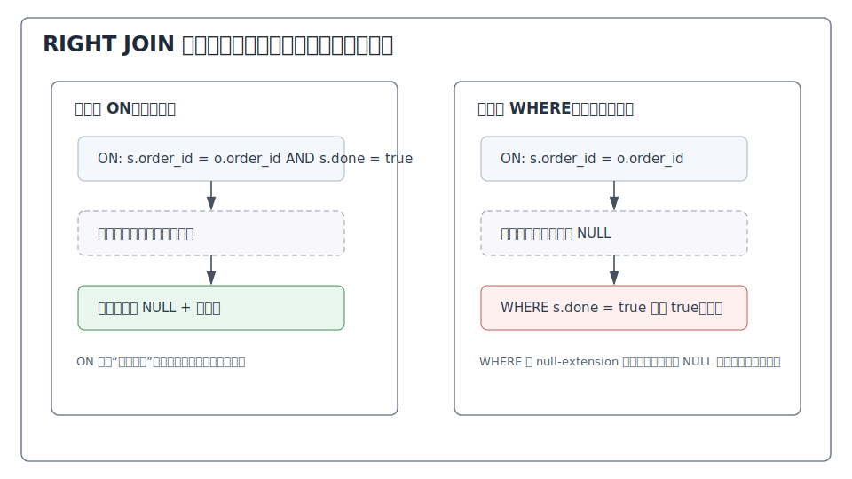
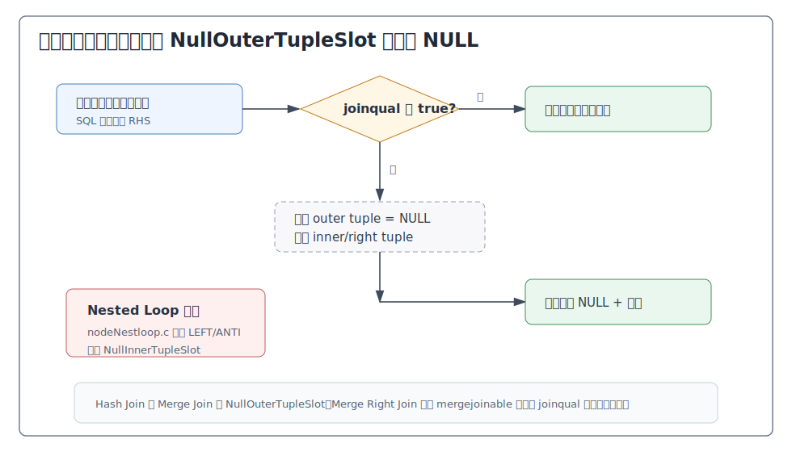
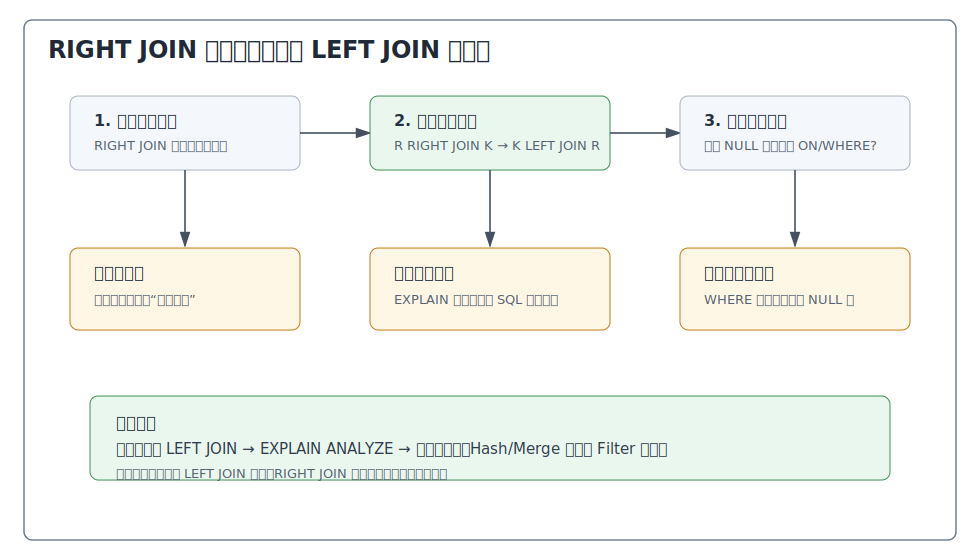

## 数据库筑基课 - right outer join

### 作者
digoal

### 日期
2026-05-30

### 标签
PostgreSQL , 应用开发者 , 数据库筑基课 , 执行算法 , 优化器 , Join , Right Outer Join

----

## 背景


数据库筑基课大纲在当前项目中未找到可引用文件，因此本文按“扫描/执行算法”独立成篇。本文以 PostgreSQL 本地源码、官方文档、项目参考文件 `postgres/CLAUDE.md` 和 DeepWiki 对 `postgres/postgres` 的 Query Planner and JOIN Optimization 导览为参考；关键机制以官方文档和本地源码为准。

`RIGHT OUTER JOIN` 是 SQL 标准 join 家族里最容易被误用的一种。它和 `LEFT OUTER JOIN` 的能力等价：都是“保留一侧全部行，另一侧找不到时补 NULL”。区别只是保留侧写在右边。

业务上它常出现在这些场景：

1. 已经写好的查询把“明细/事实表”放在左边，后来发现必须保留右边的主表。
2. 对账 SQL 中，想以右侧账单、订单、清单作为完整基准。
3. 临时排查数据缺失时，用右表作为“必须存在的一侧”反向关联左表。
4. 视图或 ORM 生成 SQL 时，因为组合顺序原因产出 right join。

工程上更推荐把它改写成等价的 `LEFT JOIN`，因为“要保留的一侧放左边”更符合阅读习惯，也更接近 PostgreSQL 优化器内部的规范化方式。PostgreSQL 官方文档明确说，`RIGHT OUTER JOIN` 可以通过交换左右表转换为 `LEFT OUTER JOIN`；源码 `reduce_outer_joins()` 也会把 `JOIN_RIGHT` 翻转成 `JOIN_LEFT`，以减少后续 planner 中需要处理的 join 类型。

本文关注的不是“right join 能不能用”，而是：

1. 它的精确定义是什么？
2. 为什么生产 SQL 中通常建议改写成 left join？
3. PostgreSQL 为什么在规划阶段翻转 right join，但执行器仍支持 `JOIN_RIGHT`？
4. `ON`、`WHERE`、`Join Filter`、`Filter` 如何影响右侧保留语义？

## 一、它解决什么问题？

假设物流表 `shipments` 保存已经发货的订单，订单表 `orders` 是业务完整订单清单。现在要“列出所有订单及其物流状态”，但 SQL 已经从物流表开始写：

```sql
SELECT s.shipment_id, s.status, o.order_id, o.amount
FROM shipments s
RIGHT JOIN orders o ON s.order_id = o.order_id;
```

这条 SQL 的业务目标是：`orders` 每一行都要出现；有物流记录时带出 `shipments`；没有物流记录时，`shipments` 的列补 NULL。

如果写成 inner join，没有物流的订单会消失。如果应用层先查订单再逐条查物流，会制造 N 次查询和一致性问题。`RIGHT JOIN` 解决的是“右侧关系必须完整保留”的语义表达问题。

但它的代价也很明确：

1. **阅读方向反直觉**：SQL 从左到右读，但保留侧在右边。
2. **条件位置更容易写错**：左表条件放在 `WHERE` 里，可能删除本来应该保留的右表行。
3. **优化器内部会规范化**：PostgreSQL 通常会把 right join 翻转为 left join 处理，计划方向不一定和 SQL 文本方向一致。
4. **执行算法选择受限制**：并非所有物理 join 节点都天然支持右侧保留。例如 `nodeNestloop.c` 只为 left/anti 准备右侧 NULL slot；Hash/Merge 节点才有右外连接相关的 `NullOuterTupleSlot`。

## 二、它是什么？

PostgreSQL 官方文档对 `RIGHT OUTER JOIN` 的定义是：返回所有已经满足 join condition 的 joined rows，再为每个没有匹配左侧行的右侧行增加一行，并把左侧列填成 NULL。它是 left join 的反向形式，可以通过交换左右表改写成 left join。

形式化表示：

```text
T1 RIGHT JOIN T2 ON P =
  { T1 行与 T2 行组合 | P 为 true }
  UNION ALL
  { T1 列 NULL + T2 未匹配行 }
```

等价改写：

```sql
-- RIGHT JOIN
SELECT ...
FROM shipments s
RIGHT JOIN orders o ON s.order_id = o.order_id;

-- 等价 LEFT JOIN，更推荐
SELECT ...
FROM orders o
LEFT JOIN shipments s ON s.order_id = o.order_id;
```



图 1 说明：RIGHT JOIN 的保留侧是右表。右表每一行先尝试找左表匹配行；找到多个匹配行就输出多行；找不到任何匹配行，也要输出右表行，并把左表列补成 NULL。左表中没有匹配任何右表的行不会被单独输出。

在 PostgreSQL 中，right join 会经过这些层次：

| 层次 | 关键结构或函数 | 和 right join 相关的作用 |
|---|---|---|
| SQL 语法 | `RIGHT [OUTER] JOIN ... ON/USING` | 描述右侧保留规则 |
| 解析树 | `JoinExpr.jointype = JOIN_RIGHT` | parser 输出可以包含 `JOIN_RIGHT` |
| 预处理 | `reduce_outer_joins()` | 尝试化简外连接，并把 `JOIN_RIGHT` 翻转成 `JOIN_LEFT` |
| Join 合法性 | `SpecialJoinInfo` | `join_info_list` 中不保留 `JOIN_RIGHT`，右连接按交换后的 left join 处理 |
| 路径/计划 | `joinrels.c` / `createplan.c` | 在可行时仍可能生成 `JOIN_RIGHT`、`JOIN_RIGHT_ANTI` 路径或计划 |
| 执行器 | `nodeHashjoin.c` / `nodeMergejoin.c` | 用 `NullOuterTupleSlot` 支持左侧补 NULL |
| EXPLAIN | `explain.c` | 计划节点可能显示 `Hash Right Join`、`Merge Right Join` 等 |

## 三、核心原理

### 3.1 语义层：RIGHT JOIN 是“右侧保留”的 outer join

`RIGHT JOIN` 的判断顺序和 `LEFT JOIN` 对称：

1. 先按 `ON` 或 `USING` 判断左右行是否匹配。
2. 匹配成功的行对正常输出。
3. 对没有任何左侧匹配的右表行，输出一行左侧 NULL 扩展结果。
4. `WHERE`、聚合、排序等看到的是已经补 NULL 后的结果。

这意味着：

```sql
SELECT s.shipment_id, o.order_id
FROM shipments s
RIGHT JOIN orders o
  ON s.order_id = o.order_id
 AND s.status = 'delivered';
```

这里的 `s.status = 'delivered'` 是匹配条件。某个订单如果没有 delivered 物流，仍会输出订单行，只是 `shipments` 列为 NULL。

但下面这条不同：

```sql
SELECT s.shipment_id, o.order_id
FROM shipments s
RIGHT JOIN orders o
  ON s.order_id = o.order_id
WHERE s.status = 'delivered';
```

`WHERE` 在补 NULL 后执行。没有物流的订单，其 `s.status` 是 NULL，`s.status = 'delivered'` 不为 true，于是这行被删除。结果通常退化成“只看有 delivered 物流的订单”。



图 2 说明：`shipments RIGHT JOIN orders` 和 `orders LEFT JOIN shipments` 表达同一件事：保留 `orders`。生产 SQL 中优先写成 left join，可以让保留侧出现在左边，减少条件位置和阅读方向的误判。

### 3.2 ON 与 WHERE：左表条件最容易误删右侧保留行

RIGHT JOIN 的保留侧在右边，因此“可补 NULL 的一侧”是左表。凡是引用左表列的条件，都要先判断它到底是匹配条件还是最终过滤条件。



图 3 说明：左表条件放在 `ON` 中，只影响“左行是否匹配右行”；匹配失败后，右行仍可保留并补左侧 NULL。左表条件放在 `WHERE` 中，会在补 NULL 后执行，普通比较遇到左侧 NULL 不会通过，因此会删除本来应保留的右行。

这也是建议改写成 left join 的原因。把上面的 right join 改写后：

```sql
SELECT s.shipment_id, o.order_id
FROM orders o
LEFT JOIN shipments s
  ON s.order_id = o.order_id
 AND s.status = 'delivered';
```

读者一眼能看到：`orders` 是保留侧，`shipments` 是可选侧，`s.status` 是匹配条件。

### 3.3 优化器：RIGHT JOIN 会被翻转成 LEFT JOIN

PostgreSQL 的 `reduce_outer_joins()` 注释明确说明：会消除 `JOIN_RIGHT`，通过交换左右输入把它变成 `JOIN_LEFT`。原因不是 SQL 不支持 right join，而是 planner 内部不想在 `SpecialJoinInfo` 中维护更多对称状态。

`src/include/nodes/pathnodes.h` 对 `SpecialJoinInfo` 的注释也说明：`jointype` 永远不是 `JOIN_RIGHT`；RIGHT JOIN 通过交换输入变成 LEFT JOIN；`join_info_list` 成员允许的外连接类型是 LEFT、FULL、SEMI、ANTI。

这带来三个实践结论：

1. 你写 `RIGHT JOIN`，PostgreSQL 可能内部按交换后的 `LEFT JOIN` 做 join order 合法性检查。
2. `EXPLAIN` 中计划节点方向未必和 SQL 文本方向一一对应，因为后续路径生成仍可能根据成本切换输入。
3. 读源码或调计划时，不能只搜索 `JOIN_RIGHT`；还要看 `JOIN_LEFT`、`SpecialJoinInfo`、`reversed` 和输入交换逻辑。

PostgreSQL 优化器 README 也说明：RIGHT JOIN 等价于交换输入后的 LEFT JOIN，因此外连接重排恒等式同样适用于 right join。

### 3.4 执行器：右侧保留需要左侧 NULL slot

`src/include/nodes/nodes.h` 中，`JOIN_RIGHT` 的注释是“pairs + unmatched RHS tuples”。也就是：输出匹配行对，加上未匹配的右侧行。

执行器中，Hash Join 和 Merge Join 对 right join 有明确支持：

| 执行节点 | right join 相关字段 | 含义 |
|---|---|---|
| Hash Join | `hj_NullOuterTupleSlot` | 为 right/right-anti/full outer join 准备左侧 NULL tuple |
| Hash Join | `HJ_FILL_INNER(hjstate)` | 判断是否需要输出未匹配 inner/right 侧 tuple |
| Merge Join | `mj_NullOuterTupleSlot` | 为 right outer join 准备左侧 NULL tuple |
| Merge Join | `mj_FillInner` / `mj_MatchedInner` | 标记是否需要输出未匹配 inner/right 侧 tuple |

`nodeMergejoin.c` 中对 `JOIN_RIGHT` 设置 `mj_FillInner = true`，并初始化 `mj_NullOuterTupleSlot`。`nodeHashjoin.c` 中对 `JOIN_RIGHT`、`JOIN_RIGHT_ANTI` 初始化 `hj_NullOuterTupleSlot`。



图 4 说明：right join 的 null-extension 方向和 left join 相反。未匹配的是右侧保留行；被补 NULL 的是左侧列。因此执行器需要一个“空的 outer tuple”。Hash Join 和 Merge Join 都有对应的 `NullOuterTupleSlot`。

一个容易忽略的边界是 Nested Loop。`nodeNestloop.c` 的初始化只为 `JOIN_LEFT` 和 `JOIN_ANTI` 创建 `nl_NullInnerTupleSlot`，没有对应的 `nl_NullOuterTupleSlot`。这意味着 PostgreSQL 通常会通过输入交换、路径选择或其他 join 节点来处理 right join，而不是简单地让 Nested Loop 原地输出右侧未匹配行。

### 3.5 Merge Right Join 的条件边界

`nodeMergejoin.c` 对 `JOIN_RIGHT` 有一条执行器检查：right/right-anti/full join 不能带有非 constant 的额外 joinqual；否则报错“RIGHT JOIN is only supported with merge-joinable join conditions”。源码注释说这本应由 planner 捕获。

工程解释：

1. Merge Join 的核心是按 merge key 同步两侧有序流。
2. 对 right/full 这类需要输出未匹配 inner/right 侧行的场景，执行器必须可靠判断某个右侧行是否已经匹配。
3. 如果还有复杂的额外 joinqual 不能作为 merge clause 使用，状态机判断和补 NULL 逻辑会变复杂。

正常用户很少直接撞到这个错误，因为 planner 会避免生成非法 Merge Right Join。但这说明 right join 不是“任何物理算法都能无脑支持”的语义。它的保留方向会影响执行器状态机。

### 3.6 化简：RIGHT JOIN 也可能退化为 INNER JOIN

`reduce_outer_joins()` 不只翻转 right join，还会降低外连接强度。对 right join 来说，如果上层严格条件要求左侧可补 NULL 侧的列非空，那么补 NULL 行最终一定被过滤，outer join 可以化简为 inner join。

例子：

```sql
SELECT s.shipment_id, o.order_id
FROM shipments s
RIGHT JOIN orders o ON s.order_id = o.order_id
WHERE s.shipment_id IS NOT NULL;
```

这条 SQL 要求左侧 `s.shipment_id` 非空。所有没有物流的订单都会被补成 `s.shipment_id = NULL`，然后被 `WHERE` 删除。因此语义上不再需要 right join 保留未匹配订单，优化器可以把它当成 inner join 类问题处理。

如果你本来想保留所有订单，就不应该把左侧可补 NULL 列的非空条件写在 `WHERE` 中。

## 四、横向对比

| 维度 | RIGHT OUTER JOIN | 等价 LEFT JOIN 改写 | LEFT OUTER JOIN | INNER JOIN | FULL OUTER JOIN |
|---|---|---|---|---|---|
| 主要目标 | 保留右侧全部行 | 保留改写后左侧全部行 | 保留左侧全部行 | 只保留匹配行对 | 两侧未匹配都保留 |
| 未匹配行 | 右侧未匹配行补左侧 NULL | 左侧未匹配行补右侧 NULL | 左侧未匹配行补右侧 NULL | 删除 | 两侧都补 NULL |
| 可读性 | 较差，保留侧在右边 | 较好，保留侧在左边 | 较好 | 最直接 | 复杂 |
| PostgreSQL 规划 | 会翻转为 left join 参与特殊连接处理 | 原生符合内部规范化方向 | 原生处理 | 最自由 | 最受约束 |
| 常见物理计划 | Hash Right Join、Merge Right Join 等 | Hash Left Join、Nested Loop Left Join 等 | Nested/Hash/Merge Left Join | Nested/Hash/Merge Join | Hash/Merge Full Join 等 |
| 条件位置风险 | 左表条件放 WHERE 会误删右行 | 右表条件放 WHERE 会误删左行 | 右表条件放 WHERE 会误删左行 | `ON`/`WHERE` 通常可交换 | 两侧都易误删 |
| 适合场景 | 临时反向阅读、兼容生成 SQL | 生产代码首选 | 主表完整输出 | 双方必须存在 | 对账差异 |
| 不适合场景 | 长期业务 SQL、复杂多表 join | 无明显不适合 | 只关心匹配行 | 要保留缺失侧 | 大多数常规查询 |

表中的重点不是 right join 功能弱，而是它的表达方向弱。既然官方语义和 PostgreSQL 内部都认可“交换输入即可变成 left join”，生产 SQL 通常应该直接使用等价 left join。

## 五、效果如何？

RIGHT JOIN 的收益：

1. **表达右侧基准关系**：当 SQL 结构已经从左侧明细开始时，可以快速声明右侧必须完整保留。
2. **兼容 SQL 标准和生成器**：某些工具链可能产出 right join，PostgreSQL 支持解析和执行。
3. **便于临时对账**：排查“左侧缺失、右侧完整”的关系时，语法直接。

代价：

1. **维护成本高**：代码审查需要反向理解保留侧。
2. **条件位置风险高**：引用左表的 `WHERE` 条件容易把 right join 化简成 inner join。
3. **计划解读更绕**：优化器可能翻转成 left join，执行计划方向和 SQL 文本不同。
4. **物理执行有边界**：Nested Loop 不是对称支持 right join；Merge Right Join 对非 mergejoinable 额外条件有边界。
5. **和多表 join 混用更难读**：`A JOIN B RIGHT JOIN C LEFT JOIN D` 这类 SQL 很难快速判断每个表的保留关系。

不要伪造性能数字。评估实际 SQL 时，使用：

```sql
EXPLAIN (ANALYZE, BUFFERS, VERBOSE)
SELECT ...
FROM ...
RIGHT JOIN ...
```

然后把它改写成等价 left join，再比较计划和结果。很多时候，改写后的 SQL 更容易解释，也更容易定位索引、统计信息和过滤位置问题。

## 六、实操 DEMO

以下 SQL 是最小可验证实验。本文未在本机启动 PostgreSQL 实例执行，因此不提供伪造输出；读者可直接在 PostgreSQL 中运行并观察结果和计划。

### 6.1 准备数据

```sql
DROP TABLE IF EXISTS shipments;
DROP TABLE IF EXISTS orders;

CREATE TABLE orders (
  order_id bigint PRIMARY KEY,
  amount numeric NOT NULL,
  status text NOT NULL
);

CREATE TABLE shipments (
  shipment_id bigint PRIMARY KEY,
  order_id bigint NOT NULL REFERENCES orders(order_id),
  status text NOT NULL
);

INSERT INTO orders(order_id, amount, status) VALUES
  (1, 99.00, 'paid'),
  (2, 199.00, 'paid'),
  (3, 299.00, 'paid');

INSERT INTO shipments(shipment_id, order_id, status) VALUES
  (1001, 1, 'delivered'),
  (1002, 2, 'pending');

ANALYZE orders;
ANALYZE shipments;
```

### 6.2 RIGHT JOIN 保留右侧订单

```sql
SELECT s.shipment_id, s.status AS shipment_status, o.order_id
FROM shipments s
RIGHT JOIN orders o ON s.order_id = o.order_id
ORDER BY o.order_id;
```

预期语义：

1. 订单 1 带出 delivered 物流。
2. 订单 2 带出 pending 物流。
3. 订单 3 没有物流，仍输出订单行，`shipments` 列为 NULL。

### 6.3 等价 LEFT JOIN

```sql
SELECT s.shipment_id, s.status AS shipment_status, o.order_id
FROM orders o
LEFT JOIN shipments s ON s.order_id = o.order_id
ORDER BY o.order_id;
```

这条 SQL 的结果应与 6.2 等价，但更容易读：`orders` 是保留侧。

### 6.4 ON 条件保留右行

```sql
SELECT s.shipment_id, s.status AS shipment_status, o.order_id
FROM shipments s
RIGHT JOIN orders o
  ON s.order_id = o.order_id
 AND s.status = 'delivered'
ORDER BY o.order_id;
```

预期语义：

1. 订单 1 有 delivered 物流，带出物流。
2. 订单 2 有 pending 物流，但不满足 `ON s.status = 'delivered'`，因此作为未匹配右行输出，左侧补 NULL。
3. 订单 3 没有物流，也补 NULL。

### 6.5 WHERE 条件删除补 NULL 行

```sql
SELECT s.shipment_id, s.status AS shipment_status, o.order_id
FROM shipments s
RIGHT JOIN orders o ON s.order_id = o.order_id
WHERE s.status = 'delivered'
ORDER BY o.order_id;
```

预期语义：只保留订单 1。订单 2 的 pending 行被 `WHERE` 删除；订单 3 的补 NULL 行也因为 `s.status = 'delivered'` 不为 true 被删除。

### 6.6 观察计划

```sql
EXPLAIN (ANALYZE, BUFFERS)
SELECT s.shipment_id, s.status AS shipment_status, o.order_id
FROM shipments s
RIGHT JOIN orders o ON s.order_id = o.order_id
ORDER BY o.order_id;
```

根据数据量、统计信息和可用索引，计划可能显示为 `Hash Right Join`、`Merge Right Join`，也可能因为优化器翻转输入后显示为 left join 形态。重点不是计划名称，而是：

1. 哪一侧是语义保留侧。
2. `Hash Cond` / `Merge Cond` 是否对应 join key。
3. `Join Filter` 与 `Filter` 分别来自哪里。
4. 估算行数和实际行数是否偏离。

## 七、最佳实践

### 面向数据库架构师

1. **建模时优先定义主表方向**：把必须完整保留的关系放在 SQL 左边，用 left join 表达可选关系。
2. **把 RIGHT JOIN 视为等价记法，不视为设计模式**：能改写就改写，尤其是稳定业务 SQL、视图和报表 SQL。
3. **保证可选侧基数可控**：如果左侧一对多匹配右侧基准表，right join 会复制右侧行；必要时先聚合或去重。
4. **用约束表达业务必然性**：如果每个订单必须有物流，就不应长期依赖 right join 补 NULL，而应建立约束或数据质量流程。

### 面向 DBA

1. **先改写成 left join 再排障**：这不会改变语义，却能减少阅读和沟通成本。
2. **检查外连接化简**：如果 `WHERE` 中引用可补 NULL 侧列的 strict 条件，right join 可能被化简为 inner join。
3. **不要被 EXPLAIN 方向误导**：PostgreSQL 可能在规划中交换输入，`Hash Right Join`、`Hash Left Join` 的出现要结合语义保留侧看。
4. **关注右侧保留侧的输出规模**：right join 至少输出右侧行数；右侧越大，后续排序、聚合、网络返回成本越高。
5. **用 `EXPLAIN (ANALYZE, BUFFERS)` 验证估算**：重点看 rows/actual rows、Hash Batches、临时文件、Join Filter 移除行数。

### 面向业务开发者

1. **生产 SQL 首选 left join 写法**：`A RIGHT JOIN B` 改成 `B LEFT JOIN A`。
2. **引用可选侧列的条件慎放 WHERE**：在 right join 中，可选侧通常是左表；左表列放 `WHERE` 可能删除保留右行。
3. **不要用 `SELECT *`**：right join 改写后列顺序可能变化，显式列清单更安全。
4. **找缺失关系优先用 `NOT EXISTS`**：如果只是找右侧没有左侧匹配的记录，`NOT EXISTS` 常比 right join 加 `IS NULL` 更清晰。
5. **测试边界数据**：至少覆盖“有一个匹配、多个匹配、没有匹配、可选侧列为 NULL”四类数据。



图 5 说明：right join 的排障路径很简单：先确认右侧为什么必须保留，再交换输入改写成 left join，然后检查条件位置和计划。这样能把“方向问题”从“性能问题”中剥离出来。

## 八、适合与不适合场景

适合：

1. **临时分析**：从已有左表查询出发，快速补上右侧完整基准。
2. **兼容生成 SQL**：工具、视图展开或迁移 SQL 已经产生 right join，短期保留可接受。
3. **教学和理解外连接对称性**：用它说明 left/right/full 的差别。
4. **一次性对账**：右侧账单或清单是绝对基准，想快速查看左侧缺失。

不适合：

1. **长期生产业务 SQL**：推荐改写成等价 left join。
2. **复杂多表 join**：right join 混合 left/full/inner join 会显著增加阅读成本。
3. **团队 SQL 规范追求一致性**：多数团队应统一使用 left join 表达可选关系。
4. **只关心缺失匹配**：优先用 `NOT EXISTS` 或 anti join 风格。
5. **希望强制某种物理算法**：join 语法表达语义，不应作为控制 Hash/Merge/Nested Loop 的手段。

## 九、常见坑

1. **把 right join 当成“更强的 left join”**  
   它只是换方向的 left join。`A RIGHT JOIN B` 等价于 `B LEFT JOIN A`。

2. **左表过滤写在 WHERE，误删右侧保留行**  
   `WHERE s.status = 'delivered'` 会删除补 NULL 的订单行。如果这是匹配条件，应放 `ON`。

3. **计划名称和 SQL 文本方向对不上就误判优化器错误**  
   PostgreSQL 会翻转 right join。看计划时要追踪语义保留侧，而不是只看 SQL 文本顺序。

4. **右侧指标被左侧一对多放大**  
   如果一个订单多条物流轨迹，right join 后按订单金额求和会重复。先把左侧聚合到每个订单一行。

5. **用可空列判断缺失**  
   `WHERE s.status IS NULL` 可能混淆“没有物流行”和“有物流行但状态为空”。缺失判断应使用左侧主键或非空 join key。

6. **忽略外连接化简**  
   如果上层条件要求可补 NULL 侧非空，right join 可能被化简为 inner join。计划里看不到 right join 不一定是 bug。

7. **NATURAL RIGHT JOIN**  
   `NATURAL` 会自动选同名列，结构变更会悄悄改变条件。生产 SQL 不要依赖它。

8. **把 `COALESCE` 用在 join key 上掩盖 NULL 语义**  
   `COALESCE(a.k, 0) = COALESCE(b.k, 0)` 会改变 NULL 匹配规则，也可能破坏索引使用。

9. **把 right join 用作代码生成偷懒**  
   生成器可以先构建关系图，再统一把保留侧放左边输出 left join，不必牺牲可读性。

10. **没有验证改写等价性**  
    改写 right join 为 left join 时，要同步调整列引用和输出列顺序；尤其是 `USING`、`NATURAL`、`SELECT *` 场景。

## 十、扩展问题

1. 为什么 PostgreSQL 的 `SpecialJoinInfo` 中不保留 `JOIN_RIGHT`，但执行器仍有 `JOIN_RIGHT`？
2. `A RIGHT JOIN B ON ... WHERE A.pk IS NULL` 和 `B WHERE NOT EXISTS (...)` 在什么条件下等价？
3. 改写 `RIGHT JOIN ... USING (k)` 为 `LEFT JOIN ... USING (k)` 时，输出列顺序和列合并有什么变化？
4. 如果 `Hash Right Join` 的右侧保留表很大，哪些成本来自“至少输出右侧行数”？
5. 为什么 Merge Right Join 对非 mergejoinable 的额外 joinqual 有限制？
6. 多表查询中，一个 right join 被翻转成 left join 后，会如何影响 join order 合法性检查？

## 十一、扩展阅读

1. PostgreSQL 官方文档：`doc/src/sgml/ref/select.sgml`，`SELECT` 语法中对 `LEFT OUTER JOIN`、`RIGHT OUTER JOIN`、`FULL OUTER JOIN` 的定义，以及 right join 可交换为 left join 的说明。
2. PostgreSQL 官方文档：`doc/src/sgml/queries.sgml`，Table Expressions / Joined Tables，说明 right outer join 是 left join 的反向形式，并给出 `RIGHT JOIN` 示例。
3. PostgreSQL 官方文档：`doc/src/sgml/perform.sgml`，说明 outer join 中 `Join Filter` 和 `Filter` 的语义差异，以及 outer join 对 planner join order 的约束。
4. PostgreSQL 源码：`src/include/nodes/nodes.h`，`JOIN_RIGHT`、`JOIN_RIGHT_SEMI`、`JOIN_RIGHT_ANTI` 的 join 类型定义。
5. PostgreSQL 源码：`src/backend/parser/gram.y`，`RIGHT opt_outer` 解析为 `JOIN_RIGHT`。
6. PostgreSQL 源码：`src/backend/optimizer/prep/prepjointree.c`，`reduce_outer_joins()` 对 `JOIN_RIGHT` 的翻转、外连接化简和 anti join 识别逻辑。
7. PostgreSQL 源码：`src/include/nodes/pathnodes.h`，`SpecialJoinInfo` 注释说明 `jointype` 永远不是 `JOIN_RIGHT`。
8. PostgreSQL 源码：`src/backend/optimizer/README`，Valid OUTER JOIN Optimizations 中说明 right join 等价于交换输入后的 left join。
9. PostgreSQL 源码：`src/backend/optimizer/path/joinrels.c`，join order 合法性检查和可能生成 `JOIN_RIGHT` 路径的逻辑。
10. PostgreSQL 源码：`src/backend/executor/nodeHashjoin.c`，`JOIN_RIGHT`、`JOIN_RIGHT_ANTI` 初始化 `hj_NullOuterTupleSlot` 的逻辑。
11. PostgreSQL 源码：`src/backend/executor/nodeMergejoin.c`，`JOIN_RIGHT` 的 `mj_FillInner`、`mj_NullOuterTupleSlot` 和 mergejoinable 条件限制。
12. PostgreSQL 源码：`src/include/nodes/execnodes.h`，`MergeJoinState`、`HashJoinState` 中 right join 的 null tuple slot 字段说明。
13. PostgreSQL 源码：`src/backend/commands/explain.c`，`EXPLAIN` 对 join type、`Join Filter`、`Hash Cond`、`Merge Cond` 的展示逻辑。
14. DeepWiki：`postgres/postgres` 的 Query Planner and JOIN Optimization 页面，用作 PostgreSQL 优化器模块导览；本文关键结论已回到本地源码和官方文档核对。
  
## 附录 
1、克隆代码  
```  
git clone --depth 1 https://github.com/postgres/postgres
```  
  
2、启用 codex, 使用 [数据库筑基课 skill](../skills/README.md).  
```
文章标题: 
  数据库筑基课 - right outer join
项目源码(已克隆到当前项目如下目录中):  
  postgres
项目 deepwiki reponame:  
  postgres/postgres
项目参考信息: 
  postgres/CLAUDE.md
```
  
  
#### [PostgreSQL 解决方案集合](../201706/20170601_02.md "40cff096e9ed7122c512b35d8561d9c8")
  
  
#### [德哥 / digoal's Github - 公益是一辈子的事.](https://github.com/digoal/blog/blob/master/README.md "22709685feb7cab07d30f30387f0a9ae")
  
  
#### [About 德哥](https://github.com/digoal/blog/blob/master/me/readme.md "a37735981e7704886ffd590565582dd0")
  
  

  
