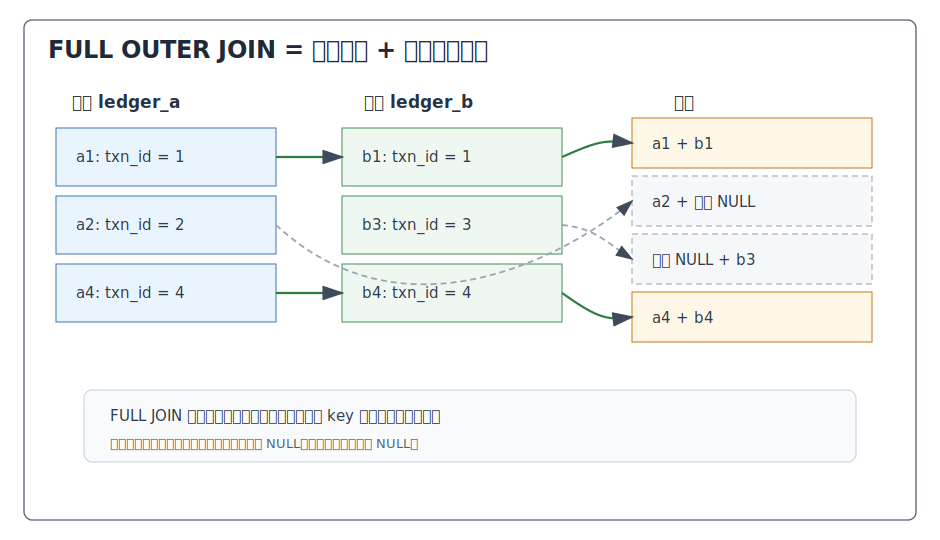
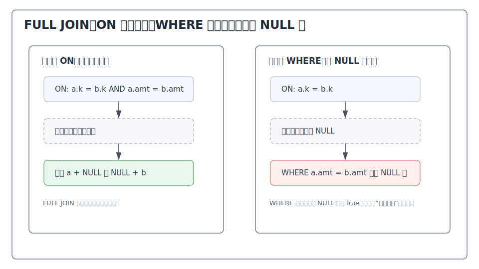
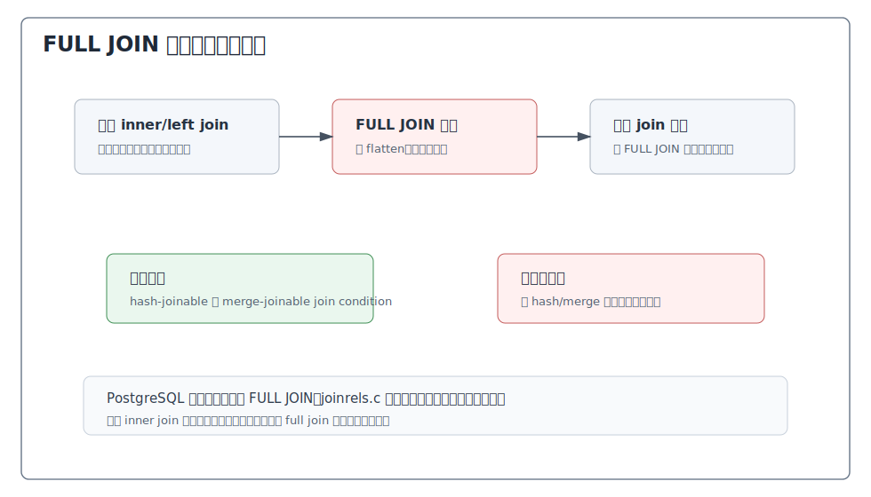
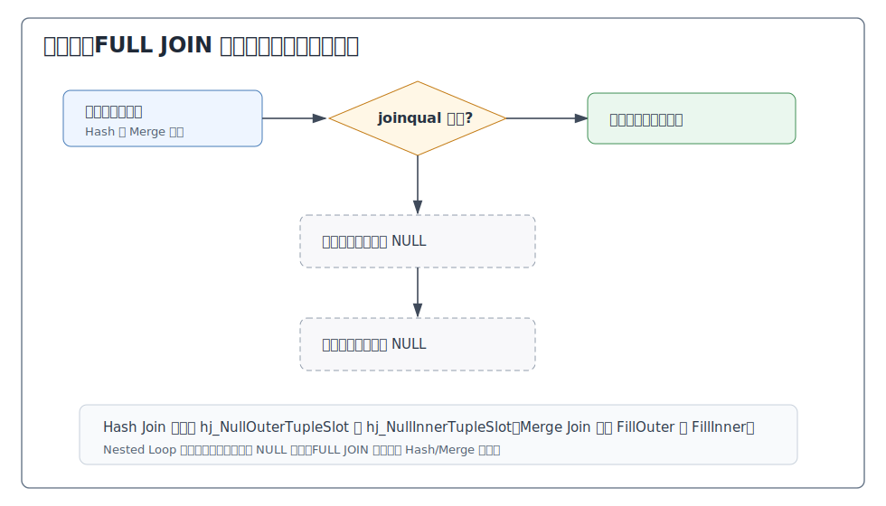
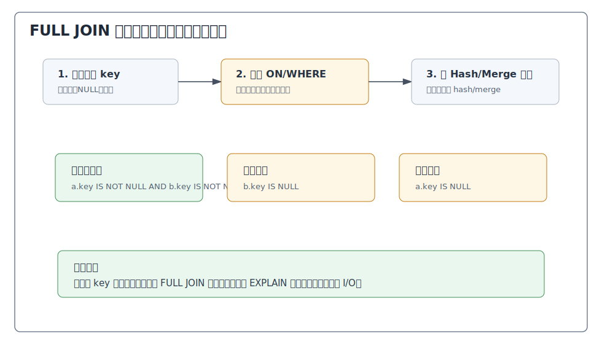

## 数据库筑基课 - full outer join

### 作者
digoal

### 日期
2026-05-30

### 标签
PostgreSQL , 应用开发者 , 数据库筑基课 , 执行算法 , 优化器 , Join , Full Outer Join

----

## 背景


数据库筑基课大纲在当前项目中未找到可引用文件，因此本文按“扫描/执行算法”独立成篇。本文以 PostgreSQL 本地源码、官方文档、项目参考文件 `postgres/CLAUDE.md` 和 DeepWiki 对 `postgres/postgres` 的 Query Planner and JOIN Optimization 导览为参考；关键机制以官方文档和本地源码为准。

`FULL OUTER JOIN` 是 SQL join 里最适合做“双边对账”的算子。它不像 `INNER JOIN` 只保留匹配行，也不像 `LEFT JOIN` 或 `RIGHT JOIN` 只保留一侧。它的语义是：左右两侧都不能无声消失。

典型业务痛点：

1. 支付系统和订单系统按交易号对账，要同时看到“订单有、支付无”和“支付有、订单无”。
2. 新旧系统迁移后，比对同一业务主键是否完整、金额是否一致。
3. 主数据同步后，检查源端和目标端各自缺失的记录。
4. 两条数据管道输出同一指标，要分类找出只在 A、只在 B、两边都有但值不同的记录。

很多人把 full join 理解成“left join 加 right join”。这只是直观近似，不是 PostgreSQL 执行层的真实模型。Full join 同时要求左右两侧都能补 NULL，因此优化器重排最受限，执行器也要同时维护左右未匹配状态。用它之前要先确认：你真的需要双边缺失信息，而不是只需要某一侧基准或一个 anti join。

## 一、它解决什么问题？

假设有两张对账表：

```sql
ledger_a(txn_id, amount)
ledger_b(txn_id, amount)
```

我们要回答三个问题：

1. 哪些交易两边都有？
2. 哪些交易只在 A，不在 B？
3. 哪些交易只在 B，不在 A？

`INNER JOIN` 只能回答第一个问题；`LEFT JOIN` 只能方便地回答“只在 A”；`RIGHT JOIN` 只能方便地回答“只在 B”。`FULL OUTER JOIN` 可以一次把三类都放进同一个结果集中：

```sql
SELECT
  COALESCE(a.txn_id, b.txn_id) AS txn_id,
  a.amount AS amount_a,
  b.amount AS amount_b
FROM ledger_a a
FULL JOIN ledger_b b ON a.txn_id = b.txn_id;
```

它解决的是“双边完整性”问题。代价是：

1. 两侧未匹配行都要保留，结果规模可能接近两侧 key 并集。
2. NULL 语义扩散到两侧，`WHERE` 条件更容易误删差异行。
3. PostgreSQL 当前不尝试重排 FULL JOIN，join order 更像一个硬边界。
4. 物理算法主要依赖 Hash Join 或 Merge Join；非 hash/merge 条件可能无法规划。

## 二、它是什么？

PostgreSQL 官方文档定义 `FULL OUTER JOIN`：先执行 inner join；然后对左表中没有匹配右表的行，追加右侧列为 NULL 的行；再对右表中没有匹配左表的行，追加左侧列为 NULL 的行。

形式化表示：

```text
T1 FULL JOIN T2 ON P =
  { T1 行与 T2 行组合 | P 为 true }
  UNION ALL
  { T1 未匹配行 + T2 列 NULL }
  UNION ALL
  { T1 列 NULL + T2 未匹配行 }
```

这里的“未匹配”只由 `JOIN/ON` 或 `JOIN/USING` 的 join condition 决定，不由 `WHERE` 决定。`WHERE` 在 full join 补 NULL 之后执行。



图 1 说明：FULL JOIN 输出三类行：真实匹配行、左侧独有行、右侧独有行。对账类 SQL 的第一步通常不是立即过滤，而是先把三类行明确标记出来。

PostgreSQL 内部层次：

| 层次 | 关键结构或函数 | 和 full join 相关的作用 |
|---|---|---|
| SQL 语义 | `FULL [OUTER] JOIN ... ON/USING` | 定义双侧保留规则 |
| 解析树 | `JoinExpr.jointype = JOIN_FULL` | parser 输出 full join 节点 |
| Join tree 处理 | optimizer README / jointree flattening | FULL JOIN 不被扁平化，保持 join order 边界 |
| Join 合法性 | `SpecialJoinInfo` | FULL JOIN 有特殊连接信息，但不参与普通重排 |
| 路径生成 | `joinrels.c` / `joinpath.c` | 尝试 Hash Full Join、Merge Full Join；无有效路径时报错 |
| 执行器 | `nodeHashjoin.c` / `nodeMergejoin.c` | 同时准备 `NullOuterTupleSlot` 和 `NullInnerTupleSlot` |
| EXPLAIN | `explain.c` | 显示 `Hash Full Join`、`Merge Full Join` 等 |

## 三、核心原理

### 3.1 语义层：FULL JOIN 不是“保留某一侧”，而是“保留两侧”

Full join 的结果至少要覆盖左右两侧所有未被匹配消耗的行。对账时，常见写法是：

```sql
SELECT
  COALESCE(a.txn_id, b.txn_id) AS txn_id,
  CASE
    WHEN a.txn_id IS NULL THEN 'only_in_b'
    WHEN b.txn_id IS NULL THEN 'only_in_a'
    WHEN a.amount IS DISTINCT FROM b.amount THEN 'amount_diff'
    ELSE 'matched'
  END AS diff_type,
  a.amount AS amount_a,
  b.amount AS amount_b
FROM ledger_a a
FULL JOIN ledger_b b ON a.txn_id = b.txn_id;
```

这里有两个关键点：

1. 用 `COALESCE(a.txn_id, b.txn_id)` 生成统一业务 key，只适合展示和分组，不等于改变 join 语义。
2. 比较两侧值时优先使用 `IS DISTINCT FROM`，因为它能把 NULL 当成可比较值处理，避免 `NULL <> value` 得到 unknown。

### 3.2 ON 与 WHERE：差异条件放错位置会破坏对账

Full join 最常见错误是把差异条件放到 `WHERE` 里，却没有考虑 NULL：

```sql
-- 容易误删缺失行
SELECT *
FROM ledger_a a
FULL JOIN ledger_b b ON a.txn_id = b.txn_id
WHERE a.amount <> b.amount;
```

如果某个交易只在 A，`b.amount` 是 NULL，`a.amount <> b.amount` 不是 true，而是 unknown；这行会被 `WHERE` 删除。结果只剩部分“两边都有但金额不同”的行，缺失类差异被误删。

更稳妥的对账过滤：

```sql
SELECT *
FROM ledger_a a
FULL JOIN ledger_b b ON a.txn_id = b.txn_id
WHERE a.txn_id IS NULL
   OR b.txn_id IS NULL
   OR a.amount IS DISTINCT FROM b.amount;
```



图 2 说明：`ON` 决定两行是否配对。把金额相等放进 `ON`，金额不同的同 key 记录会变成两条未匹配行；把金额差异放进 `WHERE`，必须显式处理 NULL，否则会删除缺失行。对账 SQL 通常把“身份匹配条件”放 `ON`，把“差异分类或过滤条件”放 `SELECT/WHERE`，并显式处理 NULL。

### 3.3 优化器：FULL JOIN 是 join order 的硬边界

PostgreSQL 优化器 README 明确说明：普通显式 join 通常会被 flatten 成一组关系，让优化器搜索 join order；但 `FULL OUTER JOIN` 不会被 flatten。README 还说明当前代码不尝试重排 FULL JOIN，顺序通过保留 FULL JOIN 节点来强制。

原因很直接：FULL JOIN 的两侧都可能被补 NULL。把它随意和其他 join 重排，很容易改变哪些行被视为匹配、哪些行被补 NULL、哪些上层条件能下推。



图 3 说明：FULL JOIN 会形成一个规划子问题。优化器不能像处理 inner join 那样自由重排它。`joinrels.c` 对 `JOIN_FULL` 同时尝试两个输入方向，但如果没有任何有效 path，会直接报错：`FULL JOIN is only supported with merge-joinable or hash-joinable join conditions`。

### 3.4 物理算法：主要依赖 Hash Full Join 和 Merge Full Join

Full join 需要输出：

1. 匹配行。
2. 未匹配 outer/left 行，补 inner/right NULL。
3. 未匹配 inner/right 行，补 outer/left NULL。

这要求执行器能追踪双方的匹配状态。PostgreSQL 中：

| 执行节点 | FULL JOIN 支持点 | 关键字段或状态 |
|---|---|---|
| Hash Join | 哈希匹配后扫描未匹配 hash table 元组和 null-key 元组 | `HJ_FILL_OUTER`、`HJ_FILL_INNER`、`hj_NullOuterTupleSlot`、`hj_NullInnerTupleSlot` |
| Merge Join | 有序流同步，同时 fill outer 和 fill inner | `mj_FillOuter`、`mj_FillInner`、`mj_MatchedOuter`、`mj_MatchedInner` |
| Nested Loop | 不适合双向补 NULL | `nodeNestloop.c` 只为 left/anti 准备 `nl_NullInnerTupleSlot` |



图 4 说明：Full join 的执行器状态比 left/right join 更重。Hash Join 对 full join 同时初始化 `hj_NullOuterTupleSlot` 和 `hj_NullInnerTupleSlot`；Merge Join 对 full join 同时设置 `mj_FillOuter` 和 `mj_FillInner`，并准备两个方向的 NULL slot。

### 3.5 条件限制：不是任意 ON 条件都适合 FULL JOIN

PostgreSQL 的 `joinrels.c` 在 full join 无法生成有效路径时会报错：

```text
FULL JOIN is only supported with merge-joinable or hash-joinable join conditions
```

`joinpath.c` 中 `select_mergejoin_clauses()` 也说明：对 right/right-anti/full join，如果存在非 mergejoinable 的 join clause，merge join 机器不能处理这些情况，planner 必须避免生成这类 merge join 计划。Merge Join 执行器里也有防线：FULL JOIN 带非 constant 的额外 joinqual 时会报 `FULL JOIN is only supported with merge-joinable join conditions`，注释说明这本应由 planner 捕获。

实践上，最稳妥的 full join 条件是等值 key：

```sql
FULL JOIN b ON a.key = b.key
```

复杂条件应谨慎：

```sql
-- 高风险：不一定能生成 FULL JOIN 计划，也很难解释对账语义
FULL JOIN b ON abs(a.amount - b.amount) < 0.01
```

对账通常先用稳定业务 key 做 full join，再在结果上判断金额、状态、时间等差异。

### 3.6 varnullingrels：FULL JOIN 两侧变量都可能被 NULL 化

PostgreSQL 优化器 README 对 outer join 的变量标记有一段关键说明：对 LEFT/RIGHT JOIN，只有 nullable side 的 Vars 会标记对应 outer join RT index；对 FULL JOIN，两侧输入的 Vars 都会被标记。

这背后的语义是：

```text
FULL JOIN 上方看到的 a.col：
  可能是真实 a.col
  也可能因为右侧独有行而是 NULL

FULL JOIN 上方看到的 b.col：
  可能是真实 b.col
  也可能因为左侧独有行而是 NULL
```

因此，很多过滤条件不能随便下推到某一侧扫描。比如：

```sql
WHERE a.amount > 0
```

如果下推到 `ledger_a` 扫描层，它会改变“右侧独有行补左侧 NULL 后是否还应被上层过滤”的时机。优化器必须通过 varnullingrels/phnullingrels 判断条件应在 join 前还是 join 后执行。

## 四、横向对比

| 维度 | FULL OUTER JOIN | LEFT OUTER JOIN | RIGHT OUTER JOIN | INNER JOIN | UNION ALL + anti join |
|---|---|---|---|---|---|
| 主要目标 | 两侧未匹配都保留 | 保留左侧 | 保留右侧 | 只保留匹配 | 手工拆分匹配和缺失 |
| 缺失行输出 | 左缺、右缺都输出 | 只输出左侧未匹配 | 只输出右侧未匹配 | 不输出 | 可按分支控制 |
| NULL 扩展 | 两侧都可能 NULL | 右侧可能 NULL | 左侧可能 NULL | 无 outer NULL 扩展 | 由分支显式构造 |
| Join order 自由度 | 最低，不尝试重排 | 有限制但可部分重排 | 通常翻转为 left join | 最高 | 由多个查询分别规划 |
| 物理算法 | Hash/Merge 为主 | Nested/Hash/Merge | Hash/Merge/翻转路径 | Nested/Hash/Merge | 多个计划组合 |
| 条件要求 | 需要 hash/merge 友好条件 | 更宽松 | 比 left join 更绕 | 最宽松 | 每个分支可单独设计 |
| 典型场景 | 双边对账、迁移比对 | 主表完整输出 | 临时反向保留 | 双方必须存在 | 极复杂对账或性能拆分 |
| 典型风险 | WHERE 误删缺失、结果膨胀 | 右侧过滤误删左行 | 左侧过滤误删右行 | 漏条件笛卡尔积 | SQL 复杂、重复扫描 |

Full join 的强项是一次得到完整差异面；弱点是优化空间小、NULL 语义复杂。数据量大或规则复杂时，把 full join 拆成 `INNER JOIN`、`LEFT ANTI`、`RIGHT ANTI` 三个分支，有时更容易调优和解释。

## 五、效果如何？

收益：

1. **完整对账视图**：匹配、左缺、右缺、值不同可在一个结果中分类。
2. **避免偏向某一侧**：不会因为选 left join 或 right join 而天然遗漏另一侧缺失。
3. **迁移验证友好**：新旧系统、源目标表、两条 ETL 输出可以直接按 key 比对。
4. **SQL 表达集中**：比多个 anti join 分支更短，更容易做一次性审计。

代价：

1. **结果规模大**：输出接近 key 并集，右侧或左侧一对多会进一步放大。
2. **内存和临时 I/O 压力**：Hash Full Join 可能需要保存匹配标记、处理 batch 和未匹配 hash tuples；Merge Full Join 可能需要排序。
3. **优化器重排受限**：FULL JOIN 不 flatten，不像 inner join 那样自由搜索 join order。
4. **条件受限**：非 hash/merge 友好的 full join 条件可能无法执行。
5. **NULL 判断复杂**：普通比较、聚合、分组都要明确 NULL 扩展语义。

不要伪造性能数字。评估实际 full join 时使用：

```sql
EXPLAIN (ANALYZE, BUFFERS, VERBOSE)
SELECT ...
FROM ...
FULL JOIN ...
```

重点看：是否是 `Hash Full Join` 或 `Merge Full Join`、估算行数与实际行数是否偏离、Hash 的 batches 和 memory、Sort 是否写临时文件、结果中三类差异的占比。

## 六、实操 DEMO

以下 SQL 是最小可验证实验。本文未在本机启动 PostgreSQL 实例执行，因此不提供伪造输出；读者可直接在 PostgreSQL 中运行并观察结果和计划。

### 6.1 准备数据

```sql
DROP TABLE IF EXISTS ledger_b;
DROP TABLE IF EXISTS ledger_a;

CREATE TABLE ledger_a (
  txn_id bigint PRIMARY KEY,
  amount numeric NOT NULL
);

CREATE TABLE ledger_b (
  txn_id bigint PRIMARY KEY,
  amount numeric NOT NULL
);

INSERT INTO ledger_a(txn_id, amount) VALUES
  (1, 100.00),
  (2, 200.00),
  (4, 400.00);

INSERT INTO ledger_b(txn_id, amount) VALUES
  (1, 100.00),
  (3, 300.00),
  (4, 401.00);

ANALYZE ledger_a;
ANALYZE ledger_b;
```

### 6.2 三类结果分类

```sql
SELECT
  COALESCE(a.txn_id, b.txn_id) AS txn_id,
  CASE
    WHEN a.txn_id IS NULL THEN 'only_in_b'
    WHEN b.txn_id IS NULL THEN 'only_in_a'
    WHEN a.amount IS DISTINCT FROM b.amount THEN 'amount_diff'
    ELSE 'matched'
  END AS diff_type,
  a.amount AS amount_a,
  b.amount AS amount_b
FROM ledger_a a
FULL JOIN ledger_b b ON a.txn_id = b.txn_id
ORDER BY txn_id;
```

预期语义：

1. `txn_id = 1`：两边都有且金额一致。
2. `txn_id = 2`：只在 A，右侧列为 NULL。
3. `txn_id = 3`：只在 B，左侧列为 NULL。
4. `txn_id = 4`：两边都有但金额不同。

### 6.3 只看差异

```sql
SELECT
  COALESCE(a.txn_id, b.txn_id) AS txn_id,
  a.amount AS amount_a,
  b.amount AS amount_b
FROM ledger_a a
FULL JOIN ledger_b b ON a.txn_id = b.txn_id
WHERE a.txn_id IS NULL
   OR b.txn_id IS NULL
   OR a.amount IS DISTINCT FROM b.amount
ORDER BY txn_id;
```

不要写成：

```sql
WHERE a.amount <> b.amount
```

因为这会漏掉只在 A 或只在 B 的行。

### 6.4 观察计划

```sql
EXPLAIN (ANALYZE, BUFFERS)
SELECT
  COALESCE(a.txn_id, b.txn_id) AS txn_id,
  a.amount AS amount_a,
  b.amount AS amount_b
FROM ledger_a a
FULL JOIN ledger_b b ON a.txn_id = b.txn_id
ORDER BY txn_id;
```

常见计划可能是 `Hash Full Join` 或 `Merge Full Join`。如果两侧都有适合排序的索引，Merge 计划可能有优势；如果需要排序且数据量大，Sort 成本和临时文件需要关注；Hash 计划则要关注 build 侧大小、batch 和内存。

### 6.5 拆分替代写法

当 full join 太难调或差异类型需要不同索引策略时，可以拆分：

```sql
-- 两边都有但值不同
SELECT a.txn_id, a.amount, b.amount, 'amount_diff' AS diff_type
FROM ledger_a a
JOIN ledger_b b ON a.txn_id = b.txn_id
WHERE a.amount IS DISTINCT FROM b.amount

UNION ALL

-- 只在 A
SELECT a.txn_id, a.amount, NULL::numeric, 'only_in_a'
FROM ledger_a a
WHERE NOT EXISTS (
  SELECT 1 FROM ledger_b b WHERE b.txn_id = a.txn_id
)

UNION ALL

-- 只在 B
SELECT b.txn_id, NULL::numeric, b.amount, 'only_in_b'
FROM ledger_b b
WHERE NOT EXISTS (
  SELECT 1 FROM ledger_a a WHERE a.txn_id = b.txn_id
);
```

这不是说 full join 不好，而是提供一个工程备选：当 full join 被 join order、内存或条件限制卡住时，分支查询可能更可控。

## 七、最佳实践

### 面向数据库架构师

1. **先定义对账粒度**：full join 前，确保两侧在 join key 上是一行一业务实体。否则先聚合或去重。
2. **把身份匹配和属性比较分开**：`ON` 放稳定业务 key；金额、状态、时间差异放结果分类或 `WHERE`。
3. **为双边缺失设计输出字段**：使用 `diff_type`、`COALESCE(key)`、左右原始值，方便下游处理。
4. **大规模对账考虑分区**：按日期、租户、业务线分批 full join，减少单次 hash/sort 压力。

### 面向 DBA

1. **先看 FULL JOIN 是否必要**：如果只保留一侧，改用 left/right；如果只找缺失，考虑 anti join。
2. **确认 join condition 可 hash/merge**：优先等值 key。复杂表达式可能导致无有效 full join path。
3. **检查三类输出占比**：大量只在一侧的行会影响估算和后续排序/聚合。
4. **关注内存和临时文件**：Hash Full Join 看 batches，Merge Full Join 看 Sort temp I/O。
5. **不要期待自由重排**：FULL JOIN 不 flatten，复杂查询应主动用 CTE/子查询控制边界和输入规模。

### 面向业务开发者

1. **不要用普通比较判断差异**：优先 `IS DISTINCT FROM`。
2. **不要在 WHERE 中漏掉缺失行**：任何引用一侧列的条件都要考虑该侧可能被补 NULL。
3. **不要 `SELECT *` 做对账结果**：显式输出 key、差异类型、左右值。
4. **避免 NATURAL FULL JOIN**：同名列变化会悄悄改变匹配条件。
5. **测试四类样本**：两边一致、只在 A、只在 B、两边都有但值不同。



图 5 说明：Full join 的排障应先把结果分类，而不是先调参数。只有知道结果中匹配、左缺、右缺、值不同的比例，才能判断是数据问题、SQL 语义问题还是执行计划问题。

## 八、适合与不适合场景

适合：

1. **双边对账**：支付、订单、清结算、库存、财务流水。
2. **迁移校验**：新旧系统同一业务 key 的完整性和属性一致性。
3. **数据管道比对**：两条 ETL、两套指标口径、源表和目标表。
4. **一次性审计**：需要完整差异面，而不是只找某一侧缺失。
5. **小到中等规模差异分析**：结果可人工或脚本进一步分类。

不适合：

1. **只需要匹配行**：用 inner join。
2. **只需要保留一侧**：用 left join 或 right join 的 left 改写。
3. **只需要找一侧缺失**：用 `NOT EXISTS`。
4. **join 条件不是 hash/merge 友好**：先重构 key 或拆分查询。
5. **超大规模全量对账无分区**：应分批、分区、预聚合或落中间表。

## 九、常见坑

1. **用 `a.amount <> b.amount` 过滤差异**  
   会漏掉只在一侧的行。用 `a.key IS NULL OR b.key IS NULL OR a.amount IS DISTINCT FROM b.amount`。

2. **把属性比较放进 ON，导致同 key 不同值变成两条缺失行**  
   如果 `ON a.key = b.key AND a.amount = b.amount`，金额不同的同 key 会被拆成左缺和右缺。通常 `ON` 只放身份 key。

3. **未处理一对多**  
   两侧 key 不唯一时，匹配部分会产生乘法组合。先聚合到同一粒度。

4. **误以为 FULL JOIN 可以自由重排**  
   PostgreSQL 当前不尝试重排 FULL JOIN。复杂查询要主动控制输入规模。

5. **复杂 ON 条件导致无法规划**  
   Full join 需要 hash-joinable 或 merge-joinable 条件。非等值模糊匹配应考虑预处理候选集。

6. **`COALESCE` 被误用为 join key**  
   `COALESCE(a.key, b.key)` 适合输出统一 key，不适合替代 `ON a.key = b.key` 的语义。

7. **WHERE 条件误删双边缺失信息**  
   `WHERE a.status = 'ok'` 会删除右侧独有行，因为 `a.status` 是 NULL。

8. **对 NULL 值业务含义不清**  
   真实 NULL 和补出来的 NULL 在结果中看起来一样。必要时输出 `a.key IS NULL`、`b.key IS NULL` 或差异类型。

9. **忽略排序成本**  
   Merge Full Join 可能需要两侧排序；结果再 `ORDER BY COALESCE(...)` 也可能继续排序。

10. **把 full join 当长期同步机制**  
    它适合发现差异，不负责修复差异。修复应进入约束、幂等同步、补偿任务或数据治理流程。

## 十、扩展问题

1. `FULL JOIN ... USING (key)` 输出的合并 key 与 `COALESCE(a.key, b.key)` 有什么关系？
2. 为什么 PostgreSQL 不尝试重排 FULL JOIN？哪些 outer join 恒等式不能覆盖 full join？
3. Hash Full Join 如何记录 inner/hash 侧 tuple 是否已经匹配？
4. 如果两侧 key 都可能为 NULL，`FULL JOIN ON a.key = b.key` 会如何处理这些 NULL key？
5. 大规模对账时，按日期分区 full join 与全量 full join 的执行计划会有什么差异？
6. 什么时候应该把 full join 拆成 inner join + 两个 anti join？

## 十一、扩展阅读

1. PostgreSQL 官方文档：`doc/src/sgml/ref/select.sgml`，`SELECT` 语法中对 `FULL OUTER JOIN` 的定义。
2. PostgreSQL 官方文档：`doc/src/sgml/queries.sgml`，Table Expressions / Joined Tables，说明 full outer join 先 inner join 再补两侧未匹配行，并给出示例。
3. PostgreSQL 官方文档：`doc/src/sgml/perform.sgml`，说明 outer join 中 `Join Filter` 与 `Filter` 的区别。
4. PostgreSQL 源码：`src/include/nodes/nodes.h`，`JOIN_FULL` 的 join 类型定义。
5. PostgreSQL 源码：`src/backend/optimizer/README`，说明 FULL OUTER JOIN 不 flatten、不重排，以及 FULL JOIN 两侧 Vars 都会有 varnullingrels。
6. PostgreSQL 源码：`src/backend/optimizer/path/joinrels.c`，`JOIN_FULL` 的路径生成和无有效 hash/merge path 时报错逻辑。
7. PostgreSQL 源码：`src/backend/optimizer/path/joinpath.c`，FULL JOIN 的 merge/hash path 选择、非 mergejoinable join clause 限制和 parallel hash 限制。
8. PostgreSQL 源码：`src/backend/executor/nodeHashjoin.c`，Full join 中输出未匹配 outer/inner tuple、null-key tuple 的状态机。
9. PostgreSQL 源码：`src/backend/executor/nodeMergejoin.c`，`JOIN_FULL` 同时设置 `mj_FillOuter`、`mj_FillInner` 和两个 NULL tuple slot 的逻辑。
10. PostgreSQL 源码：`src/include/nodes/execnodes.h`，`MergeJoinState`、`HashJoinState` 中 full/right/left join 的 null tuple slot 字段说明。
11. PostgreSQL 源码：`src/backend/commands/explain.c`，`EXPLAIN` 显示 `Full` join type、`Hash Cond`、`Merge Cond`、`Join Filter` 的逻辑。
12. PostgreSQL 源码：`src/backend/commands/matview.c`，`REFRESH MATERIALIZED VIEW CONCURRENTLY` 相关逻辑中使用 full outer join 比对旧新数据的示例。
13. DeepWiki：`postgres/postgres` 的 Query Planner and JOIN Optimization 页面，用作 PostgreSQL 优化器模块导览；本文关键结论已回到本地源码和官方文档核对。
  
## 附录 
1、克隆代码  
```  
git clone --depth 1 https://github.com/postgres/postgres
```  
  
2、启用 codex, 使用 [数据库筑基课 skill](../skills/README.md).  
```
文章标题: 
  数据库筑基课 - full outer join
项目源码(已克隆到当前项目如下目录中):  
  postgres
项目 deepwiki reponame:  
  postgres/postgres
项目参考信息: 
  postgres/CLAUDE.md
```
  
  
  
#### [PostgreSQL 解决方案集合](../201706/20170601_02.md "40cff096e9ed7122c512b35d8561d9c8")
  
  
#### [德哥 / digoal's Github - 公益是一辈子的事.](https://github.com/digoal/blog/blob/master/README.md "22709685feb7cab07d30f30387f0a9ae")
  
  
#### [About 德哥](https://github.com/digoal/blog/blob/master/me/readme.md "a37735981e7704886ffd590565582dd0")
  
  

  
