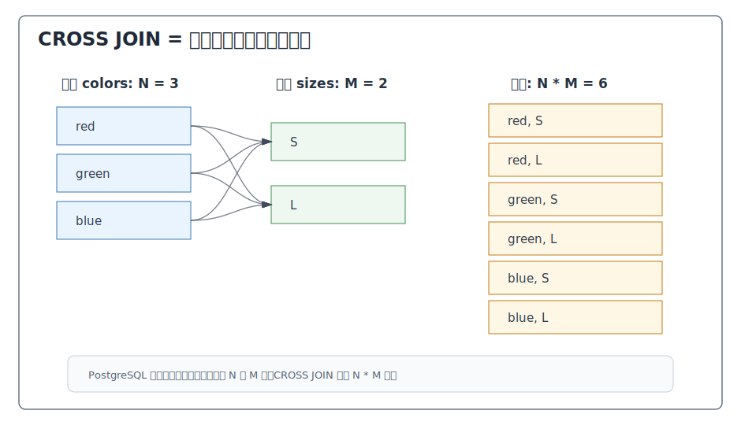
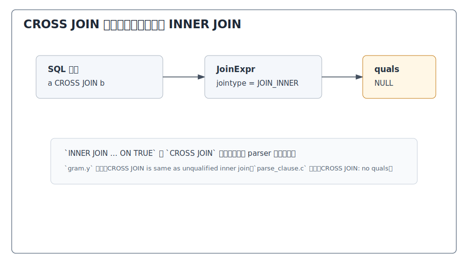
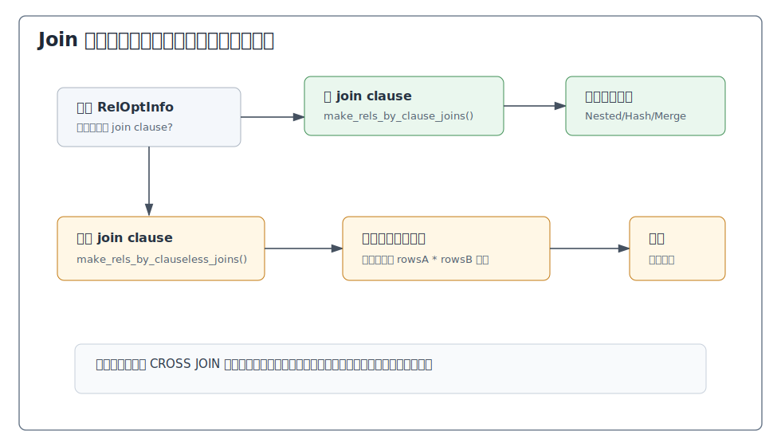
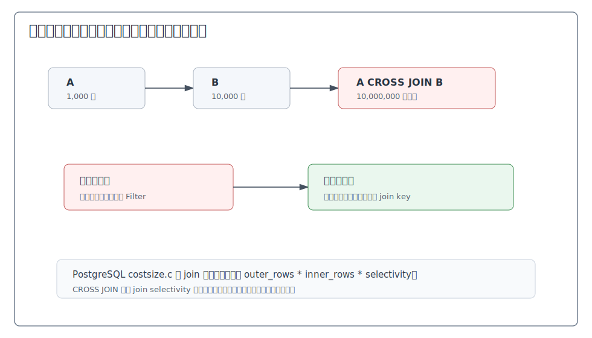
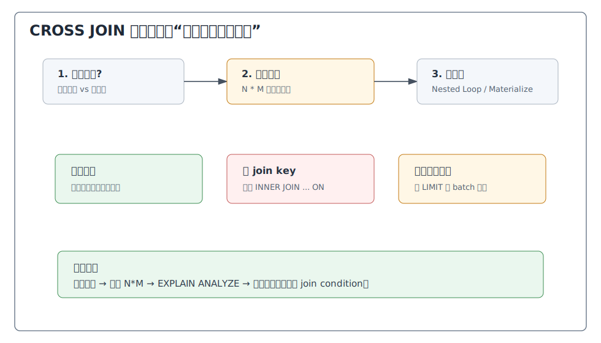

## 数据库筑基课 - cross join

### 作者
digoal

### 日期
2026-05-30

### 标签
PostgreSQL , 应用开发者 , 数据库筑基课 , 执行算法 , 优化器 , Join , Cross Join

----

## 背景


数据库筑基课大纲在当前项目中未找到可引用文件，因此本文按“扫描/执行算法”独立成篇。本文以 PostgreSQL 本地源码、官方文档、项目参考文件 `postgres/CLAUDE.md` 和 DeepWiki 对 `postgres/postgres` 的 Query Planner and JOIN Optimization 导览为参考；关键机制以官方文档和本地源码为准。

`CROSS JOIN` 是 SQL 里最简单、也最危险的 join：它不按 key 匹配，不补 NULL，只做笛卡尔积。两张表分别有 N 行和 M 行，结果就是 N * M 行。

它有正当用途：

1. 生成所有规格组合：颜色 * 尺码 * 地区。
2. 生成时间网格：日期序列 * 门店清单。
3. 压测或构造测试数据。
4. 把少量参数表与事实查询组合，形成完整维度空间。

它也经常是事故来源：

1. 忘写 join condition。
2. 把过滤条件写晚，先生成巨大候选集再过滤。
3. 误以为优化器会自动发现业务 key。
4. 多表逗号写法和显式 `JOIN` 混用，导致绑定顺序误判。

本文把 cross join 当作“无条件 inner join + 乘法基数放大”的执行算子来讲。重点不是“不要用”，而是明确什么时候该用、什么时候是 bug、怎么在 PostgreSQL 里识别和控制它。

## 一、它解决什么问题？

假设电商系统需要生成 SKU 候选：

```sql
SELECT c.color, s.size
FROM colors c
CROSS JOIN sizes s;
```

如果 `colors` 有 3 行，`sizes` 有 4 行，结果是 12 个组合。这个场景里 cross join 是正确的：业务问题本来就是“所有组合”。

再看一个危险场景：

```sql
SELECT *
FROM orders o
CROSS JOIN customers c
WHERE c.region = 'CN';
```

如果本意是“订单关联客户，再筛选 CN 客户”，这条 SQL 漏了 `o.customer_id = c.customer_id`。数据库会先面对订单和客户的所有组合，再应用 `c.region = 'CN'`。即使最后过滤掉很多行，中间候选规模仍可能爆炸。

Cross join 解决的是“组合生成”问题；它牺牲的是选择性。没有 join condition，就没有基于 key 的匹配过滤，也没有 hash/merge join key 可以利用。所有成本都从乘法基数开始。

## 二、它是什么？

PostgreSQL 官方文档定义 `CROSS JOIN`：对 T1 与 T2 的每个可能行组合，输出一行，包含 T1 的所有列后跟 T2 的所有列。如果两表分别有 N 和 M 行，结果有 N * M 行。

官方文档还明确说明：

```sql
FROM T1 CROSS JOIN T2
```

等价于：

```sql
FROM T1 INNER JOIN T2 ON TRUE
```

也等价于两表在顶层 `FROM` 列表中并列：

```sql
FROM T1, T2
```

但多表时，逗号写法和显式 `JOIN` 的绑定顺序并不总是完全等价，因为 `JOIN` 绑定比逗号更紧。



图 1 说明：Cross join 没有“匹配失败”概念。每个左行都和每个右行组合，输出行数是输入行数的乘积。只要输入规模稍大，结果就会快速膨胀。

在 PostgreSQL 内部，cross join 经过这些层次：

| 层次 | 关键结构或函数 | 和 cross join 相关的作用 |
|---|---|---|
| SQL 语义 | `CROSS JOIN` / `INNER JOIN ON TRUE` | 定义无条件笛卡尔积 |
| Parser | `gram.y` | `CROSS JOIN` 生成 `JoinExpr`，`jointype = JOIN_INNER` |
| Parse transform | `parse_clause.c` | `CROSS JOIN: no quals`，没有 ON 条件 |
| Join 搜索 | `standard_join_search()` / `join_search_one_level()` | 有 join clause 优先，无 join clause 时生成 clauseless join |
| 路径生成 | `joinrels.c` / `joinpath.c` | 为无条件 join 生成可行路径，常见是 Nested Loop |
| 成本估算 | `costsize.c` | 基线是 `outer_rows * inner_rows * selectivity` |
| 执行器 | Join 节点 | 不做补 NULL，只输出所有组合并应用后续 filter |

## 三、核心原理

### 3.1 语义层：CROSS JOIN 是无条件组合

Cross join 没有 `ON` 子句：

```sql
SELECT *
FROM a
CROSS JOIN b;
```

等价于：

```sql
SELECT *
FROM a
INNER JOIN b ON TRUE;
```

这意味着：

1. 不会因为 key 不相等而删除行。
2. 不会像 outer join 那样补 NULL。
3. 结果只取决于左右输入行数。
4. 后续 `WHERE` 只是对已经形成的组合继续过滤。

如果你需要的是业务匹配，应写：

```sql
SELECT *
FROM orders o
JOIN customers c ON c.customer_id = o.customer_id;
```

而不是：

```sql
SELECT *
FROM orders o
CROSS JOIN customers c
WHERE c.customer_id = o.customer_id;
```

这两者在 inner join 语义上通常等价，但显式 `JOIN ... ON` 更能表达意图，也更容易被代码审查发现漏条件。

### 3.2 Parser：CROSS JOIN 是 `JOIN_INNER` 且没有 quals

PostgreSQL `gram.y` 注释说明：`CROSS JOIN` 和 unqualified inner join 相同；`INNER JOIN/ON` 形状相同但有 qualification expression 限制成员。

在 `joined_table` 规则中：

```text
table_ref CROSS JOIN table_ref
```

会创建 `JoinExpr`，并设置：

```text
jointype = JOIN_INNER
isNatural = false
larg = left table
rarg = right table
quals = NULL
```

`parse_clause.c` 对没有 `ON`、`USING`、`NATURAL` 的情况直接注释为 `CROSS JOIN: no quals`。



图 2 说明：Cross join 不是新的物理算法。它进入后续优化器时，本质是没有 join quals 的 inner join。这个事实解释了为什么 `EXPLAIN` 中通常不会看到一个叫 “Cross Join” 的独立节点，而是看到 Nested Loop、Hash Join、Merge Join 或其他 join 节点形态。

### 3.3 优化器：有 join clause 优先，clauseless join 被推迟

PostgreSQL 优化器 README 说明，标准 planner 会优先考虑那些存在可用 join clause 的关系对；如果某个 `RelOptInfo` 没有 join clause，就只能生成 clauseless Cartesian-product join。

README 的 join 搜索流程也提到：

```text
standard_join_search()
  join_search_one_level()
    make_rels_by_clause_joins()       -- 有 join clauses
    make_rels_by_clauseless_joins()   -- 没有 join clauses
```



图 3 说明：优化器不是不知道笛卡尔积危险；它会尽量先用有条件的 join 降低规模。但如果 SQL 语义就是无条件组合，或者 join order 限制迫使必须无条件连接，优化器只能为笛卡尔积选择相对便宜的路径，不能凭空发明业务条件。

### 3.4 成本模型：行数乘法是根本代价

`costsize.c` 在估算 join 行数时说明：基本上是把笛卡尔积大小乘以选择率。对 inner join：

```text
nrows = outer_rows * inner_rows * fkselec * jselec
```

Cross join 没有有效 join condition，`jselec` 不能提供 key 选择性。因此基线就是乘法放大。



图 4 说明：1,000 行和 10,000 行 cross join，会产生 10,000,000 个候选组合。后面即使有 `WHERE` 过滤，也要看过滤是否能被提前下推到输入侧。如果过滤只能在组合后执行，CPU、内存、排序、网络返回都会被放大。

### 3.5 执行器：常见是 Nested Loop，但语义不是算法

Cross join 的物理实现常见是 Nested Loop：外侧每读一行，内侧扫描一遍，输出组合。小表内侧可能被 Materialize，避免重复真实扫描。

但不要把 cross join 等同于 Nested Loop。它是逻辑语义；物理计划取决于 PostgreSQL 认为的成本和可用路径。由于没有等值 join key，Hash Join 和 Merge Join 通常缺少可用条件；所以在实践中，clauseless cross join 很容易落成 Nested Loop + Materialize。

EXPLAIN 中可能看到类似形态：

```text
Nested Loop
  -> Seq Scan on colors
  -> Materialize
       -> Seq Scan on sizes
```

这不是执行器“出错”，而是 cross join 的自然数据流。

### 3.6 逗号 FROM、CROSS JOIN、JOIN 绑定顺序

PostgreSQL 文档说明：

```sql
FROM T1 CROSS JOIN T2
```

和：

```sql
FROM T1, T2
```

在两表时等价。但多表时不完全等价，因为 `JOIN` 绑定比逗号更紧。

例如：

```sql
FROM t1 CROSS JOIN t2 INNER JOIN t3 ON condition
```

不同于：

```sql
FROM t1, t2 INNER JOIN t3 ON condition
```

后者的 `condition` 不能以同样方式引用 `t1`，因为 `t2 INNER JOIN t3` 先绑定。生产 SQL 中，建议减少逗号 join，统一使用显式 `JOIN ... ON` 或显式 `CROSS JOIN`，让意图更可审查。

## 四、横向对比

| 维度 | CROSS JOIN | INNER JOIN | `FROM a, b` | `LATERAL` + CROSS JOIN | 生成序列表 |
|---|---|---|---|---|---|
| 主要目标 | 生成所有组合 | 按条件匹配行对 | 旧式无条件 FROM 列表 | 每行驱动右侧相关生成 | 构造时间/数字维度 |
| 是否有 join condition | 无 | 有或可为 `ON TRUE` | 无显式条件 | 右侧可引用左侧 | 通常作为输入 |
| 输出规模 | N * M | N * M * 选择率 | N * M | 取决于每行生成量 | 可控 |
| 可读性 | 明确表示笛卡尔积 | 明确表示匹配 | 容易漏条件 | 表达相关生成明确 | 适合作维表 |
| 优化器处理 | clauseless inner join | 有 join clause 优先 | 类似 cross join | 参数化路径 | 普通扫描输入 |
| 典型风险 | 结果爆炸 | 条件估算错误 | 漏 join 条件难发现 | 每行生成过多 | 维表过大 |
| 适合场景 | 小维度组合、测试数据 | 业务实体关联 | 少用 | 按行展开函数/子查询 | 日期、枚举、桶 |
| 不适合场景 | 大表无条件组合 | 无 | 生产复杂 SQL | 右侧昂贵且外侧大 | 高基数临时生成 |

Cross join 最重要的优势是“意图明确”：我就是要所有组合。逗号写法也能产生笛卡尔积，但不利于代码审查；`INNER JOIN ON TRUE` 语义等价，但不如 `CROSS JOIN` 直接表达组合生成。

## 五、效果如何？

收益：

1. **组合生成直接**：规格、维度、时间网格、参数矩阵都能自然表达。
2. **没有匹配语义歧义**：不会涉及 NULL 扩展、匹配失败、右侧保留等 outer join 问题。
3. **适合小维表**：几个小枚举表组合，结果可预测。
4. **便于测试数据构造**：可和 `generate_series()`、`VALUES` 组合快速扩充样本。

代价：

1. **乘法膨胀**：每增加一个输入，结果行数乘上该输入行数。
2. **缺少 join key 优化空间**：没有 hash/merge key，不能利用等值连接选择性。
3. **容易掩盖漏条件**：尤其是旧式逗号 FROM 或动态 SQL 拼接。
4. **后续算子被拖累**：排序、聚合、窗口、网络返回都处理放大后的结果。
5. **估算误差放大**：输入表行数估错，乘法后偏差更大。

不要伪造性能数字。评估实际 cross join 时，先手算 `N * M`，再看：

```sql
EXPLAIN (ANALYZE, BUFFERS)
SELECT ...
FROM ...
CROSS JOIN ...;
```

重点观察估算行数、实际行数、是否有 Materialize、是否有大 Sort/HashAggregate、是否有 `Rows Removed by Filter` 表示过滤发生得太晚。

## 六、实操 DEMO

以下 SQL 是最小可验证实验。本文未在本机启动 PostgreSQL 实例执行，因此不提供伪造输出；读者可直接在 PostgreSQL 中运行并观察结果和计划。

### 6.1 小维表组合

```sql
DROP TABLE IF EXISTS colors;
DROP TABLE IF EXISTS sizes;

CREATE TABLE colors (
  color text PRIMARY KEY
);

CREATE TABLE sizes (
  size text PRIMARY KEY
);

INSERT INTO colors(color) VALUES ('red'), ('green'), ('blue');
INSERT INTO sizes(size) VALUES ('S'), ('M'), ('L');

ANALYZE colors;
ANALYZE sizes;

SELECT c.color, s.size
FROM colors c
CROSS JOIN sizes s
ORDER BY c.color, s.size;
```

预期语义：3 个颜色 * 3 个尺码 = 9 行。

### 6.2 等价写法

```sql
SELECT c.color, s.size
FROM colors c
INNER JOIN sizes s ON TRUE
ORDER BY c.color, s.size;
```

这与 cross join 语义等价，但可读性不如 `CROSS JOIN` 直接。

```sql
SELECT c.color, s.size
FROM colors c, sizes s
ORDER BY c.color, s.size;
```

两表场景下也等价，但复杂 SQL 不推荐逗号 join。

### 6.3 时间网格

```sql
SELECT d::date AS day, s.size
FROM generate_series(date '2026-01-01', date '2026-01-07', interval '1 day') AS g(d)
CROSS JOIN sizes s
ORDER BY day, s.size;
```

预期语义：7 天 * 3 个尺码 = 21 行。这个场景里 cross join 是有意生成完整网格。

### 6.4 漏条件示例

```sql
-- 高风险：如果 orders 和 customers 都很大，会生成巨大候选组合
SELECT o.order_id, c.customer_id
FROM orders o
CROSS JOIN customers c
WHERE c.region = 'CN';
```

如果业务目标是订单关联客户，应写：

```sql
SELECT o.order_id, c.customer_id
FROM orders o
JOIN customers c ON c.customer_id = o.customer_id
WHERE c.region = 'CN';
```

### 6.5 观察计划

```sql
EXPLAIN (ANALYZE, BUFFERS)
SELECT c.color, s.size
FROM colors c
CROSS JOIN sizes s;
```

常见计划可能是 `Nested Loop`，内侧小表可能出现 `Materialize`。这说明执行器在重复使用小输入，不说明 SQL 有匹配条件。

## 七、最佳实践

### 面向数据库架构师

1. **把 cross join 作为显式建模工具**：只在业务确实需要完整组合空间时使用。
2. **控制维度基数**：颜色、尺码、日期、参数桶这类维度应有清晰上限。
3. **先过滤再组合**：把日期范围、租户、状态等限制尽量放到输入子查询里。
4. **大规模组合要分批** ：按日期、租户、业务线拆分，避免一次性 N\*M 进入后续算子。

### 面向 DBA

1. **看到巨大 Nested Loop 先查是否漏 join condition**：特别是两个大表之间没有 Join Filter、Hash Cond、Merge Cond。
2. **用行数乘法做第一判断**：估算输入行数相乘是否已经超过可接受范围。
3. **关注 Materialize 和 temp I/O**：内侧重复扫描、排序或聚合可能被放大。
4. **检查动态 SQL 生成器**：空条件列表拼接时，容易从 inner join 退化成 cross join。
5. **不要用 enable_*join 修语义问题**：漏条件必须改 SQL，不是调 planner 开关。

### 面向业务开发者

1. **有匹配关系就写 `JOIN ... ON`**：不要把业务 key 放到 `WHERE` 里让读者猜。
2. **有意笛卡尔积才写 `CROSS JOIN`**：这能让代码审查更容易发现风险。
3. **避免逗号 join**：旧式写法不利于识别漏条件。
4. **给 cross join 加注释或封装输入**：尤其是生成完整网格时，明确预期行数。
5. **测试边界规模** ：小数据没问题，不代表生产 N\*M 可接受。



图 5 说明：Cross join 排障第一步不是看索引，而是确认意图。如果是有意组合，控制输入规模；如果是漏条件，直接补 join condition；如果是生成测试数据，用 LIMIT、分批和明确上限保护环境。

## 八、适合与不适合场景

适合：

1. **小维度组合**：颜色 * 尺码、渠道 * 状态、参数矩阵。
2. **时间网格补齐**：日期序列 * 门店、日期序列 * 产品。
3. **测试数据构造**：少量基础行快速扩展。
4. **完整枚举空间**：需要找“哪些组合没有事实数据”时，先 cross join 生成空间，再 left join 事实表。
5. **LATERAL 展开**：每行驱动一个函数或子查询生成相关集合。

不适合：

1. **两个大事实表无条件组合**。
2. **本来有业务 key 的实体关联**。
3. **动态 SQL 条件可能为空但未做保护**。
4. **结果还要全量排序、窗口、去重**。
5. **对行数不可预估的用户输入做组合生成**。

## 九、常见坑

1. **忘写 join condition**  
   `orders CROSS JOIN customers` 很可能是 bug。业务实体关联应使用 `JOIN ... ON`。

2. **用逗号 FROM 隐藏笛卡尔积**  
   `FROM a, b, c WHERE ...` 少一个条件就可能爆炸。生产 SQL 优先显式 join。

3. **过滤写晚**  
   如果能先过滤 `customers.region = 'CN'`，就不要先 cross join 全客户再过滤。

4. **误读 EXPLAIN**  
   看到 `Nested Loop` 不一定是普通 key join；如果没有 Join Filter、Hash Cond、Merge Cond，要检查是否是 clauseless join。

5. **多表绑定顺序误判**  
   `JOIN` 比逗号绑定更紧。混用时，`ON` 可引用的表范围和直觉可能不同。

6. **生成维度没有上限**  
   `generate_series()` 与大表 cross join 很容易生成巨大网格。必须设置日期范围、租户范围、LIMIT 或分批。

7. **NATURAL JOIN 无共同列时退化成 CROSS JOIN**  
   PostgreSQL 文档说明，没有共同列时 `NATURAL JOIN` 等价于 `ON TRUE`。这类 SQL 不适合生产。

8. **把 cross join 当性能技巧**  
   Cross join 是语义，不是优化提示。优化器不能替你从业务上减少组合数量。

9. **忽略后续算子成本**  
   即使 cross join 本身能跑完，后面的 `ORDER BY`、`DISTINCT`、`GROUP BY` 可能成为瓶颈。

10. **没有写预期行数**  
    对有意 cross join 的代码，建议在注释、任务说明或测试中写明预期 N\*M，方便审查。

## 十、扩展问题

1. 为什么 PostgreSQL parser 把 `CROSS JOIN` 表示为 `JOIN_INNER` 而不是单独 join type？
2. `CROSS JOIN`、`INNER JOIN ON TRUE`、逗号 FROM 在三表以上时有哪些绑定差异？
3. 什么时候优化器会被迫生成 clauseless Cartesian-product join？
4. 为什么 `NATURAL JOIN` 没有共同列时会退化成 `ON TRUE`？
5. 生成完整日期 * 维度网格后，如何用 left join 找缺失事实？
6. 对大规模组合生成，什么时候应该落临时表或物化中间结果？

## 十一、扩展阅读

1. PostgreSQL 官方文档：`doc/src/sgml/queries.sgml`，Table Expressions / Cross Join，说明 cross join 的 N * M 行数、与 `INNER JOIN ON TRUE` 和逗号 FROM 的等价关系，以及多表绑定差异。
2. PostgreSQL 官方文档：`doc/src/sgml/ref/select.sgml`，`SELECT` 语法中对 `CROSS JOIN` 的定义，说明它等价于 `INNER JOIN ON TRUE`。
3. PostgreSQL 官方文档：`doc/src/sgml/perform.sgml`，Controlling the Planner with Explicit JOIN Clauses，说明无可用条件时可能形成完整 Cartesian product。
4. PostgreSQL 源码：`src/backend/parser/gram.y`，`CROSS JOIN` 解析为 `JoinExpr` 且 `jointype = JOIN_INNER`。
5. PostgreSQL 源码：`src/backend/parser/parse_clause.c`，`CROSS JOIN: no quals` 的 parse transform 逻辑。
6. PostgreSQL 源码：`src/backend/optimizer/README`，说明 planner 优先使用 join clauses，缺少 join clauses 时生成 clauseless Cartesian-product join。
7. PostgreSQL 源码：`src/backend/optimizer/path/allpaths.c`，`make_rel_from_joinlist()`、`standard_join_search()`、`join_search_one_level()` 的 join 搜索流程。
8. PostgreSQL 源码：`src/backend/optimizer/path/joinrels.c`，`make_rels_by_clauseless_joins()` 和 `has_legal_joinclause()` 相关逻辑。
9. PostgreSQL 源码：`src/backend/optimizer/path/costsize.c`，join 行数估算中笛卡尔积乘以选择率的基线。
10. PostgreSQL 源码：`src/backend/commands/explain.c`，EXPLAIN 中 Join Filter、Hash Cond、Merge Cond 的展示逻辑，可用于识别是否缺少 join 条件。
11. DeepWiki：`postgres/postgres` 的 Query Planner and JOIN Optimization 页面，用作 PostgreSQL 优化器模块导览；本文关键结论已回到本地源码和官方文档核对。
  
## 附录 
1、克隆代码  
```  
git clone --depth 1 https://github.com/postgres/postgres
```  
  
2、启用 codex, 使用 [数据库筑基课 skill](../skills/README.md).  
```
文章标题: 
  数据库筑基课 - cross join
项目源码(已克隆到当前项目如下目录中):  
  postgres
项目 deepwiki reponame:  
  postgres/postgres
项目参考信息: 
  postgres/CLAUDE.md
```
  
  
#### [PostgreSQL 解决方案集合](../201706/20170601_02.md "40cff096e9ed7122c512b35d8561d9c8")
  
  
#### [德哥 / digoal's Github - 公益是一辈子的事.](https://github.com/digoal/blog/blob/master/README.md "22709685feb7cab07d30f30387f0a9ae")
  
  
#### [About 德哥](https://github.com/digoal/blog/blob/master/me/readme.md "a37735981e7704886ffd590565582dd0")
  
  

  
