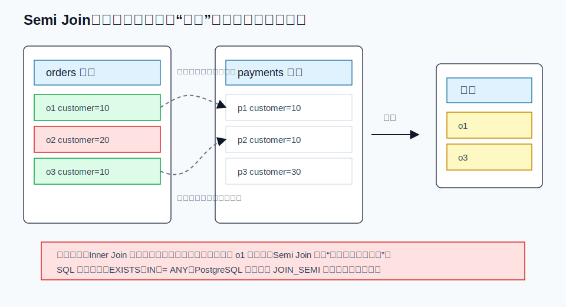
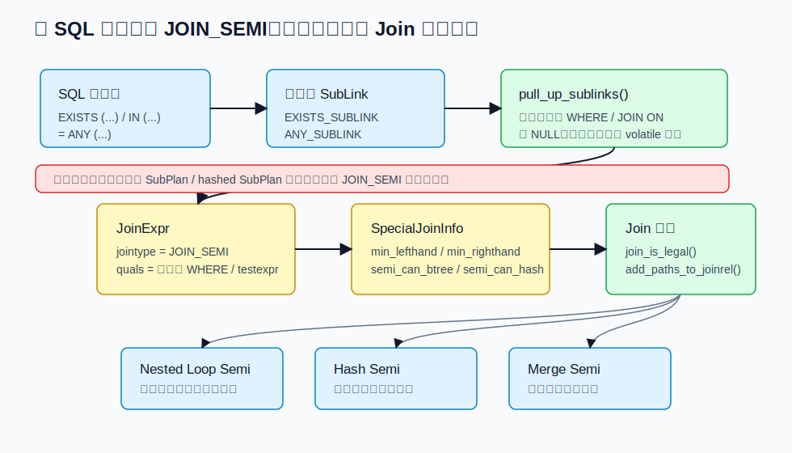
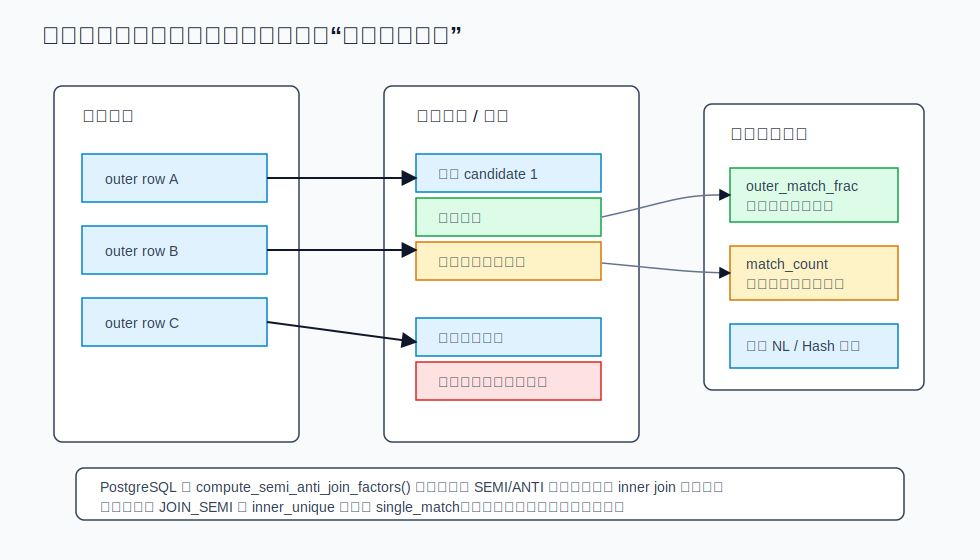
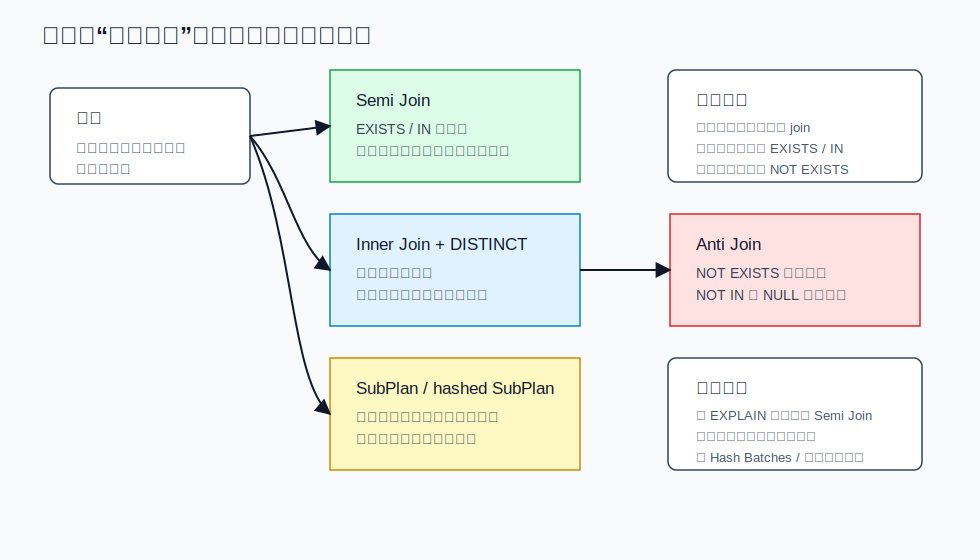

## 数据库筑基课 - Semi Join

### 作者
digoal

### 日期
2026-05-30

### 标签
PostgreSQL , 应用开发者 , 数据库筑基课 , 执行算法 , 优化器 , Join , Semi Join

----

## 背景
  
  

数据库筑基课大纲在当前项目中未找到可引用文件，因此本文按“扫描/执行算法”独立成篇。本文以 PostgreSQL 本地源码、官方文档、项目参考文件 `postgres/CLAUDE.md` 为主。用户提供的 DeepWiki 仓库名为 `postgres/postgres`，但本地 DeepWiki CLI 查询返回错误，本文没有把未校验的 DeepWiki 内容作为事实依据。

业务 SQL 里经常出现这样的需求：

```sql
-- 找出至少有一笔成功支付的订单，只需要订单本身
SELECT o.*
FROM orders o
WHERE EXISTS (
  SELECT 1
  FROM payments p
  WHERE p.order_id = o.order_id
    AND p.status = 'success'
);
```

很多人会下意识把它改写成普通 join：

```sql
SELECT DISTINCT o.*
FROM orders o
JOIN payments p
  ON p.order_id = o.order_id
 AND p.status = 'success';
```

这两个写法在某些数据上结果相同，但它们表达的算子不同。`INNER JOIN` 关心“所有匹配行对”，右表一条订单匹配 3 笔支付就会产生 3 个行对；`SEMI JOIN` 只关心“右表是否至少存在一条匹配”，找到第一条就足够，结果也只输出左表行。

这就是 Semi Join 的价值：它把“用另一张表过滤当前表”的意图直接交给优化器，避免右表重复行放大结果，也给执行器留下“首个匹配即停止”的空间。

## 一、它解决什么问题？

Semi Join 解决的是“存在性过滤”问题：

```text
保留左表中那些在右表能找到至少一个匹配的行。
```

典型业务场景包括：

1. 找出有订单的用户。
2. 找出被某个标签命中过的商品。
3. 找出至少有一条失败日志的任务。
4. 找出存在权限记录的资源。
5. 找出在明细表中出现过的主表记录。

如果用普通 join 表达这些需求，会引出三个工程问题：

1. **重复放大**：右表多个匹配会复制左表行，业务还要再 `DISTINCT` 或聚合去重。
2. **无用列传递**：需求只要左表列，却让右表参与了输出行对构造。
3. **执行代价放大**：已经证明存在后，还继续扫描同一个外侧行的更多内侧匹配，可能浪费 CPU、I/O、内存和临时文件。

Semi Join 的牺牲也很明确：它不返回右表列，也不告诉你匹配了哪一条右表记录。如果业务需要支付流水号、最近一次支付时间、匹配数量或右表字段，就不能只用 Semi Join，需要普通 join、聚合、窗口函数或 `LATERAL ... LIMIT 1` 等写法。

## 二、它是什么？

Semi Join 是关系代数中的半连接。PostgreSQL 源码 `src/include/nodes/nodes.h` 对 `JOIN_SEMI` 的注释是：输出每个有匹配的左侧行的一份副本。它还特别说明，Semi Join 和 Anti Join 不出现在 SQL 的 `JOIN` 语法里，但可以通过 `EXISTS` 等标准写法表达，优化器会识别并转换。

形式化一点：

```text
A SEMI JOIN B ON predicate =
  { a | a 属于 A，并且存在 b 属于 B，使 predicate(a, b) 为 true }
```

三个关键词：

1. **只输出左侧行**：右侧只参与判断，不参与结果列。
2. **至少一条匹配**：右侧重复匹配不会增加输出行数。
3. **三值逻辑仍然存在**：`IN`、`ANY`、`NOT IN` 遇到 NULL 时不能简单按二值逻辑理解。



图 1 说明：`orders` 中 `customer=10` 的两行都能在 `payments` 中找到匹配，因此输出；`customer=20` 找不到匹配，因此丢弃。`payments` 中 `customer=10` 有两条记录，但 Semi Join 不会把 `orders` 行复制成两份。

PostgreSQL 中 Semi Join 的常见 SQL 入口是：

```sql
-- EXISTS
SELECT *
FROM a
WHERE EXISTS (SELECT 1 FROM b WHERE b.k = a.k);

-- IN，解析/分析后属于 ANY_SUBLINK 的典型形式
SELECT *
FROM a
WHERE a.k IN (SELECT b.k FROM b);

-- = ANY
SELECT *
FROM a
WHERE a.k = ANY (SELECT b.k FROM b);
```

官方文档 `doc/src/sgml/func/func-subquery.sgml` 明确说明：

1. `EXISTS` 的结果只取决于子查询是否返回至少一行。
2. `IN` 等价于 `= ANY`。
3. `ANY` 只要任意一行比较为 true 就为 true。
4. `IN` 和 `ANY` 在无匹配但存在 NULL 比较结果时可能返回 NULL，而不是 false。

## 三、核心原理

### 3.1 语义入口：SubLink 先表达 SQL 子查询

PostgreSQL 解析/分析后会用 `SubLink` 表达子查询表达式。`src/include/nodes/primnodes.h` 中的 `SubLinkType` 包括：

| SubLink 类型 | SQL 形态 | 与 Semi Join 的关系 |
|---|---|---|
| `EXISTS_SUBLINK` | `EXISTS (SELECT ...)` | 典型 Semi Join 入口 |
| `ANY_SUBLINK` | `x op ANY (SELECT ...)`，`IN` 是 `= ANY` | 常见 Semi Join 入口 |
| `ALL_SUBLINK` | `x op ALL (SELECT ...)` | 通常不是 Semi Join |
| `EXPR_SUBLINK` | 标量子查询 | 要求最多一行，不是 Semi Join |
| `ARRAY_SUBLINK` | `ARRAY(SELECT ...)` | 构造数组，不是 Semi Join |

在执行器层面，如果子查询没有被拉平成 join，`src/backend/executor/nodeSubplan.c` 会按 SubPlan 求值：`EXISTS_SUBLINK` 找到第一行就返回 true；`ANY_SUBLINK` 按 OR 语义合并每一行比较结果，遇到 true 也可以提前停止。这说明“存在性”本来就是 SQL 语义的一部分，不是优化器凭空发明的技巧。

### 3.2 拉平条件：不是所有 EXISTS / IN 都能变成 Semi Join

优化器预处理阶段的关键入口是 `pull_up_sublinks()`，源码在 `src/backend/optimizer/prep/prepjointree.c`。注释说明它会尝试把顶层 `ANY` 和 `EXISTS` SubLink 拉到 jointree 中，作为 Semi Join 或 Anti Join 处理。

这里的“顶层”很重要。PostgreSQL 只在 `WHERE` 或 `JOIN/ON` 的顶层 AND 条件中做这类转换，因为嵌在复杂表达式内部时，NULL 到底应该传播成 false 还是 unknown 可能影响结果。外连接的 `ON` 条件也有限制：只有不破坏外连接 nullable 侧语义时才能下推。

`convert_ANY_sublink_to_join()` 位于 `src/backend/optimizer/plan/subselect.c`，它会检查：

1. 子查询引用的外层变量是否都在当前可安全引用的关系集合里。
2. 左侧测试表达式必须引用外层查询，否则不是 join。
3. 组合操作符和左侧表达式不能包含 volatile 函数。
4. `NOT IN` 默认不能随便转成 Anti Join，除非能证明外侧表达式和子查询输出都不可能为 NULL，并且操作符不会对非 NULL 输入返回 NULL。

`convert_EXISTS_sublink_to_join()` 也在同一文件中，它会检查：

1. 子查询不能含 `WITH`，否则拉到父查询可能改变执行一次还是多次的语义。
2. `simplify_EXISTS_query()` 必须能简化子查询，因为 `EXISTS` 不需要 target list。
3. 子查询主体不能还引用父查询变量，关联条件应集中在 WHERE 子句里。
4. WHERE 子句必须引用父查询变量，否则不是 join。
5. WHERE 子句不能包含 volatile 函数。



图 2 说明：`EXISTS`、`IN`、`= ANY` 先进入 `SubLink` 表达。只有满足安全条件时，`pull_up_sublinks()` 才会把它变成 `JoinExpr`，并设置 `jointype = JOIN_SEMI`。不能拉平时，查询仍可能以 `SubPlan` 或 `hashed SubPlan` 执行。

### 3.3 SpecialJoinInfo：Semi Join 会约束 join order

普通 inner join 可以较自由地交换和重排。Semi Join 不一样，因为右侧只用于过滤左侧，右侧输出列不能被上层引用。PostgreSQL 优化器 README 在 “Valid OUTER JOIN Optimizations” 部分说明：

1. Semi Join 可以被重关联到另一个 Semi Join、Left Join 或 Anti Join 的左侧，或从这些 join 的左侧移出。
2. Semi Join 不能随意重关联到右侧，或从右侧移出。
3. 如果查询中有 `IN` 或 `EXISTS` 被转换成 Semi Join，某些 join order 会非法，`join_is_legal` 会通过 special join 列表排除它们。

这些约束记录在 `SpecialJoinInfo` 里。`src/include/nodes/pathnodes.h` 说明：外连接、Semi Join、Anti Join 都会在 `PlannerInfo.join_info_list` 中保留 `SpecialJoinInfo`，用于描述两侧最小关系集合、join 类型，以及 Semi Join 右侧去重所需的操作符信息。

Semi Join 特有字段包括：

| 字段 | 含义 |
|---|---|
| `semi_can_btree` | 右侧是否能通过 btree/sort 方式去重 |
| `semi_can_hash` | 右侧是否能通过 hash 方式去重 |
| `semi_operators` | 可用于判断相等和去重的操作符 |
| `semi_rhs_exprs` | 右侧用于去重的表达式 |

这些字段不是装饰信息。`src/backend/optimizer/path/joinrels.c` 中，Semi Join 除了直接生成 `JOIN_SEMI` 路径，还可能在条件允许时把右侧先 unique-ify，再按普通 inner join 做。`src/backend/optimizer/plan/analyzejoins.c` 的 `reduce_unique_semijoins()` 还会检查右侧是否已能被证明对 join 条件唯一；如果能证明，Semi Join 的特殊约束可以被简化成普通 inner join。

### 3.4 路径生成：同一个 Semi Join 可以落成多种物理算法

Semi Join 是逻辑算子，不等于某一种执行算法。PostgreSQL 的回归测试预期文件中可以看到 `Hash Semi Join`、`Nested Loop Semi Join`、`Merge Semi Join`、`Hash Right Semi Join`、`Parallel Hash Semi Join` 等计划形态。

常见物理选择如下：

| 物理形态 | 适合场景 | 主要风险 |
|---|---|---|
| Nested Loop Semi Join | 外侧行数少，内侧有合适索引或参数化路径 | 外侧行数低估会导致大量内侧探测 |
| Hash Semi Join | 批量等值存在性过滤，内侧可构建 hash table | build 侧过大可能 batch 或写临时文件 |
| Merge Semi Join | 两侧已有顺序，或排序代价可接受 | 重复 key、多余排序和行数估算错误会放大成本 |
| Hash Right Semi Join | 优化器认为交换构建/探测方向更合适 | 读计划时要确认哪一侧是真正被保留的一侧 |

`src/backend/optimizer/path/joinpath.c` 会把 `JOIN_SEMI` 和 `JOIN_ANTI` 交给 join path 生成逻辑，并调用 `compute_semi_anti_join_factors()` 准备成本修正因子。`src/backend/optimizer/path/joinrels.c` 则负责判断当前关系组合是否能形成 Semi Join，或是否可以先 unique-ify RHS 后转为普通 join。

### 3.5 执行器：首个匹配即停止

Semi Join 最关键的执行特征是：对每个外侧行，只要找到第一个满足 join 条件的内侧行，就可以输出外侧行并进入下一个外侧行。

`src/backend/executor/nodeHashjoin.c` 和 `src/backend/executor/nodeMergejoin.c` 都会根据 `node->join.jointype == JOIN_SEMI` 或 `inner_unique` 设置 `single_match`。注释说明：如果只需要考虑第一条匹配内侧 tuple，就在处理完后推进到下一个外侧 tuple。



图 3 说明：Semi Join 的成本不是普通 inner join 成本简单套壳。执行器可能提前停止内侧扫描，所以优化器要估算两个量：有多少外侧行会命中，以及命中时平均会有多少匹配。

`src/backend/optimizer/path/costsize.c` 的 `compute_semi_anti_join_factors()` 正是为此服务：

1. 先用 `JOIN_SEMI` 或 `JOIN_ANTI` 语义估算 `jselec`，可理解为外侧行中至少有一个匹配的比例。
2. 再用普通 `JOIN_INNER` 语义估算 `nselec`，可理解为笛卡尔积中匹配行对的比例。
3. 用 `nselec * inner_rows / jselec` 估算“有匹配的外侧行平均有多少匹配”。
4. 把结果写入 `SemiAntiJoinFactors.outer_match_frac` 和 `match_count`，供 Nested Loop、Hash Join 等成本函数使用。

这也是为什么统计信息对 Semi Join 很敏感。右侧 distinct 值、MCV、NULL 比例、过滤条件选择率、相关性都会影响“是否命中”和“命中多少”的估计。

## 四、横向对比



图 4 说明：Semi Join、Inner Join 加 `DISTINCT`、SubPlan、Anti Join 都可能被开发者用来表达“用另一张表筛选当前表”，但它们的语义、NULL 行为和优化空间不同。不要只看结果是否刚好一致，要看业务到底需要“存在性”还是“匹配行对”。

| 维度 | Semi Join | Inner Join | Inner Join + DISTINCT | SubPlan / hashed SubPlan | Anti Join |
|---|---|---|---|---|---|
| 主要目标 | 保留有匹配的左侧行 | 输出所有匹配行对 | 用 join 模拟存在性再去重 | 在表达式中求子查询布尔值 | 保留无匹配的左侧行 |
| 右侧列是否输出 | 否 | 是 | 通常否，但执行中已参与行对 | 否，除非表达式需要 | 否 |
| 右侧重复是否放大结果 | 不放大 | 放大 | 先放大再去重 | 不直接放大左侧输出 | 不放大 |
| 可提前停止 | 可以，找到首个匹配即可 | 通常不可以，需输出全部匹配 | join 阶段通常不可以 | EXISTS / ANY 可按语义提前停止 | 找到匹配即可丢弃该外侧行 |
| NULL 风险 | `EXISTS` 简单；`IN/ANY` 受三值逻辑影响 | 由 join 条件决定 | 同 inner join | 由 SubLink 类型决定 | `NOT EXISTS` 简单；`NOT IN` 风险大 |
| 优化器空间 | 可进入 join order 搜索，但受 RHS 边界约束 | 搜索最自由 | 多了去重代价 | 可能脱离 join 搜索 | 类似 special join，重排受限 |
| 适合场景 | 只问右侧是否存在 | 需要右侧列或所有匹配 | 兼容旧写法但通常不首选 | 子查询不能安全拉平 | 否定存在性过滤 |

核心判断很简单：

1. **只要左表行，并且右侧只用于证明存在**：优先写 `EXISTS` 或可读性好的 `IN`。
2. **需要右表列、匹配数量、最近一条明细**：不要用 Semi Join，改用普通 join、聚合或 `LATERAL`。
3. **否定存在**：优先写 `NOT EXISTS`，谨慎使用 `NOT IN`，除非能证明两侧都不含 NULL。
4. **右表重复很多**：Semi Join 或先去重后的 join 可能明显减少中间结果。

## 五、效果如何？

Semi Join 的收益主要来自四个方面：

1. **结果规模受左表上限约束**：输出最多是左侧输入行数，不会被右侧重复匹配放大。
2. **执行可短路**：Nested Loop、Hash、Merge 的 Semi Join 都有机会在首个匹配后停止当前外侧行的内侧匹配扫描。
3. **减少无意义投影**：右侧列不会进入上层结果，减少 tuple 变宽和上层算子负担。
4. **保留优化器选择空间**：能拉平成 `JOIN_SEMI` 时，优化器可以在多表 join order、索引路径、Hash/Merge/Nested Loop 之间选择。

代价也必须同时看：

1. **拉平不保证发生**：复杂表达式、volatile 函数、外连接边界、NULL 语义、CTE 等都可能让子查询留在 SubPlan 形态。
2. **join order 受限制**：Semi Join 的 RHS 不能像 inner join 那样任意重排。
3. **估算难度更高**：优化器既要估“有无匹配”，又要估“匹配数”，错误统计会导致错误物理算法。
4. **`IN`/`NOT IN` 的 NULL 行为容易误判**：尤其 `NOT IN`，只要右侧有 NULL，就可能让结果不是开发者直觉中的 true。

不能脱离 workload 说 Semi Join 一定更快。它的优势通常出现在：右侧重复多、只需要左侧列、存在性条件选择率较高、内侧索引或 hash/merge 条件可利用时。若右侧很小且可一次 hash，SubPlan 也可能足够好；若需要右侧聚合信息，Semi Join 就不是正确算子。

## 六、实操 DEMO

下面的 SQL 是最小可验证实验。本文没有在本机启动 PostgreSQL 实例执行这些语句，因此不编造 `EXPLAIN` 输出；读者可以在自己的 PostgreSQL 环境中运行。

```sql
DROP TABLE IF EXISTS demo_orders;
DROP TABLE IF EXISTS demo_payments;

CREATE TABLE demo_orders (
  order_id bigint PRIMARY KEY,
  customer_id bigint NOT NULL,
  amount numeric NOT NULL
);

CREATE TABLE demo_payments (
  payment_id bigint PRIMARY KEY,
  order_id bigint,
  status text NOT NULL
);

INSERT INTO demo_orders VALUES
  (1, 10, 100),
  (2, 20, 200),
  (3, 30, 300);

INSERT INTO demo_payments VALUES
  (101, 1, 'success'),
  (102, 1, 'success'),
  (103, 2, 'failed'),
  (104, NULL, 'success');

ANALYZE demo_orders;
ANALYZE demo_payments;

-- 1. Semi Join 语义：订单 1 只输出一次，订单 2/3 不输出
EXPLAIN (ANALYZE, BUFFERS, COSTS OFF)
SELECT o.*
FROM demo_orders o
WHERE EXISTS (
  SELECT 1
  FROM demo_payments p
  WHERE p.order_id = o.order_id
    AND p.status = 'success'
);

-- 2. 普通 Inner Join：订单 1 因两条成功支付被放大成两行
EXPLAIN (ANALYZE, BUFFERS, COSTS OFF)
SELECT o.*
FROM demo_orders o
JOIN demo_payments p
  ON p.order_id = o.order_id
 AND p.status = 'success';

-- 3. IN 与 NULL：正向 IN 通常可表达存在性，但仍要理解三值逻辑
EXPLAIN (ANALYZE, BUFFERS, COSTS OFF)
SELECT o.*
FROM demo_orders o
WHERE o.order_id IN (
  SELECT p.order_id
  FROM demo_payments p
  WHERE p.status = 'success'
);

-- 4. NOT EXISTS 推荐用于否定存在：订单 2、3 没有成功支付
EXPLAIN (ANALYZE, BUFFERS, COSTS OFF)
SELECT o.*
FROM demo_orders o
WHERE NOT EXISTS (
  SELECT 1
  FROM demo_payments p
  WHERE p.order_id = o.order_id
    AND p.status = 'success'
);

-- 5. NOT IN 的 NULL 陷阱：右侧包含 NULL 时，结果可能不是你以为的“无匹配”
SELECT o.order_id
FROM demo_orders o
WHERE o.order_id NOT IN (
  SELECT p.order_id
  FROM demo_payments p
  WHERE p.status = 'success'
);
```

验证时重点看：

1. `EXPLAIN` 是否出现 `Hash Semi Join`、`Nested Loop Semi Join`、`Merge Semi Join` 或相关 Semi Join 形态。
2. `EXISTS` 查询是否只返回订单 1 一行，而普通 inner join 是否返回订单 1 两行。
3. `NOT EXISTS` 和 `NOT IN` 在右侧存在 NULL 时是否表现不同。
4. 建立 `CREATE INDEX ON demo_payments(order_id) WHERE status = 'success';` 后，计划是否更倾向 Nested Loop Semi Join 或参数化索引扫描。

## 七、最佳实践

面向数据库架构师：

1. 模型设计时区分“事实明细”和“存在性标签”。如果大量查询只判断存在，考虑为右侧过滤条件建立合适的复合索引或部分索引。
2. 对高重复右侧键保持 distinct 值统计准确。Semi Join 成本高度依赖右侧 distinct、MCV 和 NULL 分布。
3. 多表查询中避免把 Semi Join RHS 当成可任意重排的普通维表。它只用于过滤左侧，上层不能引用 RHS 输出。

面向 DBA：

1. 用 `EXPLAIN (ANALYZE, BUFFERS)` 比较估算行数和实际行数，尤其关注 Semi Join 的外侧行数估计。
2. Hash Semi Join 慢时检查 `Batches`、内存和临时文件；Nested Loop Semi Join 慢时检查外侧实际行数和内侧索引条件。
3. 定期 `ANALYZE`，必要时调高关键列统计目标，或使用扩展统计描述相关性。
4. 对 `NOT IN` 慢 SQL 和结果异常 SQL 优先检查右侧列是否可能为 NULL。

面向业务开发者：

1. 只判断存在时优先写 `EXISTS`。它最直接表达 Semi Join 意图，也避开 `IN` 在 NULL 上的部分认知负担。
2. 不要用 `JOIN + DISTINCT` 表达存在性，除非你已经证明优化器会消掉额外代价，或为了兼容特定 SQL 生成器。
3. `EXISTS (SELECT 1 ...)` 与 `EXISTS (SELECT * ...)` 在 PostgreSQL 中通常等价；源码 `simplify_EXISTS_query()` 会在安全时丢弃 target list。
4. `EXISTS (... LIMIT 1)` 通常不是必要优化。PostgreSQL 源码明确会在不改变 EXISTS 语义时忽略正的常量 `LIMIT`。

## 八、适合与不适合场景

适合：

1. 主表筛选：找有明细、有权限、有日志、有标签、有库存记录的主表行。
2. 右侧重复多：一条主表行可能匹配多条明细，但结果只要主表行。
3. 右侧存在高选择性过滤：例如 `status = 'success'`、`event_type = 'error'`。
4. 需要避免结果集被右侧放大：分页、去重、聚合前过滤尤其适合。
5. 可用等值条件：更容易生成 Hash/Merge/Nested Loop Semi Join 的高效路径。

不适合：

1. 需要右侧列：例如支付流水号、标签名、日志时间。
2. 需要匹配数量：应使用 `JOIN + GROUP BY` 或相关聚合。
3. 需要“最近一条/最大一条”右侧记录：考虑 `LATERAL`、窗口函数或 `DISTINCT ON`。
4. 子查询包含复杂聚合、窗口、集合操作、volatile 函数、CTE 等，使拉平不安全或不可能。
5. 否定存在但写成 `NOT IN` 且右侧可能为 NULL：应改用 `NOT EXISTS` 或显式过滤 NULL 并确认语义。

## 九、常见坑

1. **把 `JOIN + DISTINCT` 当成 Semi Join**

   这会先制造匹配行对，再去重。右表重复越多，中间结果越大。正确做法是先问业务是否只需要存在性，如果是，直接写 `EXISTS`。

2. **误用 `NOT IN`**

   PostgreSQL 官方文档说明，`NOT IN` 在左侧为 NULL，或右侧无相等值但至少有一个 NULL 时，结果为 NULL，不是 true。否定存在优先写 `NOT EXISTS`。

3. **以为 `EXISTS` 子查询一定完整执行**

   官方文档明确提醒，不要假设子查询会完整执行。`EXISTS` 只需要知道是否有行，执行器可以提前停止。不要在子查询里放依赖副作用的函数。

4. **忽略拉平失败**

   不是所有 `EXISTS`/`IN` 都会变成 `JOIN_SEMI`。如果 `EXPLAIN` 看到的是 `SubPlan` 或 `hashed SubPlan`，说明它走的是表达式求值路径，不是 join 搜索路径。需要检查外连接边界、volatile 函数、复杂表达式、NULL 约束等。

5. **统计信息过期**

   Semi Join 的成本估算同时依赖“命中比例”和“匹配数量”。右侧 distinct 值或 MCV 错误，会让优化器选错 Nested Loop、Hash 或 Merge。

6. **把 RHS 当作结果来源**

   Semi Join 的 RHS 输出不能被上层引用。若你发现后续又要拿 RHS 字段，就说明一开始的算子选择错了。

## 十、扩展问题

1. 为什么 `EXISTS` 通常比 `IN` 更适合表达业务上的“存在性”，但二者在很多等值子查询中又可能被优化成类似计划？
2. `NOT EXISTS` 与 `LEFT JOIN ... WHERE rhs.id IS NULL` 在什么条件下等价？在 nullable join key 上有哪些边界？
3. 如果右侧 join key 有唯一索引，Semi Join 为什么可能被简化成普通 inner join？
4. Hash Semi Join 的 build 侧应该选哪边？为什么 PostgreSQL 还会出现 Right Semi Join 形态？
5. 对分区表做 Semi Join 时，分区裁剪、分区级 join 和全局统计信息会如何影响计划？
6. 在分布式数据库中，Semi Join 是否可以用来减少数据重分布？广播右侧 distinct key 与下推 EXISTS 各有什么代价？

## 十一、扩展阅读

本篇主要依据以下本地源和官方文档文件：

1. `postgres/doc/src/sgml/func/func-subquery.sgml`：`EXISTS`、`IN`、`NOT IN`、`ANY`、`ALL` 的 SQL 语义和 NULL 行为。
2. `postgres/doc/src/sgml/perform.sgml`：SubPlan、hashed SubPlan 和 `EXPLAIN` 示例。
3. `postgres/src/include/nodes/nodes.h`：`JOIN_SEMI`、`JOIN_ANTI`、`JOIN_RIGHT_SEMI` 等 join type 定义。
4. `postgres/src/include/nodes/primnodes.h`：`SubLink` 和 `SubLinkType` 定义。
5. `postgres/src/include/nodes/pathnodes.h`：`SpecialJoinInfo`、`SemiAntiJoinFactors` 和 Semi Join 右侧去重字段。
6. `postgres/src/backend/optimizer/prep/prepjointree.c`：`pull_up_sublinks()` 如何把 `ANY`/`EXISTS` 拉平成 Semi Join 或 Anti Join。
7. `postgres/src/backend/optimizer/plan/subselect.c`：`convert_ANY_sublink_to_join()`、`convert_EXISTS_sublink_to_join()`、`simplify_EXISTS_query()`。
8. `postgres/src/backend/optimizer/plan/initsplan.c`：Semi Join RHS 去重操作符、btree/hash 可行性提取。
9. `postgres/src/backend/optimizer/path/joinrels.c` 与 `joinpath.c`：Semi Join 路径生成、RHS unique-ify、Nested Loop/Hash/Merge 候选。
10. `postgres/src/backend/optimizer/path/costsize.c`：`compute_semi_anti_join_factors()` 对 Semi/Anti Join 的成本修正。
11. `postgres/src/backend/executor/nodeHashjoin.c`、`nodeMergejoin.c`、`nodeSubplan.c`：Semi Join 和 SubPlan 的执行短路逻辑。
12. `postgres/src/backend/optimizer/README`：Semi Join 的 join order 合法性和重关联边界。
13. `postgres/src/test/regress/expected/subselect.out`、`join.out`、`with.out`：PostgreSQL 回归测试中可观察的 Semi Join 计划形态。
14. `postgres/CLAUDE.md`：项目源码结构、构建和测试入口说明。


## 附录 
1、克隆代码  
```  
git clone --depth 1 https://github.com/postgres/postgres
```  
  
2、启用 codex, 使用 [数据库筑基课 skill](../skills/README.md).  
```
文章标题: 
  数据库筑基课 - Semi Join
项目源码(已克隆到当前项目如下目录中):  
  postgres
项目 deepwiki reponame:  
  postgres/postgres
项目参考信息: 
  postgres/CLAUDE.md
```
   
  
#### [PostgreSQL 解决方案集合](../201706/20170601_02.md "40cff096e9ed7122c512b35d8561d9c8")
  
  
#### [德哥 / digoal's Github - 公益是一辈子的事.](https://github.com/digoal/blog/blob/master/README.md "22709685feb7cab07d30f30387f0a9ae")
  
  
#### [About 德哥](https://github.com/digoal/blog/blob/master/me/readme.md "a37735981e7704886ffd590565582dd0")
  
  

  
