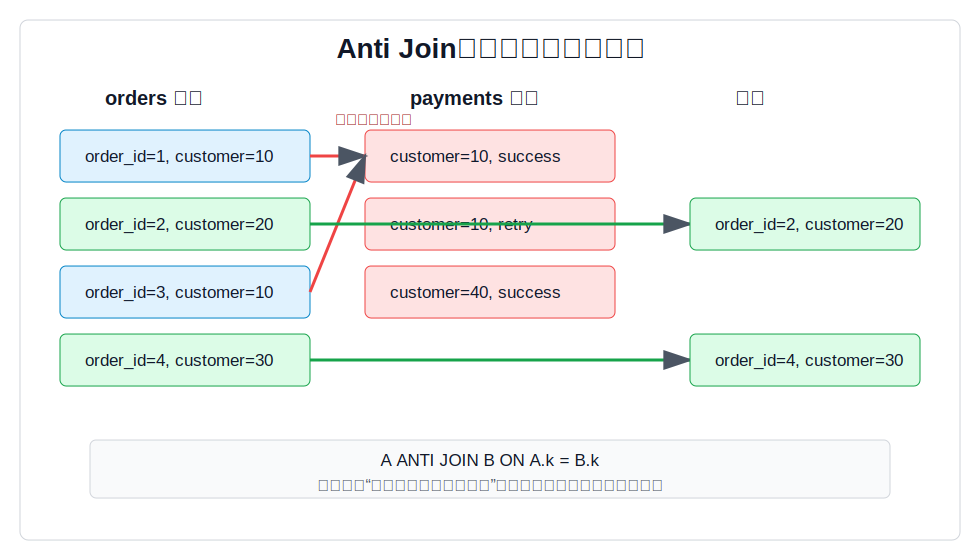
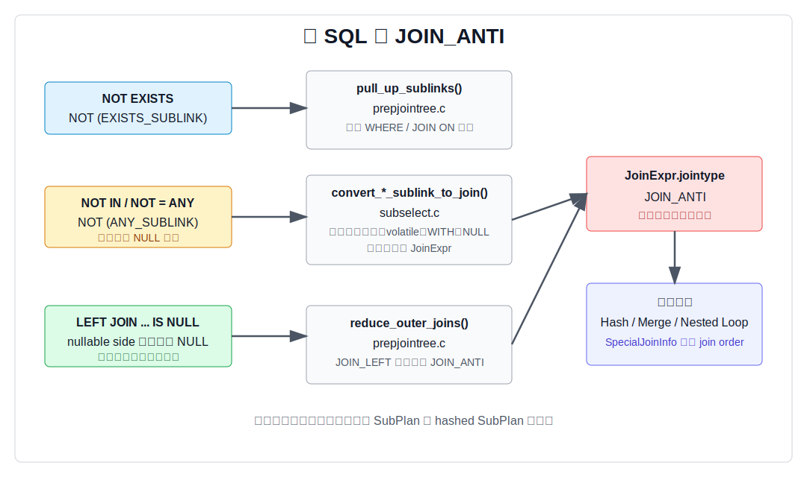
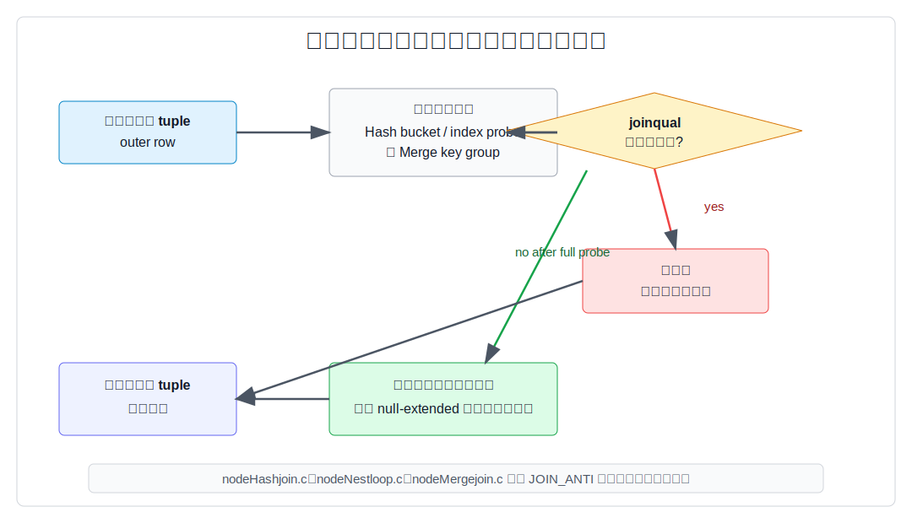
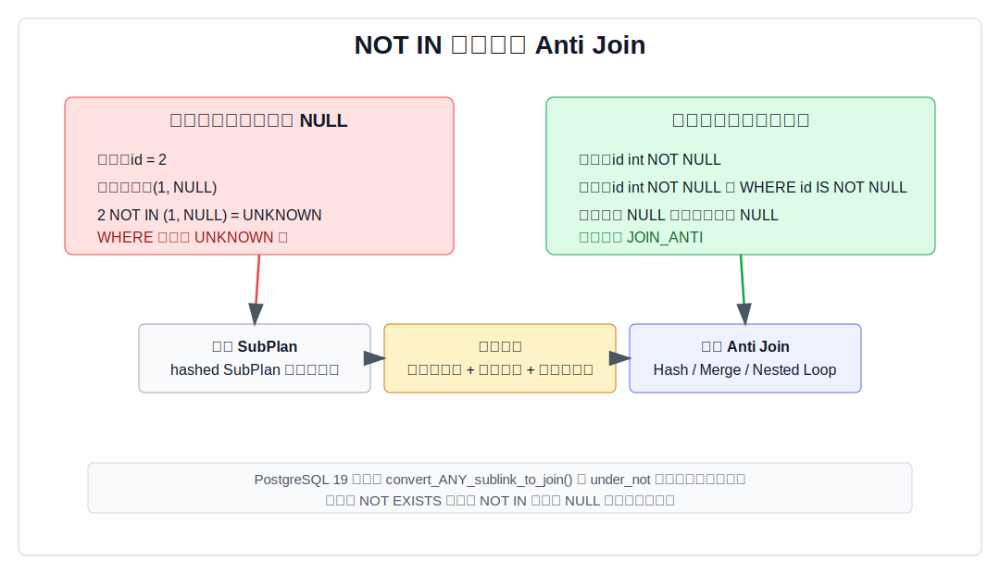

## 数据库筑基课 - Anti Join

### 作者
digoal

### 日期
2026-05-30

### 标签
PostgreSQL , 应用开发者 , 数据库筑基课 , 执行算法 , 优化器 , Join , Anti Join

----

## 背景


数据库筑基课大纲在当前项目中未找到可引用文件，因此本文按“扫描/执行算法”独立成篇。本文以 PostgreSQL 本地源码、官方文档、项目参考文件 `postgres/CLAUDE.md` 为主。用户提供的 DeepWiki 仓库名为 `postgres/postgres`，本文只把 DeepWiki 用作线索，并用本地源码和文档核对关键结论。

业务 SQL 里经常有“找出没有发生某件事的对象”：

```sql
-- 找出没有成功支付记录的订单
SELECT o.*
FROM orders o
WHERE NOT EXISTS (
  SELECT 1
  FROM payments p
  WHERE p.order_id = o.order_id
    AND p.status = 'success'
);
```

这类查询看起来像“负条件过滤”，但数据库内部更愿意把它理解成一个连接问题：

```text
保留左表中那些在右表找不到匹配的行。
```

这就是 Anti Join，中文常叫反连接或反半连接。它和 Semi Join 正好相反：Semi Join 保留“有匹配”的左侧行，Anti Join 保留“无匹配”的左侧行。它是应用系统里最容易写错、也最容易被 NULL 语义坑到的连接类型之一。

## 一、它解决什么问题？

Anti Join 解决的是“缺失关系检测”问题：

1. 找出没有订单的用户。
2. 找出没有成功支付的订单。
3. 找出没有授权记录的资源。
4. 找出没有被任务调度到的分片。
5. 找出事实表里不存在的维表键，或维表里没有事实引用的孤儿记录。

传统写法常有三种：

```sql
-- 1. 推荐入口：NOT EXISTS
SELECT *
FROM a
WHERE NOT EXISTS (SELECT 1 FROM b WHERE b.k = a.k);

-- 2. 可读但要理解优化器能否降强度：LEFT JOIN ... IS NULL
SELECT a.*
FROM a
LEFT JOIN b ON b.k = a.k
WHERE b.k IS NULL;

-- 3. 最容易踩 NULL 语义坑：NOT IN
SELECT *
FROM a
WHERE a.k NOT IN (SELECT b.k FROM b);
```

Anti Join 的价值是把“确认不存在”交给执行器。对于每个左侧行，右侧只要找到一个匹配，就能立即判断该左侧行不应该输出；如果扫描完候选右侧仍无匹配，才输出左侧行。

它的代价也很明确：

1. 右侧列不参与最终结果。如果要输出右侧字段，就不是 Anti Join。
2. “不存在”必须绑定准确的 join 条件。条件少写一个谓词，结果会被误删或误保留。
3. `NOT IN` 遇到 NULL 时不是二值逻辑，不能天然等价为 Anti Join。
4. 反连接的选择率估计依赖统计信息，右侧 NULL 比例、distinct 值、MCV、相关性都会影响计划。

## 二、它是什么？

PostgreSQL 源码 `src/include/nodes/nodes.h` 把 `JOIN_ANTI` 定义为：输出每个没有匹配的左侧行的一份副本。源码同一段还说明，Semi Join 和 Anti Join 不直接出现在 SQL `JOIN` 语法里，但可以通过 `EXISTS` 等标准写法表达，规划器会识别并转换。

形式化一点：

```text
A ANTI JOIN B ON predicate =
  { a | a 属于 A，并且不存在 b 属于 B，使 predicate(a, b) 为 true }
```

三个关键词：

1. **只输出左侧行**：右表只参与判断，不参与结果列。
2. **任意一条匹配都足够否决左侧行**：右侧有 1 条或 100 条匹配，左侧行都不输出。
3. **无匹配才输出**：执行器必须确认候选匹配都失败，才能返回左侧行。



图 1 说明：`customer=10` 的订单能在支付表中找到匹配，所以被 Anti Join 丢弃；`customer=20` 和 `customer=30` 没有匹配，所以输出。右表重复记录不会放大输出，因为 Anti Join 本来就不输出有匹配的左侧行。

PostgreSQL 中 Anti Join 的常见 SQL 入口是：

```sql
-- NOT EXISTS，最直接
SELECT *
FROM a
WHERE NOT EXISTS (SELECT 1 FROM b WHERE b.k = a.k);

-- LEFT JOIN ... IS NULL，优化器可能降强度为 Anti Join
SELECT a.*
FROM a
LEFT JOIN b ON b.k = a.k
WHERE b.k IS NULL;

-- NOT IN，只有在 NULL 安全时才可能改写
SELECT *
FROM a
WHERE a.k NOT IN (SELECT b.k FROM b);
```

官方文档 `doc/src/sgml/func/func-subquery.sgml` 明确说明：`EXISTS` 的结果只取决于子查询是否返回至少一行，子查询通常只执行到能判断是否存在为止；`IN` 等价于 `= ANY`；`NOT IN` 遇到左侧 NULL，或右侧没有相等值但至少有一个 NULL 时，结果是 NULL，不是 true。

## 三、核心原理

### 3.1 入口一：NOT EXISTS 转成 JOIN_ANTI

`NOT EXISTS` 的语义天然接近 Anti Join。优化器预处理阶段的关键入口是 `pull_up_sublinks()`，源码在 `src/backend/optimizer/prep/prepjointree.c`。它会尝试把顶层 `ANY`、`EXISTS` 子链接拉到 jointree 中，作为 Semi Join 或 Anti Join 处理。

真正构造 JoinExpr 的函数在 `src/backend/optimizer/plan/subselect.c`：

1. `convert_EXISTS_sublink_to_join()` 处理 `EXISTS_SUBLINK`。当调用者发现的是 `NOT EXISTS` 时，参数 `under_not` 为 true，函数会设置 `result->jointype = JOIN_ANTI`。
2. 它会拒绝含 `WITH` 的 EXISTS，因为把 WITH 拉到父查询可能改变“执行一次还是多次”的语义。
3. 它会调用 `simplify_EXISTS_query()` 去掉对 EXISTS 结果无关的 target list。
4. 子查询剩余主体不能还引用父查询变量；关联条件应集中在 WHERE 子句里。
5. WHERE 子句必须引用父查询变量，否则不是 join。
6. WHERE 子句不能包含 volatile 函数，否则优化可能改变副作用或求值次数。

这解释了一个实践建议：表达“没有匹配”时，优先写 `NOT EXISTS`，并把关联条件放在子查询 WHERE 里。这样既贴近业务语义，也给优化器最清晰的入口。

### 3.2 入口二：LEFT JOIN ... IS NULL 降强度为 JOIN_ANTI

很多开发者喜欢写：

```sql
SELECT a.*
FROM a
LEFT JOIN b ON b.k = a.k
WHERE b.k IS NULL;
```

这个写法的逻辑是：左连接会保留所有 `a`，如果 `b` 没匹配，`b` 侧列会被补 NULL；再用 `WHERE b.k IS NULL` 过滤出未匹配的行。

PostgreSQL 的 `reduce_outer_joins()` 会识别这类模式。`src/backend/optimizer/prep/prepjointree.c` 的注释明确描述了这种情况：

```sql
SELECT ... FROM a LEFT JOIN b ON (a.x = b.y) WHERE b.z IS NULL;
```

如果优化器能证明匹配行中的 `b.z` 必然非空，那么能通过 `b.z IS NULL` 的只有左连接补出来的 null-extended 行。此时查询实际表达的是反半连接，优化器可以把 `JOIN_LEFT` 改为 `JOIN_ANTI`。

这里的“能证明”很关键。证明来源可能是：

1. join 条件本身对右侧变量是 strict 的，例如等值条件中涉及的右侧 key。
2. 右侧列有已验证的 `NOT NULL` 约束。
3. 该列没有被更低层外连接重新 nullable 化。

如果不能证明，优化器不能随便改写。因为右表真实行里也可能有 NULL，`WHERE b.z IS NULL` 可能是在找“匹配到了但字段为 NULL”的行，而不是找“没匹配”的行。

### 3.3 入口三：NOT IN 只有 NULL 安全时才转 Anti Join

`NOT IN` 是 Anti Join 教学里最重要的坑。

官方文档说明，`NOT IN` 在以下情况返回 NULL，而不是 true：

1. 左侧表达式为 NULL。
2. 右侧没有相等值，但至少有一个右侧行让比较结果为 NULL。

例如：

```sql
SELECT 2 NOT IN (1, NULL);
-- 结果是 NULL，不是 true
```

在 `WHERE` 中，NULL 和 false 一样不会保留行。因此：

```sql
WHERE a.k NOT IN (SELECT b.k FROM b)
```

不等价于：

```sql
WHERE NOT EXISTS (SELECT 1 FROM b WHERE b.k = a.k)
```

除非能证明两侧比较表达式都不可能为 NULL，并且操作符本身对非 NULL 输入不会返回 NULL。

PostgreSQL 19 本地源码 `convert_ANY_sublink_to_join()` 的注释正是这样处理 `NOT IN` 的：当 `under_not` 为 true 时，默认不能转 Anti Join；只有能证明外层表达式、子查询输出列都非空，且操作符安全时才允许转换。回归测试 `src/test/regress/sql/subselect.sql` 也覆盖了这些情况：两侧 `NOT NULL` 时期望 `Hash Anti Join`；外侧 nullable 或内侧 nullable 时保留 hashed SubPlan。



图 2 说明：`NOT EXISTS`、`NOT IN`、`LEFT JOIN ... IS NULL` 都可能进入 `JOIN_ANTI`，但触发条件不同。`NOT EXISTS` 主要受子查询拉平限制；`LEFT JOIN ... IS NULL` 需要证明 `IS NULL` 只能来自未匹配补空；`NOT IN` 还必须跨过 NULL 安全门槛。

### 3.4 Join order：Anti Join 不能像 Inner Join 一样随便重排

Anti Join 不是普通 inner join 加一个过滤器。PostgreSQL 优化器 README 在 join 重排说明中指出：Anti Join 大致像 Left Join，但不能随意重关联到左连接或反连接的右侧，也不能从这些右侧移出。

原因是 Anti Join 的右侧只用于否决左侧行。如果把右侧提前或滞后到错误位置，可能改变“哪些左侧行被认为存在匹配”的范围。

PostgreSQL 用 `SpecialJoinInfo` 记录这类约束。`src/include/nodes/pathnodes.h` 说明，外连接、Semi Join、Anti Join 都会在 `PlannerInfo.join_info_list` 中保存 `SpecialJoinInfo`，供 `join_is_legal` 排除非法 join order。对 DBA 来说，这解释了两个现象：

1. 有些复杂查询里，反连接会限制优化器的 join 顺序搜索空间。
2. 改写 SQL 结构后，即使逻辑上相似，也可能得到完全不同的 join order 和物理算法。

### 3.5 路径生成：Anti Join 是逻辑算子，不是单一物理算法

`JOIN_ANTI` 可以落成多种物理计划。PostgreSQL 回归测试预期文件中能看到 `Hash Anti Join`、`Merge Anti Join`、`Nested Loop Anti Join`、`Hash Right Anti Join`、`Merge Right Anti Join` 等计划形态。

`src/backend/optimizer/path/joinpath.c` 会为 join relation 生成可选路径。它对 `JOIN_SEMI`、`JOIN_ANTI` 或 inner side 已证明唯一的 join 调用 `compute_semi_anti_join_factors()`，为成本估算准备两个关键因子：

| 因子 | 含义 |
|---|---|
| `outer_match_frac` | 外侧行中预计有至少一个匹配的比例 |
| `match_count` | 对有匹配的外侧行，预计平均匹配多少个内侧行 |

`src/backend/optimizer/path/costsize.c` 的注释说明：Hash 或 Nested Loop 的 Semi/Anti Join 中，执行器一旦为当前外侧行找到匹配，就会停止扫描更多内侧行。成本模型必须为这个提前停止效果做修正。

对于 Anti Join，成本估算有两个方向都重要：

1. **有匹配的外侧行**：找到第一条匹配就可以丢弃，内侧扫描可能提前停。
2. **无匹配的外侧行**：必须确认没有匹配，可能需要探测完整 hash bucket、完整索引范围或完整 merge key group。

统计信息不准时，Anti Join 很容易选错算法。例如右侧 key 重复严重但统计没反映出来，Nested Loop 可能低估内侧探测；右侧比预期大很多，Hash Anti Join 可能批处理或落临时文件。

### 3.6 执行器：匹配即丢弃，无匹配才输出

执行器层面的 Anti Join 语义非常直接：

1. 对当前外侧行查找内侧匹配。
2. 如果 join qual 命中，当前外侧行不输出，进入下一行。
3. 如果候选内侧都查完仍无匹配，输出当前外侧行。

`src/backend/executor/nodeHashjoin.c` 在 `JOIN_ANTI` 分支中写得很清楚：一旦匹配 joinqual，就设置状态为 `HJ_NEED_NEW_OUTER` 并继续，不返回匹配 tuple。`nodeNestloop.c` 也类似：匹配后设置 `nl_NeedNewOuter = true` 并继续。`nodeMergejoin.c` 在 Anti Join 命中后推进到下一个 outer。



图 3 说明：Hash、Nested Loop、Merge Anti Join 的物理查找方式不同，但语义相同：对一个外侧行，存在匹配就丢弃；确认不存在匹配才输出。Anti Join 的成本风险通常来自“确认不存在”这一步。

## 四、横向对比



图 4 说明：`NOT IN` 的 NULL 语义是 Anti Join 的最大边界。只要比较结果可能变成 unknown，就不能把它当作简单的“右表不存在匹配”。

| 维度 | Anti Join / NOT EXISTS | LEFT JOIN ... IS NULL | NOT IN | EXCEPT |
|---|---|---|---|---|
| 主要目标 | 保留左侧无匹配行 | 用左连接补空表达无匹配 | 判断值不属于子查询集合 | 集合差 |
| NULL 风险 | 低，关联谓词按正常 WHERE 语义判断 | 中，`IS NULL` 列必须能代表未匹配 | 高，右侧 NULL 会让结果变 UNKNOWN | 取决于集合语义和去重 |
| 是否输出右侧列 | 否 | 通常不应输出右侧列 | 否 | 否 |
| 右侧重复影响 | 不改变结果，但影响成本 | 不改变反连接结果，但可能影响成本 | 不改变集合判断，但影响成本 | 默认去重，`EXCEPT ALL` 保留计数语义 |
| 优化器入口 | `NOT EXISTS` 拉平为 `JOIN_ANTI` | `reduce_outer_joins()` 降强度 | 满足 NULL 安全才可能改写 | SetOp，不是 JoinExpr |
| 推荐程度 | 最推荐 | 可用，但要写对 `IS NULL` 列 | 谨慎，只在非空约束明确时用 | 适合集合差，不适合需要保留完整行上下文的关联过滤 |

结论不是“永远不要用 `NOT IN`”。如果列有明确 `NOT NULL` 约束，且你想表达单列集合排除，`NOT IN` 可以很清楚。但在业务表默认允许 NULL、子查询经过外连接或表达式计算时，`NOT EXISTS` 更稳。

## 五、效果如何？

Anti Join 的收益主要来自三点：

1. **减少无意义输出**：只输出左侧无匹配行，不构造匹配行对。
2. **匹配时可提前停止**：对有匹配的外侧行，执行器不需要枚举所有右侧匹配。
3. **给优化器明确语义**：`JOIN_ANTI` 让成本模型可以使用 `outer_match_frac` 和 `match_count`，而不是把它当普通 join 后再过滤。

代价也要同样重视：

1. **无匹配行可能更贵**：Anti Join 必须证明无匹配。无匹配比例越高，越容易接近完整探测成本。
2. **内侧构建成本仍存在**：Hash Anti Join 要构建 hash table；Merge Anti Join 可能需要排序；Nested Loop 可能大量索引探测。
3. **join order 受限**：`SpecialJoinInfo` 会排除非法重排，复杂 SQL 下可选计划变少。
4. **NULL 语义不能简化**：`NOT IN` 的 NULL 安全检查失败时，计划可能退回 SubPlan。
5. **统计信息敏感**：右侧 distinct、NULL fraction、MCV、过滤选择率不准，都会影响选择 Hash、Merge 还是 Nested Loop。

常见计划形态的适用边界：

| 物理形态 | 适合场景 | 主要风险 | 观察点 |
|---|---|---|---|
| Hash Anti Join | 等值条件，右侧可接受构建 hash table | `work_mem` 不足导致 batch 或临时文件 | `Hash` 节点 buckets、batches、memory usage |
| Merge Anti Join | 两侧已有顺序，或排序成本低 | 排序成本、重复 key group 成本 | `Sort`、`Merge Cond`、输入行数 |
| Nested Loop Anti Join | 外侧很小，内侧有高选择性索引 | 外侧行数低估导致大量探测 | `loops`、内侧 Index Scan 次数 |
| Hash Right Anti Join | 优化器认为交换方向更便宜 | 读计划时容易误解保留侧 | `Right Anti` 中谁是逻辑保留侧 |

## 六、实操 DEMO

下面脚本是最小可验证实验。本文没有在本机编译并启动 PostgreSQL，因此不贴伪造的 `EXPLAIN ANALYZE` 数字；读者可以在 PostgreSQL 19 或接近版本中执行。不同版本、数据量和统计信息会影响具体计划，但计划形态应能观察到 Anti Join 或 hashed SubPlan 的差异。

```sql
DROP TABLE IF EXISTS orders_demo;
DROP TABLE IF EXISTS payments_demo;

CREATE TABLE orders_demo (
  order_id bigint PRIMARY KEY,
  customer_id bigint NOT NULL
);

CREATE TABLE payments_demo (
  payment_id bigint PRIMARY KEY,
  order_id bigint,
  status text NOT NULL
);

INSERT INTO orders_demo
SELECT g, g % 10000
FROM generate_series(1, 100000) AS g;

INSERT INTO payments_demo
SELECT g, g, 'success'
FROM generate_series(1, 80000) AS g
WHERE g % 5 <> 0;

CREATE INDEX payments_demo_order_id_idx ON payments_demo(order_id);

ANALYZE orders_demo;
ANALYZE payments_demo;

EXPLAIN (ANALYZE, BUFFERS)
SELECT o.*
FROM orders_demo o
WHERE NOT EXISTS (
  SELECT 1
  FROM payments_demo p
  WHERE p.order_id = o.order_id
    AND p.status = 'success'
);
```

通常你会看到 `Hash Anti Join` 或 `Nested Loop Anti Join`。如果关闭 hash join，可以观察备选路径：

```sql
SET enable_hashjoin = off;

EXPLAIN (ANALYZE, BUFFERS)
SELECT o.*
FROM orders_demo o
WHERE NOT EXISTS (
  SELECT 1
  FROM payments_demo p
  WHERE p.order_id = o.order_id
    AND p.status = 'success'
);

RESET enable_hashjoin;
```

验证 `LEFT JOIN ... IS NULL` 是否被降强度：

```sql
EXPLAIN (ANALYZE, BUFFERS)
SELECT o.*
FROM orders_demo o
LEFT JOIN payments_demo p
  ON p.order_id = o.order_id
 AND p.status = 'success'
WHERE p.order_id IS NULL;
```

注意这里检查的是 `p.order_id IS NULL`，而 `p.order_id` 又在 strict 等值 join 条件中参与匹配。优化器更容易证明这个 NULL 来自未匹配补空。

验证 `NOT IN` 的 NULL 坑：

```sql
-- 右侧 order_id 允许 NULL，因此这个查询不能简单等价为 Anti Join
EXPLAIN (ANALYZE, BUFFERS)
SELECT o.*
FROM orders_demo o
WHERE o.order_id NOT IN (
  SELECT p.order_id
  FROM payments_demo p
);

-- 加上非空过滤后，更接近 Anti Join 可改写条件
EXPLAIN (ANALYZE, BUFFERS)
SELECT o.*
FROM orders_demo o
WHERE o.order_id NOT IN (
  SELECT p.order_id
  FROM payments_demo p
  WHERE p.order_id IS NOT NULL
);
```

如果你的 PostgreSQL 版本支持 `NOT IN` 的 Anti Join 转换，第二个查询更可能出现 `Anti Join`；第一个查询通常会保留 `SubPlan` 或 `hashed SubPlan`，因为右侧 NULL 会改变语义。

## 七、最佳实践

面向数据库架构师：

1. 需要表达“缺失关系”时，优先把模型写成 `NOT EXISTS`，并保证关联键和业务过滤条件完整。
2. 对反连接高频路径，明确主外键、唯一性、`NOT NULL` 约束和必要索引。约束不仅保护数据，也给优化器证明空间。
3. 对大表反连接，提前评估右侧构建集大小、过滤选择率和 `work_mem`。Hash Anti Join 很好，但不是免费。
4. 多表复杂查询中，把 Anti Join 放在语义最清楚的位置。不要为了“看起来少一层子查询”而破坏 join order 可优化性。

面向 DBA：

1. 用 `EXPLAIN (ANALYZE, BUFFERS)` 看真实行数和估算行数偏差，重点看 Anti Join 两侧输入行数。
2. Hash Anti Join 慢时，检查 hash batches、临时文件、`work_mem`、右侧过滤条件是否能提前下推。
3. Nested Loop Anti Join 慢时，检查外侧 loops 和内侧索引条件。外侧行数低估通常是根因。
4. 维护反连接相关列的统计信息。必要时考虑 extended statistics 来帮助多列相关性估算。
5. 对 `LEFT JOIN ... IS NULL`，确认 `IS NULL` 列是否真能代表未匹配，而不是业务上允许 NULL 的右表字段。

面向业务开发者：

1. 写“没有某记录”时首选 `NOT EXISTS`。
2. 避免在 nullable 列上随手写 `NOT IN`。如果必须用，先确认两侧非空约束或显式加 `IS NOT NULL`。
3. 不要在 `NOT EXISTS` 子查询里调用有副作用的函数。官方文档明确提醒，EXISTS 子查询通常不会完整执行。
4. 反连接条件要写全。比如“没有成功支付”必须把 `status = 'success'` 放进子查询，而不是只按订单号判断。

## 八、适合与不适合场景

适合：

1. 反查缺失关系：无订单用户、无支付订单、无权限资源。
2. 数据质量巡检：事实表孤儿键、维表未引用记录、同步缺口。
3. 幂等任务：找出还没处理过的任务或分片。
4. 约束补偿：在历史数据清洗阶段找出不满足新约束的行。
5. 反向集合过滤：从候选集排除黑名单、已发送、已授权对象。

不适合：

1. 需要右侧字段。Anti Join 不输出右表列。
2. 需要知道匹配数量。应使用聚合或窗口函数。
3. 需要区分“右侧无匹配”和“右侧匹配但字段为 NULL”。不要用错误的 `LEFT JOIN ... IS NULL` 列。
4. 右侧子查询有副作用函数。EXISTS/NOT EXISTS 可能提前停止。
5. nullable 列上直接用 `NOT IN` 表达业务否定，除非你明确接受 SQL 三值逻辑结果。

## 九、常见坑

1. **`NOT IN` 被 NULL 吃掉结果**  
   右侧只要有 NULL，很多看似应该保留的左侧行会得到 UNKNOWN，最终被 WHERE 过滤掉。用 `NOT EXISTS`，或证明并过滤右侧非空。

2. **`LEFT JOIN ... IS NULL` 检查了错误列**  
   如果检查的是右表 nullable 业务列，结果可能包含“匹配到了但该列为 NULL”的行。应检查 join key 或有 `NOT NULL` 约束的列。

3. **把右侧过滤条件写到 WHERE 里**  
   对左连接写法来说，右侧过滤条件放在 WHERE 可能把左连接变成内连接语义。应把右侧匹配条件放在 ON，未匹配判断放在 WHERE。

4. **反连接条件不完整**  
   “没有成功支付”不是“没有任何支付”。漏掉状态条件会错误排除有失败支付但无成功支付的订单。

5. **只看 SQL 等价，不看执行代价**  
   `NOT EXISTS`、`LEFT JOIN ... IS NULL`、`NOT IN` 在某些数据约束下结果相同，但优化入口、NULL 语义和计划空间不同。

6. **忽略统计信息**  
   Anti Join 对“命中比例”和“匹配数量”敏感。统计过旧时，计划可能从 Hash 变 Nested Loop，或反过来。

7. **误读 Right Anti Join**  
   `Hash Right Anti Join` 不是业务上写了 right join，而是优化器交换了物理输入方向。读计划时要看条件和输出列，确认逻辑保留侧。

## 十、扩展问题

1. 为什么 `NOT EXISTS` 通常比 `NOT IN` 更适合表达反连接？请从 NULL 语义解释，而不是从性能解释。
2. 如果右侧表对 join key 有唯一索引，Anti Join 的成本模型和执行行为会发生什么变化？
3. 为什么 Anti Join 不能像 Inner Join 一样自由重排？构造一个三表查询说明错误重排会改变结果。
4. `LEFT JOIN ... IS NULL` 中，选择哪个右侧列做 `IS NULL` 判断最稳？为什么？
5. 大表反连接中，什么时候 Hash Anti Join 会比 Nested Loop Anti Join 更差？

## 十一、扩展阅读

1. PostgreSQL 源码：`src/include/nodes/nodes.h`，`JoinType` 中 `JOIN_ANTI`、`JOIN_RIGHT_ANTI` 的定义。
2. PostgreSQL 源码：`src/backend/optimizer/prep/prepjointree.c`，`pull_up_sublinks()` 与 `reduce_outer_joins()`。
3. PostgreSQL 源码：`src/backend/optimizer/plan/subselect.c`，`convert_EXISTS_sublink_to_join()` 与 `convert_ANY_sublink_to_join()`。
4. PostgreSQL 源码：`src/backend/optimizer/path/joinpath.c`，Anti Join 路径生成、Memoize 限制、Nested Loop 支持范围。
5. PostgreSQL 源码：`src/backend/optimizer/path/costsize.c`，`compute_semi_anti_join_factors()`。
6. PostgreSQL 源码：`src/backend/executor/nodeHashjoin.c`、`nodeNestloop.c`、`nodeMergejoin.c`，Anti Join 执行分支。
7. PostgreSQL 文档：`doc/src/sgml/func/func-subquery.sgml`，`EXISTS`、`IN`、`NOT IN`、`ANY`、`ALL` 的三值逻辑。
8. PostgreSQL 文档：`doc/src/sgml/ref/explain.sgml`，EXPLAIN 成本和 EXISTS 子查询的启动成本含义。
9. PostgreSQL 回归测试：`src/test/regress/sql/subselect.sql` 与 `expected/subselect.out`，`NOT IN` 转 Anti Join 的非空条件测试。
10. PostgreSQL 优化器 README：`src/backend/optimizer/README`，Semi/Anti Join 的 join order 约束和参数化路径说明。
11. DeepWiki：`postgres/postgres` 的 “Query Planner and JOIN Optimization” 相关摘要。本文使用其作为线索，关键说法已回查本地源码。
  
## 附录 
1、克隆代码  
```  
git clone --depth 1 https://github.com/postgres/postgres
```  
  
2、启用 codex, 使用 [数据库筑基课 skill](../skills/README.md).  
```
文章标题: 
  数据库筑基课 - Anti Join
项目源码(已克隆到当前项目如下目录中):  
  postgres
项目 deepwiki reponame:  
  postgres/postgres
项目参考信息: 
  postgres/CLAUDE.md
```
  
  
#### [PostgreSQL 解决方案集合](../201706/20170601_02.md "40cff096e9ed7122c512b35d8561d9c8")
  
  
#### [德哥 / digoal's Github - 公益是一辈子的事.](https://github.com/digoal/blog/blob/master/README.md "22709685feb7cab07d30f30387f0a9ae")
  
  
#### [About 德哥](https://github.com/digoal/blog/blob/master/me/readme.md "a37735981e7704886ffd590565582dd0")
  
  

  
