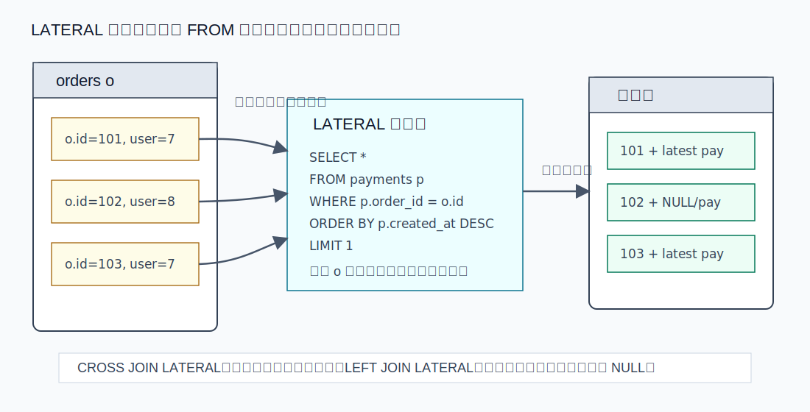
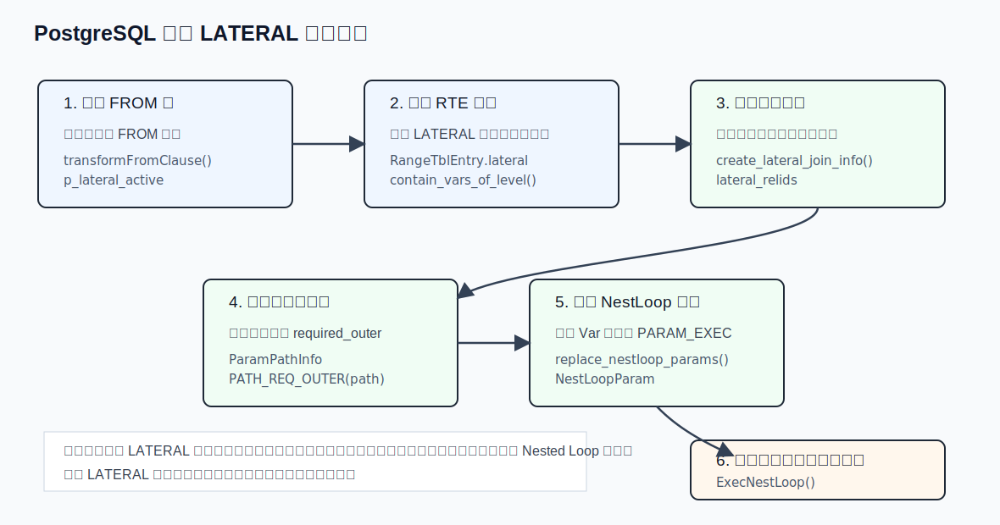
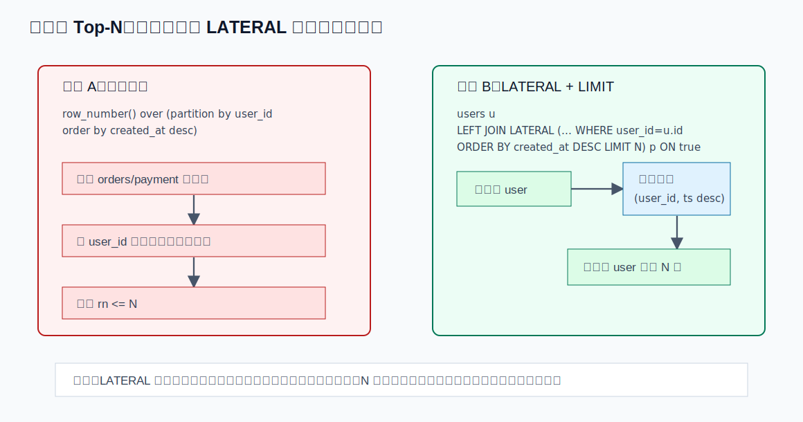
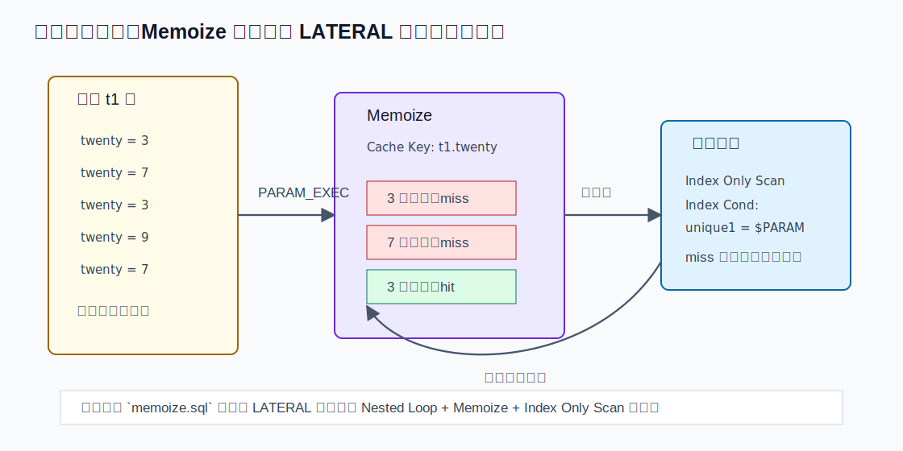
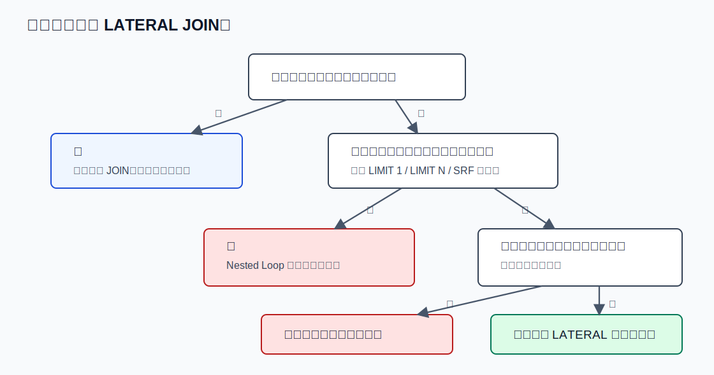

## 数据库筑基课 - LATERAL JOIN

### 作者
digoal

### 日期
2026-05-30

### 标签
PostgreSQL , 应用开发者 , 数据库筑基课 , 执行算法 , 优化器 , Join , LATERAL JOIN

----

## 背景


数据库筑基课大纲在当前项目中未找到可引用文件，因此本文按“扫描/执行算法”独立成篇。本文以 PostgreSQL 本地源码、官方文档、项目参考文件 `postgres/CLAUDE.md`、DeepWiki `postgres/postgres` 的 Query Planner and JOIN Optimization 页面为参考；关键机制均以 PostgreSQL 官方文档和源码为准。用户提供的论文题名未在当前项目中附带全文，本文只把它们作为扩展阅读线索，不把未读全文中的结论当作事实依据。

业务 SQL 经常遇到一种普通 join 不好表达的问题：右侧计算必须拿到左侧当前行的值。

例如每个用户取最近 3 笔订单：

```sql
SELECT u.user_id, u.name, o.order_id, o.created_at
FROM users u
LEFT JOIN LATERAL (
  SELECT o.order_id, o.created_at
  FROM orders o
  WHERE o.user_id = u.user_id
  ORDER BY o.created_at DESC
  LIMIT 3
) o ON true;
```

如果没有 `LATERAL`，`FROM` 子查询通常是独立求值的，不能直接引用 `u.user_id`。你可以改用窗口函数，也可以先聚合再 join，但它们表达的是“先把大集合算出来，再过滤每组前几名”；`LATERAL ... LIMIT` 表达的是“对每个外侧行，带着它的键去右侧取一个小结果集”。这两个执行形态完全不同。

## 一、它解决什么问题？

LATERAL JOIN 解决的是“依赖式 FROM 项”问题：

```text
右侧 FROM 项的输入参数来自左侧已经产生的行。
```

典型场景包括：

1. 每个主表行取子表 Top-N，例如每个用户最近 3 笔订单。
2. 每个空间对象调用返回集合的函数，例如 `vertices(polygon)`。
3. 每行 JSON/数组展开，例如 `jsonb_array_elements(t.doc)`、`unnest(t.tags)`。
4. 每个外侧键执行一个低成本的派生查询，例如最新状态、最近一次事件、最小可用价格。
5. 保留无匹配外侧行，用 `LEFT JOIN LATERAL ... ON true` 返回 NULL 补齐。

它的代价也很明确：依赖关系会限制 join 顺序，参数化内侧路径通常要在 Nested Loop 内部反复执行。外侧行很多、内侧没有索引、右侧结果集很大时，LATERAL 可能把一次大扫描变成大量小扫描，性能会很差。

## 二、它是什么？

PostgreSQL 官方文档 `doc/src/sgml/queries.sgml` 对 LATERAL 的定义很直接：`FROM` 中的子查询可以用 `LATERAL` 前缀，使它能引用前面 `FROM` 项提供的列。没有 `LATERAL` 时，每个 `FROM` 子查询独立求值，不能交叉引用其他 `FROM` 项。

更工程化地说：

```text
LATERAL 是 FROM 子句里的“相关子查询/相关表函数”机制。
```

它有四个语义要点：

1. **引用方向**：右侧 LATERAL 项可以引用左侧已经可见的 FROM 项。
2. **求值方式**：对每个外侧行，或外侧行集合，右侧项使用当前值重新求值。
3. **函数特例**：PostgreSQL 中 `FROM` 里的函数参数天然可以引用前面的 FROM 项，`LATERAL` 关键字对函数是可选的，但显式写出来更清楚。
4. **连接类型限制**：在 join 树中，右侧 LATERAL 项引用左侧时，组合 join 类型必须是 `INNER` 或 `LEFT`。源码 `parse_relation.c` 的错误信息也明确写着：LATERAL 引用对应的 combining JOIN type 必须是 INNER 或 LEFT。



图 1 说明：普通派生表像“先独立算完再 join”；LATERAL 子查询像“带着当前外侧行的值去算右侧”。`CROSS JOIN LATERAL` 没有右侧行时会丢弃外侧行；`LEFT JOIN LATERAL` 没有右侧行时仍保留外侧行并补 NULL。

## 三、核心原理

### 3.1 解析阶段：左到右处理 FROM，让左侧只对 LATERAL 可见

PostgreSQL 解析 `FROM` 列表时不是把所有项一次性放进命名空间，而是按从左到右处理。`src/backend/parser/parse_clause.c` 的 `transformFromClause()` 注释说明：必须左到右处理，才能正确处理 LATERAL 引用。

处理一个新 FROM 项后，PostgreSQL 会先把它标记成 `lateral_only`，也就是“只对 LATERAL 表达式可见”；等整个 FROM 列表处理完成，再把所有 namespace item 变成普通可见。这就是为什么右侧可以引用左侧，而左侧不能倒过来引用右侧。

对子查询：

```c
pstate->p_lateral_active = r->lateral;
```

只有显式 `LATERAL (SELECT ...)` 才打开同层 lateral-only 名称可见性。

对函数：

```c
pstate->p_lateral_active = true;
is_lateral = r->lateral || contain_vars_of_level((Node *) funcexprs, 0);
```

函数在 `FROM` 中会临时打开 lateral 可见性。即使用户没写 `LATERAL`，只要函数参数引用了同层外侧变量，RTE 也会被标记为 lateral。这也是官方文档说函数的 `LATERAL` 关键字可选的源码原因。

### 3.2 依赖建模：lateral_relids 限制 join 顺序

解析阶段只解决“名字能不能引用”。进入优化器后，还要解决“谁必须先算出来”。`src/backend/optimizer/plan/initsplan.c` 的 `create_lateral_join_info()` 会为每个 base relation 填充：

| 字段 | 含义 |
|---|---|
| `direct_lateral_relids` | 当前关系直接引用了哪些外侧关系 |
| `lateral_relids` | 当前关系直接或间接依赖哪些外侧关系 |
| `lateral_referencers` | 反向映射：哪些关系 laterally 引用了当前关系 |

源码还会对 `lateral_relids` 做传递闭包：如果 X laterally 引用 Y，Y 又 laterally 引用 Z，那么 X 对 Z 也有实际执行依赖。这不是语法洁癖，而是优化器必须知道：X 不能被放到 Z 之前执行。

### 3.3 参数化路径：LATERAL 变成 required outer

PostgreSQL 优化器 README 在 “Parameterized Paths” 和 “LATERAL subqueries” 两节里说明了核心机制：对于包含 lateral references 的 RTE，优化器会生成参数化路径。这样的路径至少被它引用的外侧关系参数化；并且包含该 LATERAL 子查询的 join relation 可能根本没有非参数化路径。

一个参数化路径可以理解成：

```text
这条路径扫描内侧关系，但需要外侧关系 A 先提供参数。
```

比如：

```sql
SELECT *
FROM users u
JOIN LATERAL (
  SELECT *
  FROM orders o
  WHERE o.user_id = u.user_id
  ORDER BY o.created_at DESC
  LIMIT 1
) o ON true;
```

如果存在索引：

```sql
CREATE INDEX ON orders (user_id, created_at DESC);
```

优化器可以考虑一个参数化 index scan：`orders.user_id = u.user_id`。这条路径不能随便放在 hash join 的 build 侧独立执行，因为没有 `u.user_id` 就无法求值；它最终要出现在能提供参数的 Nested Loop 内侧。



图 2 说明：LATERAL 的关键路径不是一个单独算子，而是一串约束传播：解析阶段打开可见性，优化阶段记录 lateral 依赖并生成参数化路径，计划生成阶段把外侧 Var 替换成 `PARAM_EXEC`，执行阶段由 Nested Loop 给内侧计划填参数并重扫。

### 3.4 计划生成：外侧 Var 变成 NestLoopParam / PARAM_EXEC

`src/backend/optimizer/plan/createplan.c` 的 `create_nestloop_plan()` 会在构建 Nested Loop 时处理内侧参数化路径。关键动作包括：

1. 创建 outer plan。
2. 把 outer relids 加入 `root->curOuterRels`，再创建 inner plan。
3. 对需要外侧值的表达式调用 `replace_nestloop_params()`。
4. 生成 `NestLoopParam` 列表。

`replace_nestloop_params()` 的注释说得很清楚：把属于外侧关系的 `Var` 和 `PlaceHolderVar` 替换成 nestloop Params，并记录到 `root->curOuterParams`。

最终计划节点里的结构在 `src/include/nodes/plannodes.h`：

```c
typedef struct NestLoop
{
    Join        join;
    List       *nestParams;
} NestLoop;

typedef struct NestLoopParam
{
    NodeTag     type;
    int         paramno;
    Var        *paramval;
} NestLoopParam;
```

### 3.5 执行阶段：每个外侧行填参数，然后重扫内侧

`src/backend/executor/nodeNestloop.c` 的 `ExecNestLoop()` 展示了运行时动作：

1. 取一行外侧 tuple。
2. 对每个 `NestLoopParam`，从外侧 tuple 取属性值。
3. 把值写入 `ecxt_param_exec_vals[paramno]`。
4. 把内侧计划的 `chgParam` 标记为已变化。
5. 调用 `ExecReScan(innerPlan)`。

这就是 LATERAL 性能的根：它天然倾向“外侧循环 + 内侧参数化重扫”。如果内侧是索引点查、小范围索引扫描、低成本函数调用，效果很好；如果内侧每次都大范围扫描，就会灾难。

## 四、横向对比

| 维度 | LATERAL JOIN | 普通 JOIN | 相关子查询 | 窗口函数 Top-N |
|---|---|---|---|---|
| 主要目标 | FROM 项依赖左侧行 | 两个独立关系按条件组合 | 表达式位置依赖外层行 | 在全局结果中按分区排序编号 |
| 是否能返回多行多列 | 可以 | 可以 | 标量子查询通常不行，EXISTS/IN 只返回布尔语义 | 可以 |
| 优化器自由度 | 受 lateral 依赖限制 | 通常较高 | 可能被拉平，也可能保留 SubPlan | 依赖排序、分区、增量排序能力 |
| 常见执行形态 | Nested Loop + 参数化内侧路径 | Hash/Merge/Nested Loop 都常见 | SubPlan、InitPlan 或被改写成 join | Sort/Incremental Sort + WindowAgg |
| 最适合 | 每个外侧行取小集合、Top-N、SRF | 大集合等值连接、结果行对 | 简单存在性/标量判断 | 全表分组排序、需要所有分区排名 |
| 主要风险 | 外侧行数乘以内侧扫描成本 | 重复放大、join 顺序估计错误 | 重复执行或 NULL 语义陷阱 | 大排序、内存不足、临时文件 |

表里的关键差异是：普通 join 的右侧可以独立扫描和重排；LATERAL 的右侧带有“必须等左侧值”的执行依赖。它换来表达力和局部索引访问机会，也交出了部分 join reorder 自由度。

## 五、效果如何？

LATERAL 的收益通常来自三个地方。

第一，**减少全局排序或全局聚合**。每组 Top-N 如果用窗口函数，往往要对大集合分区排序；如果用 `LATERAL ... ORDER BY ... LIMIT N`，并且有 `(group_key, sort_key DESC)` 索引，就可能变成每个外侧键一次小范围索引扫描。

第二，**让 set-returning function 的参数化语义更清楚**。官方文档在多边形顶点例子里使用 `LATERAL vertices(p.poly)`，这类函数本来就需要当前行参数，LATERAL 把依赖关系放在 FROM 层表达。

第三，**配合 Memoize 缓解重复参数扫描**。PostgreSQL 回归测试 `src/test/regress/sql/memoize.sql` 专门测试了 LATERAL join。期望输出中出现：

```text
Nested Loop
  -> Seq Scan on tenk1 t1
  -> Memoize
       Cache Key: t1.twenty
       -> Index Only Scan using tenk1_unique1 on tenk1 t2
            Index Cond: (unique1 = t1.twenty)
```

这说明当外侧参数值重复时，优化器可以在 Nested Loop 内侧加 `Memoize`，用参数值作为缓存键，减少重复内侧扫描。



图 3 说明：LATERAL 的优势不是“语法更高级”，而是它允许“每个外侧键直接走有序复合索引取前 N 条”。如果没有这样的索引，窗口函数或一次性聚合反而可能更稳。



图 4 说明：LATERAL 内侧路径依赖外侧参数。参数值重复时，`Memoize` 可以把相同参数的结果缓存下来；但缓存不是语义保证，是否出现取决于版本、代价估算、开关和计划选择。

## 六、实操 DEMO

下面 DEMO 是可执行 SQL，但本文没有连接本地 PostgreSQL 实例执行，因此没有编造 `EXPLAIN ANALYZE` 数字。读者可以在 PostgreSQL 14+ 上验证；PostgreSQL 9.3 已支持 LATERAL，`Memoize` 是较新版本才可能出现的计划节点。

### 6.1 准备数据

```sql
DROP TABLE IF EXISTS demo_orders;
DROP TABLE IF EXISTS demo_users;

CREATE TABLE demo_users (
  user_id bigint PRIMARY KEY,
  name text NOT NULL
);

CREATE TABLE demo_orders (
  order_id bigint PRIMARY KEY,
  user_id bigint NOT NULL REFERENCES demo_users(user_id),
  amount numeric(12,2) NOT NULL,
  created_at timestamptz NOT NULL
);

INSERT INTO demo_users
SELECT g, 'user-' || g
FROM generate_series(1, 1000) AS g;

INSERT INTO demo_orders
SELECT g,
       (g % 1000) + 1,
       (random() * 1000)::numeric(12,2),
       now() - make_interval(mins => g)
FROM generate_series(1, 100000) AS g;

CREATE INDEX demo_orders_user_created_idx
ON demo_orders (user_id, created_at DESC);

ANALYZE demo_users;
ANALYZE demo_orders;
```

### 6.2 每个用户取最近 3 笔订单

```sql
EXPLAIN (ANALYZE, BUFFERS)
SELECT u.user_id, u.name, o.order_id, o.created_at, o.amount
FROM demo_users u
LEFT JOIN LATERAL (
  SELECT o.order_id, o.created_at, o.amount
  FROM demo_orders o
  WHERE o.user_id = u.user_id
  ORDER BY o.created_at DESC
  LIMIT 3
) o ON true
WHERE u.user_id <= 10;
```

你应该重点观察：

1. 是否出现 `Nested Loop Left Join`。
2. 内侧是否使用 `demo_orders_user_created_idx`。
3. `Limit` 是否在内侧索引扫描上方。
4. 外侧返回 10 个用户时，内侧是否只读取每个用户前 3 条附近的数据。

### 6.3 对照窗口函数写法

```sql
EXPLAIN (ANALYZE, BUFFERS)
SELECT user_id, name, order_id, created_at, amount
FROM (
  SELECT u.user_id,
         u.name,
         o.order_id,
         o.created_at,
         o.amount,
         row_number() OVER (
           PARTITION BY u.user_id
           ORDER BY o.created_at DESC
         ) AS rn
  FROM demo_users u
  JOIN demo_orders o ON o.user_id = u.user_id
  WHERE u.user_id <= 10
) s
WHERE rn <= 3;
```

如果过滤条件很强、复合索引合适，LATERAL 版本通常更容易形成“外侧少量行 + 内侧 LIMIT 索引扫描”。如果要对全量用户排名，或者每组 N 很大，窗口函数可能更合适。

### 6.4 JSON/数组展开的隐式 LATERAL

```sql
DROP TABLE IF EXISTS demo_events;

CREATE TABLE demo_events (
  event_id bigint PRIMARY KEY,
  tags text[] NOT NULL
);

INSERT INTO demo_events VALUES
  (1, ARRAY['pay', 'mobile']),
  (2, ARRAY['refund']),
  (3, ARRAY[]::text[]);

SELECT e.event_id, tag
FROM demo_events e
LEFT JOIN LATERAL unnest(e.tags) AS tag ON true
ORDER BY e.event_id, tag;
```

这里 `unnest(e.tags)` 是函数 FROM 项，即使不写 `LATERAL`，PostgreSQL 也允许函数参数引用前面的 `e.tags`。但建议显式写出 `LATERAL`，因为它能让依赖关系对读 SQL 的人也可见。

## 七、最佳实践

面向数据库架构师：

1. 把 LATERAL 当成“相关 FROM 项”能力，而不是普通 join 的替代品。
2. 每组 Top-N 模型优先设计 `(外侧键, 排序键 DESC)` 复合索引。
3. 对高并发接口，估算 `外侧行数 * 内侧单次扫描成本`，不要只看单个用户的响应时间。
4. 对批处理全量任务，同时评估窗口函数、预聚合表、物化视图和分区裁剪。

面向 DBA：

1. 用 `EXPLAIN (ANALYZE, BUFFERS)` 验证是否形成参数化索引扫描，而不是内侧反复全表扫描。
2. 关注 `loops`、`Rows Removed by Filter`、`Buffers`，这些比总耗时更能说明 LATERAL 是否在放大工作量。
3. 如果参数重复度高，观察是否出现 `Memoize`，以及 Hits/Misses 是否符合数据分布。
4. 保持统计信息新鲜；外侧行数、内侧选择性、相关性估错都会影响是否选择正确计划。

面向业务开发者：

1. `LEFT JOIN LATERAL (...) alias ON true` 是“保留左侧行”的常用模板。
2. `CROSS JOIN LATERAL` 或逗号写法会在右侧无结果时丢弃外侧行，不要误用于“即使没有明细也要显示主表”的需求。
3. `LIMIT 1` 必须配稳定的 `ORDER BY`，否则“最新一条/最便宜一条”没有确定语义。
4. 不要在 LATERAL 内调用高成本 volatile 函数再乘上大量外侧行。

## 八、适合与不适合场景

适合：

1. 外侧行数较小，内侧每次只取少量行。
2. 内侧有能同时支持过滤和排序的索引。
3. 右侧是自然依赖左侧参数的 set-returning function。
4. 需要返回右侧多列或多行，普通标量相关子查询表达不了。
5. 希望保留左侧无匹配行，使用 `LEFT JOIN LATERAL`。

不适合：

1. 外侧是百万级行，内侧每次都要扫描大量数据。
2. 需求其实是全局分组排名，窗口函数更直接。
3. 右侧不依赖左侧行，普通 join 更自由。
4. 内侧函数有副作用或成本高，不应被重复调用。
5. join 顺序自由度对计划质量很关键，而 LATERAL 依赖会强行固定一部分顺序。



图 5 说明：判断是否使用 LATERAL，要先问“右侧是否真的依赖左侧当前行”，再问“每个参数的内侧工作量是否足够小”。如果两个答案都是否，LATERAL 往往只是让计划更受限。

## 九、常见坑

1. **把 LATERAL 当普通 join 用**：右侧不依赖左侧时，LATERAL 没有必要，还可能干扰读者理解。
2. **忘记 `LEFT` 与 `CROSS` 的差异**：右侧无结果时，`CROSS JOIN LATERAL` 丢外侧行，`LEFT JOIN LATERAL` 保留外侧行。
3. **`LIMIT` 没有稳定排序**：没有 `ORDER BY` 的 `LIMIT 1` 只能表示任意一条，不能表示最新、最大或最小。
4. **索引顺序不匹配**：`WHERE child.parent_id = parent.id ORDER BY child.ts DESC LIMIT 1` 通常需要 `(parent_id, ts DESC)`，只有 `parent_id` 或只有 `ts` 都可能不够。
5. **外侧行数失控**：上游过滤条件没生效时，LATERAL 会把内侧执行次数放大。
6. **误以为 Memoize 一定出现**：`Memoize` 是代价驱动的计划选择，依赖参数重复度、内侧成本、内存和版本，不是 LATERAL 的语义保证。
7. **在 RIGHT/FULL JOIN 右侧引用左侧**：PostgreSQL 会报错，因为这类 join 组合下 LATERAL 引用语义不被允许。
8. **把 SRF 塞进 SELECT 列表**：现代 PostgreSQL 更推荐把 set-returning function 放进 `FROM LATERAL`，错误提示里也会建议移动到 LATERAL FROM item。

## 十、扩展问题

1. 对“每个用户最近一笔订单”，窗口函数、`DISTINCT ON`、`LATERAL LIMIT 1` 三种写法分别适合什么数据分布？
2. 当 LATERAL 内侧需要 join 多张表时，哪些 join 顺序仍然可被优化器调整，哪些被外侧参数固定？
3. `Memoize` 的缓存键来自哪里？参数是表达式、varlena 类型、NULL 时会有什么行为差异？
4. 对分区表，LATERAL 传入的 `PARAM_EXEC` 是否能参与执行期分区裁剪？如何用 `EXPLAIN` 验证？
5. 外部数据源 FDW 的 parameterized path 与 LATERAL 下推会遇到哪些限制？

## 十一、扩展阅读

1. PostgreSQL 官方文档：`postgres/doc/src/sgml/queries.sgml`，`LATERAL Subqueries`。
2. PostgreSQL 官方文档：`postgres/doc/src/sgml/ref/select.sgml`，`SELECT` 语法中 `LATERAL` 的说明。
3. PostgreSQL 源码：`postgres/src/backend/parser/parse_clause.c`，`transformFromClause()`、`transformRangeSubselect()`、`transformRangeFunction()`。
4. PostgreSQL 源码：`postgres/src/backend/parser/parse_relation.c`，`check_lateral_ref_ok()`。
5. PostgreSQL 源码：`postgres/src/backend/optimizer/README`，`Parameterized Paths` 与 `LATERAL subqueries`。
6. PostgreSQL 源码：`postgres/src/backend/optimizer/plan/initsplan.c`，`create_lateral_join_info()`。
7. PostgreSQL 源码：`postgres/src/backend/optimizer/plan/createplan.c`，`create_nestloop_plan()`、`replace_nestloop_params()`。
8. PostgreSQL 源码：`postgres/src/backend/executor/nodeNestloop.c`，`ExecNestLoop()` 对 `NestLoopParam` 和 `PARAM_EXEC` 的处理。
9. PostgreSQL 回归测试：`postgres/src/test/regress/sql/memoize.sql` 与 `postgres/src/test/regress/expected/memoize.out`。
10. DeepWiki：`postgres/postgres`，Query Planner and JOIN Optimization，页面显示生成时间为 2026-04-20，列出了 planner、join、parameterized path 相关源码入口；本文仅把它作为源码导航参考。
11. The ISO SQL:1999 Standard。本文未获得本地全文，仅据 PostgreSQL 官方文档和源码确认 PostgreSQL 对 SQL 标准 LATERAL 语义的实现。
12. Optimizing Queries with Lateral Joins and Window Functions。当前项目未提供全文，本文未引用其具体实验或结论。
13. Dependent Joins in Relational Query Optimization。当前项目未提供全文，本文未引用其具体算法或结论。
  
## 附录 
1、克隆代码  
```  
git clone --depth 1 https://github.com/postgres/postgres
```  
  
2、启用 codex, 使用 [数据库筑基课 skill](../skills/README.md).  
```
文章标题: 
  数据库筑基课 - LATERAL JOIN
项目源码(已克隆到当前项目如下目录中):  
  postgres
相关论文或文章:
  The ISO SQL:1999 Standard
  Optimizing Queries with Lateral Joins and Window Functions
  Dependent Joins in Relational Query Optimization
项目 deepwiki reponame:  
  postgres/postgres
项目参考信息: 
  postgres/CLAUDE.md
```
  
  
#### [PostgreSQL 解决方案集合](../201706/20170601_02.md "40cff096e9ed7122c512b35d8561d9c8")
  
  
#### [德哥 / digoal's Github - 公益是一辈子的事.](https://github.com/digoal/blog/blob/master/README.md "22709685feb7cab07d30f30387f0a9ae")
  
  
#### [About 德哥](https://github.com/digoal/blog/blob/master/me/readme.md "a37735981e7704886ffd590565582dd0")
  
  

  
