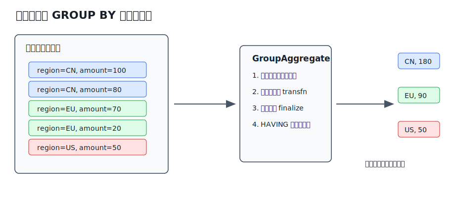
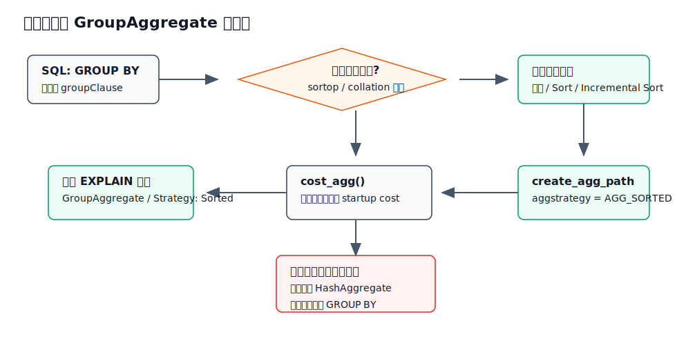
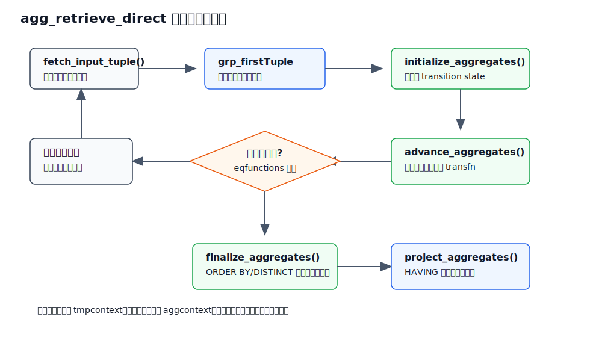
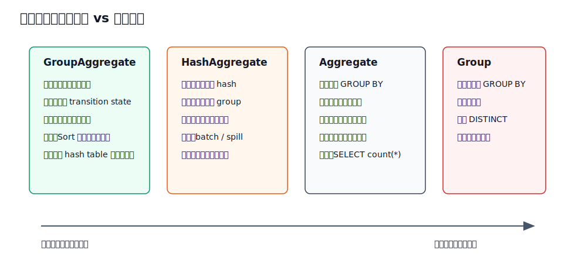

## 数据库筑基课 - GroupAggregate

### 作者
digoal

### 日期
2026-05-30

### 标签
PostgreSQL , 应用开发者 , 数据库筑基课 , 执行算法 , 优化器 , Aggregate , GroupAggregate

----

## 背景

  
数据库筑基课大纲在当前项目中未找到可引用文件，因此本文按“扫描/执行算法”独立成篇。本文以 PostgreSQL 本地源码、官方文档和项目参考文件 `postgres/CLAUDE.md` 为主。用户提供的 DeepWiki 仓库名为 `postgres/postgres`，但本地 DeepWiki CLI 查询返回 `unknown command 'postgres/postgres'`，本文没有把未校验的 DeepWiki 内容作为事实依据。

业务 SQL 里最常见的聚合问题是：

```sql
SELECT region, sum(amount), count(*)
FROM orders
WHERE order_date >= current_date - interval '30 days'
GROUP BY region;
```

开发者通常只看到 `GROUP BY` 的逻辑结果：每个 `region` 输出一行。但数据库执行时必须回答更底层的问题：

1. 输入行是否已经按 `region` 排好序？
2. 如果没有排序，是先排序再流式聚合，还是直接建 hash table？
3. 分组数估计错了，会影响内存、临时文件和计划选择吗？
4. `sum(distinct x)`、`array_agg(x order by t)` 这种聚合内部排序，和 `GROUP BY` 输入排序是不是一回事？
5. 线上 `EXPLAIN` 看到 `GroupAggregate`，应该关注它自己，还是关注它下面的 `Sort`、`Index Scan`、`Incremental Sort`？

`GroupAggregate` 就是 PostgreSQL 计划输出中对 sorted aggregation 的显示名称。源码 `src/backend/commands/explain.c` 把 `Agg` 节点的 `AGG_SORTED` 策略显示为 `GroupAggregate`，而 `src/include/nodes/nodes.h` 对 `AGG_SORTED` 的定义是：分组聚合，输入必须已排序。

这句话很短，但工程含义很重：`GroupAggregate` 不是“更高级的 GROUP BY”，而是“在有序输入上逐组推进 transition state 的聚合执行策略”。

## 一、它解决什么问题？

`GroupAggregate` 解决的是“有序输入上的分组聚合”问题：

```text
输入已经按 GROUP BY 键排列，执行器只需要识别连续分组边界，
对每个分组维护聚合状态，组结束后 finalize 并输出一行。
```

它把聚合问题从“记住所有分组”转化为“只处理当前连续分组”。这带来三个直接收益：

1. **不需要为所有分组常驻 hash table**：同一时刻主要维护当前组的聚合 transition state。
2. **可以利用已有顺序**：如果索引扫描、Merge Join、Incremental Sort 或前序计划已经提供分组键顺序，`GroupAggregate` 可以省掉或减少额外排序成本。
3. **可以较早输出**：一旦某个组结束，就能 finalize 这个组；不必像典型 `HashAggregate` 那样先填完 hash table 再读取结果。

代价也很明确：

1. **输入必须按分组键排序**。如果上游没有顺序，就需要 `Sort` 或 `Incremental Sort`，排序会受 `work_mem` 约束，可能写临时文件。
2. **低基数或高基数并不自动决定胜负**。如果已有合适索引，分组数很多也可能适合 `GroupAggregate`；如果排序成本很高，分组数很少也可能适合 `HashAggregate`。
3. **聚合函数自己的状态可能很大**。`array_agg()`、`json_agg()` 这类 transition state 可以随组内行数增长，`GroupAggregate` 只能减少“同时活跃的组数”，不能让单个大组的状态消失。
4. **聚合内部的 `DISTINCT` / `ORDER BY` 另有排序代价**。`array_agg(x ORDER BY t)` 的排序是聚合函数内部输入排序，不等于 `GROUP BY` 的外部输入顺序。

## 二、它是什么？

在 PostgreSQL 中，`GroupAggregate` 是 `Agg` 计划节点的一种显示名称：

| 源码策略 | EXPLAIN 显示 | 含义 |
|---|---|---|
| `AGG_PLAIN` | `Aggregate` | 没有 `GROUP BY`，所有输入形成一个全局聚合组 |
| `AGG_SORTED` | `GroupAggregate` | 有 `GROUP BY`，输入按分组键排序，逐组聚合 |
| `AGG_HASHED` | `HashAggregate` | 有 `GROUP BY`，用内部 hash table 保存分组状态 |
| `AGG_MIXED` | `MixedAggregate` | grouping sets 场景中排序和 hash 混合使用 |

官方文档对 `GROUP BY` 的语义定义是：把所有在列出列上值相同的行归并成一个 group row；未出现在 `GROUP BY` 中的列不能直接引用，除非它们位于聚合表达式中，或者能由分组键函数依赖地确定。

`GroupAggregate` 是这个语义的一种物理实现。它要求输入流满足：

```text
相同 GROUP BY key 的行必须相邻。
```

有了这个前提，执行器就不需要在内存中查找“这行属于哪个历史 group”。它只要拿当前行和当前组代表行比较分组键：

1. 相等：继续推进当前组的聚合状态。
2. 不相等：当前组结束，finalize 输出；新行成为下一组的第一行。



图 1 说明：`GroupAggregate` 依赖“相同 key 连续出现”。`CN` 的两行先连续输入，聚合成 `CN, 180`；随后 `EU`、`US` 分别形成自己的输出行。如果同一个 key 被打散在输入流不同位置，执行器就会把它们误认为多个组，所以排序前提不是优化建议，而是正确性条件。

## 三、核心原理

### 3.1 从 SQL 到计划名：`AGG_SORTED` 才显示为 `GroupAggregate`

PostgreSQL 的聚合执行由 `src/backend/executor/nodeAgg.c` 负责。文件头部把普通聚合过程概括为：

```text
transvalue = initcond
foreach input_tuple do
    transvalue = transfunc(transvalue, input_value)
result = finalfunc(transvalue, direct_arguments)
```

这个模型适用于 `sum()`、`count()`、`avg()`、`max()` 等绝大多数普通聚合。差异在于“哪些输入行属于同一个聚合状态”：

1. `AGG_PLAIN`：所有输入行属于同一个状态。
2. `AGG_SORTED`：每个连续分组有一套状态。
3. `AGG_HASHED`：每个 hash table entry 有一套状态。

`src/backend/commands/explain.c` 在显示计划时根据 `Agg.aggstrategy` 选择名称：

```text
AGG_PLAIN  -> Aggregate
AGG_SORTED -> GroupAggregate
AGG_HASHED -> HashAggregate
AGG_MIXED  -> MixedAggregate
```

所以看到 `GroupAggregate` 时，应该先翻译成源码语言：

```text
这是一个 Agg 节点，策略是 AGG_SORTED。
```

### 3.2 优化器：什么时候会考虑 sorted aggregation？

优化器主线在 `src/backend/optimizer/plan/planner.c`。对普通 `GROUP BY` 聚合，核心判断可以概括为：

1. `GROUP BY` 表达式必须可排序，优化器才会设置 `GROUPING_CAN_USE_SORT`。
2. 如果存在可用的排序路径，优化器会通过 `make_ordered_path()` 构造或复用有序输入。
3. 对有聚合函数的 `GROUP BY`，优化器调用 `create_agg_path()`，并在排序路径上设置 `aggstrategy = AGG_SORTED`。
4. 如果分组键可 hash 且 `enable_hashagg` 允许，优化器也可能生成 `AGG_HASHED` 候选。
5. 最终路径选择由成本比较决定，而不是由 SQL 写法直接指定。

`src/backend/optimizer/util/pathnode.c` 的 `create_agg_path()` 对 `AGG_SORTED` 还有一个重要行为：它会尽量保留子路径的顺序，但会把为聚合内部 `ORDER BY` / `DISTINCT` 增加的额外 pathkeys 截掉，因为这些列在聚合节点之上不再可见。



图 2 说明：`GroupAggregate` 的出现通常意味着优化器找到了一条“输入可按分组键有序”的路径。这条路径可能来自索引扫描，也可能来自显式 `Sort`，还可能来自 `Incremental Sort`。如果排序不可用、排序成本过高，或者 hash 路径更便宜，最终计划可能改用 `HashAggregate`。

### 3.3 成本模型：已排序输入时，`GroupAggregate` 有低启动成本优势

`src/backend/optimizer/path/costsize.c` 的 `cost_agg()` 明确写着一个关键判断：在该成本模型中，`AGG_SORTED` 和 `AGG_HASHED` 的总 CPU 成本相同，但 `AGG_SORTED` 有更低的 startup cost；如果输入路径已经按要求排序，`AGG_SORTED` 应该被优先考虑，因为它没有 hash table 内存溢出的风险。

这段逻辑可以拆成四个成本来源：

| 成本项 | `GroupAggregate` 如何产生 | 说明 |
|---|---|---|
| 输入路径成本 | 来自子路径 | 子路径可能是 `Index Scan`、`Sort`、`Incremental Sort`、Join 等 |
| transition 成本 | 每个输入 tuple 调用聚合 transition | `sum(amount)` 要逐行推进状态 |
| 分组比较成本 | 每个输入 tuple、每个分组列做比较 | 用于判断是否跨过组边界 |
| final 成本 | 每个输出 group 调用 final function | `avg()` 这类聚合要在最后计算结果 |

注意这里的“输入已排序”不是免费条件。排序成本可能已经包含在子路径里：

```text
Seq Scan -> Sort -> GroupAggregate
```

也可能由索引天然提供：

```text
Index Scan using orders_region_idx -> GroupAggregate
```

或者只需要补齐剩余排序键：

```text
Index Scan on (region) -> Incremental Sort on (region, product_id) -> GroupAggregate
```

读计划时不要只盯着 `GroupAggregate` 节点本身。真正的大头经常在它下面的排序、扫描、Join 和过滤条件。

### 3.4 执行器：`agg_retrieve_direct()` 逐组推进

`ExecAgg()` 会根据当前 phase 的聚合策略分派：

1. `AGG_HASHED` / `AGG_MIXED` 走 hash table 相关路径。
2. `AGG_PLAIN` / `AGG_SORTED` 走 `agg_retrieve_direct()`。

`GroupAggregate` 的核心就在 `agg_retrieve_direct()`。它的工作循环可以概括为：

1. 清理上一组的输出上下文和聚合上下文。
2. 如果没有当前组第一行，就从外层计划取一行，并复制到 `grp_firstTuple`。
3. 初始化当前组的聚合 transition state。
4. 对当前行执行 `advance_aggregates()`，推进所有聚合函数状态。
5. 取下一行，用预先构造的 `eqfunctions` 比较分组键是否相同。
6. 如果相同，继续推进当前组；如果不同，把这行保存为下一组的首行，当前组结束。
7. 调用 `finalize_aggregates()` 计算最终聚合值。
8. 调用 `project_aggregates()` 检查 `HAVING` 并投影输出行。



图 3 说明：`GroupAggregate` 的核心不是“把数据全部读进内存再算”，而是“当前组内推进状态，组边界 finalize”。`tmpcontext` 会在每个输入 tuple 后重置；`aggcontext` 在组边界重扫，用于释放上一组 pass-by-reference transition value，以及触发聚合函数注册的 shutdown callback。

### 3.5 聚合内部排序：不要和 `GROUP BY` 输入排序混淆

有两种排序容易被混在一起：

```sql
-- 外部排序：让 GROUP BY key 连续
SELECT region, sum(amount)
FROM orders
GROUP BY region;

-- 聚合内部排序：每个 group 内 array_agg 的输入要按 order_id 排
SELECT region, array_agg(order_id ORDER BY created_at)
FROM orders
GROUP BY region;
```

`nodeAgg.c` 文件头说明：如果普通 aggregate call 指定了 `DISTINCT` 或 `ORDER BY`，执行器会先排序该聚合的输入并在需要时去重，再执行 transition。源码中 `finalize_aggregates()` 会对 `pertrans->aggsortrequired` 的聚合调用 `process_ordered_aggregate_single()` 或 `process_ordered_aggregate_multi()`。

这意味着：

1. `GroupAggregate` 需要外层输入按 `GROUP BY` 键排序。
2. `array_agg(x ORDER BY y)`、`sum(DISTINCT x)` 还可能在每个 group 内部启动 tuplesort。
3. 这些内部排序同样使用 `work_mem`，并且会增加 CPU、内存和临时文件风险。
4. `nodeAgg.c` 注释说明，带 `DISTINCT` 或 `ORDER BY` 的普通聚合不支持 partial aggregation，因为无法保证全局顺序或全局去重。

### 3.6 Grouping Sets：`AGG_SORTED` 可以表示一个 rollup phase

普通 `GROUP BY a, b` 只需要一套分组键。`ROLLUP`、`CUBE`、`GROUPING SETS` 会更复杂。`nodeAgg.c` 说明：结构上等价于 `ROLLUP(a,b,c)` 的 grouping sets 可以在有序数据上单趟处理，执行器为多个 grouping set 分别维护 transition values，并在不同层级的组边界重置不同集合。

更复杂的 grouping sets 会被拆成多个 phase。源码里的策略包括：

1. `AGG_SORTED`：排序 phase，处理共享同一排序顺序的 rollup。
2. `AGG_HASHED`：hash phase，每个 hashed grouping set 有独立 hash table。
3. `AGG_MIXED`：hash 和 sort 混合，先在某些阶段填 hash table，再读出。

本文主要讲普通 `GroupAggregate`，但线上看到 grouping sets 相关计划时，要知道 `GroupAggregate` 可能只是多 phase 聚合的一部分。

## 四、横向对比



图 4 说明：`GroupAggregate` 最大的优势是复用或构造有序输入后流式处理分组；`HashAggregate` 最大的优势是不要求输入有序。两者不是谁替代谁，而是取决于输入顺序、分组数、单组状态大小、内存限制、并发压力和统计信息质量。

| 维度 | GroupAggregate | HashAggregate | Aggregate | Group |
|---|---|---|---|---|
| PostgreSQL 策略 | `AGG_SORTED` | `AGG_HASHED` | `AGG_PLAIN` | `Group` plan node，不是 `Agg` |
| 主要目标 | 有 `GROUP BY` 的有序流聚合 | 有 `GROUP BY` 的 hash 分组聚合 | 无 `GROUP BY` 的全局聚合 | 有 `GROUP BY` 但无聚合函数的去重式分组 |
| 输入前提 | 相同分组键必须连续 | 分组键可 hash | 无分组键 | 输入通常需要按分组键有序 |
| 内存形态 | 当前组 transition state 为主 | 所有活跃 group 的 hash entry 和 state | 一个全局 transition state | 保存当前分组比较状态 |
| 输出时机 | 组边界后可输出 | 通常填完 hash table 后输出 | 输入读完后输出一行 | 组边界后输出 |
| 主要风险 | 下层排序写临时文件，单个大组状态膨胀 | hash table 超内存、batch、spill、估算错误 | 大状态聚合膨胀 | 排序代价 |
| 适合场景 | 已有顺序、需要稳定内存边界、可利用索引 | 无序大输入、hash 成本低、分组状态可控 | `count(*)`、全表总和 | `SELECT key FROM t GROUP BY key` |
| 不适合场景 | 必须全量大排序且无索引支撑 | 分组数或状态远超内存、hash spill 频繁 | 需要按 key 输出多组 | 需要计算聚合函数 |

解释这张表的关键是：`GroupAggregate` 把“分组定位”交给排序顺序；`HashAggregate` 把“分组定位”交给 hash table。前者的瓶颈常在排序和输入路径，后者的瓶颈常在内存驻留和 hash spill。

## 五、效果如何？

不能脱离 workload 给 `GroupAggregate` 一个固定性能结论。它的效果主要由五个因素决定。

### 5.1 输入是否天然有序

如果有合适索引：

```sql
CREATE INDEX ON orders(region);

SELECT region, sum(amount)
FROM orders
GROUP BY region;
```

优化器可能通过 `Index Scan` 提供 `region` 顺序，再接 `GroupAggregate`。这时 `GroupAggregate` 避免了显式排序，也避免了 hash table 驻留所有分组。

如果没有索引，计划可能变成：

```text
Sort -> GroupAggregate
```

此时排序成本可能是主导因素。排序是否落盘取决于输入行数、行宽、排序键、并发和 `work_mem`。

### 5.2 分组数估算是否准确

官方文档 `planstats.sgml` 给过一个典型例子：单列 `GROUP BY` 的 n-distinct 估计可能很准，但多列 `GROUP BY a, b` 如果缺少多变量统计信息，分组数可能差一个数量级；创建包含 `ndistinct` 的扩展统计信息并 `ANALYZE` 后估算会改善。

对 `GroupAggregate` 来说，分组数影响输出行数、final function 次数、HAVING 选择率和与其他路径的成本比较。对 `HashAggregate` 来说，分组数还直接影响 hash table 大小和 spill 风险。所以同一个估算错误，可能改变优化器在 sorted 和 hashed 之间的选择。

### 5.3 `work_mem` 影响的是排序，不是无限放大 GroupAggregate 内存

官方配置文档说明：`work_mem` 是单个查询操作在写临时文件前可使用的基础内存量，排序、hash table 等操作都受它影响；复杂查询可能同时有多个 sort/hash 操作，多个会话也会并发消耗内存。

对 `GroupAggregate`：

1. 如果下层有 `Sort` 或 `Incremental Sort`，它们受 `work_mem` 影响。
2. 如果聚合函数内部有 `DISTINCT` / `ORDER BY`，内部 tuplesort 也受 `work_mem` 影响。
3. `GroupAggregate` 自己主要维护当前组 transition state，但单个组的 state 仍可能很大。

### 5.4 Startup cost 和流式输出

`cost_agg()` 注释指出，`AGG_SORTED` 可以 on-the-fly 输出，因此 startup cost 低于 hashed 策略。实际业务里，这对上层 `LIMIT`、游标取数、流水式处理有帮助，但不代表它总是总耗时更低。

如果下层必须先完成全量 `Sort`，那排序本身会阻塞早期输出；如果下层是有序索引扫描，`GroupAggregate` 才更接近真正的流式。

### 5.5 并行和 partial aggregation

PostgreSQL 支持 partial aggregation，`nodeAgg.c` 用 `aggsplit` 描述 partial/final、serialize/deserialize、combine 等模式。普通可并行聚合可能先在 worker 中部分聚合，再由上层 finalize。

但带 `DISTINCT` 或聚合内部 `ORDER BY` 的普通聚合不能简单 partial，因为全局去重或全局顺序无法只靠局部 worker 保证。看到并行计划时，要分清：

1. worker 里是否已经做了 partial aggregate。
2. 上层是否还有 `Finalize GroupAggregate` 或类似 finalize 节点。
3. 聚合函数本身是否支持 combine、serialize、deserialize。

## 六、实操 DEMO

当前本地 `postgres` 源码目录下没有发现可直接执行的 `postgres`、`psql` 或 `pg_ctl` 构建产物，因此以下 SQL 没有在本机执行。它们是可复制到 PostgreSQL 环境中验证的最小实验脚本，不包含伪造的 `EXPLAIN ANALYZE` 输出。

### 6.1 用索引顺序触发 GroupAggregate

```sql
DROP TABLE IF EXISTS demo_orders;

CREATE TABLE demo_orders (
  id          bigserial PRIMARY KEY,
  region      text NOT NULL,
  product_id  int  NOT NULL,
  amount      numeric(12,2) NOT NULL,
  created_at  timestamptz NOT NULL DEFAULT now()
);

INSERT INTO demo_orders(region, product_id, amount)
SELECT
  CASE g % 4 WHEN 0 THEN 'CN' WHEN 1 THEN 'EU' WHEN 2 THEN 'US' ELSE 'APAC' END,
  (g % 100),
  (g % 1000)::numeric / 10
FROM generate_series(1, 100000) AS g;

ANALYZE demo_orders;

CREATE INDEX demo_orders_region_idx ON demo_orders(region);

SET enable_hashagg = off;

EXPLAIN (ANALYZE, BUFFERS)
SELECT region, count(*), sum(amount)
FROM demo_orders
GROUP BY region;
```

验证点：

1. 计划中应关注是否出现 `GroupAggregate`。
2. 如果下层是 `Index Scan using demo_orders_region_idx`，说明索引提供了分组键顺序。
3. 如果仍然出现 `Sort`，说明优化器认为扫描路径、成本或覆盖列选择使显式排序更合适。
4. `SET enable_hashagg = off` 是为了观察 sorted aggregation，不是生产建议。

### 6.2 观察 Sort + GroupAggregate

```sql
RESET enable_hashagg;
DROP INDEX IF EXISTS demo_orders_region_idx;
ANALYZE demo_orders;

SET enable_hashagg = off;

EXPLAIN (ANALYZE, BUFFERS)
SELECT region, count(*), sum(amount)
FROM demo_orders
GROUP BY region;
```

验证点：

1. 没有索引顺序时，常见形态是 `Sort -> GroupAggregate`。
2. `EXPLAIN ANALYZE` 中如果 `Sort Method` 显示 external merge 或磁盘使用，就说明排序写了临时文件。
3. 增大 `work_mem` 可能减少排序落盘，但要乘以并发会话和单个查询内多个 sort/hash 操作评估总内存。

### 6.3 多列分组和扩展统计信息

```sql
RESET enable_hashagg;

EXPLAIN
SELECT region, product_id, count(*)
FROM demo_orders
GROUP BY region, product_id;

CREATE STATISTICS demo_orders_region_product_ndistinct (ndistinct)
ON region, product_id
FROM demo_orders;

ANALYZE demo_orders;

EXPLAIN
SELECT region, product_id, count(*)
FROM demo_orders
GROUP BY region, product_id;
```

验证点：

1. 比较两次计划里聚合节点的估计 rows。
2. 多列分组估算错时，可能影响 `GroupAggregate` 与 `HashAggregate` 的选择。
3. 扩展统计信息不是为了强制某个计划，而是为了让优化器更接近真实分组数。

### 6.4 聚合内部 ORDER BY 的额外成本

```sql
SET enable_hashagg = off;

EXPLAIN (ANALYZE, BUFFERS)
SELECT region, array_agg(id ORDER BY created_at)
FROM demo_orders
GROUP BY region;
```

验证点：

1. 外层 `GroupAggregate` 只说明输入按 `region` 分组处理。
2. `array_agg(id ORDER BY created_at)` 还要求每个 group 内部按 `created_at` 排序。
3. 这类 SQL 的内存和临时文件风险不只来自外层 `Sort`，还来自聚合内部 tuplesort。

## 七、最佳实践

### 面向数据库架构师

1. 如果核心报表长期按固定维度聚合，可以考虑让索引顺序服务聚合路径，例如 `(tenant_id, day)`、`(region, product_id)`。不要只按过滤条件建索引，也要看聚合维度是否能提供有序输入。
2. 把 `GroupAggregate` 和 `HashAggregate` 当成资源模型差异，而不是性能高低标签。前者偏排序流式，后者偏 hash 驻留。
3. 对高并发报表系统，评估 `work_mem` 时要按“单查询多个操作 × 并发会话”估算。一个计划里可能同时有 Sort、Hash Join、HashAggregate、聚合内部排序。
4. 对多列分组、强相关维度、租户隔离数据，优先建立扩展统计信息并保持 `ANALYZE` 及时，而不是靠调大内存掩盖估算错误。

### 面向 DBA

1. 读慢 SQL 计划时，从 `GroupAggregate` 往下看：是否有 `Sort`？排序是否落盘？下层扫描是否过滤过晚？是否本可以利用索引顺序？
2. 如果计划选择 `HashAggregate` 且频繁 spill，可以对比强制关闭 `enable_hashagg` 的实验计划，判断 sorted aggregation 是否更稳定。但不要把 `enable_hashagg=off` 当作全局解决方案。
3. 使用 `EXPLAIN (ANALYZE, BUFFERS)` 时关注估计 rows 与 actual rows 的偏差。聚合节点 rows 估计严重错误，通常意味着 distinct/ndistinct 统计或过滤选择率有问题。
4. 排查聚合内部 `DISTINCT` / `ORDER BY`。很多临时文件并不是外层 `GROUP BY` 排序造成的，而是每个 group 内部的聚合输入排序造成的。

### 面向业务开发者

1. 不要为了“看起来快”随意加 `ORDER BY`。`GROUP BY` 的输出顺序不是 SQL 语义保证；如果业务需要稳定输出顺序，显式写 `ORDER BY`，并接受它的排序成本。
2. 把选择性过滤写清楚，让 `WHERE` 尽早减少输入行。聚合前少一行，transition、比较、排序或 hash 都少一份成本。
3. 小心 `array_agg()`、`json_agg()` 把大组聚成超大状态。即使是 `GroupAggregate`，单个大组也可能占用大量内存。
4. 多租户表做聚合时，尽量把 `tenant_id` 放进过滤和分组建模中。否则一次聚合可能跨租户扫描和排序，影响资源隔离。

## 八、适合与不适合场景

适合 `GroupAggregate` 的场景：

1. 输入已经按分组键有序，例如有匹配索引或上游 Merge Join/Sort 正好提供顺序。
2. 希望避免 `HashAggregate` 在高分组数下的 hash table 内存压力。
3. 聚合结果可以随组边界逐步输出，且下层不需要全量阻塞排序。
4. grouping sets / rollup 可以共享排序顺序，执行器能够单趟处理多个层级。
5. 线上资源瓶颈主要是 hash spill 或内存抖动，而排序路径可控。

不适合或要谨慎的场景：

1. 没有任何可用顺序，必须对超大宽表做全量排序。
2. 分组键排序代价远高于 hash 分组，且 hash table 能稳定放入内存。
3. 单个 group 极大，聚合 transition state 会膨胀，例如无限制的 `array_agg()`、`json_agg()`。
4. 聚合内部有多个 `DISTINCT` / `ORDER BY`，每组内部排序成本很高。
5. 统计信息陈旧，优化器误以为排序输入很小或分组数很少。

## 九、常见坑

1. **看到 `GroupAggregate` 就以为没有排序成本**  
   错。排序成本可能藏在子节点 `Sort` 或 `Incremental Sort`，也可能通过索引扫描成本体现。

2. **把 `work_mem` 当成只影响 HashAggregate 的参数**  
   错。官方文档明确说 sort 和 hash 操作都受 `work_mem` 影响；Hash-based 操作还会受 `hash_mem_multiplier` 影响。

3. **忽略多列分组统计误差**  
   `GROUP BY a, b` 的真实组合数不等于单列 distinct 的简单乘法。强相关列要考虑扩展统计信息。

4. **用 `enable_hashagg=off` 修生产问题**  
   这只适合诊断或局部会话实验。全局关闭会影响大量查询，可能让本来适合 hash 的聚合被迫排序。

5. **误以为 `GROUP BY` 输出天然有序**  
   SQL 结果顺序只由 `ORDER BY` 保证。`GroupAggregate` 可能保留某些 pathkeys，但业务不能依赖未声明的输出顺序。

6. **混淆外部排序和聚合内部排序**  
   `GROUP BY region` 的排序服务于分组边界；`array_agg(x ORDER BY t)` 的排序服务于聚合函数输入顺序。两者不是一回事。

7. **只看聚合节点，不看前置行数膨胀**  
   聚合通常在 join/filter 之后执行。真正的问题可能是 join 顺序错误、过滤条件下推失败或统计信息导致上游行数爆炸。

## 十、扩展问题

1. 为什么 `AGG_SORTED` 输入必须满足“相同 key 连续”，而不是只要求最终输出有序？
2. 如果 `GROUP BY a, b` 有索引 `(a)`，`Incremental Sort` 什么时候比全量 `Sort` 更有价值？
3. 为什么 `sum(DISTINCT x)` 不容易做 partial aggregation？
4. `HashAggregate` spill 和 `Sort` spill 在 I/O 形态上有什么不同？
5. 如果一个租户占 90% 数据、其他租户很小，同样的 `GROUP BY tenant_id, day` 会怎样影响分组数估算？
6. `GroupAggregate` 上方再接 `ORDER BY` 时，什么时候可以复用已有顺序，什么时候还要再排序？
7. 在列存或向量化执行引擎中，sorted aggregation 和 hash aggregation 的取舍会发生什么变化？

## 十一、扩展阅读

1. PostgreSQL 源码：`src/include/nodes/nodes.h`  
   `AggStrategy` 定义，说明 `AGG_SORTED` 是“grouped agg, input must be sorted”。

2. PostgreSQL 源码：`src/backend/commands/explain.c`  
   `AGG_SORTED` 在 `EXPLAIN` 中显示为 `GroupAggregate`，`AGG_HASHED` 显示为 `HashAggregate`。

3. PostgreSQL 源码：`src/backend/executor/nodeAgg.c`  
   聚合执行器核心，包括 transition/final function 调用、`agg_retrieve_direct()`、grouping sets、聚合内部 `DISTINCT` / `ORDER BY` 排序、partial aggregation 和 hash aggregation spill 说明。

4. PostgreSQL 源码：`src/backend/optimizer/plan/planner.c`  
   grouping path 生成、`make_ordered_path()`、`GROUPING_CAN_USE_SORT` / `GROUPING_CAN_USE_HASH`、`AGG_SORTED` 路径创建逻辑。

5. PostgreSQL 源码：`src/backend/optimizer/util/pathnode.c`  
   `create_agg_path()`、`create_groupingsets_path()`，说明 sorted aggregation 如何保留 pathkeys，以及 grouping sets 如何组合 sorted/hash phase。

6. PostgreSQL 源码：`src/backend/optimizer/path/costsize.c`  
   `cost_agg()` 成本模型，说明 `AGG_SORTED` 和 `AGG_HASHED` 的 CPU 成本关系、startup cost 差异和内存溢出风险考虑。

7. PostgreSQL 官方文档：`doc/src/sgml/queries.sgml`  
   `GROUP BY`、`HAVING`、函数依赖、grouping sets 的 SQL 语义。

8. PostgreSQL 官方文档：`doc/src/sgml/config.sgml`  
   `work_mem`、`hash_mem_multiplier`、`enable_hashagg`、`enable_incremental_sort`、`enable_group_by_reordering` 参数说明。

9. PostgreSQL 官方文档：`doc/src/sgml/planstats.sgml`  
   多列 `GROUP BY` 的 n-distinct 估算和扩展统计信息示例。

10. PostgreSQL 官方文档：`doc/src/sgml/perform.sgml`  
    `Sort`、`Incremental Sort`、`EXPLAIN ANALYZE` 中排序方法和内存使用的说明。

## 附录 
1、克隆代码  
```  
git clone --depth 1 https://github.com/postgres/postgres
```  
  
2、启用 codex, 使用 [数据库筑基课 skill](../skills/README.md).  
```
文章标题: 
  数据库筑基课 - GroupAggregate
项目源码(本地目录):  
  postgres
项目 codebase 文件名: 
  postgres/CLAUDE.md
deepwiki MCP 使用项目 repoName: 
  postgres/postgres
```
  
  
#### [PostgreSQL 解决方案集合](../201706/20170601_02.md "40cff096e9ed7122c512b35d8561d9c8")
  
  
#### [德哥 / digoal's Github - 公益是一辈子的事.](https://github.com/digoal/blog/blob/master/README.md "22709685feb7cab07d30f30387f0a9ae")
  
  
#### [About 德哥](https://github.com/digoal/blog/blob/master/me/readme.md "a37735981e7704886ffd590565582dd0")
  
  

  
