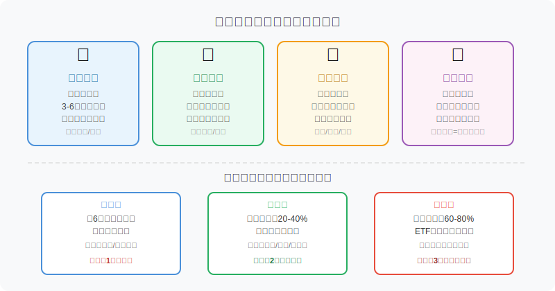
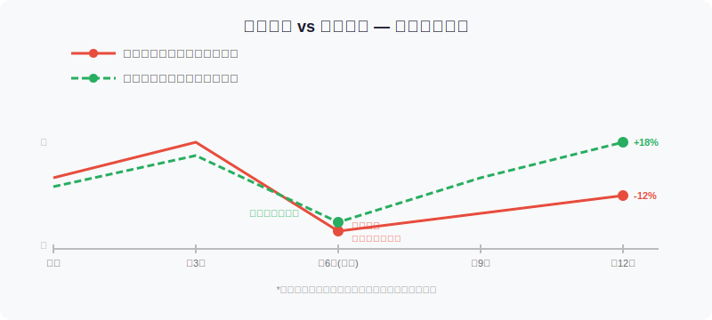
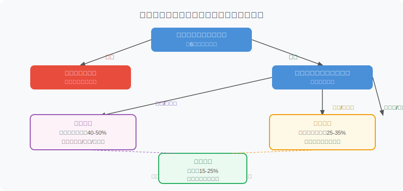

## 散户投资小白金融全品种操盘手册 - 3.1 现金不是浪费，是投资系统的氧气
  
### 作者  
digoal  
  
### 日期  
2026-05-30  
  
### 标签  
金融产品 , 金融工具 , 散户 , 投资小白 , 全品操盘手册  
  
----  
  
## 背景 
  

## 先问你一个问题

2022年10月，A股沪深300指数跌到年内低点。当时，绝大多数满仓持有的投资者已经亏损超过20%，账户浮亏让人看都不想看。而那些手上还留着30%现金的人，做了什么？——他们在那个月分批买入，到2023年2月行情反弹时，净收益跑赢前者超过15个百分点。

现金，不是你的失败，而是你的武器。

那为什么大多数小白都拿不住现金？答案很简单：**看着别人赚钱，手里的钱像烫手山芋**。这种心理，我们之后在第十六章会专门讲，但今天这一节，我们先解决一个更根本的认知问题——

**现金在投资系统里究竟是什么角色？**

---

## 现金的四重角色

很多人以为现金只有一个意义：没花出去的钱，等着变成投资的钱。错。现金在一个完整的投资系统里，同时承担四件事：

**第一重：维持生存（应急备用金）**

这部分钱不属于投资系统，它叫"生活钱"。不管市场怎么跌，它都不能动。如果你因为某月急需用钱而被迫卖出亏损的股票，那不叫投资失败，那叫系统设计有缺陷——你根本不应该把生活钱放进股市。

一般建议保留3到6个月的生活开支，放在活期存款或货币基金里随时可取。

**第二重：等待机会（战略现金仓）**

这部分钱属于投资系统，但它的职责是"等"。好的投资机会不是天天有，市场大跌时才是黄金买点。没有子弹的士兵，看着敌人送命也只能干瞪眼。

这部分现金不是因为你没想好买什么而"闲置"，而是你主动选择保留的战略储备。

**第三重：降低波动（组合防守层）**

假设你有100元，50元买了股票，50元放在货币基金。股票跌了20%，你的总账户亏了10%，而不是20%。这就是现金的减震效果。它不会让你赚更多，但它让你在市场剧烈波动时"活下去"，不被迫在最糟糕的时间点做出糟糕的决定。

**第四重：保持理性（心理缓冲垫）**

这一点很少有人提，但非常关键。账户全是股票的人，在市场下跌时会极度恐慌，因为他们没有退路，每一分钱的亏损都真实可感。而手里有30%现金的人，心态完全不同——跌了，我还有子弹；涨了，我的仓位也在赚。**持有现金等于持有选择权**，而选择权是有价值的。

---

## 第一性原理分析："现金是成本"这个观念哪里错了？

很多人这样算账：货币基金年化2%，沪深300历史年化回报约9%，所以持有现金每年"损失"7%的机会成本。这个逻辑看似合理，但它有三个隐藏前提：

**【前提清单】**

支撑"满仓持股优于持有现金"成立需要以下前提：

- **前提A**：市场走势可以预测，且未来12个月是上涨的 → 【变量】→ 没有人能稳定预测市场方向，这个前提根本不成立
- **前提B**：你不会在持仓期间遇到需要用钱的情况 → 【变量】→ 生活是不可控的，失业、医疗、家庭突发事件随时出现
- **前提C**：你在账户亏损时能保持理性，不在底部恐慌卖出 → 【变量】→ 大量行为金融学研究证明，大多数人做不到

**【情景推演】**

正常情景（三个前提全部成立）：满仓跑赢现金仓，机会成本论成立。

压力情景（前提C被推翻，恐慌卖出）：在-20%时卖出，货币基金同期+2%，实际损失差距超过22个百分点，远大于持有现金的"机会成本"。对应操作调整：降低仓位至让自己能睡着觉的水平。

极端情景（前提A+C被推翻，市场持续下跌且恐慌卖出）：2015年股灾、2022年熊市期间，满仓者的实际体验是：最高亏损40-50%，且在错误时间点割肉，彻底锁死亏损。对应操作：熊市或估值偏高时，现金仓位应提升至40%以上。

**结论：现金的机会成本是真实的，但它只是账面数字；满仓的下行风险是真实的，且可能是无法挽回的行为损失。**

---

## 两种命运：一张图说清楚

图中模拟了两类投资者面对同一轮行情的结果差异：满仓操作者在急跌时只能被动承受，若情绪崩溃割肉，损失永久锁定；而保留30%现金的投资者，在急跌时反手加仓，最终在反弹中多赚了一截。

这不是理论，是2022年A股熊市中反复发生的真实场景。中国基金业协会2023年度数据显示，个人投资者自主操作账户的年化亏损中，超过60%的亏损来源于"情绪性操作"——其中最主要的两种是：追涨（满仓追高）和割肉（底部清仓）。保留现金，是减少这两种行为发生概率的结构性手段。

---

## 三桶钱框架：你的现金应该怎么分

搞清楚了现金的角色，下一步是把钱分好。我把现金管理分成三个"桶"：

**第一桶：生活钱**

- **是什么**：未来3-6个月的必要生活开销（房租/房贷、日常餐饮、水电网、必要交通）
- **放哪里**：活期存款或货币基金（如余额宝、微信零钱+），随时可取
- **核心原则**：绝不动用，不参与任何投资，不追求收益
- **典型错误**：把这桶钱投进了股市，急用时被迫亏损卖出

**第二桶：防守钱**

- **是什么**：可投资金额的20%-40%，视市场环境调整
- **放哪里**：货币基金、短债基金、国债逆回购（后面几节会详细讲）
- **核心原则**：不是无用，是"待命"；等市场给出好机会时，它就是你的子弹
- **什么时候调整比例**：市场估值偏高时多留，市场大跌后估值合理时可以少留

**第三桶：进攻钱**

- **是什么**：可投资金额的60%-80%，参与真正的投资品种
- **放哪里**：ETF、股票、可转债、REITs、黄金等
- **核心原则**：这部分钱要能承受亏损20-30%而不影响你的生活和心态；如果承受不了，说明这桶钱比例太大了

---

## 实操例子：小王的三桶钱怎么分

**场景设定**：小王月入15000元，固定开销约6000元/月，已工作3年，可投资金额共20万元，目前全部放在股票账户，持仓亏损约15%。

**现状问题诊断**：
- 生活钱没有单独分开，若遇急用只能卖股票
- 防守钱为零，无法在市场回调时加仓
- 心理压力大，经常夜里睡不好，几次想在低点全部卖出

**第一步**：先把生活钱挪出来。月开销6000×6个月=36000元。从股票账户卖出3.6万元，存入专用活期账户（或货币基金），只用于日常周转，非紧急情况不动。

**第二步**：剩余可投资金额约16.4万元。当前市场处于震荡偏弱阶段（假设沪深300 PE约13倍，历史平均约14倍），建议防守仓位25%-30%。因此拿出约4万元转入货币基金/短债基金，保持随时可调入的灵活性。

**第三步**：剩余约12万元作为进攻仓，继续持有现有股票/ETF。因为仓位降低了，即使继续下跌10%，实际账户损失只影响12万，而不是全部20万。

**结果对比**：
- 调整前：账面亏15%，生活钱风险暴露，心理压力极大，随时可能割肉
- 调整后：生活有保障，有子弹等机会，即使继续下跌也能扛住，夜里能睡着

**如果操作错误**（没有分桶，继续满仓）：下个月公司裁员，需要急用钱，只能在亏损状态下卖出，亏损从账面变成永久实际亏损。

---

## 现金比例的动态调整：不是设好就不动

很多人误解"持有现金"是一个静态决策。其实现金仓位应该随市场环境动态调整：

| 市场环境 | 建议防守钱比例 | 理由 |
|----------|----------------|------|
| 牛市初期（估值低+趋势向上）| 15%-20% | 机会多，少留现金，多参与 |
| 牛市中后期（估值偏高）| 25%-35% | 开始蓄力，为回调做准备 |
| 震荡市（方向不明）| 25%-35% | 保持灵活，等待信号 |
| 熊市（估值高+趋势向下）| 35%-50% | 防守为主，子弹留足等大跌 |
| 市场大跌后（急跌10%+）| 降低至15%-25% | 开始分批用子弹买入 |

注意：这里说的比例是防守钱占可投资金额的比例，不是你所有资产的比例。生活钱永远单独隔离。

---

## 可复用框架

**【三桶钱框架】**

适用场景：任何时候评估自己的资金结构是否健康。

核心逻辑：把钱按功能分层，每一层有不同的使命和工具，不混用。

操作步骤：
1. 算清楚月固定开销，乘以6，这是生活钱的下限
2. 算清楚可投资金额总额，乘以当前市场环境对应的防守比例，这是防守钱
3. 剩余才是进攻钱，只用这部分参与高风险投资

举一反三：这个框架不仅适用于股票投资，同样适合你评估要不要买房（首付是生活钱还是进攻钱？）、要不要做生意（创业资金动用了防守钱吗？）。

---

**【现金时机框架】**

适用场景：判断当前是应该增加还是减少现金仓位。

核心逻辑：市场越贵、越疯狂，手里留的现金越多；市场越便宜、越恐慌，手里留的现金越少。

操作步骤：
1. 查当前市场主要指数的历史估值分位（如沪深300 PE历史分位）
2. 估值在历史30%以下 → 防守钱比例下调5-10%，多参与
3. 估值在历史70%以上 → 防守钱比例上调5-10%，多保留
4. 估值居中 → 维持当前比例，不做大调整

举一反三：这个框架同样适用于黄金、债券ETF的仓位决策，不只是股票。

---

## 本节行动清单

1. **今天就做**：检查你是否有单独的"生活钱"账户，如果没有，计算6个月生活开支，把这笔钱从投资账户分离出来。

2. **本周内做**：对照三桶钱框架，盘点自己目前的生活钱、防守钱、进攻钱各占多少，找出哪个桶空了或者比例不合理。

3. **理解并记住**：现金仓位不是固定的，应该根据市场估值环境每季度检视一次，必要时调整。

4. **避免做的事**：不要因为"货币基金利率低"就把全部可投资金投进市场。2%的现金回报是成本，不是损失。

5. **与下一节衔接**：搞清楚了要留多少现金之后，下一节我们来讲现金放哪里最合适——货币基金怎么选、有哪些注意事项。

---

## 一句话总结

**现金是你的氧气——你不靠它活着，但没有它你会窒息。**

---

---

> ⚠️ **声明**：本文内容为投资教育目的，所有历史数据、策略框架均为辅助学习工具，不构成证券投资建议。市场有风险，投资需谨慎。实际操作请结合自身风险承受能力，必要时咨询专业投顾。
  
#### [PostgreSQL 解决方案集合](../201706/20170601_02.md "40cff096e9ed7122c512b35d8561d9c8")
  
  
#### [德哥 / digoal's Github - 公益是一辈子的事.](https://github.com/digoal/blog/blob/master/README.md "22709685feb7cab07d30f30387f0a9ae")
  
  
#### [About 德哥](https://github.com/digoal/blog/blob/master/me/readme.md "a37735981e7704886ffd590565582dd0")
  
  

  
