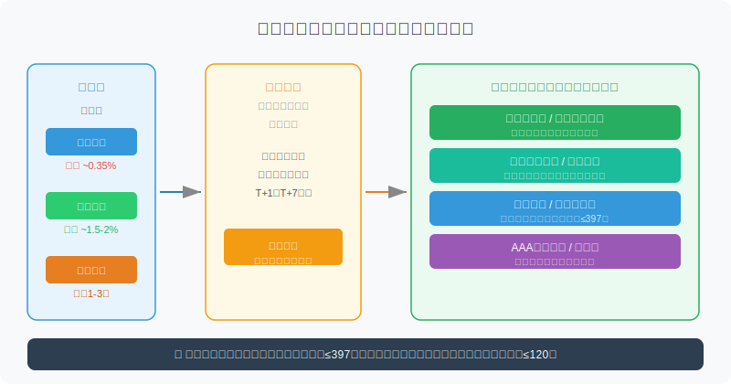
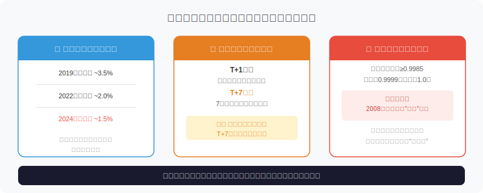
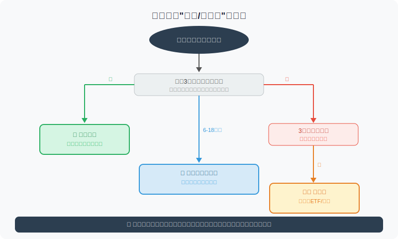

## 散户投资小白金融全品种操盘手册 - 3.2 货币基金 —— 适合什么钱，不适合什么预期
  
### 作者  
digoal  
  
### 日期  
2026-05-30  
  
### 标签  
金融产品 , 金融工具 , 散户 , 投资小白 , 全品操盘手册  
  
----  
  
## 背景 
  

## 先问你一件你可能从没想过的事

你手机里有多少钱躺在活期账户？

2024年末，中国居民活期存款余额约36万亿元，平均利率0.1%~0.35%。与此同时，货币基金的年化收益率虽然从2019年的3.5%降到了现在的1.5%~2%，但仍是活期利率的4~6倍。

换句话说：**每100万元的活期储蓄，每年因为"懒得动"大约少拿1万~1.6万元**。

这还不是最关键的——更大的问题是，很多人对货币基金有两种相反的误解：要么觉得"余额宝那种东西收益太低，不值得研究"，要么觉得"货币基金跟银行存款一样，完全没风险"。

两个误解都会让你用错它。

这节课我们要搞清楚：货币基金到底是什么、收益从哪来、有哪些真实风险，以及最重要的——**什么钱该放里面，什么钱不该放**。

---

## 货币基金是什么：你是出借方，银行和机构是借款方

很多人以为货币基金只是一种"更好的存款"，实际上它们是完全不同的法律关系。

**银行存款**：你把钱存进去，银行记一笔负债，受存款保险保障（最高50万元）。

**货币基金**：你购买基金份额，基金公司把所有人的钱汇集起来，统一购买短期低风险金融工具，每天产生利息收益，分摊给你。你是基金持有人，不是银行存款人。

这个区别很重要，后面讲风险时会用到。

货币基金只能投资以下几类资产（监管规定）：
- 剩余期限不超过397天的债券
- 银行定期存款、大额存单
- 国债逆回购
- 短期融资券、商业票据（信用评级要求很高）

投资组合的平均剩余期限不得超过120天，这就保证了基金的流动性——你赎回时，基金很快能变现。

**收益的本质**：机构市场的利率往往高于散户利率。你一个人去银行存10万元，能拿到的利率很有限；但基金公司汇集几千亿元，就可以做银行同业存款、买机构专属利率产品，拿到普通人拿不到的收益，再分给你。这就是规模效应的价值。

---

## 货币基金的核心特性：三个"好"，三个"真相"

### 三个"好"

**第一：流动性好**。大多数货币基金T+1赎回（申请赎回后次日到账），部分产品有快速赎回通道（几乎实时到账，单日限额通常1万~5万元）。和定期存款相比，货币基金完胜。

**第二：门槛低**。1元起购，随时买入，随时赎回，没有手续费（申购/赎回费均为0）。

**第三：收益稳定**。在正常市场环境下，净值每天向上走，像计息一样累积，不存在"今天买高了明天亏损"的问题。

### 三个"真相"（比"好"更重要）

**真相一：收益率会随市场利率下行**

货币基金的收益率不是固定的，它跟着市场短期利率走。

以余额宝为例：2014年最高时年化6%+，2019年约3.5%，2022年约2%，2024年底约1.5%。这个趋势背后是中国整体利率下行的大环境，不会因为你"期待高一点"而改变。

实操含义：**不要把货币基金当作"稳定拿2%+"的工具**。它的收益率是浮动的，在利率下行周期，你的收益预期应该同步下调。

**真相二：赎回时间因产品而异，紧急用钱要分清楚**

市面上主要有三种形态：
- **T+0快速赎回**：当日到账，一般限额1万~5万元，超出部分T+1
- **T+1标准赎回**：申请后次日到账（余额宝、微信零钱通等大多是这个）
- **T+7赎回**：部分银行代销或场外货基，7个工作日后到账

这不是小事。如果你急需一笔30万的装修首付，T+7的货基会让你等1.4个工作周。**在买入前，一定要看清楚赎回规则，特别是你的"应急备用金"。**

**真相三：不受存款保险保障，极端情况下理论上可能亏本**

监管规定货币基金净值不得低于0.9985，但这不等于0亏损保证。2008年美国Reserve Primary Fund因持有雷曼兄弟债券发生亏损，净值跌破1美元（市场称为"破钱"，breaking the buck），引发大规模赎回挤兑。中国自1998年货基出现至今，尚未出现本金亏损案例，但"没有发生"不等于"不可能发生"。

正确理解：**货币基金是极低风险，不是零风险；是保守型工具，不是等价于银行存款。**

---

## 第一性原理分析：货币基金赚钱的前提是什么？

**【前提清单】**

支撑"货币基金提供稳定低风险收益"成立，需要以下前提：

- **前提A：被投资机构不违约** → 【常量，极强】→ 投资标的仅限高信用等级，且以银行同业存款为主，系统性违约概率极低
- **前提B：市场保持基本流动性** → 【常量，正常市场成立】→ 2020年3月全球流动性危机时，部分美国货基出现赎回压力，但中国监管有应急机制
- **前提C：短期利率保持一定水平** → 【变量】→ 如果央行持续降息，货基收益会进一步下降；如果短期利率降到0.5%以下，货基与活期几乎没有差异

**【情景推演】**

| 情景 | 市场环境 | 货基收益率 | 结论 |
|------|----------|------------|------|
| 正常情景（前提全部成立）| 短期利率1.5%-3% | 1.2%-2.5% | 适合停放短期资金 |
| 压力情景（前提C动摇）| 短期利率趋近0 | 0.5%以下 | 与活期存款无显著差异，应考虑转向短债基金 |
| 极端情景（前提A+B动摇）| 系统性信用危机 | 可能无法及时赎回 | 持有黄金、国债实物等资产比货基更安全 |

**对应操作调整**：
- 长期利率下行趋势下，货基配置比例无需调整，但收益预期应同步降低
- 如果发现货基7日年化持续低于1%，可将部分资金移至短债基金（下一节讲）
- 极端信用危机时优先持有现金和黄金，货基不是终极避险工具

---

## 什么钱该放，什么钱不该放

**适合放货币基金的钱（三类）：**

**① 应急备用金**：3~6个月的生活开销，随时可能动用，放在T+1货基里。这笔钱的要求是：安全、流动性好、不需要高收益。货币基金完美符合。

**② 待投资的"子弹钱"**：你手里有50万准备分批买ETF或可转债，在等机会的这几个月，放货基比放活期划算。

**③ 确定近期要用的大额资金**：买车、交学费、交房租押金这种有明确用途的资金，放货基收益比活期好，且流动性足够。

**不适合放货币基金的钱（三类）：**

**① 3年以上不用的长期投资资金**：长期放货基是机会成本的浪费。年化1.5%的货基，跑不过长期通胀，更跑不过你认知范围内合理的ETF组合。

**② 追求超过2%收益的投资预期**：如果你的目标是"至少4%"，那货基根本达不到，不应当作主力资产。去看短债基金、债券ETF或红利ETF（后面各有详细章节）。

**③ 误以为货基可以替代保险或养老金的规划资金**：货基解决不了20年后的养老问题，它是现金管理工具，不是长期财富积累工具。

---

## 主流货币基金对比（2024年数据参考）

| 产品 | 平台 | 赎回时效 | 快速赎回限额 | 近1年年化（参考） |
|------|------|----------|--------------|-----------------|
| 余额宝（天弘基金） | 支付宝 | T+1，部分T+0 | 1万元/日 | 约1.50% |
| 微信零钱通 | 微信 | T+0（华夏现金增利等） | 5万元/日 | 约1.48% |
| 南方天天利 | 南方基金官方 | T+1 | 无快速通道 | 约1.55% |
| 华宝添益（511990） | A股交易所场内 | 实时到账 | 无限额 | 约1.45%（场内） |

> 数据来源：各基金公司官网及东方财富数据，截至2024年12月，历史数据不代表未来。

**特别提一下华宝添益（511990）**：这是场内交易的货基ETF，在交易日可以像买股票一样在二级市场买卖，流动性极佳。对有证券账户的人来说，是备用金的好去处，但要注意场内价格可能略有折溢价。

---

## 实操例子：月薪2万，刚工作3年的小王怎么配

**场景**：小王，月薪2万，工作3年，存款28万，无房贷，希望"钱不要乱放"。

| 资金用途 | 金额 | 建议放哪里 | 理由 |
|----------|------|------------|------|
| 应急备用金（3个月支出） | 6万 | T+1货基 | 随时可取，覆盖突发状况 |
| 近6个月预期支出（旅游、换机等） | 3万 | T+0货基 | 可能短期动用，要快取 |
| 等待投资机会的"子弹" | 9万 | T+1货基 | 等ETF跌到合理位置再分批买 |
| 长期投资资金 | 10万 | 不应放货基 | 这笔钱应该买ETF/债券，货基是浪费 |

**第一步**：在支付宝/微信开通货基，将6万+3万共9万元分别放入对应产品。

**第二步**：长期的10万，先确认自己的投资目标和风险承受能力（第一章的内容），再决定买什么——这部分货基帮不了你。

**第三步**：每季度检查一次货基收益率趋势。如果7日年化连续1个月低于1%，考虑把其中5~6万元移到短债基金，收益可能提升0.3~0.5个百分点（下一节介绍）。

**如果操作错误**：小王把全部28万放进货基，年化1.5%，每年利息约4200元，但其中10万原本可以放ETF组合，历史长期年化6~8%，意味着每年白白少了约4500~6500元的收益差距。时间越长，复利差距越大。

---

## 可复用框架

**【三桶水分类法】**

适用场景：不知道自己的钱该放哪里时

核心逻辑：按"用钱时间"而非"钱的多少"分类，不同时间维度对应不同工具

操作步骤：
1. 算出你近6个月内可能动用的钱（应急+近期开销），这是第一桶——放货基
2. 算出你1~3年内有明确计划的钱（买房首付、创业资金等），这是第二桶——放短债/存款
3. 剩余的长期资金，这是第三桶——才考虑ETF/股票/更高风险资产

举一反三：这个框架不只适用于货基选择，所有资金规划的第一步都是"分桶"，后面讲可转债、ETF、美股时，你的仓位都应该来自第三桶，绝不能挪第一桶。

---

## 本节行动清单

- [ ] 查一下你现在活期账户余额，计算如果移入货基，一年多拿多少利息
- [ ] 确认你常用的货基产品的赎回时效（T+0/T+1/T+7），特别是应急备用金那笔
- [ ] 按"三桶水"框架，把你现有存款重新分一次类，看看哪些钱放错了地方
- [ ] 记住：货基里的钱不是"投资资金"，不要因为"放着可惜"就频繁挪动追热点
- [ ] 如果你的货基7日年化持续在1.2%以下，标记下来，下一节学短债基金后再做判断

---

## 一句话总结

**货币基金是现金管理工具，不是投资工具；适合放"快用的钱"，不适合寄托"高收益的期望"。**

---

> ⚠️ **声明**：本文内容为投资教育目的，所有历史数据、策略框架均为辅助学习工具，不构成证券投资建议。市场有风险，投资需谨慎。实际操作请结合自身风险承受能力，必要时咨询专业投顾。
  
#### [PostgreSQL 解决方案集合](../201706/20170601_02.md "40cff096e9ed7122c512b35d8561d9c8")
  
  
#### [德哥 / digoal's Github - 公益是一辈子的事.](https://github.com/digoal/blog/blob/master/README.md "22709685feb7cab07d30f30387f0a9ae")
  
  
#### [About 德哥](https://github.com/digoal/blog/blob/master/me/readme.md "a37735981e7704886ffd590565582dd0")
  
  

  
