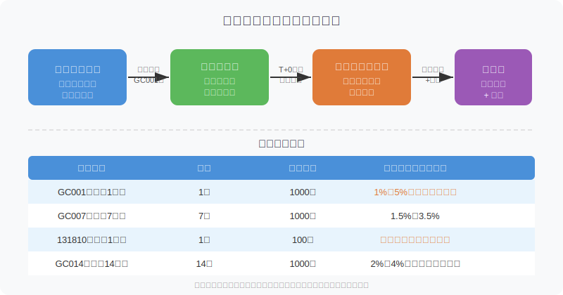
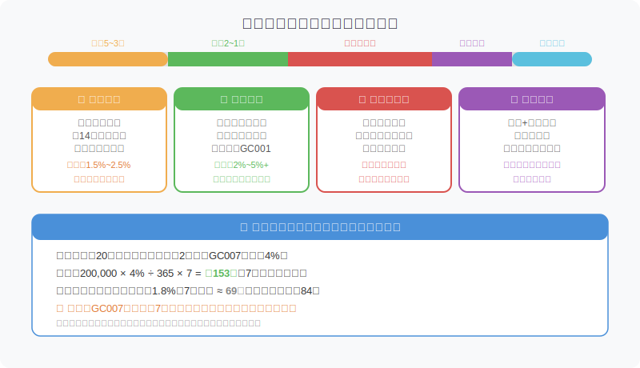
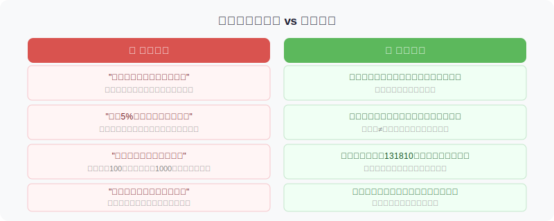

## 散户投资小白金融全品种操盘手册 - 3.3 国债逆回购 —— 节假日前后最被低估的资金技巧
  
### 作者  
digoal  
  
### 日期  
2026-05-30  
  
### 标签  
金融产品 , 金融工具 , 散户 , 投资小白 , 全品操盘手册  
  
----  
  
## 背景 

## 先问你一个问题

你知道每年春节前的最后两个交易日，有一种操作年化收益率可能短暂超过4%，甚至在极端情况下飙到10%以上，而且是国家信用背书、几乎零风险的吗？

大多数散户把这段时间的闲置资金放在货币基金里吃1.5%左右的年化，然后看着那笔多出来的收益白白溜走。

这一节讲的，就是这个被严重低估的工具：**国债逆回购**。

---

## 国债逆回购是什么？

用一句话说：**你把钱借给机构，机构用国债做抵押，你收利息，到期还本付息**。

很多人被"逆回购"这四个字吓到了，其实拆开来看一点都不复杂。

"回购"是机构把国债卖出去、约定未来买回来，对它来说是借钱；"逆回购"就是反过来——你是那个出借资金的人，站在"逆"的角度。你不需要懂国债，不需要持有国债，只要有钱，就可以把钱借出去。

抵押物是国债，国家信用背书，违约可能性极低。这就是它和很多"高收益理财"的本质区别。

### 在哪里操作？

直接在你的证券账户里，就和买卖股票一样下单。

- **沪市**：搜索 `GC001`（1天）、`GC007`（7天）、`GC014`（14天）等
- **深市**：搜索 `131810`（1天）、`131811`（2天）、`131817`（7天）等
- 下单方式：选"买入"，填写金额，点击确认

沪市最低参与门槛是1000元；深市最低100元，对小资金更友好。

---

## 第一性原理分析：为什么它的收益会在节前飙升？

国债逆回购的利率，本质上是市场资金供需的实时定价。你需要理解两个问题：

**为什么平时利率不高？**

平时市场资金相对充裕，机构不急着借钱，给出的利率就低，通常年化1%~2%左右，和货币基金差不多，有时甚至更低。

**为什么节前利率会跳涨？**

节假日来了，有三件事同时发生：

1. **企业集中提款**：发员工年终奖、结算供应商账款，大量资金从银行账户和金融市场抽走
2. **个人集中取现**：消费、回家过年，资金从场内流向场外
3. **市场交易暂停**：假期期间无法交易，机构急需在节前搞定流动性

三重叠加，借钱的需求暴增，出借的资金却减少，利率自然飙升。这是供需的基本逻辑，不是什么阴谋或运气，是每年都会重复的结构性现象。

---

### 【前提清单】

支撑"节前逆回购收益明显高于平时"这个结论，需要以下前提成立：

| 前提 | 类型 | 理由 |
|------|------|------|
| 前提A：节假日制度存在，市场会定期休市 | **常量** | 只要中国资本市场存在法定假期，就会重复 |
| 前提B：节前资金需求集中程度明显 | **准常量** | 与社会经济习惯相关，近20年基本稳定 |
| 前提C：央行不在节前大规模投放流动性对冲 | **变量** | 央行若大量放水，节前利率可能不涨 |

**情景推演：**

- 正常情景（前提全部成立）：节前2天利率明显高于平时，可达平时的1.5~3倍
- 压力情景（前提C被推翻，央行主动投放流动性）：节前利率上涨幅度收窄，依然有机会，但不会特别突出
- 极端情景（金融市场流动性危机，全年利率都很高）：此时逆回购会持续提供高收益，但整个市场面临系统性压力，需要优先考虑安全性

**结论**：这个策略并非每次一定奏效，但节前资金偏紧的结构性规律，在过去十多年里相当稳定。

---

## 节前布局的最优时间窗口

这是整节最重要的操作地图。

核心逻辑是：**选对期限，让资金在节假日期间处于"出借中"状态，到期后直接收回本金+利息**。

以7天期（GC007）举例：

- 节前第2个交易日买入GC007
- 7天后到期，资金自动回到账户
- 此时节后市场已开，可以直接操作其他品种

操作上最容易犯的错：**买了1天期，第二天利率更高，才发现没抓住最佳窗口**。建议根据假期长度，提前估算用哪个期限更合适。

### 各假期参考选择

| 假期 | 休市天数（含前后周末） | 推荐期限 | 时机 |
|------|-----------------|----------|------|
| 春节 | 7~10天 | GC014（14天） | 节前3~5天布局 |
| 国庆 | 7天 | GC007或GC014 | 节前2~3天布局 |
| 五一（5天） | 5~7天 | GC007 | 节前1~2天布局 |
| 元旦（3天） | 3~4天 | GC001或GC003 | 节前1天 |

注意：以上仅为规律性参考，实际应根据当年日历和市场情况调整。

---

## 实操例子

**场景：春节前某年，散户小王持有30万证券账户资金，其中10万需要过年期间使用，20万短期无计划动用。**

**操作步骤：**

**第一步（节前第5天）**：先把10万转出到银行卡，确保生活用钱不受影响。剩余20万确认为真正闲置资金。

**第二步（节前第3天）**：观察GC014利率。若年化超过2.5%，用15万买入GC014，覆盖整个春节期间。剩余5万继续观察。

**第三步（节前第1~2天）**：利率通常在这时达到高峰。若GC001或GC007年化超过3.5%，将剩余5万也买入GC007。

**第四步（到期后）**：节后首日，GC014和GC007陆续到期，本金+利息自动回到账户。查看回购收益，评估与货币基金的差值。

**如果判断失误：** 比如利率没有明显拉升（央行大幅投放流动性），那么最坏结果是：资金被锁定在低利率的逆回购里，错过了短暂的股票买入机会。解决方案：控制逆回购占账户资金比例不超过50%，保留弹药。

---

## 常见误区与正确认知

最需要警惕的一个误区，再单独强调一遍：

> **不要用需要急用的钱来做逆回购。**

GC007买入后，7天内这笔钱是锁死的，哪怕你的股票跌了想加仓、哪怕你家里急需用钱，都取不出来。这和货币基金不同——货基T+1或T+0可以随时赎回，逆回购不行。

做逆回购之前，问自己一个问题：**这笔钱在接下来的期限内，我百分之百用不到吗？** 如果有任何不确定，只放一部分，或者选1天期（GC001）而不是7天期或14天期。

---

## 进阶：季末、月末也有机会

节假日不是唯一的机会窗口。

每个**季度末**（3月底、6月底、9月底、12月底）和**月末**，银行有存款考核压力，同样会出现短暂的资金紧张，逆回购利率也会走高，通常幅度没有节前那么大，但值得关注。

规律：这些时间点的GC001利率，往往会比平时高出0.5%~1.5%。

操作建议：在季末最后1~2个交易日，把账户里的闲置资金转入GC001，第二天就到期，资金第三天可用，收益比货基平时多一点。小操作，积少成多。

---

## 可复用框架

### 【资金时机匹配框架】

**适用场景**：任何短期闲置资金的收益优化

**核心逻辑**：不同时间节点的资金需求紧张程度不同，用工具的期限去"匹配"需求最高的时间窗口

**操作步骤**：
1. 确认资金性质：闲置期多长？不能动的底线是什么？
2. 识别近期时间节点：有无节假日、季末、月末在资金闲置期内？
3. 选择对应期限的逆回购，买入点在节点前1~3天
4. 到期后评估：利率是否如预期高于平时？若没有（央行投放流动性），记录原因，下次优化判断

**举一反三**：这个框架同样适用于判断"什么时候买短债基金"、"什么时候加大货基仓位"——本质都是资金闲置时长与市场利率节奏的匹配。

---

## 本节行动清单

1. 打开你的证券账户，搜索 GC001 或 131810，确认你的账户已开通逆回购权限（通常无需额外申请，直接能搜到即可操作）
2. 查看当前GC001的年化利率，和你的货币基金做比较，感受两者日常差距
3. 把年度节假日标注在日历上：春节、五一、国庆、元旦，提前2周开始关注逆回购利率走势
4. 下次节前，用账户里5%的资金小试，观察实际到账收益，建立自己的直观感受
5. 设立一条规则：做逆回购的资金，必须是在期限内完全不会动用的钱

---

## 一句话总结

国债逆回购不是让你暴富的工具，而是一个"把节假日的资金等待时间变成有息存款"的小技巧——会用的人多赚点，不会用的人多等几天没收益。

---

> ⚠️ **声明**：本文内容为投资教育目的，所有历史数据、策略框架均为辅助学习工具，不构成证券投资建议。市场有风险，投资需谨慎。实际操作请结合自身风险承受能力，必要时咨询专业投顾。
  
#### [PostgreSQL 解决方案集合](../201706/20170601_02.md "40cff096e9ed7122c512b35d8561d9c8")
  
  
#### [德哥 / digoal's Github - 公益是一辈子的事.](https://github.com/digoal/blog/blob/master/README.md "22709685feb7cab07d30f30387f0a9ae")
  
  
#### [About 德哥](https://github.com/digoal/blog/blob/master/me/readme.md "a37735981e7704886ffd590565582dd0")
  
  

  
