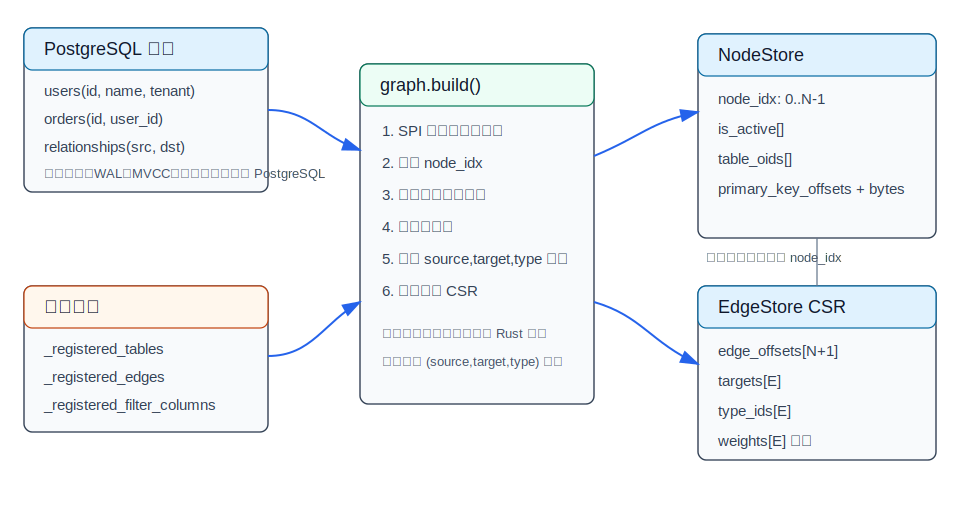
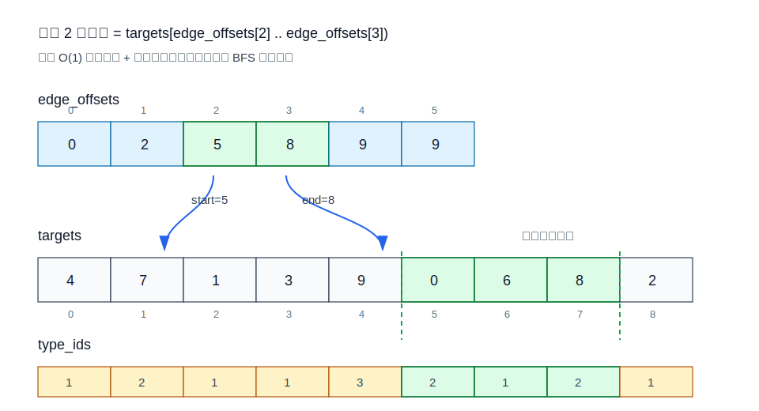
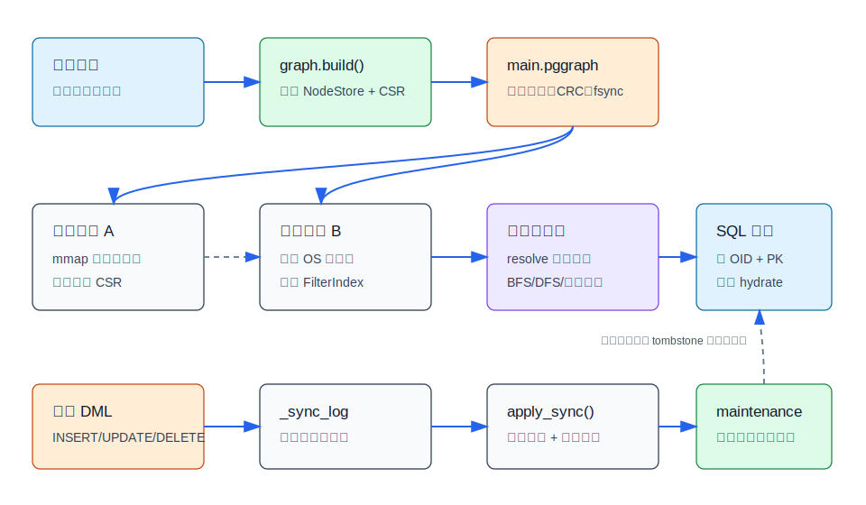
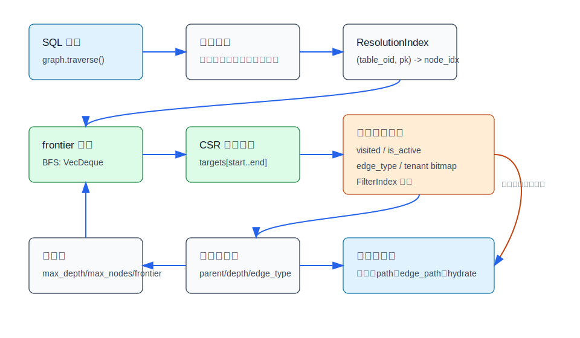
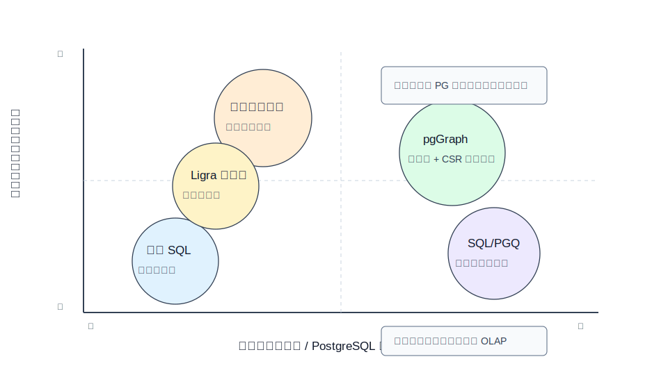

## 数据库筑基课 - graph 图式存储与搜索

### 作者
digoal

### 日期
2026-05-30

### 标签
PostgreSQL , DuckDB , DuckPGQ , 应用开发者 , 数据库筑基课 , 图存储 , 图搜索 , CSR , pgGraph

----

## 背景
  


本文属于“数据库执行与场景实践”类基础能力：把已经在关系数据库里的业务对象，转换成可以低成本做邻域搜索、路径解释、最短路径和关系扩展的图执行结构。

很多业务系统最初不是按“图数据库”设计的。用户、订单、设备、账号、公司、资金流、告警、工单、知识条目，都在 PostgreSQL 的普通表里；关系藏在主键、外键、关联表和若干业务字段里。真正上线以后，问题会变成：

- 查一个客户 2 跳内关联了哪些账号、公司和设备。
- 解释两个主体为什么有关联，路径是什么。
- 给大模型检索上下文时，不只找相似文本，还要沿实体关系补齐证据。
- 在不迁移数据、不重写业务事务链路的前提下，把图查询能力接进 SQL。

直接用递归 CTE 能做，但复杂 schema 下经常变成“每个问题写一段递归 SQL”。换专用图数据库也能做，但需要新的存储、运维、权限、同步和查询语言。pgGraph 的取舍介于两者之间：PostgreSQL 表仍是事实来源，扩展根据注册元数据构建可重建的 CSR 图索引，然后通过 `graph` schema 里的 SQL 函数做搜索、遍历和路径查询。

本文以本地项目 `pggraph` 为主要案例。DeepWiki 的 `Evokoa/pggraph` 在本次环境中返回未索引，所以架构判断以本地源码、项目文档和论文思想为准。

## 一、它解决什么问题？

图式存储与搜索要解决的不是“把表画成点和边”这么简单，而是把查询的代价中心从“反复 join 和递归扩展”转到“预先编译好的邻接结构扫描”。

在关系模型里，找邻居通常需要：

1. 找到起点行。
2. 根据外键或关联表 join 出下一跳。
3. 对下一跳重复同样的 join。
4. 为了避免环和爆炸，还要维护 visited、深度、分页和去重。

这套逻辑写成递归 SQL 后，优点是完全在线、完全关系化；缺点是每种图拓扑都要重新表达，查询计划容易被多跳扩展、选择率误判、重复去重和中间结果放大拖慢。pgGraph 选择牺牲一部分写后即时可见性和构建成本，换取读取时的稳定邻接访问。

这个转化可以概括为：

| 原问题 | 转化后问题 | 收益 | 代价 |
|---|---|---|---|
| 多表 join 与递归扩展 | `node_idx` 上的邻接数组扫描 | 热循环简单，缓存友好 | 需要构建和维护派生图 |
| 起点由表名和主键表达 | `(table_oid, pk) -> node_idx` 解析 | 查询先定位内部节点 | 需要 ResolutionIndex |
| 边类型是业务字段 | `u8` 边类型 ID | 比较成本低 | 当前用户边标签最多 254 个 |
| 过滤要回表判断 | FilterIndex 预编码 | 遍历中可剪枝 | 过滤列要提前注册 |
| 多连接共享大图 | `.pggraph` 只读 mmap | OS 页缓存可共享固定数组 | 反向 CSR、过滤索引等仍是后端本地堆 |

所以它适合“同一批关系拓扑被反复读”的工作负载，不适合“每次查询都改变拓扑、全图实时 OLAP、跨库分布式图计算”的场景。

## 二、它是什么？

图式存储可以分三层理解：

- 逻辑层：节点是源表的一行，边来自外键、关联表或边表，节点坐标是 `(source_table, primary_key)`。
- 物理层：节点被编号为连续的 `node_idx: u32`，边被编译到 CSR 数组：`edge_offsets`、`targets`、`type_ids`、可选 `weights`。
- 执行层：SQL 函数先把业务坐标解析为内部节点，再在 CSR 上跑 BFS、DFS、最短路径、带过滤的邻域扩展，最后返回源表坐标或 hydrate 原始行。

pgGraph 的源码把这几层拆得比较清楚：

- `graph/src/builder.rs`：读取注册目录，分批扫描源表，分配节点，解析边，流式构建 CSR。
- `graph/src/node_store.rs`：以 Struct-of-Arrays 存节点状态、表 OID 和主键。
- `graph/src/edge_store.rs`：以 CSR 存边，`neighbors(node_idx)` 返回连续切片。
- `graph/src/engine.rs`：持有 NodeStore、EdgeStore、FilterIndex、ResolutionIndex 和同步状态。
- `graph/src/bfs.rs`：BFS/DFS 热循环、visited、frontier、断路器和过滤剪枝。
- `graph/src/path_finder.rs`：无权最短路径和带权最短路径。
- `graph/src/persistence.rs`：`.pggraph` 文件格式、CRC、mmap 加载和原子写入。



图 1 说明：PostgreSQL 表没有被替换。pgGraph 只把注册过的表、边、过滤列编译成内部节点和 CSR 边数组。源表继续承担事务、约束、MVCC、WAL、备份和权限；CSR 是可重建的读优化派生状态。

## 三、核心原理

### 3.1 关系到图：先编号，再连边

构建阶段先读 `graph._registered_tables`、`graph._registered_edges` 和 `graph._registered_filter_columns`。对每个注册表，builder 用 SPI 游标按 `graph.build_batch_size` 分批读取源行，为每行分配一个连续 `node_idx`，同时记录：

- `table_oid[node_idx]`：节点来自哪张表。
- `primary_key[node_idx]`：源行主键文本。
- `(table_oid, pk) -> node_idx`：后续解析起点和边端点使用。
- `tenant_membership`：多租户过滤位图。
- 过滤列值：稍后写入 FilterIndex。

边的构建分两步。第一步从边源表读出源端点、目标端点、可选权重和可选动态标签；第二步用临时节点查找表把端点主键解析为内部 `node_idx`，写入临时边 spool。最后按 `(source, target, type_id)` 排序后流式喂给 `SortedEdgeStoreBuilder`，生成 CSR。这个流程借鉴了稀疏矩阵转置/CSR 构建的思想：先把边按行分组，再形成 offset 数组；而不是在查询时反复按关系表寻找邻居。

### 3.2 CSR：邻居是连续切片

CSR 的关键公式很简单：

```text
node i 的出边目标 = targets[edge_offsets[i] .. edge_offsets[i + 1]]
node i 的边类型   = type_ids[edge_offsets[i] .. edge_offsets[i + 1]]
node i 的权重     = weights[edge_offsets[i] .. edge_offsets[i + 1]]
```

`edge_offsets` 长度是 `node_count + 1`。第 `i` 个和第 `i+1` 个 offset 的差，就是节点 `i` 的出度。这样查询一个节点的邻居不需要哈希表、不需要二分、不需要 join，只要两次数组读取得到切片边界，然后顺序扫描。



图 2 说明：节点 2 的邻居从 `targets[5]` 扫到 `targets[7]`，对应的边类型也在同样下标范围内。图遍历的热路径因此变成“frontier 出队 -> 取连续邻接切片 -> 检查候选节点 -> 入队”。

Ligra 论文强调共享内存图处理框架要把算法组织成对顶点集合和边集合的高效遍历。pgGraph 不是 Ligra 那样的通用批量图计算框架，但采用同样的底层常识：图算法的内层循环要尽量贴近连续内存访问，减少对象跳转和随机查找。

### 3.3 NodeStore：节点元数据也按列存

`NodeStore` 没有把每个节点做成一个大对象，而是拆成并行数组：

| 数组 | 作用 | 查询中是否热 |
|---|---|---|
| `is_active` | tombstone 标记，删除后可置为 inactive | 热 |
| `table_oids` | 节点对应源表 OID | 中 |
| `primary_keys` 或 offset+bytes | 输出结果和 hydrate 用 | 冷 |

这种 Struct-of-Arrays 布局的好处是 BFS 检查 active 状态时不需要把主键字符串等冷数据一起带进缓存。`.pggraph` 加载后，active bits、table OID、主键 offsets 和主键 bytes 可以从 mmap 区域读取。

### 3.4 ResolutionIndex：业务坐标和内部编号之间的桥

用户调用 SQL 时不会知道 `node_idx`。例如：

```sql
SELECT *
FROM graph.traverse(
  seed_table := 'public.users'::regclass,
  seed_id := 'u1',
  max_depth := 2
);
```

执行器必须先把 `('public.users'::regclass, 'u1')` 解析成内部节点。pgGraph 的 `ResolutionIndex` 做这个映射。构建时先累计条目，finalize 后转为排序后的字节数组，查询时通过二分查找解析。加载 `.pggraph` 后，这个索引也可以直接在 mmap 字节段上查找。

### 3.5 FilterIndex：把遍历过滤下推到图内存

搜索和遍历过滤是两件事：

- `graph.search()` 面向源表列，通过 PostgreSQL SQL 谓词找候选源行。
- `graph.traverse(filter := ...)` 面向遍历过程中的候选节点，注册过的 filter column 可以预编码到 `FilterIndex`。

`FilterIndex` 支持 numeric、boolean、text、date、timestamptz、uuid 等类型。它会按列的稀疏程度选择 dense 或 sparse 存储，稀疏阈值是“填充值低于节点数 15%”。这样，遍历热循环遇到候选节点时，可以直接在内部索引中判断 `age >= 40`、`status in (...)`、`created_at is not null` 等谓词，不必每个邻居都回源表。

### 3.6 查询热循环：剪枝比扩展更重要

`graph/src/bfs.rs` 的核心循环包含这些检查：

1. 是否已经 visited。
2. 边类型是否在允许集合。
3. 目标节点是否 active。
4. 租户位图是否允许。
5. FilterIndex 谓词是否满足。
6. 是否达到 `max_depth`、`max_nodes`、`max_frontier`。



图 3 说明：图搜索的性能不只来自 CSR，还来自尽早剪掉无效候选。尤其在社交、风控、知识图谱这类高扇出图里，如果没有深度、节点数和 frontier 限制，一次用户查询就可能变成不可控的全图扩张。

### 3.7 持久化与 mmap：派生图不是新存储引擎

`.pggraph` 文件保存构建后的固定数组和索引段。根据 `persistence.rs`，文件头包含 magic、version、flags、node_count、edge_count、11 个 section offset 和 CRC。主要 section 包括：

- active bits
- table OID 数组
- CSR offsets、targets、type_ids、weights
- ResolutionIndex
- primary key offsets 和 bytes
- FilterIndex bincode
- edge type registry bincode

写入采用临时文件、回填 header、fsync、rename 的方式。加载时验证 magic、版本、CRC、section 边界、对齐、CSR offset 单调性、target 范围等，再把不可变数组 mmap 成只读视图。需要注意：mmap 共享的是 OS 页缓存里的固定数组页，不是 PostgreSQL shared buffers，也不是跨后端共享 Rust 堆。反向 CSR、FilterIndex、edge type registry、同步 overlay 仍是每个后端本地结构。



图 4 说明：构建产物可以被多个后端按只读 mmap 方式加载；写入源表后，触发器同步会先形成日志和覆盖层，后续通过 vacuum/maintenance 重建，把覆盖层合回基础 CSR。

## 四、横向对比

| 维度 | pgGraph 派生 CSR 图索引 | 递归 CTE / 普通 SQL | Apache AGE / 属性图数据库 | PostgreSQL SQL/PGQ | Ligra 类图计算框架 |
|---|---|---|---|---|---|
| 主要目标 | PostgreSQL 内现有表的有界图遍历加速 | 零额外存储表达关系递归 | 图模型作为一等存储和查询对象 | 标准属性图模式匹配 | 高吞吐共享内存图分析 |
| 数据事实来源 | PostgreSQL 源表 | PostgreSQL 源表 | 图存储/图表 | PostgreSQL 表定义的 property graph | 内存图数据集 |
| 写入代价 | 源表正常写，图索引需 build/sync/maintenance | 无派生图维护 | 图存储按图模型维护 | 依赖关系执行路径 | 通常批量加载 |
| 读取代价 | 起点解析后扫描 CSR | 多跳 join/递归扩展 | 图引擎执行 | 优化器选择执行计划 | 图算法框架执行 |
| 事务/MVCC | 源表保持 PostgreSQL 原生；图为派生状态 | 完全原生 | 取决于图扩展/系统 | PostgreSQL 原生 | 通常不在 OLTP 事务内 |
| 查询语言 | SQL 函数 | SQL | Cypher/openCypher 等 | SQL:2023 PGQ 风格 | 程序 API |
| 适合场景 | 已有 PostgreSQL 数据的路径解释、邻域搜索、RAG 关系扩展 | 低频、浅层、schema 简单 | 图为核心模型的应用 | 标准图模式表达和优化器集成 | 离线/批量图分析 |
| 不适合场景 | 高频拓扑写入、跨库分布式全图分析 | 高扇出多跳生产查询 | 不想引入新图模型时 | 需要预计算 CSR 热路径时 | 需要 OLTP 权限/MVCC 时 |



图 5 说明：pgGraph 的位置不是“替代所有图数据库”，而是在 PostgreSQL 原生运维和专用图热路径之间找一个折中点。关系表保真度越重要、查询越偏有界邻域，pgGraph 越有价值；如果图本身就是事实来源或需要分布式全图算法，应考虑其他系统。

## 五、效果如何？

不要把“CSR 很快”理解成任何图查询都会快。它快在特定条件下：

- 同一拓扑被反复查询，构建成本可以摊销。
- 查询是有界遍历、路径解释或局部邻域扩展。
- 起点可以快速解析，边类型和过滤列能在图内剪枝。
- 结果需要返回源表坐标，必要时再 hydrate 少量行。

它的收益主要来自：

- 邻接访问从 join 变成连续数组扫描。
- 访问状态用 bitmap / RoaringBitmap 表达。
- 边标签压缩成 `u8`，过滤列预编码。
- mmap 让固定图数组可通过 OS 页缓存被后端共享。
- 构建阶段用临时 spool 和排序流式生成 CSR，避免长期持有全部原始边。

它的代价也明确：

- 构建需要扫描注册表和边源表。
- 基础 CSR 是不可变结构，拓扑变更需要 overlay 或重建。
- vacuum/maintenance 当前是完整重建，存在新旧 engine 共存的双内存窗口。
- 搜索 `graph.search()` 仍走源表 SQL 谓词，不是全文索引或向量索引替代品。
- Edge type ID 用 `u8`，用户边标签上限是 254 个。
- 每个 PostgreSQL 后端有自己的 active `Engine`，不是所有结构都共享。

## 六、实操 DEMO

下面示例按 pgGraph 当前 SQL API 写成最小模板。本文没有在本机安装并启动扩展，因此不提供伪造执行结果；读者可在安装 `graph` 扩展后执行。

### 6.1 建表并注册

```sql
CREATE EXTENSION graph;

CREATE TABLE public.users (
  id text PRIMARY KEY,
  name text NOT NULL,
  status text NOT NULL,
  age int,
  tenant_id text
);

CREATE TABLE public.follows (
  src text NOT NULL REFERENCES public.users(id),
  dst text NOT NULL REFERENCES public.users(id),
  strength int DEFAULT 1,
  rel_type text DEFAULT 'follows',
  PRIMARY KEY (src, dst)
);

INSERT INTO public.users(id, name, status, age, tenant_id) VALUES
  ('u1', 'Alice', 'active', 35, 't1'),
  ('u2', 'Bob', 'active', 42, 't1'),
  ('u3', 'Carol', 'trial', 29, 't1'),
  ('u4', 'Dave', 'inactive', 50, 't1');

INSERT INTO public.follows(src, dst, strength, rel_type) VALUES
  ('u1', 'u2', 2, 'follows'),
  ('u2', 'u3', 1, 'follows'),
  ('u3', 'u4', 4, 'blocks');

SELECT graph.add_table(
  table_name := 'public.users'::regclass,
  id_column := 'id',
  columns := ARRAY['name', 'status'],
  tenant_column := 'tenant_id'
);

SELECT graph.add_edge(
  from_table := 'public.follows'::regclass,
  from_column := 'src',
  to_table := 'public.users'::regclass,
  to_column := 'dst',
  label := 'follows',
  bidirectional := false,
  weight_column := 'strength',
  label_column := 'rel_type'
);

SELECT graph.add_filter_column('public.users'::regclass, 'age', 'numeric');
SELECT graph.add_filter_column('public.users'::regclass, 'status', 'text');
```

这里用的是 edge-table 风格：`follows.src` 和 `follows.dst` 都来自边表，目标节点在 `users` 表。`label_column := 'rel_type'` 表示每条边可以有自己的标签；空值会回退到静态 label。

### 6.2 构建与检查

```sql
SELECT * FROM graph.estimate();
SELECT * FROM graph.build();
SELECT * FROM graph.status();
SELECT * FROM graph.registered_tables();
SELECT * FROM graph.registered_edges();
```

`graph.estimate()` 使用 PostgreSQL 行数估计做内存预检；`graph.build()` 返回加载节点数、边数、构建耗时、内存估计和 sync mode。

### 6.3 遍历、搜索和路径

```sql
SELECT node_table_name, node_id, depth, edge_path
FROM graph.traverse(
  seed_table := 'public.users'::regclass,
  seed_id := 'u1',
  max_depth := 2,
  edge_types := ARRAY['follows'],
  direction := 'out',
  filter := graph.gte('age', 30),
  tenant := 't1',
  hydrate := false
);
```

```sql
SELECT node_table_name, node_id, match_type, verified
FROM graph.search(
  property_key := 'name',
  property_value := 'Alice',
  table_filter := 'public.users'::regclass,
  mode := 'exact',
  hydrate := false
);
```

```sql
SELECT step, node_table_name, node_id, edge_label
FROM graph.shortest_path(
  'public.users'::regclass,
  'u1',
  'public.users'::regclass,
  'u3',
  max_depth := 5,
  hydrate := false
);
```

```sql
SELECT step, node_table_name, node_id, edge_label, edge_weight, total_cost
FROM graph.weighted_shortest_path(
  'public.users'::regclass,
  'u1',
  'public.users'::regclass,
  'u4'
);
```

### 6.4 同步与维护

如果图拓扑会写入变化，不能只靠一次 build：

```sql
ALTER SYSTEM SET graph.sync_mode = 'trigger';
SELECT pg_reload_conf();

SELECT graph.enable_sync();
SELECT * FROM graph.build();

-- 写入源表后
SELECT * FROM graph.apply_sync();
SELECT * FROM graph.sync_health();

-- 覆盖层或 tombstone 积累后
SELECT * FROM graph.maintenance(concurrently := false);
```

当前 `wal` sync mode 是保留项，`copy` build scan mode 也是保留项；不要把它们当成可用生产路径。

## 七、最佳实践

### 面向数据库架构师

- 先确认图查询是否是“反复读同一拓扑”。如果每个查询都临时定义不同边语义，CSR 派生索引未必合适。
- 让源表主键稳定、短小、唯一。`ResolutionIndex` 和结果 hydrate 都依赖表 OID + 主键。
- 把高扇出边、业务关系边、动态 label、权重列在建模阶段定清楚。边标签当前受 `u8` 上限约束，不要把高基数字段直接当 label。
- 对搜索列仍要建 PostgreSQL 索引。例如 case-insensitive exact/prefix 搜索可考虑 `lower(col::text)` 表达式索引，contains 可结合 `pg_trgm`。
- 多租户场景应注册 tenant column，并把租户过滤作为默认调用约束。

### 面向 DBA

- 构建前跑 `graph.estimate()`，设置 `graph.memory_limit_mb` 和 `graph.oom_action`。
- 用户查询必须限制 `max_depth`、`max_nodes`、`max_frontier` 和分页。不要把无界图扩张暴露给前端。
- 开启持久化时关注 `.pggraph` 文件路径、fsync、auto-load、版本兼容和重建流程。
- trigger sync 模式下定期查看 `graph.sync_health()`、`edge_buffer_used`、`pending_sync_rows`、`needs_vacuum`、`needs_rebuild`、`read_only_reason`。
- `graph.vacuum()` / `graph.maintenance()` 当前重建基础图，会有双内存窗口，最好避开 OLTP 高峰。

### 面向业务开发者

- 把 `graph.traverse()` 当成“有边界的关系扩展”，不要当成任意全图搜索。
- 能用 `edge_types`、`node_tables`、`tenant`、`filter` 缩小范围就尽早缩小。
- UI/接口层返回路径解释时，优先返回 `path`、`edge_path` 和源表坐标；只有展示详情时再 hydrate。
- RAG 场景里，向量检索负责“语义相似”，图遍历负责“实体关系补证据”。不要让图遍历替代全文/向量召回。

## 八、适合与不适合场景

适合：

- 风控关系扩展：账号、设备、手机号、银行卡、IP、公司之间的 1 到 3 跳扩展。
- 客服/CRM 关系解释：客户、订单、合同、工单、联系人之间的路径说明。
- 告警根因辅助：服务、实例、任务、依赖、变更之间的邻域搜索。
- 知识库 RAG：从命中文档实体出发，扩展相邻实体、出处、上下位关系。
- 现有 PostgreSQL 应用补图能力：不想迁移主数据到图数据库。

不适合：

- 每秒大量拓扑写入并要求所有连接立即看到完整一致图。
- 无深度限制的社交网络全图探索。
- 跨数据库、跨集群的分布式图 join。
- PageRank、连通分量全量批处理这类长时间全图分析放在 OLTP 主库上跑。
- 需要 Cypher、Gremlin、SPARQL、GQL 完整语义的应用。
- 边标签高基数到接近业务 ID 级别的模型。

## 九、常见坑

1. 把派生图当事实来源  
   `.pggraph` 可删、可重建、可失效。源表才是事实来源。备份恢复、权限和数据审计仍围绕 PostgreSQL 表做。

2. 不设查询断路器  
   图查询最容易出问题的不是单条边慢，而是高扇出扩张。必须设置深度、节点数、frontier、分页。

3. 忘记维护同步覆盖层  
   trigger sync 可以让变更进入 `_sync_log` 和 overlay，但基础 CSR 不会原地改写。overlay 积累后需要 maintenance/vacuum。

4. 把搜索列和过滤列混淆  
   `columns` 供 `graph.search()` 查源表；`graph.add_filter_column()` 才会进入遍历 FilterIndex。两者是不同路径。

5. 对 contains 搜索没有建索引  
   `graph.search()` 还是源表 SQL 谓词。大表 substring 搜索没有 trigram 或表达式索引，会慢在 PostgreSQL 扫描上。

6. 过度依赖 auto-discover  
   auto-discover 适合快速开始和规范 FK schema。关系表、动态 label、权重、多租户、搜索列边界，最好手动注册。

7. 把 edge label 当业务属性乱塞  
   label 是热路径 `u8` 类型 ID，不适合作为高基数属性。高基数属性应作为节点/边源表列处理，或在业务层过滤。

8. 在主库高峰跑全图维护  
   maintenance/vacuum 是重建路径。大图应放到只读副本、低峰窗口或专门调度里。

## 十、扩展问题

1. 如果 PostgreSQL 未来 SQL/PGQ 可以表达图模式，哪些模式适合直接走关系优化器，哪些模式适合下推到 CSR 运行时？
2. CSR 对读取友好但对原地更新不友好。若要支持高频在线拓扑变更，应采用 delta CSR、LSM-like 边段，还是直接换可变图存储？
3. 在 RAG 系统中，图关系扩展应该发生在向量召回前、召回后，还是 rerank 阶段？不同选择会怎样影响召回率和延迟？
4. 多租户图中，租户隔离放在节点 membership bitmap、边构建阶段，还是查询入口权限层，分别有什么风险？
5. 如果一张边表有上百种关系类型，哪些应该建成 edge label，哪些应该留作过滤属性？

## 十一、扩展阅读

- 本地源码：`pggraph/CLAUDE.md`，项目架构、构建命令、核心模块说明。
- 本地源码：`pggraph/README.md` / `pggraph/README_zh.md`，项目定位、安装、能力边界。
- 本地源码：`pggraph/graph/src/builder.rs`，构建流程、内存预检、节点/边加载、CSR 构建。
- 本地源码：`pggraph/graph/src/edge_store.rs`，CSR 存储、邻接切片、反向 CSR。
- 本地源码：`pggraph/graph/src/node_store.rs`，SoA 节点布局、mmap 节点数组。
- 本地源码：`pggraph/graph/src/bfs.rs`，BFS/DFS 热循环、过滤、断路器。
- 本地源码：`pggraph/graph/src/path_finder.rs`，无权和带权最短路径。
- 本地源码：`pggraph/graph/src/filter_index.rs`，过滤列编码、dense/sparse 存储。
- 本地源码：`pggraph/graph/src/persistence.rs`，`.pggraph` 文件格式、mmap、CRC、原子写入。
- 本地文档：`pggraph/docs/user_guide/schema-registration.mdx`，注册表、边、过滤列。
- 本地文档：`pggraph/docs/user_guide/build-and-persistence.mdx`，构建、持久化、auto-load。
- 本地文档：`pggraph/docs/user_guide/querying.mdx`，搜索、遍历、路径和 workflow API。
- 本地文档：`pggraph/docs/user_guide/sync-and-maintenance.mdx`，trigger sync、apply、maintenance。
- 本地文档：`pggraph/docs/user_guide/limitations-and-fit.mdx`，适用场景和限制。
- 论文：`An Efficient Algorithm for Sparse Matrix Transposition`，稀疏矩阵转置/按行压缩组织的算法背景。
- 论文：`Ligra: A Lightweight Graph Processing Framework for Shared Memory`，共享内存图处理中的顶点/边集合遍历思想。
- 论文：`GraphGen: An In-Memory Co-Processor for Graph Analytics on An RDBMS`，关系数据库外接内存图分析协处理思路。
- 论文：`From Relations to Graphs: Optimizing Graph Queries inside a Relational Engine`，在关系引擎内优化图查询的思路。
- 论文：`Knowledge Graphs Meet Large Language Models: A New Frontier for Data Retrieval`，知识图谱与大模型检索结合的应用背景。

## 附录 
1、问 gemini
```
https://github.com/Evokoa/pggraph 图式存储与搜索相关的论文
```

2、克隆代码  
```  
git clone --depth 1 https://github.com/Evokoa/pggraph
```  
  
3、启用 codex, 使用 [数据库筑基课 skill](../skills/README.md).  
```
文章标题: 
  数据库筑基课 - graph 图式存储与搜索
项目源码(本地目录):  
  pggraph
项目 codebase 文件名: 
  pggraph/CLAUDE.md
相关的论文或文档名:
  An Efficient Algorithm for Sparse Matrix Transposition
  Ligra: A Lightweight Graph Processing Framework for Shared Memory
  GraphGen: An In-Memory Co-Processor for Graph Analytics on An RDBMS
  From Relations to Graphs: Optimizing Graph Queries inside a Relational Engine
  Knowledge Graphs Meet Large Language Models: A New Frontier for Data Retrieval  
开源项目相关的 deepwiki repoName: 
  Evokoa/pggraph
```
  
  
#### [PostgreSQL 解决方案集合](../201706/20170601_02.md "40cff096e9ed7122c512b35d8561d9c8")
  
  
#### [德哥 / digoal's Github - 公益是一辈子的事.](https://github.com/digoal/blog/blob/master/README.md "22709685feb7cab07d30f30387f0a9ae")
  
  
#### [About 德哥](https://github.com/digoal/blog/blob/master/me/readme.md "a37735981e7704886ffd590565582dd0")
  
  

  
