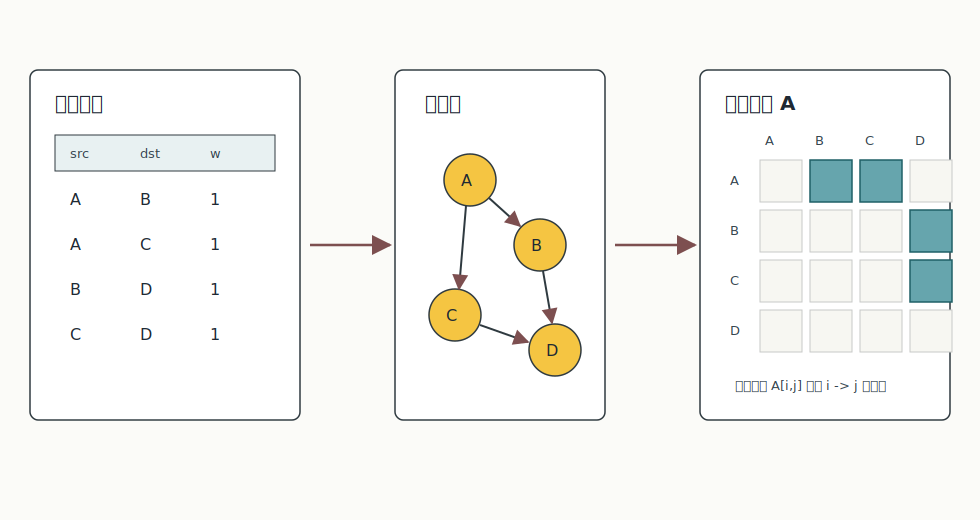
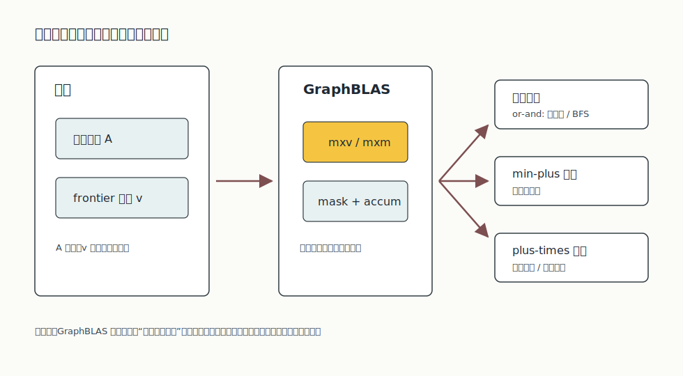
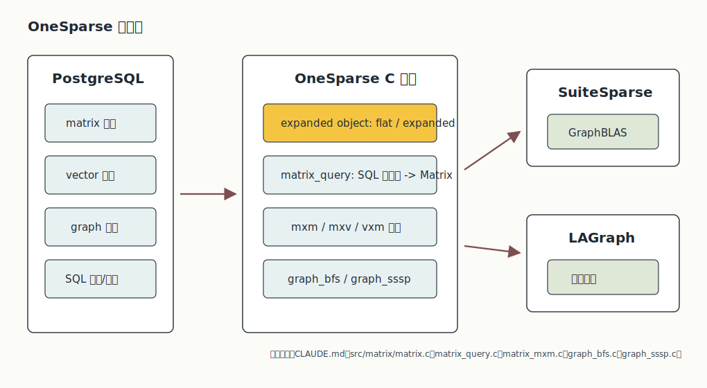
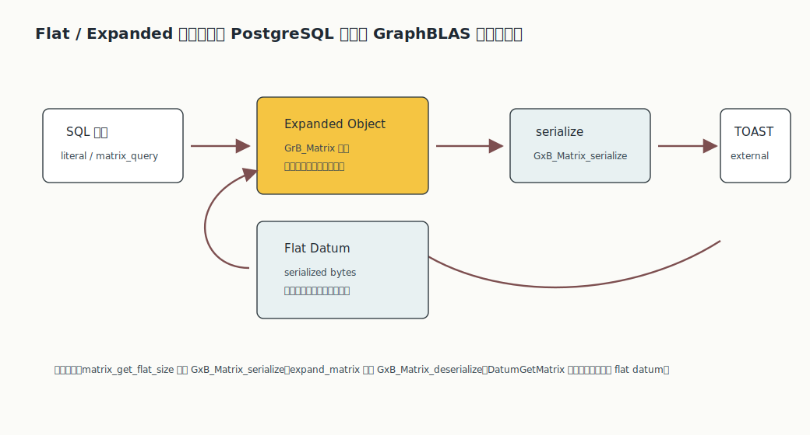
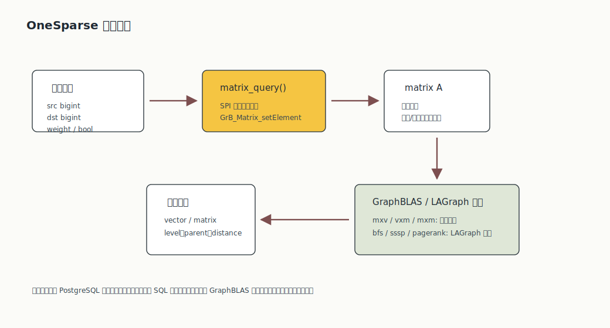

## 数据库筑基课 - GraphBLAS 图式存储与搜索

### 作者
digoal

### 日期
2026-05-31

### 标签
PostgreSQL , DuckDB , DuckPGQ , 应用开发者 , 数据库筑基课 , GraphBLAS , 图存储 , 图搜索 , 稀疏矩阵 , OneSparse

----

## 背景


本文属于“数据类型/算子 + 执行算法 + 场景实践”类基础能力：把图的存储、搜索和分析问题，改写成稀疏矩阵、向量、半环和掩码上的运算，再通过数据库扩展把它放回 SQL 工作流。

业务里常见的图问题并不神秘：

- 风控：账号、设备、手机号、银行卡之间是否存在可疑路径。
- 推荐：用户和商品的二跳、三跳关系是否能补充召回。
- 知识图谱：实体之间是否可达，路径能不能解释。
- RAG：文本相似召回之后，能不能沿实体关系扩展上下文。
- 运维：服务依赖图里某个节点故障会影响哪些下游。

传统关系数据库能用 join、递归 CTE、临时表做这些事；专用图数据库能用 Cypher/openCypher 或属性图模型做这些事。GraphBLAS 的视角不同：图可以表示为稀疏邻接矩阵，搜索可以表示为矩阵-向量乘、矩阵-矩阵乘、逐元素运算、归约和掩码过滤。换句话说，它把“图遍历语言”压到“稀疏线性代数语言”里。

本文以本地项目 `OneSparse` 为主要案例。OneSparse 是 PostgreSQL 扩展，项目说明称它通过 SuiteSparse:GraphBLAS 提供稀疏线性代数和图算法，把 GraphBLAS 对象暴露为 PostgreSQL 类型、函数和操作符。DeepWiki repoName `OneSparse/OneSparse` 本次只返回了很浅的架构摘要，关键判断以本地源码、项目文档、GraphBLAS 论文/API 和 SuiteSparse/LAGraph 官方资料为准。

另外，用户输入的论文名 `Mathematical Foundations of Graph Queries` 在 GraphBLAS 资料中未找到完全同名条目；可核验的相关论文是 `Mathematical Foundations of the GraphBLAS`。本文按后者引用。

## 一、它解决什么问题？

GraphBLAS 解决的不是“数据库怎么存图”的全部问题，而是“图搜索和图算法能否用一套可组合、可优化、可移植的稀疏算子表达”。

以 BFS 为例，普通写法会围绕 frontier、visited、neighbors 写循环；GraphBLAS 写法会把当前 frontier 看成向量，把图看成邻接矩阵，用布尔半环上的 `v @ A` 或 `A @ v` 产生下一层候选，再用 mask 排除已经访问过的点。最短路可以换成 `min-plus` 半环，三角计数可以用矩阵乘和逐元素交集，PageRank 可以用稀疏矩阵-向量迭代。

这个转换带来三个直接收益：

1. **算法和实现解耦**：算法描述只说 `mxv/mxm + semiring + mask`，底层可以选择 CSR、CSC、bitmap、dense、hypersparse、CPU、GPU 或 JIT kernel。
2. **搜索和分析共享一套原语**：可达性、最短路、路径计数、中心性、聚类系数都落到矩阵/向量操作，而不是每个算法单独实现一套邻接结构。
3. **数据库内复用**：OneSparse 把矩阵、向量、半环、图算法包装成 SQL 类型和函数，让 PostgreSQL 里的关系数据可以在库内转换成 GraphBLAS 对象执行。

代价也很明确：

- 它不是关系优化器原生图算子，SQL 优化器不会自动把任意 join 改写成 GraphBLAS。
- 图的更新、事务可见性、权限、增量维护仍要由数据库扩展和应用约束处理。
- GraphBLAS 的抽象门槛高于普通 SQL：必须理解矩阵方向、半环、mask、descriptor、稀疏值和显式 0 的区别。
- 一旦需要输出复杂路径解释、属性模式匹配、跨多类点边的变长查询，属性图语言仍然更直接。

## 二、它是什么？

GraphBLAS 是面向图算法的稀疏线性代数 API。它的核心对象是：

- `Matrix`：二维稀疏矩阵，图里通常表示邻接关系。
- `Vector`：一维稀疏向量，搜索里常表示 frontier、visited、distance、parent。
- `Scalar`：标量值。
- `UnaryOp / BinaryOp / Monoid / Semiring`：可组合的运算语义。
- `Mask / Accum / Descriptor`：控制写入位置、累积方式、转置、补集、结构掩码等执行行为。

OneSparse 把这些概念映射到 PostgreSQL：

- `matrix`、`vector`、`scalar`、`graph` 是扩展类型，SQL 定义里 `storage = 'external'`，适合 TOAST 存储。
- `mxm`、`mxv`、`vxm` 包装 GraphBLAS 的矩阵乘、矩阵-向量乘、向量-矩阵乘。
- `@` 操作符映射到默认半环乘法；`@<+`、`@++` 等操作符映射到特定半环。
- `graph(matrix)` 把矩阵包装成 LAGraph 图对象。
- `bfs`、`sssp`、`pagerank`、`triangle_count`、`connected_components` 等函数包装 LAGraph 算法。



图 1 说明：边表、图和邻接矩阵是同一关系的三种表示。GraphBLAS 关心的是右侧的稀疏矩阵：只有存在边的位置才需要存值；不存在边不是 0，而是没有元素。这个区别对空间成本和搜索语义都很关键。

## 三、核心原理

### 3.1 图搜索 = 稀疏矩阵上的代数

普通矩阵乘法使用 `plus-times`：先乘，再求和。GraphBLAS 把“乘”和“加”抽象成半环：

```text
C(i,j) = add over k: multiply(A(i,k), B(k,j))
```

把 `add` 换成 `or`，把 `multiply` 换成 `and`，就得到布尔可达性；把 `add` 换成 `min`，把 `multiply` 换成 `plus`，就得到最短路松弛；把 `add` 和 `multiply` 都换成 `plus`，可以表达某些路径计数或度数累加。



图 2 说明：GraphBLAS 的关键不是“把所有问题都硬塞进普通矩阵乘法”，而是把乘法和加法替换成业务语义。这样 BFS、SSSP、路径计数可以共享同一个 `mxv/mxm` 执行框架。

### 3.2 稀疏存储：元素不存在，不等于值为 0

OneSparse 文档强调，一个空矩阵不是被 0 填满，而是没有元素。GraphBLAS 的矩阵可以根据稀疏度在底层选择 sparse、hypersparse、bitmap 或 dense 等格式；SuiteSparse:GraphBLAS 论文 `Algorithm 1000` 的核心价值之一，就是把算法接口和具体存储/执行实现分离。

这对数据库读者很重要：

- 关系边表里的每一行边，对应矩阵里的一个非空元素。
- 不存在边的位置不消耗元素存储。
- 如果你显式写入数值 0，它仍可能是一个“存在的元素”，语义不同于缺失。
- 许多图算法只关心结构 mask，即“有没有元素”，不关心元素值。

因此，GraphBLAS 更像“稀疏关系代数执行内核”，不是把图塞进普通 dense array。

### 3.3 OneSparse 架构：SQL 类型只是门面，内核是 GraphBLAS

OneSparse 的 `CLAUDE.md` 总结了项目架构：GraphBLAS 对象通过 PostgreSQL expanded object framework 暴露，flat form 是可存储、可 TOAST 的序列化字节，expanded form 是内存里的 `GrB_Matrix`、`GrB_Vector` 等对象。

源码路径能看到这条分层：

- `src/matrix/matrix.c`：`new_matrix` 创建 `GrB_Matrix`；`matrix_get_flat_size` 用 `GxB_Matrix_serialize` 序列化；`expand_matrix` 用 `GxB_Matrix_deserialize` 展开。
- `src/vector/vector.c`、`src/scalar/scalar.c`：同类对象包装。
- `templates/matrix_header.sql`：定义 `matrix` 类型、`mxm/mxv/vxm` 函数和 `@` 等操作符。
- `src/matrix/matrix_mxm.c`、`matrix_mxv.c`、`matrix_vxm.c`：把 SQL 参数解包后调用 GraphBLAS API。
- `templates/graph_header.sql` 与 `src/graph/*.c`：把矩阵包装成 LAGraph 图，并暴露 BFS、SSSP、PageRank 等算法。



图 3 说明：PostgreSQL 负责类型系统、SQL 调用、存储和事务上下文；OneSparse 负责对象包装、序列化、参数转换和错误处理；SuiteSparse:GraphBLAS/LAGraph 负责真正的稀疏线性代数和图算法。

### 3.4 Flat / Expanded：数据库存储和计算内存不是一回事

数据库扩展最容易踩坑的地方是：存储格式适合持久化，不一定适合计算；计算对象适合连续操作，不一定适合直接落盘。OneSparse 用 PostgreSQL expanded object 模式做这层桥接。

`matrix_get_flat_size` 会调用 `GxB_Matrix_serialize` 得到 GraphBLAS 序列化字节；`flatten_matrix` 把这些字节写进 flat varlena 结构；`DatumGetMatrix` 遇到 flat datum 时会 detoast 并反序列化成 expanded object。这样矩阵列可以像普通 PostgreSQL 值一样传递、存储、TOAST，又能在执行函数时变成 `GrB_Matrix`。



图 4 说明：flat form 是数据库里的稳定值，expanded form 是当前执行上下文里的计算对象。连续做多个矩阵操作时，expanded object 可以减少重复反序列化；持久化、跨 SQL 边界和 TOAST 则依赖 flat form。

### 3.5 从关系边表构造矩阵

OneSparse 的 `matrix_query` 是理解“关系表如何进入 GraphBLAS”的关键函数。它要求输入 SQL 返回三列：

- 第一列：`bigint`，矩阵行号。
- 第二列：`bigint`，矩阵列号。
- 第三列：`bool`、`integer`、`bigint`、`float4` 或 `float8`，矩阵值。

源码中它通过 SPI prepare/open cursor/fetch 分批读取结果，根据第三列类型选择 GraphBLAS 类型和 `SECOND` accum，然后对每批临时矩阵调用 `GrB_Matrix_setElement`，最后用 `GrB_assign` 合并进目标矩阵。

这意味着业务建模要先解决一件事：把节点主键映射成连续或至少合法的非负整数下标。GraphBLAS 的 API 使用矩阵下标表达节点，OneSparse 不是属性图系统，不会自动理解 `users.id = 'u123'` 这样的业务主键。



图 5 说明：OneSparse 的入口可以是关系边表查询；`matrix_query` 把三元组构造成邻接矩阵；后续可以直接做半环乘法，也可以包装成 `graph` 调 LAGraph 的 BFS、SSSP、PageRank 等算法。

### 3.6 LAGraph：常用图算法的工程化包装

GraphBLAS C API 提供的是基础原语，不等于每个用户都要自己写 BFS。LAGraph 的定位类似“建立在 GraphBLAS 之上的图算法库”。OneSparse 的 `graph_bfs.c` 调用：

```c
LAGraph_Cached_AT(graph->graph, msg);
LAGraph_Cached_OutDegree(graph->graph, msg);
LAGr_BreadthFirstSearch(&level, &parent, graph->graph, source, msg);
```

这说明 BFS 前会缓存转置矩阵和出度，执行后返回 level 和 parent 两个向量。`graph_sssp.c` 则读取图矩阵类型和行数，缓存 `EMin`，再调用 `LAGr_SingleSourceShortestPath`。这些缓存不是 SQL 层的索引，而是图算法库需要的派生属性。

### 3.7 API 设计：mask、accum、descriptor 是执行控制面

GraphBLAS C API 的设计论文强调接口需要足够通用，不能只暴露几个固定算法。OneSparse 的 `mxm/mxv/vxm` SQL 签名也保留了这些控制参数：

```sql
mxm(
  a matrix,
  b matrix,
  op semiring default null,
  inout c matrix default null,
  mask matrix default null,
  accum binaryop default null,
  descr descriptor default null
)
```

这些参数的含义是：

- `op semiring`：选择搜索语义，例如默认数值半环、`min_plus`、`plus_plus`。
- `c`：可选输出对象，允许复用或累积。
- `mask`：只允许写入某些位置，BFS 常用它排除 visited。
- `accum`：新结果和旧结果如何合并。
- `descriptor`：控制转置、替换、mask 取反等行为。

这套接口对 DBA/开发者的要求是：不能只把 `@` 当普通乘法。图搜索的正确性经常取决于半环、mask 和方向。

## 四、横向对比

| 维度 | GraphBLAS / OneSparse | 递归 CTE / 普通 SQL | CSR 图索引扩展 | 属性图数据库 / Cypher | 向量数据库 |
|---|---|---|---|---|---|
| 主要目标 | 用稀疏线性代数表达图搜索和图算法 | 直接在关系模型中递归扩展 | 为已有表构建邻接索引，加速局部遍历 | 把点边属性作为一等模型查询 | 高维相似搜索 |
| 核心表示 | matrix、vector、semiring、mask | 表、join、递归工作表 | node id、edge offsets、targets | vertex、edge、label、property、path | vector、metadata、ANN index |
| 写入代价 | 构造/更新矩阵对象有成本 | 原表写入即可 | 需要构建/同步派生索引 | 图存储维护 | 向量索引维护 |
| 读取代价 | 稀疏内核执行，适合批量算法 | 多跳容易中间结果膨胀 | 邻接切片扫描，适合有界遍历 | 图查询引擎优化 | 近似相似召回 |
| 表达能力 | 算法强，路径模式表达较抽象 | SQL 通用但冗长 | 局部遍历强，算法取决于扩展 | 路径和模式匹配强 | 非图结构弱 |
| 事务/MVCC | 由 PostgreSQL 值和扩展语义承接 | PostgreSQL 原生 | 依赖扩展维护策略 | 取决于系统 | 取决于系统 |
| 最适合 | PageRank、BFS、SSSP、三角计数、批量图分析 | 低频浅层关系查询 | 现有库内数据的路径解释和邻域搜索 | 图为核心业务模型 | 语义相似召回 |
| 不适合 | 复杂属性路径语言、频繁小事务点边更新 | 高扇出多跳生产查询 | 大规模全图算法 | 不想引入新模型/新系统 | 需要精确路径解释 |

这张表的重点是：GraphBLAS 不是“更快的 Cypher”，也不是“替代 SQL 递归”。它最强的地方是把一批图算法统一到稀疏矩阵内核，让算法能复用底层优化；它较弱的地方是图模式查询的可读性和属性路径表达。

## 五、效果如何？

不要凭“SuiteSparse 很快”就推导出所有图查询都会快。GraphBLAS 的收益来自这些条件：

- 图能自然表达成稀疏矩阵，非空元素远少于 `n * n`。
- 任务可以批量化或迭代化，例如一轮轮 frontier 扩展、PageRank 迭代、矩阵乘式三角计数。
- 半环和 mask 能减少应用层循环，把控制逻辑下推到稀疏内核。
- 同一个矩阵会被反复查询或分析，构造/序列化成本可以摊销。
- 底层实现能根据稀疏度选择合适格式，避免开发者手写 CSR/CSC 分支。

代价主要在：

- 构造矩阵需要扫描边表，`matrix_query` 还要求用户给出整数下标。
- PostgreSQL 行更新不会自动等价为 GraphBLAS 矩阵增量更新，除非业务显式维护。
- 大矩阵作为单个 PostgreSQL 值存储时，MVCC 版本、TOAST、备份和复制都要考虑对象大小。
- 图算法返回的是向量/矩阵，若要 hydrate 回业务行，还要维护 node id 到业务主键的映射表。
- GraphBLAS 算法的性能边界取决于稀疏度、方向、半环、mask、数据类型、线程/JIT/GPU 支持和内存带宽。

所以工程上不要问“GraphBLAS 是否比图数据库快”，而要问：

1. 我的查询是图算法，还是属性路径查询？
2. 我的点边是否稳定到值得构造矩阵？
3. 我的输出是批量分数/距离/level，还是少量可解释路径？
4. 我能否接受矩阵对象和源表之间的同步边界？

## 六、实操 DEMO

下面示例按 OneSparse 文档和 SQL 模板写成。本文未在本机启动 PostgreSQL 并安装扩展，因此不伪造执行输出；SQL 语法和函数名来自本地 OneSparse 源码与文档。

### 6.1 从边表构造邻接矩阵

```sql
CREATE EXTENSION IF NOT EXISTS onesparse;
SET search_path TO public, onesparse;

CREATE TABLE edge_list (
  src bigint NOT NULL,
  dst bigint NOT NULL,
  weight int4 NOT NULL DEFAULT 1
);

INSERT INTO edge_list(src, dst, weight) VALUES
  (0, 1, 1),
  (0, 2, 1),
  (1, 3, 1),
  (2, 3, 1);

SELECT matrix_query(
  'SELECT src, dst, weight FROM edge_list',
  4,
  4,
  1000
) AS a;
```

`matrix_query` 要求查询返回三列，前两列是 `bigint`，第三列决定矩阵值类型。这里构造的是 `int32(4:4)` 类邻接矩阵。

### 6.2 用矩阵-向量乘扩展 frontier

```sql
WITH
  g AS (
    SELECT matrix_query(
      'SELECT src, dst, weight FROM edge_list',
      4,
      4,
      1000
    ) AS a
  ),
  start AS (
    SELECT 'int32(4)[0:1]'::vector AS frontier
  )
SELECT mxv(a, frontier) AS next_frontier
FROM g, start;
```

真实 BFS 还需要 mask 排除 visited，并按方向选择 `mxv` 或 `vxm`。这个例子只展示“邻接矩阵乘 frontier 向量”这个基本动作。

### 6.3 调用 LAGraph BFS

```sql
WITH g AS (
  SELECT matrix_query(
    'SELECT src, dst, weight FROM edge_list',
    4,
    4,
    1000
  ) AS a
)
SELECT (bfs(graph(a), 0)).level,
       (bfs(graph(a), 0)).parent
FROM g;
```

源码里的 `bfs(matrix, bigint)` 是 SQL 包装：先 `graph($1)`，再调用 C 函数 `graph_bfs`。C 层会返回 `bfs_level_parent` 复合类型，包含 level 和 parent 两个向量。

### 6.4 最短路：权重图上的 SSSP

```sql
WITH g AS (
  SELECT matrix_query(
    'SELECT src, dst, weight FROM edge_list',
    4,
    4,
    1000
  ) AS a
)
SELECT sssp(graph(a), 0, '1'::scalar) AS distance
FROM g;
```

`graph_sssp.c` 的第三个参数是 `scalar delta`，底层调用 `LAGr_SingleSourceShortestPath`。不同权重类型、delta 语义和方向应以 LAGraph/OneSparse 当前版本文档为准。

## 七、最佳实践

面向数据库架构师：

- 先判断问题类型。如果核心是批量图算法、中心性、可达性、最短路、三角计数，GraphBLAS 值得评估；如果核心是复杂属性路径和在线点边事务，优先评估属性图模型。
- 设计稳定的节点编号层。GraphBLAS 使用整数下标，业务主键到 node id 的映射必须可重建、可审计、可 join 回源表。
- 把矩阵对象视为派生分析状态，而不是替代源表。源表仍承担事务、约束、权限、审计和备份语义。

面向 DBA：

- 关注对象大小、TOAST、MVCC 版本膨胀和备份体积。一个大矩阵值更新可能不是“小更新”。
- 关注内存和执行时间。稀疏矩阵算法可能是 CPU/内存带宽密集型任务，应限制并发和资源组。
- 建立验证查询。每次构造矩阵后，至少检查 `nrows/ncols/nvals`、样本边、方向和类型是否符合预期。
- 不要把 `VOLATILE/STABLE` 标签当作并发安全承诺。扩展函数的对象复用、inout 参数和就地修改语义要通过测试确认。

面向业务开发者：

- 明确方向：`src -> dst` 映射到 `A[src,dst]` 后，`mxv` 和 `vxm` 表示的传播方向不同。
- 明确“缺失”和“0”的区别。不要用显式 0 表示无边，除非算法确实需要一个存在且值为 0 的元素。
- 从小图开始验证 level、parent、distance，再放大到生产图。
- 输出结果要能解释：保存 node id 映射表，别只存 GraphBLAS 下标。

## 八、适合与不适合场景

适合：

- 同一批边反复做 BFS、SSSP、PageRank、connected components、triangle count。
- 图规模大但稀疏，边表转换成矩阵后能长期复用。
- 希望在 PostgreSQL 内完成“关系数据 -> 图算法 -> SQL 后处理”的闭环。
- 研究型、分析型、风控批处理、推荐召回、知识图谱离线计算。
- 需要从算法描述中分离底层实现，未来可能利用 SuiteSparse 的 JIT、并行或 GPU 能力。

不适合：

- 每次 OLTP 写入都必须立即反映到复杂图查询结果。
- 查询主要是“找满足复杂属性模式的一条路径”，而不是批量算法。
- 节点编号无法稳定维护，或者业务无法接受额外映射表。
- 图非常接近 dense，矩阵对象过大，内存和 TOAST 成本不可控。
- 团队只熟悉 SQL，不愿承担半环、mask、descriptor 的学习成本。

## 九、常见坑

1. **矩阵方向搞反**：`A[i,j]` 是 i 到 j，还是 j 到 i，必须统一。BFS 写错方向会得到看似合理但完全反的结果。
2. **把 0 当无边**：GraphBLAS 的缺失元素才是无边；显式 0 仍可能参与结构 mask。
3. **半环选错**：默认 `plus_times` 不等于可达性，也不等于最短路。BFS 常用布尔语义，SSSP 常用 `min-plus` 类语义。
4. **忘了 visited mask**：没有 mask 的 frontier 扩展会反复访问旧节点，轻则结果重复，重则迭代不收敛。
5. **业务主键没映射**：GraphBLAS 只认识整数下标，源表 id 必须可映射回来。
6. **矩阵重建成本被低估**：构造矩阵不是免费操作，边表扫描、序列化、TOAST 和 WAL 都可能成为瓶颈。
7. **把 LAGraph 当事务图引擎**：LAGraph 是算法库，不负责 PostgreSQL 事务语义、权限模型和增量同步策略。
8. **没有小图验算**：图算法很容易“跑完但错”。先用 4 到 10 个点的小图手算，再上真实数据。

## 十、扩展问题

1. 如果业务主键是 UUID，如何设计 `uuid -> node_id -> uuid` 的可重建映射表？
2. 对同一张边表，什么时候应该保存一个 materialized `matrix`，什么时候每次 `matrix_query` 即时构造？
3. 在 PostgreSQL 中，大矩阵值更新会如何影响 MVCC、TOAST、WAL 和复制延迟？
4. BFS 的 `level` 和 `parent` 向量如何 join 回业务节点表生成可解释路径？
5. 如果要做 RAG，GraphBLAS 负责关系扩展，向量索引负责语义相似，两者的结果如何合并排序？
6. 哪些 Cypher/SQL:PGQ 路径模式可以改写成矩阵乘，哪些不值得改写？

## 十一、扩展阅读

- OneSparse 本地源码：`/Users/digoal/new/OneSparse/CLAUDE.md`、`README.md`、`docs/test_matrix_header.md`、`docs/test_examples_header.md`。
- OneSparse 关键实现：`src/matrix/matrix.c`、`src/matrix/matrix_query.c`、`src/matrix/matrix_mxm.c`、`src/matrix/matrix_mxv.c`、`templates/matrix_header.sql`、`templates/graph_header.sql`、`src/graph/graph_bfs.c`、`src/graph/graph_sssp.c`。
- OneSparse GitHub：<https://github.com/OneSparse/OneSparse>。
- GraphBLAS Pointers：<https://graphblas.org/GraphBLAS-Pointers/>。
- `Mathematical Foundations of the GraphBLAS`，Jeremy Kepner 等，HPEC 2016。
- `Graph Algorithms in the Language of Linear Algebra`，Kepner 与 Gilbert 编，SIAM。
- `Design of the GraphBLAS API for C`，Aydın Buluç 等，GABB/IPDPS 2017。
- `The GraphBLAS C API Specification`，GraphBLAS Forum。
- `Algorithm 1000: SuiteSparse:GraphBLAS: Graph Algorithms in the Language of Sparse Linear Algebra`，Timothy A. Davis，ACM TOMS。
- SuiteSparse:GraphBLAS User Guide：<https://github.com/DrTimothyAldenDavis/SuiteSparse>。
- LAGraph：<https://github.com/GraphBLAS/LAGraph>。
- DeepWiki 查询：`OneSparse/OneSparse`，本次只返回了浅层摘要，未作为关键事实的唯一来源。

## 附录 
1、问 gemini
```
GraphBLAS 相关的论文
```

2、克隆代码  
```  
git clone --depth 1 https://github.com/OneSparse/OneSparse
```  
  
3、启用 codex, 使用 [数据库筑基课 skill](../skills/README.md).  
```
文章标题: 
  数据库筑基课 - GraphBLAS 图式存储与搜索
项目源码(本地目录):  
  OneSparse
项目 codebase 文件名: 
  OneSparse/CLAUDE.md
相关的论文或文档名:
  Mathematical Foundations of Graph Queries
  Graph Algorithms in the Language of Linear Algebra
  Design of the GraphBLAS API for C
  Algorithm 1000: SuiteSparse:GraphBLAS: Separating Algorithm from Implementation
开源项目相关的 deepwiki repoName: 
  OneSparse/OneSparse
```
  
  
#### [PostgreSQL 解决方案集合](../201706/20170601_02.md "40cff096e9ed7122c512b35d8561d9c8")
  
  
#### [德哥 / digoal's Github - 公益是一辈子的事.](https://github.com/digoal/blog/blob/master/README.md "22709685feb7cab07d30f30387f0a9ae")
  
  
#### [About 德哥](https://github.com/digoal/blog/blob/master/me/readme.md "a37735981e7704886ffd590565582dd0")
  
  

  
