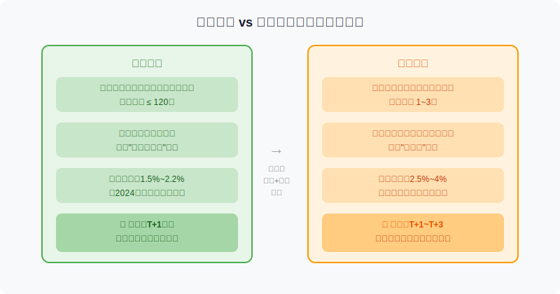
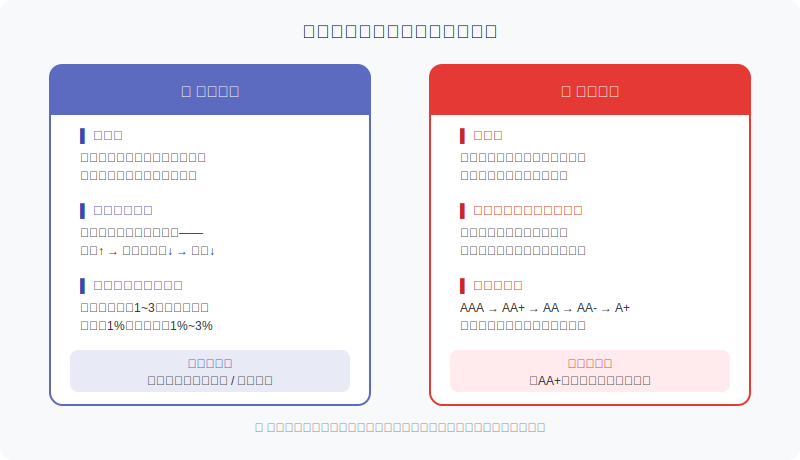
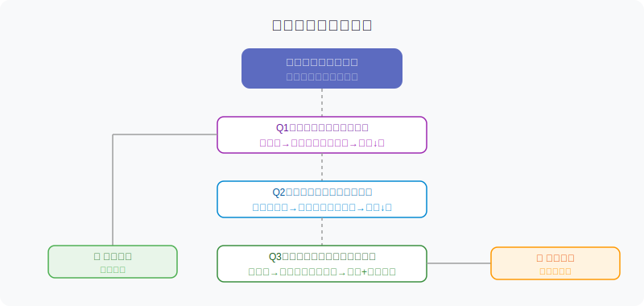

## 散户投资小白金融全品种操盘手册 - 3.4 短债基金 —— 比货币基金多承担了什么风险
  
### 作者  
digoal  
  
### 日期  
2026-05-31  
  
### 标签  
金融产品 , 金融工具 , 散户 , 投资小白 , 全品操盘手册  
  
----  
  
## 背景 
  

## 先给你看一个让人困惑的现象

2022年11月，国内债券市场经历了一次快速调整。货币基金的净值一如既往地平稳，但许多短债基金在短短两周内回撤了0.5%~1.5%。

投资者蒙了：同样是"低风险固收产品"，为什么短债基金会跌？

答案很简单，但背后的逻辑很多人从来没想清楚过：**短债基金和货币基金是完全不同级别的风险产品，被归到一类，是因为名字听起来差不多——但它们承担的风险，结构上就不一样。**

这节课，我们就来拆透这件事。

---

## 货币基金 vs 短债基金：先看清楚两者的底层结构

### 货币基金是怎么运作的？

货币基金把钱放在三个地方：
1. **银行存款和协议存款**（占大头）
2. **国债逆回购**（把钱短期借给市场，拿利息）
3. **短期国债和央行票据**（最高等级的债券，期限极短）

关键点是：货币基金的平均持仓久期（久期=债券价格对利率的敏感度）**不得超过120天**，且不允许持有信用等级低的债券。

更重要的是，货币基金采用**摊余成本法估值**——简单说，就是把预期收益平摊到每一天，净值曲线几乎是一条向上的直线，不会因为市场波动而出现净值下跌的情况（除非极端情况如产品违约）。

### 短债基金是怎么运作的？

短债基金把钱放在：
1. **短中期债券**（包括国债、政策性金融债、企业信用债）
2. **债券期限通常在1~3年**

关键区别有两点：
- 久期更长（1~3年 vs 货币基金的120天以内）
- 持仓包含**企业信用债**（有可能是评级AA或更低的债券）
- 采用**市值法估值**——每天按市场实际价格计算净值，有涨有跌

这两个区别，决定了短债基金多承担了两类货币基金几乎没有的风险。

---

## 短债基金多承担了什么风险？

### 风险一：利率风险（久期风险）

**核心逻辑：债券价格和利率反向运动。**

打个比方。你现在持有一张票息3%的债券，明天市场新发的债券利率涨到4%。你手上那张3%的旧债，有谁愿意以原价买？没人。因为买新债可以直接拿4%，买你的旧债还得吃利率损失。为了能卖出去，你只能降价——这就是利率上升导致债券价格下跌的原因。

**久期越长，价格对利率变动越敏感。**

- 货币基金持仓久期约0.3年，利率升1%，理论净值跌约0.3%，且摊余成本法还会平滑掉这个波动
- 短债基金久期约1~3年，利率升1%，净值可能下跌1%~3%，且按市值法实时显示这个损失

2022年11月那场债市调整，就是因为市场预期利率上升，短债基金的净值随之下跌，而货币基金毫无感知。

### 风险二：信用风险（违约风险）

**核心逻辑：你买的不是国家信用，而是企业信用。**

货币基金基本不碰企业信用债，短债基金则会持有。企业信用债的含义是：某家公司向市场借钱，承诺按时还本付息。但如果这家公司资金链断裂，还不上钱，债券可能出现部分乃至全额损失。

债券信用评级从高到低：**AAA → AA+ → AA → AA- → A+ → A → BBB**

评级越低，收益率越高（发行方要出更高利息才能吸引投资者），但风险也越大。

短债基金里，如果持仓的某只债券发生信用风险事件（评级下调、公告违约），基金净值会立即跳水。这不像利率风险那样是渐进的，信用风险往往是突然出现的大跌。

以2020年永煤控股违约事件为例（资料来源：Wind数据，2020年11月）：持有永煤债的债基，单日最大跌幅超过2%，部分以信用债为主的短债基金受到波及。

---

## 第一性原理分析

**核心观点：短债基金的超额收益，是对两类风险的补偿，不是免费的午餐。**

【前提清单】

支撑"短债基金收益高于货币基金"成立需要以下前提：

- **前提A**：信用债发行主体能按期偿债 → 【变量】→ 若经济下行、企业现金流恶化，可能被推翻
- **前提B**：持有期间利率保持稳定或下行 → 【变量】→ 若央行加息或市场流动性收紧，债券价格会下跌
- **前提C**：基金经理选券能力稳定，不踩雷 → 【变量】→ 因人而异，历史业绩不代表未来

【情景推演】

| 情景 | 条件 | 结果 | 操作建议 |
|------|------|------|---------|
| 正常情景 | 利率稳定或下行，信用环境良好 | 短债跑赢货币基金0.5%~2% | 持有，按计划操作 |
| 压力情景 | 利率快速上升（如2022年11月） | 短期净值回撤，持有1~3个月可修复 | 不要赎回，等待修复 |
| 极端情景 | 持仓债券违约 + 利率大幅上升 | 净值大幅下跌，修复周期长或无法修复 | 提前选择持仓评级高的产品来避免 |

---

## 实操例子

**场景设定**：小明有30万元分为两笔来运作：
- 15万元：备用金，可能3个月内要动用
- 15万元：闲置资金，1年内不需要动

**步骤一：备用金的处理**

15万元放货币基金（如天弘余额宝、华宝添益）。原因：货币基金T+1甚至实时可赎，且净值不会亏损，满足"随时能动"的需求。

**步骤二：闲置资金的处理**

15万元可以考虑短债基金，比如：
- 选择主投政策性金融债（国开债为主）的短债基金：利率风险有，但信用风险极低
- 或选择持仓以AA+以上信用债为主、久期在1.5年以内的短债基金

**步骤三：买之前要看的三件事**

1. **基金持仓信用评级分布**：在基金季报中找"债券持仓"，看AAA和AA+占比是否超过80%
2. **基金过去利率上升时的回撤幅度**：2022年四季度，该基金跌了多少？跌幅超过1.5%的，久期较长，需谨慎
3. **基金规模**：规模太小（< 5亿元）的短债基金，遇到赎回压力时可能被迫卖债，净值波动更大

**如果买错了怎么办？**

假设你买进去后遇到债市调整，净值跌了0.8%。这时候不要慌着赎回——短债基金的持仓都是有到期日的，只要底层债券不违约，价格终究会回到票面价值附近。历史数据显示（Wind数据，2018~2024年区间统计），持有短债基金超过6个月，正收益概率超过90%。

历史规律仅供参考，不代表未来必然如此。

---

## 数据佐证

**佐证1：历史收益率对比**

根据Wind数据（2019~2024年，纯债型短债基金指数 vs 货币市场基金指数对比）：

| 产品类型 | 年化平均收益（5年均值） | 最大单年回撤 |
|---------|----------------------|-------------|
| 货币基金 | 约 2.1% | 0%（几乎无回撤） |
| 短债基金 | 约 3.2% | 约 1.5%（2022年） |

超额收益约1%，代价是偶尔的净值下跌。

**佐证2：信用风险并非零概率**

根据中债登统计（2021~2023年），国内信用债市场每年违约规模在1500~3000亿元之间，主要集中在房地产、城投（弱资质）等领域。对于主投高等级信用债的短债基金，踩雷概率低，但不为零，这也是为什么选基金时信用评级分布是核心指标之一。

---

## 可复用框架

**【短债选基四看法】**

适用场景：筛选一只靠谱的短债基金时

核心逻辑：风险来自利率和信用，选基的核心就是控制这两个来源

操作步骤：

1. **看久期**：基金说明书中的"组合平均久期"，最好在1.5年以内，1年以内更好
2. **看信用质量**：持仓中AAA+AA+的合计占比 ≥ 80%，含AA-及以下持仓越少越好
3. **看历史最大回撤**：2022年四季度债市调整时，该基金跌了多少？是衡量利率风险的好时间窗口
4. **看规模**：建议选择规模20亿元以上的产品，赎回冲击小，流动性更稳定

举一反三：这个框架同样适用于中长期债基、信用债基的筛选，只是各项阈值会调整。

---

## 你的决策树

---

## 本节行动清单

1. **确认你有多少"闲置超过6个月"的钱**：这部分才适合考虑短债基金，不要把短期要用的钱往里放
2. **在基金平台上找一只短债基金**，打开它的季报，找到"债券持仓分布"，看一眼AAA和AA+占比是否超过80%
3. **回看该基金2022年10月~12月的净值曲线**：最大跌幅超过1.5%，说明久期偏长；跌幅在0.5%以内，说明久期控制较好
4. **不要因为短期净值下跌就赎回**：持有期低于3个月就赎回，很可能把浮亏变成实亏
5. **从小钱开始**：第一次买短债基金，先用1~2万元体验一次完整的波动周期，再决定是否加仓

---

## 一句话总结

短债基金不是"高收益版货币基金"，而是用利率风险和信用风险换取超额收益的低风险工具——在你充分理解这两类风险之前，货币基金依然是更安全的选择。

---

> ⚠️ **声明**：本文内容为投资教育目的，所有历史数据、策略框架均为辅助学习工具，不构成证券投资建议。市场有风险，投资需谨慎。实际操作请结合自身风险承受能力，必要时咨询专业投顾。
  
  
#### [PostgreSQL 解决方案集合](../201706/20170601_02.md "40cff096e9ed7122c512b35d8561d9c8")
  
  
#### [德哥 / digoal's Github - 公益是一辈子的事.](https://github.com/digoal/blog/blob/master/README.md "22709685feb7cab07d30f30387f0a9ae")
  
  
#### [About 德哥](https://github.com/digoal/blog/blob/master/me/readme.md "a37735981e7704886ffd590565582dd0")
  
  

  
