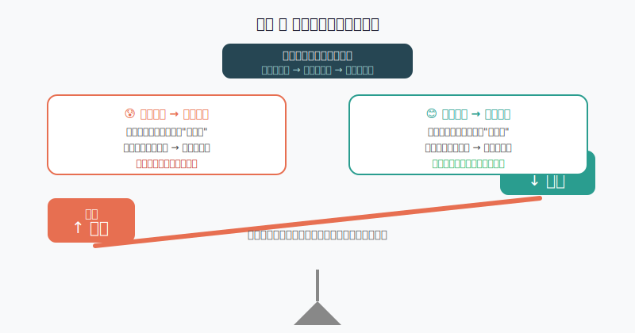
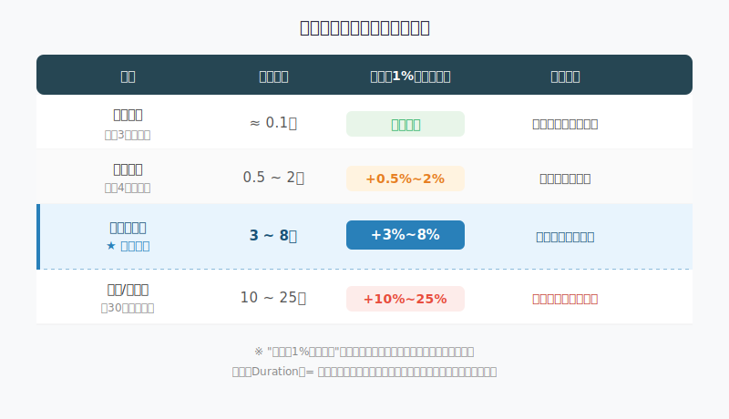
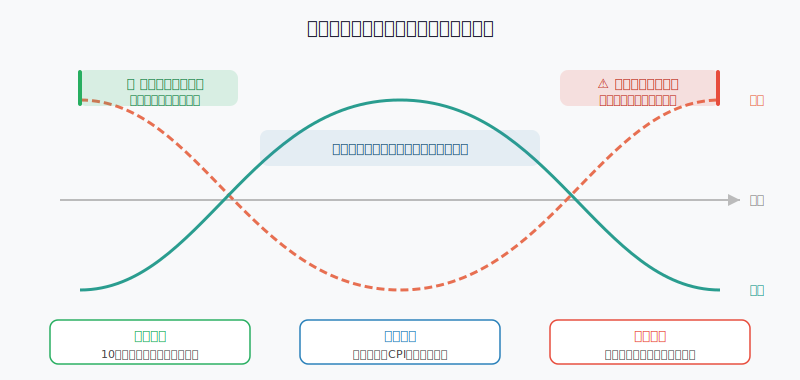

## 散户投资小白金融全品种操盘手册 - 3.5 中长期债券基金 —— 利率下行时，为什么它能赚钱？
  
### 作者  
digoal  
  
### 日期  
2026-05-31  
  
### 标签  
金融产品 , 金融工具 , 散户 , 投资小白 , 全品操盘手册  
  
----  
  
## 背景 
  

  

## 开篇：一个让很多人困惑的现象

2023年底到2024年上半年，A股震荡、股票型基金亏钱，但有一类基金悄悄涨了8%、10%，甚至更多。

它叫**中长期纯债基金**。

许多人第一反应是：债券不就是"固定利息"吗？怎么还能涨这么多？

这个问题，是理解整个债券市场最关键的入口。搞懂它，你就能知道什么时候应该配中长期债基、什么时候应该跑。

---

## 第一步：债券是什么？用"借条"来理解

你借给别人10000元，对方给你一张借条，写着："每年付你3%利息（即300元），3年后还本。"

这张借条，就是一张债券。

问题来了：如果1年后市场利率突然涨到5%，有人愿意按年付500元，你手里那张每年只给300元的借条，还值10000元吗？

当然不值了。没人愿意用10000元买一张"差劲"的借条，市场会把你的借条价格压到大约9600元，让"年收益率"也等效涨到5%——这样才公平。

**这就是债券定价的铁律：利率涨，债价跌；利率跌，债价涨。**

---

## 第二步：中长期债基凭什么波动更大？

债券基金里，有一个核心指标叫**久期（Duration）**。

> 久期 ≈ "如果利率变1%，我的净值会变多少百分点"的量化指标。

久期越长，利率变动对净值的冲击越大，就像翘翘板的臂长越长，一端的轻微变动，另一端就会放大很多倍。

**关键数字记住就行：**

- 货币基金：久期约等于0，利率怎么变，它基本不动
- 短债基金：久期0.5~2年，利率降1%，净值涨约0.5%~2%
- **中长期债基：久期3~8年，利率降1%，净值涨约3%~8%**
- 超长债（30年国债ETF）：久期可达15~25年，利率降1%，净值涨可能超15%

这就解释了开篇的现象：2023年底到2024年上半年，中国10年期国债收益率从约2.7%跌到2.3%，降幅接近0.4%。对于久期约8年的中长期债基来说，理论净值涨幅大约是 **0.4% × 8 = 3.2%**，加上本身的利息收入，累计涨8%~10%并不夸张。

---

## 第三步：第一性原理——"利率下行时债基赚钱"的前提是否稳固？

**【前提清单】**

支撑"利率下行时，中长期债基净值上涨"成立，需要以下前提：

- **前提A：持有的债券是固定利率债券** → 【常量】→ 中长期纯债基金持仓主要是国债、政策性金融债，固定利率品种，这点基本稳固。
- **前提B：利率下行幅度大于已知** → 【变量】→ 如果利率降幅比预期小、甚至不降，净值涨幅就很小，只剩利息收益。
- **前提C：市场信用风险整体稳定** → 【变量】→ 如果市场信用风险爆发（类似2022年底理财赎回潮），债基可能跌价，即使利率下行也可能阶段性亏损。
- **前提D：没有大规模赎回导致基金被动卖债** → 【变量】→ 市场恐慌时，大量赎回会迫使基金经理低价卖债，短期净值可能重创。

**【情景推演】**

- **正常情景（前提全部成立）：** 利率持续下行 → 债基净值稳步上涨 → 持有1~3年，年化回报可能达5%~10%。
- **压力情景（前提C局部破坏）：** 信用债出现违约潮 → 部分企业债大跌 → 购买纯债基或国债ETF可以规避，但混合型基金受冲击大 → 操作调整：选纯债基，优先配国债、政策性金融债，回避高收益信用债。
- **极端情景（前提C+D同时破坏）：** 类似2022年底理财赎回潮 → 即便国债没问题，大规模赎回让基金被迫砸盘 → 净值短期可能跌3%~5% → 操作调整：提前减少仓位，持有期限拉长，不因短期波动恐慌赎回。

---

## 第四步：历史数据说话

以下数据来自公开市场，历史不代表未来，但可以帮我们理解"规律是否稳定"：

**案例一（成功案例）：2018~2019年利率下行周期**

2018年初，10年期国债收益率约3.9%，之后持续下行，至2019年初接近3.1%，降幅约0.8%。
同期，中长期纯债基金（久期约5年）平均年化回报约6%~8%（Wind数据，2018~2019年）。这段收益的来源：利息约3.5%，价格上涨约3%~5%。

**案例二（亏损案例）：2022年底理财赎回潮**

2022年10~12月，债市出现了近10年最大规模的赎回潮。原因是银行理财打破刚兑后，短期净值波动让投资者集体赎回，导致基金被迫卖债，债价反而大跌。
同期，部分中长期债基在1个月内跌了3%~5%。这恰好说明：**债基的风险不只来自利率，还来自流动性。**

**结论：中长期债基有明确的盈利周期，也有阶段性的赎回风险。不是买了就能躺赢，需要理解自己在哪个环境里。**

（数据来源：Wind资讯，中国人民银行公开数据；历史数据仅供参考，不代表未来收益。）

---

## 第五步：什么时候买，什么时候跑？

### 买入条件（三个同时满足，才考虑建仓）

1. **10年期国债收益率处于近3年偏高位置**（中国可参考中国债券信息网，或理财APP里的"国债收益率"）
2. **央行货币政策处于宽松周期**：降准、降息信号明显，或官方表态"支持宽松"
3. **CPI（居民消费价格指数）处于低位或下行**：低通胀意味着央行有空间继续降息，利率下行预期稳固

### 减仓/止盈条件（出现其中一个，就要认真评估）

1. **10年国债收益率创近3年新低**：说明债市可能已经"透支预期"，未来上涨空间收窄
2. **通胀预期明显升温**：CPI连续上行，或大宗商品大幅反弹，央行再降息的概率下降
3. **股市大幅上涨、风险偏好明显回升**：资金会从债市流向股市，可能引发债市调整

---

## 第六步：实操例子（具体步骤）

**假设场景：**  
小明有30万元，当前10年国债收益率2.8%（处于近3年偏高位），央行刚完成一次降准，CPI约0.5%。他计划配置中长期债基。

**操作步骤：**

**第一步：确认仓位上限**  
根据第三章第九节的"三层资金法"，中长期债基属于"防守资金"中的进攻性部分。小明决定最多用30万的20%，即6万元，配置中长期债基。

**第二步：选择品种**  
优先选择：
- 纯债型、持仓以国债/政策性金融债为主（看基金季报持仓）
- 久期适中（3~6年为宜，不要买30年超长债基，波动太大）
- 成立超5年，规模超20亿（基金规模太小，赎回冲击大）
- 管理费率低于0.5%/年

**第三步：分批建仓**  
不一次买满，分2~3次：第一次买2万，1~2个月后再评估，利率是否如预期继续下行，再买第二批。

**第四步：设好止损线**  
中长期债基的止损线建议设在：**买入后净值下跌超过3%**。如果出现异常（如赎回潮），果断减仓，不要扛。

**如果判断错了，利率反而上行：**
- 净值可能跌3%~5%，不要慌，先判断：是我的逻辑错了（利率下行周期结束），还是短期波动？
- 逻辑错了 → 止损出局，损失控制在3%以内
- 短期波动 → 看央行是否继续宽松信号，维持持有

---

## 第七步：中长期债基 vs 短债基金，怎么选？

| 维度 | 短债基金 | 中长期债基 |
|------|---------|----------|
| 利率下行时弹性 | 小（涨0.5%~2%）| 大（涨3%~8%）|
| 利率上行时风险 | 小 | 大 |
| 适合周期 | 利率不确定时 | 明确利率下行时 |
| 赎回灵活性 | 高（T+1到账）| 中（T+1到账，但净值波动大） |
| 推荐场景 | 不确定方向，先守住 | 央行宽松信号明确时 |

**一句话判断：** 如果你能比较确定"未来1~2年央行大概率继续降息"，中长期债基是更好的选择；如果你不确定方向，先买短债基金，保留切换机会。

---

## 可复用框架

**【债基切换框架】（5字：看利率换档位）**

适用场景：在货币基金、短债基金、中长期债基三档之间灵活切换  
核心逻辑：利率越高，债价越有上涨空间，可以买更长久期；利率越低，风险越大，缩短久期  

操作步骤：
1. 查当前10年国债收益率（中国债券信息网 / 理财APP）
2. 对比近3年区间：处于高位→配中长期债基；中位→配短债；低位→缩回货币基金
3. 每季度重新评估一次，不用频繁操作

举一反三：这个框架同样适用于债券ETF（如国债ETF、政金债ETF）的配置切换，逻辑完全相同。

---

## 本节行动清单

- [ ] 打开手机理财APP或搜索"10年期国债收益率"，查看当前所处历史区间
- [ ] 如果当前处于偏高位，在基金平台筛选"中长期纯债基金"，查看其久期和持仓
- [ ] 确认自己的"防守资金"有多少，按不超过20%的比例设定中长期债基仓位上限
- [ ] 建立一条止损规则：净值跌幅超过3%时，评估逻辑是否仍成立
- [ ] 记住：中长期债基不是保本工具，它是"利率下行周期的进攻型防守资产"

---

## 一句话总结

中长期债基靠的不是神秘魔法，而是一条铁律：**利率跌，债价涨；久期越长，涨幅越大**——在央行宽松周期里，它是散户少数能"看懂逻辑"的品种之一，值得学会用，但不值得盲目重仓。

---

> ⚠️ **声明**：本文内容为投资教育目的，所有历史数据、策略框架均为辅助学习工具，不构成证券投资建议。市场有风险，投资需谨慎。实际操作请结合自身风险承受能力，必要时咨询专业投顾。
  
  
#### [PostgreSQL 解决方案集合](../201706/20170601_02.md "40cff096e9ed7122c512b35d8561d9c8")
  
  
#### [德哥 / digoal's Github - 公益是一辈子的事.](https://github.com/digoal/blog/blob/master/README.md "22709685feb7cab07d30f30387f0a9ae")
  
  
#### [About 德哥](https://github.com/digoal/blog/blob/master/me/readme.md "a37735981e7704886ffd590565582dd0")
  
  

  
