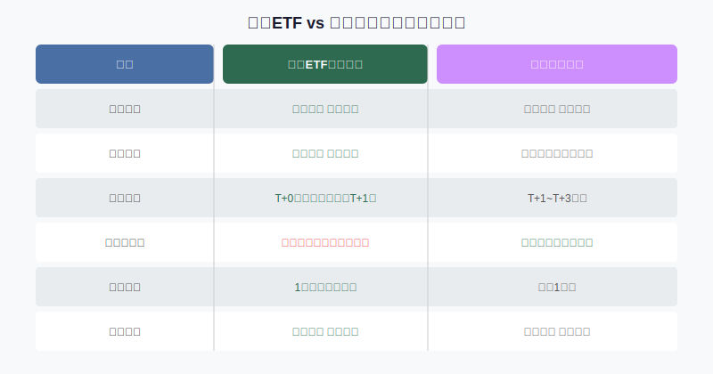
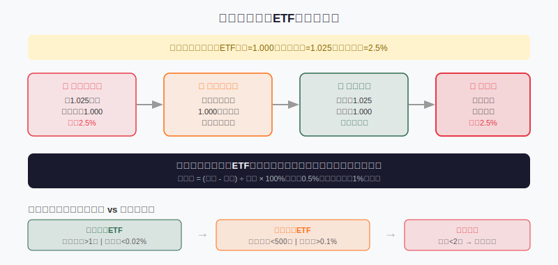
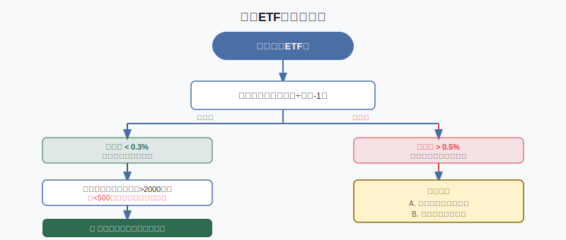

## 散户投资小白金融全品种操盘手册 - 3.6 债券ETF —— 场内交易、波动、折溢价和流动性
  
### 作者  
digoal  
  
### 日期  
2026-05-31  
  
### 标签  
金融产品 , 金融工具 , 散户 , 投资小白 , 全品操盘手册  
  
----  
  
## 背景 
   


## 先问你一个问题

你知道吗？买债券ETF有时候能在债券没涨没跌的情况下亏钱。

不是因为看错了方向，而是因为——你多付了钱。

这听起来很荒谬，但它每天都在发生。搞懂这件事，是散户玩债券ETF的第一道门槛。

---

## 债券ETF是什么：先理解"场内"这两个字

如果你买过货币基金（比如余额宝），你知道那是"场外"产品——钱放进去，基金公司按当天净值给你份额，第二天看数字有没有涨。

债券ETF不一样，它是"场内"产品——意思是它像股票一样，在证券交易所挂牌，你得用证券账户买卖，价格实时变动，每秒都不一样。

用一个比喻：同样是"苹果汁"，场外债基是去果汁工厂直接按斤买（按净值），债券ETF是在超市货架上按标价买（按市价）——货架上的价格可能比出厂价贵，也可能比出厂价便宜。



核心差异就一张表说清楚了。接下来，我们展开最重要的三件事：**价格波动、折溢价、流动性**。

---

## 第一件事：债券ETF的价格为什么会波动

债券ETF追踪的是一篮子债券。债券的价格每天都在变（主要受利率影响——利率涨，债价跌；利率跌，债价涨）。所以债券ETF的**净值**（即内在价值）会每天变化。

但除了净值，债券ETF还有一个**市价**——就是在交易所里大家出价买卖形成的价格。

这两者通常很接近，但不完全相同。

**净值**可以理解为"这篮子债券今天真正值多少钱"。

**市价**可以理解为"现在有人愿意用多少钱买/卖"。

理解这个区别很重要，因为它直接决定你买债券ETF时"有没有冤枉钱"。

---

## 第二件事：折溢价——最容易踩的坑

**溢价**（Premium）：市价 > 净值。你花了比内在价值更贵的钱买。

**折价**（Discount）：市价 < 净值。你用比内在价值更便宜的价格买到了。

计算公式：
```
溢价率 = (市价 - 净值) ÷ 净值 × 100%
```

举个真实感的例子：
- 某债券ETF净值 = 1.000元
- 当天市价 = 1.025元
- 溢价率 = 2.5%

这意味着什么？你花1.025元买的东西，实际价值只有1.000元。你刚买入就亏了2.5%。

更糟糕的是，**这部分亏损和债券市场无关**，是你自己多付的"冤枉钱"。而且套利机制会很快把价格压回来——市场上的机构看到溢价，会在场外直接用净值申购基金份额，然后在场内卖掉，这个动作持续下去，溢价就消失了，你的持仓市值也跟着缩水。



**第一性原理分析：溢价为什么会出现？**

```
【前提清单】
支撑"高溢价会自动收敛"成立需要以下前提：
- 前提A：存在可以在场内外之间套利的机构 → 【常量】→ 大型ETF都有做市商机制，通常成立
- 前提B：场内外申赎通道畅通 → 【变量】→ 某些特殊情况（如跨境ETF暂停申购）时通道可能关闭
- 前提C：基金规模足够大，套利有利可图 → 【变量】→ 小规模ETF套利成本高，溢价可能长时间不收窄

【情景推演】
正常情景（前提全部成立）：溢价通常在1~3个交易日内收窄，耐心等候即可
压力情景（前提B被推翻，如暂停申购）：溢价可能维持数月，典型案例是2023年部分QDII基金
极端情景（前提B+C同时推翻）：溢价长期存在，小ETF可能直到清盘才"归零"
```

**实际判断标准**：
- 溢价率 < 0.3%：正常，可以操作
- 溢价率 0.3%~0.5%：轻微偏高，可小仓位介入
- 溢价率 > 0.5%：明显偏高，建议等候或换场外产品
- 溢价率 > 1%：高度警惕，除非有特殊理由，否则不碰

**折价**反过来：你可以用便宜价格买到债券，通常不亏，但也要看为什么折价（可能是流动性差，卖出时也难卖）。

---

## 第三件事：流动性——你能不能"随时跑路"

债券ETF有一个容易被小白忽略的风险：**流动性分层**。

不是所有债券ETF都能想买就买、想卖就卖。

流动性差的ETF，可能出现：
1. **买卖价差大**：挂单买1.000，卖单却在1.015，中间差1.5%，这是摩擦成本
2. **成交量极低**：挂了半天也没人接单，或者一卖就把价格砸下去
3. **清盘风险**：规模太小的ETF可能被基金公司关闭，强制赎回

**判断债券ETF流动性的三个指标**：

| 指标 | 健康标准 | 危险信号 |
|------|---------|---------|
| 日均成交额 | > 2000万 | < 500万 |
| 基金规模 | > 5亿 | < 2亿 |
| 买卖价差 | < 0.05% | > 0.1% |

数据在哪里查？Wind、同花顺、各基金公司官网都有，东方财富APP搜ETF代码可以直接看到。

---

## 常见债券ETF品种速览

中国市场主要债券ETF分几类：

**国债/利率债ETF**：追踪国债价格，信用风险极低，波动也相对小。代表产品如"国债ETF"、"10年国债ETF"。适合当做防守仓位。

**信用债ETF**：含企业债、公司债，收益比国债高一点，但有信用风险（企业可能违约）。

**政金债ETF**：追踪国开债、农发债等政策性银行债券，介于国债和信用债之间。

**可转债ETF**：追踪可转债指数，波动比纯债大很多，更接近权益资产（股票属性），和本章讨论的纯债产品不一样，后面单独讲。

对于本章主题"低风险工具"，优先考虑**国债ETF和政金债ETF**，信用债ETF次之，可转债ETF单独评估。

---

## 实操例子：从查溢价到下单

**场景设定**：
- 你有3万元打算配置一部分到债券ETF
- 市场处于利率下行周期，你判断债券可能还有上涨空间
- 你打算买"30年国债ETF"

**第一步：查净值和市价**

打开东方财富APP，搜索"30年国债ETF"（代码511090），找到"实时净值"和当前价格。
- 假设净值 = 1.1230元，当前价 = 1.1250元
- 溢价率 = (1.1250 - 1.1230) ÷ 1.1230 × 100% ≈ 0.18%
- 结论：溢价正常，可以操作

**第二步：查成交量和规模**

同页面看"日成交额"和"基金规模"。
- 假设日成交额5亿，规模200亿
- 结论：流动性充足，没问题

**第三步：下单时用限价单**

不要用市价单——因为债券ETF的买卖价差虽然通常很小，但市价单可能以较高价格成交。
- 操作：在当前市价附近，挂一个略低0.01%的限价买单
- 如果没成交，可以小幅提价直到成交

**第四步：建立仓位上限**

债券ETF虽然波动小，但也可能亏损（尤其长久期）。这3万元的债券ETF仓位设上限：不超过总投资账户的20%。

**如果溢价偏高（比如达到0.8%）怎么办？**
两个选项：
A. 切换到同标的的场外指数基金，避免溢价
B. 等1~3天，观察溢价是否自然收窄后再入场

**错误操作后果**：如果在溢价率2.5%时买入，即使后来债券上涨1%，你也是亏1.5%的状态出来的。

---

## 债券ETF的波动：没想象中的小

这里有个认知误区需要打破。

很多人以为债券ETF"很稳"，类似货币基金，每天涨一点点。

这个判断对部分产品成立（比如短债ETF），但对**长久期债券ETF完全不成立**。

以"30年国债ETF"为例：
- 2023年全年涨幅约11%（利率下行期）
- 2013年大跌期间，长债ETF单年最大回撤曾超过5%
- 2022年11月，债市突发调整，部分长债ETF单日跌幅超过1%

**久期**（Duration，衡量债券价格对利率变化的敏感度）越长，波动越大。

| 产品类型 | 典型久期 | 利率变动1%时价格变动 |
|---------|---------|-------------------|
| 货币ETF | 约0.1年 | ≈0.1% |
| 短债ETF | 约1~2年 | ≈1~2% |
| 中债ETF | 约3~5年 | ≈3~5% |
| 30年国债ETF | 约15~20年 | ≈15~20% |

这意味着：买30年国债ETF，和买股票的风险不在一个量级上，但也远不是"稳稳的幸福"。

**结论**：根据风险承受能力选择合适久期。防守型资金用短债ETF；进攻型看好利率下行趋势，才配置长债ETF，且仓位要有限制。

---

## 决策框架：债券ETF买入检查清单



---

## 可复用框架

**【ETF场内买入三看法】**

适用场景：所有在场内交易的ETF（债券、股票、黄金均适用）  
核心逻辑：场内ETF的"好价格"需要同时满足三个条件  
操作步骤：
1. **看溢折价**：溢价率低于0.3%才考虑买入，高于0.5%暂缓或换场外
2. **看流动性**：日均成交额要过门槛（债券ETF建议>2000万）
3. **看规模**：基金规模不低于2亿，防清盘风险

举一反三：这个框架同样适用于黄金ETF、行业ETF，逻辑完全一样——每种场内ETF都可能出现溢价和流动性分层问题。

---

## 本节行动清单

1. **现在去查一下**：打开券商APP，搜索一只债券ETF（推荐先看"国债ETF"，代码019027），找到净值和市价，自己计算一次溢价率
2. **设立溢价警戒线**：今后买任何债券ETF前，溢价率必查，超过0.5%不买
3. **建立规模筛选习惯**：只买规模>5亿、日均成交额>2000万的债券ETF，把小规模产品从选择池中排除
4. **用限价单**：不管买卖，债券ETF一律用限价单，避免因价差吃亏
5. **按久期匹配资金性质**：防守钱配短债ETF，长期闲钱且判断利率下行才考虑长债ETF，别混用

---

## 一句话总结

> 债券ETF不是"更灵活的货币基金"——它是场内交易的债券基金，有溢价风险、有流动性分层、有久期风险；买之前先查溢价，选规模够大的，下单用限价，才算入门。

---

> ⚠️ **声明**：本文内容为投资教育目的，所有历史数据、策略框架均为辅助学习工具，不构成证券投资建议。市场有风险，投资需谨慎。实际操作请结合自身风险承受能力，必要时咨询专业投顾。
  
  
#### [PostgreSQL 解决方案集合](../201706/20170601_02.md "40cff096e9ed7122c512b35d8561d9c8")
  
  
#### [德哥 / digoal's Github - 公益是一辈子的事.](https://github.com/digoal/blog/blob/master/README.md "22709685feb7cab07d30f30387f0a9ae")
  
  
#### [About 德哥](https://github.com/digoal/blog/blob/master/me/readme.md "a37735981e7704886ffd590565582dd0")
  
  

  
