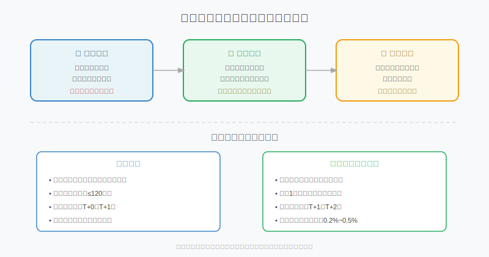
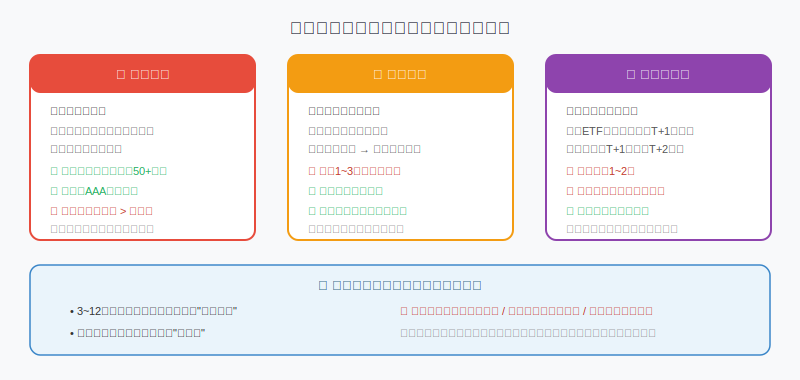
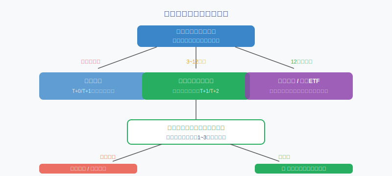

## 散户投资小白金融全品种操盘手册 - 3.7 同业存单指数基金 —— 比货基多赚的那点钱，值不值？
  
### 作者  
digoal  
  
### 日期  
2026-05-31  
  
### 标签  
金融产品 , 金融工具 , 散户 , 投资小白 , 全品操盘手册  
  
----  
  
## 背景 
  

## 先说一件让很多人困惑的事

2022年11月，债市突然剧烈下跌，大量银行理财净值跌破1元，引发赎回潮。同一时期，货币基金岿然不动；而同业存单指数基金（下称"存单基金"），部分产品净值也出现短暂下滑。

很多人第一次知道：**原来这东西也能亏？**

但同时，你翻看2021年到2024年的长期数据，存单基金的年化收益率比货币基金高出0.2%~0.5%（Wind数据，2021~2024年均值区间），且累计净值曲线整体向上。

所以问题来了：这笔额外的收益，是免费午餐，还是你在承担某种你没意识到的风险？

这一节的目标，就是帮你搞清楚这个问题。

---

## 同业存单是什么？

先从底层资产说起。

**同业存单**，是银行在银行间市场（不是普通储蓄市场，是专门给金融机构交易的市场）发行的一种固定期限存款凭证。

打个比方：普通储蓄存款是你把钱存给银行，银行给你一个存折；同业存单是A银行把钱"存"给B银行，B银行给A银行一张可以在市场上流通转让的"票据"。

关键特征：
- **发行人**：商业银行（含国有行、股份行、城农商行等）
- **期限**：通常1个月到1年
- **利率**：参考Shibor（上海银行间同业拆放利率）定价，随市场波动
- **流通性**：可在银行间市场二级买卖

**同业存单指数基金**，就是用一篮子同业存单构建的指数，基金经理按照规则（跟踪中证同业存单AAA指数等）持续买入、持有、滚动操作。

---

## 收益从哪来？三个来源，一个最重要

**第一，票息收入（最主要）**

银行发行存单时，约定一个利率（比如2.2%年化），到期还本付息。基金持有这些存单，就能按比例拿到这笔利息。这是存单基金的"基本盘"，和市场涨跌没有直接关系，只要存单不违约，这笔钱就会按时到账。

**第二，存单价格波动（可正可负）**

存单在二级市场可以流通，当市场整体利率上升，旧存单相对不划算，价格就会下跌；反之市场利率下降，存单价格上涨。这种波动幅度通常不大（因为期限短），但2022年底那次，Shibor短期内上了约80BP（基点，1BP=0.01%），导致部分存单价格短暂下跌，净值出现回撤。

**第三，滚动操作的复利效果**

存单到期后，基金经理继续买入新存单。不断滚动，利息收入再投入，形成复利。时间越长，这个效果越明显。

---

## 第一性原理分析："比货基多0.3%"的真正来源

很多人把存单基金当成"升级版货基"，觉得多赚那点利息是白赚的。这个理解是错的。

【前提清单】

支撑"存单基金长期跑赢货基"成立需要以下前提：

- **前提A：同业存单利率维持在合理水平** → 【变量】→ 若央行持续大幅降息，存单发行利率下行，超额收益收窄甚至消失
- **前提B：银行体系整体信用稳定** → 【相对稳定】→ 监管框架下，大规模违约概率极低，但中小行个体风险存在
- **前提C：你的持有期足够覆盖利率波动损失** → 【变量】→ 如果在利率上行期赎回，短期可能实现负收益

【情景推演】

**正常情景**（前提A、B、C全部成立）：持有满6个月以上，存单基金大概率比货基多赚0.2%~0.5%，收益稳定，净值曲线平缓上升。

**压力情景**（前提C被推翻——你三个月内急用钱赎回，且恰逢利率上行期）：可能实际收益低于货基，甚至亏损0.1%~0.3%（2022年11月实例中，部分产品短暂最大回撤约0.3%~0.5%，Wind数据）。对应操作调整：短期资金不放存单基金，老老实实用货基。

**极端情景**（前提B被推翻——个别银行违约）：指数基金因分散持仓，单家违约冲击有限，但仍会拖累净值。对应操作调整：优先选择跟踪AAA评级指数的基金，规避中小银行集中度过高的产品。

**结论：存单基金的"超额收益"不是免费的，而是你承担了额外的利率风险（短期可能亏）和极低概率的信用风险（极端情况）换来的。**

---

## 风险边界图：三类风险，哪个真的要命？

**信用风险：听着吓人，现实概率很低**

存单由银行发行，理论上银行倒闭存单就打水漂了。但实际上：
- 存单基金持仓分散在50家以上银行
- 好的产品只选AAA评级（银行评级最高档）
- 中国银行体系整体由监管层托底，国有行、大型股份行大规模违约的历史案例为零

不过，中小城农商行的存单利率更高，部分产品为追求收益会多配中小行。这里有微小但真实的风险差异，选基金时要看持仓集中度。

**利率风险：真实存在，但期限短意味着恢复快**

利率突然上升 → 存单价格下跌 → 净值短暂回撤。这是存单基金和货基最本质的区别：货基采用摊余成本法计价，净值几乎不动；存单基金按市值波动，净值会随市场起伏。

好消息是：存单期限通常不超过1年，久期（对利率变化的价格敏感度）远小于中长期债券基金。利率上行冲击通常几个月内会被票息收入覆盖。

**流动性风险：别把它当成零延迟的现金**

场内ETF版本：每个交易日可以买卖，T+1到账，流动性较好；场外申购的存单基金：申购T+1确认，赎回T+1~T+2到账，比货币基金慢1~2天。如果你某天急需资金周转，可能来不及。这不是设计缺陷，是存单本身流动性决定的。**不要把存单基金里的钱当成"随时取出"的现金。**

---

## 和货币基金、短债基金的关系：一张对比表

| 维度 | 货币基金 | 同业存单指数基金 | 短债基金 |
|------|----------|-----------------|----------|
| 主要资产 | 协议存款、国债、短期债券等 | 同业存单（AAA为主） | 各类短期债券 |
| 组合久期 | ≤120天 | 约180天 | ≤365天 |
| 净值波动 | 几乎没有 | 极小，偶有短暂回撤 | 略大 |
| 流动性 | T+0/T+1 | T+1/T+2 | T+1/T+2 |
| 预期年化（2021~2024均值区间） | 约1.8%~2.2% | 约2.1%~2.6% | 约2.3%~3.0% |
| 适合资金 | 随时要用的流动资金 | 3~12个月的备用金 | 6~12个月不动用的资金 |

*数据来源：Wind，2021年~2024年市场均值区间，仅作对比参考，历史收益率不代表未来。*

注意：上表的"预期年化"是参考范围，不同市场环境差异显著。2024年以来，随着央行降息，货基和存单基金的收益率均有所下降，具体参考当前产品7日年化。

---

## 如何选一只存单基金？四个看点

很多人问：同业存单指数基金那么多，有什么区别？

**看点一：跟踪哪个指数**

主流的是"中证同业存单AAA指数"，限定AAA评级，质量有保证。部分产品跟踪的指数评级要求较低，为获得更高收益配了更多中低评级存单，风险也更高。认准AAA。

**看点二：规模**

基金规模太小（低于10亿）可能面临流动性问题，申购赎回对净值的冲击也更大。优先选50亿以上的产品。

**看点三：费率**

同类产品竞争激烈，管理费+托管费合计应在0.2%以内，超过这个数要对比一下再买。

**看点四：场内还是场外**

场内ETF版本（如511380等代码结尾的）可以在股票账户直接买卖，流动性更好；场外版本在基金账户申购，操作更简单但稍慢。有股票账户且操作熟练的选场内，否则场外即可。

---

## 实操例子：小王的"子弹仓"管理

**场景**：小王有20万打算投A股，但觉得当前点位还不够便宜，想等调整再买。这20万放在银行活期（年化0.2%）心里不甘心，放货基又觉得收益太低。他决定试试存单基金。

**操作步骤**：

**第一步：确认时间线。** 小王判断自己最快3个月、最晚12个月内会用这笔钱建仓A股，时间是弹性的。→ 存单基金的持有期要求（建议3个月以上）匹配。

**第二步：在股票账户搜索"同业存单ETF"，选一只跟踪中证同业存单AAA指数、规模100亿以上、费率低于0.2%的产品，下单买入20万元份额。**

**第三步：设置一个提醒机制。** 小王在手机日历里每月提醒自己看一次净值，以及A股是否出现"可以建仓"的信号。

**第四步：等市场机会出现时。** 小王确认要建仓A股，在股票账户直接卖出存单ETF，T+1到账，次日用这笔钱买入A股ETF。整个流程损失1个交易日，但相比货币基金多赚了大约：

> 20万 × 0.3%（超额） × 6个月 ÷ 12 = 约300元额外收益

**如果操作错误会怎样？** 假设小王三个月后A股机会来了，但恰逢利率上行期，他赎回时存单基金净值比买入时低了0.2%，20万损失400元。这400元是他承担利率风险的代价，低于他觉得"可以忍"的范围（他事先设定止损线：如净值跌超1%则无条件赎回转回货基）。

**纠偏方式**：事前设好心理底线（最大可接受亏损），事后严格执行，不因"快要回本了"而拖延。

---

## 决策树：这笔钱到底该放哪？

用这张图做决策，90%的情况够用。

---

## 可复用框架

**【现金分层法】**

适用场景：有大额闲置资金，不知道分配到货基、存单基金还是短债基金。

核心逻辑：按资金的"使用急迫程度"分层，从流动性最好到最差依次配置，而不是全部押宝在收益最高的一档。

操作步骤：
1. 梳理这笔钱最早可能用到的时间节点（例：3个月内肯定会动、6个月内可能动、12个月内不确定）
2. 按时间节点切分：最快用的部分→货基；3~12个月→存单基金；12个月以上→短债基金
3. 每季度检视一次时间预期，若计划改变，对应调整仓位

举一反三：这个框架还可以用在配置A股ETF（当前要买的仓位）、黄金（中长期配置资金）、美股（跨周期稳仓）的分层逻辑上——资金性质决定工具选择，不是反过来。

---

## 本节行动清单

1. **查一下你的货基账户里有多少资金。** 如果超过6个月以上不会动，考虑把其中一部分（不超过50%）转入同业存单指数基金。

2. **在你的证券账户或基金APP搜索"同业存单指数基金"，筛选出规模50亿以上、跟踪中证同业存单AAA指数的产品，记录下来备用。**

3. **想清楚这笔钱的最早使用时间点。** 不确定的，保守估算最早可能用到的时间，如果不足3个月，不要放存单基金，继续留在货基。

4. **如果决定买入，设置净值跌幅提醒（如跌超0.5%提醒）。** 不是让你赎回，而是让你了解市场在发生什么。

5. **不要用存单基金替代生活应急备用金。** 那部分钱永远放货基或银行活期，存单基金只装"投资备用金"。

---

## 一句话总结

同业存单指数基金是**有期限门槛的"超级货基"**：持有够长，比货基多赚；急着用钱，可能不如货基——用对了是工具，用错了是坑。

---

> ⚠️ **声明**：本文内容为投资教育目的，所有历史数据、策略框架均为辅助学习工具，不构成证券投资建议。市场有风险，投资需谨慎。实际操作请结合自身风险承受能力，必要时咨询专业投顾。
  
  
#### [PostgreSQL 解决方案集合](../201706/20170601_02.md "40cff096e9ed7122c512b35d8561d9c8")
  
  
#### [德哥 / digoal's Github - 公益是一辈子的事.](https://github.com/digoal/blog/blob/master/README.md "22709685feb7cab07d30f30387f0a9ae")
  
  
#### [About 德哥](https://github.com/digoal/blog/blob/master/me/readme.md "a37735981e7704886ffd590565582dd0")
  
  

  
