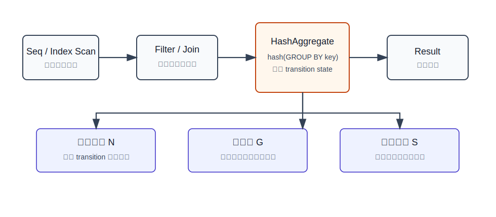
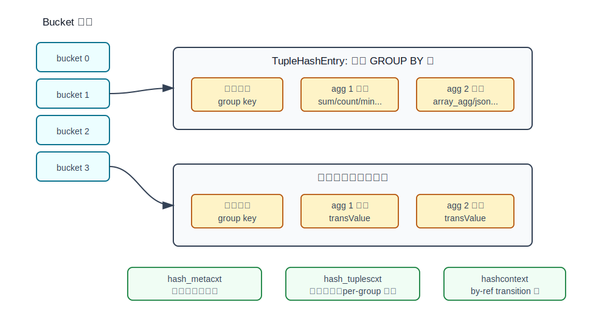
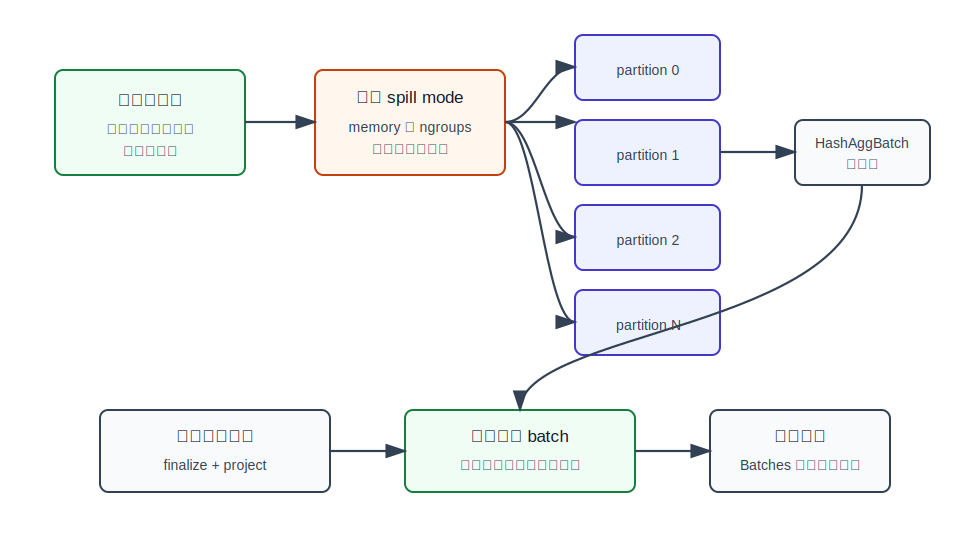
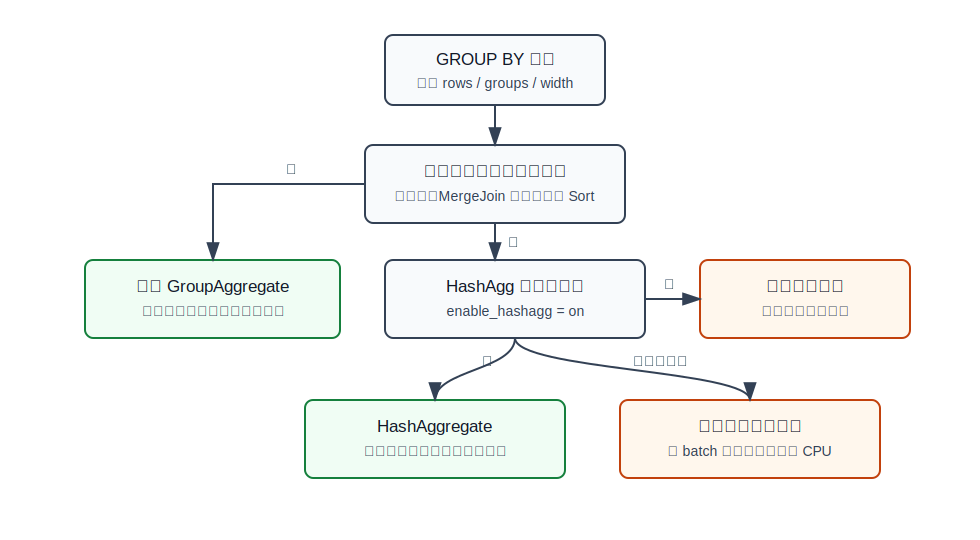
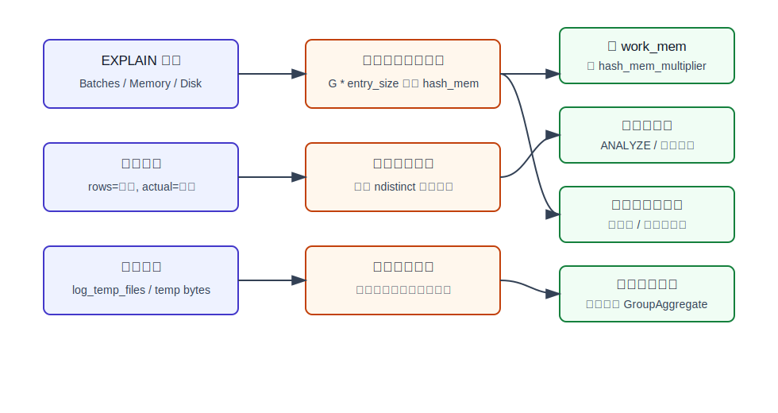

## 数据库筑基课 - 聚合之 Hash Agg

### 作者
digoal

### 日期
2026-05-31

### 标签
PostgreSQL , 应用开发者 , 数据库筑基课 , 执行器 , 聚合 , HashAggregate , work_mem

----

## 背景
  

本文属于“扫描与执行算法”类基础能力：理解数据库如何把 `GROUP BY` 从“先排序再逐组计算”变成“按分组键直接定位状态”的执行问题。

业务里最常见的聚合都不复杂：

```sql
SELECT user_id, count(*), sum(amount)
FROM orders
WHERE created_at >= now() - interval '1 day'
GROUP BY user_id;
```

真正难的是规模和分布：一天几亿行、几千万个用户、少数超级用户倾斜、聚合状态可能是 `array_agg()` 或 `jsonb_agg()`，还要和其他排序、连接、并发查询共同竞争内存。Hash Agg 的目标不是“让所有聚合都更快”，而是在输入没有合适排序时，用哈希表把每个分组的中间状态保存在内存里，避免为 `GROUP BY` 先做全量排序。

本篇聚焦 PostgreSQL 源码中的 `HashAggregate`，主要对应 `src/backend/executor/nodeAgg.c`、`src/backend/optimizer/path/costsize.c`、`src/backend/commands/explain.c` 和配置文档。

## 一、它解决什么问题？

聚合的本质是把 N 行输入压缩成 G 个分组结果。每个分组维护若干个 transition state，例如：

- `count(*)`：一个计数器。
- `sum(amount)`：一个累加值。
- `avg(amount)`：通常是 sum 和 count 的组合状态。
- `array_agg(x)`：可能持续增长的可变长状态。

传统排序聚合的路径是：先按 `GROUP BY` 键排序，再顺序扫描，遇到分组边界就输出上一组。这很稳，因为一次只需要维护当前组；但如果输入本来无序，就要付出排序成本和可能的排序临时文件。

Hash Agg 把问题改成：为每个分组键在哈希表里找一个条目，输入一行就更新对应分组状态。它牺牲的是内存稳定性：分组数越多、分组键越宽、transition state 越大，哈希表越可能超过 `work_mem * hash_mem_multiplier`，进而分区溢写到临时文件。

所以 Hash Agg 解决的是“无序输入上的分组定位成本”，不是“所有聚合的内存问题”。这点非常关键。

## 二、它是什么？

Hash Agg 是 PostgreSQL `Agg` 执行节点的一种策略。计划里通常显示为：

```text
HashAggregate
  Group Key: user_id
  Batches: 1  Memory Usage: 4096kB
```

在 PostgreSQL 源码里，聚合策略包括：

| 策略 | 计划常见形态 | 核心特点 |
|---|---|---|
| `AGG_PLAIN` | 无 `GROUP BY` 的 Aggregate | 全部输入形成一个结果 |
| `AGG_SORTED` | GroupAggregate | 输入按分组键有序，按边界输出 |
| `AGG_HASHED` | HashAggregate | 哈希表里每个分组一个状态 |
| `AGG_MIXED` | grouping sets 混合策略 | 同时处理排序和哈希分组集 |

本文说的 Hash Agg 主要对应 `AGG_HASHED`，并涉及 grouping sets 下的 `AGG_MIXED`。



图 1 说明：HashAggregate 位于子计划之上。它读取扫描、过滤、连接之后的输入元组，用 `GROUP BY` 键定位哈希表条目，更新每个聚合函数的 transition state，最后每个分组输出一行。输入行数 N 决定状态更新次数，分组数 G 和状态大小 S 决定内存风险。

## 三、核心原理

### 3.1 每个分组一个哈希表条目

`nodeAgg.c` 的注释直接说明：哈希聚合需要一个 hashtable，里面为每组 `GROUP BY` 值保存代表元组和一组 `AggStatePerGroup` 结构。`src/include/executor/nodeAgg.h` 进一步说明，在 `AGG_HASHED` 模式下，哈希表的每个 tuple group 都包含一个 `AggStatePerGroupData` 数组；每个元素保存某个聚合 transition 的当前值、是否为 NULL、是否还没有状态值。



图 2 说明：bucket 数组只负责快速定位。真正占内存的是每个不同分组键的条目：代表元组、分组键、每个聚合函数的 transition state，以及可变长状态引用。PostgreSQL 分别用 `hash_metacxt`、`hash_tuplescxt`、`hashcontext` 统计这些内存，因此 EXPLAIN 里的 Memory Usage 不是单一数组大小。

执行热路径可以简化成：

```text
for tuple in child_plan:
    key = evaluate_group_key(tuple)
    entry = lookup_or_create_hash_entry(key)
    advance_transition_functions(entry, tuple)

for entry in hash_table:
    finalize_aggregates(entry)
    project_result_row()
```

源码中的关键函数对应关系：

| 阶段 | 关键函数 | 作用 |
|---|---|---|
| 建表 | `build_hash_tables()` / `build_hash_table()` | 为每个哈希 grouping set 创建 `TupleHashTable` |
| 查找条目 | `lookup_hash_entries()` | 根据当前输入元组查找或创建分组条目 |
| 初始化条目 | `initialize_hash_entry()` | 给新分组分配并初始化 per-group transition 状态 |
| 更新状态 | `advance_aggregates()` | 执行 transition 或 combine 函数 |
| 输出结果 | `agg_retrieve_hash_table_in_memory()` | 遍历哈希表，finalize 并投影结果 |

### 3.2 内存上限不是简单的 work_mem

PostgreSQL 配置文档说明：`work_mem` 是排序和哈希等单个查询操作写临时文件前可用的基础内存；哈希类操作的实际限制由 `work_mem * hash_mem_multiplier` 决定，`hash_mem_multiplier` 默认值是 2.0。

源码函数 `get_hash_memory_limit()` 在 `src/backend/executor/nodeHash.c` 中实现：

```c
mem_limit = (double) work_mem * hash_mem_multiplier * 1024.0;
```

这个函数被 Hash Join、Hash Agg、Memoize 等哈希类节点共用。对 Hash Agg 来说，`hash_agg_set_limits()` 会在此基础上设置两个限制：

- `hash_mem_limit`：内存限制。
- `hash_ngroups_limit`：分组数量限制，用来防止 transition state 后续膨胀导致失控。

第二个限制很重要。`array_agg()`、`jsonb_agg()` 这类聚合的状态可能一开始很小，后面不断变大。只看“当前已分配内存”会滞后；所以 PostgreSQL 同时限制可留在哈希表里的 group 数。

### 3.3 超限后不是把整个哈希表刷盘

Hash Agg 的溢写策略不是“哈希表满了就把已有状态全部写出去”。`nodeAgg.c` 的注释描述了一个更细的策略：

1. 哈希表超过限制后进入 spill mode。
2. 已经在内存中的分组继续更新 transition state。
3. 需要创建新分组的输入元组不再进内存，而是按 hash 值写入分区 logical tape。
4. 内存批次输出后，再读回某个 spill batch，重建哈希表继续聚合。
5. 如果读回的 batch 仍然太大，可以递归分区溢写。



图 3 说明：Hash Agg 超限后保留已有内存分组，新的分组元组被分区写入 logical tapes。每个非空分区会变成 `HashAggBatch`，之后读回重放。`Batches: 1` 说明没有真正分批；大于 1 通常意味着发生过溢写或至少执行了多个批次。

几个实现细节值得注意：

- `hashagg_spill_init()` 选择分区数量，并为每个分区创建 logical tape。
- `hashagg_spill_tuple()` 只写后续处理需要的列，减少临时文件体积。
- 溢写时会把 hash 值也写出去，读回时可复用，避免重复计算哈希。
- `hashagg_finish_initial_spills()` 把分区转换为待处理 batch。
- `agg_refill_hash_table()` 每次读回一个 batch，清空哈希表后重新聚合。
- `hash_agg_update_metrics()` 统计峰值内存、磁盘使用量和 batch 数。

这和经典论文 *Hash-Based Joining and Aggregation with Limited Memory* 讨论的思想一致：有限内存下，哈希聚合不能假设所有分组都能常驻内存，必须把输入划分成更小的分区，让每个分区后续有机会在内存中完成。

### 3.4 优化器为什么有时不用 Hash Agg？

`cost_agg()` 在 `src/backend/optimizer/path/costsize.c` 中估算聚合成本。源码注释给出一个很实用的判断：在当前成本模型里，`AGG_SORTED` 和 `AGG_HASHED` 的 CPU 总成本被设计得非常接近；如果输入已经按分组键排序，`AGG_SORTED` 启动成本更低，并且没有哈希内存溢出风险，应该优先。



图 4 说明：Hash Agg 不是无条件胜出。输入已有合适排序时，GroupAggregate 往往更稳；`enable_hashagg` 关闭时，优化器会惩罚哈希聚合路径；预计分组状态超过内存时，`cost_agg()` 会把分区溢写的读写页和 CPU 成本加进去。

Hash Agg 的计划选择主要受这些因素影响：

| 因素 | 对 Hash Agg 的影响 |
|---|---|
| 输入是否已排序 | 已排序时 GroupAggregate 更有吸引力 |
| `enable_hashagg` | 关闭后哈希聚合路径被禁用或惩罚 |
| 分组数估计 `numGroups` | 直接影响哈希表规模、batch 估计和溢写成本 |
| 输入宽度 `input_width` | 影响 hash entry size 和临时文件体积 |
| transition state 大小 | 影响 `hash_agg_entry_size()` 和内存上限判断 |
| `work_mem` / `hash_mem_multiplier` | 决定哈希类节点可用内存 |

### 3.5 EXPLAIN 该看什么？

`src/backend/commands/explain.c` 的 `show_hashagg_info()` 会显示 Hash Agg 的关键指标。文本格式里常见：

```text
HashAggregate
  Group Key: foo
  Batches: 1  Memory Usage: 24kB
```

当优化器预计会分区时，可能显示 `Planned Partitions`。执行 `EXPLAIN ANALYZE` 时，如果发生溢写且 batch 数大于 1，会显示 `Disk Usage`。并行查询中，各 worker 的 HashAgg 指标也会分别显示。



图 5 说明：诊断不要只看 `Memory Usage`。`Batches` 和 `Disk Usage` 说明是否分批和落盘；估计 rows 与 actual rows 的偏差说明统计信息是否影响计划；临时文件日志和系统内存压力说明是不是单条 SQL 之外的并发问题。

## 四、横向对比

| 维度 | HashAggregate | GroupAggregate | 预聚合 / 物化汇总表 | 向量化 Hash Agg |
|---|---|---|---|---|
| 主要目标 | 无序输入上快速按 key 定位分组状态 | 有序输入上顺序聚合 | 把重复计算提前到写入或调度任务 | 批量处理多行，减少解释器和函数调用开销 |
| 依赖条件 | 分组状态最好能放入内存 | 输入已有排序或排序成本可接受 | 业务能接受延迟和维护成本 | 执行器支持 columnar/vectorized batch |
| 内存风险 | 分组数和状态大时高 | 通常只保留当前组，较低 | 查询时低，维护时另算 | 仍受 hash table 和状态大小限制 |
| 临时文件 | 溢写时按分区 batch 写 logical tapes | 排序可能写临时文件 | 构建或刷新时可能写临时文件 | 取决于实现 |
| 启动延迟 | 要先读完首个 batch 才输出 | 可按有序组逐步输出 | 查询启动快 | 批处理后输出 |
| 适合场景 | 高基数但可控、输入无序、过滤后聚合 | 有合适索引序、需要稳定内存 | 高频固定报表、仪表盘 | 分析型数据库、列存、CPU 密集聚合 |
| 不适合场景 | 超高基数、巨大可变状态、并发内存紧张 | 必须额外大排序且无索引支持 | 强实时和维度变化频繁 | 行存解释执行器中收益有限 |

论文 *Implementation Techniques for Main Memory Database Systems* 的背景是主内存数据库环境，强调用面向内存的数据结构和执行路径减少磁盘时代的代价假设。Hash Agg 的内存路径正体现了这种思想：热路径尽量落在内存哈希表和 transition state 上。但 PostgreSQL 是通用行存数据库，必须面对内存不足和并发，所以实现里有 spill batch，而不是假设“内存永远够”。

论文 *Vectorized execution strategies for query processing* 强调批量处理可以降低解释执行、函数调用和 cache miss 成本。PostgreSQL 当前 Hash Agg 不是 DuckDB/Vectorwise 那种全向量化聚合算子；它通过 `ExecBuildAggTrans()` 把参数求值和 transition 调用编译成较大的表达式步骤，减少逐函数调用开销。两者方向相近，但工程形态不同。

## 五、效果如何？

Hash Agg 的收益来自三点：

1. 不要求输入按分组键排序。
2. 每行只需定位哈希表条目并更新状态。
3. 多个聚合函数可以共享同一个分组定位结果。

代价也很明确：

1. 分组状态必须占内存，至少在当前 batch 内占内存。
2. 分组数估计错了，优化器可能低估 batch 和临时文件成本。
3. 溢写后会多出临时文件写入、读回、批次重放和递归分区成本。
4. 哈希分布、宽 key、可变长 transition state 会放大内存不确定性。

`cost_agg()` 对预计溢写的 Hash Agg 会加磁盘读写和 CPU 成本。源码注释还明确说，Hash Agg 在典型硬件和 OS 组合上的 IO 行为比 Sort 稍差，所以成本模型里对读写页乘了一个通用惩罚系数。这说明 PostgreSQL 并不把 Hash Agg 溢写看成“和排序落盘一样便宜”。

## 六、实操 DEMO

下面给一个最小实验脚本。本文没有在本地启动 PostgreSQL 实例执行它，因此不提供虚构的实际输出；读者可以在自己的测试库中执行。

```sql
DROP TABLE IF EXISTS hashagg_demo;
CREATE TABLE hashagg_demo AS
SELECT
  g AS id,
  (g % 100000) AS user_id,
  (random() * 100)::numeric(10,2) AS amount
FROM generate_series(1, 5000000) AS g;

ANALYZE hashagg_demo;

SET enable_hashagg = on;
SET work_mem = '16MB';
SET hash_mem_multiplier = 2.0;

EXPLAIN (ANALYZE, BUFFERS, SETTINGS)
SELECT user_id, count(*), sum(amount)
FROM hashagg_demo
GROUP BY user_id;
```

观察点：

- 计划节点是否是 `HashAggregate`。
- `Batches` 是否大于 1。
- 是否出现 `Disk Usage`。
- `rows=` 估计的分组数和 `actual rows=` 的实际分组数是否接近。
- `Settings` 是否显示你设置的 `work_mem` 和 `hash_mem_multiplier`。

如果想比较排序聚合，可以试：

```sql
SET enable_hashagg = off;

EXPLAIN (ANALYZE, BUFFERS, SETTINGS)
SELECT user_id, count(*), sum(amount)
FROM hashagg_demo
GROUP BY user_id;
```

或者给有序路径机会：

```sql
CREATE INDEX hashagg_demo_user_id_idx ON hashagg_demo(user_id);
ANALYZE hashagg_demo;

SET enable_hashagg = off;

EXPLAIN (ANALYZE, BUFFERS)
SELECT user_id, count(*), sum(amount)
FROM hashagg_demo
GROUP BY user_id;
```

如果是多列分组，统计信息很关键：

```sql
CREATE STATISTICS hashagg_demo_user_amount_ndistinct
  (ndistinct)
ON user_id, amount
FROM hashagg_demo;

ANALYZE hashagg_demo;
```

PostgreSQL 文档在 `planstats.sgml` 中专门展示了多列 `GROUP BY` 的分组数估计可能偏差很大，并可通过扩展统计中的 `ndistinct` 改善。

## 七、最佳实践

面向数据库架构师：

- 先判断聚合是临时报表、在线接口还是固定指标。如果是高频固定指标，预聚合或增量汇总可能比每次 Hash Agg 更稳。
- 对高基数 `GROUP BY` 保守估算并发内存：单个查询可以有多个 hash/sort 节点，多个会话会叠加，不要只看单个 `work_mem`。
- 对可变长聚合状态保持警惕，尤其是 `array_agg()`、`jsonb_agg()`、`string_agg()` 这类会随组内行数膨胀的聚合。

面向 DBA：

- 用 `EXPLAIN (ANALYZE, BUFFERS, SETTINGS)` 看 `Batches`、`Memory Usage`、`Disk Usage`。
- 开启或临时使用 `log_temp_files` 追踪 Hash Agg 和 Sort 的临时文件。
- `Batches > 1` 且磁盘使用显著时，先确认统计信息和过滤条件，再考虑调大 `work_mem` 或 `hash_mem_multiplier`。
- 多列分组估计错误时，优先补 `CREATE STATISTICS ... (ndistinct)` 并 `ANALYZE`，不要直接无限加内存。
- 并发 OLTP 环境里谨慎全局提高 `work_mem`，更建议对特定会话、任务或报表角色设置。

面向业务开发者：

- 尽量在聚合前过滤掉不需要的行，不要把全表扔给 `GROUP BY` 后再筛结果。
- 不要在在线接口里随意按高基数字段组合聚合，例如 `(user_id, request_id, trace_id)`。
- 能用数值状态表达的聚合，不要用大对象状态表达。例如能 `count/sum` 就不要先 `array_agg` 再在应用侧计算。
- 分页展示分组结果时，确认排序字段和聚合方式，否则可能既要 Hash Agg 又要 Sort。

## 八、适合与不适合场景

适合：

- 输入没有可利用的分组键排序。
- 过滤后输入行数大，但实际分组数可控。
- 聚合状态较小，例如 count、sum、min、max、avg。
- 临时报表、批处理分析、一次性探索查询。
- 分区表或并行查询中，每个 worker 的局部分组规模可控。

不适合：

- 分组基数接近输入行数，且 key 很宽。
- 每个分组维护巨大可变长状态。
- 系统并发高、内存余量低，临时文件磁盘又慢。
- 输入已有很好的分组键顺序，GroupAggregate 可顺序输出。
- 查询要求很低首行延迟，而 Hash Agg 需要先完成首批构建。

## 九、常见坑

1. 只看 `work_mem`，忘了 `hash_mem_multiplier`。

   Hash Agg 的哈希表上限来自 `work_mem * hash_mem_multiplier`。但这不是“整个查询总内存上限”，而是单个哈希类操作的量级。

2. 看到 `Memory Usage` 不高就认为没问题。

   需要同时看 `Batches` 和 `Disk Usage`。一次批次内峰值内存可能不高，但多批次读写临时文件已经把延迟拖长。

3. 分组数估计错，把计划带偏。

   `GROUP BY a, b` 的组合基数不是简单看单列统计就一定准确。多列相关性强时，扩展统计很重要。

4. 把 `enable_hashagg=off` 当调优方案。

   这是诊断开关，不是长期方案。长期要解决的是统计、索引、有序路径、内存预算或 SQL 形态。

5. 忽略 transition state 的大小。

   `count(*)` 的状态很小，`array_agg(large_json)` 的状态可能非常大。同样的分组数，内存风险完全不同。

6. 全局调大 `work_mem`。

   PostgreSQL 文档提醒，一个复杂查询可能同时有多个 sort/hash 操作，多个会话还会并发执行。全局加大可能把临时文件问题换成 OOM 问题。

## 十、扩展问题

1. 如果你的查询 `Batches: 32`，但 `actual rows` 的分组数远小于估计值，应该先调内存还是先修统计信息？
2. 为什么输入已有 `(group_key)` 索引顺序时，GroupAggregate 可能比 HashAggregate 更稳？
3. `array_agg()` 和 `sum()` 都是聚合，为什么前者对 Hash Agg 的内存风险更高？
4. 如果 Hash Agg 溢写，为什么 PostgreSQL 要按 hash 分区写 tape，而不是随机写很多小文件？
5. DuckDB 这类向量化执行器做 Hash Agg 时，和 PostgreSQL 行执行器最大的 CPU 成本差异在哪里？

## 十一、扩展阅读

- PostgreSQL 源码：`postgres/src/backend/executor/nodeAgg.c`，Hash Agg 建表、查找、溢写、batch 重放和输出逻辑。
- PostgreSQL 源码：`postgres/src/include/executor/nodeAgg.h`，`AggStatePerGroupData`、`AggStatePerHashData` 等执行状态结构。
- PostgreSQL 源码：`postgres/src/backend/optimizer/path/costsize.c`，`cost_agg()` 对 Hash Agg、GroupAggregate 和溢写成本的估算。
- PostgreSQL 源码：`postgres/src/backend/commands/explain.c`，`show_hashagg_info()` 输出 `Batches`、`Memory Usage`、`Disk Usage`。
- PostgreSQL 文档：`postgres/doc/src/sgml/config.sgml`，`work_mem`、`hash_mem_multiplier`、`enable_hashagg`。
- PostgreSQL 文档：`postgres/doc/src/sgml/ref/explain.sgml`，`HashAggregate` 的 EXPLAIN 示例。
- PostgreSQL 文档：`postgres/doc/src/sgml/planstats.sgml`，多列 `GROUP BY` 估计和扩展统计示例。
- DeepWiki：`postgres/postgres` 关于 `HashAggregate` 的回答，本次用于辅助梳理，关键结论已回到源码核对。
- Goetz Graefe, *Query Evaluation Techniques for Large Databases*，经典查询执行技术综述，包含排序、哈希、聚合等执行算法背景。
- Kitsuregawa, Tanaka, Moto-Oka, *Application of Hash to Data Base Machine and Its Architecture*，早期 hash join/aggregation 分区思想相关文献。
- *Hash-Based Joining and Aggregation with Limited Memory*，有限内存下哈希连接和聚合的分区处理思想。
- DeWitt 等，*Implementation Techniques for Main Memory Database Systems*，主内存数据库执行结构和代价假设背景。
- Boncz, Zuk, Nes, *Vectorized execution strategies for query processing*，向量化执行与批处理降低 CPU 开销的代表性论文。

  
## 附录 
1、问 gemini
```
数据库 Hash Agg 聚合相关的论文
```

2、克隆代码  
```  
git clone --depth 1 https://github.com/postgres/postgres
```  
  
3、启用 codex, 使用 [数据库筑基课 skill](../skills/README.md).  
```
文章标题: 
  数据库筑基课 - 聚合之 Hash Agg
项目源码(本地目录):  
  postgres
项目 codebase 文件名: 
  postgres/CLAUDE.md
相关的论文或文档名:
  Implementation Techniques for Main Memory Database Systems
  Hash-Based Joining and Aggregation with Limited Memory
  Vectorized execution strategies for query processing
开源项目相关的 deepwiki repoName: 
  postgres/postgres
```
  
  
#### [PostgreSQL 解决方案集合](../201706/20170601_02.md "40cff096e9ed7122c512b35d8561d9c8")
  
  
#### [德哥 / digoal's Github - 公益是一辈子的事.](https://github.com/digoal/blog/blob/master/README.md "22709685feb7cab07d30f30387f0a9ae")
  
  
#### [About 德哥](https://github.com/digoal/blog/blob/master/me/readme.md "a37735981e7704886ffd590565582dd0")
  
  

  
