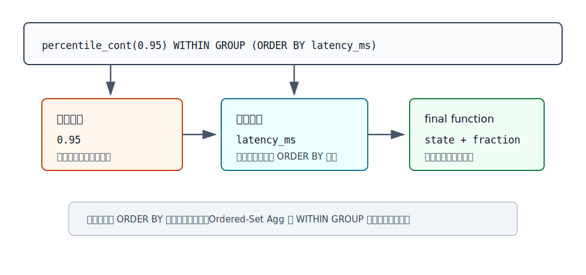
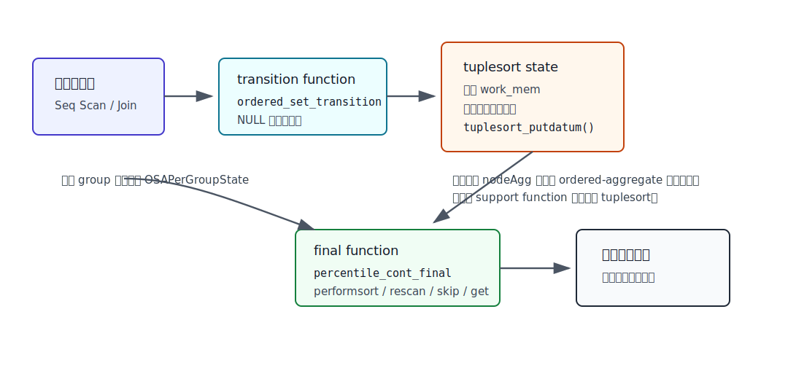
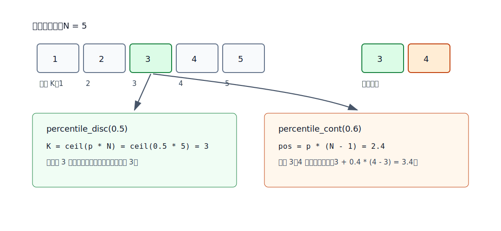
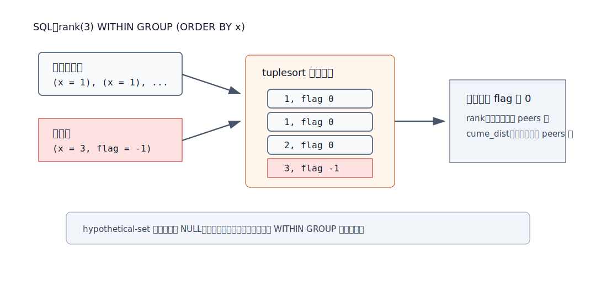
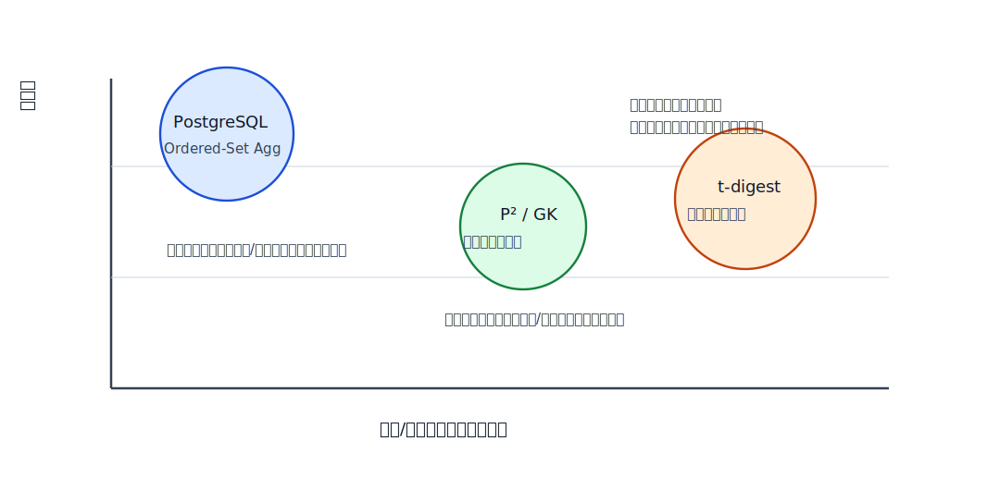

## 数据库筑基课 - 聚合之 Ordered-Set Agg

### 作者
digoal

### 日期
2026-05-31

### 标签
PostgreSQL , 应用开发者 , 数据库筑基课 , 执行器 , 聚合 , Ordered-Set Aggregate , 分位数

----

## 背景


本文属于“扫描与执行算法”类基础能力：理解数据库如何计算“必须先定义顺序才有意义”的聚合结果，例如中位数、P95 延迟、众数、假设某个值插入集合后的排名。

业务里常见的问题很具体：

```sql
SELECT percentile_cont(0.95) WITHIN GROUP (ORDER BY latency_ms)
FROM api_request_log
WHERE ts >= now() - interval '1 hour';
```
  
这条 SQL 看起来像 `avg()` 一样是一个聚合，但它和 `avg()` 的执行性质完全不同。`avg()` 可以边扫描边维护 `sum/count`；P95 必须知道全体输入的相对顺序。除非使用近似算法，否则数据库需要保留可排序的输入集合，排序后再取目标位置。

本篇聚焦 PostgreSQL 内置 ordered-set / hypothetical-set aggregate，主要对应 `src/backend/utils/adt/orderedsetaggs.c`、`src/backend/parser/parse_func.c`、`src/backend/parser/parse_agg.c`、`src/include/catalog/pg_aggregate.dat`、`src/include/catalog/pg_proc.dat`、`doc/src/sgml/func/func-aggregate.sgml` 和回归测试 `src/test/regress/sql/aggregates.sql`。

## 一、它解决什么问题？

普通聚合把一批行压缩成一个状态。只要 transition state 可合并，很多聚合可以流式、并行、分阶段执行：

- `count(*)`：状态是计数器。
- `sum(x)`：状态是累加值。
- `avg(x)`：状态是 `sum/count`。

Ordered-Set Agg 解决的是另一类问题：结果依赖“排序后的第几个值”或“排序后相邻值之间的插值”。例如：

- `percentile_disc(0.95)`：返回排序集合中累计位置达到 95% 的第一个真实输入值。
- `percentile_cont(0.95)`：返回连续分位数，必要时在两个相邻值之间插值。
- `mode()`：返回排序后扫描得到的最高频值。
- `rank(args) WITHIN GROUP (...)`：把一个“假设行”放入排序集合，计算它会得到的排名。

它牺牲的是在线性和可合并性。PostgreSQL 官方聚合函数表把内置 ordered-set 和 hypothetical-set 聚合的 Partial Mode 标为 `No`。这意味着它们不是 PostgreSQL 内置的并行 partial aggregation 友好聚合；执行时也不是用 P²、GK 或 t-digest 这类小内存近似 sketch，而是用 `tuplesort` 维护精确排序集合。

所以 Ordered-Set Agg 的目标是“SQL 标准语义下的精确有序集合聚合”，不是“海量流式监控里的近似 P99”。

## 二、它是什么？

Ordered-Set Agg 是 SQL 聚合的一类特殊语法：

```sql
aggregate_name(direct_args)
WITHIN GROUP (ORDER BY aggregated_args)
```

PostgreSQL 文档把它称为 ordered-set aggregate，有些函数也叫 inverse distribution functions。它的关键区别是：

- `WITHIN GROUP (ORDER BY ...)` 是必需语义，不是普通聚合的可选排序修饰。
- `WITHIN GROUP` 里的表达式是 aggregated arguments，按每行输入求值。
- 函数名括号里的参数是 direct arguments，每个聚合调用只求值一次。
- direct arguments 不能引用未分组的普通列，规则类似把它们放在聚合外部表达式里。



图 1 说明：`percentile_cont(0.95)` 里的 `0.95` 是 direct argument，表示本次聚合要取哪个分位点；`WITHIN GROUP (ORDER BY latency_ms)` 里的 `latency_ms` 是每行输入值，要进入排序集合。最终函数拿到 transition state 和 direct argument 后才能产出结果。

PostgreSQL 内置 ordered-set 函数主要包括：

| 函数 | 输入顺序含义 | 返回语义 | 是否丢弃聚合输入 NULL |
|---|---|---|---|
| `mode()` | 按值排序后统计连续相等值 | 众数；并列时取排序中先遇到的值 | 是 |
| `percentile_disc(fraction)` | 排序后的离散位置 | 输入集合中真实存在的值 | 是 |
| `percentile_cont(fraction)` | 排序后的连续位置 | 可在相邻值之间插值 | 是 |
| `rank(args)` | 假设行插入排序集合 | 假设行的 rank | 否 |
| `dense_rank(args)` | 假设行插入排序集合 | 不带空洞的 rank | 否 |
| `percent_rank(args)` | 假设行插入排序集合 | `(rank - 1) / (total rows - 1)` 的语义变体 | 否 |
| `cume_dist(args)` | 假设行插入排序集合 | 累积分布位置 | 否 |

前 3 个是标准 ordered-set 聚合；后 4 个是 hypothetical-set 聚合。它们共享 `WITHIN GROUP` 语法，但 hypothetical-set 聚合要把 direct arguments 构造成一行“假设输入”，所以 direct arguments 的数量和类型必须匹配排序列。

## 三、核心原理

### 3.1 目录定义决定它是特殊聚合

`src/include/catalog/pg_aggregate.dat` 中，内置 ordered-set 聚合的 `aggkind` 是 `o`，hypothetical-set 聚合的 `aggkind` 是 `h`。例如 `percentile_cont(float8,float8)` 的目录定义包含：

```text
aggkind => 'o'
aggnumdirectargs => '1'
aggtransfn => 'ordered_set_transition'
aggfinalfn => 'percentile_cont_float8_final'
aggtranstype => 'internal'
```

`src/include/catalog/pg_proc.dat` 则定义了用户可见聚合函数和内部 support function，例如：

- `ordered_set_transition(internal, any)`
- `ordered_set_transition_multi(internal, VARIADIC any)`
- `percentile_disc_final(internal, float8, anyelement)`
- `percentile_cont_float8_final(internal, float8)`
- `hypothetical_rank_final(internal, VARIADIC any)`

这个设计很 PostgreSQL：SQL 层看到的是聚合函数，执行器看到的是 transition function、final function 和一个 `internal` 类型的过渡状态。

### 3.2 解析阶段拆分 direct args 和 aggregated args

`gram.y` 对 `WITHIN GROUP` 做第一层语法约束：不能同时出现普通聚合参数里的 `ORDER BY` 和 `WITHIN GROUP`，也不能在 `WITHIN GROUP` 聚合上使用 `DISTINCT` 或 `VARIADIC` 语法位置。

`parse_func.c` 再根据 `pg_aggregate.aggkind` 做语义检查：

- ordered-set 聚合必须带 `WITHIN GROUP`。
- ordered-set 聚合不支持 `OVER`，所以不能当窗口函数直接使用。
- 普通聚合不能带 `WITHIN GROUP`。
- direct argument 数量必须匹配目录里的 `aggnumdirectargs`。
- hypothetical-set 聚合的 direct arguments 必须和 `WITHIN GROUP` 排序列数量、类型匹配。

`parse_agg.c` 还会检查 direct arguments 不能引用未分组列。回归测试里有这样的错误用例：

```sql
SELECT rank(x) WITHIN GROUP (ORDER BY x)
FROM generate_series(1,5) x;
```

错误原因不是 `rank` 本身不能用，而是 `x` 出现在 direct argument 位置；它每个聚合调用只能求值一次，不能随输入行变化。

### 3.3 执行阶段用 tuplesort 保存每组输入

核心实现位于 `src/backend/utils/adt/orderedsetaggs.c`。源码注释把状态分成两层：

- `OSAPerQueryState`：每个查询可复用的信息，例如排序列、排序操作符、collation、tuple descriptor。
- `OSAPerGroupState`：每个 group 的状态，例如 `Tuplesortstate *sortstate`、输入行数、是否已经排序。

transition 阶段做的事非常直接：

```text
ordered_set_transition(state, value):
    如果 state 为空，创建 OSAPerGroupState 和 tuplesort
    如果 value 非 NULL，把 value 放入 tuplesort
    number_of_rows++
```

多列或 hypothetical-set 场景使用 `ordered_set_transition_multi()`，它会把多个输入列组成 tuple 再放入 tuplesort。hypothetical-set 还会额外加一个 `int4 flag` 列，用来区分真实输入行和假设行。



图 2 说明：`Agg` 节点逐行调用 transition function，但排序集合不是 `nodeAgg.c` 的通用 ordered aggregate 排序路径直接完成，而是 ordered-set support function 自己维护 `tuplesort`。final function 首次读取结果时调用 `tuplesort_performsort()`，随后按目标位置 `skip/get`。

这解释了两个工程现象：

- 它需要 `work_mem`，大输入可能产生临时文件。
- 它不能像 `sum()` 那样天然 partial/parallel 合并，因为 transition state 是一个尚未最终消费的排序对象，而不是简单可序列化合并的数值状态。

### 3.4 `percentile_disc` 和 `percentile_cont` 的公式不同

`percentile_disc(fraction)` 的逻辑是：找最小的 `K`，使得 `K / N >= fraction`。源码里等价写法是：

```text
K = ceil(fraction * N)
```

然后跳过 `K - 1` 行，返回第 `K` 行。数组版本会把多个 fraction 先转换成目标行号，再按行号排序后顺序读取 tuplesort，避免为每个 fraction 重新扫描一遍。

`percentile_cont(fraction)` 的逻辑是连续位置插值：

```text
first_row  = floor(fraction * (N - 1))
second_row = ceil(fraction * (N - 1))
proportion = fraction * (N - 1) - first_row
```

如果两个位置相同，返回该行；否则调用插值函数。PostgreSQL 内置支持 `float8` 和 `interval` 两类连续插值。



图 3 说明：离散分位数返回输入集合中的真实值；连续分位数可以返回输入集合中不存在的插值结果。因此 `percentile_disc(0.5)` 和 `percentile_cont(0.5)` 在偶数个输入、重复值或非均匀间隔数据上可能不同。

### 3.5 `mode()` 借排序把频率统计变成连续扫描

`mode_final()` 不是建哈希表统计频率，而是先排序，再顺序扫描相邻相等值。这样可以只维护当前值频次和当前最佳众数：

```text
sort all non-null values
for value in sorted_values:
    if value == previous:
        current_frequency++
    else:
        reset current value
    if current_frequency > best_frequency:
        update mode
```

这个实现的代价是排序；收益是泛型比较和任意可排序类型处理简单，不需要为 `anyelement` 构造通用哈希状态。

### 3.6 hypothetical-set 用 flag 插入虚拟行

`rank()`、`dense_rank()`、`percent_rank()`、`cume_dist()` 这类 hypothetical-set 聚合的语义是：如果把 direct arguments 构成的一行加入排序集合，它会得到什么窗口函数结果。

PostgreSQL 的做法是在 tuplesort 里为每行额外加 `flag`：

- 普通输入行：`flag = 0`
- 假设行：`flag = -1` 或 `flag = 1`

`rank` 和 `percent_rank` 要把假设行排在 peers 前；`cume_dist` 要把假设行排在 peers 后。final function 插入假设行，执行排序，然后扫描到 `flag != 0` 的行，计算排名或分布位置。



图 4 说明：hypothetical-set 聚合不是在原表里真的插入一行，而是在本次聚合的排序状态里临时加入一个带 flag 的 tuple。由于 final function 会修改排序状态，目录里 hypothetical-set final function 的 `aggfinalmodify` 是写入型语义。

## 四、横向对比

Ordered-Set Agg 经常被误解为“数据库内置 P95 算法”。更准确地说，它是精确排序型聚合。把它和普通聚合、窗口函数、近似分位数算法放在一起，边界会更清楚。

| 维度 | PostgreSQL Ordered-Set Agg | 普通聚合 `avg/sum/count` | 窗口函数 `percent_rank() OVER (...)` | P² / GK / t-digest |
|---|---|---|---|---|
| 主要目标 | 精确有序集合聚合 | 流式压缩状态 | 为每行计算窗口位置 | 近似在线分位数 |
| 输入顺序 | `WITHIN GROUP` 必需 | 通常无关 | `OVER (ORDER BY ...)` 定义窗口顺序 | 流式输入即可 |
| 状态大小 | 与每组输入行数相关 | 通常常数或小状态 | 依赖排序/窗口执行 | 小于原始数据，取决于误差参数 |
| 是否精确 | 是 | 是 | 是 | 否，有误差模型 |
| Partial Mode | 内置表标为 No | 很多聚合支持 | 不是聚合 partial 模型 | 通常可合并，视算法而定 |
| 适合场景 | SQL 标准精确中位数、P95、众数、假设排名 | 常规统计 | 每行排名、移动窗口 | 监控、流处理、分布式近似指标 |
| 不适合场景 | 超大组、强并行近似指标 | 需要排序位置的指标 | 只需要每组一个分位数结果 | 财务清算、审计类精确结果 |

这里最重要的差别不是“精确算法好还是近似算法好”，而是业务是否允许误差。如果 P99 只是监控告警指标，t-digest 这类 sketch 可能更合适；如果 P50/P95 进入 SLA 结算、审计报表或离线校验，精确语义更容易解释和复核。



图 5 说明：PostgreSQL 内置 Ordered-Set Agg 位于“高精确、低流式友好”的一侧；P²、GK、t-digest 位于“小状态、可在线估计”的一侧。论文里的在线分位数算法解决的是另一个工程目标：牺牲可控误差，换取空间效率和流式处理能力。

## 五、效果如何？

收益：

- 语义精确，结果可复核。
- 和 SQL 标准 `WITHIN GROUP` 语法一致。
- 支持任意可排序类型的 `percentile_disc()` 和 `mode()`。
- 数组 fraction 版本能一次排序，顺序取多个分位点，避免多次独立排序。

代价：

- 每个 group 要维护一个排序状态，输入越多越吃 `work_mem`。
- 超出内存时依赖 `tuplesort` 写临时文件，延迟可能出现台阶。
- 内置 ordered-set / hypothetical-set 聚合不支持 Partial Mode，不适合作为强并行分位数聚合。
- 对高基数 `GROUP BY` 叠加 `percentile_cont()` 时，可能出现“每个分组一个小排序”的大量状态管理成本。

复杂度可以粗略理解为：

```text
每组 N 行：
  transition: O(N) 次 put
  final:      O(N log N) 排序 + O(K) 定位读取
空间：
  内存优先，超过 work_mem 后由 tuplesort 使用临时文件
```

这里没有给性能数字，因为不同数据类型、排序列宽度、`work_mem`、临时文件设备和分组分布都会显著改变结果。正确做法是用业务数据或合成分布做 `EXPLAIN (ANALYZE, BUFFERS)` 验证。

## 六、实操 DEMO

以下 SQL 是可执行示例；本文没有启动本地 PostgreSQL 实例运行它们，所以不伪造执行输出。

### 6.1 离散分位数和连续分位数

```sql
WITH s(x) AS (
  VALUES (1::float8), (2), (3), (4), (5)
)
SELECT
  percentile_disc(0.5) WITHIN GROUP (ORDER BY x) AS p50_disc,
  percentile_cont(0.6) WITHIN GROUP (ORDER BY x) AS p60_cont
FROM s;
```

预期逻辑：

- `p50_disc` 返回第 `ceil(0.5 * 5) = 3` 个真实输入值。
- `p60_cont` 在连续位置 `0.6 * (5 - 1) = 2.4` 上插值。

### 6.2 一次取多个分位点

```sql
WITH s(x) AS (
  SELECT generate_series(1, 1000)::float8
)
SELECT percentile_cont(ARRAY[0.5, 0.9, 0.95, 0.99])
       WITHIN GROUP (ORDER BY x) AS percentiles
FROM s;
```

数组版本的意义不是近似，而是“一次排序，多点读取”。如果写成 4 个独立 `percentile_cont()` 调用，是否能共享状态取决于 planner/executor 对相同输入和 transition 的识别；从可读性上，数组版本更明确。

### 6.3 分组 P95 的内存风险

```sql
SET work_mem = '64MB';

EXPLAIN (ANALYZE, BUFFERS)
SELECT tenant_id,
       percentile_cont(0.95) WITHIN GROUP (ORDER BY latency_ms) AS p95
FROM api_request_log
WHERE ts >= now() - interval '1 hour'
GROUP BY tenant_id;
```

观察重点：

- 是否出现临时文件读写。
- 单个大 tenant 是否拖慢整体。
- `work_mem` 调整后是否只是把临时文件减少，而不是线性加速。
- 是否可以先按时间、租户、接口维度预聚合或离线汇总。

### 6.4 hypothetical-set 排名

```sql
WITH s(x) AS (
  VALUES (1), (1), (2), (2), (3), (3), (4)
)
SELECT
  rank(3)       WITHIN GROUP (ORDER BY x) AS r,
  dense_rank(3) WITHIN GROUP (ORDER BY x) AS dr,
  cume_dist(3)  WITHIN GROUP (ORDER BY x) AS cd
FROM s;
```

这个例子验证的是“假设值 3 如果插入集合，会处在什么位置”。它和窗口函数不同：窗口函数给每一行算位置；hypothetical-set 聚合只返回这个假设行的结果。

## 七、最佳实践

面向数据库架构师：

- 把 Ordered-Set Agg 定位为精确报表能力，而不是监控系统里的默认 P99 方案。
- 对延迟指标、金额分布、评分分布等场景，先判断是否允许近似；允许近似时可以在流处理或扩展层引入 sketch。
- 对必须精确的分位数，控制单组输入规模，例如按时间窗、租户、业务线分层计算。

面向 DBA：

- 重点观察 `work_mem`、临时文件、慢 SQL 中的 `percentile_cont/disc`。
- 对高并发报表，不要只靠调大 `work_mem`；每个查询、每个排序/哈希节点都可能消耗内存。
- 用 `EXPLAIN (ANALYZE, BUFFERS)` 和日志里的 temporary file 信息验证是否发生排序落盘。

面向业务开发者：

- `percentile_disc()` 返回真实值，适合枚举、等级、价格档位等不希望插值的类型。
- `percentile_cont()` 返回插值，适合延迟、耗时、数值测量。
- 多个分位点优先使用数组版本，表达“一次有序集合上取多个位置”。
- 不要在 direct argument 里放随行变化的列；例如 `rank(x) WITHIN GROUP (ORDER BY x)` 在无 `GROUP BY x` 时语义不成立。

## 八、适合与不适合场景

适合：

- 离线报表里的精确 P50/P90/P95。
- 每个分组规模可控的业务统计。
- 需要 SQL 标准语义的审计、复核、对账。
- 需要按排序定义计算 hypothetical rank 的场景。

不适合：

- 每秒写入海量指标、只要近似 P99 的监控系统。
- 单个 group 包含数亿行且要求低延迟交互查询。
- 需要强 partial aggregation / distributed merge 的实时分析。
- 用户误以为它会利用 B-tree 索引直接跳到第 95% 位置的场景。一般聚合执行仍要处理满足条件的输入集合；索引可能帮助过滤或提供路径，但不能自动把任意分组分位数变成常数时间查询。

## 九、常见坑

1. 把 `ORDER BY` 写错位置。

```sql
-- 错：WITHIN GROUP 已经有 ORDER BY，直接参数里不能再写 ORDER BY
SELECT percentile_cont(0.5 ORDER BY 0.5) WITHIN GROUP (ORDER BY x)
FROM t;
```

2. 把 ordered-set 聚合当窗口函数。

`parse_func.c` 明确拒绝 `OVER` 用于 ordered-set 聚合。想给每行计算相对位置，应使用窗口函数；想给每组返回一个分位数，应使用 ordered-set 聚合。

3. 忽略 NULL 语义差异。

`percentile_cont/disc/mode` 会忽略聚合输入 NULL；hypothetical-set 聚合不丢弃包含 NULL 的输入行，NULL 如何排序由 `ORDER BY` 的 `NULLS FIRST/LAST` 决定。

4. 误以为 `percentile_cont(0.5)` 一定等于真实中位数行。

连续分位数会插值。偶数个输入时，中位数可能不是任何一行的值。需要真实输入值时用 `percentile_disc()`。

5. 高基数分组叠加分位数。

`GROUP BY tenant_id, api_name` 再对每组算 P95，可能创建大量排序状态。应先看分组基数、每组行数分布和临时文件，而不是只看总行数。

## 十、扩展问题

1. 如果业务允许 0.1% 的分位数误差，你会把近似分位数放在 PostgreSQL 扩展、流处理系统、还是应用侧？为什么？
2. `percentile_cont(array[...])` 和多个独立 `percentile_cont()` 在可读性、状态共享、执行代价上有什么差别？
3. 如果已有 `(tenant_id, latency_ms)` 索引，哪些查询能受益，哪些分组分位数仍然需要大量扫描或排序？
4. 为什么 hypothetical-set 聚合需要 direct arguments 和排序列类型匹配？如果不匹配，会破坏哪一层语义？
5. 如果要实现一个可 partial aggregation 的近似 P99 聚合，它的 transition state、combine function、serialize/deserialize function 应该长什么样？

## 十一、扩展阅读

- PostgreSQL 官方文档：Aggregate Functions，Ordered-Set Aggregate Functions 与 Hypothetical-Set Aggregate Functions。  
  <https://www.postgresql.org/docs/current/functions-aggregate.html>
- PostgreSQL 官方文档：SQL 表达式语法中关于 `WITHIN GROUP`、direct arguments、aggregated arguments 的说明。  
  <https://www.postgresql.org/docs/current/sql-expressions.html>
- PostgreSQL 源码：`src/backend/utils/adt/orderedsetaggs.c`。
- PostgreSQL 源码：`src/include/catalog/pg_aggregate.dat`、`src/include/catalog/pg_proc.dat`。
- PostgreSQL 源码：`src/backend/parser/gram.y`、`src/backend/parser/parse_func.c`、`src/backend/parser/parse_agg.c`。
- PostgreSQL 回归测试：`src/test/regress/sql/aggregates.sql` 与 `src/test/regress/expected/aggregates.out`。
- DeepWiki：`postgres/postgres` 关于 parser、executor、aggregate 的架构说明；本文只把它作为导航，关键判断已用本地源码核对。
- Raj Jain, Imrich Chlamtac, *The P² Algorithm for Dynamic Calculation of Quantiles and Histograms Without Storing Observations*, 1985。这个题名与用户给出的 “An Examined Stack Algorithm for On-Line Quantile Estimation” 不完全匹配，但属于在线分位数估计的经典近似路线。
- Michael Greenwald, Sanjeev Khanna, *Space-Efficient Online Computation of Quantiles and L-Statistics*, SIGMOD 2001。  
  <https://sigmodrecord.org/2001/06/07/space-efficient-online-computation-of-quantile-summaries/>
- Ted Dunning, Otmar Ertl, *Computing Extremely Accurate Quantiles Using t-Digests*。  
  <https://arxiv.org/abs/1902.04023>
  
## 附录 
1、问 gemini
```
数据库 Ordered-Set Agg 聚合相关的论文
```

2、克隆代码  
```  
git clone --depth 1 https://github.com/postgres/postgres
```  
  
3、启用 codex, 使用 [数据库筑基课 skill](../skills/README.md).  
```
文章标题: 
  数据库筑基课 - 聚合之 Ordered-Set Agg
项目源码(本地目录):  
  postgres
项目 codebase 文件名: 
  postgres/CLAUDE.md
相关的论文或文档名:
  An Examined Stack Algorithm for On-Line Quantile Estimation
  Space-Efficient Online Computation of Quantiles and L-Statistics
  Computing Extremely Accurate Quantiles Using t-Digests
开源项目相关的 deepwiki repoName: 
  postgres/postgres
```
  
  
#### [PostgreSQL 解决方案集合](../201706/20170601_02.md "40cff096e9ed7122c512b35d8561d9c8")
  
  
#### [德哥 / digoal's Github - 公益是一辈子的事.](https://github.com/digoal/blog/blob/master/README.md "22709685feb7cab07d30f30387f0a9ae")
  
  
#### [About 德哥](https://github.com/digoal/blog/blob/master/me/readme.md "a37735981e7704886ffd590565582dd0")
  
  

  
