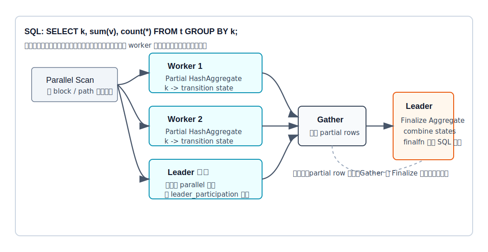
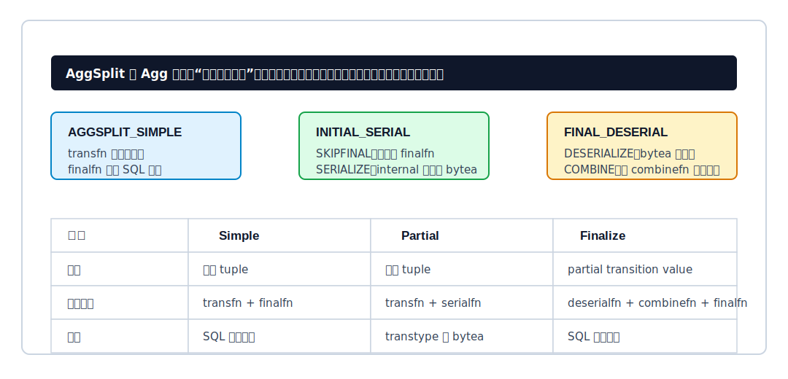
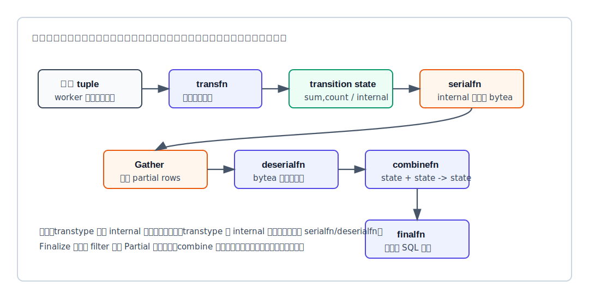
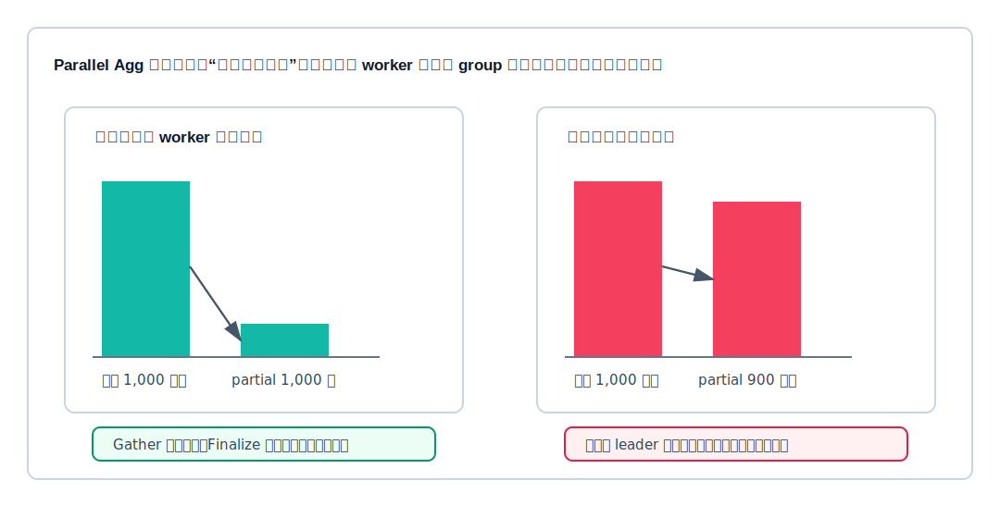
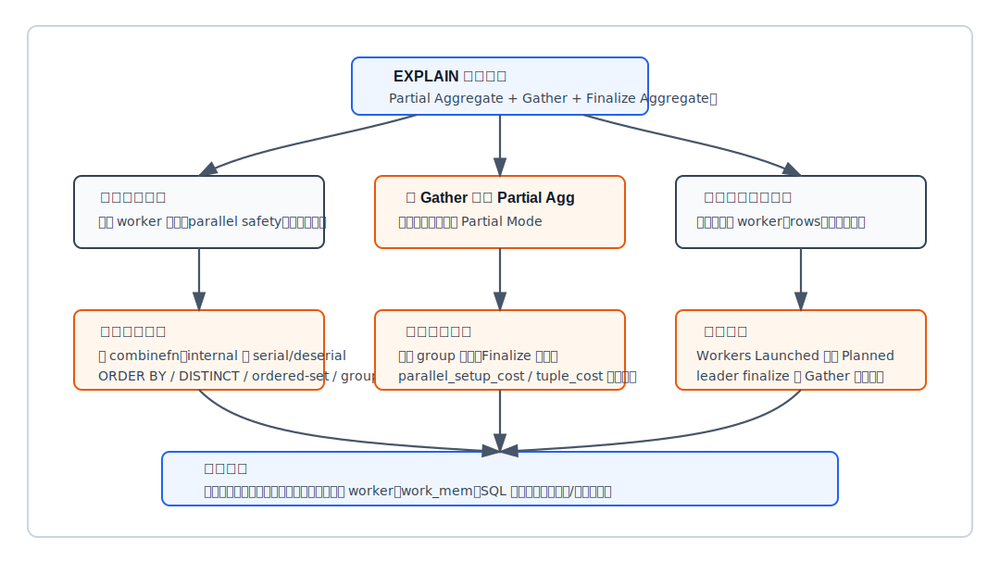

## 数据库筑基课 - 聚合之 Parallel Agg (Partial Agg, Combine Agg, Finalize Agg)

### 作者
digoal

### 日期
2026-05-31

### 标签
PostgreSQL , 应用开发者 , 数据库筑基课 , 执行器 , 聚合 , 并行查询 , Parallel Aggregate

----

## 背景
  


本文属于“扫描与执行算法”类基础能力：理解数据库如何把一个聚合任务拆成多个局部任务，再把局部状态合并成最终结果。

业务里最常见的慢查询之一是大表分组统计：

```sql
SELECT region_id, count(*), sum(amount), avg(amount)
FROM orders
WHERE created_at >= now() - interval '1 day'
GROUP BY region_id;
```

如果一天有几十亿行，单进程聚合会同时遇到三个瓶颈：扫描慢、transition function 调用多、最终分组状态多。并行查询先解决扫描慢，但仅有并行扫描还不够。如果所有 worker 都把原始行交给 leader，由 leader 单进程 `GROUP BY`，那 leader 会变成新的瓶颈。Parallel Agg 的核心就是：在 worker 侧先做局部聚合，把 N 行输入尽量压缩成 G 个局部状态，再交给 leader 合并。

本篇聚焦 PostgreSQL 的并行聚合，主要对应 `doc/src/sgml/parallel.sgml`、`doc/src/sgml/ref/create_aggregate.sgml`、`src/include/nodes/nodes.h`、`src/backend/optimizer/prep/prepagg.c`、`src/backend/optimizer/plan/planner.c`、`src/backend/optimizer/plan/setrefs.c`、`src/backend/executor/nodeAgg.c`、`src/backend/executor/execExpr.c` 和 `src/backend/commands/explain.c`。

## 一、它解决什么问题？

聚合的本质是“压缩”：把输入行压缩成聚合状态，再把状态转成结果。并行聚合要解决的是：这个压缩过程能不能被拆成两段？

以 `sum(amount)` 为例：

```text
sum(全部行) = sum(worker1 局部和, worker2 局部和, worker3 局部和)
```

以 `avg(amount)` 为例，不能只合并各 worker 的平均值，而要合并更底层的状态：

```text
avg 的 transition state = (sum, count)
finalfn(state) = sum / count
combinefn((sum1,count1), (sum2,count2)) = (sum1 + sum2, count1 + count2)
```

Parallel Agg 把问题从“并行执行 SQL 聚合函数”转换成“聚合 transition state 是否可合并”。这带来两个直接约束：

1. 聚合函数必须有正确的 `combinefn`，否则 PostgreSQL 不知道两个局部状态如何合并。
2. 如果 transition state 是 `internal` 类型，还必须能序列化和反序列化，否则跨进程传输状态不安全。

所以 Parallel Agg 解决的不是“所有聚合自动变快”，而是“可合并状态的聚合如何减少 leader 处理的原始行数”。代价是额外 worker 进程、局部状态传输、leader finalize 串行段，以及每个 worker 各自消耗内存。

## 二、它是什么？

Parallel Agg 是 PostgreSQL `Agg` 节点的一种分阶段执行方式。用户在 SQL 里仍然写普通聚合，计划里会出现类似形态：

```text
Finalize HashAggregate
  Group Key: region_id
  ->  Gather
        Workers Planned: 4
        ->  Partial HashAggregate
              Group Key: region_id
              ->  Parallel Seq Scan on orders
```

PostgreSQL 官方并行查询文档把它描述为两阶段：每个参与并行部分的进程先执行 `Partial Aggregate`，产生每个本地分组的局部结果；局部结果经 `Gather` 或 `Gather Merge` 传给 leader；leader 再执行 `Finalize Aggregate`，把所有 worker 的局部结果重新聚合成最终结果。



图 1 说明：worker 不是把所有原始行交给 leader，而是在本地执行 Partial Aggregate。leader 收到的是局部 transition state 或其序列化结果。只有当局部状态行数明显少于原始输入行数时，Gather 和 Finalize 的成本才容易被并行扫描与局部聚合节省抵消。

在 PostgreSQL 源码里，`Agg` 节点有两个维度：

| 维度 | 典型取值 | 含义 |
|---|---|---|
| `AggStrategy` | `AGG_PLAIN` / `AGG_SORTED` / `AGG_HASHED` / `AGG_MIXED` | 用普通、排序、哈希或混合方式维护分组 |
| `AggSplit` | `AGGSPLIT_SIMPLE` / `AGGSPLIT_INITIAL_SERIAL` / `AGGSPLIT_FINAL_DESERIAL` | 是否把聚合拆成 partial 与 finalize 阶段 |

这两个维度可以组合。例如 `Partial HashAggregate` 是 `AGG_HASHED + AGGSPLIT_INITIAL_SERIAL`；`Finalize GroupAggregate` 是 `AGG_SORTED + AGGSPLIT_FINAL_DESERIAL`。

## 三、核心原理

### 3.1 AggSplit 是两阶段聚合的执行开关

`src/include/nodes/nodes.h` 定义了 `AggSplit` 的 primitive option：

- `AGGSPLITOP_COMBINE`：用 `combinefn` 替代普通 `transfn`。
- `AGGSPLITOP_SKIPFINAL`：跳过 `finalfn`，直接返回 transition state。
- `AGGSPLITOP_SERIALIZE`：对输出 transition state 调用 `serialfn`。
- `AGGSPLITOP_DESERIALIZE`：对输入 partial state 调用 `deserialfn`。

PostgreSQL 当前定义了三个有用组合：

| 模式 | 用在计划哪里 | 执行动作 | 输出类型 |
|---|---|---|---|
| `AGGSPLIT_SIMPLE` | 非并行普通聚合 | `transfn` 后执行 `finalfn` | SQL 聚合结果类型 |
| `AGGSPLIT_INITIAL_SERIAL` | Partial Aggregate | `transfn` 后跳过 `finalfn`，必要时序列化 | transition type 或 `bytea` |
| `AGGSPLIT_FINAL_DESERIAL` | Finalize Aggregate | 必要时反序列化，再用 `combinefn` 合并，最后 `finalfn` | SQL 聚合结果类型 |



图 2 说明：并行聚合的关键变化不是 SQL 语法，而是 `Aggref` 的执行模式。Partial 阶段返回的不是最终 SQL 值，通常是 transition state；Finalize 阶段看到的输入也不是原始业务列，而是 partial state。

`src/backend/optimizer/plan/planner.c` 的 `mark_partial_aggref()` 会修改 `Aggref.aggsplit`。当 partial 阶段需要序列化 `internal` 状态时，`aggtype` 会被改成 `bytea`；否则 partial 输出类型是 transition type。`src/backend/optimizer/plan/setrefs.c` 的 `convert_combining_aggrefs()` 会为父子 Aggref 建立关系：child Aggref 表示 initial partial，parent Aggref 的参数变成 child Aggref 的输出，并标记为 final deserialize。

### 3.2 Partial 阶段：只生产局部状态，不执行 finalfn

Partial Aggregate 仍然可以是 HashAggregate 或 GroupAggregate。区别在于它不返回最终 SQL 结果，而是返回每个分组的 transition state。

以 `avg(amount)` 为例，worker 内部做的是：

```text
输入行: amount = 10, 20, 30
局部 transition state: sum = 60, count = 3
partial 输出: (group_key, state)
```

如果这里执行了 `finalfn` 得到 `20`，leader 就无法正确合并多个 worker 的结果，因为平均值的平均值不是全局平均值。PostgreSQL 通过 `AGGSPLITOP_SKIPFINAL` 避免这个错误。

`src/backend/executor/nodeAgg.c` 的 `finalize_partialaggregate()` 负责输出 partial aggregate。源码注释说明：如果设置了 serialization function，就调用它并在输出 tuple 的上下文里交付结果。也就是说，Partial Aggregate 在名字上叫 “finalize partial”，但它 finalize 的只是当前 worker 的输出形式，不是 SQL 语义上的最终聚合。

### 3.3 Finalize 阶段：combinefn 替代 transfn

Finalize Aggregate 的输入是一批 partial row。每一行通常包含 group key 和一个或多个 partial state。它要做的事情是：

```text
for partial_state in gathered_rows:
    global_state = combinefn(global_state, partial_state)

result = finalfn(global_state)
```

`src/backend/executor/nodeAgg.c` 在初始化每个 transition 时检查 `DO_AGGSPLIT_COMBINE(aggstate->aggsplit)`。如果是 combine 模式，就把普通 transition function 换成 `aggcombinefn`；并且要求 combine function 已设置，否则报错。这就是 “Combine Agg” 的执行含义：它不是一个单独的 SQL 节点名，而是 Finalize Aggregate 内部用 combine function 合并 transition state。

`src/backend/executor/execExpr.c` 的 `ExecBuildAggTrans()` 也有专门的 combine 分支。它说明 combine 阶段的输入不是来自原始 tuple，而是一个可能已经反序列化的 transition value；如果原聚合有 `FILTER`，filter 已经在 partial 阶段处理，combine 阶段不会重新执行 filter。



图 3 说明：普通聚合只要 `transfn -> finalfn`；并行聚合需要把状态跨进程传输，因此可能多出 `serialfn` 和 `deserialfn`。Finalize 阶段的核心不是重新扫描业务数据，而是用 `combinefn` 合并 partial state。

### 3.4 计划器如何判断能不能做 partial aggregation？

PostgreSQL 不是看到 `GROUP BY` 就尝试 Parallel Agg。`src/backend/optimizer/prep/prepagg.c` 会在预处理聚合函数时收集能力信息：

- 如果聚合调用带 `ORDER BY` 或 `DISTINCT`，会设置 `hasNonPartialAggs`。
- 如果没有 `aggcombinefn`，会设置 `hasNonPartialAggs`。
- 如果 transition state 是 `internal`，但缺少 `aggserialfn` 或 `aggdeserialfn`，会设置 `hasNonSerialAggs`。
- `array_agg` 这类依赖输入类型 send/receive 函数的序列化路径，还要检查聚合参数类型是否支持发送和接收。

`src/backend/optimizer/plan/planner.c` 的 `can_partial_agg()` 再做顶层判断：

```text
没有 aggregate 且没有 GROUP BY: 不能做 partial agg
有 grouping sets: 不能做 partial agg
有 hasNonPartialAggs 或 hasNonSerialAggs: 不能做 partial agg
否则: 可以考虑 partial agg
```

官方文档还列出并行聚合限制：聚合必须 parallel safe，必须有 combine function；`internal` transition state 需要 serialization/deserialization function；聚合调用包含 `DISTINCT` 或 `ORDER BY` 时不支持；ordered-set aggregates 不支持；查询涉及 `GROUPING SETS` 时不支持；相关 join 也必须位于并行计划部分。

这解释了一个常见现象：同一张大表，同样是 `GROUP BY`，`sum()` 能出 `Partial HashAggregate`，而 `percentile_cont(...) WITHIN GROUP (...)` 或 `string_agg(x ORDER BY ts)` 出不了并行 partial aggregate。

### 3.5 计划器如何估算它值不值得？

可以 partial 不代表应该 partial。`create_partial_grouping_paths()` 会为 partial 阶段和 final 阶段分别收集聚合成本：

```text
partial phase: AGGSPLIT_INITIAL_SERIAL
final phase:   AGGSPLIT_FINAL_DESERIAL
```

它还会估算 partial groups 的数量。这个估计非常关键：如果每个 worker 扫描很多行，但输出很少 group，Parallel Agg 的压缩比很高；如果每个 worker 看到的 group 接近输入行数，Partial Aggregate 基本没有压缩，Gather 仍然要传大量 row，leader 还要单进程 combine。



图 4 说明：Parallel Agg 不是 worker 越多越好。低基数聚合可以把海量输入压缩成少量 partial state；高基数聚合会把大量 partial rows 推给 Gather 和 Finalize，leader 串行段变重。PostgreSQL 官方文档也明确说明：如果 Finalize Aggregate 看到的 group 数相对输入行很多，计划器会认为并行聚合不划算。

### 3.6 与 “Partial Partial Aggregates” 的关系

用户给定的论文名 *Partial Partial Aggregates* 指向一个更一般的问题：只做一次 partial 还不够，能否在分布式或多层执行树里继续做局部合并，形成多级聚合树？

PostgreSQL 单机并行查询的常见形态是：

```text
worker partial -> Gather -> leader finalize
```

很多 MPP 或分布式数据库更常见的形态是：

```text
local partial -> local combine -> exchange/shuffle -> remote combine -> final
```

两者共享同一条原则：先在数据本地减少行数，再跨进程或跨网络移动较小的状态。区别是 PostgreSQL 的 `Gather` 汇聚到单个 leader，最终 combine 通常是单点；MPP 系统会把 group key hash 分发到多个节点，让 combine/finalize 也并行化。这就是 Parallel Database Systems 论文里长期强调的数据划分、并行 operator、exchange 代价和负载均衡问题。

## 四、横向对比

| 维度 | PostgreSQL Parallel Agg | 普通 Hash/Group Agg | MPP 多级聚合 | 预聚合/物化汇总 |
|---|---|---|---|---|
| 主要目标 | 单机多进程先局部聚合再 leader 合并 | 单进程完成全部聚合 | 多节点局部聚合、shuffle、再聚合 | 把重复聚合提前计算 |
| 并行位置 | `Gather` 以下并行，`Finalize` 在 leader | 无并行执行段 | scan、partial、shuffle、combine 可多级并行 | 查询时少算或不算 |
| 状态要求 | 聚合必须支持 partial mode | 不要求 combine/serialize | 同样要求状态可合并，且要考虑网络传输 | 取决于刷新逻辑 |
| 高基数风险 | partial rows 多，leader finalize 重 | 单节点内存/排序压力大 | shuffle 放大、数据倾斜 | 汇总表可能变大 |
| 资源代价 | 每个 worker 都可能消耗 `work_mem` | 单个执行节点消耗内存 | 多节点 CPU、内存、网络 | 写入、刷新和一致性成本 |
| 适合场景 | 大扫描、低到中等 group 数、可合并聚合 | 中小数据或并行收益低 | 大规模分布式分析 | 固定报表、仪表盘、高频查询 |
| 不适合场景 | ordered-set、DISTINCT/ORDER BY 聚合、高基数近似全量输出 | 单进程太慢的大表扫描 | 小查询、强事务点查 | 维度频繁变化、强实时明细 |

这张表背后的核心差异是“状态移动的位置”。普通聚合移动的是原始行到单个执行节点；PostgreSQL Parallel Agg 移动的是 worker 局部状态到 leader；MPP 多级聚合会把状态按 group key 再分发，让最终合并也分散。预聚合则把状态提前固化成表或增量物化结果，牺牲实时性和维护复杂度换查询速度。

论文 *Parallel Database Systems: The Future of High Performance Database Systems* 的经典观点是：高性能数据库系统的关键不只是更多 CPU，而是把数据划分、operator 并行、交换代价、负载均衡、容错和优化器成本模型作为整体设计。Parallel Agg 是这个思想在单机 PostgreSQL 里的一个局部实现。

论文 *Aggregating Millions of Groups Fast / Cache-Efficient Aggregation* 关注另一个维度：当 group 数很多时，哈希表布局、cache miss、分区、SIMD/vectorized processing 会决定 CPU 效率。PostgreSQL 的 Parallel Agg 能减少扫描和部分 transition 调用的墙钟时间，但如果每个 worker 内部已经在维护大量 group，cache 行为和哈希表内存布局仍然是瓶颈。

## 五、效果如何？

Parallel Agg 的收益来自四点：

1. 并行扫描减少读取大表的墙钟时间。
2. worker 本地先执行 transition，减少 leader 处理的原始行数。
3. 低基数分组能显著压缩 `Gather` 传输行数。
4. `sum/count/min/max/avg` 这类状态小、可合并的聚合很适合两阶段执行。

它的代价也很具体：

1. `Gather` 或 `Gather Merge` 有启动和 tuple 传输成本，受 `parallel_setup_cost` 和 `parallel_tuple_cost` 影响。
2. `Finalize Aggregate` 在 leader 上执行，group 多时容易变成串行瓶颈。
3. 每个 worker 是独立进程，内存限制按 worker 分别应用；官方配置文档提醒，4 个 worker 的并行查询可能消耗接近 5 倍的 CPU、内存和 I/O 资源。
4. worker 实际数量可能少于 planned workers。`max_parallel_workers_per_gather` 是每个 Gather/Gather Merge 可启动 worker 上限，但还受 `max_worker_processes` 和 `max_parallel_workers` 池限制。
5. 对 `internal` transition state，序列化和反序列化本身有 CPU 和内存拷贝成本。

判断效果时不要只看是否出现 `Partial HashAggregate`。要看 `EXPLAIN (ANALYZE, VERBOSE, BUFFERS)` 中：

- `Workers Planned` 与 `Workers Launched` 是否一致。
- Partial Aggregate 的 actual rows 是否远小于 scan rows。
- Gather 上方 Finalize Aggregate 是否耗时集中。
- HashAggregate 是否有 `Batches`、`Memory Usage`、`Disk Usage`。
- group 数估计与 actual rows 是否偏差很大。



图 5 说明：调优路径先分三类：没有并行计划、有并行但没有 partial agg、有完整两阶段计划但不快。每类问题的根因不同，不能只靠提高 worker 数解决。

## 六、实操 DEMO

下面给一个最小可验证实验脚本。本文没有在本地启动 PostgreSQL 实例执行它，因此不提供虚构的实际输出；读者可以在自己的测试库中执行。

```sql
DROP TABLE IF EXISTS parallel_agg_demo;
CREATE TABLE parallel_agg_demo AS
SELECT
  g AS id,
  (g % 1000) AS region_id,
  (random() * 100)::numeric(12,2) AS amount
FROM generate_series(1, 10000000) AS g;

ANALYZE parallel_agg_demo;

SET max_parallel_workers_per_gather = 4;
SET min_parallel_table_scan_size = 0;
SET parallel_setup_cost = 0;
SET parallel_tuple_cost = 0;

EXPLAIN (ANALYZE, VERBOSE, BUFFERS)
SELECT region_id, count(*), sum(amount), avg(amount)
FROM parallel_agg_demo
GROUP BY region_id;
```

期望观察到的计划形态类似：

```text
Finalize GroupAggregate 或 Finalize HashAggregate
  Group Key: region_id
  ->  Gather 或 Gather Merge
        Workers Planned: 4
        Workers Launched: ...
        ->  Partial HashAggregate 或 Partial GroupAggregate
              Group Key: region_id
              ->  Parallel Seq Scan on parallel_agg_demo
```

如果想观察高基数导致收益下降，可以把 `region_id` 改成 `id`：

```sql
EXPLAIN (ANALYZE, VERBOSE, BUFFERS)
SELECT id, count(*)
FROM parallel_agg_demo
GROUP BY id;
```

这个查询几乎每行一个 group。即使出现 partial aggregate，partial 阶段也没有明显压缩，Gather 和 Finalize 的压力会很大。

如果想观察 `ORDER BY` 聚合挡住 partial aggregation，可以测试：

```sql
EXPLAIN (ANALYZE, VERBOSE, BUFFERS)
SELECT region_id, string_agg(id::text, ',' ORDER BY id)
FROM parallel_agg_demo
GROUP BY region_id;
```

按照 PostgreSQL 当前规则，带 `ORDER BY` 的 aggregate call 会被标记为不能 partial aggregation。

## 七、最佳实践

### 面向数据库架构师

优先把 Parallel Agg 用在“扫描大、分组压缩明显、聚合状态可合并”的分析查询上。典型例子是按天、地区、渠道、状态码做 `count/sum/avg/min/max`。如果 group key 高基数到接近明细行，单机 PostgreSQL 的 leader finalize 会限制扩展性，此时要考虑分区预聚合、物化视图、近似聚合，或 MPP/列式引擎。

设计自定义聚合时，如果希望它能并行，不能只写 `SFUNC` 和 `FINALFUNC`。要提供正确的 `COMBINEFUNC`；transition state 是 `internal` 时还要提供 `SERIALFUNC` 和 `DESERIALFUNC`；聚合及其依赖函数需要标记为 `PARALLEL SAFE`。官方 `CREATE AGGREGATE` 文档明确说明这些参数是 partial aggregation 的前提。

### 面向 DBA

不要全局盲目提高 `max_parallel_workers_per_gather`。并行查询的内存和 I/O 不是共享一份预算，worker 越多，总资源消耗越高。更稳的路径是：

1. 用 `EXPLAIN (ANALYZE, VERBOSE, BUFFERS)` 确认有无 `Partial Aggregate` 和 `Finalize Aggregate`。
2. 比较 scan rows、partial rows、finalize rows，判断压缩比。
3. 看 `Workers Planned/Launched`，确认 worker 池是否不足。
4. 看 `HashAggregate` 的 `Batches`、`Memory Usage`、`Disk Usage`，确认是否因每 worker 内存不足而落盘。
5. 检查统计信息，尤其是 group key 的 distinct 估计。

调参时优先局部会话验证，例如降低 `parallel_setup_cost`、`parallel_tuple_cost`、`min_parallel_table_scan_size` 只是为了观察计划空间，不代表生产环境应该这么设。生产环境要根据并发、内存、I/O 和 CPU 核数统一预算。

### 面向业务开发者

写 SQL 时要知道哪些表达会破坏 partial aggregation：

- 聚合函数内部的 `DISTINCT`。
- 聚合函数内部的 `ORDER BY`，例如 `array_agg(x ORDER BY ts)`、`string_agg(x, ',' ORDER BY ts)`。
- ordered-set aggregate，例如 `percentile_cont(...) WITHIN GROUP (...)`。
- `GROUPING SETS`。
- parallel unsafe/restricted 的函数或聚合。

如果业务目标是报表而不是明细实时精确计算，优先把高频固定维度做成分区汇总表或增量物化。Parallel Agg 适合减少一次大查询的耗时，不适合把每次请求都变成高并发大扫描。

## 八、适合与不适合场景

适合场景：

- 大表扫描后的低到中等基数 `GROUP BY`。
- 聚合函数支持 partial mode，例如 `count/sum/avg/min/max/bool_and/bool_or` 等常见聚合。
- `WHERE` 条件能在 parallel scan 部分过滤大量行。
- 单次分析查询可接受多个 worker 共同消耗 CPU 和内存。
- 分区表上每个分区可并行扫描，并且聚合维度不导致极端倾斜。

不适合场景：

- group key 接近唯一键，partial aggregate 几乎不压缩。
- 聚合状态很大，例如大量 `array_agg`、`jsonb_agg`，即使支持 partial，也可能让 worker 内存和序列化成本很高。
- 聚合调用需要内部排序、去重或 ordered-set 精确语义。
- 系统已经 CPU 饱和或 I/O 饱和，增加 worker 只会放大争用。
- 需要毫秒级 OLTP 响应的请求路径。

## 九、常见坑

1. **看到 Gather 就以为用了 Parallel Agg。**  
   只有 `Partial Aggregate` 和 `Finalize Aggregate` 同时出现，才说明聚合本身被拆阶段。`Gather -> Aggregate` 可能只是并行扫描后 leader 单进程聚合。

2. **只调 worker，不看 group 数。**  
   高基数聚合会把大量 partial rows 推到 leader。worker 越多，可能产生更多重复 group 状态，Finalize 反而更忙。

3. **忽略 `work_mem` 是按节点、按进程消耗。**  
   并行 HashAggregate 中每个 worker 都可能有自己的哈希表。并发多时，总内存压力比单计划节点看起来大得多。

4. **自定义聚合只实现 finalfn。**  
   没有 `combinefn` 就不能 partial aggregation。`internal` 状态缺少 serialize/deserialize 也不行。

5. **用 ordered-set 聚合期待并行 partial。**  
   `percentile_cont` 这类精确有序集合聚合在 PostgreSQL 内置实现里不支持 Partial Mode。要海量实时 P99，通常应考虑近似 sketch 或预聚合。

6. **统计信息过旧导致计划误判。**  
   group 数估计影响 Parallel Agg 是否值得。`ANALYZE`、更高统计目标、扩展统计信息都可能改变计划选择。

## 十、扩展问题

1. 为什么 `avg()` 的 partial state 不能是平均值本身，而必须至少包含 `sum/count`？
2. 如果每个 worker 都看到全部 group key，worker 数增加会怎样影响 partial rows 总数？
3. MPP 数据库为什么通常需要 `Exchange/Shuffle`，而 PostgreSQL 单机 parallel agg 通常汇聚到 leader？
4. 对 `array_agg()` 这类状态会持续增长的聚合，parallel agg 的瓶颈更可能在 CPU、内存、序列化还是 leader finalize？
5. 如果业务只需要 P99 的近似值，为什么 approximate aggregate/sketch 比精确 ordered-set aggregate 更容易并行？

## 十一、扩展阅读

- PostgreSQL 源码：`src/include/nodes/nodes.h`，`AggStrategy` 与 `AggSplit` 定义。
- PostgreSQL 源码：`src/backend/optimizer/prep/prepagg.c`，聚合函数 partial mode 能力检查。
- PostgreSQL 源码：`src/backend/optimizer/plan/planner.c`，`can_partial_agg()`、`create_partial_grouping_paths()`、`mark_partial_aggref()`。
- PostgreSQL 源码：`src/backend/optimizer/plan/setrefs.c`，`convert_combining_aggrefs()` 把父子 Aggref 改写成 partial/final 关系。
- PostgreSQL 源码：`src/backend/executor/nodeAgg.c`，combine function 替代 transition function，以及 partial 输出序列化。
- PostgreSQL 源码：`src/backend/executor/execExpr.c`，`ExecBuildAggTrans()` 的 combine 输入处理。
- PostgreSQL 源码：`src/backend/commands/explain.c`，`Partial` / `Finalize` 计划名和 `Partial Mode` 输出。
- PostgreSQL 官方文档：`doc/src/sgml/parallel.sgml`，Parallel Aggregation 章节。
- PostgreSQL 官方文档：`doc/src/sgml/ref/create_aggregate.sgml`，`COMBINEFUNC`、`SERIALFUNC`、`DESERIALFUNC`、`PARALLEL` 参数。
- PostgreSQL 官方文档：`doc/src/sgml/config.sgml`，`max_parallel_workers_per_gather`、`parallel_setup_cost`、`parallel_tuple_cost`。
- DeepWiki：`postgres/postgres`，用于理解 PostgreSQL 查询规划与执行器结构；本文关键结论已回到本地源码和官方文档核对。
- 论文：*Parallel Database Systems: The Future of High Performance Database Systems*。
- 论文：*Aggregating Millions of Groups Fast / Cache-Efficient Aggregation*。
- 论文：*Partial Partial Aggregates*。
  
## 附录 
1、问 gemini
```
数据库 Parallel Agg (Partial Agg, Combine Agg, Finalize Agg) 聚合相关的论文
```

2、克隆代码  
```  
git clone --depth 1 https://github.com/postgres/postgres
```  
  
3、启用 codex, 使用 [数据库筑基课 skill](../skills/README.md).  
```
文章标题: 
  数据库筑基课 - 聚合之 Parallel Agg (Partial Agg, Combine Agg, Finalize Agg)
项目源码(本地目录):  
  postgres
项目 codebase 文件名: 
  postgres/CLAUDE.md
相关的论文或文档名:
  Parallel Database Systems: The Future of High Performance Database Systems
  Aggregating Millions of Groups Fast / Cache-Efficient Aggregation
  Partial Partial Aggregates
开源项目相关的 deepwiki repoName: 
  postgres/postgres
```
  
  
#### [PostgreSQL 解决方案集合](../201706/20170601_02.md "40cff096e9ed7122c512b35d8561d9c8")
  
  
#### [德哥 / digoal's Github - 公益是一辈子的事.](https://github.com/digoal/blog/blob/master/README.md "22709685feb7cab07d30f30387f0a9ae")
  
  
#### [About 德哥](https://github.com/digoal/blog/blob/master/me/readme.md "a37735981e7704886ffd590565582dd0")
  
  

  
