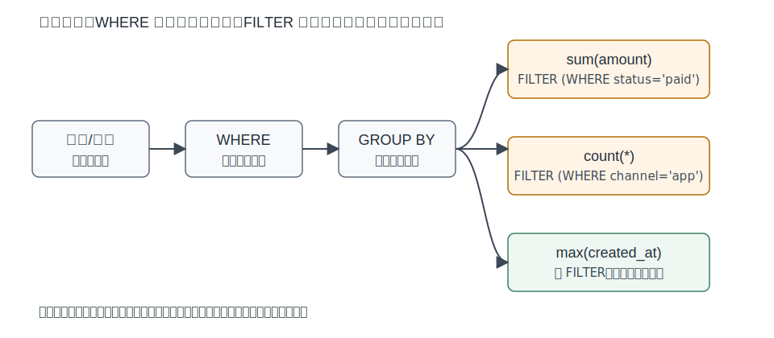
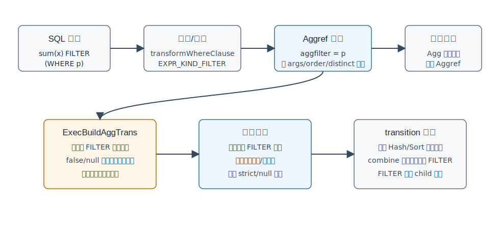
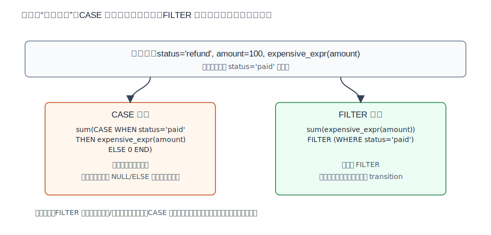
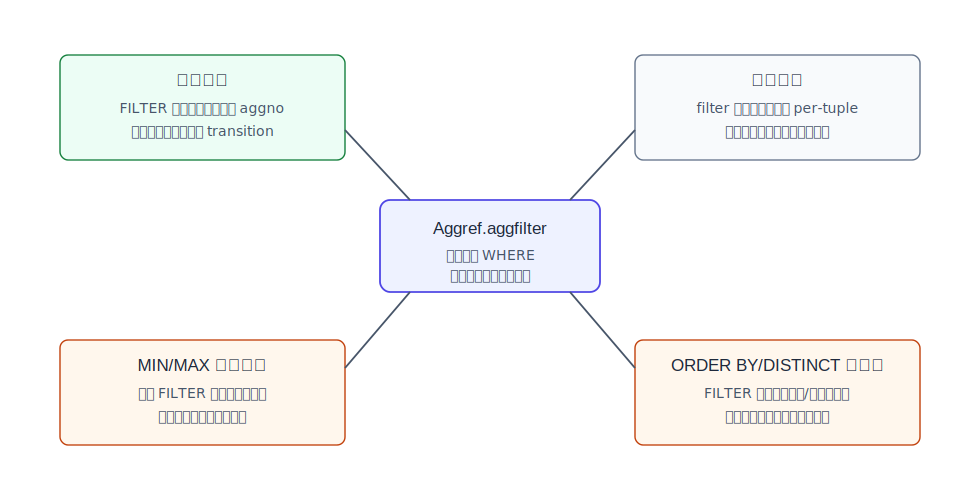
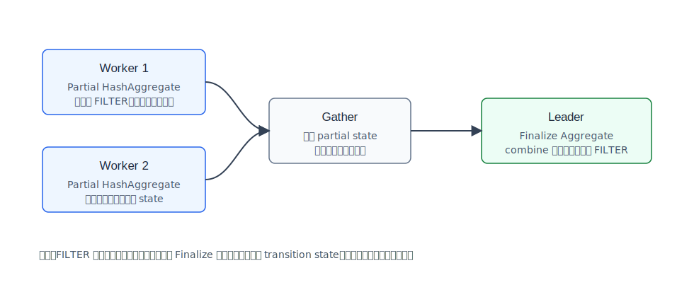

## 数据库筑基课 - 聚合之 FILTER Agg

### 作者
digoal

### 日期
2026-05-31

### 标签
PostgreSQL , 应用开发者 , 数据库筑基课 , 执行器 , 聚合 , FILTER , 条件聚合

----

## 背景


本文属于“扫描与执行算法”类基础能力：理解数据库如何在同一次分组扫描里计算多组条件指标。

业务报表里经常有这样的 SQL：

```sql
SELECT
  store_id,
  count(*) AS orders,
  sum(amount) FILTER (WHERE status = 'paid') AS paid_amount,
  sum(amount) FILTER (WHERE status = 'refund') AS refund_amount,
  count(*) FILTER (WHERE channel = 'app') AS app_orders
FROM orders
WHERE created_at >= current_date
GROUP BY store_id;
```

如果不用 `FILTER`，开发者通常会写很多 `CASE WHEN`：

```sql
sum(CASE WHEN status = 'paid' THEN amount ELSE 0 END)
```

两种写法都能完成“条件聚合”，但它们在语义表达、参数求值、NULL 处理、优化器判断和并行聚合阶段上并不完全一样。`FILTER` 的关键价值是：把“哪些行进入这个聚合函数”变成聚合调用本身的属性，而不是把条件塞进聚合参数。

本篇聚焦 PostgreSQL 的 aggregate `FILTER`，主要对应官方语法文档、`src/backend/parser/parse_expr.c`、`src/backend/parser/parse_agg.c`、`src/include/nodes/primnodes.h`、`src/backend/optimizer/prep/prepagg.c`、`src/backend/optimizer/plan/planner.c`、`src/backend/optimizer/plan/planagg.c`、`src/backend/optimizer/plan/setrefs.c`、`src/backend/executor/nodeAgg.c`、`src/backend/executor/execExpr.c`、`src/backend/executor/nodeWindowAgg.c` 和回归测试 `src/test/regress/sql/aggregates.sql`。

## 一、它解决什么问题？

`WHERE` 解决的是“哪些行进入整个查询后续流水线”；`HAVING` 解决的是“哪些分组结果最终留下”；`FILTER` 解决的是“同一分组内，哪些行进入某一个聚合函数”。

这三者的作用范围不同：

| 子句 | 执行对象 | 典型问题 | 对其他聚合的影响 |
|---|---|---|---|
| `WHERE` | 输入行 | 今天的订单、有效用户、指定租户 | 被过滤的行不会进入任何聚合 |
| `FILTER` | 单个聚合调用 | 已支付金额、退款金额、APP 订单数 | 只影响绑定的聚合 |
| `HAVING` | 分组结果 | 只保留销售额超过阈值的门店 | 聚合已经算完后再过滤分组 |

官方 PostgreSQL 教程里用天气表说明过这一点：`count(*) FILTER (WHERE temp_lo < 45)` 只过滤 `count` 的输入，旁边的 `max(temp_lo)` 仍然可以看到同组所有行。这个例子揭示了 `FILTER` 的本质：它不是行级全局过滤，而是聚合函数的局部门禁。



图 1 说明：`WHERE` 位于聚合之前，影响整条输入流；`FILTER` 挂在每个聚合函数上。同一行可能通过 `paid_amount` 的条件、没通过 `refund_amount` 的条件，但仍然进入 `max(created_at)`。

它解决的工程痛点主要有四类：

1. 一次扫描内计算多个条件指标，避免把同一张大表重复扫描多遍。
2. 让 SQL 语义更接近业务指标定义，少写容易出错的 `CASE WHEN ... ELSE ... END`。
3. 对 `count(*)`、`sum(x)`、`array_agg(x ORDER BY ...)`、`percentile_disc(...) WITHIN GROUP (...)` 等不同聚合统一表达“输入行条件”。
4. 给执行器一个明确机会：先判断过滤条件，未通过时可以跳过聚合参数求值和 transition function 调用。

代价也很明确：每个 `FILTER` 表达式仍然要对输入行求值；多个复杂 `FILTER` 并列时，CPU 成本可能不低。它减少的是不必要的聚合参数求值和状态更新，不会神奇减少扫描行数，除非条件也能安全地放进 `WHERE`。

## 二、它是什么？

SQL 标准聚合表达式允许在聚合后面加：

```sql
aggregate_name(arguments) FILTER (WHERE filter_clause)
```

PostgreSQL 文档给出的几种聚合语法都支持 `FILTER`，包括普通聚合、`DISTINCT` 聚合、带聚合内 `ORDER BY` 的聚合、`count(*)`，以及 ordered-set aggregate：

```sql
count(*) FILTER (WHERE i < 5)

sum(DISTINCT amount) FILTER (WHERE status = 'paid')

array_agg(event ORDER BY ts) FILTER (WHERE event IS NOT NULL)

percentile_disc(0.95) WITHIN GROUP (ORDER BY latency_ms)
  FILTER (WHERE success)
```

在 PostgreSQL 的内部表示里，它是 `Aggref` 节点上的 `aggfilter` 字段。`src/include/nodes/primnodes.h` 明确把 `aggfilter` 和 `args`、`aggorder`、`aggdistinct` 放在同一个聚合调用结构中。也就是说，`FILTER` 不是独立的 plan node，不是普通 `WHERE` 条件，也不是简单重写成 `CASE` 后再交给执行器。

几个语义点要先说清：

1. `filter_clause` 必须能转成布尔表达式；结果为 `true` 的行才进入该聚合。
2. `false` 和 `NULL` 都表示不进入该聚合。
3. `FILTER` 子句本身不能包含同层聚合函数；回归测试覆盖了 `aggregate functions are not allowed in FILTER`。
4. PostgreSQL 扩展允许某些外层引用出现在 `FILTER` 中；这会影响聚合所属 query level，不能简单套用“总是内层聚合”的直觉。
5. aggregate window function 也有 `FILTER`，但普通非聚合窗口函数不支持 `FILTER`；`parse_func.c` 对此会报错。

## 三、核心原理

### 3.1 解析阶段：FILTER 进入 Aggref.aggfilter

语法层识别 `FILTER (WHERE a_expr)` 后，解析转换阶段会把过滤表达式通过 `transformWhereClause(..., EXPR_KIND_FILTER, "FILTER")` 处理成布尔表达式。

普通函数/聚合路径在 `parse_func.c` 中构造 `Aggref`，JSON aggregate constructor 路径在 `parse_expr.c` 中构造 `Aggref` 或 `WindowFunc`，两者都会把结果放到：

```text
aggref->aggfilter = agg_filter
```

之后 `parse_agg.c` 的 `check_agglevels_and_constraints()` 会把 `filter` 和 direct args、regular args 一起交给 `check_agg_arguments()`，用于判断聚合层级和非法嵌套。这里的关键是：`FILTER` 参与聚合归属判断。它不是执行器最后临时看一眼的字符串条件。



图 2 说明：`FILTER` 最终成为 `Aggref.aggfilter`。执行器初始化聚合 transition 表达式时，会先生成过滤表达式求值和跳转步骤，再生成参数求值和 transition function 调用步骤。

### 3.2 执行阶段：先判断 FILTER，再求聚合参数

`nodeAgg.c` 的注释说明，PostgreSQL 出于性能原因，不是在 `nodeAgg.c` 里逐个调用 transition function，而是由 `ExecBuildAggTrans()` 构建一个较大的表达式，把参数求值、过滤、strict 检查和 transition function 调用串起来。这可以减少重复表达式解释开销，也方便 JIT 把整段表达式编译成本地函数。

`src/backend/executor/execExpr.c` 里的顺序很重要：

```text
if aggfilter exists and not combine phase:
    evaluate aggfilter
    if filter is not true:
        jump to the end of this aggregate's transition work

evaluate aggregate arguments
check strict transition input nulls
call transition function
```

源码注释明确说，过滤要放在输入参数求值之前，以避免不必要计算，甚至避免不该发生的副作用。这里的“副作用”不是鼓励在 SQL 函数里写副作用，而是执行器必须尊重表达式求值顺序带来的错误和行为边界。例如：

```sql
SELECT sum(1 / x) FILTER (WHERE x <> 0)
FROM t;
```

在 `x = 0` 的行上，执行器可以先发现 `FILTER` 不通过，从而不去计算 `1 / x`。如果换成某些预排序或改写路径，先计算排序键/参数再过滤，就可能改变错误行为。所以 PostgreSQL 在 planner 里对带 `FILTER` 的 ordered aggregate 预排序做了额外安全检查。

### 3.3 FILTER 与 CASE：不是总能无脑互换

很多条件聚合可以用 `CASE` 改写，但“结果相同”和“语义清晰、代价相同”是两回事。



图 3 说明：`CASE` 把条件写进参数表达式；`FILTER` 是聚合调用的行门禁。未通过 `FILTER` 的行不会求聚合参数，也不会调用 transition function。

常见等价与不等价边界：

| 目标 | FILTER 写法 | CASE 写法 | 注意点 |
|---|---|---|---|
| 条件计数 | `count(*) FILTER (WHERE p)` | `sum(CASE WHEN p THEN 1 ELSE 0 END)` | `count(CASE WHEN p THEN 1 END)` 也常见 |
| 条件求和 | `sum(x) FILTER (WHERE p)` | `sum(CASE WHEN p THEN x END)` | 不要随手写 `ELSE 0`，NULL 语义可能不同 |
| 条件数组 | `array_agg(x) FILTER (WHERE p)` | `array_agg(CASE WHEN p THEN x END)` | CASE 版本可能把 NULL 放进数组 |
| 条件排序聚合 | `array_agg(x ORDER BY y) FILTER (WHERE p)` | `array_agg(CASE WHEN p THEN x END ORDER BY y)` | CASE 版本仍可能需要处理未通过行的排序表达式 |
| 条件分位数 | `percentile_disc(0.95) WITHIN GROUP (ORDER BY x) FILTER (WHERE p)` | 通常不建议硬改写 | ordered-set 参数模型更复杂 |

`FILTER` 的优点是清楚：它表达“行是否进入聚合”。`CASE` 的优点是灵活：它表达“行进入聚合前被映射成什么值”。如果业务需要把不同状态映射成不同金额权重，例如成功订单 `amount`、退款订单 `-amount`、其他订单 `0`，那 `CASE` 更自然；如果只是多个指标各自选择输入行，`FILTER` 更自然。

### 3.4 DISTINCT、ORDER BY 与 FILTER 的顺序边界

对普通 `sum(x) FILTER (WHERE p)` 来说，执行器先判断 `p`，再求 `x` 并调用 transition function。

对带 `DISTINCT` 或聚合内 `ORDER BY` 的聚合，执行器还要维护排序/去重输入。`build_pertrans_for_aggref()` 中有一个细节：只要存在排序或过滤，就会为聚合输入创建对应的 tuple descriptor 和 slot。这说明 `FILTER` 会进入 per-transition 状态构建，不是纯粹 planner 层的信息。

边界在于预排序优化。`planner.c` 的 ordered aggregate 预排序逻辑会尝试让输入提前按聚合内 `ORDER BY` / `DISTINCT` 需要的 pathkeys 排好。但源码对带 `FILTER` 的聚合加了保守检查：如果聚合参数表达式不是简单 `Var` 或 `Const` 等安全形式，就跳过预排序候选。原因是预排序路径可能先计算排序表达式，而正常 Aggregate 节点语义是先应用 `FILTER` 再排序该聚合输入；如果排序表达式可能报错，提前求值会改变行为。

这是一个很好的工程提醒：`FILTER` 不是优化器可以随便交换位置的条件。

### 3.5 优化器：FILTER 会影响共享、成本和改写

`FILTER` 对优化器至少有四个影响。



图 4 说明：`aggfilter` 是聚合调用属性，因此它会参与聚合共享判断、成本估算和若干改写边界。把它当普通 `WHERE` 会误判很多计划现象。

第一，聚合共享必须比较 `aggfilter`。`prepagg.c` 的注释说明，两个聚合要共享同一个 transition state，`ORDER BY`、`DISTINCT`、`FILTER` 等 transition 阶段属性都必须相同。代码里的 `find_compatible_agg()` 会比较 `newagg->aggfilter` 和已有 `Aggref.aggfilter`。所以：

```sql
SELECT sum(x) FILTER (WHERE p), sum(x) FILTER (WHERE p) FROM t;
```

可以被识别为相同聚合；但：

```sql
SELECT sum(x) FILTER (WHERE p), sum(x) FILTER (WHERE q) FROM t;
```

即使参数都是 `x`，也不能共享同一 transition state，因为进入两个状态的行集合不同。

第二，`FILTER` 的表达式成本会计入聚合 transition 成本。`prepagg.c` 的 `get_agg_clause_costs()` 会对 `transinfo->aggfilter` 调用 `cost_qual_eval_node()`。源码里还有一个 `XXX` 注释：理想情况下应该按 filter 选择率折减输入表达式成本，但当前不这么做。这意味着优化器不会精细估计“过滤通过后才求昂贵参数”的收益。

第三，MIN/MAX 索引优化遇到 `FILTER` 当前会放弃。`planagg.c` 本来可以把某些 `min(col)` / `max(col)` 改写成走索引的子查询路径；但源码注释说，理论上可以把 filter 加到生成子查询的 quals，目前没有实现，所以 `aggref->aggfilter != NULL` 时直接返回 false。这解释了一个常见现象：

```sql
SELECT min(ts) FROM events;
```

可能走 MinMaxAggPath，而：

```sql
SELECT min(ts) FILTER (WHERE status = 'ok') FROM events;
```

即使有合适索引，也未必触发同一个 MIN/MAX 聚合改写。可替代写法是把条件放进 `WHERE`：

```sql
SELECT min(ts) FROM events WHERE status = 'ok';
```

但这只在查询里所有指标都能接受同一个全局条件时才等价。

第四，并行 partial/final 聚合时，`FILTER` 只属于 child partial aggregate。`setrefs.c` 的 `convert_combining_aggrefs()` 明确把 parent Aggref 的 `aggfilter` 清空，把原始 `aggfilter` 保留在 child Aggref 上。原因很直接：Finalize 阶段看到的是 worker 输出的 partial state，不再是原始业务行，无法也不应该重新执行原始行级过滤。

### 3.6 并行聚合：FILTER 在 worker 侧完成

对于支持 partial mode 的聚合，带 `FILTER` 的 SQL 仍然可以参与并行聚合，前提是聚合函数本身、表达式和查询计划满足 parallel safe 等条件。

执行模型是：

```text
worker:
    scan rows
    for each row:
        evaluate FILTER
        if true: update local transition state
    output partial state

leader:
    receive partial states
    combine states
    run finalfn
```



图 5 说明：`FILTER` 是原始输入行级别条件，所以必须在 `Partial Aggregate` 阶段执行。`Finalize Aggregate` 合并的是 transition state；`ExecBuildAggTrans()` 的 combine 分支也说明 combine 阶段不再执行过滤，必要过滤已经完成。

这带来两个实践结论：

1. `FILTER` 不会阻止所有并行聚合；它不是 `DISTINCT`/`ORDER BY` 那类 PostgreSQL 文档列出的 partial aggregation 硬限制。
2. 如果 `FILTER` 表达式本身不是 parallel safe，或者引用了不适合并行执行的函数，整条查询仍可能无法得到并行计划。

### 3.7 WindowAgg 中也有 FILTER，但路径不同

`nodeWindowAgg.c` 有一段 `advance_windowaggregate()`，注释说它平行于 `nodeAgg.c` 的 `advance_aggregates`。窗口聚合的 `FILTER` 处理更直观：先执行 `ExecEvalExpr(filter, econtext, &isnull)`，如果结果为 NULL 或 false，就直接 return，不推进窗口聚合状态。

这说明 SQL 语义是一致的：`FILTER` 过滤的是某个聚合函数的输入。但普通 Agg 为了性能会用 `ExecBuildAggTrans()` 把过滤、参数求值和 transition 调用编译成大表达式；WindowAgg 代码路径则按窗口帧逻辑单独推进。

## 四、横向对比

| 维度 | FILTER Agg | CASE 条件聚合 | WHERE 预过滤 | HAVING 分组过滤 |
|---|---|---|---|---|
| 主要目标 | 每个聚合函数选择自己的输入行 | 把输入行映射成聚合参数值 | 整个查询提前减少输入行 | 聚合完成后筛选分组 |
| SQL 表达 | `sum(x) FILTER (WHERE p)` | `sum(CASE WHEN p THEN x END)` | `WHERE p` | `HAVING sum(x) > 0` |
| 对其他聚合影响 | 不影响 | 不影响，除非复用同一表达式 | 影响所有聚合 | 不影响聚合计算，只影响输出 |
| 参数求值 | 未通过 FILTER 时可跳过参数求值 | 取决于 CASE 分支表达式 | 被 WHERE 去掉的行不求后续聚合参数 | 聚合参数已求完 |
| NULL 语义 | 聚合按自身规则处理通过的行 | 由 CASE 的 ELSE/NULL 写法决定 | 不进入聚合 | 不改变聚合输入 |
| 优化器边界 | 参与 aggfilter 成本、共享、partial child | 普通表达式成本与简化 | 可下推、用索引、分区裁剪 | 通常在聚合后处理 |
| 适合场景 | 多指标条件报表、条件数组/JSON/分位数 | 值映射、加权、正负抵消 | 所有指标共享同一过滤条件 | 只保留满足指标阈值的分组 |
| 不适合场景 | 条件完全相同且可安全放 WHERE | 大量重复复杂 CASE 且可用 FILTER 表达 | 多指标需要不同条件 | 想减少聚合前计算量 |

对比背后的原则是：尽量把条件放在它真实生效的层次。能全局过滤就用 `WHERE`；只影响某个指标就用 `FILTER`；需要值变换就用 `CASE`；需要按聚合结果筛组就用 `HAVING`。

## 五、效果如何？

`FILTER` 的收益不是“数据库少扫表”，而是“少做某些聚合输入和状态更新”。收益大小取决于四个因素：

1. 过滤选择率：通过率越低，跳过参数求值和 transition 的机会越多。
2. 参数表达式成本：`sum(amount)` 很便宜，`sum(expensive_function(payload))` 才明显。
3. transition state 成本：`count(*)` 更新很轻，`array_agg()`、`jsonb_agg()`、ordered aggregate 排序输入更重。
4. 指标数量：同一次扫描里并列计算多个条件指标，通常比多次扫描更划算。

但也有成本：

1. 每个 `FILTER` 条件本身仍要按输入行求值。
2. 多个不同 `FILTER` 让聚合 transition state 无法共享。
3. `FILTER` 可能阻止某些特殊优化，例如当前 PostgreSQL 的 MIN/MAX indexable aggregate 改写。
4. 带 `ORDER BY` 或 `DISTINCT` 的聚合会因为 `FILTER` 保守处理预排序安全边界。

论文方向上，用户给到的 *Balancing Vectorization, Branch Prediction, and Pipelining* 和 *Optimizing Complete and Conditional Aggregations in Relational Databases* 都指向同一个执行层问题：条件聚合不只是 SQL 表达问题，还会落到 CPU 分支、表达式求值顺序、流水线和批处理执行的取舍上。本文没有在本地找到这两个精确题名的可核验全文，因此不引用具体实验数字。可以确认的是，PostgreSQL 当前行执行器不是 DuckDB/VectorWise 那种批量向量化聚合路径；它的工程选择是用表达式执行引擎把 filter、参数求值和 transition 调用合并成较大步骤，并在可能时 JIT 编译，从而减少解释执行和函数调用边界。

## 六、实操 DEMO

下面给一个最小实验脚本。本文没有在本地启动 PostgreSQL 实例执行它，因此不提供虚构的实际输出；读者可以在自己的测试库中执行。

```sql
DROP TABLE IF EXISTS filter_agg_demo;

CREATE TABLE filter_agg_demo AS
SELECT
  g AS id,
  g % 100 AS store_id,
  CASE
    WHEN g % 10 < 7 THEN 'paid'
    WHEN g % 10 < 9 THEN 'refund'
    ELSE 'cancel'
  END AS status,
  CASE WHEN g % 3 = 0 THEN 'app' ELSE 'web' END AS channel,
  (g % 1000)::numeric AS amount,
  clock_timestamp() - (g % 86400) * interval '1 second' AS created_at
FROM generate_series(1, 1000000) AS g;

ANALYZE filter_agg_demo;
```

### 6.1 多个条件指标一次扫描

```sql
EXPLAIN (ANALYZE, BUFFERS, VERBOSE)
SELECT
  store_id,
  count(*) AS orders,
  sum(amount) FILTER (WHERE status = 'paid') AS paid_amount,
  sum(amount) FILTER (WHERE status = 'refund') AS refund_amount,
  count(*) FILTER (WHERE channel = 'app') AS app_orders
FROM filter_agg_demo
GROUP BY store_id;
```

观察重点：

- 是否使用 `HashAggregate` 或 `GroupAggregate`。
- 聚合节点下方是否只扫描一次表。
- `EXPLAIN VERBOSE` 中目标表达式是否显示 `FILTER (WHERE ...)`。

### 6.2 FILTER 与 WHERE 的边界

下面两条 SQL 只有在你只关心已支付订单时才等价：

```sql
SELECT store_id, sum(amount) FILTER (WHERE status = 'paid')
FROM filter_agg_demo
GROUP BY store_id;

SELECT store_id, sum(amount)
FROM filter_agg_demo
WHERE status = 'paid'
GROUP BY store_id;
```

但如果同一查询还要算退款、取消、总订单数，不能把 `status = 'paid'` 放进 `WHERE`，否则其他指标的输入行会被提前删掉。

### 6.3 MIN/MAX 特殊优化边界

```sql
CREATE INDEX ON filter_agg_demo (created_at);

EXPLAIN (COSTS OFF)
SELECT min(created_at) FROM filter_agg_demo;

EXPLAIN (COSTS OFF)
SELECT min(created_at) FILTER (WHERE status = 'paid')
FROM filter_agg_demo;

EXPLAIN (COSTS OFF)
SELECT min(created_at)
FROM filter_agg_demo
WHERE status = 'paid';
```

观察重点：第一条和第三条更可能得到能利用索引顺序的计划；第二条因为 `FILTER` 挂在聚合调用上，当前 PostgreSQL 的 `planagg.c` 不会把它纳入 MIN/MAX aggregate 子查询改写。

### 6.4 与除零错误相关的求值顺序

```sql
DROP TABLE IF EXISTS filter_eval_demo;
CREATE TABLE filter_eval_demo(x int);
INSERT INTO filter_eval_demo VALUES (0), (1), (2);

SELECT sum(10 / x) FILTER (WHERE x <> 0)
FROM filter_eval_demo;
```

这个例子用于理解“FILTER 先于参数求值”的执行器约束。不要把它当成业务 SQL 风格建议；实际生产里，能写成更清楚的安全表达式就不要依赖读者理解执行器细节。

## 七、最佳实践

### 7.1 给数据库架构师

把 `FILTER` 视为指标建模工具，而不是性能魔法。指标平台、宽表报表、BI 查询生成器里，优先用 `FILTER` 表达“同一事实表、同一分组维度、多个条件指标”。这样 SQL 更接近指标定义，也更容易审查“总量、分子、分母”的输入范围。

如果所有指标共享同一个过滤条件，把条件放进 `WHERE`，让优化器获得索引、分区裁剪、连接顺序调整和行数估计收益。不要为了统一模板把全局条件也写成每个聚合的 `FILTER`。

### 7.2 给 DBA

排查条件聚合慢查询时，不要只看有没有 `FILTER`。建议按这个顺序看：

1. `WHERE` 是否已经最大限度减少了所有指标共同不需要的行。
2. `GROUP BY` 基数是否导致 Hash Agg 内存或 Sort 临时文件。
3. `FILTER` 条件是否重复、复杂、包含昂贵函数。
4. 是否存在本可走 MIN/MAX 特殊优化却因为 `FILTER` 写法失效的查询。
5. 并行计划里 `Partial Aggregate` 是否出现；如果没有，看聚合函数 partial mode、表达式 parallel safety 和 group 基数。

### 7.3 给业务开发者

写条件指标时，先问一句：我是“选择行”，还是“改写值”？

- 选择行：优先 `FILTER`。
- 改写值：使用 `CASE`。
- 所有指标都只看同一批行：放进 `WHERE`。
- 只想筛掉最终分组：用 `HAVING`。

对 NULL 敏感的指标尤其要小心。`sum(CASE WHEN p THEN x ELSE 0 END)` 和 `sum(x) FILTER (WHERE p)` 在没有匹配行时结果可能不同：前者可能得到 0，后者会按 `sum` 的空输入规则得到 NULL。到底要 0 还是 NULL，是业务语义，不是 SQL 风格问题。

## 八、适合与不适合场景

适合：

1. 仪表盘一次查询多个分子、分母、状态计数。
2. 同一事实表按不同状态、渠道、风险等级做分组聚合。
3. 条件数组、JSON 聚合、分位数聚合，需要明确哪些行进入聚合输入。
4. 并行聚合中希望 worker 侧先按条件压缩 transition state。
5. SQL 生成器需要稳定表达“每个指标自己的过滤条件”。

不适合：

1. 条件适用于整个查询，且能放进 `WHERE`。
2. 查询只做一个 `min/max`，且条件可以全局下推到 `WHERE`，需要充分利用索引顺序。
3. 业务语义是按条件把值映射成不同权重，而不是选择行。
4. 大量复杂且互相重复的 `FILTER` 表达式导致 CPU 成本高，此时应考虑先在子查询中计算公共布尔列。
5. 期望 `FILTER` 自动带来向量化、位图共享或跨聚合条件合并；PostgreSQL 当前没有把多个 `FILTER` 编译成专门的批量条件聚合算子。

## 九、常见坑

### 9.1 把 FILTER 当 WHERE

```sql
SELECT count(*), count(*) FILTER (WHERE status = 'paid')
FROM orders;
```

第一列仍然统计全部订单。`FILTER` 不会影响旁边的 `count(*)`。

### 9.2 CASE 的 ELSE 破坏 NULL 语义

```sql
sum(CASE WHEN p THEN amount ELSE 0 END)
```

这会把“不满足条件”映射成 0。对 `sum` 可能是你想要的；对 `avg`、`array_agg`、`json_agg` 通常就不是。

### 9.3 忽视 FILTER 对聚合共享的影响

两个 `sum(amount)` 只有过滤条件也相同时才能共享 transition state。指标很多时，重复但写法不同的条件会让执行器做更多工作。例如 `status = 'paid'` 和 `'paid' = status` 语义相同，但表达式树未必能被识别为同一个 filter。

### 9.4 以为 FILTER 一定比 CASE 快

不一定。简单 `sum(CASE WHEN p THEN x ELSE 0 END)` 可能很便宜；复杂 `FILTER` 条件本身也可能很贵。`FILTER` 的主要优势是语义准确和可跳过未通过行的参数/transition 工作，具体性能要用 `EXPLAIN (ANALYZE, BUFFERS)` 验证。

### 9.5 忘记 ordered aggregate 的求值顺序边界

`array_agg(x ORDER BY expensive_expr(y)) FILTER (WHERE p)` 的正常语义要求先用 `p` 决定行是否进入该聚合输入，再处理该聚合的排序输入。优化器因此会对带 `FILTER` 的预排序保持保守。

## 十、扩展问题

1. 如果一个查询有 20 个互斥 `FILTER` 指标，执行器能否把它们优化成一次分类后更新不同状态？PostgreSQL 当前没有通用专门算子，列存/向量化系统可能采用不同策略。
2. `FILTER` 条件能否自动抽取公共子表达式？SQL 层可以通过子查询或 CTE 显式计算公共布尔列，但优化器是否总能自动做，不能假设。
3. 带 `FILTER` 的 `min/max` 能否未来改写成带条件的 index scan 子查询？`planagg.c` 注释说明理论可实现，但当前没有实现。
4. 并行聚合中，如果 `FILTER` 选择率极低，worker partial state 大幅减少，优化器是否能准确估算收益？当前成本模型对 filter 选择率折减参数成本并不精细。
5. 向量化数据库如何处理多个条件聚合？可以对比 PostgreSQL 行执行器与 DuckDB/DataFusion/VectorWise 的批处理、selection vector、SIMD 和分支预测策略。

## 十一、扩展阅读

官方文档：

- PostgreSQL Documentation: Aggregate Expressions, `FILTER (WHERE filter_clause)`，`doc/src/sgml/syntax.sgml`，在线文档见 [PostgreSQL SQL Expressions](https://www.postgresql.org/docs/current/sql-expressions.html)。
- PostgreSQL Documentation: Tutorial Aggregates, `FILTER` 与 `WHERE` 的作用范围，源码文档 `doc/src/sgml/query.sgml`。
- PostgreSQL Documentation: Aggregate Functions，理解不同聚合的 NULL、Partial Mode 和 ordered-set 语义。

PostgreSQL 源码：

- `src/include/nodes/primnodes.h`：`Aggref.aggfilter` 和 `WindowFunc.aggfilter` 字段。
- `src/backend/parser/parse_expr.c`、`src/backend/parser/parse_func.c`：把 `FILTER` 转成 `Aggref` / `WindowFunc` 字段。
- `src/backend/parser/parse_agg.c`：检查聚合层级、非法嵌套和 `EXPR_KIND_FILTER`。
- `src/backend/optimizer/prep/prepagg.c`：聚合共享、transition 信息和 `aggfilter` 成本。
- `src/backend/optimizer/plan/planner.c`：带 `FILTER` 的 ordered aggregate 预排序安全检查。
- `src/backend/optimizer/plan/planagg.c`：MIN/MAX aggregate 优化遇到 `FILTER` 时当前放弃。
- `src/backend/optimizer/plan/setrefs.c`：partial/final aggregate 拆分时，`FILTER` 保留在 child Aggref。
- `src/backend/executor/nodeAgg.c`、`src/backend/executor/execExpr.c`：`ExecBuildAggTrans()` 把过滤、参数求值、transition 调用合成执行步骤。
- `src/backend/executor/nodeWindowAgg.c`：window aggregate 的 `FILTER` 执行路径。
- `src/test/regress/sql/aggregates.sql` 与 `src/test/regress/expected/aggregates.out`：`FILTER` 回归测试，包括外层引用、子查询、boolean Var 和非法嵌套。

论文与研究脉络：

- *Balancing Vectorization, Branch Prediction, and Pipelining*：用户提供的相关论文名；本文未在本地找到可核验全文，按向量化执行、分支预测与流水线权衡的研究方向参考。
- *Optimizing Complete and Conditional Aggregations in Relational Databases*：用户提供的相关论文名；本文未在本地找到可核验全文，按条件聚合优化问题参考，未引用具体实验数字。
- VectorWise/X100、MonetDB、DuckDB 等向量化执行资料：可用于对比 PostgreSQL 行执行器在条件聚合上的设计取舍。
  
## 附录 
1、问 gemini
```
数据库 FILTER Agg 聚合相关的论文
```

2、克隆代码  
```  
git clone --depth 1 https://github.com/postgres/postgres
```  
  
3、启用 codex, 使用 [数据库筑基课 skill](../skills/README.md).  
```
文章标题: 
  数据库筑基课 - 聚合之 FILTER Agg
项目源码(本地目录):  
  postgres
项目 codebase 文件名: 
  postgres/CLAUDE.md
相关的论文或文档名:
  Balancing Vectorization, Branch Prediction, and Pipelining
  Optimizing Complete and Conditional Aggregations in Relational Databases
开源项目相关的 deepwiki repoName: 
  postgres/postgres
```
  
  
#### [PostgreSQL 解决方案集合](../201706/20170601_02.md "40cff096e9ed7122c512b35d8561d9c8")
  
  
#### [德哥 / digoal's Github - 公益是一辈子的事.](https://github.com/digoal/blog/blob/master/README.md "22709685feb7cab07d30f30387f0a9ae")
  
  
#### [About 德哥](https://github.com/digoal/blog/blob/master/me/readme.md "a37735981e7704886ffd590565582dd0")
  
  

  
