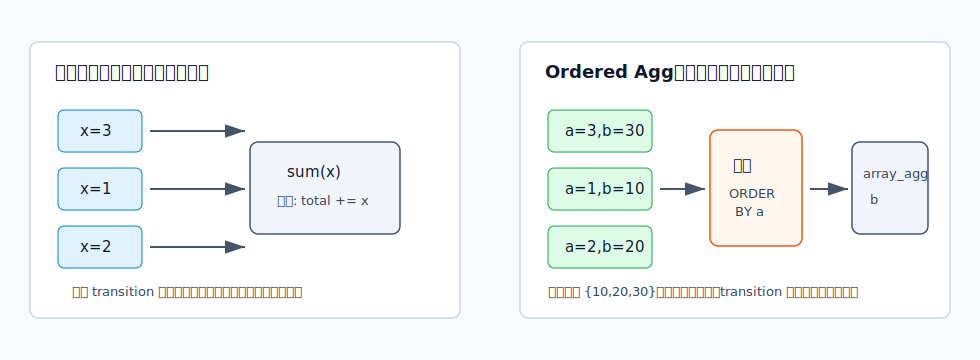
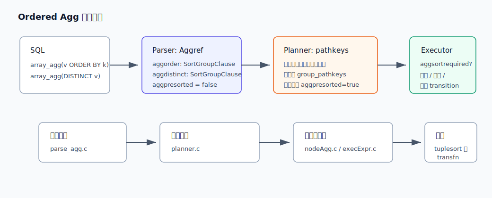
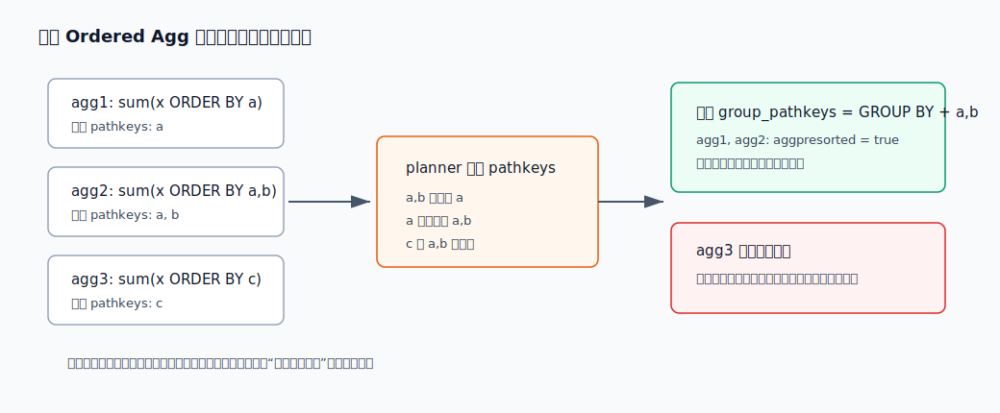
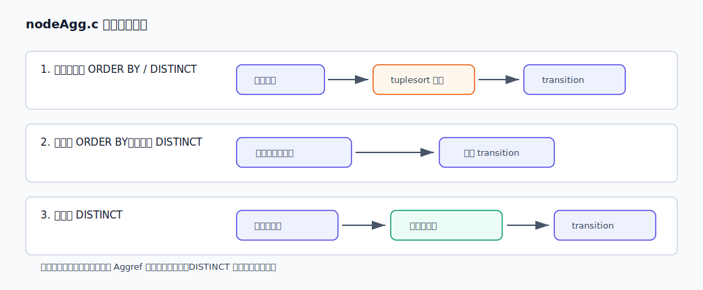
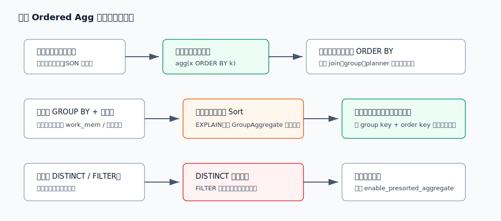

## 数据库筑基课 - 聚合之 Ordered Agg

### 作者
digoal

### 日期
2026-05-31

### 标签
PostgreSQL , 应用开发者 , 数据库筑基课 , 执行器 , 优化器 , 聚合 , Ordered Agg

----

## 背景


本文属于“扫描与执行算法”类基础能力：理解数据库如何处理“聚合结果依赖输入顺序”的 SQL。

业务里很容易写出这样的查询：

```sql
SELECT
    customer_id,
    jsonb_object_agg(attr_name, attr_value ORDER BY updated_at) AS profile,
    string_agg(event_name, ' > ' ORDER BY event_time) AS path,
    array_agg(DISTINCT tag ORDER BY tag) AS tags
FROM fact_customer_event
GROUP BY customer_id;
```

这类 SQL 的危险点是：它看起来还是普通聚合，但已经不再是 `sum()`、`count()` 那种“输入行先来后到通常无所谓”的聚合。`string_agg()` 的字符串顺序、`array_agg()` 的数组元素顺序、`jsonb_object_agg()` 在重复 key 下保留哪个值，都可能被输入顺序改变。

本文专讲普通聚合调用里的 `ORDER BY` / `DISTINCT` 输入排序，也就是 PostgreSQL 源码中经常称为 `ORDER BY / DISTINCT aggregate functions`、`ordered aggregates` 或 `ordered-input` 的路径。它不要和 `percentile_cont(...) WITHIN GROUP (ORDER BY ...)` 这类 Ordered-Set Agg 混为一谈。

本文主要依据 PostgreSQL 本地源码与文档：`doc/src/sgml/syntax.sgml`、`doc/src/sgml/func/func-aggregate.sgml`、`doc/src/sgml/config.sgml`、`src/include/nodes/primnodes.h`、`src/backend/parser/parse_agg.c`、`src/backend/optimizer/prep/prepagg.c`、`src/backend/optimizer/plan/planner.c`、`src/backend/executor/nodeAgg.c`、`src/backend/executor/execExpr.c`、`src/backend/executor/execExprInterp.c`、`src/test/regress/sql/aggregates.sql`，并参考 DeepWiki 对 `postgres/postgres` 的查询处理架构说明。两篇相关研究 `Order-Aware Query Optimization in Relational Database Systems` 与 `Exploiting Partial Orderings for Efficient Query Processing` 作为 order-aware optimizer 与 partial ordering 思路背景使用；本地未提供论文全文，所以本文不引用其具体实验数字。

## 一、它解决什么问题？

普通聚合的核心目标是把多行压缩成一个状态：

- `count(*)`：状态是计数器。
- `sum(x)`：状态是累加值。
- `avg(x)`：状态是 `sum/count`。

这类聚合多数情况下不关心输入顺序。扫描器先读到哪一行，通常不会改变最终结果。

Ordered Agg 解决的是另一类问题：聚合函数的 transition function 必须按某个顺序看到输入行，结果才有稳定语义。例如：

```sql
SELECT array_agg(v ORDER BY ts) FROM t;
SELECT string_agg(name, ',' ORDER BY score DESC, id) FROM t;
SELECT jsonb_object_agg(k, v ORDER BY updated_at) FROM t;
SELECT array_agg(DISTINCT tag ORDER BY tag) FROM t;
```

如果不把顺序写进聚合调用，PostgreSQL 文档明确说普通聚合的输入顺序默认是不指定的。把输入放进一个排序子查询“通常可行”，但如果外层还有 join 等处理，子查询输出可能在聚合前被重排。因此可靠写法是把顺序绑定到聚合表达式内部。

它付出的代价也很直接：

- 聚合节点可能需要对每个聚合、每组输入做内部排序。
- 有 `DISTINCT` 时还要去重。
- planner 可能为了让输入预排序而选择更贵的全局排序、索引路径或 `GroupAggregate`。
- 带 `ORDER BY` / `DISTINCT` 的聚合会让 PostgreSQL 标记 `hasNonPartialAggs`，阻止常规 partial aggregation。
- 带 ordered aggregate 的分组场景不走 hashed aggregation，因为 executor 不支持 hash 聚合里同时处理这些 per-aggregate 排序需求。



图 1 说明：`sum(x)` 只要按语义更新状态即可；`array_agg(b ORDER BY a)` 的结果要求 `b` 按 `a` 的顺序进入 transition function。顺序从“物理偶然性”变成了 SQL 语义的一部分。

## 二、它是什么？

本文所说 Ordered Agg 指普通聚合表达式里的两类输入约束：

```sql
aggregate_name(arg1, arg2 ORDER BY sort_expr [ASC|DESC] [NULLS FIRST|LAST])
aggregate_name(DISTINCT arg1, arg2 ORDER BY arg1, arg2)
```

在 PostgreSQL 的 `Aggref` 节点中，它们主要落在两个字段：

- `aggorder`：聚合内部 `ORDER BY` 对应的 `SortGroupClause` 列表。
- `aggdistinct`：聚合内部 `DISTINCT` 对应的 `SortGroupClause` 列表。

`src/include/nodes/primnodes.h` 对普通聚合和 ordered-set 聚合做了清楚区分：普通聚合的非 resjunk target entries 是聚合参数，末尾可能追加 resjunk target entries 表示只用于排序的表达式；ordered-set 聚合则把 `WITHIN GROUP` 的 aggregated arguments 放在 `args` 与 `aggorder` 中，direct arguments 放在 `aggdirectargs`。

所以本文的 `array_agg(x ORDER BY y)` 和上一篇 Ordered-Set Agg 的 `percentile_cont(0.95) WITHIN GROUP (ORDER BY latency)` 有相同的关键词 `ORDER BY`，但执行责任不同：

| 维度 | 本文 Ordered Agg | Ordered-Set Agg |
|---|---|---|
| 典型语法 | `array_agg(x ORDER BY y)` | `percentile_cont(0.95) WITHIN GROUP (ORDER BY x)` |
| 排序是否可选 | 对部分聚合可选，但影响结果确定性 | 是函数语义必需 |
| 源码分类 | 普通 `Aggref`，`aggkind = n` | `aggkind = o/h` |
| 排序责任 | 通用 `nodeAgg.c` 路径可排序；planner 可预排序 | support function 通常自己维护 `tuplesort` |
| 典型函数 | `array_agg`、`string_agg`、`json[b]_object_agg`、用户聚合 | `percentile_disc`、`percentile_cont`、`mode`、hypothetical rank |

一句话定义：Ordered Agg 是“普通聚合函数调用上附加的输入顺序或唯一性契约”。它不是一个单独的执行节点名称，而是 `Aggref` 的属性、planner 的 pathkeys 选择、executor 的排序/去重分支共同实现的一套语义。

## 三、核心原理

### 3.1 解析阶段：把语法变成 Aggref 的排序契约

PostgreSQL 文档在 aggregate expression 语法中列出普通聚合、`DISTINCT` 聚合、`FILTER` 聚合和 `WITHIN GROUP` 聚合。对普通聚合内部 `ORDER BY`，文档强调两点：

- 多参数聚合的 `ORDER BY` 要放在所有聚合参数之后，例如 `string_agg(a, ',' ORDER BY a)`。
- 如果 `DISTINCT` 和 `ORDER BY` 同时出现，`ORDER BY` 表达式只能引用 `DISTINCT` 列表里的表达式。

解析层把这些约束写入 `Aggref`：

- `parse_expr.c` / `parse_func.c` 初始创建 `Aggref`，`aggpresorted` 先设为 `false`。
- `parse_agg.c` 的 `transformAggregateCall()` 负责补齐 `aggorder`、`aggdistinct`、`args` 等字段。
- `primnodes.h` 的注释说明 `aggorder` / `aggdistinct` 表示在输入行传给 transition function 之前要应用的排序和去重操作。

这一步只表达语义，不承诺采用哪种物理计划。



图 2 说明：SQL 中的 `ORDER BY` / `DISTINCT` 先变成 `Aggref` 字段；planner 之后才决定是否让下层路径预先提供排序；executor 最终根据 `aggpresorted` 和 `aggsortrequired` 决定是否在聚合内部排序。

### 3.2 预处理阶段：它会阻止 partial aggregation

`src/backend/optimizer/prep/prepagg.c` 在预处理聚合时有一个关键判断：

```text
if (aggref->aggorder != NIL || aggref->aggdistinct != NIL)
{
    root->numOrderedAggs++;
    root->hasNonPartialAggs = true;
}
```

源码注释说得很直接：ordered-set 聚合总有非空 `aggorder`；任何 ordered-input 场景也会击败 partial aggregation。

原因不是 PostgreSQL 不知道怎么排序，而是 partial aggregation 要求能在多个 worker 或多个阶段之间组合 transition state。`sum()` 可以把每段的部分和再相加；`array_agg(x ORDER BY y)` 如果在各 worker 里各自维护局部数组，最终还必须按全局 `y` 重新归并，不能简单拼接。PostgreSQL 当前通用聚合框架没有把这类 per-aggregate ordered state 当作可并行归并对象处理。

### 3.3 Planner：寻找能让最多 ordered aggregate 受益的 pathkeys

PostgreSQL 的 planner 不是一看到 `array_agg(x ORDER BY y)` 就让 executor 自己排序。当前源码有一个专门优化：`enable_presorted_aggregate`，默认开启。官方配置文档说它控制 planner 是否生成能为 `ORDER BY` / `DISTINCT` 聚合函数提供预排序输入的计划；关闭后，executor 总是需要在每个带 `ORDER BY` 或 `DISTINCT` 的聚合函数执行前做隐式排序。

核心函数在 `src/backend/optimizer/plan/planner.c`：

```text
adjust_group_pathkeys_for_groupagg(root)
```

它做几件事：

1. 扫描 `root->agginfos`，找出有 `aggorder` 或 `aggdistinct` 的普通聚合。
2. 跳过 ordered-set aggregate，因为它的排序由自身 support function 负责。
3. 对带 `FILTER` 的聚合做保守安全检查：如果排序参数表达式可能在 filter 之前求值时报错，就不为它预排序。
4. 跳过排序键里含 volatile function 的聚合，避免 `random()` 这类表达式因为共享外部排序而改变行为一致性。
5. 将每个聚合的 `aggorder` 或 `aggdistinct` 转成 pathkeys。
6. 选择能覆盖最多聚合的 pathkeys，追加到 `root->group_pathkeys`。
7. 对可由该 pathkeys 覆盖的 `Aggref` 设置 `aggpresorted = true`。

这里的“覆盖”依赖 pathkeys 的强弱关系。例如输入按 `(group_key, a, b)` 排好，可以满足只需要 `(group_key, a)` 的聚合；反过来不行。



图 3 说明：多个聚合各自要排序时，planner 会选择一组覆盖最多聚合的外部排序键。能被覆盖的 `Aggref` 标成 `aggpresorted=true`；不兼容的聚合仍然在 executor 内部单独排序。

这正是 order-aware query optimization 的思想：排序不是只服务最终 `ORDER BY`，也可以服务 merge join、grouping、distinct、window、ordered aggregate 等上层算子。`Exploiting Partial Orderings for Efficient Query Processing` 这类研究进一步提醒我们：真实计划空间里经常存在“已有部分顺序”，优化器应尽量复用前缀顺序或局部顺序，而不是把排序只看成一个全量 sort 节点。PostgreSQL 的 incremental sort、pathkeys 和 presorted aggregate 都是这个方向的工程化体现。

### 3.4 为什么 ordered aggregate 不走 HashAggregate

`planner.c` 在判断是否允许 hash-based grouping 时有明确注释：executor 不支持在 hashed aggregation 中处理 `DISTINCT` 或 `ORDER BY` 聚合。原因是这样会要求在 hash table 中保存所有输入值，或者并行运行许多排序，两者看起来都很不划算。ordered-set 聚合同样不支持 hashed aggregation，而它也被计入 `numOrderedAggs`。

所以一旦查询中有 ordered aggregate，常见计划会偏向 `GroupAggregate`，通过输入排序保证一组一组地聚合。这样能把“分组顺序”和“组内排序需求”放在同一条 pathkeys 上讨论。

### 3.5 Executor：`aggpresorted` 决定是否内部排序

执行器初始化聚合 transition state 时，`src/backend/executor/nodeAgg.c` 会把 `Aggref` 的排序需求落成 `AggStatePerTransData`：

- `aggsortrequired = true`：这个 transition state 需要内部排序。
- `aggsortrequired = false`：输入顺序已经满足，或者这个聚合没有排序需求。

关键分支是：

```text
ordered-set aggregate:
    通用 nodeAgg 排序路径不处理它
aggpresorted && 没有 DISTINCT:
    不需要内部排序，像普通聚合一样 transition
aggdistinct:
    sortlist = aggdistinct
    如果 aggpresorted，则不需要完整排序，但要做相邻去重
否则:
    sortlist = aggorder
    有排序列就需要内部排序
```

`src/include/executor/nodeAgg.h` 对 `aggsortrequired` 的注释很短但重要：它对未 `aggpresorted` 的 `ORDER BY` 和 `DISTINCT` Aggref 为 true。



图 4 说明：预排序并不等于“什么都不用做”。对纯 `ORDER BY` 聚合，预排序后可以直接 transition；对 `DISTINCT` 聚合，排序输入让重复值相邻，executor 仍要执行相邻去重检查。

### 3.6 内部排序如何进入 transition function

当 `aggsortrequired` 为 true 时，表达式解释器会走 ordered aggregate 专用步骤。源码中可以看到：

- `execExpr.c` 为 ordered aggregate 选择单列或多列路径。
- `execExprInterp.c` 中有 `EEOP_AGG_ORDERED_TRANS_DATUM` 和 `EEOP_AGG_ORDERED_TRANS_TUPLE`。
- 最终由 `nodeAgg.c` 中的 ordered aggregate 处理逻辑把已排序的输入送入 transition function。

这意味着 transition function 本身通常不知道“上游刚刚为了我排序过”。它只是按 executor 喂给它的顺序处理输入。Ordered Agg 的语义由 `Aggref`、planner 和 executor 共同保证。

### 3.7 `FILTER` 与 volatile expression 的边界

`FILTER` 的语义是：只有 filter 通过的行才进入该聚合。问题在于预排序可能让排序表达式在 filter 前求值。

假设写：

```sql
SELECT array_agg(x ORDER BY 1 / y) FILTER (WHERE y <> 0)
FROM t;
```

如果 executor 在 `Agg` 节点内部处理，逻辑上可以先过滤掉 `y = 0`，再对剩余行计算 `1 / y` 排序。但如果 planner 把排序提前到输入路径，`1 / y` 可能在 filter 前求值，导致除零错误。PostgreSQL 因此在 `adjust_group_pathkeys_for_groupagg()` 中对带 `FILTER` 的聚合做保守检查：普通 `Var`、`Const` 和去掉 `RelabelType` 后仍安全的表达式可以预排序；更复杂表达式跳过预排序。

volatile expression 也是类似的语义边界。回归测试里专门检查了 `ORDER BY random()` 这类聚合不会被 query-level presort 合并处理。否则结果可能依赖同一查询中其他聚合的排序需求。

## 四、横向对比

| 维度 | Ordered Agg | Hash Agg | Sort/Group Agg | Window Function | Ordered-Set Agg |
|---|---|---|---|---|---|
| 主要目标 | 让聚合输入按指定顺序或唯一性进入 transition | 用哈希表按组维护聚合状态 | 输入按 group key 排序后一组一组聚合 | 为每行计算窗口结果 | 精确计算分位数、众数、假设排名等有序集合函数 |
| 典型 SQL | `array_agg(x ORDER BY y)` | `sum(x) GROUP BY k` | `sum(x) GROUP BY k` | `row_number() OVER (ORDER BY y)` | `percentile_cont(0.5) WITHIN GROUP (ORDER BY x)` |
| 排序需求 | 每个 Aggref 可有自己的排序键 | 通常不需要输入排序 | 需要 group key 顺序，可叠加 agg order key | 需要 window partition/order key | 函数语义必需 |
| 并行 partial | PostgreSQL 当前会被阻止 | 很多普通聚合可支持 | 很多普通聚合可支持 | 不是聚合 partial 模型 | 内置表通常 Partial Mode 为 No |
| 内存风险 | 每组或每聚合排序可能用 `work_mem` / 临时文件 | hash table 可能溢出或批处理 | sort 可能落盘 | sort/window frame 可能落盘 | support function 维护 `tuplesort` |
| 适合场景 | 有顺序语义的数组、字符串、JSON、去重列表 | 大量分组普通统计 | 已有排序、需要稳定分组顺序、ordered aggregate | 每行排名、滑动窗口 | 精确分位数、众数、假设排名 |
| 不适合场景 | 超大组还要多个不同排序键 | 有 `ORDER BY` / `DISTINCT` 聚合输入需求 | 完全无排序收益且 hash 可行的普通聚合 | 只需要每组一个结果时可能过重 | 近似监控指标、强并行低内存需求 |

这张表背后的原因是：排序需求会改变聚合的物理形态。普通聚合可以把状态留在 hash table；Ordered Agg 必须保证“某个聚合看到的输入序列”正确，而 hash table 本身不提供每组内有序输入。

## 五、效果如何？

Ordered Agg 的收益是结果可解释、可重复、符合业务语义：

- 用户路径必须按事件时间拼接。
- 审计日志必须按发生顺序聚成 JSON 或数组。
- 标签列表必须去重并排序，便于缓存命中和对比。
- `jsonb_object_agg()` 遇到重复 key 时，排序决定最终保留哪个值。

代价主要来自排序：

- 单个大 group：可能要把该组所有输入放入排序结构。
- 多个 ordered aggregate：如果排序键不兼容，可能多个聚合各自排序。
- `DISTINCT`：排序之外还要比较相邻值并跳过重复输入。
- `work_mem`：排序超过内存会用临时文件，影响延迟和 IO。
- 计划形态：可能为了顺序选择 `GroupAggregate` + `Sort`，而不是 `HashAggregate`。

`enable_presorted_aggregate` 的收益是把“多个聚合内部各排各的”变成“下层路径尽量一次提供所需顺序”。但它不是永远更快：如果为了少数 ordered aggregate 选择了代价很高的全局排序，而每组很小、内部排序很便宜，预排序未必划算。因此 DBA 要用 `EXPLAIN (ANALYZE, BUFFERS)` 验证。

## 六、实操 DEMO

以下 SQL 是最小可验证实验。本文没有在本机启动 PostgreSQL 实例执行这些 SQL；语法和预期现象来自 PostgreSQL 文档、源码和回归测试。

### 6.1 顺序写进聚合内部

```sql
WITH vals(v, ts) AS (
    VALUES ('login', 3), ('view', 1), ('pay', 2)
)
SELECT string_agg(v, ' > ' ORDER BY ts) AS path
FROM vals;
```

预期结果语义是按 `ts` 形成 `view > pay > login`。

不要把它写成只依赖子查询排序的形式：

```sql
SELECT string_agg(v, ' > ')
FROM (
    SELECT v
    FROM vals
    ORDER BY ts
) s;
```

这在简单查询里通常能工作，但 PostgreSQL 文档提醒：如果外层还有 join 等额外处理，子查询输出可能在聚合前被重排。

### 6.2 `DISTINCT` 与 `ORDER BY` 的约束

```sql
SELECT array_agg(DISTINCT a ORDER BY a DESC NULLS LAST)
FROM (VALUES (1), (2), (1), (3), (NULL), (2)) AS v(a);
```

回归测试中同类用例验证了结果顺序和 NULL 位置。`DISTINCT` 和 `ORDER BY` 同时出现时，`ORDER BY` 只能引用 `DISTINCT` 列表里的表达式。下面这类写法会报错：

```sql
SELECT string_agg(DISTINCT f1::text, ',' ORDER BY f1)
FROM varchar_tbl;
```

因为排序表达式没有与 `DISTINCT` 参数表达式匹配。

### 6.3 观察预排序开关

```sql
SET enable_presorted_aggregate TO off;
EXPLAIN (COSTS OFF)
SELECT sum(two ORDER BY two) FROM tenk1;
RESET enable_presorted_aggregate;
```

PostgreSQL 回归测试中，这个开关关闭后计划不再请求为 ordered aggregate 提供外部排序输入，executor 会在聚合内部处理排序需求。打开时，planner 可以尝试把聚合排序需求放入 pathkeys。

### 6.4 观察多个聚合共享排序

```sql
EXPLAIN (COSTS OFF)
SELECT
    sum(unique1 ORDER BY two),
    sum(unique1 ORDER BY four),
    sum(unique1 ORDER BY four, two)
FROM tenk1
GROUP BY ten;
```

回归测试中的相近查询显示，planner 会选择一组能覆盖较多 ordered aggregate 的排序键，例如 `Group Key` 后接某组 aggregate order key。含 `random()` 的排序键不会被合并到 query-level presort。

## 七、最佳实践

### 7.1 给数据库架构师

第一，把“顺序是否是业务语义”写进数据接口契约。如果 API 返回用户事件路径、审计轨迹、标签数组、JSON object，顺序不是展示细节，而是结果定义的一部分。

第二，schema 和索引设计要考虑 `GROUP BY key + aggregate ORDER BY key` 的组合。例如常见查询是：

```sql
SELECT user_id, array_agg(event_id ORDER BY event_time)
FROM events
WHERE event_time >= now() - interval '1 day'
GROUP BY user_id;
```

可以评估 `(user_id, event_time)` 或与过滤条件组合的索引是否帮助提供顺序。但别机械建索引：如果过滤首先按时间大范围裁剪，`event_time` 前导索引也可能更适合，需要用实际 workload 验证。

第三，避免一个查询里放很多互不兼容的 ordered aggregate。例如一个按 `event_time`、一个按 `amount DESC`、一个按 `status`，很可能导致外部排序只能覆盖一部分，其他聚合仍内部排序。

### 7.2 给 DBA

第一，观察计划形态：有 ordered aggregate 时，重点看 `GroupAggregate`、`Sort Key`、`Incremental Sort`、索引扫描顺序、临时文件。`EXPLAIN (ANALYZE, BUFFERS)` 比只看 SQL 更可靠。

第二，必要时对比：

```sql
SET enable_presorted_aggregate TO off;
-- run EXPLAIN
RESET enable_presorted_aggregate;
```

这能判断预排序优化是否真在当前数据分布上收益明显。

第三，关注 `work_mem` 和临时文件。Ordered Agg 的排序可能不只一个，多个并发查询叠加时内存消耗不能按单个 sort 粗略估计。

第四，看到 `FILTER` + ordered aggregate 时要多留意。复杂排序表达式可能阻止预排序；这不是 planner 保守过度，而是为了避免 filter 前求值改变错误行为。

### 7.3 给业务开发者

第一，需要稳定顺序时，写：

```sql
array_agg(x ORDER BY k)
string_agg(x, ',' ORDER BY k)
jsonb_object_agg(k, v ORDER BY updated_at)
```

不要假设表扫描顺序、插入顺序或子查询排序会一直稳定。

第二，`jsonb_object_agg()` 有重复 key 时，顺序决定最后保留的值。这个语义要写清楚，例如保留最新值就 `ORDER BY updated_at`，保留优先级最高值就 `ORDER BY priority`。

第三，超大数组、超长字符串、超大 JSON 聚合本身就是高风险结果。Ordered Agg 只能保证顺序，不会替你解决结果过大、网络传输大、客户端解析慢的问题。



图 5 说明：先判断顺序是否是业务语义；如果是，就把 `ORDER BY` 写进聚合内部。然后再从计划、索引、`work_mem`、`DISTINCT`、`FILTER` 等角度验证代价，而不是反过来为了省排序牺牲语义。

## 八、适合与不适合场景

适合：

- 用户行为路径、交易流水、审批轨迹等按时间聚合成字符串或数组。
- 标签、权限、配置项需要去重并稳定排序，便于比较、缓存或签名。
- JSON object 聚合中存在重复 key，需要用排序规则明确“谁覆盖谁”。
- 小到中等 group，或者已有索引/排序路径能自然提供顺序。
- 报表、审计、导出等更看重确定性的场景。

不适合：

- 每个 group 极大，还要同时维护多个不兼容排序。
- 只是为了“看起来有序”，但业务结果并不需要顺序。
- 高频在线请求中把海量明细聚成巨大数组或 JSON。
- 需要强并行 partial aggregation 的大规模统计。
- 本质上要的是 Top-N，而不是全量有序聚合；这种场景可能应先用窗口函数、`DISTINCT ON`、LATERAL 子查询或 Top-N 索引路径收缩输入。

## 九、常见坑

### 9.1 依赖子查询排序

```sql
SELECT array_agg(x)
FROM (SELECT x FROM t ORDER BY k) s;
```

简单场景可能没问题，但外层 join、聚合或 planner 改写可能破坏输入顺序。可靠写法是 `array_agg(x ORDER BY k)`。

### 9.2 以为 `DISTINCT` 自带想要的顺序

`array_agg(DISTINCT x)` 的去重需要排序或比较，但业务上想要升序、降序、NULL 位置时，应明确写 `ORDER BY`。不要把实现细节当作产品语义。

### 9.3 忘记 `DISTINCT ORDER BY` 的表达式约束

`string_agg(DISTINCT f1::text, ',' ORDER BY f1)` 和 `string_agg(DISTINCT f1, ',' ORDER BY f1::text)` 在 PostgreSQL 回归测试中是错误用例。排序表达式必须匹配 `DISTINCT` 参数表达式。

### 9.4 一个查询里堆太多不同排序

planner 只能选择一组最有利的 pathkeys 标记一部分 `Aggref` 为 `aggpresorted`。其他排序键不兼容的聚合仍要内部排序。拆查询、预聚合或重新设计输出结构，有时比硬塞一个 SELECT 更好。

### 9.5 忽视 volatile 和 FILTER

`ORDER BY random()` 不会被合并成 query-level presort；带 `FILTER` 的复杂排序表达式也可能跳过预排序。这是语义保护，不是 bug。

### 9.6 把 Ordered Agg 和 Ordered-Set Agg 混为一谈

`array_agg(x ORDER BY y)` 是普通聚合的输入排序。`percentile_cont(0.5) WITHIN GROUP (ORDER BY x)` 是 ordered-set aggregate，排序责任和实现路径不同。排查性能时要看对应源码和计划，不要只按关键词 `ORDER BY` 分类。

## 十、扩展问题

1. 如果一个查询有 `GROUP BY user_id` 和 `array_agg(event ORDER BY ts)`，什么索引顺序最可能减少排序？`(user_id, ts)`、`(ts, user_id)`、还是其他组合？为什么？
2. 为什么 `array_agg(x ORDER BY y)` 不能像 `sum(x)` 一样简单做 partial aggregation 后再 combine？
3. 如果只需要每个用户最近 10 条事件，应该用全量 `array_agg(... ORDER BY ...)` 后切片，还是先 Top-N 再聚合？代价差在哪里？
4. `jsonb_object_agg(k, v ORDER BY updated_at)` 在重复 key 下保留哪个值？如果排序方向反过来，结果如何变化？
5. 对一个有 `FILTER` 的 ordered aggregate，把排序表达式提前求值为什么可能改变错误行为？

## 十一、扩展阅读

- PostgreSQL 文档：`doc/src/sgml/syntax.sgml`，Aggregate Expressions，说明聚合内部 `ORDER BY`、`DISTINCT`、`FILTER` 和 `WITHIN GROUP` 语法。
- PostgreSQL 文档：`doc/src/sgml/func/func-aggregate.sgml`，说明 `array_agg`、`string_agg`、`json[b]_object_agg` 等函数的结果依赖输入顺序。
- PostgreSQL 文档：`doc/src/sgml/config.sgml`，`enable_presorted_aggregate` 参数说明。
- PostgreSQL 源码：`src/include/nodes/primnodes.h`，`Aggref` 的 `aggorder`、`aggdistinct`、`aggpresorted` 字段注释。
- PostgreSQL 源码：`src/backend/parser/parse_agg.c`，`transformAggregateCall()`。
- PostgreSQL 源码：`src/backend/optimizer/prep/prepagg.c`，ordered-input 聚合对 partial aggregation 的影响。
- PostgreSQL 源码：`src/backend/optimizer/plan/planner.c`，`adjust_group_pathkeys_for_groupagg()` 和 hash aggregation gating。
- PostgreSQL 源码：`src/backend/executor/nodeAgg.c`、`src/backend/executor/execExpr.c`、`src/backend/executor/execExprInterp.c`，ordered aggregate 的排序、预排序、去重执行分支。
- PostgreSQL 回归测试：`src/test/regress/sql/aggregates.sql` 与 `src/test/regress/expected/aggregates.out`，包含 volatile、`enable_presorted_aggregate`、`FILTER`、`DISTINCT ORDER BY` 等测试。
- DeepWiki：`postgres/postgres` 查询处理、planner、executor 架构页面，以及关于 ordered aggregate / `aggpresorted` 的问答结果。
- 论文：`Order-Aware Query Optimization in Relational Database Systems`，order-aware optimizer 背景。
- 论文：`Exploiting Partial Orderings for Efficient Query Processing`，partial ordering 与排序复用背景。
  
## 附录 
1、问 gemini
```
数据库 Ordered Agg 聚合相关的论文
```

2、克隆代码  
```  
git clone --depth 1 https://github.com/postgres/postgres
```  
  
3、启用 codex, 使用 [数据库筑基课 skill](../skills/README.md).  
```
文章标题: 
  数据库筑基课 - 聚合之 Ordered Agg
项目源码(本地目录):  
  postgres
项目 codebase 文件名: 
  postgres/CLAUDE.md
相关的论文或文档名:
  Order-Aware Query Optimization in Relational Database Systems
  Exploiting Partial Orderings for Efficient Query Processing
开源项目相关的 deepwiki repoName: 
  postgres/postgres
```
  
  
#### [PostgreSQL 解决方案集合](../201706/20170601_02.md "40cff096e9ed7122c512b35d8561d9c8")
  
  
#### [德哥 / digoal's Github - 公益是一辈子的事.](https://github.com/digoal/blog/blob/master/README.md "22709685feb7cab07d30f30387f0a9ae")
  
  
#### [About 德哥](https://github.com/digoal/blog/blob/master/me/readme.md "a37735981e7704886ffd590565582dd0")
  
  

  
