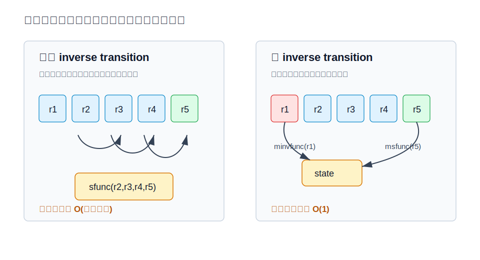
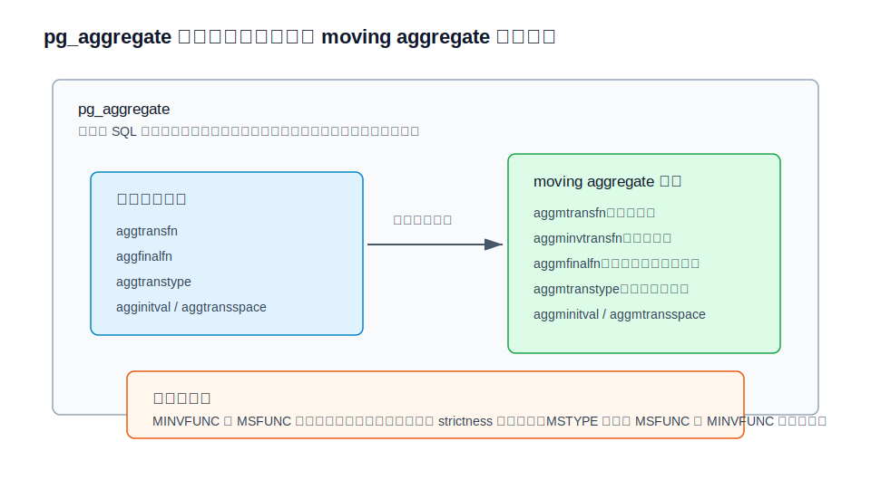
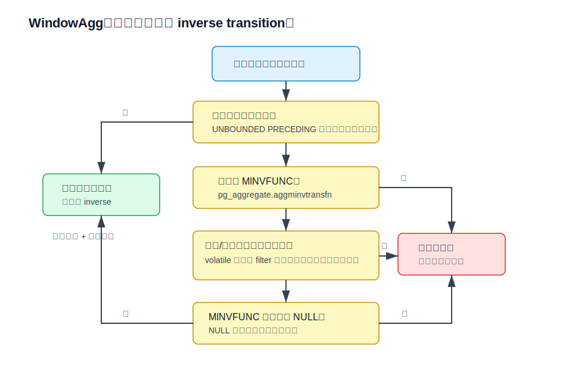
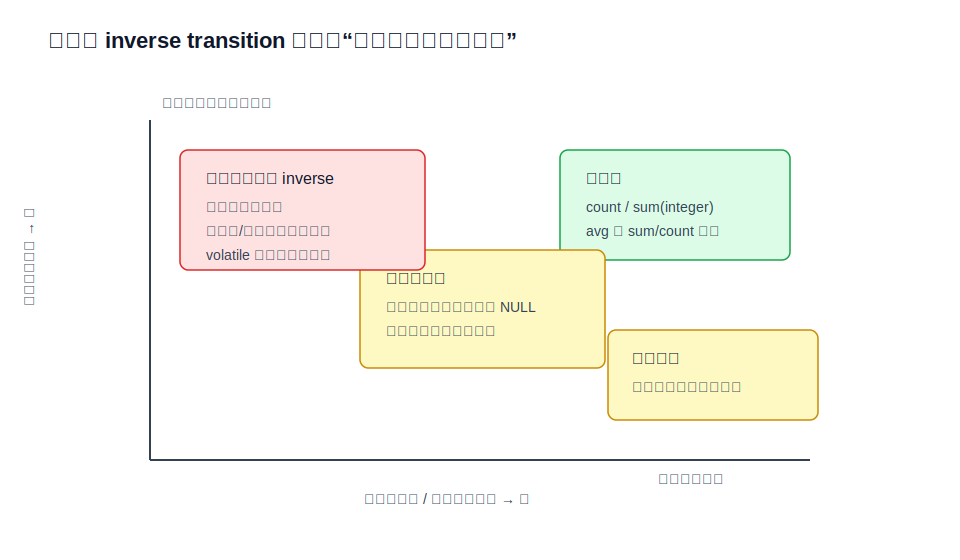

## 数据库筑基课 - 聚合之 Inverse Transition

### 作者
digoal

### 日期
2026-05-31

### 标签
PostgreSQL , 应用开发者 , 数据库筑基课 , 执行器 , 聚合 , WindowAgg , Inverse Transition

----

## 背景


本文属于“扫描与执行算法”类基础能力：理解数据库如何把滑动窗口聚合从“每一行都重算一遍窗口”变成“删除离开窗口的旧行，再加入进入窗口的新行”。

业务里常见的写法是：

```sql
SELECT
    device_id,
    ts,
    avg(value) OVER (
        PARTITION BY device_id
        ORDER BY ts
        ROWS BETWEEN 59 PRECEDING AND CURRENT ROW
    ) AS avg_60
FROM sensor_log;
```

这个 SQL 看起来只是 `avg()`，但它和普通 `GROUP BY device_id` 聚合不同：每一行输出都有一个窗口帧，下一行的窗口帧通常只比上一行少一条旧记录、多一条新记录。如果每个输出行都从头扫描 60 条记录，代价是 `N * frame_width`；如果能把旧记录从聚合状态中“撤销”，代价就接近 `N`。

本文聚焦 PostgreSQL 的 moving-aggregate mode，也就是 `CREATE AGGREGATE` 里的 `MSFUNC` / `MINVFUNC` / `MSTYPE` 机制。

本文主要依据 PostgreSQL 本地源码与文档：`doc/src/sgml/xaggr.sgml`、`doc/src/sgml/ref/create_aggregate.sgml`、`src/include/catalog/pg_aggregate.h`、`src/backend/catalog/pg_aggregate.c`、`src/backend/executor/nodeWindowAgg.c`、`src/test/regress/sql/window.sql`、`src/test/regress/sql/create_aggregate.sql`、`src/test/regress/sql/opr_sanity.sql`，并参考 PostgreSQL 官方文档的 user-defined aggregates 与 `CREATE AGGREGATE` 页面，以及 DeepWiki 对 `postgres/postgres` 查询处理架构的说明。用户给出的三篇相关论文题名中，`The Dataflow Model: A Practical Approach to Balancing Correctness, Latency, and Cost in Massive-Scale, Unbounded, Out-of-Order Data Processing` 可作为流式窗口、水位线和增量计算背景；`Incremental Computation of General Group-By Queries` 与 `Amortized O(1) Composition of Arbitrary Sliding Window Aggregates` 本地未提供全文，公开检索未得到可稳定核验的同名入口，因此本文只使用其题名所指向的增量 group-by 与滑动窗口聚合思想，不引用未核验的实验数字或算法细节。

## 一、它解决什么问题？

Inverse transition 解决的是“窗口帧头部移动”带来的重复计算。

普通聚合的 transition function 只会向状态里追加输入：

```text
state = sfunc(state, row)
```

窗口聚合作为 window function 使用时，情况变成：

```text
第 i 行结果   = aggregate(rows[i-59 ... i])
第 i+1 行结果 = aggregate(rows[i-58 ... i+1])
```

两个窗口高度重叠。如果没有反向转移函数，执行器只能在帧起点变化后重新聚合当前帧。PostgreSQL 文档明确说明：没有 inverse transition 时，窗口函数机制必须在帧起点移动时从头重算，运行时间与输入行数乘以平均帧长度成正比；有 inverse transition 时，运行时间只与输入行数成正比。

它的代价也必须先说清楚：

- 聚合状态必须支持“删掉最早加入的输入值”。
- moving-aggregate mode 需要单独的状态类型、前向函数、反向函数和可选 final function。
- 反向撤销必须精确恢复状态，否则同一个 SQL 可能因为执行器是否采用 moving mode 而得到不同结果。
- 有些输入值无法撤销时，`MINVFUNC` 可以返回 `NULL`，但这会触发当前帧重算。
- 对浮点数、分位数、top-k、去重集合等聚合，所谓“撤销一行”往往不是简单减法。



图 1 说明：没有 inverse transition 时，帧从 `[r1,r2,r3,r4]` 移到 `[r2,r3,r4,r5]`，执行器需要重新把 `r2,r3,r4,r5` 输入聚合函数。有 inverse transition 时，状态先通过 `MINVFUNC` 移除 `r1`，再通过 `MSFUNC` 加入 `r5`。收益来自复用中间状态，而不是来自减少输出行数。

## 二、它是什么？

在 PostgreSQL 里，inverse transition 是 user-defined aggregate 的 moving-aggregate mode 组成部分。创建聚合时，普通聚合路径由 `SFUNC` / `STYPE` / `FINALFUNC` 等参数描述；滑动窗口优化路径由下面这些参数描述：

```sql
CREATE AGGREGATE sum (complex)
(
    sfunc = complex_add,
    stype = complex,
    initcond = '(0,0)',
    msfunc = complex_add,
    minvfunc = complex_sub,
    mstype = complex,
    minitcond = '(0,0)'
);
```

核心术语：

| 术语 | PostgreSQL 参数/字段 | 含义 |
|---|---|---|
| forward transition | `MSFUNC` / `aggmtransfn` | moving mode 下新行进入窗口时更新状态 |
| inverse transition | `MINVFUNC` / `aggminvtransfn` | 最早的旧行离开窗口时撤销它对状态的影响 |
| moving state type | `MSTYPE` / `aggmtranstype` | moving mode 的状态类型，可与普通 `STYPE` 不同 |
| moving final function | `MFINALFUNC` / `aggmfinalfn` | 从 moving state 计算最终输出 |
| moving initial value | `MINITCOND` / `aggminitval` | moving state 的初始值 |

为什么 moving mode 要允许独立状态？因为“可输出结果”和“可撤销旧行”不是一回事。普通 `avg(x)` 可以只把最后结果作为平均值理解，但可撤销状态至少要保存 `sum` 和 `count`；更复杂的聚合可能需要额外队列、计数、桶或摘要结构。

## 三、核心原理

### 3.1 目录层：一套聚合，两套实现

`src/include/catalog/pg_aggregate.h` 在 `pg_aggregate` 里保存 moving aggregate 的专用字段：`aggmtransfn`、`aggminvtransfn`、`aggmfinalfn`、`aggmfinalextra`、`aggmfinalmodify`、`aggmtranstype`、`aggmtransspace`、`aggminitval`。这些字段和普通聚合的 `aggtransfn`、`aggfinalfn`、`aggtranstype`、`agginitval` 并列存在。

`src/backend/catalog/pg_aggregate.c` 创建聚合时会检查 `MINVFUNC`：

- `MINVFUNC` 的参数数量和类型必须与 `MSFUNC` 一致。
- 返回类型必须等于声明的 `MSTYPE`。
- `MSFUNC` 与 `MINVFUNC` 的 strictness 必须一致，否则报错。
- moving implementation 的输出类型必须与普通 implementation 的输出类型一致。

`src/test/regress/sql/opr_sanity.sql` 还在回归测试中检查系统目录一致性：如果 `aggmtranstype != 0`，`aggmtransfn` 和 `aggminvtransfn` 不能缺失；如果 `aggmtranstype = 0`，moving 相关字段不能意外存在。



图 2 说明：PostgreSQL 不是在普通 `SFUNC` 上临时猜一个反函数，而是在系统目录里明确登记 moving mode 的前向函数、反向函数、状态类型和可选 final function。这个契约让执行器可以在窗口帧移动时直接调用对应函数，也让 `CREATE AGGREGATE` 阶段提前拦住明显不一致的定义。

### 3.2 执行层：WindowAgg 才真正使用 inverse transition

不要把 inverse transition 和普通 `GROUP BY` 的 `Agg` 节点混淆。`src/backend/executor/nodeAgg.c` 负责普通聚合、排序聚合、哈希聚合、部分聚合等；它初始化普通 transition function 时甚至有注释说明这里不需要 `invtransfn`。真正使用 inverse transition 的是 `src/backend/executor/nodeWindowAgg.c`。

窗口聚合的简化流程是：

```text
1. 计算当前输出行的 frame head 与 frame tail。
2. 如果 frame head 不移动，只继续用 forward transition 追加新行。
3. 如果 frame head 移动，并且聚合有 MINVFUNC，尝试对离开的旧行调用 inverse transition。
4. 如果 inverse transition 成功，再追加新进入的行。
5. 如果没有 MINVFUNC、窗口排除规则要求重启、参数含 volatile 表达式，或 MINVFUNC 返回 NULL，则重启当前聚合，从当前帧头重新扫描。
```

PostgreSQL 源码里有几个关键边界：

- `nodeWindowAgg.c` 会在聚合没有 `aggminvtransfn` 时放弃 moving mode。
- 如果窗口帧是 `UNBOUNDED PRECEDING` 起点，帧头不会移动，通常不需要 inverse transition。
- volatile 参数或 volatile filter 会禁用 moving aggregate，因为重启与不重启可能观察到不同的随机值或副作用可见结果。
- `EXCLUDE` 相关 frame option 会让聚合重启。
- 如果 `MINVFUNC` 返回 `NULL`，执行器认为本次撤销失败，标记该聚合重启。
- 执行器不会用 inverse transition 删除最后一行；如果删除后没有行保留，会直接重启。



图 3 说明：inverse transition 是 WindowAgg 的一个条件优化路径。它不是 planner 承诺的独立计划节点，也不是所有窗口帧都会使用的路径。只要语义稳定性无法保证，PostgreSQL 宁愿退回重算。

### 3.3 反函数不是数学装饰，而是状态恢复契约

PostgreSQL 文档对 `MINVFUNC` 的要求很硬：它接收当前状态和当前状态中最早加入、尚未移除的输入值，必须重建“如果这个输入值从未被聚合过，只聚合它后面的行”时应有的状态。

对 `count(*)`，这很简单：

```text
MSFUNC:    count = count + 1
MINVFUNC: count = count - 1
```

对整数 `sum(x)`，也通常简单：

```text
MSFUNC:    sum = sum + x
MINVFUNC: sum = sum - x
```

对 `avg(x)`，状态不能只是平均值，而应该类似：

```text
state = (sum, count)
MSFUNC:    (sum + x, count + 1)
MINVFUNC: (sum - x, count - 1)
FINAL:     sum / count
```

对浮点 `sum(float8)`，直觉上的 `+` 和 `-` 可能不满足“精确恢复”。PostgreSQL 文档举了一个反例：`1.0e20 + 1.0` 在 `float8` 精度下仍然可能是 `1.0e20`，再减掉 `1.0e20` 得到 `0`，不是原来的 `1`。所以给浮点 sum 随便加 `MINVFUNC = float8mi` 会造成 moving mode 与非 moving mode 的用户可见差异。

这也是 inverse transition 最容易踩坑的地方：数学上看起来有逆元，不代表计算机里的状态更新可逆。

### 3.4 失败可退回：`MINVFUNC` 返回 NULL

PostgreSQL 给 `MINVFUNC` 留了一个工程出口：如果某个输入值在当前状态下无法可靠撤销，可以返回 `NULL`。执行器会把这理解为“本次 inverse transition 失败”，然后从当前帧起点重新聚合。

`src/test/regress/sql/window.sql` 专门构造了 `sum_int_randomrestart`，它的 `MINVFUNC` 随机返回 `NULL`，用来验证：

- inverse transition 失败会触发重启。
- 一个聚合重启不应该错误影响其他不需要重启的聚合。
- 重启后结果仍应和从头聚合一致。

这说明 moving aggregate 的正确性优先级高于性能。`MINVFUNC` 可以“认输”，但不能为了快而返回错误状态。

## 四、横向对比

| 维度 | Inverse Transition / Moving Aggregate | 从头重算窗口帧 | 通用滑动窗口数据结构 | 流式 Dataflow 窗口 |
|---|---|---|---|---|
| 主要目标 | 在 SQL window aggregate 内复用聚合状态 | 保证语义简单正确 | 以队列、双栈、树或摘要维护滑动结果 | 在无界、乱序数据中平衡正确性、延迟、成本 |
| 状态要求 | 聚合作者提供可撤销状态 | 不要求可撤销 | 通常要求结合律、幺元或特定结构 | 需要事件时间、watermark、trigger、allowed lateness |
| PostgreSQL 位置 | `nodeWindowAgg.c` 执行窗口聚合 | `nodeWindowAgg.c` 重启路径 | 不是 PostgreSQL 通用聚合接口的一部分 | 主要属于流处理系统模型 |
| 复杂度 | 帧头频繁移动时通常接近 O(N) | O(N * 平均帧长) | 视算法可达摊还 O(1) 或 O(log W) | 取决于窗口、触发与迟到数据策略 |
| 正确性风险 | 反函数不精确会改变结果 | 风险最低 | 算法前提不满足会错 | watermark 过早会丢迟到修正 |
| 典型适合 | count、整数 sum、avg、部分方差统计、bool 聚合 | 小窗口、复杂不可逆聚合 | min/max、分位数、任意 monoid 聚合 | 实时看板、乱序事件、低延迟统计 |
| 典型不适合 | 浮点误差敏感、复杂有序集合、volatile 参数 | 大窗口高并发 | SQL 聚合状态难暴露时 | 强事务一致、低乱序离线查询 |

这张表的重点不是说哪种“更先进”，而是看抽象层次。PostgreSQL 的 inverse transition 是数据库执行器内的聚合函数契约；滑动窗口论文常讨论更一般的代数结构和数据结构；Dataflow 模型讨论无界乱序数据里的时间语义。它们都在减少重复计算，但问题边界不同。

## 五、效果如何？

### 5.1 复杂度收益

假设分区内有 `N` 行，窗口平均宽度为 `W`：

- 没有 inverse transition：帧头每移动一次，重算约 `W` 行，粗略代价 `O(N * W)`。
- 有 inverse transition 且大多数撤销成功：每行最多删除旧行、加入新行，粗略代价 `O(N)`。
- 如果 `MINVFUNC` 经常返回 `NULL`：退化为多次重算，收益下降。

这不是 PostgreSQL 承诺的固定性能数字，而是由执行路径决定的复杂度变化。真实耗时还取决于分区排序、tuplestore 访问、表达式计算、聚合状态大小、内存上下文和数据类型函数成本。

### 5.2 PostgreSQL 已内置支持的聚合

`src/include/catalog/pg_aggregate.dat` 里可以看到多个内置聚合已经有 `aggmtransfn` 与 `aggminvtransfn`，包括：

- `avg(bigint/int/integer/smallint/numeric/interval)` 的相关实现。
- `sum(bigint/integer/smallint/money/interval/numeric)` 的相关实现。
- 方差、标准差、回归统计等数值聚合的相关实现。
- `count` 通过 `int8inc` / `int8dec` 或相近函数维护。
- `bool_and`、`bool_or`、`every` 通过布尔累积状态和 inverse 函数支持 moving mode。

这也解释了为什么 PostgreSQL 文档强调“moving mode 可以用不同的状态”。例如 avg、variance 这类聚合不是简单保存最终值，而是保存足以增删输入并最终计算结果的状态。

### 5.3 它不优化什么

Inverse transition 不会消除窗口排序。`OVER (PARTITION BY ... ORDER BY ...)` 仍然要求输入按窗口分区和顺序组织，计划中常见 `Sort` + `WindowAgg`，或者使用已有索引/路径顺序减少排序成本。

它也不优化普通 `GROUP BY` 的哈希表大小、排序聚合的排序成本、parallel aggregation 的 combine 成本。那些分别属于 Hash Agg、Ordered Agg、Parallel Agg 等主题。

## 六、实操 DEMO

下面示例可以在 PostgreSQL 中执行，用一个自定义聚合记录 moving mode 是否真的在调用 `MSFUNC` / `MINVFUNC`。它参考了 PostgreSQL 回归测试 `src/test/regress/sql/window.sql` 的做法。

```sql
CREATE FUNCTION logging_sfunc(text, text) RETURNS text AS
$$ SELECT COALESCE($1, '') || '*' || quote_nullable($2) $$
LANGUAGE SQL IMMUTABLE;

CREATE FUNCTION logging_msfunc(text, text) RETURNS text AS
$$ SELECT COALESCE($1, '') || '+' || quote_nullable($2) $$
LANGUAGE SQL IMMUTABLE;

CREATE FUNCTION logging_minvfunc(text, text) RETURNS text AS
$$ SELECT $1 || '-' || quote_nullable($2) $$
LANGUAGE SQL IMMUTABLE;

CREATE AGGREGATE logging_agg(text)
(
    stype = text,
    sfunc = logging_sfunc,
    mstype = text,
    msfunc = logging_msfunc,
    minvfunc = logging_minvfunc
);

SELECT
    i,
    v,
    logging_agg(v) OVER (
        ORDER BY i
        ROWS BETWEEN 1 PRECEDING AND CURRENT ROW
    ) AS trace
FROM (VALUES
    (1, 'a'),
    (2, 'b'),
    (3, 'c')
) AS t(i, v)
ORDER BY i;
```

预期观察方式：

- 第一行没有旧行可删除，状态主要表现为加入 `a`。
- 第二行窗口是 `[a,b]`，继续加入 `b`。
- 第三行窗口从 `[a,b]` 变成 `[b,c]`，如果 moving mode 生效，trace 中会出现移除 `a`、加入 `c` 的痕迹。

再看 PostgreSQL 回归测试覆盖的几个工程边界：

```sql
-- volatile 参数会禁用 moving-aggregate mode
SELECT
    logging_agg(v::text) OVER wnd AS inverse,
    logging_agg(v::text || CASE WHEN random() < 0 THEN '?' ELSE '' END) OVER wnd AS noinverse
FROM (VALUES (1, 'a'), (2, 'b'), (3, 'c')) AS t(i, v)
WINDOW wnd AS (ORDER BY i ROWS BETWEEN 1 PRECEDING AND CURRENT ROW);
```

```sql
-- MINVFUNC 返回 NULL 时，执行器重启聚合并从当前帧头重算
CREATE FUNCTION sum_int_randrestart_minvfunc(int4, int4) RETURNS int4 AS
$$ SELECT CASE WHEN random() < 0.2 THEN NULL ELSE $1 - $2 END $$
LANGUAGE SQL STRICT;
```

本文没有在本地启动 PostgreSQL 实例执行这些 SQL；它们来自 PostgreSQL 官方回归测试和文档示例路径，语法按 PostgreSQL `CREATE AGGREGATE` 规则整理。

## 七、最佳实践

### 面向数据库架构师

把 inverse transition 看成“窗口聚合的状态契约”，不要只看 SQL 表面是否有 `sum()` / `avg()`。

- 如果业务核心是滚动指标、移动平均、滑动计数，优先检查内置聚合是否已有 moving support。
- 对自定义聚合，先定义状态不变量，例如 `state = (sum, count)`，再写 `MSFUNC` / `MINVFUNC` / `MFINALFUNC`。
- 只在能证明撤销正确时提供 `MINVFUNC`。证明不了时，宁愿不提供，让 PostgreSQL 重算。
- 对浮点数、概率摘要、排序敏感聚合，要单独评估数值稳定性和状态可逆性。

验证方式：

```sql
SELECT
    p.proname AS agg_name,
    a.aggmtransfn::regproc AS msfunc,
    a.aggminvtransfn::regproc AS minvfunc,
    a.aggmtranstype::regtype AS mstype
FROM pg_aggregate a
JOIN pg_proc p ON p.oid = a.aggfnoid
WHERE a.aggminvtransfn <> 0
ORDER BY 1;
```

### 面向 DBA

DBA 关注的是“为什么这个 WindowAgg 慢”和“优化点到底在排序还是聚合”。

- `EXPLAIN` 看到 `WindowAgg` 前有大 `Sort`，先判断排序是否是主成本。inverse transition 不会替你省掉排序。
- 对 `ROWS BETWEEN k PRECEDING AND CURRENT ROW` 这类固定行数窗口，帧头频繁移动，moving aggregate 潜在收益较大。
- 对 `UNBOUNDED PRECEDING` 起点窗口，执行器只需要持续追加，inverse transition 不是关键。
- 如果表达式里有 `random()`、`clock_timestamp()`、volatile UDF 或 volatile filter，不要期待 moving mode 生效。
- 如果自定义 `MINVFUNC` 经常返回 `NULL`，会频繁重启，性能可能接近重算。

### 面向业务开发者

业务开发者的重点是把窗口写清楚，不要用错误 SQL 期待执行器猜意图。

- 明确写 `ROWS` / `RANGE` / `GROUPS` frame，不要依赖默认 frame。
- 时间序列滚动窗口里，`ROWS 59 PRECEDING` 与 `RANGE INTERVAL '59 minutes' PRECEDING` 语义不同：前者按行数，后者按排序值范围。
- 避免在窗口聚合参数里塞 volatile 表达式。需要随机或实时值时，先物化到子查询并接受对应语义。
- 对金额、计数、库存这类指标，优先用精确类型而不是随手用浮点。

## 八、适合与不适合场景

适合：

- 大分区、固定宽度或频繁移动帧头的窗口聚合。
- `count`、整数/数值 `sum`、`avg`、部分统计聚合、布尔聚合等状态可撤销的函数。
- 传感器、行情、日志、监控、订单滚动指标等“相邻窗口高度重叠”的场景。
- 自定义聚合状态小、撤销函数便宜、撤销失败少的场景。

不适合：

- 窗口很小，重算成本本来就低。
- 帧起点不移动，例如 `UNBOUNDED PRECEDING` 到当前行的累计值。
- 浮点误差会影响业务正确性的聚合。
- 中位数、精确分位数、top-k、去重集合等撤销需要复杂辅助结构的聚合。
- 参数或 filter 含 volatile 表达式。
- 使用 `EXCLUDE` frame option 导致执行器需要重启的窗口。



图 4 说明：最值得做 inverse transition 的区域是“重算代价高、状态可逆性强”。如果状态不可逆，强行写 `MINVFUNC` 会把性能问题变成正确性问题；如果重算代价很低，工程收益也有限。

## 九、常见坑

1. 把 `SFUNC` 当成 `MSFUNC` 自动复用。

   PostgreSQL 允许两者使用同一个函数，但不会替你证明它适合 moving mode。`MSFUNC` 的状态类型是 `MSTYPE`，可能与普通 `STYPE` 不同。

2. 给浮点 sum 加简单减法反函数。

   PostgreSQL 文档明确用 `unsafe_sum(float8)` 说明这会产生用户可见错误。浮点加减不是精确可逆的状态机。

3. 只测试普通聚合，不测试窗口聚合。

   `SELECT myagg(x) FROM t` 不会覆盖 inverse transition。必须用 `myagg(x) OVER (...)` 且让帧头移动。

4. 忽略 NULL 与 strictness。

   `MSFUNC` 和 `MINVFUNC` strictness 必须一致。NULL 输入如何影响状态，要在函数定义和测试里明确。

5. 误以为 `MINVFUNC` 返回 NULL 是正常结果。

   对 inverse transition 来说，返回 NULL 是“撤销失败，请重算”的信号，不是一个普通状态值。

6. 看到 `WindowAgg` 慢就怪聚合函数。

   很多窗口查询的主要成本在排序、分区过大、tuplestore、表达式计算或输出量。inverse transition 只解决帧头移动后的聚合状态复用。

## 十、扩展问题

1. `sum(int8)` 和 `sum(float8)` 都有加法，为什么一个更适合 inverse transition，另一个不能简单用减法？

2. 如果要实现滑动 `median(x)`，你会选择两个堆、平衡树、计数桶，还是让 `MINVFUNC` 返回 NULL 退回重算？不同数据分布下代价如何？

3. PostgreSQL 的 moving aggregate 和流处理系统里的 window + watermark 解决的是同一个问题吗？哪些部分相同，哪些部分完全不同？

4. 如果一个自定义聚合的 `MSTYPE` 比普通 `STYPE` 大很多，窗口聚合速度提升是否一定值得？如何用压测验证？

5. 为什么 volatile 参数会禁用 moving aggregate？如果先在子查询中物化 volatile 结果，语义会发生什么变化？

## 十一、扩展阅读

- PostgreSQL 官方文档：User-Defined Aggregates，尤其是 Moving-Aggregate Mode。<https://www.postgresql.org/docs/current/xaggr.html>
- PostgreSQL 官方文档：`CREATE AGGREGATE`，尤其是 `MSFUNC`、`MINVFUNC`、`MSTYPE`、`MFINALFUNC` 参数。<https://www.postgresql.org/docs/current/sql-createaggregate.html>
- PostgreSQL 源码：`src/include/catalog/pg_aggregate.h`，`pg_aggregate` 系统目录字段定义。
- PostgreSQL 源码：`src/backend/catalog/pg_aggregate.c`，`AggregateCreate` 对 moving aggregate 函数签名和 strictness 的校验。
- PostgreSQL 源码：`src/backend/executor/nodeWindowAgg.c`，窗口聚合使用 inverse transition、重启聚合、禁用 volatile moving mode 的执行逻辑。
- PostgreSQL 源码：`src/include/catalog/pg_aggregate.dat`，内置聚合的 `aggmtransfn` / `aggminvtransfn` 定义。
- PostgreSQL 回归测试：`src/test/regress/sql/window.sql`，moving aggregate 基础行为、volatile 参数禁用、`MINVFUNC` 返回 NULL 触发重启、内置聚合 NULL 处理。
- PostgreSQL 回归测试：`src/test/regress/sql/create_aggregate.sql` 与 `opr_sanity.sql`，`CREATE AGGREGATE` moving 参数和系统目录一致性检查。
- DeepWiki：`postgres/postgres` 查询处理架构页面，用于理解 parser、optimizer、executor 的总体位置。<https://deepwiki.com/postgres/postgres>
- Tyler Akidau 等：`The Dataflow Model: A Practical Approach to Balancing Correctness, Latency, and Cost in Massive-Scale, Unbounded, Out-of-Order Data Processing`，用于理解流式窗口、事件时间、水位线和增量结果更新的背景。
  
## 附录 
1、问 gemini
```
数据库 Inverse Transition 聚合相关的论文
```

2、克隆代码  
```  
git clone --depth 1 https://github.com/postgres/postgres
```  
  
3、启用 codex, 使用 [数据库筑基课 skill](../skills/README.md).  
```
文章标题: 
  数据库筑基课 - 聚合之 Inverse Transition
项目源码(本地目录):  
  postgres
项目 codebase 文件名: 
  postgres/CLAUDE.md
相关的论文或文档名:
  Incremental Computation of General Group-By Queries
  Amortized O(1) Composition of Arbitrary Sliding Window Aggregates
  The Dataflow Model: A Practical Approach to Balancing Correctness, Latency, and Cost in Massive-Scale, Unbounded, Out-of-Order Data Processing
开源项目相关的 deepwiki repoName: 
  postgres/postgres
```
  
  
#### [PostgreSQL 解决方案集合](../201706/20170601_02.md "40cff096e9ed7122c512b35d8561d9c8")
  
  
#### [德哥 / digoal's Github - 公益是一辈子的事.](https://github.com/digoal/blog/blob/master/README.md "22709685feb7cab07d30f30387f0a9ae")
  
  
#### [About 德哥](https://github.com/digoal/blog/blob/master/me/readme.md "a37735981e7704886ffd590565582dd0")
  
  

  
