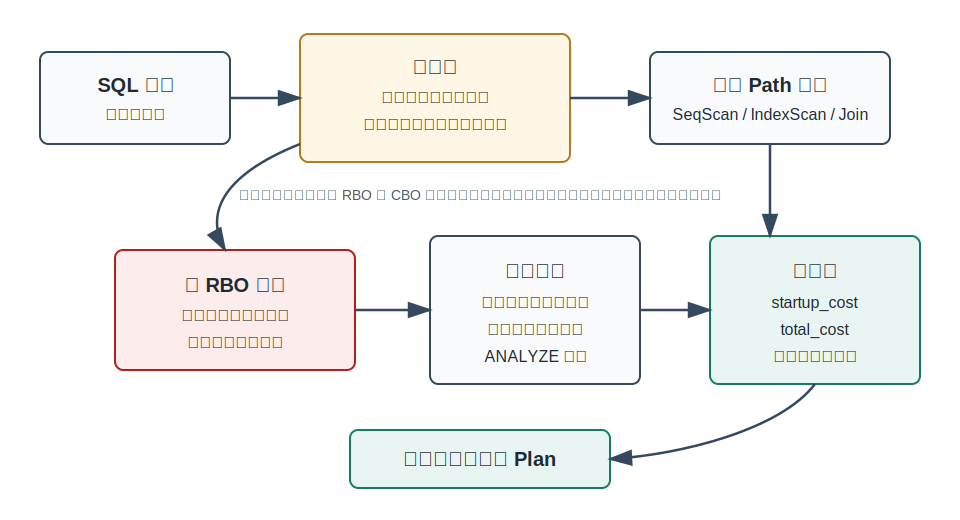
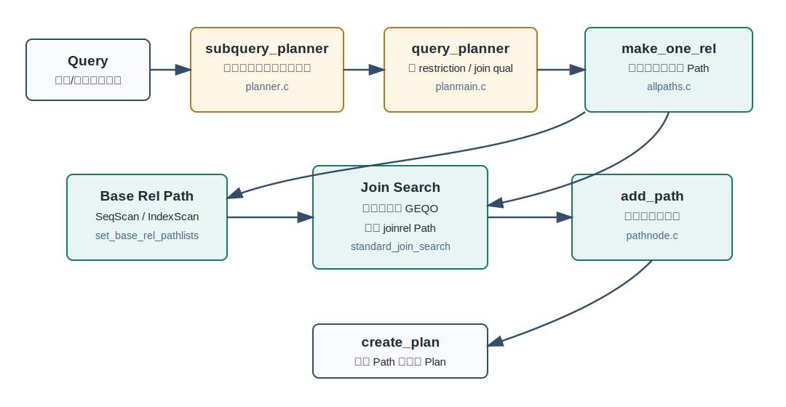
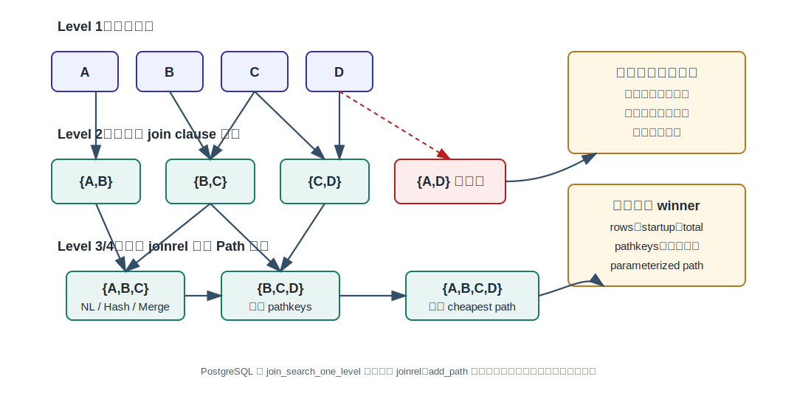
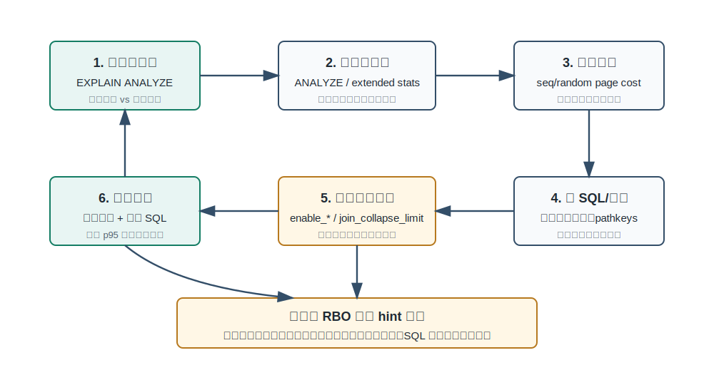

## 数据库筑基课 - 优化器之 RBO

### 作者
digoal

### 日期
2026-05-31

### 标签
PostgreSQL , 应用开发者 , 数据库筑基课 , 优化器 , RBO , CBO , Query Optimizer

----

## 背景


本文属于“扫描与执行算法 / 优化器”类基础能力：理解数据库如何从 SQL 的逻辑表达式走到可执行计划，以及“规则”在这个过程中到底做什么。

业务现场经常出现这样的争论：

```sql
SELECT o.order_id, c.level, p.category
FROM orders o
JOIN customers c ON c.customer_id = o.customer_id
JOIN products p ON p.product_id = o.product_id
WHERE o.created_at >= now() - interval '7 days'
  AND c.region = 'CN'
  AND p.category = 'database';
```

有人会说：“有索引就应该先走索引。”也有人会说：“小表应该先驱动大表。”这些说法有时正确，有时会把系统带偏。因为 SQL 优化不是只靠几条固定规则就能稳定解决的问题：同样的 SQL，在 1 万行、10 亿行、冷热数据比例不同、列相关性不同、索引聚簇程度不同的时候，正确计划可能完全不同。

本文聚焦 RBO，也就是 rule-based optimization，但会特别强调一个边界：PostgreSQL 主优化器不是纯 RBO，而是以规则生成和裁剪候选路径，再用统计信息与代价模型选择路径的 CBO 系统。

本文主要依据 PostgreSQL 本地源码与文档：`src/backend/optimizer/README`、`src/backend/optimizer/plan/planmain.c`、`src/backend/optimizer/path/allpaths.c`、`src/backend/optimizer/path/joinrels.c`、`src/backend/optimizer/path/costsize.c`、`src/backend/optimizer/util/pathnode.c`、`src/backend/optimizer/geqo/*`、`doc/src/sgml/config.sgml`、`doc/src/sgml/indices.sgml`、`doc/src/sgml/perform.sgml`、`doc/src/sgml/planstats.sgml`、`doc/src/sgml/geqo.sgml`，并参考 DeepWiki 对 `postgres/postgres` 查询处理架构的说明。题目中列出的论文 `An Algorithm for Efficient Evaluation of Relational Expressions`、`Evaluation of Expressions in a Relational Database System`、`The Cascades Framework for Query Optimization`、`Extensible/Rule-Based Query Optimization in Calcite` 作为优化器谱系背景使用；当前工作区未提供论文全文，所以本文不引用其中实验数字。

## 一、它解决什么问题？

RBO 解决的原始问题是：关系代数表达式有大量等价写法，数据库需要用一组确定性规则把“能改写的、值得考虑的、合法的”计划候选组织起来。

最简单的例子：

```sql
SELECT *
FROM orders o
JOIN customers c ON c.customer_id = o.customer_id
WHERE c.region = 'CN';
```

逻辑上可以先 join 再过滤，也可以把 `c.region = 'CN'` 尽早推到 `customers` 上。谓词下推通常是好规则，因为它减少后续 join 的输入。但“通常”不是“永远”。如果谓词包含 volatile 函数、外连接空值语义、权限屏障、泄漏风险、窗口函数边界，盲目下推可能改变结果或泄露信息。

RBO 的价值在于：

- 用等价变换把 SQL 改成更容易执行的形式。
- 用合法性规则排除会改变语义的 join 顺序或谓词移动。
- 用启发式规则减少搜索空间，避免优化阶段爆炸。
- 给扩展系统提供规则入口，让新算子、新数据源、新路径能被纳入优化。

它的代价也很清楚：

- 如果只靠固定优先级，不看数据量和分布，很容易选错。
- 规则越多，规则冲突、重复搜索和终止条件越难管理。
- “看起来总是好”的规则在外连接、NULL、函数副作用、相关子查询、分区、并行、FDW 下可能有边界。
- 对生产调优来说，RBO 思维容易滑向“强制计划”，掩盖统计信息、代价参数、SQL 形态和索引设计的根因。

一句话：RBO 先解决“哪些计划可以被考虑”，CBO 再解决“哪个计划最便宜”。现代优化器很少只做其中一个。

## 二、它是什么？

RBO 是 Rule-Based Optimizer，直译是基于规则的优化器。它使用预定义规则改写查询或选择计划，例如：

- 选择下推：`filter(join(A,B)) -> join(filter(A),B)`，前提是谓词只引用 `A` 且语义安全。
- 投影下推：尽早丢掉后续不用的列。
- 常量折叠：`where x = 1 + 2 -> where x = 3`。
- 子查询拉平：把一部分 subquery 变成 join。
- join 重排：`A join B join C` 在内连接等价条件下可以换顺序。
- 访问路径规则：有可用索引时生成 index scan 候选。
- 物理算子规则：等值连接可生成 hash join、merge join、nested loop 等候选。

容易混淆的是两件事：

| 概念 | 含义 | 风险 |
|---|---|---|
| 规则改写 | 保持语义等价或在语义约束下改写表达式 | 规则边界判断错会改变结果 |
| 规则选计划 | 按固定优先级直接挑物理计划 | 不看数据分布，容易误选 |
| 代价优化 | 枚举候选路径后用成本比较 | 依赖统计信息和成本参数质量 |
| hint / 开关 | 人为禁止或鼓励某类计划 | 可用于诊断，长期使用会固化错误假设 |

PostgreSQL 的主线更接近“规则 + 代价”的组合：规则负责把候选 Path 生成出来，并排除语义非法或明显无意义的候选；`costsize.c` 估算路径成本；`add_path()` 保留有竞争力的路径；最终选择 cheapest Path 转成 Plan。



图 1 说明：规则层不是最终裁判。它把 SQL 变成候选空间，并控制哪些候选有资格参加比较；代价层根据行数、页数、选择率、随机/顺序 IO、CPU、排序和并行成本等信息选择 winner。纯 RBO 的主要风险是把“生成候选的经验”误当成“选择计划的真理”。

## 三、核心原理

### 3.1 PostgreSQL 优化器主链路

PostgreSQL 源码注释把优化器主入口说得很直接：`planner()` 是入口，`subquery_planner()` 做子查询和条件预处理，`grouping_planner()` 处理聚合、排序、DISTINCT、LIMIT 等上层结构，`query_planner()` 处理基础扫描和 join，最后把 Path 转成 Plan。

核心链路可以简化为：

```text
planner()
  subquery_planner()
    grouping_planner()
      query_planner()
        make_one_rel()
          set_base_rel_pathlists()
          make_rel_from_joinlist()
            standard_join_search() / geqo() / join_search_hook
              join_search_one_level()
              add_paths_to_joinrel()
              add_path()
      create_plan()
```

对应源码：

| 阶段 | 关键文件/函数 | 作用 |
|---|---|---|
| 预处理 | `planner.c` / `subquery_planner()` | 子查询拉平、条件规范化、常量简化、Sublink 处理 |
| 基础查询规划 | `planmain.c` / `query_planner()` | 构造 base rel，拆 restriction 与 join qual，建立等价类 |
| 扫描路径 | `allpaths.c` / `set_base_rel_pathlists()` | 为每个基础关系生成 seq scan、index scan、bitmap scan 等候选 |
| join 搜索 | `allpaths.c` / `standard_join_search()` | 动态规划枚举 joinrel |
| join 组合 | `joinrels.c` / `join_search_one_level()` | 按 level 生成二表、三表、更多表 join |
| 路径竞争 | `pathnode.c` / `add_path()` | 按 cost、pathkeys、参数化、并行安全等保留非支配路径 |
| 代价估算 | `costsize.c` | 估算 scan、join、sort、agg 等路径成本 |



图 2 说明：PostgreSQL 的计划生成不是“遇到索引就直接用索引”。它会先构造多个 Path。基础表有扫描 Path，joinrel 有 join Path，上层还有排序、聚合、并行等 Path。最后只有成本、排序需求、参数化需求、合法性都占优的路径会留下。

### 3.2 规则先把表达式变成可比较的搜索空间

`query_planner()` 里有很多看起来不像“RBO”的规则动作：

- `deconstruct_jointree()`：拆解 join tree，收集限制条件和连接条件。
- `reconsider_outer_join_clauses()`：在等价类建立后重新考虑外连接条件。
- `generate_base_implied_equalities()`：从等价类推出可用于基础关系的限制。
- `remove_useless_joins()`：删除无用外连接。
- `reduce_unique_semijoins()`：把部分 semijoin 降成普通 inner join。
- `remove_useless_self_joins()`：消除特定自连接。
- `extract_restriction_or_clauses()`：从 join OR 条件中提取单表 restriction OR。
- `add_other_rels_to_query()`：展开 appendrel，并在已有条件基础上进行分区裁剪。

这些动作的共同点是：它们不是直接宣判“最终计划用什么”，而是把表达式整理成更适合枚举和估价的状态。比如分区裁剪可以让某些分区根本不进入后续扫描候选；join removal 可以让一个关系从搜索空间消失；等价类可以推导出更多可用于索引或 merge join 的条件。

这就是现代优化器中 RBO 最健康的位置：规则改变搜索空间，代价模型在搜索空间内比较。

### 3.3 join 顺序：动态规划不是简单左深树

PostgreSQL 优化器 README 说明，标准非 GEQO planner 会使用动态规划生成 joinrel：先考虑二表 join，再考虑三表 join，逐层直到包含所有表的最终 joinrel。它会考虑 left-handed、right-handed 和 bushy plans。

`join_search_one_level()` 的逻辑体现了几条重要规则：

- 优先考虑存在 join clause 或 join-order restriction 的关系组合。
- 没有连接条件时才生成笛卡尔积候选。
- bushy join 只在有相关 join clause 或 join-order restriction 时考虑，避免搜索空间无节制膨胀。
- 外连接、半连接、反连接、LATERAL 等会通过合法性检查限制 join 顺序。

这不是传统意义上“按规则选一个 join order”。它是在规则约束下枚举可行 joinrel，再让不同实现路径竞争。



图 3 说明：同一组关系 `{A,B,C}` 可以由不同 join 顺序生成，但会落到同一个 joinrel 上；不同生成方式会向同一 joinrel 添加不同 Path。`add_path()` 会让这些 Path 竞争，保留成本、排序、并行安全或参数化方面仍有价值的候选。规则负责“能不能生成”和“是否值得生成”，不是固定指定最终顺序。

### 3.4 Path 竞争：规则开关只是成本比较的高阶输入

`add_path()` 的注释很关键：一个 Path 值不值得保留，不只看 `total_cost`。它还看：

- `startup_cost`：拿到第一批行前的成本，LIMIT、EXISTS、cursor 场景很重要。
- `total_cost`：取完全部行的总成本。
- `pathkeys`：输出是否已经有序，能不能省掉上层 sort。
- parameterization：是否依赖外层关系参数，常见于 nested loop 内侧索引扫描。
- rows：估算输出行数。
- parallel safe：是否可在并行计划中使用。
- disabled nodes：是否使用了用户通过 `enable_*` 关闭的路径类型。

这解释了为什么 `SET enable_seqscan = off` 不是“绝对禁止顺序扫描”。PostgreSQL 文档也说明，`enable_seqscan` 只能 discourages 顺序扫描；如果没有其他合法方法，仍可能使用顺序扫描。源码里当前路径会记录 `disabled_nodes`，比较时它是成本的高阶组成部分。也就是说，关闭某类计划更像给它加了强烈惩罚，而不是物理删除所有可能性。

### 3.5 代价模型为什么必须存在

`costsize.c` 开头列出了 PostgreSQL 代价模型的基础参数：

- `seq_page_cost`：顺序读页成本，默认按 1.0 标定。
- `random_page_cost`：随机读页成本，默认 4.0。
- `cpu_tuple_cost`：处理一行 tuple 的 CPU 成本。
- `cpu_index_tuple_cost`：处理一行 index tuple 的 CPU 成本。
- `cpu_operator_cost`：执行操作符或函数的 CPU 成本。
- `parallel_setup_cost` / `parallel_tuple_cost`：并行启动和 tuple 传输成本。
- `effective_cache_size`：PostgreSQL 加操作系统层面的缓存规模粗估。

`cost_seqscan()` 会用表页数计算顺序 IO 成本，用 tuple 数与 qual 成本计算 CPU 成本。`cost_index()` 会调用索引访问方法自己的 `amcostestimate`，拿到 index 成本、选择率、索引顺序与 heap 顺序相关性，再估算 heap page fetch 成本；对于 index-only scan，还会根据 visibility map 的 all-visible 比例减少 heap fetch。

如果只有 RBO，这些信息都无处安放。规则可以说“索引等值查询通常好”，但不能回答：

- 表只有 1 页，走索引是否比顺序扫描更慢？
- 返回 30% 行时，随机 heap fetch 是否比顺序扫描更贵？
- 索引顺序和 heap 物理顺序高度相关时，index scan 的 IO 是否接近顺序读？
- 数据大部分已缓存时，`random_page_cost` 是否应该下调？
- LIMIT 10 时，低 startup cost 是否比低 total cost 更重要？

所以，RBO 的合理边界是“定义候选与合法性”，不是替代代价模型。

### 3.6 GEQO：启发式搜索不是 RBO 回潮

当 join 表很多时，穷举动态规划会太贵。PostgreSQL 的 GEQO 是 Genetic Query Optimizer，文档说明它用启发式搜索降低复杂查询规划时间，代价是有时会得到不如穷举搜索的计划。默认 `geqo_threshold` 是 12，也就是 FROM 项达到阈值时可能启用。

源码里 `geqo()` 会维护种群、选择、重组，并用 `geqo_eval()` 评估一个 join tour 的成本。`gimme_tree()` 会按 tour 构造 join clump，但仍要遵守 join 合法性和 desirability；最终 fitness 取 cheapest total path 的 cost。

这说明 GEQO 也不是纯 RBO。它是搜索策略从“穷举动态规划”变成“启发式抽样”，但每个候选仍要走路径生成和代价评估。

## 四、横向对比

| 维度 | 纯 RBO | PostgreSQL 主优化器 | Cascades/Volcano 类框架 | Calcite 规则优化 |
|---|---|---|---|---|
| 主要目标 | 用固定规则快速决策 | 规则生成候选，代价选择 Path | 用 memo 管理等价表达式和物理实现 | 规则驱动关系表达式改写与物理转换 |
| 是否依赖统计信息 | 通常弱依赖或不依赖 | 强依赖 `pg_statistic`、成本参数 | 强依赖统计和成本模型 | 取决于 planner，VolcanoPlanner 可结合成本 |
| 搜索空间管理 | 规则优先级和启发式 | 动态规划、GEQO、join 限制、path pruning | memo group、rule promise、cost bound | HepPlanner 偏规则批处理，VolcanoPlanner 偏成本搜索 |
| 计划质量 | 简单场景稳定，复杂场景易错 | 统计准确时通常较好 | 工程复杂但扩展性强 | 适合可扩展 SQL 引擎和联邦查询 |
| 规划开销 | 低 | 中等，多表 join 可高 | 可能较高，需要工程控制 | 取决于规则集和 planner 配置 |
| 扩展性 | 差，规则耦合重 | hook、FDW、access method、support function 等 | 强，规则和实现可插拔 | 强，RelNode/Rule/Convention 体系 |
| 典型风险 | 固定规则误判 | 统计失真导致成本误判 | memo 膨胀、规则爆炸 | 规则顺序、终止和成本质量 |

几个判断：

- System R 之后，主流优化器很难绕开成本模型，因为访问路径、join 顺序和 join 方法高度依赖数据分布。
- Cascades/Volcano 的核心贡献不是“规则越多越好”，而是把逻辑等价表达式、物理实现、规则应用和成本搜索组织成可扩展框架。
- Calcite 常被说成 rule-based，是因为它把优化规则显式暴露成 `RelOptRule`；但 Calcite 的 VolcanoPlanner 仍可做成本驱动搜索。把 Calcite 简化成“纯 RBO”是不准确的。
- PostgreSQL 没有采用 Cascades memo 作为主优化器组织形式，但它有自己的 RelOptInfo/Path 动态规划结构，目标同样是管理候选空间并比较代价。

## 五、效果如何？

RBO 思想在现代数据库里仍然有效，但效果体现在“减少错误候选”和“减少搜索成本”，不是体现在“用规则替代统计”。

收益：

- 预处理规则可以减少后续规划对象，例如 join removal、分区裁剪、约束排除。
- 谓词和等价类推导可以让索引、merge join、partition pruning 有机会出现。
- join 合法性规则保证外连接、半连接、反连接、LATERAL 等语义不被破坏。
- join 搜索启发式能避免无连接 bushy join 造成的搜索爆炸。
- `enable_*` 开关能帮助 DBA 做对照实验，定位“计划没生成”还是“生成了但成本不划算”。

代价：

- 规则判断本身有规划 CPU 成本，尤其是多表 join、分区多、OR 条件多、等价类多时。
- 过强的规则开关会让优化器错过真实更优计划。
- 如果统计信息错误，CBO 会在错误输入上做出“看起来合理但实际很差”的选择。
- 如果 SQL 写法让谓词不可下推或索引条件不可识别，规则层无法凭空生成好候选。

PostgreSQL 文档对索引调优给了很务实的建议：先 `ANALYZE`，用真实数据实验；数据很小时顺序扫描可能自然更优；如果强制关闭某类计划后新计划更快，要继续判断是成本参数问题还是选择率统计问题，而不是把开关当最终方案。

## 六、实操 DEMO

下面的例子用于观察“规则开关、统计信息、代价模型”如何共同影响计划。SQL 语法可在 PostgreSQL 中执行；本文未在本地启动 PostgreSQL 实例，所以不提供伪造的 EXPLAIN 输出。

### 6.1 准备数据

```sql
DROP TABLE IF EXISTS demo_orders;
DROP TABLE IF EXISTS demo_customers;

CREATE TABLE demo_customers (
    customer_id bigint PRIMARY KEY,
    region text NOT NULL,
    level int NOT NULL
);

CREATE TABLE demo_orders (
    order_id bigint PRIMARY KEY,
    customer_id bigint NOT NULL REFERENCES demo_customers(customer_id),
    created_at timestamptz NOT NULL,
    amount numeric(12,2) NOT NULL,
    status text NOT NULL
);

INSERT INTO demo_customers
SELECT g,
       CASE WHEN g <= 10000 THEN 'CN' ELSE 'US' END,
       (g % 5) + 1
FROM generate_series(1, 100000) AS g;

INSERT INTO demo_orders
SELECT g,
       (random() * 99999 + 1)::bigint,
       now() - (random() * interval '180 days'),
       (random() * 1000)::numeric(12,2),
       CASE WHEN random() < 0.9 THEN 'paid' ELSE 'cancelled' END
FROM generate_series(1, 1000000) AS g;

CREATE INDEX demo_orders_customer_created_idx
ON demo_orders(customer_id, created_at);

CREATE INDEX demo_customers_region_idx
ON demo_customers(region);

ANALYZE demo_customers;
ANALYZE demo_orders;
```

### 6.2 观察基础计划

```sql
EXPLAIN (ANALYZE, BUFFERS, VERBOSE)
SELECT count(*), sum(o.amount)
FROM demo_orders o
JOIN demo_customers c ON c.customer_id = o.customer_id
WHERE c.region = 'CN'
  AND o.created_at >= now() - interval '30 days'
  AND o.status = 'paid';
```

重点看三件事：

- `rows=估算` 与 `actual rows=实际` 是否差几个数量级。
- join 方法是 Hash Join、Nested Loop 还是 Merge Join。
- 过滤条件是否成为 index condition，还是只在 filter 中执行。

### 6.3 用开关做对照实验

```sql
BEGIN;

SET LOCAL enable_hashjoin = off;
EXPLAIN (ANALYZE, BUFFERS)
SELECT count(*), sum(o.amount)
FROM demo_orders o
JOIN demo_customers c ON c.customer_id = o.customer_id
WHERE c.region = 'CN'
  AND o.created_at >= now() - interval '30 days'
  AND o.status = 'paid';

ROLLBACK;
```

再比较：

```sql
BEGIN;

SET LOCAL enable_nestloop = off;
EXPLAIN (ANALYZE, BUFFERS)
SELECT count(*), sum(o.amount)
FROM demo_orders o
JOIN demo_customers c ON c.customer_id = o.customer_id
WHERE c.region = 'CN'
  AND o.created_at >= now() - interval '30 days'
  AND o.status = 'paid';

ROLLBACK;
```

这些开关的正确用途是“验证其他候选是否存在、成本估算是否可能失真”。不要在应用里长期依赖 `SET enable_hashjoin = off` 这类做法，因为数据分布、版本、缓存状态和 SQL 组合一变，固定规则就可能反噬。

### 6.4 观察 join 顺序限制

```sql
BEGIN;

SET LOCAL join_collapse_limit = 1;

EXPLAIN (ANALYZE, BUFFERS)
SELECT count(*)
FROM demo_customers c
JOIN demo_orders o ON o.customer_id = c.customer_id
WHERE c.region = 'CN'
  AND o.created_at >= now() - interval '30 days';

ROLLBACK;
```

`join_collapse_limit = 1` 会阻止显式 JOIN 被重排，文档明确说高级用户可以临时使用它并手写希望的 join 顺序。但这仍是诊断手段。长期方案通常应该回到：统计信息是否准确、索引是否匹配谓词和连接键、SQL 是否表达了正确过滤条件。

### 6.5 修复多列相关性

如果 `region`、`level` 这类列高度相关，单列统计可能低估或高估组合条件选择率。可以尝试扩展统计：

```sql
CREATE STATISTICS demo_customers_region_level_stats
    (dependencies, mcv)
ON region, level
FROM demo_customers;

ANALYZE demo_customers;

EXPLAIN (ANALYZE, BUFFERS)
SELECT *
FROM demo_customers
WHERE region = 'CN'
  AND level = 3;
```

这比强行开关更接近根因：让优化器拥有更真实的选择率输入。



图 4 说明：计划问题不要一上来就“调规则”。先用 `EXPLAIN (ANALYZE, BUFFERS)` 找估算偏差，再修统计信息、成本参数、SQL 形态和索引契约。`enable_*` 与 `join_collapse_limit` 适合做对照实验，不适合作为长期的业务逻辑依赖。

## 七、最佳实践

### 7.1 面向数据库架构师

把优化器当成“候选空间 + 成本模型”的系统设计问题，而不是 hint 问题。

- 设计表模型时，让常用谓词、连接键、排序键能被优化器识别。
- 对高相关列、组合过滤列、倾斜列，预留扩展统计策略。
- 对分区表，保证分区键和典型查询过滤条件一致，否则规则层无法有效裁剪。
- 对多租户、大宽表、冷热分层，明确哪些 SQL 依赖局部索引、部分索引或覆盖索引。
- 对跨库、FDW、湖仓外表，理解远端下推能力边界。规则下推失败时，本地端可能承担巨大数据搬运成本。

### 7.2 面向 DBA

优先修输入，再修选择。

- 先看 `EXPLAIN (ANALYZE, BUFFERS)`，比较估算行数和实际行数。
- 保证 autovacuum / autoanalyze 正常，批量导入后主动 `ANALYZE`。
- 针对倾斜列调高 statistics target，而不是全库盲目调高。
- 对明显相关的列创建 extended statistics。
- 调整 `random_page_cost`、`seq_page_cost` 前先确认存储、缓存和工作负载，不要用单条 SQL 校准全局参数。
- `enable_seqscan`、`enable_nestloop`、`enable_hashjoin`、`enable_mergejoin` 用 `SET LOCAL` 做实验，避免污染连接池会话。
- 多表 join 规划时间过长时，再评估 `geqo_threshold`、`join_collapse_limit`、SQL 拆分和物化边界。

### 7.3 面向业务开发者

写 SQL 时要让优化器“看得懂”。

- 连接条件写清楚，不要把 join key 藏在不可索引表达式里。
- 避免在过滤列上随意包函数，例如 `date(created_at) = ...` 可能让普通索引失效；更常见的写法是范围条件。
- 外连接后在 `WHERE` 中过滤右表列要小心，它可能改变外连接语义。
- 需要稳定顺序时写明确 `ORDER BY`，不要依赖当前计划偶然输出顺序。
- 分页、TOP-N、EXISTS 类 SQL 要关注 startup cost，不只看 total cost。
- 不要在应用代码里长期写优化器开关。它们不是业务语义的一部分。

## 八、适合与不适合场景

适合强调 RBO 思维的场景：

- 理解谓词下推、投影下推、join removal、分区裁剪、子查询拉平等机制。
- 设计数据库扩展、FDW、索引访问方法、planner support function。
- 调试“为什么某个候选计划没有出现”。
- 控制大 join 搜索空间，降低优化阶段成本。
- 教学中解释逻辑等价和物理实现的分层。

不适合把 RBO 当主策略的场景：

- 大表和倾斜数据上的访问路径选择。
- 多列相关性明显的业务查询。
- 缓存命中率、存储介质差异很大的系统。
- OLTP 与 OLAP 混合负载。
- 版本升级后希望计划长期保持不变的场景。
- 用固定规则替代 `ANALYZE`、扩展统计、索引设计和 SQL 改写。

## 九、常见坑

### 坑 1：以为“有索引就一定该走索引”

小表、低选择性、随机 heap fetch 多、索引和 heap 相关性差时，顺序扫描可能更便宜。PostgreSQL 文档也提醒，测试数据太小会误导索引判断，因为少量行可能只占一个 page。

### 坑 2：把 `enable_seqscan = off` 当生产方案

这个开关用于诊断。长期关闭会让某些本该顺序扫描的查询变慢，也可能导致版本和数据变化后出现更差计划。正确动作是查统计、选择率、成本参数和索引契约。

### 坑 3：忽略 join 顺序合法性

内连接很多时候可交换、可结合，但外连接、半连接、反连接、LATERAL、volatile 函数、leakproof 边界会限制重排。不能把所有 join 都当成普通内连接。

### 坑 4：把 Cascades/Calcite 理解成“规则越多越好”

规则系统的难点是搜索控制、终止、重复表达式管理和成本剪枝。没有 memo 或路径竞争机制，规则越多越可能爆炸。

### 坑 5：只看计划节点名字，不看估算偏差

看到 Hash Join 或 Nested Loop 本身不能说明对错。关键是输入行数估算是否准确、内外表选择是否合理、是否重复扫描大表、是否发生不必要排序或临时文件。

### 坑 6：把 SQL 写成优化器难以识别的形态

函数包列、隐式类型转换、复杂 OR、不可下推 CTE 边界、表达式和索引不匹配，都会让好候选计划无法生成。此时不是“优化器太笨”，而是规则层拿不到可用模式。

## 十、扩展问题

1. 如果一个查询在测试库走 index scan、生产库走 seq scan，你会先比较哪些统计信息和成本参数？
2. `join_collapse_limit = 1` 能让 PostgreSQL 尊重显式 JOIN 顺序。它适合用在什么诊断场景？为什么不适合作为应用默认设置？
3. 对一个 15 表 join，GEQO 可能比穷举 planner 更快但计划更差。你如何判断规划时间和执行时间之间的取舍？
4. 如果你要为 PostgreSQL 扩展一个新索引访问方法，应该提供哪些信息，才能让 CBO 正确比较它和普通扫描？
5. Calcite 里的 HepPlanner 和 VolcanoPlanner 分别适合哪类优化任务？它们和 PostgreSQL 的 RelOptInfo/Path 思路有什么共同点？

## 十一、扩展阅读

- PostgreSQL 源码：`src/backend/optimizer/README`
- PostgreSQL 源码：`src/backend/optimizer/plan/planmain.c`
- PostgreSQL 源码：`src/backend/optimizer/path/allpaths.c`
- PostgreSQL 源码：`src/backend/optimizer/path/joinrels.c`
- PostgreSQL 源码：`src/backend/optimizer/path/costsize.c`
- PostgreSQL 源码：`src/backend/optimizer/util/pathnode.c`
- PostgreSQL 源码：`src/backend/optimizer/geqo/geqo_main.c`、`src/backend/optimizer/geqo/geqo_eval.c`
- PostgreSQL 文档：`doc/src/sgml/config.sgml` 中 planner method、planner cost constants、GEQO、join collapse 相关配置
- PostgreSQL 文档：`doc/src/sgml/indices.sgml` 中 examining index usage 章节
- PostgreSQL 文档：`doc/src/sgml/perform.sgml` 与 `doc/src/sgml/planstats.sgml` 中统计信息和选择率估算说明
- PostgreSQL 文档：`doc/src/sgml/geqo.sgml`
- DeepWiki：`postgres/postgres` 查询处理和优化器架构说明，已用于交叉核对 planner、Path 生成、join search、costsize 和 GEQO 的模块关系
- Selinger 等：`An Algorithm for Efficient Evaluation of Relational Expressions`
- Stonebraker/Wong/Kreps/Held：`The Design and Implementation of INGRES` 以及 `Evaluation of Expressions in a Relational Database System` 相关早期关系优化器工作
- Graefe：`The Cascades Framework for Query Optimization`
- Apache Calcite 文档与源码：`RelOptRule`、`HepPlanner`、`VolcanoPlanner`
  
## 附录 
1、问 gemini
```
数据库 RBO 优化器相关的论文
```

2、克隆代码  
```  
git clone --depth 1 https://github.com/postgres/postgres
```  
  
3、启用 codex, 使用 [数据库筑基课 skill](../skills/README.md).  
```
文章标题: 
  数据库筑基课 - 优化器之 RBO
项目源码(本地目录):  
  postgres
项目 codebase 文件名: 
  postgres/CLAUDE.md
相关的论文或文档名:
  An Algorithm for Efficient Evaluation of Relational Expressions
  Evaluation of Expressions in a Relational Database System
  The Cascades Framework for Query Optimization
  Extensible/Rule-Based Query Optimization in Calcite
开源项目相关的 deepwiki repoName: 
  postgres/postgres
```

  
  
#### [PostgreSQL 解决方案集合](../201706/20170601_02.md "40cff096e9ed7122c512b35d8561d9c8")
  
  
#### [德哥 / digoal's Github - 公益是一辈子的事.](https://github.com/digoal/blog/blob/master/README.md "22709685feb7cab07d30f30387f0a9ae")
  
  
#### [About 德哥](https://github.com/digoal/blog/blob/master/me/readme.md "a37735981e7704886ffd590565582dd0")
  
  

  
